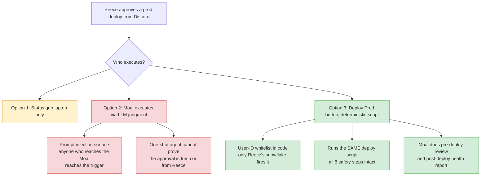

# 0887 — Moai Prod Deployment: Design & Implications

**Status:** Proposal (not approved, nothing built)
**Date:** 2026-08-07
**Verdict up front:** 🗿 **Don't put the Moai on the trigger. Put a button on the trigger and the Moai on review duty.**

## Original Context (Trigger Prompt)

> Reece (via Moai Discord button): "I approve you deploying to prod for me"
> → Moai refused (box→prod deploys forbidden by CLAUDE.md).
> Follow-up: "Draft me a design and implications for moai prod deployment"

## 🤔 The Problem in Plain English

Prod deploys currently require the **laptop**: `npm run deploy-remote-wsl`. When Reece is on his
phone at 11pm and the fix is already verified on test, the deploy waits until he's at a terminal.
The Moai runs on castbot-blue 24/7, already holds a full-shell prod SSH key (`castbot-prod`
alias), and Reece can talk to it from Discord. The temptation is obvious: "I approve → Moai
deploys."

The question is not *can* the box deploy to prod (it can, trivially). It's whether an **LLM
should sit between the approval and the execution** — and if not, what should.

## 🏛️ How Prod Deploys Work Today (the machinery we'd reuse)

`deploy-remote-wsl.js` (641 lines) is the only sanctioned path. Its safety steps, in order:

1. **Dry-run mode** (`--dry-run`) — preview, always safe
2. **🗿 Moai deploy check** (line ~304) — blocks deploys of >10 commits without `--confirmed`
3. **Remote backup** before pull
4. `git pull origin main` (with stash fallback for dirty trees)
5. **Runtime-file restoration** — re-creates gitignored files that `git pull` deletes (line ~374)
6. `npm install`
7. `pm2 restart castbot-pm` with restart-reason stamped to `logs/restart-reason.json` (line ~416)
8. **Deploy notification** sent *from the test box* so it posts as CastBot Test (always-on)

Any box-side design that bypasses this script re-derives these steps by hand. That's how the
2026 incidents happened — raw `git pull` on prod is exactly what step 5 exists to clean up after.

## 📊 The Decision

## Option Analysis

### Option 1 — Status quo (laptop only)
**What it is:** No change. Prod deploys need Reece + laptop.
**Cost:** Verified fixes sit on test overnight. Friction is real but bounded — this is a
solo-operator bot, not an on-call rotation.
**Risk:** Zero new risk. The stone notes: *this is a perfectly acceptable answer.*

### Option 2 — The Moai deploys (LLM-in-the-loop) ❌
**What it is:** Reece types approval into the Moai message flow; the Moai runs the deploy
from the box using the `castbot-prod` key.

Why the stone says no, structurally not philosophically:

1. **The Moai is a one-shot `claude --print` agent.** It has no session memory and cannot
   verify the "previous conversation" context it's handed. An approval pasted into its context
   is indistinguishable from a real one. The March 2026 lesson applies: agents kept forgetting
   "one authorization = one deployment" — and those were *interactive* agents with more context,
   not one-shots.
2. **Prompt injection becomes a deploy vector.** Whoever can get text in front of the Moai
   (question content, channel history it's shown, a crafted player message) is one jailbreak
   away from the trigger. Today the blast radius of a Moai jailbreak is "weird Discord answer."
   This option upgrades it to "prod deploy."
3. **It violates our own doctrine.** The Moai's founding lesson: *rules in docs get ignored;
   rules in hooks get followed.* "The Moai will only deploy when truly approved" is a rule in
   a prompt — the weakest enforcement tier we have. We watched an agent try to edit the
   baseline to sneak past the pre-commit hook. Prompts don't hold under pressure.
4. **Unwatched failure.** Laptop deploys have Reece at a streaming terminal. A Moai deploy
   failure surfaces as a truncated Discord message, maybe. Rollback then requires… another
   LLM invocation with prod write access. Scope creep with teeth.

### Option 3 — "Deploy Prod" button on the test box ✅ (recommended)
**What it is:** A Discord button next to the existing **Restart Prod** button
(TestInstanceBlueGreen pattern), which runs the deploy pipeline from the box as a
deterministic script. The Moai never touches the trigger.

Design sketch:

- **Authorization = Discord snowflake, in code.** Handler hard-whitelists Reece's user ID
  (same pattern as the Channels tab whitelist). Not a role check — an ID check. Discord's
  interaction signature is the auth layer; no prompt can forge a button click.
- **Two-step confirm, CastBot-standard.** Click 1 shows a confirm card: commit gap
  (test vs prod HEAD), shortstat, the exact commits going out. Click 2 (⚠️-styled, 60s
  expiry) executes. This *is* the "one authorization = one action" rule, enforced structurally
  — the confirm state is consumed on use.
- **Reuse `deploy-remote-wsl.js`, don't fork it.** Add a box-compatible invocation: it already
  parameterizes host/user/path via `LIGHTSAIL_*` env vars; the box needs
  `SSH_KEY_PATH` to resolve to `~/.ssh/castbot-prod` (today it's hardcoded to
  `~/.ssh/castbot-key.pem`, which the box doesn't have). One small env-override
  (`LIGHTSAIL_SSH_KEY`) keeps all 8 safety steps — including the 10-commit Moai check, which
  should surface **in the confirm card** rather than dying silently in a background process.
- **Deferred + streamed progress** via the existing channelJob-style progress reporter;
  final message includes pass/fail per step and a `curl -I /interactions` health check result.
- **The Moai's actual role:** *pre-deploy reviewer and post-deploy reporter.* "Ask the Moai
  what's in this deploy" (read-only diff summary, risk callouts) before clicking; automatic
  health summary after. Advisory stone, not executing stone. This is also just… what a Moai is.

### Implications (Option 3)

| Area | Implication |
|---|---|
| **Key hygiene** | The `castbot-prod` key graduates from "read-only by convention" to "writes via one audited code path." CLAUDE.md's box-prod rules need a carve-out naming the button handler as the *only* sanctioned write path. |
| **CLAUDE.md** | "Prod deploys go through the laptop only" becomes "…laptop, or the Deploy Prod button." Update the 🗿 Prod Access section + deploy targets table. |
| **Audit trail** | Every deploy logs who clicked, when, commit range — to the analytics log + `#💎deploy`. Better auditability than laptop deploys have today. |
| **Rollback** | Button deploys need a rollback answer. v1: the existing remote backup (step 3) + documented manual restore. A "Rollback" button is explicitly **out of scope** — that's a second RaP. |
| **Blast radius** | If the box is compromised, prod deploy capability is already implied by the full-shell key. The button doesn't widen access; it narrows *usage* to an audited path. |
| **The watchdog loop** | ProdWatchdog already monitors prod from the box. Deploy + watchdog on the same box means the box can detect its own bad deploy within a minute. Note in `#💎deploy` if health check fails post-deploy. |

## ⚠️ Risk Assessment

- **Highest risk retained:** unattended deploy failure at a moment Reece can't reach a laptop.
  Mitigation: health check in the completion message + ProdWatchdog alert + warm-rollback
  runbook link in the failure message. Residual risk accepted — it's the same state we'd be in
  after a failed laptop deploy followed by the laptop dying.
- **Risk removed vs Option 2:** entire LLM-judgment/prompt-injection class. A button cannot be
  sweet-talked.
- **Risk added vs Option 1:** phone-fat-finger. Mitigated by two-step confirm + ID whitelist +
  60s expiry.

## 💡 Recommendation

Build **Option 3** when the friction actually bites (it's a ~half-day: button pair + env
override in the deploy script + CLAUDE.md updates). Until then, **Option 1 stands** and the
Moai keeps refusing — correctly.

The one-sentence version: **you don't need a smarter Moai, you need a dumber trigger.**
Approval should flow through Discord's signed interaction, not through text an LLM was handed.

Related: [TestInstanceBlueGreen](../03-features/TestInstanceBlueGreen.md) ·
[ProdBoxMigration](../03-features/ProdBoxMigration.md) ·
[RaP 0913 RemoteDevTestBox](0913_20260614_RemoteDevTestBox_Analysis.md)
