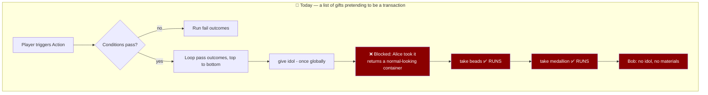
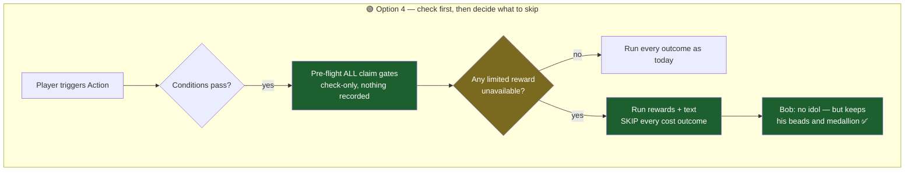

# Partial Outcome Execution — players pay for rewards they never receive

**Status**: 🔴 Open — analysis complete, no code written
**Date**: 2026-08-08
**Severity**: High (silent player-facing data loss, 83 live actions affected)
**Related**: [SafariUsageLimits.md](../03-features/SafariUsageLimits.md) · [SafariCustomActions.md](../03-features/SafariCustomActions.md) · [Crafting.md](../03-features/Crafting.md)

---

## 🎯 Trigger Prompt

Reece, 2026-08-08, verbatim:

> Alrighty something I've been worried about for a while but never gotten to
>
> For outcome types basically other than unlimited, especially for crafting recipes, I THINK at the moment if a player is ineligible to claim an item, it'll still consume / execute any other actions which may be detrimental
>
> example
>
> craft idol -> condition = must have beads, medallion
> pass outcome - once globally - give idol, remove beads, remove medallion
>
> ^^ in this situation, I believe the logic is a 2nd player to complete the action will lose out on their items even though they got nothing in return
>
> this /usually/ isn't the desired effect, logically the user is probably expecting to keep their materials since another player beat them to the punch
>
> what are some options around this? I recognize the design is potentially dangerous / slippery slope, all sorts of order of a execution problems and other logic flaws I see, id rather not do major surgery to the engine

Follow-up: *"I might need you to put your options in human English with a worked example ;)"* — hence the worked example below, which should stay in any rewrite of this doc.

**The suspicion was correct.** Confirmed in code and measured against production.

---

## 🤔 The problem in plain English

A Safari Action runs its outcomes as a **shopping list, top to bottom, never looking back**. Nothing checks whether an earlier line actually worked.

So a crafting recipe that says *"give the idol, take the beads, take the medallion"* will happily take the beads and the medallion from a player it has just refused the idol to.

### Worked example

**Recipe**: Craft Idol. Requires beads + medallion. On success: give idol (**once globally**), take beads, take medallion.

| | |
|---|---|
| **Alice** crafts first | Passes requirements → gets the idol → materials consumed. ✅ Correct. |
| **Bob** crafts 30s later | Passes requirements (he has the materials) → CastBot tries to give the idol → **Alice already took it** → Bob is told "already claimed" → **and then his beads and medallion are taken anyway.** |

Bob is now poorer, holding nothing, having been explicitly told he gets nothing. He has no way to know it was going to happen and no way to undo it.

The rule that *should* hold, and doesn't: **don't charge someone for something they didn't get.**

---

## 🏛️ How we got here (the organic growth story)

Nothing here was designed wrong on purpose. Three reasonable decisions compounded:

1. **Outcomes were originally all "gives."** Display text, give item, give currency. A list of gifts has no failure mode worth handling — if one gift is unavailable, handing over the others is *correct*. A straight top-to-bottom loop was right.

2. **`operation: 'remove'` was added to `give_item`** (Jan 2026) so hosts could build crafting, penalties and quest consumption. The moment an outcome could *take* something, the list stopped being a list of gifts and became a **transaction** — but the loop that runs it never learned the difference.

3. **Usage limits were added independently.** A blocked claim returns a polite ephemeral message. That message is a normal Components V2 container, structurally identical to a success — so even if the loop wanted to notice, there is nothing in the return value to notice *with*.

The gap is the seam between (2) and (3): two features that each work correctly alone, and were never introduced to each other.



---

## 🔍 Evidence

### Code (verified 2026-08-08)

| Fact | Location |
|---|---|
| The outcome loop has **no early exit** — every outcome runs regardless of earlier results | `executeButtonActions`, [safariManager.js](../../safariManager.js) |
| A blocked claim returns a Components V2 container **indistinguishable from a success** — no `blocked` flag, no thrown error | `executeGiveItem` / `executeGiveCurrency` rejection branches |
| Gate logic is already **pure and reusable** — `evaluateClassicGate` (classic presets), `checkLimitGate` (custom) | [claimsManager.js](../../claimsManager.js), [utils/periodUtils.js](../../utils/periodUtils.js) |
| Atomic reserve + rollback primitives **already exist** from the Aug 2026 claims work | `reserveClassicClaim` / `releaseClassicClaim`, [safariManager.js](../../safariManager.js) |

That last row matters: the expensive part of the fix is already built and in production.

### Production data (prod `safariContent.json`, 2026-08-08)

```
83 actions at risk   (a limited reward + a "cost" outcome in the same executeOn branch)
   across 6 guilds

   47  cost ordered AFTER the limited reward   → an abort-on-block would save these
   36  cost ordered BEFORE it                  → only a pre-flight saves these

80 branches contain MORE THAN ONE limited outcome
   → a blunt "if anything is blocked, run nothing" would deny a still-available reward

Limited outcomes by type:  once_per_player 357 · once_per_period 54 · custom 42 · once_globally 7
```

Named live examples: **Craft**, **Grow Cabbage**, **Grow Bud's Spuds**, **Grow Katie's Cuties**, **Give her some rock**, **Check out the boat**.

> ⚠️ Note the 80: it is the single most important number here. It rules out the obvious fix. A daily-login action that grants a coin every day *and* a one-time badge has two limited outcomes; once the badge is claimed, "run nothing" would also withhold the daily coin.

---

## 💡 Options

### Option 1 — Abort the chain at the first blocked claim 🟡

Outcomes signal `blocked`; the loop stops.

- ✅ Cheap: a flag on ~6 rejection returns plus one `if`.
- ❌ Fixes only **47 of 83** — the ones where the reward happens to be listed first.
- ❌ Requires re-ordering 36 recipes by hand, and permanent discipline about ordering.
- ❌ Can deny a still-available second reward (the 80 branches).

### Option 2 — Pre-flight every claim gate; if any is blocked, run nothing 🟡

Check all gates before executing anything, using the existing pure gate functions (check-only, no recording — so no new race is introduced).

- ✅ Fixes all **83**, order-independent.
- ❌ Denies the still-available second reward (the 80 branches).
- ❌ Leaves a narrow race: two simultaneous players both pre-flight OK, one loses at reserve time.

### Option 3 — Reserve every claim up front, release on failure 🟡

Take all claims atomically before running anything; if any fails, hand back the ones taken and abort.

- ✅ **Closes the race completely** — the only option that survives simultaneous clicks.
- ✅ Primitives already exist (`reserveClassicClaim` / `releaseClassicClaim`).
- ❌ More moving parts; rollback ordering needs care.
- ❌ Still denies the second reward.

### Option 4 — Pre-flight, and skip only the *cost* outcomes 🟢 **RECOMMENDED**

Check the gates up front. If any limited reward is unavailable, skip only the outcomes that **take** something (remove item, negative currency, subtract attribute). Rewards and display text still run.

- ✅ Fixes all **83**, order-independent.
- ✅ Does **not** harm the 80 multi-reward branches — the daily coin still arrives.
- ✅ No author action, no re-ordering, no setting to discover. All 83 fixed on deploy.
- ✅ Encodes a rule a host would agree with in one sentence.
- ⚠️ Needs an opt-out (`chargeAnyway`) for deliberate entry fees / gambling actions.
- ⚠️ Narrow race remains (same sliver as option 2). Can be closed later by layering option 3.



### Option 5 — Make availability a *condition* instead 🟡

Add a "reward still available" condition type so the whole action fails cleanly and the fail branch runs.

- ✅ Architecturally the tidiest — conditions already gate atomically, before anything executes.
- ✅ Adding a condition type is now genuinely cheap (one entry in `CONDITION_TYPES`, see [utils/conditionTypes.js](../../utils/conditionTypes.js)).
- ❌ Requires all 83 recipes rebuilt by hand.
- ❌ Stores availability in two places (the condition *and* the outcome's own limit) that can drift apart.

### Option 6 — Full transactional execution ⛔ Explicitly rejected

Every outcome under one lock, with rollback. The only *complete* answer.

Rejected because it is exactly the "major surgery" the trigger prompt rules out: it touches every outcome type, every executor, and every existing action, and it needs an undo path for effects that have none (a Discord role granted, a message posted, a player teleported). **Not worth it for this problem.** Recorded here so nobody re-derives it as a fresh idea.

---

## ⚠️ Risk assessment

| Risk | Likelihood | Mitigation |
|---|---|---|
| Behaviour change lands mid-season on a live game | High — 6 guilds affected | Ship to TEST, announce in release notes; the change only ever *withholds a charge*, never grants extra |
| A host actually wanted the cost taken on a loss (gamble/entry fee) | Low | `chargeAnyway` opt-out per action; log loudly when a cost is skipped so it is visible in the Safari Log |
| "Cost outcome" classifier misses a type | Medium | Enumerate explicitly (`give_item` remove · negative `give_currency` · `modify_attribute` subtract · negative `give_stamina`); unit-test the classifier against every outcome type, defaulting to *not* a cost |
| Simultaneous claims still slip through | Low | Accepted, documented; layer option 3 later if it is ever observed |
| Non-claim failure mid-chain (deleted item, write error) still spends earlier costs | Low | Out of scope — note it, don't chase it |

**Backwards compatibility**: no data migration. The stored shape of actions and outcomes is unchanged; only execution behaviour differs.

---

## 📋 If we build option 4

1. `blocked: true` on the claim-rejection returns in `executeGiveItem` / `executeGiveCurrency` (and the attribute/stamina/enemy equivalents) — needed regardless of which option wins.
2. A pure `isCostOutcome(action)` classifier, exported and unit-tested, defaulting to `false` for anything unrecognised.
3. A pre-flight pass in `executeButtonActions` before the execution loop, using the existing pure gates. Check-only — recording stays where it is, under the lock.
4. Skip cost outcomes when the pre-flight reports any blocked reward; log each skip to the Safari Log so hosts can see it happened.
5. Optional `chargeAnyway` flag on the Action, surfaced in the Action Editor. Ship without it; add on request.

Estimated: contained. One new pure function, one pre-flight loop, one flag on ~6 return sites. No changes to stored data.

---

## 🔗 Related

- [SafariUsageLimits.md](../03-features/SafariUsageLimits.md) — the claim engine this analysis depends on; note the classic/custom split
- [SafariCustomActions.md](../03-features/SafariCustomActions.md) — outcome types and the execution pipeline
- [Crafting.md](../03-features/Crafting.md) — the feature that makes this bite hardest
- [incident 05](../incidents/05-LostMovementRace.md) — the other family of "two things both looked fine and one erased the other"

---

*The winter coat in the kitchen: a list of gifts grew the ability to take things away, and nobody moved the loop that reads it.*
