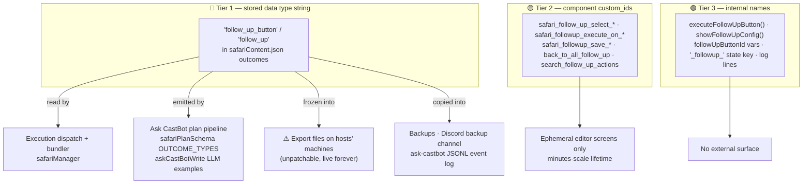

# 0888 — Renaming `follow_up_button` Technical Identifiers: Risk Assessment

**Status:** Assessment only — no change recommended. 🔴 DO NOT rename the stored type string.
**Related:** [0956 Action Terminology](0956_20260308_ActionTerminology_Analysis.md) (the UI rename this assessment follows)

## Original Context (trigger prompt)

> do a risk assessment on changing technical identifiers

Follows the 2026-08-06 UI/docs sweep that renamed all user-facing "Follow-up Action" / "Follow-up Button" copy to **Linked Action** while leaving technical identifiers untouched. This assesses what renaming those identifiers would actually cost.

## 🤔 The situation in plain English

The feature now *says* "Linked Action" everywhere a human looks, but *stores and routes* under `follow_up_button` everywhere a machine looks. That split feels untidy, so the temptation is to "finish the job." This document explains why the untidiness is the cheap option: the identifiers sit at three very different risk tiers, and the riskiest one is welded into places we can never fully patch — **export files sitting on hosts' hard drives**.

A UI-name ≠ internal-name split is already normal here: **Casting** renders over `cast_ranking` ids, **ComponentInteractionFactory** is exported as `ButtonHandlerFactory`, **Map** presents the `location` field-group key. The translation layer is one line of copy; the data is forever.

## 📊 Live footprint (measured 2026-08-06, prod)

| Metric | Value |
|---|---|
| Guilds with ≥1 linked-action outcome | **8** |
| Actions carrying a link | 20 (of 567 total actions) |
| Stored `follow_up_button` outcomes | **21** |
| Stored legacy `follow_up` type | 0 |
| Stored legacy top-level `buttonId` (pre-config shape) | 0 |
| Code references to the type string | ~45 across 11 modules + 3 test files |
| Code references to the `safari_follow*` custom_id family | ~35 (app.js 32, registry 3) |

Small — but the count is *irrelevant* to Tier 1 risk, because the exposure is in artifacts we don't control (below).

## The three tiers

## 🔴 Tier 1 — the stored type string (`follow_up_button`, legacy `follow_up`)

**Verdict: do not rename. Effort ~2-3 days; benefit zero; residual risk permanent.**

What a rename actually requires:

1. **Data migration** across every guild's `safariContent.json` (prod, test, every dev copy) under `withSafariLock`, plus the same sweep in any backup a restore might resurrect. A restore from a pre-migration backup silently reintroduces the old string — so the read path must accept it anyway.
2. **Import back-compat forever.** Hosts hold exported `.json`/`.zip` packages containing `"type": "follow_up_button"` — including the escape-room package moved between prod and test *this week*. Those files cannot be patched. The import path (and therefore the whole read path) must translate the old string **indefinitely**, which means the old identifier never actually dies — the migration buys a second spelling, not a retirement.
3. **AI pipeline retraining.** `safariPlanSchema.OUTCOME_TYPES` whitelists the string; `askCastBotWrite.js` literally teaches the LLM to emit `{"type":"follow_up_button",...}` in its prompt examples. Both sides must accept/emit both spellings during any transition, and historical `logs/ask-castbot.jsonl` entries keep the old one.
4. **Deploy-window skew.** Test writes the new string while prod still runs old code → a test-exported package imported to prod (the workflow used this week) produces outcomes prod's dispatcher silently doesn't execute. Cross-environment data movement is routine here; skew is not hypothetical.
5. **~45 code touchpoints** (dispatch switch, bundler's consecutive-follow-up collection, both summary formatters, both loggers, delete-cleanup scan, entityManager cleanup, plan applier remap, `getFollowUpParents`, editFramework), each a place where missing ONE alias check produces the worst failure mode: an outcome that **silently doesn't run** mid-game.

The string is visible to nobody but us. The entire benefit is aesthetic consistency in a JSON file.

## 🟡 Tier 2 — the custom_id family

**Verdict: possible but pointless. Effort ~half a day; benefit zero; risk transient.**

Materially lower risk than Tier 1: these ids live only in **ephemeral admin editor screens** rebuilt on every open — unlike posted public buttons (`safari_{guildId}_{buttonId}_{ts}`), which don't use this family. No data stores them.

Real costs: ~35 coordinated touchpoints including the easy-to-miss **custom_id exclusion list** (app.js ~4919 carries `safari_follow_up_select_`, `safari_followup_execute_on_`, `safari_followup_save_` prefixes), registry keys, and `interactionResponseShape` test ids. Failure mode: an editor screen open across the deploy throws "This interaction failed" once — annoying, self-healing. But since users never see custom_ids, this is churn with no payoff; the `[⚱️ UNREGISTERED]`/`[🪨 LEGACY]` debug tooling keys off these names too.

## 🟢 Tier 3 — internal names

**Verdict: safe, optional, do opportunistically — never as a sweep.**

Function/variable renames (`executeFollowUpButton` → `executeLinkedAction`, etc.) have no external surface. Costs are git-blame noise, review churn on ~30 sites, and the in-memory `dropConfigState` key segment `_followup_` (cleared on restart — deploys restart anyway). House precedent is to rename these *when already editing the surrounding code*, the way `ComponentInteractionFactory` arrived as an alias rather than a repo-wide rewrite. A dedicated rename commit is negative-value.

## 💡 Recommendation

| Tier | Action |
|---|---|
| 🔴 Type string | **Never**, absent a forcing function. If one ever appears: alias-first (`linked_action` accepted everywhere, still WRITE `follow_up_button`), and only flip the write default a full release cycle later — accepting that reads keep both forever. |
| 🟡 Custom_ids | Leave. Revisit only if the editor screens get rebuilt wholesale for another reason. |
| 🟢 Internals | Rename opportunistically inside files already being modified. No sweep commit. |

The one-line translation (`'follow_up_button': 'Linked Action'` in `getFieldDisplayName` + the formatters) **is** the finished state, not technical debt. Document it, don't migrate it.

⚠️ **If anyone attempts Tier 1 anyway, the non-obvious traps:** restore-from-backup reintroduction; host-held export files; Ask CastBot prompt examples AND its JSONL history; test↔prod package movement during the skew window; and the bundler's consecutive-type check (`safariManager` ~1854), which is easy to miss because it's flow control, not dispatch.
