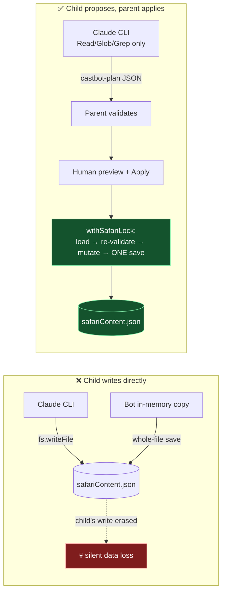

# RaP 0890 — Ask CastBot: Edit Mode, Entitlements, and the Event Log

**Date**: 2026-07-29 → 2026-07-30
**Status**: 🟢 Shipped to prod (`b7fbc033`), with two follow-ups on TEST and one unfinished workstream
**Related**: [AskCastBot.md](../03-features/AskCastBot.md) (feature reference) · [0894 Image Uploads](0894_20260720_ImageUploadComponent_Analysis.md) · [0900 Security Architecture](0900_20260711_SecurityArchitectureOptions_Analysis.md) · [incident 06](../incidents/06-HeapDriftGCDeathSpiral.md) (why every log reader streams)

---

## 🤔 The problem in plain English

Ask CastBot could explain how CastBot works, but not *do* anything. Ask it to make an item and you got a polite refusal plus click-by-click instructions — instructions which were sometimes **invented**, because the model was grounding itself on framework docs that describe code rather than screens. It once sent a host to "Entity Management → Items → Movement tab", a screen that has never existed.

So there were two problems wearing one coat:

1. **It can't act.** The host knows what they want ("create five Pokémon items and a shop to sell them in") and has to translate that into twenty menu clicks.
2. **Its advice is unreliable.** It answers from the codebase, and the codebase is not the UI.

The second problem is the more interesting one, because *the fix for the first problem dissolves it*: if the bot makes the change itself, nobody needs a navigation path.

### Trigger prompt (verbatim)

> Okay I want to make the following ask castbot changes, risky I know but.. let's give it a go..
>
> GIVEN ask_castbot is being accessed from specificGuildID
> AND the user has isAdmin privileges in said specificGuildID
>
> THEN: allow data changes to that guild's safariContent.json or playerData.json
>
> Consider all of the architectural ramifications / locking scenarios / etc.; plus a smart way to map dependencies to avoid going outside the usual flow (e.g., creating a stocked item at a store that doesn't exist or something)
>
> Example prompts:
> Create items bulbasaur, squirtle, charmander, pikachu, pidget and add to shop pokestore {which doesn't exist, but I'd expect the LLM to detect and create}
> Create an action on locations a1 - a8 that have a 'Get Money' button that gives the player 5 gold and can only be used once every 12 hours
> Rename our currency to Diamonds and use the emoji :gem: (settings change)
> Randomly create me content in all 25 safari coordinates that is like 'talk to X' where X is a person, and each person says something about pokemon
>
> Ideally supports: Most datatypes: (consider alignment / architecture with edit entity framework); in particular - items, stores, store-item-stocks, player-currency and especially the actions system (read up on the terminology doc - support all triggers, conditions, outcome types, locations,e tc.)
>
> Consider: Archetypes for knowledge - skill usage vs. just having full access over castbot codebase as context
>
> Future support or nice to have quality of life stuff: better follow up prompts (less loss of context); hardeened security, etc. I plan to also integrate this with the premium feature..

---

## 🏛️ The decisive constraint: you cannot let the CLI write

The obvious implementation is "give the spawned Claude CLI `Write` and let it edit `safariContent.json`". Exploration killed that within the hour, and the reason is worth preserving because it will tempt the next person too.

**There is no cross-process locking anywhere in CastBot.** `withStorageLock`, `withSafariLock` and `atomicSave`'s mutex are all in-process promise queues (storage.js). The bot holds whole files in memory, mutates, and writes the whole file back. So:

- A child process writing the file is **invisible** to the parent's cache and gets silently overwritten on the next save — often within seconds, since `activityLogger`'s timer-driven flush rewrites `playerData.json` on its own.
- The guards from [incident 05](../incidents/05-LostMovementRace.md) and [incident 07](../incidents/07-CachePoisonedLostMove.md) are **structurally blind** to an external writer: the generation counters only increment inside the bot's own `onSaved`, so a foreign write bumps nothing and the "stale read" detector never fires.

There's a second, independent reason: both data files are **multi-tenant**. Every guild lives in one JSON. Handing the CLI read access to `playerData.json` for guild A is a read grant over guilds B through Z. No prompt rule contains that.



**Child proposes, parent applies.** The CLI keeps its read-only toolset and emits a ` ```castbot-plan ` JSON block. The bot parses it, validates every field, shows the admin an itemised preview, and on Apply performs the mutations in-process under the real locks with one save per file — mirroring `importSafariData`'s transactional shape.

This turned out to buy more than safety. Because the parent owns the data, it can **inject a per-guild digest** into the prompt instead of letting the model read a 2MB file. That's faster, cheaper, and makes cross-guild leakage impossible by construction rather than by instruction — the pattern later reused wholesale for read-only player queries.

---

## 📐 What got built

### The plan pipeline
| Module | Role |
|---|---|
| `safariPlanSchema.js` | **The security boundary.** 15-op catalog, `$ref` dependency resolution, limit projection, coordinate/map validation, usage-limit sugar, flat-array conditions. Pure — no I/O. |
| `safariPlanApplier.js` | No-throw mutators + lock choreography: snapshots → `withSafariLock` (fresh load → **re-validate** → mutate → one save) → separate player cycle → paced anchor refreshes → audit. |
| `askCastBotWrite.js` | Gates, guild digest, write prompt, plan extraction, one-shot TTL'd plan cache, preview/Apply/Cancel/Review UX. |
| `entitlements.js` / `entitlementsUI.js` | Runtime per-guild feature registry — the premium hook. |

**Dependency mapping** (the "pokestore doesn't exist" requirement) is solved by `$ref`s: a create op declares `"ref": "pokestore"`, later ops reference `"$pokestore"`, and refs must be declared *before* use. Plain strings must resolve to an existing entity — exact ID, else unique case-insensitive name. **Nothing is ever auto-created**, so the preview can't lie about what will happen; a missing dependency is a validation error telling the model to emit the create explicitly.

### Op coverage
Reached parity with every Quick Create action type (`docs/03-features/QuickCreateActions.md`): items, stores, stocking, config/currency, actions (all four non-schedule triggers, conditions, six outcome types), **crafting recipes**, **enemies + fight_enemy**, map cells including **emoji → channel rename**, and player currency/items. Deferred: deletes, attributes, scheduled actions, map creation.

### Entitlements — the premium hook
Started as a hardcoded whitelist; Reece's requirement was runtime configurability ("no hardcoding, we'll need this for ko-fi"). `entitlements.json` now holds per-guild feature grants (`ask_castbot`, `safari_edit`), managed from 🎟️ Entitlements in Reece's Stuff. The hardcoded array was demoted to a **first-run seed**, with a backfill so existing registries didn't silently lose access. When payments land, the webhook calls `grantFeature()` and nothing else changes.

### One button, not three
Edit mode initially shipped as its own 🛠️ button. Reece's correction was decisive: *"the feature was always meant to be called Ask CastBot… just have one button."* The 👾 button now answers questions **and** proposes changes for admins in entitled guilds. Edit Safari / Post Edit Card were deleted; Post Ask CastBot moved beside Ask CastBot in Tools.

### The event log (`src/analytics/askLog.js`)
A JSONL corpus of every query, answer, and — the signal that existed nowhere else — **whether the admin accepted or rejected what the model proposed**. Four rules, each earned:

1. `logAskEvent` **never throws and is never awaited**. A logging fault must not slow or break an answer.
2. Writes chain through one module promise. `O_APPEND` isn't enough: Node's `appendFile` loops on partial writes, and two interleaved 8KB appends corrupt a JSONL segment permanently.
3. Async `appendFile`, never `appendFileSync` (the prose analytics logger blocks the event loop on every interaction — don't copy it).
4. **Readers must stream or tail.** Parsing the whole file is exactly incident 06's OOM.

It paid for itself twice within a day — see Discoveries below.

---

## 🔍 Discoveries (the part worth re-reading)

### 1. The map images: two wrong theories before the right one
Hosts reported broken map images. I proposed, with confidence, that Discord's **signed CDN URLs** (`?ex=&is=&hm=`) had expired and were being re-embedded on anchor edits. It was a clean story. It was wrong twice:

- Reece pushed back that the old and new upload paths were equivalent, so expiry couldn't be new behaviour. Correct.
- A plain anchor refresh **fixed** a broken cell **using the same expired URL** — which should have been impossible under my theory.
- Measuring settled it: **2 of 40 cells stuck; 38 healthy** — all 40 carrying the same expired URL. And the healthy ones had been edited *after* expiry.

The real cause: Discord unfurls a Media Gallery URL **once, at edit time**, to learn its dimensions. If that resolution fails — for any reason, including a transient fault entirely outside our control — the item sticks at `loading_state: 1` **forever**, because Discord never retries. All three failures fell inside one ~33-minute window; every edit before and after succeeded.

**Lesson**: a plausible mechanism that explains the symptom is not evidence. The distribution (2 of 40) falsified in one measurement what two rounds of reasoning could not.

**Fix**: `mapCellUpdater.js` now verifies after updating and re-sends once if the image is unresolved; bulk refreshes do a single verification sweep at the end so they stay fast.

### 2. Player names were never persisted
`formatGuildDigest` read `p.displayName || p.username` — but app.js attaches those as *temp metadata* and `delete`s them before save. Every player in the Edit digest had been rendering as `unknown` since it shipped. Names now resolve from Discord.

### 3. Two-thirds of inventories use the legacy format
Inventory entries are either `{quantity}` objects or bare numbers, and **~68% of live entries are still bare numbers**. Any "total items" count that reads `.quantity` silently reports 0 for most real data. Both the digest and the applier use the same reduce as `playerManagement.js:65`.

### 4. The adversarial review earned its cost
A fan-out review before deploy produced seven confirmed defects, including: **prototype pollution** (`update_item` targeting `"__proto__"` — `g.items['__proto__']` is truthy via the prototype chain, so `Object.assign` would have hit `Object.prototype` process-wide); a **cross-guild read grant** I'd written into `resolveWriteDenyRules`; `stock_item`'s price being **dead data** (the engine only ever charges `item.basePrice`); `'global'` being persisted into `action.coordinates` where legacy sync flows would materialise a **phantom map cell**; and preview/result messages able to exceed Discord's **4000-char combined cap**, which silently froze the preview and made an applied edit look failed.

### 5. Ephemeral previews get lost
A 9-op plan was proposed from the public 👾 route; the preview went out as an ephemeral follow-up and was gone by the time Reece looked. The public card offered only Follow Up / New Question, so the plan was unreachable until its TTL. The public card now carries a **Review N Changes** button — requester-bound and re-validated against current data.

---

## ⚠️ What is NOT done

| Item | State |
|---|---|
| **S3 sync** | `awsSigV4.js` + `askLogSync.js` written, tests written, **not verified green and not wired into startup**. `startAskLogSync()` has no caller. Harmless (dormant without credentials) but incomplete. |
| **AWS provisioning** | Blocked: the `castbot-claude` IAM user has `lightsail:*` only — no `s3:*`, no `iam:*`. Bucket, IAM user and policy must be created by Reece (or by granting that user S3+IAM). |
| **Analysis + purge scripts** | Not started. `npm run asklog` (summary), `asklog-export`, and `asklog-purge-user` all still to build. The purge script is what makes the policy's deletion promise real. |
| **Privacy policy amendment** | Not started, and **prod is logging user text under a policy that doesn't describe it**. See below. |

### The privacy question, resolved pragmatically
Discord's Developer Policy says: *"Do not use message content obtained through the APIs to train machine learning or AI models."* The scope word is **message content obtained through the APIs** — that's what the Message Content privileged intent gates. Text a user types into CastBot's own modal is interaction payload data, needs no intent, and was never in scope. A predecessor had collapsed the two into a blanket promise, which is why the policy reads as broader than the obligation.

Reece's steer: *"yes I'm using Amazon but I own the infra, it's not like I'm chucking it over the fence to Amazon. so probably tone it down a lil and be pragmatic."* Agreed — AWS is hosting, not a data-sharing arrangement, and the policy shouldn't imply otherwise.

What still genuinely needs fixing when this is picked up:
- **Anthropic is undisclosed.** Ask CastBot has sent user-typed questions to Anthropic since 2026-07-28 under a clause saying "we do not share your data with any other services". That's a live inaccuracy.
- The stated AWS region is wrong (says US; the box is `ap-southeast-2`).
- The ML line should be scoped to "we don't train models on your data, or let anyone else" rather than implying we can't read our own logs.
- Mechanically it **must be paginated**: the policy is 3,657 chars against Discord's 4,000-char combined Text Display cap. Extracting to `legalDocs.js` frees ~72 lines of app.js, which also relieves the line ratchet (currently 52,238 of 52,242).

---

## 💡 Decisions worth keeping

- **Validate twice.** Once at preview, again *inside the lock* against freshly-loaded data. Drift between preview and Apply aborts with reasons rather than half-applying.
- **Mutators are no-throw by contract.** A throw mid-loop would poison the shared cache with a half-applied plan; the validator's job is to make throwing impossible, with a defensive cache-drop as backstop.
- **The schema is the security boundary, not the prompt.** The model controls its output; it does not control what the parent will accept.
- **Digest over file access.** Injecting scoped state beats granting reads — cheaper, faster, and structurally safe.
- **Abandonment is derived, not swept.** A `plan.proposed` with no terminal event is abandoned. A sweeper would be only partly honest (restart-loss is unobservable in-process) at the cost of a new timer.

---

## 🗺️ Where things live

`safariPlanSchema.js` · `safariPlanApplier.js` · `askCastBotWrite.js` · `askCastBot.js` · `entitlements.js` · `entitlementsUI.js` · `src/analytics/askLog.js` · `src/analytics/askLogSync.js` (WIP) · `src/analytics/awsSigV4.js` (WIP) · `docs/askcastbot-kb/{write-ops,ui-paths}.md` · tests: `safariPlanSchema` · `safariPlanApplier` · `askCastBotWrite` · `askLog` · `awsSigV4` · `entitlements` · `anchorImageVerify`
