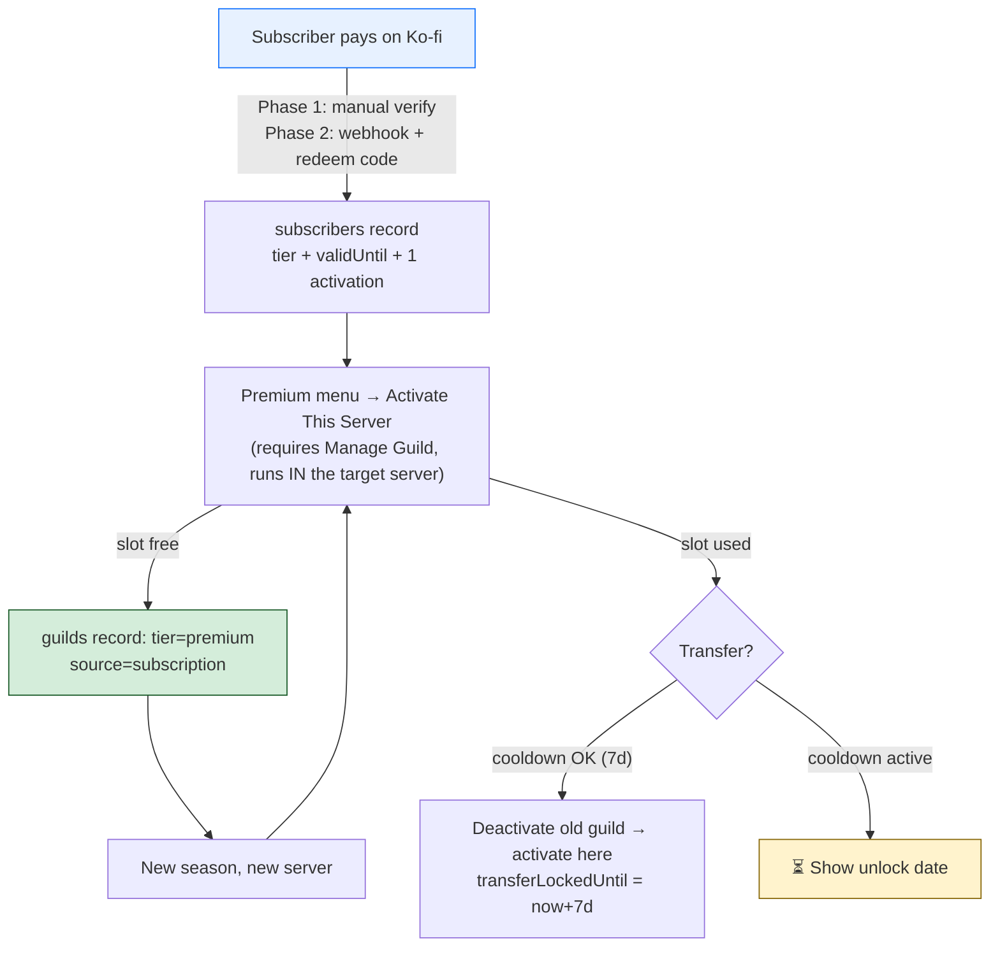
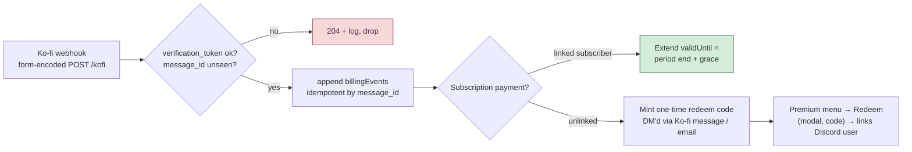
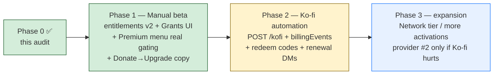

# 💎 Premium Subscriptions & Entitlements — Design Analysis

**Status**: Phase 1 partially IMPLEMENTED (2026-08-08 — entitlements v2 + lapse enforcement + admin tier UI + test stubs, see §Implemented below); pricing/tier decisions still pending
**Feature doc**: [CastBotPremium.md](../03-features/CastBotPremium.md) — the consolidated, operationalized reference (architecture diagrams, Ko-fi ingestion, pricing state, launch checklist). Read that first; this RaP holds the decision rationale.
**Absorbs**: the self-contained handoff doc *"CastBot Subscriptions and Premium Entitlements"* (2026-07, Ko-fi/PayPal state, provider options, data-model sketch)
**Builds on**: [`entitlements.js`](../../entitlements.js) (the existing entitlement registry) · the ⭐ CastBot Premium menu mockup (commit 80491fd3) · [RaP 0900](0900_20260711_SecurityArchitectureOptions_Analysis.md) (gating doctrine)

## Original Context (trigger prompt)

> back to subscription land - please absorb attached into a RaP and come up with design options - we still need to work out pricing model and bot usage (likely one subscription per server that can be transported around between servers - this is common with competitors and @docs/concepts/SurvivorContext.md many places make new servers every season)
>
> need to consider overall activation flow, and I need the ability to 'grant' people premium without a ko-fi subscription please
>
> also need to think about how i might up pricing in the future from a technical perspective (obviously we can bring in new tiers etc on new features, but i may want to ramp up pricing over time). consider from both a 'premium subscriber experience' but also technical perspective.

Handoff-doc anchors (not re-litigated here): costs ≈ US$110/mo infra + 20-40 hrs/mo labour; Ko-fi page `ko-fi.com/castbot` with PayPal linked; Ko-fi Contributor opt-in (5% of future tips) is the last known setup point; audience is mostly American → price in USD; candidate tiers Supporter ~US$3 / Premium ~US$7 (NOT locked).

---

## 🤔 Current-state assessment (repo audit, 2026-07-28)

The audit changes the shape of this project: **half the MVP already exists.**

| Asset | State | Evidence |
|---|---|---|
| **Entitlement registry** | ✅ Built (uncommitted WIP) | `entitlements.js` — guild-scoped `{ guilds: { <id>: { name, features[], addedBy, addedAt } } }` in `entitlements.json` (gitignored, atomicSave `minSize`+validate, Tier-2 Discord backup already wired in `backupService.js:24`). `hasFeature` (async, handlers) + `hasFeatureSync` (warm-cache, display gates) + `grantFeature/revokeFeature/listEntitledGuilds`, forever-cache single-writer, **fails CLOSED** on corrupt file. First consumer: `safari_edit` (`askCastBotWrite.js`, display gate `menuBuilder.js:125`). Docstring: *"When premium (ko-fi) lands, the payment flow calls grantFeature() and everything downstream just works."* |
| **Manual grant admin UI** | ✅ Built (uncommitted WIP) | `entitlementsUI.js` — Reece-only surface in Reece's Stuff: manage screen, add-modal (guild ID + optional name, auto-filled from the bot's guild cache), revoke select. **This is most of the "grant premium without Ko-fi" requirement already done** — it grants *features*, and needs extending to grant *tiers with expiry*. |
| **Public HTTPS surface for webhooks** | ✅ Exists | `POST /webhooks` (app.js:1796) already handles Discord event webhooks; Apache `ProxyPass / → localhost:3000` proxies **all** paths, so a new `POST /kofi` route is instantly public at `castbotaws.reecewagner.com` with zero infra work. Caveat: Ko-fi POSTs `application/x-www-form-urlencoded` → route needs its own `express.urlencoded()` parser (global middleware is JSON-only, app.js:1773). |
| **Premium UI surface** | ✅ Mockup live | ⭐ CastBot Premium button (Reece-gated, pre-factory hard gate app.js:7645) → `buildPremiumMenu` fork with "iterate here" doctrine (menuBuilder.js:189). Donate handler (app.js:6728-6784) already pitches costs + Ko-fi link. |
| **Scheduled-job infra for revalidation** | ✅ Exists | `scheduler.js` (persistent, boot-restored), backupService interval pattern with `targetHourUTC`. |
| **Manual-grant precedents** | ✅ Multiple | `hasAskCastBotAccess` (guild+user whitelists), `CHANNEL_ADMIN_USER_IDS`, `globalRoleAccess`. All enforce **at the handler, never just the menu** — incident 04 + `securityDeclarations.test.js` ratchet. |
| **Scale reality** | 165–190 guilds | prod playerData.json = **4.4MB / 190 guilds** (not the stale "~170KB" in CLAUDE.md); Lightsail nano 512MB. A per-interaction premium check must NOT ride playerData — the separate small `entitlements.json` forever-cache is effectively free. |
| **Intents** | ⚠️ Verify | `Guilds, GuildMembers (privileged), GuildMessages, GuildMessageReactions` (app.js:1311). Handoff's 100-server intent cliff: we're at ~190 servers and still joining — verify current verification status, but the premium design below adds **no** new intent needs (no support-server role checks). |
| **Identity linking** | ❌ None | No OAuth flow, no redeem codes, no user↔external-account link anywhere. `REDIRECT_URI` env exists but dormant. |
| **Home server** | ⚠️ Unnamed constant | `1331657596087566398` (EpochORG) hardcoded in 5+ places; support invite `discord.gg/H7MpJEjkwT` in 6. No `HOME_GUILD_ID` constant. |

### Scope evidence — guild vs user

Everything premium-worthy stores **guild-scoped**: Safari content (`safariData[guildId]`), castlists, seasons, Channel Admin bulk tools, Category Post, CastDock, Whisper. The *only* user-scoped cross-server asset is Channel Archive run retrieval. The costliest features (map builds — 2 prod OOMs, archive HTML export, bulk channel jobs, analytics dumps) already have memory/pacing choke points that premium gating can layer onto. Tierable CastBot-imposed limits are concentrated in `config/safariLimits.js` (+ `MAX_GLOBAL_STORES=5`, map 400-cell cap, `MAX_EXPANDED_CHANNELS=200`, `MAX_PANELS=25`).

**Conclusion: guild-scoped subscription is not just the commercial preference — it is what the data model already is.**

---

## 🧭 The product decision matrix

### D1 — What does a subscription attach to?

| Option | Verdict | Why |
|---|---|---|
| **A. User premium** | ❌ | Almost nothing user-scoped exists to sell; benefits would evaporate outside "their" server; encourages one sub shared across N servers |
| **B. Guild premium, transportable** | ✅ **Recommended** | Matches storage scope, matches competitors, matches the ORG lifecycle — *new server every season* (SurvivorContext) makes transferability the killer requirement, not an edge case |
| **C. Hybrid** | 🔶 Later | The subscriber does get user-level crumbs (supporter badge in home server, priority support) but the entitlement engine stays guild-keyed. Don't build user entitlements now |

**The model**: a **subscription belongs to a Discord user** (the subscriber) and carries **one guild activation** (higher tiers: more). The activation is moved by the subscriber — deactivate old season's server, activate the new one. This is exactly the Mee6/Apollo/etc. "premium server slot" convention users already understand.

### D2 — Where does entitlement truth live?

**In `entitlements.json`, always.** Ko-fi (role, webhook, or manual verification) is only ever an *input* that mutates the store. The handoff's central architectural principle — commands never know the provider — is already how `hasFeature()` works. This kills the fragile options:

- **Ko-fi role in the official server as source of truth**: rejected. Couples every premium check to one guild's role cache + Ko-fi's sync + the user staying in the server; adds latency/outage failure modes; hard to migrate off. At most it becomes an optional *identity bridge* later.
- **Provider webhooks as source of truth**: rejected as *truth* — Ko-fi has no reliable cancellation event. Webhooks **feed** the store; access is computed from payment-derived `validUntil` + grace, never from "a recurring payment once happened".

### D3 — Activation count per tier

Start with **1 activation** on the paid tier. "More activations" is the cleanest *future* upsell for network hosts who run multiple ORGs simultaneously — it needs zero new engineering (it's a `maxActivations` field) and creates the natural higher tier when you want one.

---

## 💾 Data model — `entitlements.json` v2 (extend, don't replace)

Today's shape is feature-array only — no tier, expiry, source, or subscriber concept. v2 adds them while keeping `hasFeature(guildId, feature)` as **the one check API** every handler uses:

```jsonc
{
  "version": 2,
  "guilds": {
    "<guildId>": {
      "name": "EpochORG S14",
      "tier": "premium",                  // resolved tier for this guild
      "features": ["safari_edit"],        // à-la-carte grants OUTSIDE tiers still work (v1 compat)
      "source": "subscription" | "manual",
      "subscriberUserId": "…",            // when source=subscription
      "validUntil": "2026-08-28T00:00:00Z" | null,   // null = no expiry (manual grants may be permanent)
      "grantedBy": "391415444084490240",  // audit trail (manual grants)
      "reason": "beta tester",            // audit trail (manual grants)
      "activatedAt": "…", "addedAt": "…"
    }
  },
  "subscribers": {
    "<discordUserId>": {
      "tier": "premium",
      "source": "kofi" | "manual",
      "priceVersion": "launch-2026-08",   // 🔑 the price-ramp key — see below
      "activations": ["<guildId>"],
      "maxActivations": 1,
      "validUntil": "…",                  // last payment period end + grace
      "lastPaymentAt": "…",
      "transferLockedUntil": "…",         // 7-day cooldown after a transfer
      "kofi": { "email": "…", "verificationHint": "…" },   // never card data
      "notes": "…"
    }
  },
  "billingEvents": []                     // Phase 2: idempotent Ko-fi event log (kofi message_id unique)
}
```

**Tier → features mapping lives in code** (one `TIERS` const beside `FEATURES` in entitlements.js), because features are code anyway:

```js
export const TIERS = {
  free:    { features: [] },
  premium: { features: [FEATURES.SAFARI_EDIT, FEATURES.CHANNEL_ADMIN, FEATURES.ALLIANCES, /* … */] }
};
// hasFeature(guildId, f) = f ∈ guild.features  OR  f ∈ TIERS[guild.tier].features (while valid/grace)
```

Resolution stays fail-closed, forever-cached, zero-I/O per interaction. Expiry is evaluated lazily at check time (`validUntil + GRACE_MS < now → tier treated as free`) — **no revalidation cron needed for correctness**; a daily `scheduler.js` job just *notifies* (DM subscriber "renew or premium lapses in 3 days") and tidies.

### The whitelist migration path

Every existing hidden feature converts from hardcoded whitelist → `FEATURES` key, exactly as `safari_edit` already did: Channel Admin tab (`CHANNEL_ADMIN_USER_IDS`), Alliances, Ask CastBot guild list (already seeds entitlements.json), Archive (currently TEST-only). The whitelists shrink to "Reece's own gates" and the premium shelf is born from features that already exist. **Enforcement stays at the handler** (RaP 0900 / incident 04 doctrine) — `hasFeature` calls inside handlers, menus only *display*-gate.

---

## 🔁 Flows

### Activation / transfer (the ORG season lifecycle)



- **Activate** = a button in the ⭐ Premium menu (and later `/premium activate`): must be run *inside* the target guild by the subscriber with `ManageGuild`/`ManageRoles` — sidesteps the "pick an external guild from a select" problem entirely.
- **Transfer** = deactivate + activate with a **7-day cooldown** (seasons run months; 7d blocks slot-sharing between concurrently-running servers without hurting the legit new-season move).
- **Subscriber leaves the activated guild / guild deleted / bot kicked**: entitlement persists until expiry (the *server* paid-state shouldn't yank mid-season because a host account left); the subscriber can still transfer out on cooldown rules. Guild-delete tidy happens in the daily job.
- **Lapse**: `validUntil` passes → **7-day grace** (feature keeps working, menu shows "renew" nag) → features off. **Never destroy data**: over-limit content becomes read-only/won't-grow (the existing limit-check sites already refuse-with-message; they just start refusing again).

### Manual grants (required: premium without Ko-fi)

**Already largely built.** `entitlements.js` has `grantFeature()`/`revokeFeature()` and `entitlementsUI.js` ships the Reece-only add/revoke screens in Reece's Stuff. What v2 adds is the *tier and expiry* dimension, not a new system:

- `grantTier(guildId, tier, { validUntil, grantedBy, reason })` beside the existing `grantFeature` (à-la-carte feature grants stay — they're how you comp a single feature).
- Extend the existing add-modal with two fields: **tier** (Radio Group) and **duration** (`31d` / `season` / permanent → `validUntil`).
- `grantSubscription(userId, { tier, maxActivations, validUntil })` for comp accounts that should get the real activate/transfer experience.
- The manage screen gains source/expiry columns so a comp'd guild is visually distinct from a paying one.
- All writes audited (`grantedBy`, `reason`, `addedAt` — already the shape) — the handoff's audit-trail requirement.

**Where it lives**: keep grants in Reece's Stuff (ops), and let the ⭐ Premium menu be the *subscriber-facing* surface (status / activate / transfer / redeem). Two audiences, two menus.

This is also the **entire Phase-1 billing system**: Ko-fi membership arrives → Ko-fi emails you → you run Grant with `31d` expiry → renewal arrives → extend. Tedious past ~15 subscribers, perfect below it.

### Ko-fi ingestion (Phase 2)



- Identity link = **redeem code**, not Ko-fi's Discord role sync and not free-text Discord usernames in a Ko-fi field (error-prone). Code minted per first payment, single-use, redeemed in-bot → binds `kofi email → discordUserId` for future renewals.
- No cancellation event needed: no renewal ⇒ `validUntil` simply isn't extended ⇒ grace ⇒ lapse. Refund/chargeback = manual revoke (rare at this scale; log it).
- Verify-before-build list: Ko-fi Contributor requirement for webhooks/memberships and the 5% cut; webhook `verification_token` mechanics; whether Ko-fi memberships keep existing members on their joined price (believed yes — load-bearing for the ramp strategy below).

---

## 💰 Pricing model + the price-ramp strategy

### Launch shape (recommendation)

**One paid tier at launch.** Two tiers now doubles every explanation, support case, and Ko-fi config while the subscriber count is ~0. Keep Ko-fi one-time donations as the "Supporter" emotional slot (shout-out + badge in home server, no entitlements).

- **CastBot Premium — US$6/month**: 1 transportable server activation, the premium feature shelf (Channel Admin bulk tools, Alliances, Archive, raised Safari limits, early access), founder-visible pricing. ($6 splits your $3/$7 instinct; round, USD, sits under the $9.99 psychological line competitors use. Not locked — decide.)
- Future tiers slot in *by name*, not by replacing: e.g. **Network — US$12** (3 activations) when multi-ORG hosts ask.

### Ramping price later — technical design

The whole trick is: **price never appears in bot code, and every subscriber record carries `priceVersion`.**

| Concern | Mechanism |
|---|---|
| Raise price for new subscribers | New Ko-fi tier at the new price; old tier hidden-but-alive. Bot maps *both* provider tiers → `tier: 'premium'`. Zero code change to entitlements |
| Grandfather existing subscribers | Ko-fi keeps existing members at joined price (verify); their `priceVersion: 'launch-2026-08'` marks them. Their entitlements are identical — grandfathering is a *billing* fact, not an *entitlement* fact |
| Different features per price era? | **Don't.** Features key off `tier`, never `priceVersion`. The day features fork by price-era is the day support becomes hell |
| New tiers on new features | Add a `TIERS` entry + Ko-fi tier + mapping row. `hasFeature` untouched |
| Kill/merge a tier later | Migration = rewrite `tier` fields in one small JSON file, one script |
| Reporting | `priceVersion` + `lastPaymentAt` on subscribers = revenue cohorts without touching a provider API |

### Ramping price — subscriber experience

- Frame every increase as **new price for new subscribers**; existing subscribers keep theirs ("founder pricing") for as long as the sub stays active. Lapse-and-return rejoins at current price — that's the standard, understood deal, and it *rewards* continuity (reduces churn ahead of announced increases).
- Announce in the home server + a one-time bot nag *before* it happens; never mid-cycle.
- The `priceVersion` badge can even be surfaced ("🏅 Founder") — grandfathering as a perk, not an apology.

---

## 🎯 Recommended MVP (Phase 1) and phases



**Phase 1 concretely** (small, no webhook, no OAuth, no new infra spend):
1. `entitlements.js` v2: `TIERS`, subscribers block, `validUntil`+grace resolution inside `hasFeature`/`hasFeatureSync`, `grantTier`/`grantSubscription`, tests. (v1 records with no `tier`/`validUntil` keep working — permanent feature grants.)
2. Extend `entitlementsUI.js` add-modal with tier + duration; make the ⭐ Premium menu the subscriber surface (Status / Activate / Transfer, Redeem placeholder).
3. Convert 2-3 whitelist features to `FEATURES` keys as the launch shelf (Channel Admin tab, Alliances, Archive) + pick 2-3 `safariLimits.js` knobs to tier.
4. Donate screen gains the upgrade pitch; Ko-fi Memberships configured (accept the 5% Contributor toll — it's the cost of not building billing).
5. Invite a handful of beta subscribers; grants managed manually.

**Accepted risk of Phase 1**: manual ops (~minutes/subscriber/month), honor-system renewals, no self-service linking. That's correct at <15 subscribers and validates demand before Phase 2's webhook work.

## ⚠️ Risks & failure modes (headline rows)

| Risk | Mitigation |
|---|---|
| Provider outage / Ko-fi role sync — | **N/A by design**: truth is local `entitlements.json`, zero external calls per check |
| Corrupt/lost entitlements file | Fails CLOSED (already); Tier-2 Discord backup (already); grants are re-creatable from Ko-fi payment history |
| Transfer abuse (slot-sharing) | 7-day `transferLockedUntil` |
| Duplicate/replayed webhooks (P2) | idempotent `billingEvents` by Ko-fi `message_id`; token check |
| Mid-season lapse hurts a live game | 7-day grace + read-only degradation, never data loss |
| Support-server dependency | None — users never need to join the home server for entitlements |
| Prod deploy overwrites data file | Already handled: gitignored + deploy runtime-file restore step (BackupStrategy) |
| Three environments, three files | Each instance self-seeds; test/dev grants are free anyway; prod is the only one that matters |

## ❓ Decisions needed (with recommended defaults)

1. **Launch price/tier shape** — default: one tier, US$6/mo, 1 activation. (Alternative: $3 Supporter cosmetic + $7 Premium.)
2. **Grandfather policy** — default: keep-your-price while continuously subscribed; lapse rejoins at current.
3. **Grace period** — default: 7 days after `validUntil`.
4. **Transfer cooldown** — default: 7 days.
5. **Launch premium shelf** — default: Channel Admin bulk tools + Alliances + Archive + raised Safari limits + early-access flag. (Requires promoting those whitelisted features to shippable state.)
6. **Ko-fi Contributor 5% opt-in** — default: accept (needed for Memberships/webhooks; it's the no-code-billing tax).

## ✅ Implemented 2026-08-08 — entitlements v2 + lapse enforcement architecture

What shipped (commit refs in git):

- **entitlements.js v2**: `TIERS` (single `premium` bundle = ask_castbot + safari_edit), `GRACE_MS` (7d), `resolveTierState()` (pure lazy-expiry state machine: active → grace → lapsed), tier-aware `hasFeatureSync` (à-la-carte `features` grants stay permanent/v1), `grantTier`/`extendTier`/`setTierValidUntil`/`revokeTier`, `parseDuration` ("30d/12h/45min/2w/3mo", bare "m" rejected as ambiguous; **minutes exist so expiry is testable in real time**).
- **Factory `premium:` declaration** (buttonHandlerFactory.js): checked centrally after `requiresPermission`, standard denial with two audiences — admin surfaces (those with requiresPermission) get the ⭐ premium message, player surfaces get a neutral "isn't available". Doctrine: **artifacts persist, clicks gate** — no artifact sweeps on lapse; renewal revives everything instantly. First declared: `askcb_ask`, `askcb_post`.
- **Premium ratchet** (tests/premiumDeclarations.test.js, securityDeclarations mold): premium keys must be real FEATURES; REQUIRED_PREMIUM_IDS can't silently lose their gate; factory gate presence asserted.
- **🔀 PREMIUM LAUNCH SWITCH**: `PUBLIC_ASK_REQUIRES_ENTITLEMENT = false` in askCastBot.js. The POSTED Ask button's modal route deliberately still bypasses the guild entitlement (Reece 2026-08-08: stays open until premium launches). Flip to `true` at launch = lapsed guilds stop burning Claude tokens via old posted buttons. One-word diff, ratchet-guarded.
- **Admin UI** (entitlementsUI.js): manage list gains tier badges (⭐ active / 🕒 grace / 💀 lapsed) + a per-guild detail screen — Grant/Update Premium (duration modal, blank = permanent), +30d extend, Revoke Tier, and the **expiry TEST STUBS**: `Expire Now` (validUntil = now−1s → grace) and `Lapse Now` (past grace). Stubs are real validUntil writes through the real save path — no mock rails.
- **Ops CLI**: scripts/entitlements-cli.js (list/show/grant/extend/expire/lapse/revoke-tier) — reads always safe; writes only with the bot stopped (forever-cache is single-writer).

Still unbuilt from Phase 1/2: `subscribers` block + activate/transfer, the ⭐ Premium subscriber menu, redeem/linking, `POST /kofi`, renewal-nag job, launch-shelf feature conversion.

## 🔍 Ko-fi verification findings 2026-08-08 (supersedes the Phase-2 redeem-mint sketch)

Verified against Ko-fi docs (help.ko-fi.com):

1. **Ko-fi has NO outbound API** — the webhook is the entire API. The original Phase-2 sketch ("mint a redeem code, DM it via Ko-fi") is **not possible**; messaging supporters is manual-only. The one automated touchpoint is the static per-tier **Welcome Message** (on-screen after first payment) — carries instructions/links, never per-user codes.
2. **No cancellation/refund/expiry webhook events exist** (confirmed) — the absence-based `validUntil` + grace model is the only correct design; refunds/chargebacks = manual revoke.
3. **Ko-fi's Discord integration is stronger than assumed**: Ko-fi Bot grants a per-tier Discord role automatically (supporter links Discord + joins the creator's server) and **removes it automatically when the membership ends** — a machine-readable lapse signal the webhook lacks. Revised linking recommendation: **primary = role bridge** (CastBot watches GuildMemberUpdate in its home/support server → real Discord user ID, zero typing), **fallback = email-claim Redeem** (Welcome Message instructs `/menu → Premium → Redeem`, bot matches webhook-seen emails), **manual = Entitlements panel** (built). Role events are *inputs* that write entitlements.json — never the truth (D2 doctrine unchanged).
4. **Membership checkout has no supporter message field** (only tips do) — "type your Discord username at checkout" cannot be primary.
5. **Discord native Premium Apps: ruled out for now** — payout eligibility is US/UK/EU only; Australia unsupported. Re-check periodically (15% cut, would dissolve identity linking entirely).

## 📎 Related

- [RaP 0892](0892_20260728_Alliances_Analysis.md) — Alliances (a launch-shelf candidate)
- [ChannelAdministration.md](../03-features/ChannelAdministration.md) — the biggest premium-shelf feature
- [RaP 0900](0900_20260711_SecurityArchitectureOptions_Analysis.md) — why gates live in handlers
- [RaP 0917](0917_20260427_PrivilegedIntents_Analysis.md) — intents posture (no new intents needed here)
- [BackupStrategy.md](../03-features/BackupStrategy.md) — entitlements.json Tier-2 classification
