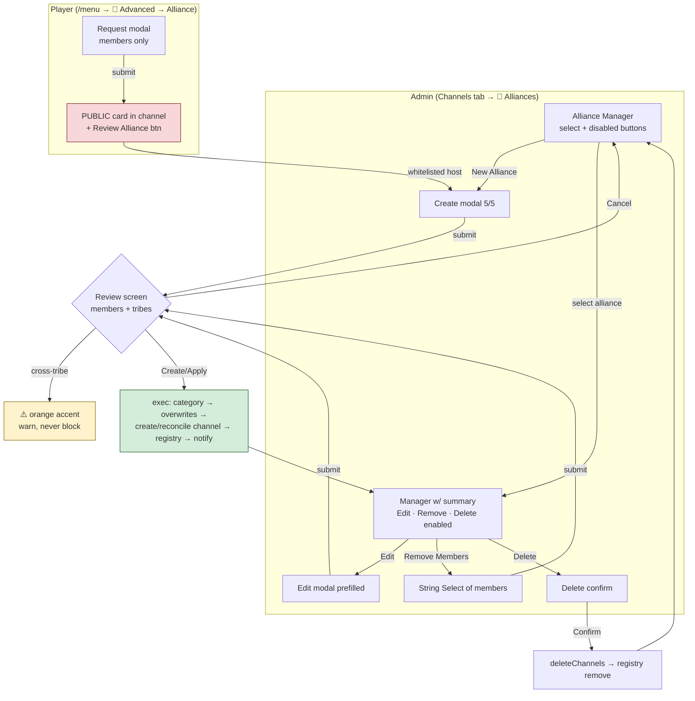

# 🤝 Alliances — Design & Implementation Analysis

**Status**: Building (v1, hidden behind the Channel Admin whitelist)
**Builds on**: [ChannelAdministration.md](../03-features/ChannelAdministration.md) · [SurvivorContext.md](../concepts/SurvivorContext.md#-alliances)
**Code**: [`src/channels/`](../../src/channels/) — `alliancePlan.js` (pure), `allianceView.js`, `allianceHandlers.js`

## Original Context (trigger prompt)

> so an alliance is nearly always organised by players chatting in their 1on1s or DMs; basically its a keep-it-on-the-down-low, never discussed in a public chat, unless its another alliance and whoever is pushing for all the members of /that/ alliance are happy with them knowing
>
> alliances thus nearly always have to be by people of the same tribe; we want to add a warning guard using our standard @docs/ui/LeanUserInterfaceDesign.md style UI
>
> Needs to follow the same roles-first logic we've documented
>
> creation of alliances could be by a user select and then we look up a player role; or POSSIBLY by a role select, i assume we can't have a combo user / player select, if so that would be the vibe
>
> the UI we probably want like our admin_manage_player or castlist_hub UI: the entire UI is exposed initially, but all buttons etc are disabled aside from a select component, and if we aren't gonna use a string select we'll do away with the paradigm of a 'new' string select option for alliance and just have a button > New Tribe Modal.
>
> New Tribe Modal:
> Create Alliance should have the following - set the values / label description per @docs/standards/ComponentsV2.md based on my description
> Alliance Members -> User / Role Select, must be on the same tribe (but lets only warn, not strictly enforce)
> Alliance Category -> Category the new channel will be created in -> Channel select filtered to category only if possible?
> Channel Name (optional) - If left blank, will default to just 'alliance' to avoid any accidental reveals
> Notify on creation? - String select with options on whether CastBot will tag the users, and announce the alliance requestor (described below)
> Silent (default option) - channel will appear in players' list
> Announce creation - Tags alliance members in the channel after creation
> Announce requestor on creation - Tags alliance members and announces the requestor, if done via alliance request
>
> Alliance request: Accessible via player menu > Cut down / re-used version of above, players can only input alliance members. This then creates a public container for Production with all the details input and a 'review alliance' button that launches the same modal as earlier, but with the users/ roles pre-populated.
>
> Write somewhere on all modals that they will get a chance to review on submission. PRovide a cancel button on the modal.
>
> On submit, do a review to ensure all proposed members are on the same tribe, show names in a container and warnings when they are on different tribes, and then a Create Alliance button or Cancel.
>
> On successful creation, load the alliance manager UI, show a summary of all players / various usweful details you can think of, as well as a Remove Members button that is just a cut down version of the modal with the ability to remove members, and Edit button that is just the whole modal again
>
> Request alliance goes in player menu under the Advanced heading, to the left of CastDock

**Decisions made during planning** (AskUserQuestion, 2026-07-28):
1. Player "Request Alliance" button is **whitelist-only in v1** (the public request card would leak alliances if run in a public channel — flip to public later is one line).
2. Category picker: `channel_types: [4]` — Category Post proves `channel_types` incl. `4` works in modals; fall back to `[0,4,5]` + server-side rejection if `[4]` alone is rejected.
3. **Delete Alliance** button is in scope; **notify-on-edit** is out (added members get access silently).

## 🤔 The problem in plain English

ORG hosts create secret alliance channels by hand — pick the members, build the permission overwrites, hide it from everyone else, don't typo a name that reveals who's in it. The Channel Administration framework already has every primitive this needs (role-preferred overwrites, plan→confirm→execute, ceiling preflight, registry). What's missing is the alliance-shaped UI and data on top — and the discipline that **the existence of an alliance is season-deciding information**, so every default leans secret:

- Channel name defaults to literally **`alliance`** — never member-name slugs.
- **No Trusted Spectator access** (unlike confessionals) — alliances outrank even spectator trust.
- Notify default is **Silent** — the channel just appears in members' lists.
- The whole feature hides behind `CHANNEL_ADMIN_USER_IDS` in v1, player side included.

## 🗝️ Key design points

### The "combo user/role select" exists
The user wished for a combined user+role picker — Discord's **Mentionable Select (type 7)** is exactly that, already used by the Confessionals/Subs modals. Roles expand to members via `expandMentionables` (departed members dropped; bots allowed since 2026-08-08); `data.resolved.roles` disambiguates.

### The adoption hazard (the one real landmine)
`ensureChannel` resolves identity registryId → **adopt-by-name** → create. Alliances *deliberately* share the generic name `alliance`, so a second alliance in the same category would **adopt the first alliance's channel and merge memberships — a catastrophic leak**. Fix: `ensureChannel` gains an `adoptByName = true` opt-out; alliances pass `false` (create-when-no-registryId). The orphan-on-interrupt window that adoption covered is closed by flushing the registry delta immediately after the single-channel create.

### Cross-tribe warning is a warning, not a wall
`assessTribeAlignment(members)` (pure, in `alliancePlan.js`) flags members spanning >1 default-castlist tribe or tribe-less members. The review screen shows ⚠️ per member and switches the container accent to orange `0xf39c12` — Create stays enabled.

### Modal component choices (per ComponentsV2.md gotchas)
- Notify = **Radio Group (21)**, not String Select — String Select option `default` is dead in modals; Radio's works. Exactly one option carries `default: true` via conditional spread.
- `default_values` on selects is unreliable in modals → current values also stated in Label descriptions (≤100 chars), and the review-request/edit submits **fall back server-side to stored members when the select comes back empty**.
- Modals can't carry custom Cancel buttons (native cancel exists); every modal's Text Display says a review step follows, and the review screen carries the real Cancel.
- Create/edit modal is exactly 5/5 top-level components: Text Display + Members (7) + Category (8, `channel_types:[4]`) + Name (4) + Notify (21).

## 🧭 Custom_id taxonomy

| custom_id | What | Ack | Gate |
|---|---|---|---|
| `channels_alliances_{configId}` | Manager screen (tab entry / cancel target / refresh) | deferred+update | channels whitelist |
| `channels_alliance_select_{configId}` | Manager String Select | deferred+update | channels whitelist |
| `channels_alliance_new_{configId}` | → create modal | requiresModal | channels whitelist |
| `channels_alliance_edit_{allianceId}_{configId}` | → edit modal (prefilled) | requiresModal | channels whitelist |
| `channels_alliance_members_{allianceId}_{configId}` | → remove-members modal | requiresModal | channels whitelist |
| `channels_alliance_delete_{allianceId}_{configId}` | → delete confirm screen | deferred+update | channels whitelist |
| `channels_alliance_review_{requestId}` | On the PUBLIC request card → create modal prefilled | requiresModal | channels whitelist |
| `channels_alliance_modal_new_{configId}` / `_r{requestId}_` / `_e{allianceId}_` / `_m{allianceId}_` | Modal submits → plan + review screen | block-2 deferred | channels whitelist |
| `channels_exec_{token}` | (reused) review Create / delete Confirm | deferred+update | whitelist + takePlan |
| `player_request_alliance` | Player /menu Advanced → request modal | requiresModal | whitelist v1 (display) + handler check |
| `alliance_request_modal_{configId}` | Request submit → PUBLIC card | own block, ephemeral:false | whitelist v1 + 5-min cooldown + 1 open request |

Parsing rule: `allianceId`/`requestId` are base36 (`Date.now().toString(36)`, no underscores); `configId` (contains underscores) is always the trailing segment.

## 💾 Data model (guild-scoped, `playerData[guildId].channelAdmin`)

```jsonc
alliances: {
  "<allianceId>": {
    name, channelId, categoryId,
    members: [{ userId, displayName, playerRoleId }],  // snapshot; re-validated live at exec
    createdBy, requestedBy,        // requestedBy only when born from a request
    notify,                        // 'silent' | 'announce' | 'announce_requestor'
    configId, createdAt, updatedAt
  }
},
allianceCategories: ["catId"],     // our default-category ledger
allianceRequests: {
  "<requestId>": { requesterId, members: [{userId, displayName}], channelId, configId,
                   createdAt, status: "open"|"fulfilled", allianceId? }
}
```

Delta kinds added to `applyDeltas` (which silently drops unknowns — explicit branches mandatory): `alliance` (patch-merge, preserves createdAt), `allianceCategory` (dedupe push), `allianceRemove`, `allianceRequest` (patch-merge).

## 🔁 Flows



**Exec (create)**: `alliances` job lock → `accessContext` → `ensureCategory` (name-adoption *desirable* for the shared 🤝 Alliances category) → `resolvePrincipal` per member (role-preferred XOR user, dead-role deltas) → `buildOverwrites` (**no spectator**, hosts last, `mergeOverwrites`) → `ensureChannel({ adoptByName: false })` → immediate registry flush → notify post (raw REST, `allowed_mentions`) → request marked fulfilled → manager re-render with new alliance selected. Single channel — no `runPacedJob` needed.

**Exec (edit)**: `diffMembers` → adds via `applyAccess`, removals via **new `removeAccess`** (delete overwrite for userId ∪ live playerRoleId, minus ids still in the new set) → rename best-effort → `setParent` on category change → patch delta.

## ⚠️ Risks & mitigations

| Risk | Mitigation |
|---|---|
| Name-adoption merges two alliances | `adoptByName: false` (new opt-out) |
| Public request card leaks in public channels | v1 whitelist; modal states it posts in the invoking channel |
| `default_values` silently empty in modals | server-side fallback to stored request/alliance members |
| New plan type hits executePlan/planAction fallthroughs (wrong executor/lock) | explicit `alliance_*` branches before the fallthroughs |
| Unknown delta kinds silently dropped | explicit registry branches + tests |
| Modal-submit regex fallthrough misroutes as confessionals | alliance branch inserted BEFORE the legacy regex |
| app.js line ratchet (1 line headroom) | extract legacy `prod_setup_tycoons` handler (~57 → ~14 lines) as offset |

## 🚨 Addendum 2026-08-15 — servivorg test found two v1 defects (both fixed)

Test run on servivorg (guild `1308581797915005029`, request `msts1pfmpj` → alliance `msts237dr2`):

1. **A permissionless account approved its own request.** The TEST account (`1086246253819613274`) requested an alliance at 02:49:03, clicked 🔍 Review on its own card at 02:49:09, and had the channel created at 02:49:28 — because the ONLY gate on the whole review/approve/exec chain was `CHANNEL_ADMIN_USER_IDS`, a visibility whitelist that included the test account. **Fix**: visibility and authority split into separate layers — `requiresPermission: CHANNEL_ADMIN_PERMISSIONS` (Manage Channels OR Manage Roles) on the `channels_route`/`channels_modal_submit` factory blocks (denies *before* the handler and before any modal), `CHANNEL_ADMIN_USER_IDS` shrunk to Reece-only, and a new `ALLIANCE_REQUEST_USER_IDS` (Reece + test account) gating only the player request flow. Self-approval by a *real* admin remains allowed — an admin can create alliances directly anyway. Static regression tests in `tests/channelsSelector.test.js` pin the whitelists and scan the app.js blocks.

2. **The requester was locked out of their own alliance channel.** The request stored only the Mentionable Select values as members — the requester wasn't auto-included (the modal even said "include yourself if you are in it"). Channel `1538016750325604452` was created with 1 member and no requester. **Fix**: `includeRequester()` (alliancePlan.js, pure, tested) unions the requester in — requester-first, deduped — at request-submit time, so the stored request, the card, the review-modal prefill, and the plan fallback all inherit it. Modal copy now says "you are included automatically".

## 📎 Related

- [ChannelAdministration.md](../03-features/ChannelAdministration.md) — the framework this extends
- [RaP 0900](0900_20260711_SecurityArchitectureOptions_Analysis.md) — why `restrictedUser` enforces nothing
- Incidents [05](../incidents/05-LostMovementRace.md)/[07](../incidents/07-CachePoisonedLostMove.md) — why registry writes go through `withStorageLock` via `flushDeltas`
