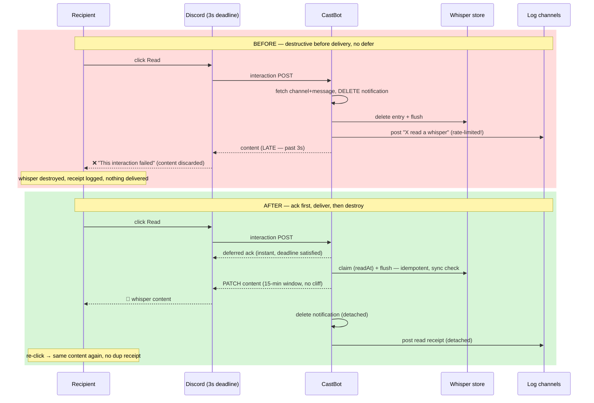

# RaP 0893: Whisper Timeout Tactical Fix — Defer, Deliver-First, Idempotent Reads

**Status**: 🟢 Tier-1 fixes built 2026-07-20, deployed to TEST for the two-account smoke drill. Prod deploy on Reece's word after the drill.
**Severity**: Production UX failure, player-facing, compounding (each failure triggers retries that create duplicates)
**Related**: [RaP 0988 DeferredResponse Timeout](0988_20251012_DeferredResponse_Timeout_Analysis.md) *(the parent class — whisper was never added to its protected list)*, [Incident 06 Heap/GC](../incidents/06-HeapDriftGCDeathSpiral.md) *(the force multiplier)*, [Incident 07 Cache Poisoning](../incidents/07-CachePoisonedLostMove.md) *(same weekend, unrelated mechanism)*, [WhisperSystem.md](../03-features/WhisperSystem.md)

---

## Original Context (Trigger Prompt)

> eXTENSIVELY INVESTIGATE THE WHISPER ARCHITECTURE, LOGS, POTETNAIL DROPOUTS AND THE CLAIMS FROM THIS USER […]
> 🤫 Whisper (E4) — Bryck → Riley: "I swear 75% of messages don't let me read so I've gotta go into Logs to see what it says, and every time I try to say anything I always have to sit through atleast 20 'this interaction failed'"
> 🤫 Whisper (E4) — Riley → Bryck: "Ya I can't read you're last message so still glitchy"
>
> *(follow-up)* switch into planner mode figure out a design to tactically fix whisper for the lowest risk, identify any other low risk low hanging fruit fixes (ones I can reasonably quickly smoke test between me and a test account in not-under-stress-conditions that would be indicative of under-stress conditions). also identify broader whisper architecture changes / recommendations that dont fit that criteria, document this all in a RAP then lets build and deploy to test

## 🤔 The Problem in Plain English

Whisper's two hot paths run **undeferred** inside Discord's 3-second ack deadline while doing multi-second work, and the read path **destroys the whisper before delivering it**. When the ack is late, Discord shows "This interaction failed" even though the operation fully succeeded server-side. That one mechanism produces all three complaints:

- **"Can't read, gotta go into Logs"** — a late read ack means the content never renders, but the notification is already deleted, the store entry already removed, and a "read" receipt already logged. The whisper is permanently unreadable; only the log channel has the text. The Safari Log even records a read the player never saw.
- **"20 interaction faileds"** — every step of the 3-step send flow (Whisper button → player select → modal submit) is its own 3s-deadline candidate; one failure restarts the whole flow.
- **Duplicate log entries (2–3×)** — a late send ack looks like failure, the user resubmits, and both whispers were real. Measured live: the 04:33:34Z send took 3.8s (3.2s of it posting to the Safari Log channels *after* the notification was already delivered), the sender resubmitted 6s later. Bryck's 4-clicks-in-2.2s on one Read button produced three concurrent reads (no idempotency guard) and the `Unknown Message` delete error.

**Production evidence (Jul 20, E4 session, guild 1524773737973682267):** 41 sends — median 1.9s, 6 over 3s (15%), worst 8.4s. 41 reads — 4 over 3s, worst 44.6s. Server-side duration is a *lower bound* on what Discord measures. All of this on a **healthy** box; during the Jul 18–19 GC death spirals (3 heap OOMs, 10 restarts in ~25h) the failure rate multiplies — that is when "75%" stops being hyperbole.

## 💡 Tier 1 — The Tactical Fix (this change)

| # | Change | Where | Risk |
|---|---|---|---|
| T1 | `deferred: true` on `whisper_read` and `safari_whisper`; convert `whisper_send_modal_` from raw `res.send` to `ButtonHandlerFactory.create({deferred: true})` | app.js ~4769, ~4813, ~40699 | **Low** — 19+ deferred handlers incl. 3 modal submits (`file_import_submit`, `channels_*_modal_`, `castbot_logs_modal`) use the identical factory path |
| T2 | Claim-on-read idempotency: `readAt` flag replaces delete-on-read; sync check+mark closes the double-click race; re-click **re-delivers** the same content ("Already read" note) with no duplicate receipt; notification delete + read-receipt logging run **detached, after delivery** | whisperManager.js `handleReadWhisper` + new `claimWhisper()` | **Low** — worst-case bug leaves a notification lingering / a whisper re-readable for ≤24h; failure is availability-biased, never data loss. Store shape back-compat (absent `readAt` = unread) |
| T3 | Safari-Log posting off the send ack path (fire-and-forget with `.catch`) — it was adding up to 3.2s pre-ack because this guild fans out to TWO log channels (main + whisper log) and rides their rate limits | whisperManager.js `sendWhisper` | **Low** — logging is already best-effort/try-caught; entries may land a beat later |
| T4 | Retention prune: read whispers pruned 24h after `readAt` (unread stay 30 days as today) so the store stays small now that reads don't delete | `preloadWhisperStore` + `shouldPruneWhisper()` | **Low** — startup-only, content also lives in log channels |
| T5 | `WHISPER_SIM_LATENCY_MS` env hook (capped 8s, default off, logs loudly): injects delay into send/read handler work — a deterministic, calm-conditions **stress equivalent** | whisperManager.js | **Low** — env-gated, off by default |
| T6 | Observability: log the previously-silent "not for you" clicks; add `whisperId`/`alreadyRead` to delivery logs | whisperManager.js | Trivial |

**Bonus fix riding along:** the old modal-submit handler built a hand-rolled context `{userId, guildId, token}` — so `logWhisper` received `senderName: undefined`. The factory context supplies `username`/`displayName`/`channelName` properly.

**Not fixed, by Discord constraint:** `whisper_player_select_` and `whisper_reply_` return modals — modals must be the immediate response and cannot be deferred. Their pre-modal work is one member fetch + cached parses; accepted residual risk (see Tier 2 #1 for the systemic answer).

**Rollback:** single commit revert; no data migration (readAt is additive).

## 🧪 Smoke-Test Drill (Reece + test account on TEST, ~10 min)

Each step is calm-conditions but *indicative of stress behavior* because it exercises the exact code path that failed under stress:

1. **Send:** whisper from account A to B. Confirmation appears. `npm run logs-test`: modal submit shows the `[🔄 DEFERRED-NEW]` marker, and the Safari Log entry timestamps AFTER "Whisper delivered successfully" (detached logging confirmed).
2. **Double-click read:** B clicks Read twice fast. Content renders; second click shows the "Already read" note; Safari Log has exactly ONE "Whisper Read" entry; no `Unknown Message` error in logs. *(This is literally the 05:31:13Z quad-click scenario.)*
3. **Not-for-you:** A clicks B's Read button → "not for you" + a `[WHISPER]` warn line in logs (previously silent).
4. **Restart persistence:** send a whisper, run win-restart (TEST restarts), B clicks Read after restart → still delivers (PersistentStore regression check).
5. **Stress equivalent (the decisive one):** set `WHISPER_SIM_LATENCY_MS=5000` in the test box `.env`, restart, repeat steps 1–2. Pre-fix this configuration fails 100% ("interaction failed" every time, unreadable whispers). Post-fix: everything works, just ~5s slower. Unset afterwards.

## 🏗️ Tier 2 — Broader Recommendations (do NOT fit the low-risk/quick-smoke-test bar)

1. **Finish RaP 0988 systematically** — ~237 handlers still undeferred; flip the factory default to `deferred: true` with explicit `immediate`/`requiresModal` opt-outs, then burn down the exceptions. Whisper was just the loudest victim of this class.
2. **Safari Log pipeline rework** — single queued writer per guild with rate-limit budgeting and batching; cache safariContent across a posting cycle (today each post re-parses ~3.7MB and the dual-channel fan-out doubles message volume). This is what turned a 0.6s send into 3.8s.
3. **Heap/OOM program (incident 06 / RaP 0915)** — the in-memory playerData store kills both the parse cost and the GC death spirals that multiply every timeout; enable the scheduled-restart module as the stopgap. The whisper fix removes the cliff, but a GC-spiraling box still feels bad.
4. **Whisper UX architecture** — recipient-scoped notifications (public Read buttons in a shared channel invite not-for-you clicks and meta-gaming reads of who-whispers-whom); a "whisper history" view is now natural since read whispers persist 24h; consider per-pair threads or DMs as the real long-term shape.
5. **`processedInteractions` dedup across restarts** — the same-interaction-id retry guard is in-memory; a restart between original and Discord retry reopens a duplicate window. Tiny, but cheap to persist.

## 📎 Appendix: measured latency anatomy of a pre-fix send (04:33:34Z, 3.8s total)

| Segment | ms |
|---|---|
| Modal POST → store write + notification posted (Steps 1–7) | ~600 |
| Safari Log fan-out (2 channels, rate-limited) + wrap-up | ~3200 |
| **Ack sent at** | **3804 (deadline: 3000)** |

The user resubmitted 6s later; both whispers delivered; the Safari Log shows the duplicate pair — matching the user's screenshot exactly.
