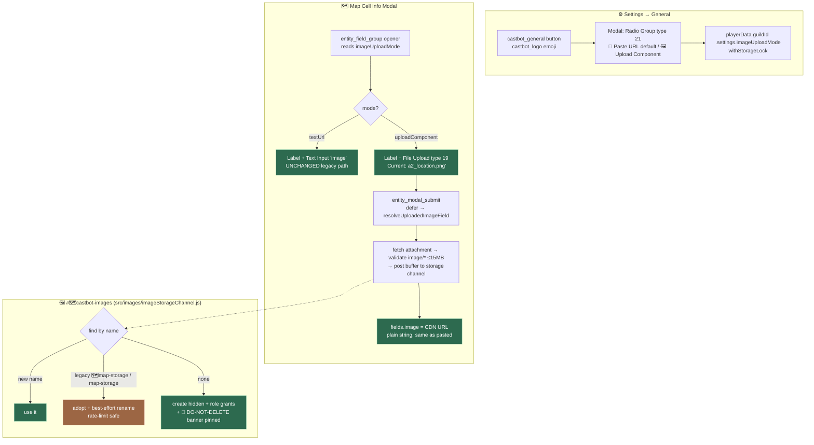

# 🖼️ Image Uploads: Media Gallery Transition (Pilot: Safari Image Anchor)

**Status**: Implemented — pilot live on TEST (map cell location image). **Living feature reference (architecture, file index, "how to convert the next field" recipe) has moved to [docs/03-features/ImageUploads.md](../03-features/ImageUploads.md) — read that first if you're continuing this work.** This document remains as the historical design record (original prompt, rationale for each decision).
**Date**: 2026-07-20
**Related**: [ImageUploads.md (current feature doc)](../03-features/ImageUploads.md) · [Image Handling Techniques (0980)](0980_20251106_ImageHandling_TechnicalAnalysis.md) · [Map Image Oversize OOM (incident 01)](../incidents/01-MapImageOversizeOOM.md) · [RolesSecurity](../03-features/RolesSecurity.md)

## 🤔 Plain English

CastBot's image fields have always been "paste a Discord CDN link" text boxes — users upload an image somewhere in Discord, copy the media link, and paste it in. Discord's modal **File Upload component (type 19)** now lets us take the file directly. This change:

1. Adds a **per-guild toggle** (Settings → **General** → Image Uploads) so image fields can be converted one at a time without a big-bang migration.
2. Renames the `#🗺️map-storage` channel concept to **`#🗺️castbot-images`** — it's no longer just map images; it's where every CastBot-hosted image lives.
3. Pilots the upload flow on the **Safari map cell location image** (the image under the map in the anchor message) — low production risk, and it proves backwards compatibility because the stored value stays a plain URL string.

## 📜 Original Context (Trigger Prompt)

> I want to begin to switch out our legacy 'Image URL' text string, for the @docs/standards/ComponentsV2.md Media Gallery, which was only released somewhat recently.
>
> This would be a large change, so I would like it to be a semi-toggleable process where we can convert 1 by one.
>
> Toggling:
> Add a new button into the Settings Menu, to the left of Player Menu called General (cb_prod logo). On click, opens a modal with a string select / label / etc "Image Uploads" - Controls how images are uploaded to CastBot,. Add a new guild-specific setting in playerData.json. When the modal loads, if no setting / null / set to TextURL, the pre-selected string select option value label etc should be 🔗 'Paste URL' Upload images to discord yourself, copy and paste URL. Then add an option for 🖼️ 'Upload Component' - lets you upload the image and stores in #castbot-images channel (you'll probably need to abbreviate my text between the label and description).
>
> **Map Storage to Image Upload Transition**
> Currently, when someone uploads or edits a safari map, Castbot creates or updates a channel called #🗺️map-storage. I want to change the behaviour of all future map image edits so the channel is called #🗺️castbot-images.. Whenever determining whether #🗺️castbot-images exists, first check for #🗺️map-storage. If found, rename to #🗺️castbot-images and continue., Extensively search the codebase for evidence of where this is created, and ensure there is sound logic and sufficient error handling to avoid any issues (I think it all works by channel ID anyway so hopefully nearly no risk to relabelling this).
>
> **Image Uploads**
> When an image is initially uploaded via the Media Gallery, the image should be posted to #🗺️castbot-images., and then the URL of that image should be stored / retrieved in the same way our 'image url' solution currently works (copy media link). Include appropriate error handling if a user deletes the channel / image. When the channel is initally created, put a large banner at the top with scary enojuis etc warning the user not to deleted it.
>
> **Pilot / candidate Media URL to Image Gallery toggle; minimize the blast radius**
> Lets use the Safari Image Anchor as this is unlikely to be in production use any time soon, involves proving out the backwards compatibility with the location coordinate image ?URL field, and is in close proximity to the images channel renaming requirement since the fog images immediately above it are already stored in map storage.

**Follow-up decision (clarified during planning)**: no Remove checkbox in upload mode. Instead, the File Upload's **Label** (which costs no component budget) carries the existing-image state — `Current: a2_location.png — uploading replaces it.` — with shared helper functions to derive contextual filenames (`buildImageStorageFilename`) and display names (`filenameFromImageUrl`). 0 files = keep; clearing requires switching back to Paste URL mode.

## 🏛️ Why It Was Like This

The paste-URL pattern predates Discord's modal File Upload (Sept 2025) and Radio Group (March 2026) components. `#🗺️map-storage` was born when maps were the only feature that needed hosted images (fog maps, grid overlays) — the name literal then got copy-pasted into three independent lookup sites (mapExplorer, mapCellUpdater fog recovery, safariImportExport audit trail) with no shared constant. Classic winter-coat-in-the-kitchen: each copy made sense the day it was written.

## 💡 The Design

### Key decisions

| Decision | Rationale |
|---|---|
| **Radio Group (21), not String Select** in the General modal | String Select option `default:true` is silently ignored in modals ([ComponentsV2.md gotcha](../standards/ComponentsV2.md), logsConfigUI.js pattern) — Radio Group is the only component that satisfies "pre-selected" |
| Setting at `playerData[guildId].settings.imageUploadMode` | Explicit requirement (playerData.json); creates the guild-level `settings` namespace, mirroring the `permissions` idiom; written under `withStorageLock` |
| `baseContent.image` stays a **bare URL string** | Backwards compatibility is the pilot's purpose — anchor Media Gallery, admin grid view, legacy `map_grid_edit_modal_`, and export all read it as a string today. Discord re-signs CDN URLs embedded in posted components, so display never hits the ~24h expiry |
| **Rename in place**, legacy aliases kept in ALL lookup sites | Creating a fresh channel would strand every stored `fogMapUrl`/`mapStorageChannelId`; a missed alias would create duplicate channels. Names now centralized in `src/images/imageStorageChannel.js` (was 3 duplicated literals) |
| Existing-image state in the File Upload **Label**, no Remove checkbox | Labels cost no component budget; contextual filenames (`a2_location.png`, fog-map convention) make the correlation obvious. 0 files = keep current |
| Image failures **abort the submit before save** | Matches existing validation semantics — nothing partially persisted; user retries |
| No sharp / memory-guard on this path | Bytes are re-posted verbatim (≤15MB); incident-01 guards apply where sharp runs. MIME whitelist (`content_type.startsWith('image/')`) is NEW — no upload path had one before |

### What changed where

| File | Change |
|---|---|
| `src/images/imageStorageChannel.js` | **NEW** — channel name constants + legacy aliases, `findImageStorageChannel`, `findOrCreateImageStorageChannel` (adopt→rename→ensure grants / create→banner), `uploadBufferToImageStorage` |
| `src/images/modalImageUpload.js` | **NEW** — type-19 intent extraction, MIME/size validation, `buildImageStorageFilename` + `filenameFromImageUrl` (shared naming helpers), `resolveUploadedImageField` |
| `src/settings/generalSettings.js` | **NEW** — mode normalize/get/set (storage-locked), General modal builder (Radio Group), submit parse + handler |
| `mapExplorer.js` | `findOrCreateMapStorageChannel` delegates to the shared module; progress strings updated |
| `mapCellUpdater.js` / `safariImportExport.js` | Fog recovery + audit-trail lookups use `findImageStorageChannel` (audit keeps `safari-storage` extra alias) |
| `safariConfigUI.js` | General button (castbot_logo emoji) left of Player Menu; **⚙️ General** section in settings display |
| `fieldEditors.js` | `createFieldGroupModal` threads `options.imageUploadMode`; `buildMapCellImageField` swaps Text Input ↔ File Upload |
| `app.js` (+42 lines, ratchet 52,838/52,850) | `castbot_general` route (factory, requiresModal), `castbot_general_modal` submit (MODAL_SUBMIT section), mode threading in both modal openers, `resolveUploadedImageField` call post-defer in `entity_modal_submit_*` |
| `buttonHandlerFactory.js` | `castbot_general` BUTTON_REGISTRY entry |
| Tests | `tests/generalSettings.test.js`, `tests/imageStorageChannel.test.js`, `tests/modalImageUpload.test.js` (32 tests) |

## ⚠️ Risks & Error Handling

- **Channel deleted by user**: next upload find-or-creates it (with banner). Already-stored URLs keep displaying (Discord re-signs embedded URLs); programmatic refetch paths already fall back to stale `discordImageUrl` (pre-existing behavior).
- **Image message deleted**: same failure mode as a dead pasted URL — broken image in the gallery. Accepted per "stored/retrieved the same way".
- **Rename rate limit** (2 renames/10min): silent-caught; the channel keeps working under its legacy name and the rename retries on a later call.
- **Attachment snowflake leak**: `parseModalSubmission`'s generic path would have stored the raw attachment ID as the image "URL" — `resolveUploadedImageField` always strips the `image_upload` key before `updateEntityFields`.
- **Oversize/non-image uploads**: rejected via Discord's attachment metadata BEFORE download (≤15MB, `image/*`), re-checked on the buffer. Throws pre-save → user sees the error card, nothing persisted.
- **Legacy `map_grid_edit_modal_` editor** (deprecated ActionRow path) validates a `cdn.discordapp.com` prefix — re-hosted URLs ARE `cdn.discordapp.com` attachments, so the two writers stay compatible.

## 🚀 Rollout Path (converting more fields later)

Each future conversion is: (1) thread `getImageUploadMode(guildId)` into the modal builder, (2) swap the image Text Input for a Label-wrapped type-19 (`IMAGE_UPLOAD_COMPONENT_ID`) with a `Current: <filenameFromImageUrl(...)>` description, (3) call `resolveUploadedImageField` post-defer in the submit with a contextual filename slug — **unless** the field is a *download-source* (the pipeline fetches the URL and re-hosts its own artifacts), in which case pass `attachment.url` straight through with no re-hosting (see [ImageUploads.md](../03-features/ImageUploads.md) archetypes). Obvious next adopter: the **enemy** info modal (identical image-as-text-input pattern in fieldEditors.js).

## 📋 Migration Backlog — every remaining image-URL modal input (swept 2026-07-20)

Comprehensive scan (`Image URL`, `image_url`, `custom_id: 'image'`, cdn placeholders across all modal builders). ✅ = converted; numbered = still legacy paste-URL regardless of the guild toggle.

| # | Field | Modal site(s) | Stored at | Archetype | Notes |
|---|---|---|---|---|---|
| ✅ | Map cell location image | [fieldEditors.js:793](../../fieldEditors.js#L793) `buildMapCellImageField` | `maps[].coordinates[].baseContent.image` | Display-URL | The pilot |
| ✅ | Map create/update image | [src/maps/mapUpdateModal.js](../../src/maps/mapUpdateModal.js) | consumed by `executeMapBuild` (pipeline re-hosts its own artifacts) | Download-source | Attachment URL passed straight through; Proceed-Anyway stash unaffected |
| 1 | **Enemy image** | [fieldEditors.js:495-496](../../fieldEditors.js#L495-L496) (enemy `info` group) | `enemy.image` (root) | Display-URL | **Recommended next** — identical shape to the pilot, same `entity_modal_submit_*` handler; shown in combat |
| 2 | Custom Action "Display Text" image | [customActionUI.js:4615](../../customActionUI.js#L4615) (`action_image`) | `action.config.image` | Display-URL | Modern Label modal |
| 3 | Custom Action "Display Text" image — **legacy twin** | [app.js:22552](../../app.js#L22552) (`action_image`, old ModalBuilder) | same data as #2 | Display-URL | Second writer for the same field — convert together with #2, or retire this editor first |
| 4 | Rich Card image (shared field def) | [richCardUI.js:97](../../richCardUI.js#L97) (`id: 'image'`) | per consumer | Display-URL | Shared definition — converting here cascades to its consumers (incl. src/channels views) |
| 5 | Dice Roll result images | [diceRoll.js:366](../../diceRoll.js#L366) | dice pass/fail result config | Display-URL | One image per result card |
| 6 | Challenge image | [challengeManager.js:398](../../challengeManager.js#L398) | challenge config | Display-URL | Field def carries the cdn placeholder |
| 7 | Season App question image | app.js:11174 / 11267 / 11404 (`imageURL`) | `question.imageURL` | Display-URL | Three modal variants (new / edit / completion) share the field shape |
| 8 | Legacy map cell editor | [app.js:35774](../../app.js#L35774) (`map_grid_edit_modal_`) | `baseContent.image` — **same data as the pilot** | Display-URL | Old second writer for already-converted data; enforces a cdn prefix on submit (app.js:44507). Consider **retiring** rather than converting |
| 9 | Tips showcase image | app.js:12415 (`image_url`, per-env) | tips config | Display-URL | Reece-only dev tooling (cdn validation app.js:41484) — lowest priority |

Related, not modal inputs: [editFramework.js:114](../../editFramework.js#L114) MAP_CELL `image` property metadata (informational field def); the Map Explorer no-map instructions ([mapExplorer.js:2212](../../mapExplorer.js#L2212)) are now mode-aware (upload mode says "upload your image directly in the form").
