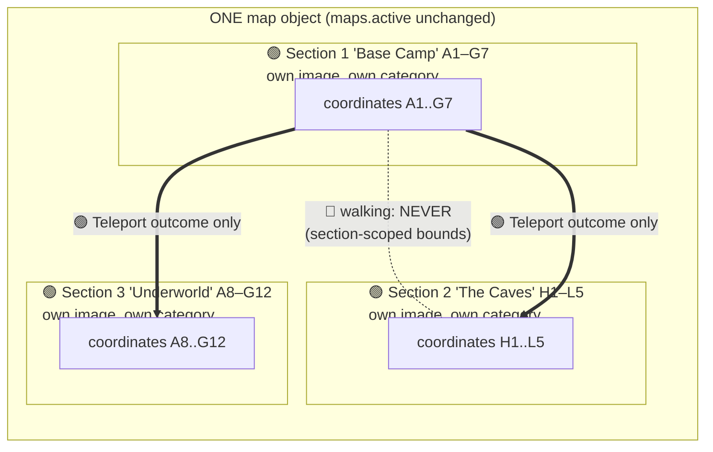
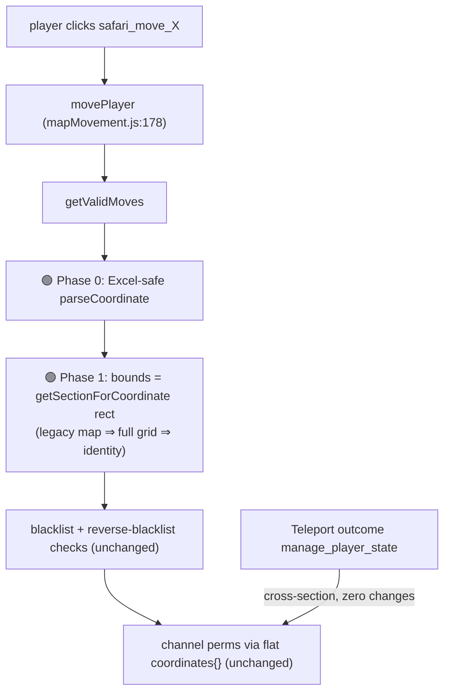
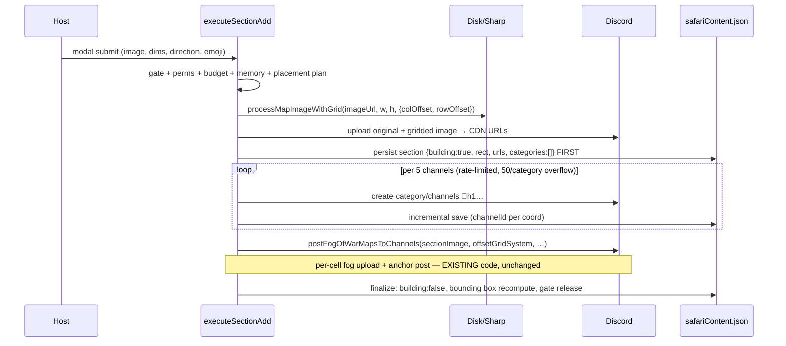

# 0894 — Multi-Section Maps ("Map Annex") — Detailed Design

**Date:** 2026-09-18
**Status:** Design complete — awaiting Reece's review before implementation
**Elaborates:** Option B from [RaP 0895 Multi-Map / Hidden Maps Analysis](0895_20260918_MultiMapHiddenMaps_Analysis.md)

Related:
- [0895 Multi-Map Options Analysis](0895_20260918_MultiMapHiddenMaps_Analysis.md) — the parent options scoping
- [0896 Map Creation Memory Resilience](0896_20260718_MapCreationMemoryResilience_Analysis.md) — memory preflight reused here
- [0953 Initialize/Teleport Outcome](0953_20260308_InitializeTeleportOutcome_Analysis.md) — shipped; the cross-section travel mechanism
- [SafariMapTechnical.md](../03-features/SafariMapTechnical.md), [MapBlacklistOverlay.md](../03-features/MapBlacklistOverlay.md), [SafariReverseBlacklist.md](../03-features/SafariReverseBlacklist.md)

---

## Original Context (full unmodified prompt)

> Lets do another RaP to elaborate on Option B
> What's the ZZ issue? I thought we'd supported this already, are there actual parsing bugs you see or are we just looking at a RaP or guessing?
> One clarification, the intention isn't to resize the map at all. Rather, we maintain and generate separate images per map, so new maps can be added at any time and the channels and grid are generated then. The key thing I guess is through good UI / UX design is enforcing the map grid logic, my GUESS is we'll be in a lot of trouble if we start skipping row or column numbers. And then we'd need to hard cap the navigate controls to ensure they don't spill over, e.g. if map one ends at row 5, a player shouldn't see a South navigate option when they're on Row 5 to move to the corresponding row 6 coordinate.
>
> Basically UI = extend safari_map_explorer to allow moving between maps / creating a new map, perhaps show the < > type buttons we have in other features like apps question editor greyed out and a new map button to the right that fires open map_update (perhaps just modified? or extracted to common function) that gives some guidance on the coordinate barriers in @docs/standards/ComponentsV2.md default text etc. Then it just batch generates the channels in a new category per our current logic, and that's basically it for UI (I'd still want you to extensively search through / evaluate the UI / code and make sure we don't introduce any logic errors anywhere.. )
>
> Business rules for row / cols would be something like:
> GIVEN at least one map exists
> WHEN user adds an additional map
> THEN user can select where to continue the new map ('right' of currently selected map in safari_map_explorer, e.g., will start from col E for example - E1.. E2.. , or if 'below' starts from row 6, e.g., A6, B6...) - include in the RAP options analysis for options on grid generation for this annex option, happy to take your 'just extend via rows' type options but some hosts may want to potentially hide maps and going straight from a map that ends at A4 suddenly to one that starts at R6 will tell the something is uo).
> Spend as many tokens as you want, design the tech integration with the current approach, include regressions so it doesn't break any current maps created under the old regime and has backward compatibility support,etc.). Ask me any clarifying questions, switch into planner mode, think deeply!

**Decisions made in-session (AskUserQuestion, 2026-09-18):**
1. **Placement axes:** both `right` and `below` in v1, relative to the currently-selected section in Map Explorer.
2. **ZZ bug:** full unification — `utils/coordinateParser.js` becomes the single Excel-safe coordinate-math source; all naive sites migrate as pre-work (Phase 0).
3. **Hidden flag:** perma-deferred. Reece: *"Only hosts can see safari_map_explorer and would already know the full season details, our multimap changes should NOT be changing any of the existing channels / anchor gen; only the relevant map should be generated and displayed in the channel anchor message."* Design honors this: adding a section never touches existing channels/anchors; each cell's fog derives from its own section's image; public exposure is controlled because the shared Prod Map publishes only the host-selected section (see §7.4).
4. **Cross-section travel:** teleport-only (`manage_player_state` outcome), forever. No walkable seams.

---

## 1. 🐛 The "ZZ issue" — definitive answer

**It is a real, live, verified bug — not a guess and not RaP folklore.** Verified by direct code reads this session:

- The map-create modal accepts **1–100 per axis** (app.js:47602) with a **≤400 total cells** cap (app.js:47613). So a 27×14 or 100×4 map is creatable *today*.
- Map **creation** is Excel-safe: `getExcelColumn`/`parseExcelColumn`/`generateCoordinate`/`parseCoordinate` (mapExplorer.js:59–104, regex `^([A-Z]+)(\d+)$`) correctly emit `AA1`, `AB1`… beyond column Z. The stored `coordinates{}`, channels, and `navigation{}` data are all valid.
- But the **live movement engine is single-letter naive**: `getValidMoves` computes the column as `coord.charCodeAt(0) - 65` and the row as `parseInt(coord.substring(1))` (mapMovement.js:118–119) and rebuilds targets via `String.fromCharCode(65 + col)` (:148). For `AA5`: column parses as `A`(0), row parses as `parseInt("A5")` = **NaN**. Movement, adjacency validation (movePlayer :232 delegates to getValidMoves), and the compass UI (`getMovementDisplay` :452–453, :466) all break.
- A surprise from the audit: the Excel-safe per-cell `navigation{}` data (built by `generateNavigation`, mapExplorer.js:783+) is **write-only** — movement never reads it. Runtime adjacency is recomputed naively every time. Its only readers are an admin info display (app.js:32981) and the blacklist writer (mapExplorer.js:1798).

**Complete naive-site inventory** (all migrate in Phase 0):

| # | Site | What breaks >26 cols |
|---|---|---|
| 1 | mapMovement.js `getValidMoves` :118–119, :148 | movement validity + button targets |
| 2 | mapMovement.js `getMovementDisplay` :452–453, :466 | compass 3×3 layout |
| 3 | activityLogger.js :719–720 `coordToPosition` | explored/fog activity image |
| 4 | mapExplorer.js :2068–2069 (in `generateBlacklistOverlay`) | blacklist/player tint placement |
| 5 | playerLocationManager.js :326, :334 | admin ASCII grid (also assumes **square** `gridSize` — separate live bug on rectangular maps) |
| 6 | playerLocationManager.js :488–499 `getNearbyPlayers` | whisper proximity |
| 7 | playerLocationImageGenerator.js :246–247 | player-dot placement |
| 8 | safariImportExport.js :180–182, :196–198 | import grid-dim resolution + coord validity (regex `^([A-Z])(\d+)$`) |
| 9 | safariProgress.js :495, :508–515 | row grouping (also hard-wraps at A–Z) |
| 10 | safariMapAdmin.js :1249 | coordinate filter regex `/^[A-Z]\d+$/` |
| 11 | utils/coordinateParser.js :15 `COORDINATE_PATTERN = /^[A-Z]\d+$/` | **rejects `AA1` as invalid** — used by blacklist modal (safariMapAdmin.js:943) and action coordinates (safariActionCoordinates.js:93,143) |

Dead naive code: `createMapGrid` (mapExplorer.js:482) — uncalled legacy, delete it.
Excel-safe canon that already exists: mapExplorer.js:59–104 and mapGridSystem.js `parseCoordinate` :73–99 (the branch the map pipeline uses).

**Why nobody has hit it:** every prod map is ≤8 columns. The bug is harmless ≤26 columns — it only detonates on wide maps, which the modal happily permits.

This matters to Multi-Section Maps because `right` placement grows total columns, making >26 reachable in normal use. Hence Phase 0.

---

## 2. 🎯 Concept

A guild still has **one map object** (`maps.active` untouched — critical, since ~199 inline `maps.active` reads exist across ~25 files). The map gains a `sections[]` array. Each **section**:

- has its **own uploaded image** — no resizing or stitching; existing sections' images, channels, and anchor messages are never touched when a new section is added;
- occupies a **rectangle in the shared, contiguous coordinate namespace** — placed `right` (columns continue from the anchor section's east edge +1) or `below` (rows continue from its south edge +1). Skipped rows/columns are impossible by construction;
- gets its own Discord channels batch-generated in a new category at add-time, reusing the existing creation loop (50-per-category overflow, rate limiting, permission overwrites);
- is **movement-sealed**: navigation bounds are the section's rectangle, so a player on section 1's bottom row never sees a South button into section 2. Cross-section travel is exclusively the shipped Teleport outcome (`manage_player_state`, safariManager.js:3877), which needs **zero changes** (it validates against the flat `coordinates{}`).



### Grid-generation options considered (per the business-rules ask)

| Option | Verdict |
|---|---|
| **Contiguous append from anchor edge (`right`/`below`), origin inherited from anchor** | ✅ **Chosen.** `below` inherits the anchor's `colStart` (anchor starts at A → new section is A6, B6…); `right` inherits the anchor's `rowStart` (→ E1, E2…). Matches Reece's GIVEN/WHEN/THEN exactly. No skips, so no "A4 → R6" leak; predictable coordinate plan; overlap detection resolves collisions. |
| Free-form origin (host types a start coordinate) | ❌ Allows skipped rows/cols — exactly the "we'll be in a lot of trouble" + leak scenario. Rejected. |
| Rows-only appending (RaP 0895's original suggestion) | ❌ Superseded — it existed only to dodge the column-Z bug, which Phase 0 fixes properly. Both axes approved. |
| Per-section coordinate namespaces (`M2-A1`) | ❌ Breaks `safari_move_*` custom_ids, blacklist parsing, coordinateParser, import/export — a rename of the world for cosmetic benefit. |

**Hiding note:** contiguous numbering still lets a player on `A6` infer rows 1–5 exist somewhere. That is the residual leak floor of a shared namespace and was accepted in-session (players always know *a* prior map exists; per-player channel perms + per-cell fog hide everything else).

---

## 3. 💾 Data model

### 3.1 Section schema — new `sections[]` on the ONE map object

```jsonc
"maps": {
  "active": "map_1234",
  "map_1234": {
    // ...ALL existing fields unchanged...
    "gridWidth": 12,        // becomes the BOUNDING BOX width  (max colEnd + 1)
    "gridHeight": 10,       // becomes the BOUNDING BOX height (max rowEnd + 1)
    "sections": [           // ABSENT on legacy maps until first Add Section
      {
        "id": "section_1758150000000",
        "name": "Base Camp",              // display only; auto "Section N" if blank
        "colStart": 0, "rowStart": 0,     // 0-based INCLUSIVE rectangle
        "colEnd": 6,  "rowEnd": 6,
        "imageFile": "map_1234_s1.png",
        "discordImageUrl": "https://cdn.discordapp.com/...",
        "mapStorageMessageId": "...",
        "categories": ["catId1", "catId2"],  // section-owned categories
        "emoji": "📍",
        "building": false,                // true while channel/fog build in flight
        "createdAt": 1758150000000,
        "createdBy": "userId"
      },
      { "id": "section_1758160000000", "name": "The Caves",
        "colStart": 7, "rowStart": 0, "colEnd": 11, "rowEnd": 4, "...": "..." }
    ]
  }
}
```

Design choices:
- **Array, not keyed object** — the pager wants ordinal "N of M"; order = creation order; stable `id` kept for future per-section ops.
- **`map.categories[]` stays the UNION of all sections' categories** (section add appends to both). This single invariant makes `deleteMapGrid` (mapExplorer.js:654) correct with **zero changes** — it already iterates `categories[]` and the flat `coordinates{}` channel ids.
- **Map-level `imageFile`/`discordImageUrl`/`mapStorageMessageId` always mirror section 0**, so any un-audited reader of the map image keeps rendering something sane.
- `coordinates{}`, `blacklistedCoordinates[]`, `playerStates{}`, `config{}` remain **flat and map-global**. Player `mapProgress[mapId]` keys are untouched (sections are sub-map; the mapId never changes).
- Stamina stays global per player (`entityPoints["player_<userId>"]`) — correct, it's one logical map.

### 3.2 Lazy migration — the identity shim (`src/maps/mapSections.js`, new, pure)

A section-less map **reads as** one section spanning its full grid. Nothing is written until the host first adds a section. For the 6 prod guilds with maps, every code path computes exactly what it computes today.

```js
// src/maps/mapSections.js — pure, zero heavy imports, fully unit-testable
import { parseCoordinate, generateCoordinate } from '../../utils/coordinateParser.js';

/** Read-only view: legacy maps synthesize one full-grid section. NEVER writes. */
export function getSections(mapData) {
  if (Array.isArray(mapData?.sections) && mapData.sections.length > 0) return mapData.sections;
  const w = mapData?.gridWidth || mapData?.gridSize || 7;
  const h = mapData?.gridHeight || mapData?.gridSize || 7;
  return [{
    id: 'section_legacy', name: null,
    colStart: 0, rowStart: 0, colEnd: w - 1, rowEnd: h - 1,
    imageFile: mapData?.imageFile, discordImageUrl: mapData?.discordImageUrl,
    mapStorageMessageId: mapData?.mapStorageMessageId,
    categories: mapData?.categories || (mapData?.category ? [mapData.category] : []),
    emoji: '📍', building: false, synthesized: true
  }];
}

export function sectionContains(section, x, y) {
  return x >= section.colStart && x <= section.colEnd &&
         y >= section.rowStart && y <= section.rowEnd;
}

/** @returns {section|null} */
export function getSectionForCoordinate(mapData, coord) {
  let pos; try { pos = parseCoordinate(coord); } catch { return null; }
  return getSections(mapData).find(s => sectionContains(s, pos.x, pos.y)) || null;
}

export function computeBoundingBox(sections) {
  return {
    gridWidth: Math.max(...sections.map(s => s.colEnd)) + 1,
    gridHeight: Math.max(...sections.map(s => s.rowEnd)) + 1
  };
}

/** First write: turn the synthesized legacy view into a real sections[0]. Mutates mapData. */
export function materializeSections(mapData) {
  if (Array.isArray(mapData.sections) && mapData.sections.length > 0) return mapData.sections;
  const [legacy] = getSections(mapData);
  delete legacy.synthesized;
  legacy.id = `section_${Date.now()}`;
  mapData.sections = [legacy];
  return mapData.sections;
}

/** Placement plan + validation. direction: 'right' | 'below'. Returns {rect} or {error}. */
export function planSectionPlacement(sections, anchorSection, direction, newWidth, newHeight) {
  const rect = direction === 'right'
    ? { colStart: anchorSection.colEnd + 1, rowStart: anchorSection.rowStart,
        colEnd: anchorSection.colEnd + newWidth, rowEnd: anchorSection.rowStart + newHeight - 1 }
    : { colStart: anchorSection.colStart, rowStart: anchorSection.rowEnd + 1,
        colEnd: anchorSection.colStart + newWidth - 1, rowEnd: anchorSection.rowEnd + newHeight };
  if (rect.colEnd >= 100 || rect.rowEnd >= 100)
    return { error: 'Total map cannot exceed 100 columns / 100 rows.' };
  for (const s of sections) {
    const overlaps = !(rect.colEnd < s.colStart || rect.colStart > s.colEnd ||
                       rect.rowEnd < s.rowStart || rect.rowStart > s.rowEnd);
    if (overlaps) return { error: `Overlaps existing section "${s.name || s.id}" — try the other direction or a different anchor section.` };
  }
  return { rect };
}

/** Row-major coordinate list for a section rect. */
export function coordinatesForSection(rect) {
  const coords = [];
  for (let y = rect.rowStart; y <= rect.rowEnd; y++)
    for (let x = rect.colStart; x <= rect.colEnd; x++)
      coords.push(generateCoordinate(x, y));
  return coords;
}
```

**Alignment rule justification:** free-form origins buy the host nothing (sections never touch visually — separate images), while inherited origins keep the coordinate plan predictable and make overlaps rare; the `+1`-from-anchor-edge construction makes skipped rows/cols structurally impossible.

### 3.3 `gridWidth`/`gridHeight` become the bounding box — reader audit

Recomputed via `computeBoundingBox` on every section add. Every reader audited:

| Reader | Bounding-box OK? | Action |
|---|---|---|
| mapMovement.js `getMapGridDimensions` :666 → getValidMoves/getMovementDisplay | 🔴 must be section rect | Phase 1: bounds = section rect (function itself stays for other callers) |
| mapExplorer.js explorer header :2215 | 🟢 | Show section dims + "(total WxH)" |
| mapExplorer.js `generateBlacklistOverlay` call :2280 | 🔴 draws on a *section* image | Phase 2/3: section dims + offsets + rect filter |
| MapGridSystem constructions :408, :1091, :1408 | 🔴 for section flows | pass section dims + offsets; legacy calls get offsets 0 |
| Memory preflight (app.js:47631 / mapExplorer.js:1344) | 🟢 uses *requested* dims of the image being processed | reuse as-is |
| safariImportExport `resolveImportGridDims`/`isCoordInGrid` :180/:196 | 🔴 bounding box may contain holes | replace validity test with `coord in mapData.coordinates` (exact & simpler) |
| playerLocationManager ASCII grid :326 | 🟡 host-only debug; holes render empty | Phase 0 fixes its square-`gridSize` bug; Phase 4 optionally section-scopes |
| playerLocationImageGenerator | 🔴 draws on the map image | Phase 4: section image + local offsets |
| activityLogger fog/explored render :719 | 🔴 same | Phase 4; until then filter coords outside section 0 (guard ships Phase 2) |
| safariProgress row logic :495 | 🟡 rows are global; spanning sections is cosmetic grouping | Phase 0 parse fix; revisit Phase 4 |
| `executeMapBuild` dims-immutable check :1724 | 🔴 must compare *section* dims | Phase 3: per-section update path |

---

## 4. 🧭 Section-scoped movement (Phase 1)

**`getValidMoves` (mapMovement.js:117):** after Phase 0's Excel-safe parse, bounds change from the global box to the player's section rect:

```js
const section = mapData ? getSectionForCoordinate(mapData, currentCoordinate) : null;
const bounds = section
  ? { minX: section.colStart, maxX: section.colEnd, minY: section.rowStart, maxY: section.rowEnd }
  : /* defensive fallback: global box via getMapGridDimensions */;
// per-direction: target within bounds (inclusive) → generateCoordinate(x, y)
```

For a legacy single-section map, `bounds` ≡ today's global box — **identity guaranteed by the shim**. A player on a section's edge row simply has no button in that direction (not a disabled 🚫 — the button doesn't exist, same as today's map edge). This solves Reece's "no South from row 5" requirement at the same layer the ZZ bug lives in.

- **`getMovementDisplay` (:425):** its out-of-bounds test (:466) uses the same section bounds, computed once and shared with the `getValidMoves` call.
- **`movePlayer` (:178):** structurally unchanged — adjacency delegates to getValidMoves (:232), blacklist + reverse-blacklist rechecks (:232–257) unchanged, channel-perm grant/revoke (:330/:360) reads flat `coordinates{}` (section-agnostic by design).
- **Teleport:** `manage_player_state` (safariManager.js:3877) validates targets against flat `coordinates{}` and swaps channel perms — **crosses sections with zero changes**.
- **`getNearbyPlayers` (playerLocationManager.js:488):** add a same-section requirement after the Chebyshev check — two coords adjacent across a seam (G5/H5 in different sections) are different physical places. Guards **whisper proximity**. Identity for single-section maps.
- **Blacklist:** stays one map-global `blacklistedCoordinates[]` — works across all sections unchanged; reverse-blacklist items likewise.



---

## 5. 🖼️ MapGridSystem origin offsets (Phase 2)

`scripts/map-tests/mapGridSystem.js` gains `colOffset = 0, rowOffset = 0` options:

1. `getCoordinateLabel(x, y)`: label from `(x + colOffset)` column letters and `(y + rowOffset + 1)` row number → a section image placed at H1 gets grid labels **H, I, J… / 1, 2, 3…** (true coordinates, as required).
2. `parseCoordinate(label)`: after computing global `{x,y}`, return `{ x: x - colOffset, y: y - rowOffset }` — i.e. **section-local** cell position.
3. `generateCoordinateLabels()`: column labels already derive from `getCoordinateLabel` (offset-aware automatically); row label changes from `(i + 1)` to `(i + rowOffset + 1)`.

**Why (2) is the crucial trick:** `createFogBuilder` (mapFogBuilder.js:33) builds local cell rects from `gridWidth/gridHeight` and maps each coord label through `gridSystem.parseCoordinate` (mapFogBuilder.js:52) to a rect on the image. With an offset gridSystem, global coord `H3` resolves to local `(0,2)` on the *section image* — so **`mapFogBuilder` and `postFogOfWarMapsToChannels` (mapExplorer.js:198) work per-section completely unchanged**: pass section image path, offset gridSystem, section channel map, section coord list. Each cell's fog/anchor image derives from its own section's image, by construction — exactly the constraint Reece set.

Constructor sites gaining offsets: mapExplorer.js:408 (regen), :1091 (updateMapImage), :1408 (create) — all offsets 0 for legacy/section 0. Chess-style/numbers-only branches untouched (unused by the map pipeline).

Tests (`tests/mapGridSystem.test.js`): `colOffset:4,rowOffset:5` → `getCoordinateLabel(0,0)==='E6'`, `parseCoordinate('E6')→{x:0,y:0}`; round-trip across the AA boundary.

---

## 6. ➕ Add-Section creation flow (Phase 2)

### 6.1 Entry + modal

- Button **`map_section_add_${idx}`** on the explorer (idx = currently viewed section = the placement anchor). ButtonHandlerFactory + BUTTON_REGISTRY (`map_section_add_*` wildcard key). `map_` prefix ⇒ immune to the `safari_` ≥4-underscore Custom Action swallow (app.js ~4899) — no exclusion-list edits.
- Modal **`map_section_add_modal_${idx}`** — new `buildSectionAddModal(imageUploadMode, anchorIdx)` in `src/maps/mapUpdateModal.js` (same Label-18 archetype as `map_update_modal`). Exactly **5 top-level Labels** (the modal cap — `map_update_modal` create-mode uses 4):
  1. Image — File Upload (type 19) or URL Text Input, per guild upload mode (identical to existing)
  2. `section_rows` (Text, 1–3 chars)
  3. `section_columns` (Text, 1–3 chars)
  4. **Placement** — Radio Group (type 21), `section_direction`: `Right of current section` (`right`, default) / `Below current section` (`below`). Plain-text labels, single `default: true`, no emoji in options (per ComponentsV2 Radio Group gotchas). The Label `description` carries the coordinate-barrier guidance (e.g. "Continues the grid from the selected section's edge — e.g. right of A1–D4 starts at E1").
  5. `section_emoji` (Text, optional, default 📍)
  Section **name** auto-assigns "Section N" (rename = Phase 4) — the 5-component cap forces the cut; emoji shapes every channel name while the name is cosmetic pager text.

### 6.2 `executeSectionAdd` (new export, mapExplorer.js)

```js
export async function executeSectionAdd(client, guildId, userId,
  { imageUrl, rows, cols, direction, emoji, anchorIndex })
```

**Validation order (fail fast, zero side effects first):**
1. `tryBeginMapBuild(guildId)` single-flight gate (mapExplorer.js:25 — same gate create/update use; blocks double-click + concurrent builds).
2. Bot permission preflight (ManageChannels + ManageRoles, reuse :~1283 block).
3. Dims 1–100 each; **≤400 cells per section** (same build-time/memory rationale as map create).
4. **Guild channel budget** — reuse `preflightBudget({existing, create})` from src/channels/channelPlan.js:218 with `create = cells + ceil(cells/50)` categories vs `guild.channels.cache.size`. This adds the 500-channel guard the original create flow never had (back-port to create in the same PR).
5. Memory preflight on the new image dims (RaP 0896: <120MB warn / 50MB hard floor, mapExplorer.js:1344).
6. `materializeSections(mapData)`; anchor = `sections[anchorIndex]` (bounds-checked); `planSectionPlacement(...)` → rect or user-facing error.

**Build sequence (crash-ordering deliberate):**



1. **Image pipeline** (disk only): extract from `createMapGridWithCustomImage` into shared `processMapImageWithGrid(imageUrl, w, h, { colOffset, rowOffset, outputBasename })` — download, offset MapGridSystem (borderSize 80/lineWidth 4/fontSize 40), SVG overlay composite (:1424–1445 logic), >7MB JPEG re-encode. Used by create (offsets 0), updateMapImage, and section add.
2. Upload original + gridded image to the map-storage channel → `discordImageUrl`, `mapStorageMessageId`.
3. **Persist the section record FIRST** with `building: true` — a crash after this leaves a visible, resumable stub, never silent orphans.
4. **Category + channel loop**: extract :~1498–1580 into `createSectionChannels(guild, coords, { categoryBaseName, emoji, roleAccessEntries })` — first category `🗺️ ${sectionName}`, overflow `🗺️ ${sectionName} - Group N`; same @everyone ViewChannel-deny + `getRoleAccessOverwrites(..., SAFARI_CHANNEL_ACCESS)`; same 50-cap split + 5-per-5s rate limit; channel names `${emoji}${coord.toLowerCase()}`. Category ids appended to **both** `section.categories` and `map.categories` (union invariant §3.1). `coordinates[coord]` initialized incrementally every 5 channels (mirrors existing loop).
5. **Fog + anchors**: existing `postFogOfWarMapsToChannels` with section image/gridSystem/channels/coords — internals unchanged (§5).
6. **Finalize**: `building: false`; `{gridWidth, gridHeight} = computeBoundingBox(sections)`; save; `endMapBuild`. Progress streamed like create.

**Failure modes:**
- **Crash mid-build (steps 3–5):** section exists `building: true`; explorer badges "⚠️ build incomplete"; channels created so far are real (teleport to them works; movement confined to the rect — nobody strands); bounding box not yet expanded is harmless (finalize/Resume recomputes). Phase 4 adds Resume/Remove.
- **Double-click / concurrent host:** `tryBeginMapBuild` busy result (existing behavior, tests/mapBuildGate.test.js).
- **Storage discipline:** safariContent load/save at each persist point exactly as the create loop does; playerData untouched in this flow so `withStorageLock` is not needed; the build gate serializes map-build writers.

---

## 7. 🖥️ Explorer UI (Phase 3)

### 7.1 `buildMapExplorerResponse(guildId, userId, client, isEphemeral, sectionIndex = 0)`

- `sections = getSections(mapData)`; clamp index; `section = sections[sectionIndex]`.
- **Header** (when `sections.length > 1`): `**Section:** 2 of 3 — The Caves` · `**Range:** H1 – L5` · `**Grid:** 5x5 (total 12x10)`.
- **Media Gallery**: section's image via `generateBlacklistOverlay` with new `{ colOffset, rowOffset, width, height }` params — tint positions shifted local, and **coords outside the section rect filtered out** (blacklist entries + player tints). The filter guard ships in Phase 2 so a fresh section can never draw off-canvas tints on the section-0 image.
- **Management row**: `Update Map` → **`map_update_section_${idx}`** (updates the *selected* section's image); `Delete Map` (`map_delete`) stays whole-map — confirm text becomes "…and ALL N sections" (per-section delete = Phase 4); `Blacklist` unchanged (global list; Phase 0 makes `AA1+` accepted in its modal).
- **New pager row** under the management row, mirroring the Season Apps pattern (app.js:430 — dynamic `style: disabled ? 2 : 1` + `disabled` at bounds, trailing-int custom_id parse, `updateMessage: true`):
  - 1 section: `[➕ Add Section]` only.
  - >1: `[◀ map_section_prev_${idx}] [「2 of 3」 disabled Secondary] [▶ map_section_next_${idx}] [➕ map_section_add_${idx}]`.
- **Budgets**: container ≈23 components today, pager adds ≤5 → ≈28 of 40. Longest custom_id ≈24 of 100 chars.

### 7.2 Handlers (all ButtonHandlerFactory + BUTTON_REGISTRY, all ephemeral)

| custom_id | Behavior |
|---|---|
| `map_section_prev_${idx}` / `map_section_next_${idx}` | trailing-int parse → rebuild explorer at idx∓1, `updateMessage: true` |
| `map_section_add_${idx}` | `requiresModal: true` → `map_section_add_modal_${idx}` |
| `map_update_section_${idx}` | `requiresModal: true` → `map_update_modal` prefilled with the *section's* dims |
| `map_section_label` | always disabled; registered defensively |

Selected section is **carried in custom_ids only** (stateless, like the season pager — no transient store). `safari_map_explorer` (app.js:32044) always opens at section 0.

### 7.3 Per-section Update Map

`executeMapBuild` (mapExplorer.js:1715) gains `sectionIndex` (default 0): the dims-immutable check (:1724) compares against the **section's** rect dims. `updateMapImage(guild, userId, mapUrl, sectionIndex)` (:980): regenerates only that section's gridded image (offset `processMapImageWithGrid`), updates `section.imageFile/discordImageUrl` (mirrored to map-level when `sectionIndex === 0`), regenerates fog **only for that section's coords**, PATCHes **only that section's anchors** (:1164–1209 loop filtered by `coordinatesForSection`). Anchor PATCH volume = section cell count, never the whole map.

### 7.4 Prod Map — the public leak guard

`safari_shared_map` (app.js:32063) posts a **public, non-ephemeral** map. Rule: **`isEphemeral === false` ⇒ no pager, no Add button, no management row** — the public post renders exactly the host-selected section (the admin-row "Prod Map" button carries the current index, e.g. `map_prod_map_${idx}`): gallery + legend + player-locations text only. Players can never page through sections; combined with per-player channel perms and per-cell fog, unpublished sections are invisible without any hidden flag — which is why the flag was perma-deferred.

---

## 8. 🧪 Phase 0 refactor plan (ZZ unification)

Canonical module: **`utils/coordinateParser.js`** (already pure + tested — the right home):

```js
export const COORDINATE_PATTERN = /^[A-Z]{1,2}\d{1,3}$/;  // 100-col cap ⇒ max "CV"; 100-row ⇒ ≤3 digits
export function getExcelColumn(index) { /* moved from mapExplorer.js:59 */ }
export function parseExcelColumn(column) { /* mapExplorer.js:73 */ }
export function generateCoordinate(x, y) { /* mapExplorer.js:87 */ }
export function parseCoordinate(coord) { /* mapExplorer.js:96 — returns {x, y}, THROWS on malformed */ }
export function tryParseCoordinate(coord) { /* null-returning variant for runtime paths */ }
```

- mapExplorer.js delegates its four functions to the canon (standardize on `{x,y}` — mapExplorer and mapGridSystem already use x/y).
- Migrate all 11 sites from the §1 table; delete dead `createMapGrid` (mapExplorer.js:482).
- Update the 3 pinning test files (tests/coordinateParser.test.js, tests/safariActionCoordinates.test.js, tests/safariImportExport.test.js:173,225): `AA1`/`CV100` become valid; add round-trips (`generateCoordinate(26,9) === 'AA10'`).
- **New grep-ratchet** `tests/coordinateRatchet.test.js`: fail on `charCodeAt(0) - 65` / `fromCharCode(65 +` outside an allowlist of `utils/coordinateParser.js` + mapGridSystem's unused chess branch — prevents the naive pattern from ever being copied back in (the "legacy code is a stronger prompt than CLAUDE.md" lesson, structurally enforced).

Shipped alone, Phase 0 changes nothing for ≤26-column maps (parse-equivalent) and *fixes* movement on wider ones.

---

## 9. 🛡️ Regression matrix (existing single-map guilds — expected change: NONE)

Universal guard: the lazy shim (`getSections` synthesizes one full-grid section ⇒ section rect ≡ global box ⇒ every section-scoped computation is the identity) + Phase 0 parse equivalence for single-letter coords.

| Feature | Path | Expected change | Guarded by |
|---|---|---|---|
| Map create | createMapGridWithCustomImage | None (writes no `sections[]`; offsets 0) | behavior-preserving helper extraction |
| Update image | updateMapImage | None (`sectionIndex` defaults 0 = full grid) | default param + shim |
| Delete map | deleteMapGrid :654 | None | categories-union invariant; flat coordinates (still wipes custom actions :771 — unchanged pre-existing behavior) |
| Blacklist set/clear + overlay | safariMapAdmin :943 / :1798 / generateBlacklistOverlay | Only: `AA1+` now accepted (bug fix); overlay pixel-identical | Phase 0 regex; offset defaults; full-grid filter is a no-op |
| Reverse-blacklist movement | getValidMoves :232–257 | None | section bounds ≡ old bounds |
| Fog + anchors | postFogOfWarMapsToChannels / mapFogBuilder | None (offsets 0 ⇒ parseCoordinate identical) | §5 math |
| Movement compass | getMovementDisplay | None ≤26 cols; FIXED wider | Phase 0 |
| Teleport | manage_player_state :3877 | None | flat coordinates |
| Import/export | safariImportExport | None for full-grid maps (`coord in coordinates` ≡ box check when fully tiled) | §3.3 |
| Progress / whispers / nearby | safariProgress, playerLocationManager | None (same-section check is identity with one section) | shim |
| Player location images / ASCII grid | playerLocationImageGenerator, playerLocationManager :326 | Only: rectangular maps now render correctly (bug fix) | Phase 0 |
| Navigate Tidy / Refresh Anchors | safariMapAdmin | None (flat coordinates + stored fogMapUrl) | flat model |
| Stamina | pointsManager :179 | None (global per player) | untouched |
| mapProgress keys | playerData mapProgress[mapId] | None (mapId unchanged) | sections are sub-map |

Verification per phase: full `tests/` suite (dev-restart gate) + staging-guild smoke: create 7×7 → move all 8 directions at corners/edges → blacklist + overlay → update image → add section right + below → teleport across → attempt seam walk (must show no button) → delete.

---

## 10. 📅 Phasing & effort

| Phase | Scope | Effort | Independently shippable? |
|---|---|---|---|
| **0 — ZZ unification** | coordinateParser canon, 11 site migrations, 3 test updates, grep ratchet | ~1–1.5 days | ✅ fixes a live bug, zero UX change |
| **1 — Sections data model + movement** | `src/maps/mapSections.js` + tests; section-scoped getValidMoves/getMovementDisplay; getNearbyPlayers same-section; import/export coord-existence | ~1 day | ✅ pure identity for all prod guilds |
| **2 — Add-Section creation** | MapGridSystem offsets + tests; extract `processMapImageWithGrid`/`createSectionChannels`; modal + submit + `executeSectionAdd`; channel-budget preflight; overlay rect-filter; `building` flag | ~3–4 days | ✅ dark-launchable behind a bare ➕ button on a test guild |
| **3 — Explorer pager + scoped UI** | pager row + handlers + registry; `sectionIndex` through buildMapExplorerResponse; per-section Update Map; Prod Map section publishing; header/range text | ~2 days | ✅ the user-facing release |
| **4 — Polish** | activityLogger + playerLocationImageGenerator per-section rendering; partial-build Resume/Remove; per-section delete; section rename; export carrying `sections[]` | ~2–3 days incremental | each item independent |

Dependencies: 1→0, 2→1, 3→2. Phases 0 and 1 land as standalone PRs, no feature flag. **Total: ~8–11 dev days** to the user-facing release (through Phase 3), which fits the "2–4 days" RaP 0895 estimate only if Phases 0/1 are counted as the pre-existing-bug cleanup they genuinely are.

---

## ⚠️ Risk register

1. **Helper extraction from `createMapGridWithCustomImage`** is the highest-touch refactor of working prod code — mitigate with behavior-preserving extraction first (offsets 0), verified by a full create/update/delete smoke before any section code lands.
2. **Sharp memory during section-image processing** — bounded by the RaP 0896 preflight (reused verbatim) and the ≤400-cell section cap.
3. **Ratchet-test blast radius** — the three coordinate test files pin single-letter behavior; they change in the same Phase 0 commit (the 2026-07-16 lesson: id-keyed baselines update atomically with the change).
4. **Explorer component budget** — ≈28/40 leaves headroom, but the explorer is the densest menu in the bot; `validateComponentLimit` call added to the builder.
5. **Season pager parse trick** — trailing-int after `lastIndexOf('_')` is proven in prod (season_nav_*); section indexes are plain ints so even simpler.
