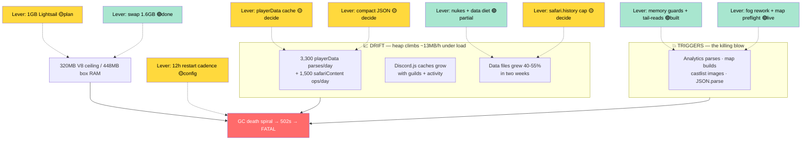

# OOM Levers — Every Dial We Can Turn on the Prod Memory Problem

**Status:** Analysis + live scorecard (several levers already pulled 2026-07-19)
**Date:** 2026-07-19
**Author:** Claude (Fable 5) at Reece's request
**Follows:** [Incident 06 — Heap-Drift GC Death Spiral](../incidents/06-HeapDriftGCDeathSpiral.md) · [RaP 0896 — Map Creation Memory](0896_20260718_MapCreationMemoryResilience_Analysis.md) · [RaP 0903 — Memory Footprint](0903_20260706_MemoryFootprint_Analysis.md) · [RaP 0915 — Memory Leak OOM](0915_20260603_MemoryLeakOOM_Analysis.md)

---

## 📜 Original Context (User's Full Prompt — Verbatim)

> did som enuking but not all
>
> create a RaP based on your analysis, with the focus of different levers to pull for this OOM problem
>
> Then, we've had quite a few of Moai changes staged in different agents so if you can check git for what would go to prod if we push and give me a bit of a plain english castbot UI button name type explanation as i wouldn't mind pushing something soon before US wakes up

Preceded the same day by the incident-06 deep dive ("Alright full blown error deep dive on these logs - ssh etc") and the per-guild size analysis ("lets see if we can get those SafariContent.json and playerData.json file sizes down for prod").

## 🤔 Plain English: The Problem in One Paragraph

Prod is a 448MB Lightsail box. V8 gets a 320MB heap ceiling (`--max-old-space-size=320`). The bot's heap **drifts upward while it runs** — at June's traffic that took ~3 days to hit the ceiling; in July, with 183 guilds, a 5MB playerData file parsed ~3,300 times/day, and **two live safari seasons** grinding 200–400 interactions/hour, it takes **~17 hours**. When the ceiling is near, any big allocation (an analytics parse, a map build, a JSON.parse) triggers a GC death spiral — the bot goes 502-unresponsive while PM2 still says "online" — then dies. There are **two distinct executioners**: the **Linux OOM killer** (box RAM exhausted — the Jul 16–17 map-build kills) and **V8's heap FATAL** (heap ceiling — the Jul 19 crash). Different levers work on different executioners.

## 🏛️ How We Got Here (compressed history)

- **Apr 2026 (incident 03):** first diagnosed V8 OOM during JSON.parse at 6.3-day cadence. P1 fix identified: in-memory playerData cache. Never built.
- **Jun 2026 (RaP 0915):** heap ceiling raised 259→320MB, SIGUSR2 heap dump handler, member-cache sweepers **rejected** (Nov 2025 cold-cache incident — member cache is load-bearing).
- **Jul 6 (RaP 0903):** churn hotspots fixed (pm2ErrorLogger tail-reads, `sharp.cache(false)`), 🌙 Scheduled Auto-Restart built. Compact-JSON deferred.
- **Jul 10–17:** OOM cadence accelerates (Jul 16 ×3, Jul 17 ×2 — kernel kills during 7×7 fog builds). Fog algorithm reworked O(N²)→O(N) (RaP 0896), swap raised to 1.6GB → kernel kills stop.
- **Jul 19 (incident 06):** V8 heap FATAL at 17.7h uptime; killing blow was two full-file analytics parses. Same day: core dumps disabled, memory guards + bounded tail-reads built, dead-guild nukes executed.

## 📊 The Mechanics, With Levers Attached

## 🎚️ The Lever Board (the point of this RaP)

Grouped by **which curve each lever bends**. Impact numbers are from this session's measured data (per-guild ledger, incident 06 logs).

### A. Floor levers — reset the heap before drift matters

| Lever | Impact | Effort | Risk | Status |
|---|---|---|---|---|
| **A1. 🌙 Auto-Restart 24h → 12h** | Halves the daily danger window; at ~13MB/h drift, heap stays under ~240MB | 1 min, Data menu modal, no deploy | None (warned + cancellable) | 🟡 **Reece's click** |
| A2. Ultramonitor hourly (from daily) | Visibility only — heapUsed/heapLimit % is the crash predictor; hourly = see the spiral hours ahead | 1 min, modal | None (pings only on CRITICAL) | 🟡 Reece's click |

### B. Drift levers — slow the climb

| Lever | Impact | Effort | Risk | Status |
|---|---|---|---|---|
| **B1. Dead-guild nukes** | −2.39MB executed today (playerData 5.30→4.22MB, safariContent 3.71→2.40MB, 181→177 guilds). ~0.3MB of the shortlist remains (guilds Reece may not be a member of — scriptable) | Buttons / small script | Low (dead data) | 🟢 **Mostly done 2026-07-19** |
| **B2. safari.history cap** (keep last N entries/player) | ~1.1MB in LIVE guilds now, and permanently bounds the #1 growth category (1.57MB total, 10k entries with embedded action text). Only lever that shrinks the live Thespi Hunt data | Small code (trim on append) | Low-med (product call: Activity Log scrollback shortens) | 🟡 **Decide** |
| **B3. playerData in-memory cache (mtime invalidation)** | Kills ~3,300 full parses/day ≈ 17GB/day of allocation churn — the single highest-leverage code fix (incident 03's P1, 3 months old) | Medium code | **Med — cache-adjacent** (prior cache burns: Nov 2025). Needs dedicated design + Reece sign-off | 🟡 **Decide** |
| **B4. Compact JSON in prod** (`stringify(data)` env-gated) | −25–40% on every parse AND save string; at 4.2MB that's ~1.3MB less per cold parse, ×3,300/day | One line + env gate | Low (files stop being pretty over SSH; `jq` unaffected) | 🟡 **Decide** (open since RaP 0903) |
| B5. Export-then-nuke staging guilds (e.g. CastBotVivor S1 = Thespi template, 434KB) | ~0.4MB | Safari ZIP export + nuke buttons | Low (verify it's really a template first) | 🟡 Reece confirms |
| B6. Ended-season purges (applications 332KB live, mapProgress 183KB live) | ~0.5MB | Code/product | Med (deletes real season records) | 🅿️ Parked |

### C. Trigger levers — blunt the killing blows

| Lever | Impact | Effort | Risk | Status |
|---|---|---|---|---|
| C1. Memory guards on bulk analytics (`utils/memoryGuard.js`: box-RAM + V8-heap budgets) | Would have refused both incident-06 clicks | Done | Very low | 🟢 **Built, on TEST — needs prod deploy** |
| C2. Bounded tail-reads (`utils/fileTail.js`: 15MB server-stats / 2MB live-analytics) | Caps the analytics parse forever (log keeps growing on disk by design) | Done | Very low | 🟢 **Built, on TEST — needs prod deploy** |
| C3. Fog rework + map pre-flight + build mutex (RaP 0896) | Map-build peak ~2× lower; ~120MB-headroom warning gate | Done | — | 🟢 **Live on prod** |
| C4. sharp.cache(false), pm2ErrorLogger tail-reads (RaP 0903) | Native reservation + 60s log churn eliminated | Done | — | 🟢 Live on prod |

### D. Ceiling levers — raise the roof

| Lever | Impact | Effort | Risk | Status |
|---|---|---|---|---|
| D1. Swap 634MB → 1.6GB | Killed the kernel-OOM class (zero kernel kills since Jul 17). Does **nothing** for the V8 ceiling | Done | — | 🟢 Done |
| **D2. 1GB+ Lightsail migration** | Heap ceiling ~700MB+; removes the cliff entirely. The honest fix: 183 guilds and two live seasons have outgrown a 448MB box | Snapshot-restore + static-IP reattach (verify — likely NO DNS change, RaP 0896 §F corrected RaP 0915) | Med (migration window) | 🟡 **Plan a window** |
| D3. Raise max-old-space above 320 | ❌ No — box RAM can't back it; trades V8 FATAL for kernel kill + swap thrash | — | — | ❌ Rejected |

### E. Ops hygiene — shrinks outages, not OOMs (for completeness)

| Lever | Impact | Status |
|---|---|---|
| E1. Core dumps off (`LimitCORE=0` + prlimit live procs) | ~40s faster crash recovery; no more 1.1GB token-laden artifacts; disk-fill class closed | 🟢 Done 2026-07-19 |
| E2. `temp/` overlay leak — `_compressed.jpg` derivatives never unlinked (mapExplorer.js:180 vs activityLogger.js:776) | 483MB on disk, growing ~1.4MB per activity-log view in big-map guilds. One-time `rm` + 4-line fix | 🟡 **Approved concept, not yet executed** |
| E3. pm2-logrotate retention (103 files back to Sep 2025) | ~60MB, caps growth | 🟡 Trivial |
| E4. Orphaned `img/` dirs (biggest: 47MB for a guild no longer in playerData) | 50–80MB after cross-check | 🟡 Small script |

## 💡 Recommended Pull Order

1. **A1 now** (Reece, 1 min): 12h restart cadence — closes the daily window while everything else lands.
2. **Deploy the C1/C2 batch to prod** (already soaked on TEST) — the incident-06 trigger class dies.
3. **E2 temp fix + purge** (with permission): biggest box-health win per line of code.
4. **B2 safari.history cap** (after Reece picks N): the only live-guild data shrink.
5. **B4 compact JSON** (Reece's call — one line): biggest churn cut available without touching cache semantics.
6. **B3 playerData cache**: dedicated design session, the real churn killer — treat with the respect prior cache incidents demand.
7. **D2 1GB box**: schedule it; everything above extends the runway, this ends the race.

## ⚠️ Risk Notes on the Undone Levers

- **B3 (cache)** is the one with scar tissue: Nov 2025's member-cache incident and the `forceFresh` race guard (safariManager.js:1771) both prove this codebase has real concurrent-read semantics on playerData. Any cache must respect `withStorageLock` cycles and the multi-process story (dev scripts read the same file). Do NOT slip it into an unrelated PR.
- **B2 (history cap)** changes user-visible Activity Log depth — pick N with the product hat on (50 entries ≈ several days of an active player's history).
- **D2 (migration)** needs the static-IP-reattach assumption verified in the Lightsail console before promising "no DNS change".

## 📌 Where the Numbers Came From

Per-guild ledger + category matrix: this session's `guild-size-report.mjs` / `claimable-ledger.mjs` (scratchpad; CSV survives in scratchpad). Crash forensics: [incident 06](../incidents/06-HeapDriftGCDeathSpiral.md). Drift math: 85MB fresh-boot heap → 315MB in 17.7h (Jul 19 GC trace) ≈ 13MB/h vs June's ~2.4MB/h.

---

**TL;DR:** The OOM problem has four independent dials: reset the heap more often (12h restarts — free), slow the drift (nukes done −2.4MB; history cap, compact JSON, and the long-overdue playerData cache pending), blunt the trigger allocations (guards + bounded tail-reads built today, awaiting prod deploy), and raise the ceiling (1GB box — the eventual real fix). Pull them in that order; each one buys runway even if the others slip.

🎚️ *One cliff, four fences: move the edge, walk slower, trip less, and stop sprinting near it.*
