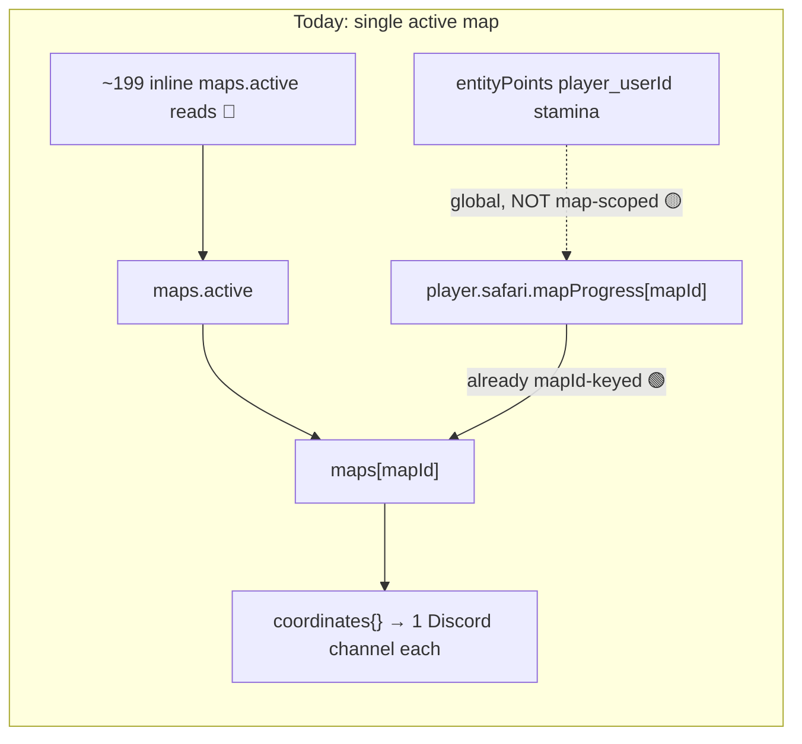
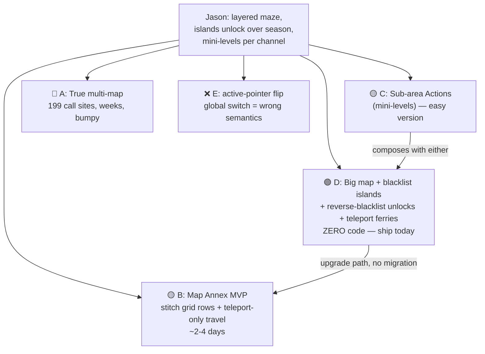

# 0895 — Multi-Map / Hidden Maps (Layered Maze) Analysis

**Date:** 2026-09-18
**Status:** Analysis complete — options scoped, awaiting Reece's pick
**Trigger:** Jason [THES] wants a "layered maze" for ThespiORG S5: Hadestown — multiple maps / islands that unlock as the game progresses, with mini-levels per channel.

Related:
- [0953 Initialize/Teleport Outcome](0953_20260308_InitializeTeleportOutcome_Analysis.md) — **now implemented** (`executeManagePlayerState`, safariManager.js:3877)
- [0973 Shared Map Explorer](0973_20251116_SharedMapExplorer_Design.md)
- [SafariMapTechnical.md](../03-features/SafariMapTechnical.md), [SafariReverseBlacklist.md](../03-features/SafariReverseBlacklist.md), [MapBlacklistOverlay.md](../03-features/MapBlacklistOverlay.md)
- [SafariImportMapIDMismatch.md](../02-implementation-wip/SafariImportMapIDMismatch.md) — documents the "one active map" invariant and treats a second map entry as a bug ("ghost map")

---

## Original Context (full unmodified prompt)

> Scope out the following multi-map / hidden map options from a discord interaction / UI, technical perspective - lay out implementation effort, feature depth, defect risk, etc. Consider various other options.
>
> On top of below, consider an extreme MVP where the user can upload a new map and define a grid, but we basically resize the grids and the only way to move players is a teleport actionl e.g.
> Original map upload -> Creates coordinates A1 to D4 (16 coordinates)
> Second map upload -> Creates coordinates / channels E1 to F4
>
> Ensure you load your context up with how the map system works, technically verify it yourself, review any existing RaPs that might exist this subject (cant remember), design a new rap then TLDR the options at the end of your prompt
>
> See user request:
> I am doing a 100% playthrough of Hogwarts Legacy and the two Lego games
> I 100%'d Lego Years 1-4 last night. Been working on Legacy for months. Fresh into Years 5-7 Lego right now.
> Also...I would love to just officially add you to the hosting team. You don't have to do anything differently than you already do, but you have been a HUGE part of the success of S3 and S4 and would love to just officially add you to give you flowers. All the players listed you in their host rankings haha
>  [THES],
> Reece — 13/09/2026 11:25
> Sure, would love to!!
> Never thought you'd ask 💅!!
> Jason [THES],  — 13/09/2026 11:27
> wanna throw your info here: ⁠ThespiORG S5: Hadestown⁠🎤meet-the-stage-managers
>
> Also for the wiki i'm building:
> https://docs.google.com/forms/d/e/1FAIpQLSfE08ApcU5Wy5emTwUSp4CniYPMNiav1WIfXI07apTP8Lxv8w/viewform?usp=header
> Google Docs
> Host Info for Wiki
> Image
> Reece — 13/09/2026 11:55
> Done for both!
> Jason [THES],  — 13/09/2026 11:58
> hooray!
> Jason [THES],  — Yesterday at 04:46
> do you think a layered maze is doable in reality? i wanna start brainstorming asap
> Jason [THES],  — Yesterday at 09:00
> oooo Premium!
>  [THES],
> Reece — Yesterday at 09:17
> Arrggh how firm is the different-maps requirement?
>
> The problem is it basically involves redesigning the wholeee map / grid / location / stamina system which is a stack of work, so even if I get it done there will probably be a lot of bumpy bugs along the way
>
> Trying to think of some alternatives that aren't going to need a mega redesign but still fit the vibes of what you are after, how do these sound..
> a) Really big ass map but a way to have fog of war to fully black out / hide unexplored spots, and use something like the red-ey map coordinate blacklist system in the attached pics to separate 'parts' of the map, but the full map is blacked out somehow until each player individually discovers location
> b) I could potentially design a little sub-area system in the Action Editor, so its a little less like 'hey you're now in this whole new map' and more like 'hey you're still in coordinate b6 / channel b6, but here's a little sub-map area and you can look around here for more clues that weren't so apparent from the main map and some newer buttons you can click'. If I did this, how important is still retaining stamina vs letting them freely roam in the sub-area? Easy = sub-map area with its own buttons etc. Hard = also bringing the stamina system in the area, blocking the players from also using the parent map coordinate actions, etc.
>
> Image
> Image
> Jason [THES],  — Yesterday at 09:28
> ooo both of those could absolutely work, maybe I could brainstorm what i want to do and we could figure out what to do. I like that map on the left with all the mini islands, and i like the idea of unlocking those islands as the game goes on with like mini levels in each channel.
> Also how do i get premium i want it num num num

---

## 🤔 The Problem in Plain English

Jason wants a *layered maze*: several distinct map areas ("mini islands") that unlock over the season, each with its own mini-levels. CastBot's Safari map system was built as **one map per guild, full stop** — the question is which of five paths gets the "feels like multiple maps" experience without redesigning the map/grid/location/stamina stack.

## 🏛️ How the System Actually Works (verified 2026-09-18)

Everything below was verified directly against the code, not just docs.

**Data model** (`safariContent.json[guildId].maps`):
```js
maps: {
  active: "map_7x7_1758647472567",       // singleton pointer
  "map_7x7_1758647472567": {
    gridWidth, gridHeight,               // rectangular grids fully supported (7x8 live in prod)
    imageFile, discordImageUrl,
    category, categories[],              // 50-per-category overflow handled (mapExplorer.js:1558-1585)
    coordinates: { "A1": { channelId, baseContent, buttons[], navigation{}, fogMapUrl, ... } },
    blacklistedCoordinates: [],
    config: { staminaEnabled, ... }
  }
}
```

**Key verified facts:**

| Fact | Evidence |
|---|---|
| The `maps` dict can physically hold N maps; only `maps.active` is ever read | Live data: every guild has exactly `["active", "<one id>"]` |
| `maps.active` is read inline in **~199 places across ~25 files** (app.js alone: 63) — no `getActiveMap()` abstraction | Explore sweep; e.g. mapMovement.js:22,57,192; safariManager.js:3889,3895 |
| Second map creation is **hard-blocked** | mapExplorer.js:1358 "A map already exists!" and :1786 |
| Player progress is already **keyed by mapId**: `player.safari.mapProgress[mapId] = {currentLocation, exploredCoordinates, ...}` | mapMovement.js:62-97 |
| `setPlayerLocation` already accepts an optional `mapId` param (defaults to active) | mapMovement.js:46,57 |
| **Teleport is implemented** as Custom Action outcome `manage_player_state` (initialize / teleport / init_or_teleport / deinitialize); config is `{mode, coordinate}` — no mapId | safariManager.js:3877-3963 (RaP 0953, shipped) |
| Stamina is **global per player** (`entityPoints["player_<userId>"]`), not per-map | pointsManager.js:179-184 |
| `getValidMoves` checks ONLY grid bounds + blacklist. Per-cell `navigation.blocked` exists in data but is **never consulted** | mapMovement.js:117-166 |
| ⚠️ `getValidMoves` uses single-letter column math (`charCodeAt(0)-65`) — **breaks past column Z**; mapExplorer.js has correct Excel math (`getExcelColumn`:68) but mapMovement.js/activityLogger.js don't use it | mapMovement.js:118,148; activityLogger.js:719 |
| Channel visibility = per-member `permissionOverwrites` on the current cell's channel only; grant-new-then-revoke-old on move | mapMovement.js:266-273,330,360 |
| Fog of war = per-cell sharp-composited images stored per coordinate (`fogMapUrl`), rebuilt via mapCellUpdater.js | mapFogBuilder.js:33-58; mapExplorer.js:230 |
| `deleteMapGrid` deletes the active map **and ALL guild custom actions** (`buttons`) | mapExplorer.js:771-786 |
| No guild-wide 500-channel ceiling guard on map create (only the 50/category split + memory preflight) | mapExplorer.js:1558+; RaP 0896 |
| Reverse blacklist (item-unlocks-cell whitelist) is live in prod | SafariReverseBlacklist.md; mapMovement.js:232-247,644 |

**No prior RaP on multi-map exists.** The closest doc (SafariImportMapIDMismatch.md) treats a second map entry as a *defect* ("ghost map") and hardened import to prevent it.



---

## 💡 The Options

### Option A — True multi-map (thread mapId everywhere) 🔴

Make `maps` genuinely plural: map admin UI for N maps, per-context mapId threading, cross-map teleport (`{mode, coordinate, mapId}`), channel→mapId reverse lookup for every interaction, decide stamina scoping, guard the 500-channel ceiling, fix `deleteMapGrid` (currently nukes all custom actions), fix the >26-column math, update import/export (which was *just hardened to prevent* multiple maps).

- **Effort:** Very high — ~199 call sites across ~25 files touch `maps.active`; realistically weeks, with a long bumpy-bug tail (Reece's instinct in the Discord convo is correct).
- **Feature depth:** Maximum — true separate maps, separate images, separate blacklists/configs.
- **Defect risk:** High. Every movement/teleport/whisper/progress/import path is in the blast radius. Import/export and ghost-map hardening actively fight it.
- **Verdict:** Don't do this for S5. If ever done, step 1 is a `getActiveMap(guildId, mapId?)` resolver seam replacing the 199 inline reads — a standalone, safe refactor that can land first.

### Option B — Extreme MVP: "Map Annex" (stitched grid + teleport-only travel) 🟡 **← recommended build if new code is wanted**

The user-proposed MVP, refined. There is only ever ONE map object — a second upload **extends the active map's grid** with new rows, and the new image is resized + stitched onto the existing image.

- Host uploads annex image + dims (e.g. 4×4). New coordinates are appended **below** as new ROWS (A5–D8), not new columns.
  - *Why rows not columns (deviation from the A1→D4 / E1→F4 example):* row numbers are unbounded; columns break at Z due to the single-letter math in mapMovement.js:118. Appending rows sidesteps a whole bug class. (E1/F4-style column append is possible only if that math is fixed first.)
- Sharp: resize annex image so cell size matches, extend canvas vertically, composite, re-run grid overlay, regenerate fog images for new cells only. All primitives exist in `createMapGridWithCustomImage` / `mapFogBuilder`.
- Channels: reuse the existing channel-creation loop (category overflow already handled). Add the missing 500-channel guild guard while here.
- **Travel between "maps" is Teleport only** — already shipped (`manage_player_state`), zero new movement code. Host wires an Action ("Enter the Underworld…") that teleports to A5, gated however they like (item, usage limits, password modal — all existing systems).
- **Seam control:** walking across row 4→5 must be blocked. Two ways:
  1. Blacklist the entire top row of each annex (players see 🚫 south buttons on row 4 — mildly leaky UX), or
  2. **Insert one fully-blacklisted spacer row** between sections (cleanest; costs `gridWidth` channels… no — spacer cells can skip channel creation entirely if we allow channel-less blacklisted coords, or just eat the cost). Simplest v1: blacklist annex row 1 boundary and accept the 🚫 buttons.
  - Bonus depth for free: **reverse-blacklist an item** = "bridge/ferry unlock" letting late-game players *walk* between islands. Zero new code.
- **Hidden-ness:** per-player channel perms already hide annex channels until teleported. The stitched full-map image *does* show the annex in Map Explorer / shared map — mitigations: (a) host uploads pre-blacked-out annex art then runs `updateMapImage` (existing, image-only update) at reveal time, or (b) later: blacklist-style dark overlay on unrevealed regions (Phase-2 of MapBlacklistOverlay covers the compositing pattern).
- Stamina: shared global pool — *correct* for this design (it's one logical map), and matches "how important is stamina" being negotiable.

**Effort:** ~2–4 dev days. New code is confined to one new build flow (`extendMapGrid`) + a "➕ Add Map Area" admin button; movement/teleport/fog/perms all untouched.
**Feature depth:** High for the effort — real separate-feeling areas with own channels, content, blacklists-within-area, item-gated travel, progressive unlock.
**Defect risk:** Medium-low and *contained*: the risky parts (image stitching, channel batch-create) run once at admin time, not in player hot paths. Named risks: dimension-update prohibition in `executeMapBuild` (mapExplorer.js:1774-1782) must be bypassed carefully; anchor rebuild for existing cells must not re-fire; memory during sharp compositing (see RaP 0896 — the memory preflight already exists).

### Option C — Sub-areas in the Action Editor (virtual layers, no new channels) 🟡

Reece's Discord option (b). Player stays in channel B6; an Action opens an ephemeral "sub-map" UI (Container with its own image, look-around buttons, mini-puzzles). Optionally a `subArea` field on `mapProgress` if state must persist.

- **Effort:** Easy version ~2–3 days (pure Action Editor composition — arguably buildable *today* with chained Custom Actions + usage limits, effort ≈ 0 code). Hard version (stamina inside sub-areas, suppressing parent-cell actions while "inside") = +1 week and touches movement/points — not worth it.
- **Feature depth:** Great for "mini-levels in each channel" (Jason's exact phrase!) — weak for "travel to a different island" feel. No new channels, no map image.
- **Defect risk:** Low (easy version). It's plain Custom Action UI; worst case a broken ephemeral menu, no shared-state damage.

### Option D — Config-only: big map + blacklist islands + staged unlocks 🟢 (ship today)

Everything needed already exists: build ONE large map whose art contains all islands; blacklist the water/dividers; per-island access via reverse-blacklist items granted as the season progresses; teleport Actions as ferries; fog of war + per-player channel perms keep everything undiscovered hidden.

- **Effort:** Zero code. Host-side configuration + map art discipline. (Optional polish: MapBlacklistOverlay Phase 2 multi-color overlay, ~4–6h, already designed.)
- **Feature depth:** Medium — islands share one image and one grid, "unlock" is per-player item grants rather than a global reveal moment. Big grids cost channels (10×10 = 100 channels + categories).
- **Defect risk:** Near zero — every mechanism is deployed and battle-tested in prod.
- This is the **prototype path**: Jason can brainstorm/playtest the maze on D *now*, and B upgrades it later without migration (D's map simply becomes the first section).

### Option E — Multiple map objects with `maps.active` switching ❌ (rejected)

Physically store two maps and flip the `active` pointer. Rejected: the pointer is **global per guild** — flipping it switches *every player simultaneously*, strands `mapProgress` mid-map, doubles live channels with no guard, and fights the ghost-map hardening in import. Least effort on paper, worst semantics in practice.



## ⚠️ Cross-cutting risks (whichever build option is picked)

1. **Channel budget:** no 500-channel guild guard exists; any option adding channels should add one (cheap, reusable — cf. `channelPlan.js` ceiling preflight in src/channels/).
2. **Column-Z bug:** `getValidMoves`/`activityLogger` single-letter math is a live landmine for any grid >26 columns; fix or avoid wide grids (Option B avoids by appending rows).
3. **`deleteMapGrid` nukes all custom actions** — under B, "delete map" deletes annexes too (fine, one map) but hosts must know teleport Actions die with it.
4. **Map Explorer image reveals everything** to whoever can see it — hidden areas need either pre-blacked art + `updateMapImage` at reveal, or an overlay feature.
5. **Import/export:** B's extended grid round-trips fine (still one active map); A would require reworking the just-hardened ghost-map prevention.

## Recommendation

**D now, B next.** Tell Jason yes: start the maze on Option D today (islands, item-gated unlocks, teleport ferries — all live features), sprinkle C-style mini-level Actions per channel, and if S5 needs a true "second map upload" moment, build Option B (Map Annex) as a contained ~2-4 day feature. Do not attempt Option A for this season.
