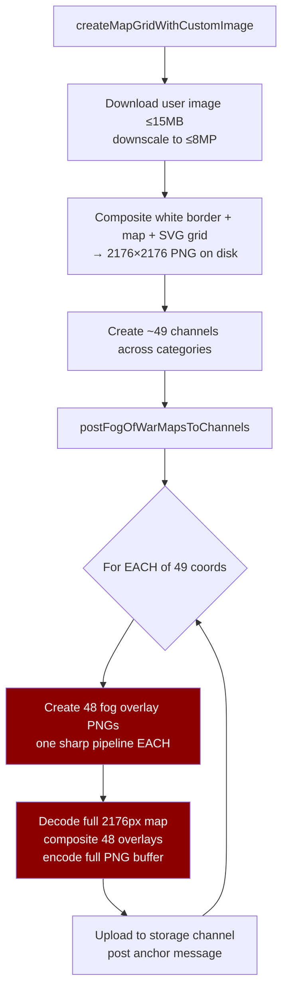
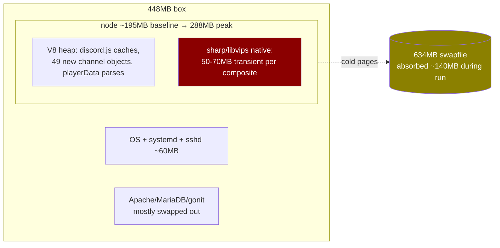

# Map Creation Memory Resilience — Surviving Fog-of-War Generation on a 448MB Box

**Status:** Analysis complete, options awaiting decision
**Date:** 2026-07-18
**Related:** [Memory Leak OOM (RaP 0915)](0915_20260603_MemoryLeakOOM_Analysis.md) · [Memory Footprint (RaP 0903)](0903_20260706_MemoryFootprint_Analysis.md) · [docs/incidents/03-V8HeapOOMCrash.md](../incidents/03-V8HeapOOMCrash.md)

## Original Context (Trigger Prompt)

> okay lets debrief: what are our options for making this memory intensive activity more resilient? (you can stop watching if you want)
>
> Can we make the creation process slower with the sharp images?
> Is there more SWAP we could use on the box, if swap if useful for map creation?
> Do a deep assessment / RaP then give me the tldr options

Preceded by (same day): *"Just had a performance dip in prod and prod watchdog showed it going offline, please investigate"* and *"A user is about to upload a safari mao which might be computationally expensive, please monitor"*.

## 🤔 What Actually Happened (Plain English)

Map creation is the single most memory-violent thing CastBot does, and it runs on the box least able to afford it.

**2026-07-17 (UTC):** Two OOM kills in one evening, both tied to Map Explorer runs during the live THES season:
- **18:59** — kill #1, mid fog-of-war posting (a Cloudflare 504 on one anchor message also tripped the `fogMapUrl` catch-block bug, aborting the loop).
- **20:23–20:27** — a 7×7 map creation finished uploading fog maps at 20:23:55; the OOM killer took node at 20:26:59 (~330MB RSS). The box swap-thrashed for ~1 minute — the watchdog's HTTP probe *and* its SSH remediation both timed out ("box may be down"). systemd's `pm2-bitnami.service` restart policy self-healed in ~10s (restart counter now at 6). OOM cadence has accelerated: Jul 10 ×1, Jul 16 ×3, Jul 17 ×2.

**2026-07-17 20:47 UTC (monitored live):** The same guild deleted and re-created their 7×7 map. Because the bot had *just* been OOM-restarted (fresh ~195MB baseline), the 49-coordinate fog run survived: RSS sawtoothed 260–288MB, peaking ~40MB under the kill zone, 55MB box-available at the worst point. **It succeeded only because of the accidental fresh baseline.** The same run four hours into a normal day would have died.

Post-run: bot settled at ~278MB (V8 keeps grown heap), leaving ~77MB available for the rest of the day.

## 🏛️ Why It's Like This (The Organic Growth Story)

Fog-of-war generation was written when maps were 3×3 test grids on a dev laptop. The algorithm is per-coordinate, from scratch:

The numbers (`createFogOfWarMap`, mapExplorer.js:332):
- **~2,350 sharp pipeline invocations per run**: 49 coords × 48 identical cell-sized black overlay PNGs, regenerated from scratch every coordinate. The overlays are all the same size — grid cells are uniform — so 2,349 of these are pure waste.
- **Per-coordinate composite working set**: 2176×2176 RGBA raw ≈ 19MB input + 19MB output + 48 decoded overlays + libvips pipeline scratch ≈ **50–70MB transient per coordinate**, 49 times in a row, with sharp at default concurrency (2 threads on this 2-vCPU box).
- `sharp.cache(false)` is already set (mapExplorer.js:4) — the churn is inherent to the algorithm, not caching.

The box: 448MB Lightsail, one 634MB Bitnami swapfile (`/mnt/.bitnami.swap`, NVMe-backed), 8.5GB disk free, `max-old-space-size=320` on the bot, ~195–215MB fresh-boot RSS. Headroom to the kill zone: **~120MB on a good day**.

## 📊 Where the Memory Goes During a Run

Observed live (20s polls): RSS 195 → 228 → 288 → sawtooth 260–288 → settle 278. GC keeps pace *between* composites — the danger is (baseline at run start) + (single-composite peak), not accumulation. **That's why "start from a fresh baseline" was the difference between yesterday's kill and today's success.**

## 💡 Options

### A. Fix the algorithm (biggest win per line of code) 🟢
1. **Reuse the fog overlay buffer.** All overlays are identical cell-sized black PNGs. Build ONE, reuse it as the composite input for every cell of every coordinate. ~2,350 sharp invocations → 1. Zero product-visible change.
2. **Pre-render a fully-fogged base once.** Composite all 49 overlays onto the map a single time, then per coordinate composite the one *visible* cell (cropped from the original) onto the fogged base. Per-coordinate work drops from "decode + 48 overlays + encode" to "decode + 1 small paste + encode". Halves per-composite peak and CPU.
3. **(Optional) Cap fog map resolution.** 2176px is generous for an inline Discord image; rendering fog maps at ~1600px cuts raw buffers ~2×, at 1088px ~4×. Product-visible (slightly softer zoom), so Reece's call.

### B. Make it slower — "can we pace the sharp work?" 🟡
Yes, and it helps, but it's a supporting act, not the fix. Pacing gives GC time to keep the sawtooth flat (observed working), but it does **not** reduce the single-composite peak — the thing that actually rides over the cliff. Concretely:
- `sharp.concurrency(1)` for the run (halves libvips thread scratch, ~2× slower per composite — fine, run is I/O-bound on uploads anyway).
- Small per-coordinate pause (500ms–1s; today only pauses 2s every 5 coords). Adds ≤1 min to a 49-coord run.
- Not worth it: `--expose-gc` + manual `global.gc()` — GC is demonstrably keeping up already.

### C. Isolate in a child process (strongest resilience) 🟢
Run fog generation in a spawned worker (`node fogWorker.js`, `--max-old-space-size=96`), parent passes paths/coords, child writes fog PNGs to a temp dir (or uploads directly), exits.
- If the worker OOMs, **only the worker dies** — the bot keeps serving the live season, and the run is retryable per-coordinate.
- All heap AND native memory returns to the OS at child exit — fixes the observed "+80MB RSS forever after a run" retention.
- Cost: the worker's own ~50MB node baseline during the run, and a day of plumbing. This is the same isolation pattern that would later suit castlist/schedule image generation.

### D. More swap — "is swap useful here?" 🟡
- **Can we add it? Trivially yes.** Single 634MB Bitnami swapfile today; 8.5GB free on NVMe. A second 1–1.5GB swapfile (`fallocate`/`mkswap`/`swapon` + fstab line) takes 5 minutes and is fully reversible.
- **Is it useful? As a crash-net, yes; as a fix, no.** During today's run swap absorbed ~140MB of cold pages (Apache/MariaDB/old heap) — that absorption is exactly what kept RAM available for sharp. More swap = more absorption = OOM killer much less likely to fire mid-run.
- **The honest trade:** swap converts a hard kill (10s outage, systemd self-heals) into thrash latency (the 04:26 "performance dip" where SSH itself froze). A *slow* bot mid-map-run beats a *dead* one — the run completes instead of half-building a map — but if the box ever gets deep into 2GB of swap, it will feel awful for minutes. Recommended as cheap insurance alongside A, never instead of it.

### E. Guardrails (product-level resilience) 🟢
1. **Pre-flight headroom check** in the map-create handler: read `MemAvailable` + own RSS; if headroom < ~150MB, tell the admin "CastBot is under memory pressure — map creation for a 7×7 grid needs ~100MB; try again after the nightly restart" (with an admin override). Would have prevented both Jul 17 kills.
2. **Serialize map creation globally** — one run at a time across all guilds (simple module-level mutex; same spirit as withSafariLock).
3. **Fix the `fogMapUrl` catch bug** (mapExplorer.js:302: catch references `const`s declared inside the try → every loop error becomes `ReferenceError`, masking the real error and skipping partial-progress save). Makes failed runs resumable instead of half-lost.

### F. Platform (the actual root fixes, already on the books)
- **Lightsail 512MB → 1GB.** Removes the cliff entirely. Note: RaP 0915 called this "needs DNS cutover (not trivial)" — likely wrong: 13.238.148.170 appears to be a Lightsail **static IP**, which can be detached and re-attached to a new (snapshot-restored, bigger) instance. No DNS change; minutes of downtime. Worth verifying in the Lightsail console.
- **Enable 🌙 Scheduled Auto-Restart** (built, on prod, disabled — RaP 0903). Nightly heap reset makes "fresh baseline" the norm instead of a post-OOM accident.
- **playerData in-memory cache** (RaP 0915 #1) — fixes chronic churn; unrelated to the map spike but lowers the baseline the spike sits on.

## ⚠️ Risk Assessment

| Option | Risk | Why |
|---|---|---|
| A1/A2 algorithm | Low | Pure refactor of one function; output pixel-identical (A1) / near-identical (A2); testable by diffing generated fog PNGs on dev |
| B pacing | Very low | Timing-only changes |
| C child process | Medium | New IPC surface, worker needs sharp + token or file handoff; test thoroughly on dev/test box |
| D swap | Low | Reversible box change; sizing conservative (1GB); **needs Reece's permission (prod box state change)** |
| E guardrails | Low | Additive checks; the mutex must not deadlock with long runs (add timeout) |
| F Lightsail upgrade | Medium | Instance migration; verify static-IP reattach assumption first |

## 🎯 Recommended Sequence

1. **One PR now:** A1 + A2 (algorithm), E3 (`fogMapUrl` fix), E1 (pre-flight check), E2 (mutex), B (`sharp.concurrency(1)` + per-coord pause during fog runs only). Deploy dev → test, verify with a 7×7 test-guild map while watching RSS.
2. **5-minute box change (with permission):** add a 1GB swapfile (D).
3. **Flip on Scheduled Auto-Restart** (F) — it's already shipped and inert.
4. **When ready for real:** 1GB Lightsail migration (F), after verifying static-IP reattach.
5. **If map creation stays hot after 1–4:** child-process isolation (C).

## 📈 Expected Outcome

With A alone, per-coordinate transient drops roughly 2× and pipeline churn ~2,350→~50 invocations; with B, GC pressure flattens further. A fresh-baseline 49-coord run that peaked at 288MB should peak ≈240–255MB — comfortably clear of the cliff even mid-day. E1 makes the remaining bad case (low headroom) a polite refusal instead of a box freeze.

---
🎭 *The map run that survived did so by luck of timing — these options make it survive by design.*
