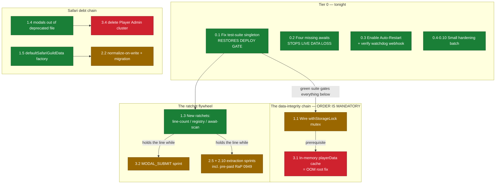

# 0897 — Tech Debt Bang-for-Buck: The Full-Club Sweep 🗿

**Date:** 2026-07-12
**Status:** Analysis complete — awaiting Reece's decisioning. **No code changes made.**
**Method:** 6 parallel deep-dive audits (app.js architecture, data layer & memory, Safari subsystem, infra/prod ops, tests & quality gates, docs & backlog mining) + mechanical door-count scans. All file:line refs verified against the working tree at commit `d8a5a83b`.

Related: [0899 Legacy Button Migration](0899_20260712_LegacyButtonMigration_Analysis.md) · [0898 Interaction Shape Failures](0898_20260712_InteractionShapeFailures_Analysis.md) · [0900 Security Architecture Options](0900_20260711_SecurityArchitectureOptions_Analysis.md) · [0915 Memory Leak OOM](0915_20260610_MemoryLeak_OOM_Analysis.md) · [0903 Memory Footprint](0903_20260706_MemoryFootprint_Analysis.md) · [0949 Tribe Handler Extraction](0949_20260311_TribeHandlerExtraction_Analysis.md)

---

## Original Context (Trigger Prompt)

> use the rest of my tokens to comprehensively analyze our app to identify the best technical changes to make, classifying by effort, value, risk - basically bang for buck ultrathink

Follow-up mid-turn:

> and capture in a RaP for my decisioning, no actual code changes

---

## 🗿 Bouncer Report: The Whole Club

**The Vibe:** The bones are better than they've ever been — three real ratchets, a fast 1,723-test suite, disciplined atomicSave, 85% factory migration. But the bouncer found the fire exit propped open: **the test gate is red on every single run and being routinely skipped**, four missing awaits are **silently eating vanity-role data in production right now**, and app.js has grown to **53,165 lines while the docs still say 21,000**.

**Door Count (measured tonight):**

| Metric | Count | Note |
|---|---|---|
| app.js size | **53,165 lines** | CLAUDE.md claims "21,000+"; target of <5,000 is fantasy at 10× over |
| app.js churn | 153 commits / 3 months | Hottest file in the repo, zero direct tests |
| Legacy handlers | **102** (baseline 103) | 601 factory handlers — 85% migrated, ratchet working, one UNDER baseline 🗿 |
| MODAL_SUBMIT section | **~11,700 lines** | **Invisible to the Moai ratchet** — 4 of the 6 fattest blocks live here |
| Interaction-shape findings | 217 (A:177 / C:6 / D:34) | Class A auto-healed at runtime by SHAPE-GUARD (RaP 0898); ratcheted |
| Old modal dress-code (ActionRow+TextInput) | ~107 sites in app.js, 15 in seasonPlanner | ~50% Label adoption; pre-commit warns, doesn't block |
| Missing awaits (async wrappers) | **4 — live data loss** | `getPlayer`/`updatePlayer` in vanity-roles + age flows |
| Test suite | **1722 pass / 1 FAIL, every run** | Deterministic; deploy gate neutralized via `-skip-tests` |
| Line-weighted test coverage | **<15%** (35/93 modules = misleading 38%) | The entire spine (app.js, castRankingManager, buttonHandlerFactory) untested |
| npm audit | 37 vulns (5 critical, 22 high) | `ws` HIGH is in discord.js's hot path |
| Provably dead code | **~1,800+ lines** | `false &&` branches, unreachable DEPRECATED handlers, dup fallbacks |
| Dynamic `await import()` in app.js | 1,270 (safariManager ×381) | Massive repeated boilerplate |
| Docs with stale `app.js:NNNN` refs | 93 files | All stale by definition |

---

## The Hard Truth

Three of them, actually:

1. **The safety net everyone trusts has a hole in the middle.** `tests/setupWizard.test.js:5` imports the `DiscordMessenger` singleton — the exact pattern TestingStandards.md:84 forbids — and it makes the suite fail deterministically on every run (Node 18 "Unable to deserialize cloned data"). Every `dev-restart.sh` aborts, so the workflow has quietly become `-skip-tests` by default. **The mandatory test gate is currently decorative.** One import fixes it.

2. **The Moai ratchet measures the wrong perimeter.** Legacy *button* count is going down (102 < 103 baseline — genuinely good), but the file grew to 53k lines because the ~11,700-line MODAL_SUBMIT section, the in-file helper functions, and total line count are all unratcheted. The proven lesson of this codebase is that **ratchets work and rules don't** — so the fix is more ratchets (app.js line count, missing-await, registry completeness), not more CLAUDE.md paragraphs.

3. **The mutex was built and never plugged in.** `withStorageLock` (storage.js:20-29) is written, exported, and **called by nothing**. Every one of the 174 `savePlayerData` and 200+ `saveSafariContent` sites is last-writer-wins under same-guild concurrency. This is also the hard prerequisite for the in-memory playerData cache (the OOM root fix, RaP 0915) — shipping the cache before the mutex is precisely how you'd manufacture the "cache ate prod" incident Reece is scarred by.

---

## The Big Board — every candidate, classified

Effort: **S** <1hr · **M** half-day · **L** multi-day. Value/Risk: H/M/L. Sorted by tier (bang-for-buck), then value.

### Tier 0 — Do immediately (S effort, H/M value, L risk — ~one evening total)

| # | Item | Where | Effort | Value | Risk |
|---|---|---|---|---|---|
| 0.1 | **Fix `setupWizard.test.js` singleton import** → suite green → deploy gate restored | tests/setupWizard.test.js:5 | S | **H** | L |
| 0.2 | **Add 4 missing `await`s** — `getPlayer`/`updatePlayer` unawaited: additive vanity-role merge silently WIPES existing roles (27965 reads a Promise → `[]`), saves fire-and-forget (27972, 27995), age modal pre-fill always blank (27206) | app.js:27965, 27972, 27995, 27206 | S | **H** | L |
| 0.3 | **Enable Scheduled Auto-Restart** — set `PROD_WATCHDOG_THRESHOLD=2` in test-box `.env` + `pm2 restart`, enable via Data menu modal. Also **verify `PROD_WATCHDOG_WEBHOOK_URL` is set on the box** — if unset the watchdog is silently OFF (prodWatchdog.js:177-180) and prod-down alerting doesn't exist | test box `.env` | S | H | L |
| 0.4 | **Post-restart health verify in dev-restart.sh** — `pm2 restart` returns 0 on a crash-looping box; deploy reports green on a dead bot (~10 lines: sleep + `pm2 jlist` status/restart_count check) | scripts/dev/dev-restart.sh:119-146 | S | H | L |
| 0.5 | **`npm audit fix` (non-breaking) + discord.js patch bump** — clears the `ws` HIGH (uninit memory disclosure) sitting in the websocket hot path; 14.16.3 → latest 14.x | package.json | S | H | M |
| 0.6 | **Fix prod-deploy restore-glob bug** — `test -f` on a multi-match glob + double slash means `dstState.json`/`scheduledJobs.json` silently DON'T restore after `git pull` whenever >1 backup dir exists (DST incident class) | scripts/deploy-remote-wsl.js:317 | S | M | L |
| 0.7 | **Safari `buildSafariCustomId()` with 100-char guard** — safari custom_ids are raw concatenation with ZERO length guards (`safari_{guild}_{buttonId}_{ts}` can exceed 100 → Discord silently rejects); same construction code that produced the `undefined` bug | safariManager.js:646, 1526-1527 | S | H | L |
| 0.8 | **CLAUDE.md 7 corrections** — 21,000→53,165 (:728); delete dead `dynamicPatterns` section :185-204 (array no longer exists, auto-discovery shipped at app.js:4165); 125→103 legacy (:149); drop stale line refs (:737); fix broken Challenges.md link (:488, file is OLD_Challenges.md); remove "Tentative" (:475, removed in RaP 0902); archive ButtonFactoryDebugSystem.md (describes a removed system) | CLAUDE.md + 1 doc | S | M | L |
| 0.9 | **Delete `map_admin_edit_items_DEPRECATED_` handler** — 140 lines, no emitter, AND unreachable anyway (the non-deprecated `startsWith` prefix at app.js:38152 matches first) | app.js:38311-38451 + registry stub | S | M | L |
| 0.10 | **`.nvmrc` (22) + align prod `npm install` flags** — dev is on Node 18.19.1 (EOL ~14 months) vs prod/test on 22; prod deploy uses bare `npm install` (devDeps + audit network calls on the 512MB box) vs test's `--omit=dev --no-audit` | package.json engines, deploy-remote-wsl.js:331 | S | M | L |

### Tier 1 — This week (S–M, high value, mostly low risk)

| # | Item | Where | Effort | Value | Risk |
|---|---|---|---|---|---|
| 1.1 | **Wire `withStorageLock` around hot load-modify-save paths** — the dead export becomes the read-modify-write mutex. Careful: it must compose with atomicSave's separate write queue (deadlock care). **Hard prerequisite for 3.1** | storage.js:20-29 + hot mutation sites | M | **H** | M |
| 1.2 | **Delete ~800 lines of provably dead app.js code** — 7 `false &&` slash commands (clear_tribe 137L, timezones_add 98L, apply_button 115L…), 2 `false &&` component handlers, 4 commented stubs. `false &&` short-circuits; risk is near-zero | app.js:3160-4155, 26966, 42318 | S | M | L |
| 1.3 | **Three new ratchets** (the proven-highest-leverage change class): (a) **app.js line-count** freeze at 53,165, shrink-only (S); (b) **BUTTON_REGISTRY completeness** — 692 registry entries vs 781 handler branches, close + freeze the gap (S–M); (c) **missing-await scan** for save/update wrappers (M, the 0.2 bug class) | scripts/hooks/pre-commit + tests/ | S–M | **H** | L–M |
| 1.4 | **Move 4 admin modals out of deprecated safariMapAdmin.js** — createStaminaModal/CurrencyModal/CoordinateModal/StartingInfoModal are imported by app.js (10 sites) and playerManagement; the *replacement* reaches into the *deprecated* module. Unblocks eventual deletion | safariMapAdmin.js:712-860 → safariModals.js | S | H | L |
| 1.5 | **`defaultSafariGuildData()` factory** — the guild-data schema shape is copy-pasted across **6 init blocks** (the `enemies:{}` addition had to touch all 6); one factory kills the class | safariManager.js:568+ | M | H | L |
| 1.6 | **Extract `matchPhrase` into a leaf module** — 4 divergent copies in app.js (one trims, three don't → whitespace behavior differs per path) while the test replica matches only one. Drift already in production | app.js:49221, 49294, 49470, 49628 | M | H | L |
| 1.7 | **Backup integrity assert** — backupService reports ✅ even on a corrupt dump; nothing ever verifies restorability. Post-dump `JSON.parse` + guild-count sanity floor; restore-drill script later | src/monitoring/backupService.js:99-149 | M | H | L |
| 1.8 | **Route raw safari writes through atomicSave** — safariManager.js:444/472/510 write the live 2.4MB safariContent.json with no mutex/backup/size-check (the :510 migration path is the worst); challengeManager.js:533 has `minSize: 0` (wipe protection off) | safariManager.js, challengeManager.js | M | M | L |
| 1.9 | **Docs lifecycle sweep** — ~26 docs in the wrong folder (18 shipped features still in 01-RaP incl. 0930/0958/0960 with actively-misleading "Analysis" status; 8 completed impl-wip docs). Plus adopt policy: docs cite symbols, never `app.js:NNNN` (93 files have stale line refs) | docs/ | M | M | L |

### Tier 2 — Structural sprints (M–L, high value, needs care)

| # | Item | Where | Effort | Value | Risk |
|---|---|---|---|---|---|
| 2.1 | **Hoist top-5 dynamic imports to static** — 1,270 inline `await import()` in app.js (safariManager ×381, customActionUI ×146, storage ×74). ~1,000 lines of boilerplate gone + real token-cost cut for every agent reading the file. **Verify no circular deps first** — dynamics may exist *because* of cycles | app.js | M | H | L–M |
| 2.2 | **Normalize action `id`/`label` on write + one-time backfill migration** — the `safari_{guild}_undefined_{ts}` fix (b242f936) is a read-time self-heal papering over two divergent write paths; fix the write side, migrate, delete the heal | safariManager.js:632-707, app.js global_create_modal | M | H | M |
| 2.3 | **Unify stamina regen** — pointsManager carries THREE parallel regen paths + three "CONFIG MISMATCH" reconcile branches; 8 of its last 8 commits are regen bug fixes. Collapse to one function with `{current, max, lastAccrualAt}`, delete the `lastUse` vs `lastRegeneration` dual-anchor | pointsManager.js:343-462 | M | H | M |
| 2.4 | **Unify emoji resolution** — 3 coexisting helpers (`parseTextEmoji`, `parseAndValidateEmoji`, `resolveEmoji`) across 5 files, recurring COMPONENT_INVALID_EMOJI bug class (4 fix commits). One `resolveEmojiForComponent()` everywhere | utils + 5 consumer files | M | H | M |
| 2.5 | **app.js extraction sprint, phase 1 (non-0899-overlapping)** — Tips feature ~500L → tipsManager.js; safari config UI builders 52451-53165 (~700L) → customActionUI.js; generateEmojisForRole → utils; application-question builders ~500L → applicationManager.js. Items are self-contained; ~1,800L out for ~1.5 days | app.js:216-2524, 52451-53165 | M | H | L–M |
| 2.6 | **`handleInteraction` extraction + factory-only replay mini-harness** — export the interaction handler body, replay 5-10 recorded payloads with mocked `res`, assert response shape via the scanner's predicates. Catches the "interaction failed" class pre-deploy without full app.js surgery | app.js:2525 | M | H | M |
| 2.7 | **Automate the port-80 Apache-wins fix on prod** — the most-documented recurring outage is still a manual runbook; systemd drop-in / `@reboot` guard until the blue/green flip retires the class | prod box | M | H | M |
| 2.8 | **RaP 0900 Option A next phase** — declare-or-deny ratchet already shipped; next: enforce registry `security` field at the app.js:4144 dispatch chokepoint in shadow mode (log-only `WOULD-DENY` for a week) then flip. ~51% of factory handlers still rely on inline checks or nothing | app.js:4144, buttonHandlerFactory.js | M | H | M |
| 2.9 | **Version-control prod's PM2 ecosystem config + remediate script + provisioning steps** — prod's PM2 env/NODE_OPTIONS/max_restarts live only in the box's runtime dump; a rebuild is archaeology | repo (new files) | M | M | L |
| 2.10 | **Cash in the pre-paid backlog** — analysis-complete, never built: **0949 TribeHandlerExtraction** (extraction map already written — directly attacks the 53k monolith), 0956 terminology low-hanging fruit (decision-only), 0953 OutcomeListStringSelect, 0939 SeasonAppsStringSelect, 0935 CastlistFactoryMigration (shrinks the 103 baseline), impl-wip `SafariImportMapIDMismatch.md` (a ready bug fix), `CentralizedBackButtonFactory.md` | docs/01-RaP + 02-wip | S–M each | M–H | L–M |

### Tier 3 — Big rocks (L effort; sequence-gated)

| # | Item | Where | Effort | Value | Risk | Gate |
|---|---|---|---|---|---|---|
| 3.1 | **In-memory playerData cache w/ write-through** — deletes the ~3.8MB `JSON.parse` per interaction that is the documented OOM killing blow (RaP 0915 incident 03). Known bypasses to fix: analyticsLogger.js:278 `readFileSync`, safariManager raw writes (1.8) | storage.js + call-site audit | L | **H** | **H** | **AFTER 1.1 mutex** — else it structurally worsens last-writer-wins (shared mutable ref, aliasing, atomicSave-abort divergence) |
| 3.2 | **MODAL_SUBMIT extraction sprint** — ~11,700 lines invisible to the Moai metric; contains tribe_swap_merge_modal (588L), _give_item (452L), entity_search_modal (381L). Enumerate every `res.send` path per handler first (0899 discipline). Add a modal-section ratchet so it can't regrow | app.js:40204-51930 | L | H | M | Independent of 0899 — can run parallel |
| 3.3 | **Split safariManager.js (10,990L)** — seams are pre-cut: extract *leaf* clusters first (combat, attributes, conditions — few callers), then rounds/results (~3,800L), action engine last. Must grep-verify every named import across the 381 dynamic-import sites | safariManager.js | L | H | M | After 2.1 (static imports make the split mechanical) |
| 3.4 | **Delete legacy Player Admin inventory-editor cluster** — ~830 lines app.js + ~300 in safariMapAdmin, reachable only via the hidden legacy menu, superseded by Super Player Menu. Gate: confirm feature parity first | app.js:38078-38910, 46251-46330 | L | H | M | After 1.4 (modals relocated) + parity check |
| 3.5 | **Full recorded-payload e2e harness** | tests/ | L | H | M | After 2.6 |
| 3.6 | **Test de-replication program** — 82% of test files copy logic inline (drift proven in prod via matchPhrase); progressively extract pure leaf modules and import them | tests/ + leaf modules | M per leaf, L total | H | L | Rolling |

---

## Sequencing — why order matters

**RED = do NOT start until its gate is done.** The cache (3.1) before the mutex (1.1) is the single most dangerous move available — it converts today's rare same-guild race into a structural one, on the exact subsystem where a past cache change burned prod (docs/incidents/castlistCrashIssues_cache.md). The evidence-based order is: awaits → mutex → cache.

**GREEN Tier 0 first, always.** Item 0.1 is the meta-fix: until the suite is green, every other change ships through a bypassed gate.

---

## What I deliberately did NOT rank highly

- **More CLAUDE.md rules.** Proven ineffective vs ratchets in this repo (the Moai experiment, 2026-03-09). Doc fixes in 0.8 are about removing *wrong* guidance, not adding more.
- **Sweeping "leaky" Maps.** The measured truth (RaP 0915, re-verified): app-level collections are bounded or negligible-KB. The heap drift is Discord.js member-cache internals, which are **load-bearing — do not sweep** (Nov 2025 incident). Minor TTL hygiene on `dropConfigState`/`pendingExecuteOn` is Tier-2 housekeeping at best.
- **The old-modal (ActionRow+TextInput) migration as a project.** ~107 sites, cosmetic-deprecation class, already warn-gated in pre-commit. Migrate opportunistically when touching a handler; promoting the warn to a block for *new* code is the only cheap win worth taking.
- **Chasing the 38% coverage number.** It's module-count theater. The valuable moves are the replay mini-harness (2.6) and de-replication (3.6), which test the actual spine.

## Risk assessment summary

| Change class | Prod risk | Mitigation |
|---|---|---|
| Tier 0 items | Minimal — additive/config/doc | Dev + test soak per normal flow; 0.5 (deps) needs the clean-install protocol on the 512MB box |
| Mutex (1.1) | Med — deadlock with atomicSave queue | Compose queues, add timeout, soak on test box under concurrent-click testing |
| Extractions (2.5, 3.2, 3.3) | Med — behavior must be bit-identical | Enumerate every `res.send` path pre-move (0899 discipline); shape-ratchet + green suite as the net |
| In-mem cache (3.1) | High — aliasing, stale bypass readers, prior incident scar tissue | Only after mutex; fix bypass readers first; shadow-verify (read-through compare vs disk) for a week before trusting |
| Prod-box changes (2.7, 0.6) | Med — touching the fragile Bitnami box | Read-only verify current state first (`systemctl is-enabled bitnami/nginx`), change in maintenance window |

---

## TL;DR for decisioning

**Tonight (Tier 0, ~an evening):** fix the red test (restores the deploy gate), add 4 awaits (stops live data loss), enable Auto-Restart + verify the watchdog webhook, health-check the test deploy, `npm audit fix`, restore-glob fix, custom_id guard, CLAUDE.md truth pass, delete the unreachable handler, `.nvmrc`. Ten items, all S-effort, collectively closing the three worst live holes.

**This week (Tier 1):** wire the mutex, delete ~800 dead lines, add three ratchets, un-deprecate the safari modals, guild-data factory, matchPhrase leaf, backup assert.

**Sprints (Tier 2):** static imports, write-path normalization, stamina/emoji unification, extraction phase 1, replay harness, port-80 automation, security shadow-mode, and cash in RaP 0949.

**Big rocks (Tier 3, gated):** in-memory cache (after mutex — the OOM root fix), MODAL_SUBMIT sprint, safariManager split, Player Admin deletion.

The stone has spoken. The club's improving — but lock the fire exit first. 🗿
