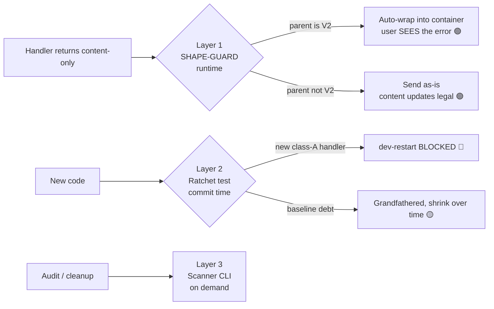

# RaP 0898 — Interaction Shape Failures: the invisible "This interaction failed" class

**Date**: 2026-07-12
**Status**: ✅ Mitigations implemented (scanner + runtime SHAPE-GUARD + ratchet test), debt baseline frozen
**Related**: [0900 Security Architecture](0900_20260711_SecurityArchitectureOptions_Analysis.md) (ratchet pattern), [0899 Legacy Button Migration](0899_20260712_LegacyButtonMigration_Analysis.md), [ComponentsV2.md](../standards/ComponentsV2.md), [ComponentsV2Issues.md](../troubleshooting/ComponentsV2Issues.md)

---

## Original Context (trigger prompt)

> work out an approach to identify these interaction failure style errors in our code, work out a method to plug them and mitigate this from happening in the future, and then do a comprehensive scawn of our entire codebase classifying / stratifying everything by a risk based approach or similar, document in a raP and tldr the highest impact items

Triggered by the **2026-07-12 give_item incident**: a fresh prod guild with zero items clicked "Give Item" in the Action Editor and got "This interaction failed" seven times. The handler *was* returning a friendly "❌ No items available. Create items first" — but as a `content`-only object under `updateMessage: true`, onto a Components V2 message. Discord rejects that shape, and **nothing is logged server-side**, because interaction responses are HTTP replies to Discord's webhook POST — Discord never tells the bot it rejected the payload.

## 🤔 The Problem in Plain English

Discord has a family of response shapes it rejects **silently from the bot's perspective**. The user sees "This interaction failed"; the bot logs a happy `✅ SUCCESS` and moves on. The nastiest member of the family:

> A message sent with `IS_COMPONENTS_V2` can never carry top-level `content`. An UPDATE_MESSAGE response to a V2 message that supplies only `content` is therefore a guaranteed 400 — but only the *user* ever sees the failure.

Because CastBot's UIs are V2 containers (mandated by CLAUDE.md), and because **error paths are overwhelmingly written as `return { content: '❌ …', ephemeral: true }`**, nearly every error message in an `updateMessage: true` handler was invisible. Errors are exactly when users most need feedback — and exactly the paths that get the least testing.

### Why there's no feedback loop (the "organic growth story")

Interaction responses go back as the HTTP response body. There is no status code from Discord, no error event, no webhook. `res.send()` succeeds whether Discord accepts the payload or not. So this bug class:
1. never appears in logs or PM2 error monitoring,
2. only manifests on paths that need specific state to reach (no items, deleted season, expired session),
3. and pattern-replicates freely — new handlers copy the `return { content: '❌ …' }` idiom from the 170+ existing examples. (Legacy code is a stronger prompt than documentation.)

## 🔬 Detection Approach

`scripts/scan-interaction-shapes.js` — a string/template-aware brace-matching static scanner (no AST dependency, same philosophy as the RaP 0900 security ratchet). It extracts every `ButtonHandlerFactory.create({...})` block, finds all `return {...}` object literals, resolves their **depth-1 keys**, and classifies:

| Class | Shape | Why it fails | Count (2026-07-12) |
|---|---|---|---|
| **A** `content_only_update` | `updateMessage: true` handler returns `{ content }` with no `components` | Content-only update onto a V2 parent → 400, invisible | **177** returns across **123 handlers** |
| **B** `content_with_v2_flag` | `content` + `flags` containing `1 << 15` in one object | V2 forbids `content` outright, any context | **1** (in ButtonHandlerFactory itself — fixed) |
| **C** `legacy_update_content` | direct `res.send(UPDATE_MESSAGE)` with content-only `data` | Same as A, legacy pattern | **6** |
| **D** `legacy_update_flags` | direct `res.send(UPDATE_MESSAGE)` with `flags`/`ephemeral` in `data` | Discord rejects/ignores flags on update; fragile | **34** |

Run it: `node scripts/scan-interaction-shapes.js` (or `--json`).

## 📊 Risk Stratification (scan of 2026-07-12)

Class A broken down by blast radius:

| Stratum | Count | Meaning |
|---|---|---|
| 🔴 **MAIN-path** (content doesn't start with ❌/⚠️) | **6** | Fails on **every** invocation of that path — `delete_application_confirm` success message, `ca_schedule_cancel` fallback, 3× `app_config_selection` session messages, `map_admin_blacklist_modal` |
| 🟠 **Error-path, player-facing handler** (no `requiresPermission`) | ~70 of 72 player-facing | Players hitting any error state get "interaction failed" instead of guidance — the give_item experience, everywhere |
| 🟡 **Error-path, admin handler** | ~105 | Admins lose error feedback; most common bucket (all of `safari_action_type_select`'s "Button not found" family, season editor, planner, D20/prob config, …) |

Class D note: these 34 have mostly "worked" because Discord *ignores* unknown flags on update in many cases rather than rejecting — treat as fragile debt, verify before mass-editing; migrate to the factory instead.

## 💡 Mitigation — three layers

1. **Runtime SHAPE-GUARD** (`buttonHandlerFactory.js` → `sendResponse`, new 4th param `parentMessage`): the interaction payload includes the parent message, so the guard knows *precisely* whether it's V2 (`message.flags & (1 << 15)`). If a content-only update targets a V2 parent, it auto-wraps the content into `{ type: 17, components: [{ type: 10, content }] }` and logs `🛡️ [SHAPE-GUARD]`. **This heals all 177 class-A returns at runtime** without touching them, and leaves legitimate non-V2 content updates alone. Zero behavior change for correct handlers.
2. **Ratchet test** (`tests/interactionResponseShape.test.js`, runs on every `dev-restart`): 123 grandfathered class-A handler keys (position-independent `file::handlerId::A`), FROZEN_MAX tamper guard, class B pinned at **0 forever**, classes C/D count-ratcheted downward. New violations fail the commit with fix-it guidance.
3. **Scanner CLI** for audits and for shrinking the baseline over time.

Also fixed directly: the factory's own class-B instance (deferred-modal error sent `content` + V2 flag — the error about failing to show a modal was itself invisible, a bug in the error handler for a bug).

### Why not "just fix all 177"?
A 177-site mechanical edit across app.js is high-risk (touching ~120 handlers in one sweep) for zero user-visible gain over the guard: the guard produces the identical container the hand-fix would. The right long-term move is shrinking the baseline as handlers get touched for other reasons — the ratchet enforces monotonic progress and the guard makes the debt harmless meanwhile.

## ⚠️ Residual Risks / Not Covered

- **Deferred path**: `updateDeferredResponse` (webhook PATCH `@original`) can hit the same V2/content conflict; REST PATCH *does* return errors (logged), so it's visible-but-broken rather than invisible. Candidate for a follow-up guard.
- **Non-factory `res.send` sites** (classes C/D) get no runtime guard — count-ratcheted only.
- Other silent-rejection shapes (component >40, >25 select options, >5 buttons/row, bad emoji) are runtime-data-dependent and can't be caught statically; `validateComponentLimit()` and emoji sanitization already cover the worst.
- Anonymous factory handlers (4) have line-anchored ratchet keys — give them `id`s when touched.

## 🎯 TLDR — highest-impact items

1. **~170 error messages across the bot were invisible** ("This interaction failed" instead of the actual error) — every `return { content: '❌…' }` in an updateMessage handler onto V2 UI. **Now auto-healed at runtime by the SHAPE-GUARD.**
2. **6 MAIN-path failures** were guaranteed breakage on every use: `delete_application_confirm`'s success message, `app_config_selection`'s session-expiry messages (×3), `map_admin_blacklist_modal`, `ca_schedule_cancel`'s fallback. All healed by the guard; fix properly when next touched.
3. **The failure class is structurally blocked**: ratchet test fails any commit adding a new content-only updateMessage return; class B (content+V2 flag) is pinned at zero.
4. **Root enabler**: Discord gives zero feedback on rejected interaction responses — no log line will ever show these. Static scanning + runtime shape-repair is the only defense; monitoring can't help.
