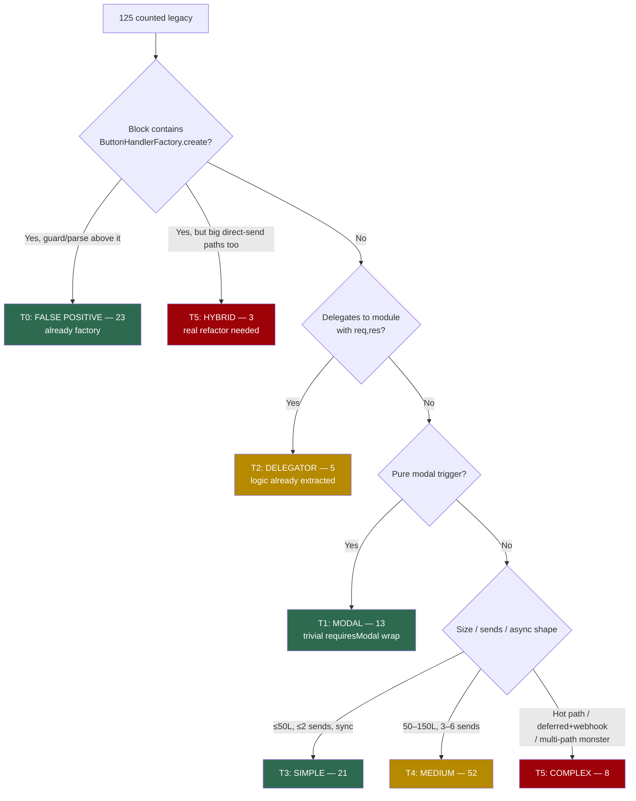

# 🪨→✨ Legacy Button Handler Migration — Full Inventory & Risk/Effort Stratification

**Status:** Analysis complete — migration backlog. **T0 sweep DONE 2026-07-12** (commit `bb15671f`): all 22 false positives reshaped, Moai BASELINE 125 → 103. Next: T1 unregistered modals.
**Date:** 2026-07-12
**Related:** [ButtonHandlerFactory.md](../enablers/ButtonHandlerFactory.md), the 🗿 Moai pre-commit hook (`scripts/hooks/pre-commit`, BASELINE=125)

## Original Context (Trigger Prompt)

> find all remaining  LEGACY buttons as per @docs/enablers/ButtonHandlerFactory.md  and stratify by risk / effort to convert to ✨ ) [consider the pattern implementation for modern vs legacy and risk / effort there ]

## 🤔 Plain English: What This Is

The Moai pre-commit hook counts 125 "legacy" handlers in app.js — `} else if (custom_id` blocks where `ButtonHandlerFactory.create` doesn't appear within 3 lines. This analysis enumerated all 125 using the **exact same AWK detection**, then profiled each block (size, response types, deferred/webhook/setTimeout usage, data writes) and spot-read the structurally unusual ones.

**Headline finding: 23 of the 125 (18%) are NOT legacy at all.** They already use the factory — the counter miscounts them because a permission guard, pre-parse block, or multi-line comment sits between the `else if` and the `.create(` call (the documented "3-line window gotcha"). The true legacy count is **~102**, of which 13 are pure modal-triggers (trivial) and 5 are one-line delegators to already-extracted modules.

## 📐 Methodology

1. Ran the pre-commit AWK verbatim against app.js → 125 handler start lines (matches BASELINE).
2. For each, block extent = start line → next `} else if (custom_id` in the chain.
3. Profiled: line count, `res.send()` count, `MODAL`/`UPDATE_MESSAGE`/`DEFERRED` response types, webhook follow-ups, `setTimeout`, `savePlayerData`/`saveSafariData`/`atomicSave` calls.
4. Cross-referenced BUTTON_REGISTRY `requiresModal: true` entries (these show `[📝 MODAL]`, not `[🪨 LEGACY]`, at runtime).
5. Spot-read: `show_castlist2`, `castlist2_nav_`, `restart_prod`, `castlist_select`, `player_set_*`, `admin_integrated_age`, `castlist2_prev_`.

## 🗺️ Triage Decision Tree



## ⚙️ Pattern Mechanics: Why Legacy→Factory Risk Varies

The factory's contract: **the handler returns ONE object; the factory sends it.** Conversion risk is entirely about how far a legacy handler deviates from that shape:

| Legacy pattern | Factory support | Conversion risk |
|---|---|---|
| Single `res.send(CHANNEL_MESSAGE...)` | Direct — return the data object | **Trivial** |
| Single `res.send(UPDATE_MESSAGE)` | `updateMessage: true` (factory strips flags) | **Trivial** |
| `res.send(MODAL)` | `requiresModal: true`, return `{type: MODAL, data}` | **Trivial** — constraint: cannot combine with `deferred: true` |
| Multiple `res.send()` exit paths | Restructure to multiple `return` statements | **Low-Med** — every path must be found; a missed path = double-send or no response |
| Deferred + webhook follow-ups | `deferred: true` + `DiscordRequest(webhooks/...)` in handler (documented analytics pattern) | **Medium** — timing-sensitive |
| Post-response public message via `setTimeout` | Supported — keep the `setTimeout`, return the ephemeral response (the documented double-send trap: NEVER `res.send()` inside a factory handler) | **Medium** |
| Conditional modal-vs-message-vs-deferred in one handler | Awkward — `deferred` is static config but modals can't be deferred | **High** — may need handler split per path |
| Direct `res` used deep in called helpers | Helper signatures must change to return-style | **High** — refactor ripples into modules |

Risk is then multiplied by **blast radius**: player-facing hot paths (castlist nav, safari item use, player menu) hit every server instantly; admin editor screens fail loudly but safely; Reece-only tools are nearly free to break.

## 📊 The Tiers

### T0 — False Positives: already ✨, miscounted as 🪨 (23 handlers, ~2–4h total)

These blocks contain `ButtonHandlerFactory.create` — a guard, pre-parse, or long comment pushes it past the AWK's 3-line window. **Zero behavioral work needed.** Fix options per handler: (a) compress the comment to 1 line, (b) move parsing inside the handler, (c) replace hand-rolled user guards with the registry's `restrictedUser`/factory `requiresPermission`. Alternatively fix the detector once (track brace depth or widen the window) — but the hook's simplicity is a feature; reshaping the code also makes it match the documented pattern.

| Line | Handler | Size | Why it's miscounted |
|---|---|---|---|
| 5515 | `show_castlist2` | 15L | pre-parse of castlistId before `.create` (hot path — reshape carefully or leave) |
| 7632 | `setup_castbot` | 94L | pre-work above `.create` |
| 8403 | `reeces_stuff` | 21L | user guard `res.send` above `.create` |
| 8454 / 8482 | `restart_prod` / `restart_prod_confirm` | 28/39L | hardcoded user-ID guard → could be `restrictedUser` |
| 8724 | `planner_page_` | 22L | pre-parse |
| 9399 | `challenge_action_cat_select_` | 128L | pre-parse |
| 11176 | `question_completion_select_` | 87L | the known `completion_edit` exception (modal + updateMessage dual-response); registered `requiresModal` — shows `[📝 MODAL]`, leave as-is |
| 12973 | `castlist_create_` | 16L | pre-parse |
| 13400 | `tribe_add_button\|` | 103L | pre-work |
| 13503 | `edit_placement_` | 145L | pre-work, modal path inside factory |
| 13648 | `data_admin` | 28L | guard |
| 13901 / 13933 | `season_marooning_` / `marooning_draft_tribes_` | 32/23L | pre-parse |
| 18126 | `safari_import_data` | 39L | pre-work |
| 27466 / 27487 | `app_withdraw` / `app_reapply` | 21/22L | comment gap |
| 31634 | `ca_link_item_select_` | 62L | pre-work |
| 33016 | `safari_map_explorer` | 20L | comment gap |
| 33268 | `map_delete_confirm` | 65L | pre-work |
| 34890 | `map_currency_drop_` | 95L | pre-work |
| 37545 | `archive_refresh_` | 36L | pre-parse |
| 39792 | `castlist2_nav_` | 19L | intentional early-ack for disabled buttons before `.create` (hot path — this shape is arguably correct; candidate for detector fix instead) |

**Payoff: baseline 125 → ~102 with near-zero production risk.** Biggest single win available.

### T1 — Pure Modal Triggers (13 handlers, ~15–30 min each)

Handler does nothing but build and `res.send` a modal. Conversion = wrap in factory with `requiresModal: true`, return `{type: MODAL, data}`, register. No state changes, no data writes — failure mode is "modal doesn't open," instantly visible in dev.

**Unregistered (7) — migrate first, they log misleading `[🪨 LEGACY]`:**
`attr_add_custom` (7136), `safari_create_button` (15537), `safari_schedule_results` (18174), `safari_store_create` (18375), `map_admin_item_select_` (38438), `map_admin_add_item_select_` (38573), `map_admin_edit_qty_select_` (38705)

**Already registered `requiresModal` (6) — runtime shows `[📝 MODAL]`, doc says "not migration candidates," but factory-wrapping is trivial when touching that code anyway:**
`quick_text_` (33828), `quick_currency_` (33843), `safari_starting_info_` (37938), `map_admin_move_player_` (37971), `map_admin_grant_stamina_` (38004), `map_admin_edit_currency_` (38103)

### T2 — Delegators: routing lines to already-extracted modules (5 chain entries ≈ 16 buttons)

The app.js side is 4–5 lines; the logic lives in a module whose function takes `(req, res, client)` and calls `res.send` internally. Converting means changing the **module function** to context-in/object-out — plumbing, not logic, but every response path in the module must flip.

| Line | Handler | Module | Blast radius |
|---|---|---|---|
| 12758 | `castlist_select` | castlistHandlers.js | admin hub — medium |
| 12763 / 12767 | `castlist_delete_confirm_` / `castlist_delete_` | castlistHandlers.js | destructive op — test the confirm flow hard |
| 13237 | `castlist_tribe_select_` | castlistHandlers.js | medium |
| 27276 | `player_set_*` (12 buttons) | playerManagement.js `handlePlayerButtonClick` | **player menu = highest traffic in the bot** — low logic risk, high blast radius; do in a quiet window, one deploy alone |

**Effort:** ~half a day per module (castlistHandlers batch, then playerManagement). **Risk:** medium — logic untouched, but signature refactors ripple.

### T3 — Simple Inline (21 handlers, ~30–60 min each incl. test)

≤50 lines, ≤2 sends, no deferred/webhook gymnastics. Textbook conversions.

`safari_import_cancel` (18165, 9L) · `safari_attack_player_disabled_` (15981, 10L) · `admin_select_player` (39462, 10L) · `safari_button_edit_actions_` (20167) · `map_admin_select_new` (37012) · `safari_attack_target` (16425) · `safari_attack_quantity` (16455) · `map_admin_user_select` (36979) · `prod_edit_pronouns_select` (28182, saves data — verify write) · `safari_config_confirm_reset` (17729) · `entity_edit_modal_` (32741) · `prod_pronoun_react` (26203) · `safari_inventory_user_select` (28489) · `player_menu_test` (27509) · `safari_restock_players` (15865) · `entity_consumable_select_` (32779) · `restart_bot_confirm` (15241, setTimeout restart — keep the setTimeout, Reece-only) · `condition_role_select_` (31551) · `safari_view_buttons` (15906) · `safari_clear_corrupted_attacks` (18280) · `player_menu` (27280, 50L — **high traffic**, logic simple; deploy alone)

### T4 — Medium Inline (52 handlers, ~1–2h each; batch by suite)

50–150L and/or 3–6 response paths. The win here is that they cluster into **suites sharing one shape** — migrate one, the rest are mechanical:

- **Safari store admin suite (12):** `safari_store_items_select`, `safari_store_add_item_`, `safari_store_remove_item_`, `safari_store_stock_`, `safari_store_edit_`, `safari_store_open_`, `safari_store_delete_`, `safari_confirm_delete_store_`, `safari_store_post_channel_`, `safari_post_select_button`, `safari_post_channel_`, `safari_post_button` — admin-only, loud failures, mixed modal+message paths (map each `res.send` before starting).
- **Safari action editor suite (10):** `safari_button_manage_existing`, `safari_button_edit_select`, `safari_action_move_up_/down_`, `safari_edit_properties_`, `safari_action_edit_`, `safari_action_delete_`, `safari_test_button_`, `safari_delete_button_`, `safari_confirm_delete_button_` — admin-only; delete/confirm pairs need the full flow tested.
- **Pronoun/timezone/vanity selects (7):** `select_pronouns`, `select_timezone`, `admin_select_pronouns_`, `admin_select_timezone_`, `admin_select_vanity_`, `prod_edit_timezones_select`, `prod_clear_tribe_select` — **player-facing + role writes + data saves**; medium effort, elevated risk; the 4–6 sends are mostly error branches.
- **Exports (4):** `safari_export_data`, `playerdata_export_all`, `safaricontent_export_all`, `playerdata_export` — deferred + webhook chunking; the factory's analytics multi-message pattern is a 1:1 template. Reece/admin-only → low risk despite the async shape.
- **Tribe/prod admin (5):** `prod_add_tribe`, `prod_clear_tribe`, `prod_add_tribe_role_select`, `prod_add_tribe_castlist_select_`, `prod_setup_tycoons`.
- **Map/entity/misc (14):** `map_grid_edit_`, `map_grid_view_`, `configure_modal_trigger_`, `condition_item_select_`, `entity_action_post_channel_select_`, `action_post_channel_select_`, `entity_defaultitem_select_`, `safari_result_ordering_select`, `safari_modify_attr_amount_`, `ca_schedule_task_`, `admin_integrated_attributes_`, `quick_item_`, `season_app_creation`, `getting_started`.

### T5 — Complex / Hot-Path / Hybrid (11 handlers — each is its own mini-project, ½–2 days)

| Line | Handler | Size | Why it's hard | Risk |
|---|---|---|---|---|
| 6393 | `show_castlist` | 238L | Legacy sibling of migrated `show_castlist2`; deferred + webhook, **public output, hot path**. Right move is probably routing into `castlistDisplay.js` like show_castlist2 did (RaP 0935 phase 3), not in-place conversion | 🔴 |
| 39811 | `castlist2_tribe_prev_/next_` | 181L | Hot nav path, deferred+webhook; same story — fold into castlistDisplay | 🔴 |
| 39992 | `castlist2_prev_/next_` (HYBRID) | 267L | Manual deferred ack + processing + a `.create` for one sub-path; saves data | 🔴 |
| 12989 | `castlist_view_` | 248L | UPDATE+deferred+webhook, admin hub centerpiece | 🟠 |
| 26780 | `admin_integrated_age` + `player_integrated_age` (HYBRID) | 496L, 14 sends | Factory at top for one path, then a dozen direct-send sub-paths below. The single worst block in app.js — decompose into a module first, factory second | 🔴 |
| 16235 | `safari_item_uses_` | 190L | Player-facing item consumption, deferred, **writes player data** — regression = lost/duped items | 🔴 |
| 16123 | `safari_use_linked_` | 112L | Conditional modal + UPDATE + deferred paths in one handler — the exact combination the factory can't express statically; needs a path split | 🔴 |
| 18541 | `store_items_multiselect_` | 189L, 8 sends | Highest response-path count; every path must be mapped | 🟠 |
| 25674 | `prod_timezone_react` | 149L | webhook + setTimeout — the documented double-send trap lives here; `prod_ban_react` is the worked example to copy | 🟠 |
| 39269 | `prod_emoji_role_select` | 141L | Webhook follow-ups + emoji upload side effects | 🟠 |
| 13241 | `tribe_edit_button\|` (HYBRID) | 159L | Factory inside + direct sends around it | 🟠 |

## 🎯 Recommended Migration Order

1. **T0 sweep** (one session): reshape the 23 false positives (skip `question_completion_select_`, decide detector-fix vs reshape for `castlist2_nav_`/`show_castlist2`). Baseline → ~102. Every later commit gets honest hook feedback.
2. **T1 unregistered modals** (one session): 7 trivial wraps + registry entries. Baseline → ~95.
3. **T3 simple inlines** (2–3 sessions, batched ~7 per dev-restart): Baseline → ~74. Deploy `player_menu` alone.
4. **T4 suite-by-suite** (a suite per session; store suite, action-editor suite, exports, selects): Baseline → ~22. The pronoun/timezone selects get their own careful deploy.
5. **T2 delegators** (module refactors): castlistHandlers.js, then playerManagement.js in a quiet window.
6. **T5 one at a time**, each with its own test pass; castlist ones ride the RaP 0935 castlistDisplay consolidation rather than in-place conversion. `admin_integrated_age` last — or first if you're feeling brave, since it's also the biggest single chunk of app.js debt.

After each batch: `./scripts/dev/dev-restart.sh`, click-test in dev, lower `BASELINE` in `scripts/hooks/pre-commit` to lock it in (the Moai reminds you at commit time).

## ⚠️ Standing Risks for Every Conversion

- **Never `res.send()` inside a factory handler** — the factory sends the return value; a stray send = double-response = "This interaction failed."
- **`updateMessage: true` on every button/select click** unless a new message is genuinely intended.
- **Modal handlers can't be `deferred`** — if a handler conditionally shows a modal, the non-modal paths still can't defer.
- **All 4–6-send handlers**: enumerate every `res.send` before converting; each becomes a `return`. A missed early-return path silently drops the response.
- **`saves-data` handlers** (flagged above): verify the write actually lands after conversion (`Data size:` log check).
- **Wildcard patterns**: registry keys with `_*` auto-discover for debug matching — no `dynamicPatterns` edits needed (that array is defunct).

## Appendix: Detection Command

```bash
awk '
/type === InteractionType\.MODAL_SUBMIT/ { m=1 } m && /^  \}$/ { m=0 }
/} else if \(custom_id/ && !/^[[:space:]]*\/\// && !m { h=NR; t=$0; f=0 }
h && NR>h && NR<=h+3 { if (/ButtonHandlerFactory\.create/) f=1 }
h && NR==h+3 { if (!f) { gsub(/^[ \t]+/,"",t); print h": "t } h=0 }
' app.js
```
