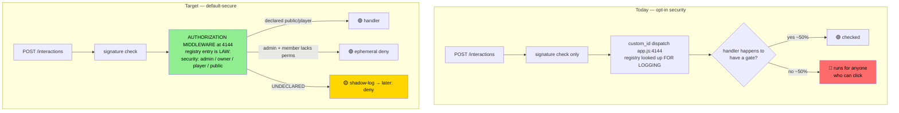

# 0900 — CastBot-Wide Security Architecture Assessment: Making Authorization Structural

**Date**: 2026-07-11
**Trigger**: The `anchor_open_menu` incident ([docs/incidents/04-AnchorMenuAdminExposure.md](../incidents/04-AnchorMenuAdminExposure.md)) — and the realization that the same class of bug exists elsewhere and will keep being reintroduced as long as security depends on an agent remembering to write it.
**Status**: Assessment + Phase-0 hardening shipped. Phases 1-3 await decision.

## Original Context (Trigger Prompt)

> I want a more foolproof way to avoid these sorts of issues in the future - ones that aren't going to get caught out by an agent whos context is full - not just for this prod menu but elsewhere. Like why wasn't this just imbued as part of the menu access operation rather than relying on an agent to code it? Do a comprehensive castbot-wide assessment of overall security architecture options. Also move that RaP to the incients folder.

## 🤔 The Answer to "Why Wasn't This Imbued in the Menu Access Operation?"

Because **there is no menu access operation.** A "menu" in CastBot is a bare function (`createProductionMenuInterface`, `buildPlannerSelector`, `buildChallengeScreen`, …) that returns Components V2 JSON. It takes `(guild, playerData, guildId, userId)` — it never sees the member's permissions and *cannot* check anything. Authorization lives (or doesn't) in whichever of ~600 handlers happens to call it.

The pieces that *look* like a security layer are inert:

- `ButtonHandlerFactory.create()` enforces exactly one optional config key, `requiresPermission` (buttonHandlerFactory.js:5251-5255). Omit it and the handler runs for anyone who can click the button. The factory was built to kill boilerplate, not to be a security boundary — security stayed opt-in.
- `BUTTON_REGISTRY` (575 hand-authored entries) carries `restrictedUser` (×68) and `requiresPermission` (×23) fields that **no enforcement path ever reads** — repo-wide, zero reads. It's documentation wearing a security costume. Worse, `create()` **auto-registers** unknown custom_ids at runtime, so the registry can't even serve as an allowlist today.
- `MENU_REGISTRY` (menuBuilder.js) — the thing that *should* be the menu access operation — has **2 entries** and no access-control field. Menu migration stalled; 9 menus are tracked as `[⚱️ MENULEGACY]`, the rest aren't even tracked.
- Two of the four "blessed" gate helpers (`requireAdminPermission`, `requireSpecificUser` in utils/permissionUtils.js) are **dead code — zero call sites**. Live code uses four different primitives inconsistently (`requiresPermission:` config, `requirePermission()`, `hasAdminPermissions()`, `hasCastRankingPermissions()`, plus raw user-ID compares).

So every new surface repeats the same dice roll: the agent writing it either remembers the fork or ships an exposure. A context-starved agent pattern-matching on nearby code has a ~50/50 chance of copying an ungated example — **~49% of the 593 factory handlers in app.js carry `requiresPermission`; the rest rely on inline checks or nothing.**

## 📊 The Numbers (full-surface inventory, 2026-07-11)

| Metric | Value |
|---|---|
| `ButtonHandlerFactory.create({` in app.js | 593 (603 repo-wide) |
| …with declarative `requiresPermission` | 290 (≈49%) |
| Inline `requirePermission()` calls | 78 |
| `hasAdminPermissions()` call sites | 11 |
| `hasCastRankingPermissions()` call sites | 17 (18 after Phase 0) |
| Raw owner-ID gates (`391415444…`) | 25 |
| BUTTON_REGISTRY entries / with inert security metadata | 575 / 91 (never enforced) |
| MODAL_SUBMIT handlers / with any gate | 68 / ~41 (scattered, 3 different primitives) |
| Discord-side `default_member_permissions` | **0 uses** (`ADMIN_ANY` in commands.js is dead code) |
| Authorization middleware between `POST /interactions` and dispatch | **none** (only signature verification) |

**The one structural chokepoint that exists**: `MESSAGE_COMPONENT` dispatch begins at app.js:4144. By line 4165 the code has already extracted the `custom_id` **and resolved its BUTTON_REGISTRY entry** — then uses them only to choose a log emoji (`✨ FACTORY` vs `🪨 LEGACY`). Buttons *and* string selects flow through this same point. Everything needed for default-deny enforcement is literally already in scope there.

## 🎯 Attack Surface Reality (what a player can actually click)

Discord users can only click components that exist in messages they can see. So the exposure classes, worst-first:

1. **Components in PUBLIC messages** — Safari anchor messages (Navigate/Command/Menu + drops + custom actions), public castlist posts (`viral_menu`), public casting-ranking posts, application "Apply" posts, restart notifications. *This is where anchor_open_menu lived.* Audit result: all now gated or player-facing-by-design.
2. **Components in shared-private channels** — application channels (applicant + prod team both see them). Handlers mostly rely on channel privacy rather than identity; two minor missing-ownership notes (`app_withdraw`/`app_reapply` don't check `userId === appRec.userId` — deliberate ambiguity: prod may act on behalf; flagged, not changed).
3. **Components in ephemeral admin messages** — safe *only while ephemeral*. This is the trap: "the button only appears in an admin menu" is an assumption, not a control. Anchor proved these assumptions rot silently (e.g. `viral_menu`'s admin branch actually *requests* `ephemeral: false` and is saved only by an accidental factory override at buttonHandlerFactory.js:5277).
4. **Modal submits** — same custom_id dispatch, hand-gated per handler.

### Findings from this audit (same bug class, found live)

| # | Finding | Status |
|---|---|---|
| F1 | `save_placement_` modal (app.js ~41652) wrote competition placement results with **no permission check** — targets fully attacker-controlled via custom_id | ✅ Gated (Phase 0) |
| F2 | `edit_placement_` (app.js ~13455) — same, modal-opener side | ✅ Gated (Phase 0) |
| F3 | `personal_ranker_` (app.js ~5565) served the full casting UI (scores, notes, decisions) with **no gate**, unlike every sibling; latent (no live emitter, but historical messages could carry it) | ✅ Gated (Phase 0) |
| F4 | `season_manager`, `season_manager_new`, `challenge_screen`, `prod_setup_wizard` — Production-Menu buttons serving full admin UIs with **no server-side gate** (safe only while the prod menu stays ephemeral) | ✅ Gated (Phase 0) |
| F5 | No Discord-side command permissions anywhere; every gate is hand-rolled server-side | Accepted for now (5 commands, all fork server-side) |

**The correct existing model**: `reeces_stuff` (app.js:8393) — hard gate placed *before* the factory, with a comment saying it's there "because it appears on public messages." Gate-independent-of-visibility is the principle to institutionalize.

## 💡 Options Assessment

### Option A — Registry-driven enforcement at the chokepoint ⭐ (primary recommendation)

Make BUTTON_REGISTRY metadata *real*. Add a `security` field (`'admin' | 'owner' | 'player' | 'public'`) and enforce it at app.js:4144 (or inside `create()` by merging the registry entry into config) **before** any handler runs:

- `admin` → `hasAdminPermissions(member)` (the /menu check — exactly what the trigger prompt asked to imbue)
- `owner` → the Reece user-ID gate
- `player`/`public` → pass (explicitly declared, greppable)
- **undeclared** → the crucial choice. End state: deny-with-log. Rollout state: shadow mode.

Pros: single enforcement point; survives context-starved agents (a *missing* declaration is caught, not silently permissive); the registry becomes a real security inventory; per-handler `requiresPermission` stays as a second, more specific layer.
Cons/costs: the 575 existing entries need a classification pass (bulk-classifiable by parent menu + prefix); **auto-registration must stop defaulting to permissive** (auto-registered → treated as undeclared); risk of over-blocking legitimate player buttons → mitigate with **shadow mode**: enforce in log-only (`🔶 [WOULD-DENY]`) on prod for a week, review the log, then flip. Est. effort: factory change ~50 lines + classification pass + shadow-mode soak.

### Option B — Guarded builders (defense in depth)

The ~13 privileged UI builders (`createProductionMenuInterface`, `createSafariCustomizationUI`, `createEntityManagementUI`, `buildRankingScreen`, `createMapAdminUI`, `buildChallengeScreen`, `buildPlannerSelector/View`, `buildAdminPlayerMenu`, …) take `member` and internally refuse or auto-downgrade to the Player Menu. Opt-in becomes opt-out at the *builder* — even a brand-new ungated handler can no longer leak an admin surface.
Pros: protects against the exact anchor failure regardless of dispatch-layer state; small blast radius per builder. Cons: threading `member` through call sites (7 for the prod menu alone); doesn't cover non-builder mutations (F1 was a raw write, no builder involved). **Do for the top 3-4 builders; don't chase all 13.**

### Option C — Prefix-based default-deny (backstop only)

Auto-require admin for `prod_*`, `admin_*`, `entity_*`, `castbot_*`, `nuke_*`, `reece*` at dispatch. Cheap, no per-entry audit. **But it would have missed this week's actual findings** — `season_manager`, `challenge_screen`, `anchor_open_menu`, `save_placement_` carry no admin prefix. Naming discipline isn't strong enough to be the primary control. Use as a fallback rule inside Option A's middleware for *unregistered* ids only.

### Option D — Static enforcement in CI (the agent-proofing layer)

Tests run on every `dev-restart.sh` and abort deploys — they are the one enforcement layer that runs *before* code reaches users and doesn't depend on runtime state:
1. `tests/adminMenuGate.test.js` (shipped) — every `createProductionMenuInterface` call site must show a gate within 100 lines. Extend its builder list as new privileged builders appear.
2. **Declare-or-deny test** (recommended next): parse app.js, find every `ButtonHandlerFactory.create({` config; fail if it has neither `requiresPermission` nor an explicit `security:`/registry classification. New handlers are *forced* to state their trust level — "I am public" becomes a visible, reviewable line instead of an omission. (Grandfather existing ungated handlers via a frozen baseline that must only shrink — same only-goes-down model as the Moai pre-commit hook's legacy-handler count.)
3. Pre-commit already syncs; adding a security ratchet there mirrors proven repo machinery.

### Option E — Discord-side `default_member_permissions`

Only covers slash commands (5 exist, all fork server-side already) — does nothing for components, which are the actual surface. Set it on `/menu`? No — `/menu` is deliberately dual-mode (players get the Player Menu). Skip.

## 🗺️ Recommended Roadmap

| Phase | What | Effort | Status |
|---|---|---|---|
| 0 | Close known holes (F1-F4: 7 gates), tripwire test, this assessment | small | ✅ shipped 2026-07-11 |
| 1 | Option D2 declare-or-deny test with frozen baseline (only shrinks) | small | recommended next |
| 2 | Option A in **shadow mode**: `security` field + chokepoint middleware logging would-denies on prod; classify the 575 registry entries (bulk pass by parent/prefix) | medium | needs go-ahead |
| 3 | Flip Option A to enforce (undeclared → deny); Option B for `createProductionMenuInterface` + top builders; disable permissive auto-registration | medium | after shadow soak |

End state: an agent with zero context writing a new button **cannot** ship an exposed admin surface — the declare-or-deny test blocks the commit, and even if a handler lies, the registry middleware denies at runtime, and even if the registry entry is misclassified, the guarded builder refuses. Three independent layers; today there are zero.

## ⚠️ Residual Risks / Honest Limits

- Shadow-mode classification of 575 entries is the real work in Phase 2; a misclassified `player` button that should be `admin` stays exposed until audited — the declare-or-deny diff review is the control.
- Handlers that mutate data *without* going through the factory (legacy `} else if` handlers, 125 baseline; MODAL_SUBMIT section) need the same treatment — the middleware at 4144 covers components, MODAL_SUBMIT dispatch (app.js:40147) needs its own hook of the same shape.
- `hasAdminPermissions` itself is due to grow `globalRoleAccess` OR-condition support (SecurityArchitecture.md "Target State") — building Option A around `hasAdminPermissions()` means that future change lands in exactly one place. That's the point.

Related: [SecurityArchitecture.md](../infrastructure-security/SecurityArchitecture.md) | [Incident 04](../incidents/04-AnchorMenuAdminExposure.md) | [ButtonHandlerFactory.md](../enablers/ButtonHandlerFactory.md)
