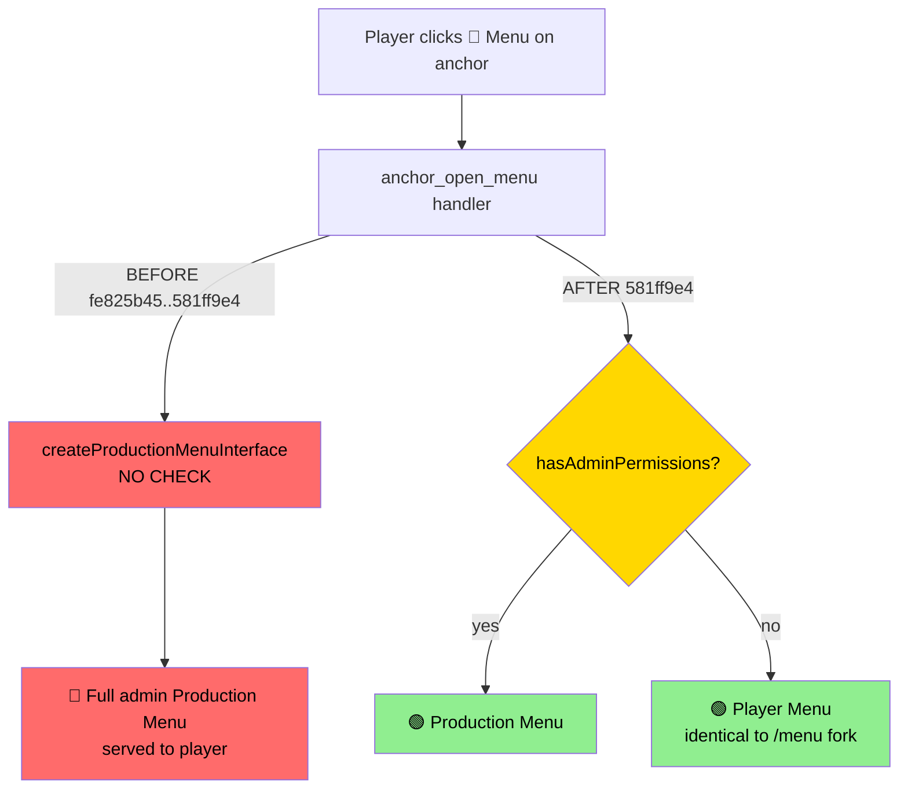

# 0901 — Safari Anchor "Menu" Button Served the Admin Production Menu to Everyone

**Date**: 2026-07-11
**Severity**: 🔴 Security — privilege-UI exposure on production for ~3.5 months
**Status**: FIXED (`581ff9e4`, deployed to prod 2026-07-11) + tripwire test (`tests/adminMenuGate.test.js`)

## Original Context (Trigger Prompt)

> ive just found a major security issue (im furious tbh). in safari channels there's a menu button, on click it takes normal users straight to the castbot admin menuu, it should NOT be doing that and instead be doing our normal isAdmin style check that is identical to when someone types /menu 1|castbot-pm  | 🔍 Next Question: Channel 1523730717899620442, Next: 6
> 1|castbot-pm  | ✅ Saved playerData (4124762 bytes)
> 1|castbot-pm  | ✅ Loaded playerData.json (4124762 bytes, 177 guilds)
> 1|castbot-pm  | 🔍 ButtonHandlerFactory sending response for app_next_question, updateMessage: undefined, isModal: false
> 1|castbot-pm  | 📝 [⚡ IMMEDIATE-NEW] [👁️ PUBLIC] — CHANNEL_MESSAGE_WITH_SOURCE
> 1|castbot-pm  | 🗑️ Clearing request cache (1 entries, 3 hits, 4 misses)
> 1|castbot-pm  | Processing MESSAGE_COMPONENT with custom_id: anchor_open_menu
> 1|castbot-pm  | Component type: 2 Values: undefined
> 1|castbot-pm  | 🔍 BUTTON DEBUG: Checking handlers for anchor_open_menu [✨ FACTORY]
> 1|castbot-pm  | 📍 DEBUG: Channel name from cache: #🌳a1-weehawken-woods (1524780251719274588)
> 1|castbot-pm  | ✅ Loaded playerData.json (4124762 bytes, 177 guilds)
> 1|castbot-pm  | 📊 DEBUG: About to call postToDiscordLogs - action: BUTTON_CLICK, safariContent exists: false, guildId: 1524773737973682267
> 1|castbot-pm  | 📝 [🔄 DEFERRED-NEW] [🔒 EPHEMERAL] — "thinking...", will PATCH @original
> 1|castbot-pm  | MENU DEBUG: Legacy menu at createProductionMenuInterface - Main production menu [⚱️ MENULEGACY]
> 1|castbot-pm  | [CASTLIST] Extracted 2 castlists using Virtual Adapter
> 1|castbot-pm  | [CASTLIST] Separated: 1 modern (real), 0 legacy (virtual)
> 1|castbot-pm  | [CASTLIST] Limited 1 total castlists to 1 (max: 3)
> 1|castbot-pm  | [CASTLIST] Final order (limited): Tribe A [MODERN] (1783693356453)
> 1|castbot-pm  | [CASTLIST] Created 1 button row(s) for 3 castlist(s)
> 1|castbot-pm  | Created 1 castlist row(s) for 2 castlist(s) (limited from 2)
> 1|castbot-pm  | 📋 Production Menu (viral_menu):
> 1|castbot-pm  | 1. Container
> 1|castbot-pm  |   2. Section [HAS ACCESSORY]
> 1|castbot-pm  |      └─ Accessory: Button
> 1|castbot-pm  |     4. TextDisplay
> 1|castbot-pm  |   5. Separator
> 1|castbot-pm  |   6. Section [HAS ACCESSORY]
> 1|castbot-pm  |      └─ Accessory: Button
> 1|castbot-pm  |     8. TextDisplay
> 1|castbot-pm  |   9. TextDisplay
> 1|castbot-pm  |   10. ActionRow
> 1|castbot-pm  |     11. Button
> 1|castbot-pm  |     12. Button
> 1|castbot-pm  |     13. Button
> 1|castbot-pm  |   14. Separator
> 1|castbot-pm  |   15. TextDisplay
> 1|castbot-pm  |   16. ActionRow
> 1|castbot-pm  |     17. Button
> 1|castbot-pm  |     18. Button
> 1|castbot-pm  |     19. Button
> 1|castbot-pm  |     20. Button
> 1|castbot-pm  |   21. Separator
> 1|castbot-pm  |   22. TextDisplay
> 1|castbot-pm  |   23. ActionRow
> 1|castbot-pm  |     24. Button
> 1|castbot-pm  |     25. Button
> 1|castbot-pm  |     26. Button
> 1|castbot-pm  |     27. Button
> 1|castbot-pm  |     28. Button
> 1|castbot-pm  |   29. Separator
> 1|castbot-pm  |   30. TextDisplay
> 1|castbot-pm  |   31. ActionRow
> 1|castbot-pm  |     32. Button
> 1|castbot-pm  |     33. Button
> 1|castbot-pm  |     34. Button
> 1|castbot-pm  |     35. Button
> 1|castbot-pm  |   36. Separator
> 1|castbot-pm  |   37. TextDisplay
> 1|castbot-pm  | ✅ Total components: 37/40
> 1|castbot-pm  | 📝 [🔗 WEBHOOK-PATCH] — updating @original (Components V2)
> 1|castbot-pm  | ✅ updateDeferredResponse: Components V2 preserved
> 1|castbot-pm  | 🗑️ Clearing request cache (1 entries, 5 hits, 2 misses)
> 1|castbot-pm  | Processing MESSAGE_COMPONENT with custom_id: app_dnc_select_1523730717899620442_6_add
> 1|castbot-pm  | Component type: 3 Values: [ 'add' ]
> 1|castbot-pm  | 🔍 BUTTON DEBUG: Checking handlers for app_dnc_select_1523730717899620442_6_add [✨ FACTORY]
> 1|castbot-pm  | 📍 DEBUG: Channel name from cache: #📝megan-app (1523730717899620442)
> 1|castbot-pm  | ✅ Loaded playerData.json (4124762 bytes, 177 guilds)
> 1|castbot-pm  | 📊 DEBUG: About to call postToDiscordLogs - action: BUTTON_CLICK, safariContent exists: false, guildId: 974318870057848842
> 1|castbot-pm  | 🔍 ButtonHandlerFactory sending response for app_dnc_select, updateMessage: undefined, isModal: true
> 1|castbot-pm  | 📊 DEBUG: QueueProcessor - Starting singleton processor
> 1|castbot-pm  | 📊 DEBUG: QueueProcessor - Processing 1 queued messages
> 1|castbot-pm  | 📊 DEBUG: QueueProcessor - Sent message, 0 remaining
> 1|castbot-pm  | 📊 DEBUG: QueueProcessor - Processing completed, queue empty
> 1|castbot-pm  | GET /interactions was accessed
> 1|castbot-pm  | 🗑️ Clearing request cache (1 entries, 2 hits, 2 misses)
> 1|castbot-pm  | Processing MESSAGE_COMPONENT with custom_id: anchor_open_menu
> 1|castbot-pm  | Component type: 2 Values: undefined
> 1|castbot-pm  | 🔍 BUTTON DEBUG: Checking handlers for anchor_open_menu [✨ FACTORY]
> 1|castbot-pm  | 📍 DEBUG: Channel name from cache: #🌳a1-weehawken-woods (1524780251719274588)
> 1|castbot-pm  | ✅ Loaded playerData.json (4124762 bytes, 177 guilds)
> 1|castbot-pm  | 📊 DEBUG: About to call postToDiscordLogs - action: BUTTON_CLICK, safariContent exists: false, guildId: 1524773737973682267
> 1|castbot-pm  | 📝 [🔄 DEFERRED-NEW] [🔒 EPHEMERAL] — "thinking...", will PATCH @original
> 1|castbot-pm  | MENU DEBUG: Legacy menu at createProductionMenuInterface - Main production menu [⚱️ MENULEGACY]
> 1|castbot-pm  | [CASTLIST] Extracted 2 castlists using Virtual Adapter
> 1|castbot-pm  | [CASTLIST] Separated: 1 modern (real), 0 legacy (virtual)
> 1|castbot-pm  | [CASTLIST] Limited 1 total castlists to 1 (max: 3)
> 1|castbot-pm  | [CASTLIST] Final order (limited): Tribe A [MODERN] (1783693356453)
> 1|castbot-pm  | [CASTLIST] Created 1 button row(s) for 3 castlist(s)
> 1|castbot-pm  | Created 1 castlist row(s) for 2 castlist(s) (limited from 2)
> 1|castbot-pm  | 📋 Production Menu (viral_menu):
> 1|castbot-pm  | 1. Container
> 1|castbot-pm  |   2. Section [HAS ACCESSORY]
> 1|castbot-pm  |      └─ Accessory: Button
> 1|castbot-pm  |     4. TextDisplay
> 1|castbot-pm  |   5. Separator
> 1|castbot-pm  |   6. Section [HAS ACCESSORY]
> 1|castbot-pm  |      └─ Accessory: Button
> 1|castbot-pm  |     8. TextDisplay
> 1|castbot-pm  |   9. TextDisplay
> 1|castbot-pm  |   10. ActionRow
> 1|castbot-pm  |     11. Button
> 1|castbot-pm  |     12. Button
> 1|castbot-pm  |     13. Button
> 1|castbot-pm  |   14. Separator
> 1|castbot-pm  |   15. TextDisplay
> 1|castbot-pm  |   16. ActionRow
> 1|castbot-pm  |     17. Button
> 1|castbot-pm  |     18. Button
> 1|castbot-pm  |     19. Button
> 1|castbot-pm  |     20. Button
> 1|castbot-pm  |   21. Separator
> 1|castbot-pm  |   22. TextDisplay
> 1|castbot-pm  |   23. ActionRow
> 1|castbot-pm  |     24. Button
> 1|castbot-pm  |     25. Button
> 1|castbot-pm  |     26. Button
> 1|castbot-pm  |     27. Button
> 1|castbot-pm  |     28. Button
> 1|castbot-pm  |   29. Separator
> 1|castbot-pm  |   30. TextDisplay
> 1|castbot-pm  |   31. ActionRow
> 1|castbot-pm  |     32. Button
> 1|castbot-pm  |     33. Button
> 1|castbot-pm  |     34. Button
> 1|castbot-pm  |     35. Button
> 1|castbot-pm  |   36. Separator
> 1|castbot-pm  |   37. TextDisplay
> 1|castbot-pm  | ✅ Total components: 37/40
> 1|castbot-pm  | 📝 [🔗 WEBHOOK-PATCH] — updating @original (Components V2)
> 1|castbot-pm  | ✅ updateDeferredResponse: Components V2 preserved
> 1|castbot-pm  | [PM2Logger] Check: env=prod, isOnProdServer=true, shouldReadLocal=true
> 1|castbot-pm  | 🗑️ Clearing request cache (1 entries, 5 hits, 2 misses)
> 1|castbot-pm  | 🔍 DEBUG: MODAL_SUBMIT received - custom_id: app_dnc_entry_modal_1523730717899620442_6_new
> 1|castbot-pm  | ✅ Loaded playerData.json (4124762 bytes, 177 guilds)
> 1|castbot-pm  | 🚫 DNC entry added for channel 1523730717899620442: Henry
> 1|castbot-pm  | ✅ Saved playerData (4125153 bytes)
> 1|castbot-pm  | ✅ Loaded playerData.json (4125153 bytes, 177 guilds)
> 1|castbot-pm  | 🗑️ Clearing request cache (1 entries, 2 hits, 4 misses)
> 1|castbot-pm  | Processing MESSAGE_COMPONENT with custom_id: app_next_question_1523730717899620442_6
> 1|castbot-pm  | Component type: 2 Values: undefined
> 1|castbot-pm  | 🔍 BUTTON DEBUG: Checking handlers for app_next_question_1523730717899620442_6 [✨ FACTORY]
> 1|castbot-pm  | 📍 DEBUG: Channel name from cache: #📝megan-app (1523730717899620442)
> 1|castbot-pm  | ✅ Loaded playerData.json (4125153 bytes, 177 guilds)
> 1|castbot-pm  | 📊 DEBUG: About to call postToDiscordLogs - action: BUTTON_CLICK, safariContent exists: false, guildId: 974318870057848842
> 1|castbot-pm  | 🔍 Next Question: Channel 1523730717899620442, Next: 7
> 1|castbot-pm  | ✅ Saved playerData (4125153 bytes)
> 1|castbot-pm  | 🔍 ButtonHandlerFactory sending response for app_next_question, updateMessage: undefined, isModal: false
> 1|castbot-pm  | 📝 [⚡ IMMEDIATE-NEW] [👁️ PUBLIC] — CHANNEL_MESSAGE_WITH_SOURCE
> 1|castbot-pm  | Processing MESSAGE_COMPONENT with custom_id: entity_custom_action_list_global
> 1|castbot-pm  | Component type: 3 Values: [ 'create_new' ]
> 1|castbot-pm  | 🔍 BUTTON DEBUG: Checking handlers for entity_custom_action_list_global [✨ FACTORY]
> 1|castbot-pm  | 📍 DEBUG: Channel name from cache: #map-images (1524775612366065794)
> 1|castbot-pm  | ✅ Loaded playerData.json (4125153 bytes, 177 guilds)
> 1|castbot-pm  | 📊 DEBUG: About to call postToDiscordLogs - action: BUTTON_CLICK, safariContent exists: false, guildId: 1524773737973682267
> 1|castbot-pm  | 🔍 START: entity_custom_action_list - user 691850627189309492
> 1|castbot-pm  | ✅ SUCCESS: entity_custom_action_list - showing creation modal
> 1|castbot-pm  | 🔍 ButtonHandlerFactory sending response for entity_custom_action_list, updateMessage: undefined, isModal: true ultrathink  lets first resolve this ASAP (ideally so it works for the button already in safari channel anchors so people dojnt have to do the recalculate anchor thing), deploy straight through to prod and then do a root cause security analysis on how to avoid this in the future

## 🤔 What Was Actually Broken

Every Safari map location channel carries an **anchor message** with a nav row: `🗺️ Navigate | 🕹️ Command | 🤖 Menu`. The Menu button (`custom_id: anchor_open_menu`, built in `safariButtonHelper.js`) is clicked almost exclusively by **players** standing in map channels.

Its handler (app.js `anchor_open_menu`) did this:

```javascript
handler: async (context) => {
  const playerData = await loadPlayerData();
  return await createProductionMenuInterface(context.guild, playerData, context.guildId, context.userId);
}
```

No permission check of any kind. Any player who clicked 🤖 Menu got the **full admin Production Menu** — Safari admin, season management, castlist editing, player management, analytics — as an ephemeral message. The prod log above shows exactly that: `anchor_open_menu` in `#🌳a1-weehawken-woods` → `createProductionMenuInterface` → 37-component Production Menu, no `hasAdminPermissions` anywhere in the path.

**Blast radius**: UI exposure was total, but downstream damage was *partially* limited because most destructive buttons inside the Production Menu carry their own `requiresPermission` factory gates (defense-in-depth that existed by convention, not design). Partial ≠ safe: any inner handler that relied on "you can only get here from an admin menu" was fully exposed, and the menu itself leaks server configuration (seasons, castlists, analytics buttons, player data controls) to players.

**Exposure window**: introduced `fe825b45` (2026-03-31, "anchor Menu button creates new ephemeral message…"), fixed `581ff9e4` (2026-07-11). ~3.5 months on production.

## 🏛️ How It Was Born (the organic growth story)

The anchor Menu button was added as a convenience: "let people open the menu without typing /menu". The March commit was focused on a *UI* bug (the button originally destroyed the anchor via UPDATE_MESSAGE — the fix made it a new ephemeral message). All the attention went to response mechanics; nobody asked *which* menu should come back for *whom*. `createProductionMenuInterface` was the function name at hand — the `/menu` handler calls it, `viral_menu` calls it — and copying a call is one line, while copying the *fork around* the call is fifteen.

That's the recurring CastBot pattern (see MEMORY.md "Legacy code is a stronger prompt than CLAUDE.md"): **the codebase's example code is the real documentation**, and the example that got copied was the post-check half of `/menu`, not the check itself.

## 🎯 Root Cause Analysis

Layered causes, from immediate to systemic:

1. **Immediate**: `anchor_open_menu`'s handler called `createProductionMenuInterface()` unconditionally.
2. **Enabling**: `createProductionMenuInterface()` is an **unguarded privileged UI builder**. It takes `(guild, playerData, guildId, userId)` — it never sees the member and cannot check anything. Security is opt-in at every call site, forever.
3. **Structural**: the factory's `requiresPermission` gate exists but is optional, and there is **no marker distinguishing privileged buttons** — `BUTTON_REGISTRY` has `category: 'navigation'` for this button, nothing security-related. Nothing (lint, hook, test, review checklist) inventories "who can open admin surfaces".
4. **Cultural/process**: menu-opening buttons were reviewed for *UX* correctness (ephemeral? updateMessage? component count?) — the security dimension has no checklist item, so it depends on the author remembering `/menu`'s fork.



## 💡 The Fix (shipped)

`app.js` `anchor_open_menu` now runs the **identical fork to `/menu`** (app.js:3053): `hasAdminPermissions(context.member)` → admins get `createProductionMenuInterface`, everyone else gets `createPlayerManagementUI({ mode: PlayerManagementMode.PLAYER, ... , title: 'CastBot | Player Menu' })`. Ephemeral both ways.

Because the fix is purely server-side routing and the `custom_id` is unchanged, **every anchor message already posted in every guild was fixed the moment prod restarted** — no anchor recalculation needed (explicit requirement from the trigger prompt).

**Call-site audit at fix time** (all 7 real call sites of `createProductionMenuInterface`):

| Call site | Gate | Status |
|---|---|---|
| app.js:3089 `/menu` | `hasAdminPermissions` fork (:3053) | ✅ |
| app.js:6637 `viral_menu` | `hasAdminPermissions` fork (:6628) | ✅ |
| app.js:10416 `poc_menu_button` | explicit `isAdmin` deny (:10410) | ✅ |
| app.js:11693 `season_delete_confirm` | factory `requiresPermission: ManageRoles` (:11632) | ✅ |
| app.js:13757 `prod_menu_back` | factory `requiresPermission` (:13751) | ✅ |
| app.js:13772 `prod_production_menu` | factory `requiresPermission` (:13766) | ✅ |
| app.js:33550 `anchor_open_menu` | **NONE** → now `hasAdminPermissions` fork | 🔴→✅ |

## 🛡️ Prevention — How We Avoid This Class of Bug

**Shipped with this RaP:**

1. **Tripwire test** — `tests/adminMenuGate.test.js` statically scans app.js: every `createProductionMenuInterface(` call site must have `hasAdminPermissions(` or `requiresPermission:` within the preceding 100 lines, or the suite fails (and `dev-restart.sh` aborts — tests gate every deploy). It fails loudly with the offending line numbers. This exact test would have caught the original hole.

**Recommended next (not yet implemented):**

2. **Guard the builder, not just the callers** (defense in depth): change `createProductionMenuInterface(guild, playerData, guildId, userId)` to also take `member` and *internally* refuse (or auto-downgrade to Player Menu) when `!hasAdminPermissions(member)`. Opt-in security becomes opt-out. Medium effort — 7 call sites to thread `member` through.
3. **Registry security metadata**: add `security: 'admin' | 'player' | 'public'` to `BUTTON_REGISTRY` entries and have `ButtonHandlerFactory` *enforce* `security: 'admin'` (implying the 4-permission admin check) even when the handler forgets `requiresPermission`. Makes privilege greppable and turns the registry into a security inventory. This pairs with the eventual `globalRoleAccess`-in-`hasAdminPermissions()` work (SecurityArchitecture.md "Target State") — one enforcement point to extend instead of N handlers.
4. **Review checklist line** for any new button that opens a menu/surface: "Who may click this, and where does the check live?" — added to the natural place when Definition of Done is next touched.
5. **Periodic sweep**: the audit table above took one grep; re-run it (or extend the tripwire) whenever a new privileged UI builder appears (e.g. future `createSeasonAdminInterface`-style builders should be added to the tripwire's scan list).

## ⚠️ Residual Risk

- The tripwire is a heuristic (100-line window, app.js only). A gate that exists but guards the *wrong thing* (e.g. checks a different permission) still passes. Recommendation 2 (guard the builder) is the real closure.
- Other privileged **builders** (not `createProductionMenuInterface`) were not audited in this pass — e.g. Reece-only surfaces use user-ID gates at the router which are fine, but any future admin surface builder starts life unguarded. Recommendation 3 addresses the class.

Related: [SecurityArchitecture.md](../infrastructure-security/SecurityArchitecture.md) (permission tiers, Target State) | [RolesSecurity.md](../03-features/RolesSecurity.md) (globalRoleAccess)
