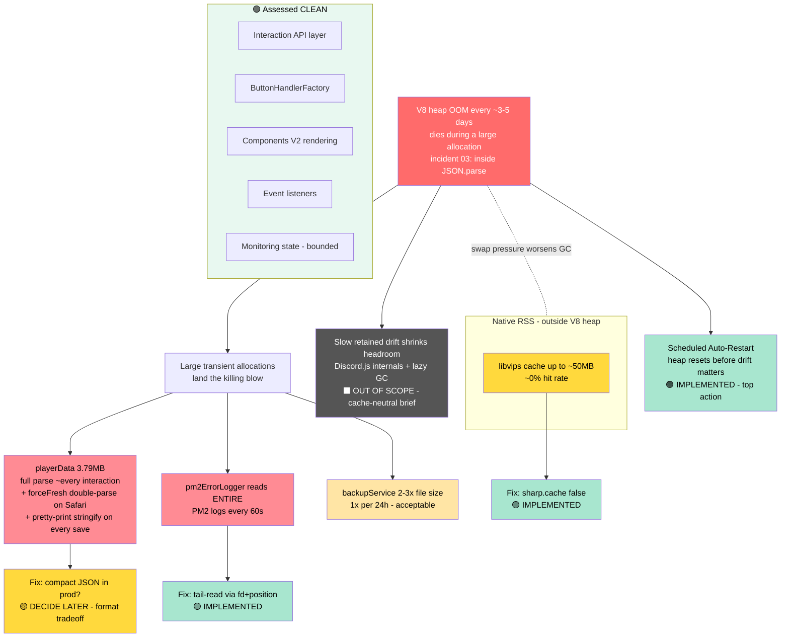

# Memory Footprint Assessment — Architecture-Wide, Cache-Neutral, Infra-Neutral

**Status:** Analysis complete; Tier 1 fixes + Scheduled Auto-Restart implemented (this session)
**Date:** 2026-07-06
**Author:** Claude (Fable 5) at Reece's request
**Follows:** [RaP 0915 — Memory Leak / Heap OOM Crash Analysis](0915_20260603_MemoryLeakOOM_Analysis.md)
**Related incidents:** [01 Map Image Oversize](../incidents/01-MapImageOversizeOOM.md) · [02 Prod OOM](../incidents/02-MapImageOOMCrash.md) · [03 V8 Heap OOM / JSON.parse](../incidents/03-V8HeapOOMCrash.md)

---

## 📜 Original Context (User's Full Prompt — Verbatim)

> @docs/01-RaP/0915_20260603_MemoryLeakOOM_Analysis.md comprehensively assess Castbot's architecture, discord interaction api @docs/standards/DiscordInteractionAPI.md @docs/standards/ComponentsV2.md  and identify the lowest effort, lowest risk (esp. relating to changing cache behaviour which has caused issues in the past despite being "low risk") and identify how to improve the memory footprint without changing infrastucture (see @docs/incidents/ for some other potential contexct). Take as long as you need.. create a RaP as well

Mid-planning, Reece added (verbatim):

> explain the sharp thing, also quantify the memory savings for all of this, and consider 'regular restart' options

And on the scheduled-restart design (verbatim, PM2 log paste at the end folded below):

> Lets include a design for PM2 cron restart in planning mode and also captured in the RaP, and determine the appropriate target documentation to also update in /features. Is it possible to leverage or align this to the pm2errorlogger (a) more broadly if it makes architectural sense and b) with these "tag reece" notifications in channel 1385059476243218552 [12:08PM] Sun 5 Jul 26 | 🎉🥳 New Server Install: Irivivor S10: Toronto - Second Chances (1455993752106827848) | Owner: Iris (@eternaliridescence) (827935295089410088) @ReeceBot (actually on second thoughts maybe the health monitor service 1420926549921763339). I'm also conscious I could 'legit' want to cancel a scheduled restart; MVP is there is a message sent to one of the channels above 30 mins before the restart that tags me and includes a cancel button (lets implement this regardless), or we do have a scheduling system as part of the Actions sytem that does enable creating, viewing and cancelling scheduled actions which persist upon restart

And on plan approval (verbatim):

> Approved except rather than making the restart a hand edit, add a button into the data meenu similar to the ultrathink health monitor, on click; show a modal with a string select with options to disable or edit / enable; then display texts for every day / min / hr from now (study the task modal i sent you earlier, plus the ultrathink one), and finally a channel select for the channel. On submit, show a non-ephemeral message in the channel the parent message component is in summarising hte output using @componentsv2.md - ultrahealth ref and as mentioned check the task ref. agree with your plan to start it off disabled - nice and low risk. after submitting it then happens in perpetuity over that interval, it should persist a restart obviously, and you should be extra careful in designing it to avoid runaway error states, apply leanUX.md as well - you are approved to start the full build after updating the rap

<details>
<summary>PM2 log tails Reece pasted with the above prompts (unmodified, kept as evidence — they confirm prod-scale playerData parses)</summary>

Key lines (full pastes preserved in the git history of this conversation's plan file):

```
0|castbot-pm | 2026-07-06T13:39:54: ✅ Loaded playerData.json (3789487 bytes, 165 guilds)
0|castbot-pm | 2026-07-06T13:39:55: ✅ Saved safariContent (2388748 bytes)
0|castbot-pm | 2026-07-06T13:40:03: ✅ Loaded playerData.json (3789487 bytes, 165 guilds)
0|castbot-pm | 2026-07-06T13:40:08: ✅ Loaded playerData.json (3789487 bytes, 165 guilds)
0|castbot-pm | 2026-07-06T13:40:22: ✅ Loaded playerData.json (3789487 bytes, 165 guilds)
0|castbot-pm | 2026-07-06T13:40:42: ✅ Loaded playerData.json (3789487 bytes, 165 guilds)
0|castbot-pm | 2026-07-06T13:40:47: ✅ Loaded playerData.json (3789487 bytes, 165 guilds)
```

Seven full 3.79MB parses in 53 seconds of one admin clicking through menus. That's the churn story in one log excerpt.

</details>

---

## 🤔 Plain English: What This Assessment Found

RaP 0915 established *that* CastBot OOMs every ~3–5 days and *why* it crashes when it does (incident 03: it dies **inside `JSON.parse`** — a big transient allocation lands on a heap that has drifted near its ceiling). This assessment answers the follow-up question: **across the whole architecture, where does memory actually go, and what can we do about it that is genuinely low-risk — no cache-behavior changes, no infrastructure changes?**

The one-paragraph answer:

> The Discord interaction layer (Interaction API usage, ButtonHandlerFactory, Components V2 rendering) is **memory-clean** — nothing retains, payloads are small and transient. The memory story lives in three places: **(1) data-file churn** — the 3.79MB `playerData.json` is fully re-parsed on essentially every interaction and fully re-serialized (pretty-printed!) on every save; **(2) monitoring churn** — the PM2 error logger re-reads the *entire* PM2 log files into memory every 60 seconds; **(3) native memory** — sharp/libvips reserves up to ~50MB of never-hit cache outside the V8 heap. None of these is "the leak" (the multi-day retained drift is mostly Discord.js internals + lazy GC, out of scope by design) — but (1) and (2) are the *trigger surface*: they're the big allocations that land the killing blow. Shrink them, add a **scheduled auto-restart** as the guaranteed floor, and the OOM class is effectively closed without touching a single cache.

## 🏛️ Architecture Assessment — Layer by Layer

The user asked for a comprehensive architecture assessment including the Discord Interaction API and Components V2 layers. Verdicts, with evidence:

| Layer | Verdict | Evidence |
|---|---|---|
| **Interaction routing** (`app.js` `/interactions`, 52,890 lines) | 🟢 Clean | `processedInteractions` self-cleans via 5-min setTimeout (app.js:2523-2528); res.send wrapper is per-request; no setTimeout closure retains req/res long-term |
| **ButtonHandlerFactory** (5,319 lines) | 🟢 Clean | `context` is a per-call local; BUTTON_REGISTRY (~691 entries) is static; auto-registration bounded by distinct prefixes |
| **Components V2 rendering** (castlistV2/V3, menus) | 🟢 Clean | All component arrays are function-scoped locals, returned and GC'd; no module-level accumulation anywhere in render paths |
| **Deferred/webhook responses** | 🟢 Clean | Follow-up payloads transient; no response bodies stashed in module state |
| **Event listeners** | 🟢 Clean | All `client.on` registered once at top level; no in-handler listener accumulation (the classic leak is absent) |
| **Pending-flow globals** (`pendingExecuteOn`, `navigationInteractions`, `dropConfigState`, `pendingArchive*`) | 🟡 Minor drip | Cleaned on happy paths (e.g. `customActionUI.js:4653`); leak only on abandoned flows; **KBs over days — negligible**, hygiene-only |
| **Data-file I/O** (`storage.js`, `safariManager.js`, `atomicSave.js`) | 🔴 Churn hotspot | Detailed below |
| **Monitoring timers** (`pm2ErrorLogger`, `healthMonitor`, `backupService`, `prodWatchdog`, `restartTracker`, `analyticsLogger`) | 🟡 One offender | pm2ErrorLogger whole-file reads (below); everything else bounded/clean (rateLimitQueue capped 50, restart history capped 20, backup 1×/24h fully released) |
| **Image generation** (sharp in 5 modules) | 🟡 Native reservation | Buffers are transient and released; but no `sharp.cache()` tuning anywhere → libvips default ~50MB native cache with ~0% hit rate |
| **Discord.js caches** (GuildMemberManager etc.) | ⬛ Out of scope | Load-bearing per Nov 2025 incident (`castlistCrashIssues_cache.md`); explicitly excluded from this assessment per the brief |

### 🔴 The data-file churn hotspot (the crash trigger surface)

Verified mechanics (all confirmed by direct code reads this session):

1. **`requestCache` is cleared at the *start* of each interaction** (`app.js:2509` → `storage.js:35-42`), so the first `loadPlayerData` of every interaction is a cold **full read + `JSON.parse` of 3,789,487 bytes** (`storage.js:68-78`). ~10–15MB live during parse. 195 `loadPlayerData` call sites in app.js dedupe *within* an interaction — but every interaction pays the cold parse.
2. **Every save serializes the entire object pretty-printed**: `JSON.stringify(data, null, 2)` (`atomicSave.js`, step 1) across 67 `savePlayerData` + 39 `saveSafariContent` sites. Pretty-printing inflates the string ~25–40% — and the fatter file is then what every subsequent cold load re-parses.
3. **`onSaved: () => requestCache.clear()`** (`storage.js:186`, `safariManager.js:558`): a save mid-interaction wipes the cache, so load-modify-save-load sequences pay multiple full parses per interaction.
4. **`safariManager.js:1771`** calls `loadPlayerData(null, { forceFresh: true })` on every custom-action condition evaluation — a deliberate race-condition guard that forces an *additional* full parse in the same request. **Do not remove** without a dedicated design discussion.
5. `analyticsLogger.js:278-281` has its own `fs.readFileSync('./playerData.json')` + full parse per newly-seen guild (bounded, rare — noted for completeness).

### 🟡 pm2ErrorLogger whole-file reads

`readLogsLocal` (`src/monitoring/pm2ErrorLogger.js:116` and `:146`) does `fs.readFileSync(path, 'utf8')` on **both** PM2 log files every 60 seconds, then `.slice(position)` to get the new tail. The whole file is materialized as a string just to keep the last few KB. PM2 logrotate resets the files at midnight, so the cost ramps daily from ~0 to multi-MB per tick on busy days. It retains nothing (positions only) — pure transient churn, up to ~1GB/day of pointless allocation traffic through a heap that's already gasping.

### 🟡 sharp/libvips native cache

No `sharp.cache()` or `sharp.concurrency()` call exists anywhere in the codebase (verified via `git grep`). libvips therefore keeps its default operation cache: up to **~50MB of native (non-V8) memory**. CastBot's renders are essentially never repeated (unique avatars/maps every time), so the hit rate is ~0% — pure reservation, no benefit. On a box currently at 18MB free with 286MB swap used, that's meaningful. **Honest framing: this helps RSS/swap health (the thing that made RaP 0915's heap dump take 74 seconds), not the V8 heap ceiling.**

## 📊 Suspect Map



## 💰 Quantified Savings (honest numbers, two currencies)

Two different kinds of "memory saving" — **retained** (lowers the resident floor) vs **churn** (fewer/smaller transient allocations; what actually prevents the crash trigger):

| Action | Currency | Quantified saving | Status |
|---|---|---|---|
| **Scheduled Auto-Restart** | Heap floor (reset) | Heap resets to ~85MB baseline every interval. The crash needs ~3 days of drift; a daily restart makes the ceiling unreachable. **This is the only item that closes the OOM class outright.** | ✅ Implemented (ships disabled) |
| **pm2ErrorLogger tail-read** | Churn (V8 heap) | Eliminates full-file reads ×1440/day: ~50MB/day (quiet) to ~1GB/day (busy, late-day multi-MB logs) of allocation traffic | ✅ Implemented |
| **sharp.cache(false)** | Retained (native RSS) | 0–50MB RSS depending on render activity; relieves swap pressure, not heap ceiling | ✅ Implemented |
| **Compact JSON in prod saves** | Churn (V8 heap) | Save string 3.7MB → ~2.3–2.8MB (×58 saves/day) AND every cold parse reads a 25–40% smaller file (×164 loads/day): **~200–400MB/day less churn, and the exact allocation type that kills the process shrinks by a third** | 🟡 **DECIDE LATER** (open question below) |
| **Idle cache release** (clear request caches at end of interaction too) | Retained (V8 heap) | ~10–18MB idle floor (last interaction's parsed playerData+safariContent object graphs currently sit resident through all idle time) | 🟡 Tier 2 — behavior-identical but touches cache *lifecycle*; needs explicit sign-off given cache history |
| Hygiene TTLs on pending-flow globals | Retained | **KBs.** Genuinely negligible | 🅿️ Parked (hygiene pass someday) |

**Expectation management:** the code fixes stretch the crash interval (fewer/smaller trigger allocations); they don't remove the underlying drift. The scheduled restart is what makes the crash effectively impossible. Together: crashes stop, and each restart cycle runs leaner.

## 🌙 Scheduled Auto-Restart — Design (implemented this session)

**Why in-app instead of PM2 `cron_restart`:** Reece's MVP requires a warning message **30 minutes before** each restart with a working **Cancel** button. PM2's cron restart fires inside the PM2 daemon — the bot can't cancel it for one night without shelling out to reconfigure PM2. An in-app restart (`process.exit(0)`; PM2 `autorestart: true` revives in ~50s — the *same* battle-tested path that already recovers every OOM) makes Cancel a flag flip. `atomicSave`'s temp-file+rename means an exit can never corrupt a data file. The Safari Actions scheduler was considered and rejected (guild-content domain; RaP 0941's "new trigger type touches 16+ places" lesson).

**Module:** `src/monitoring/restartScheduler.js`, patterned on healthMonitor (config persistence in `playerData.environmentConfig`), prodWatchdog (`channel.send` with Components V2 + `<@user>` ping + working button + `allowedMentions` — proven at `prodWatchdog.js:124-141`), and backupService (chained setTimeout).

**Config UI (per Reece's approval message):** Data menu (`data_admin`) → 🌙 **Auto-Restart** button (Analytics row, next to Ultramonitor) → modal:
- Text Display: current status (enabled/disabled, interval, next restart, channel)
- Label + String Select: `Enable / Update schedule` vs `Disable`
- Label + Text Input: interval — `1d`, `12h`, `90m` formats ("every day / hr / min from now")
- Label + Channel Select: warning channel

On submit: **non-ephemeral** Components V2 summary posted in the channel the menu was used in (interval, next restart as `<t:…:F>` / `<t:…:R>`, warning channel, cancel semantics). Recurs in perpetuity from submission time; `nextFireAt` persisted so the schedule **survives restarts** (including its own).

**Runaway-state guards (Reece: "be extra careful… avoid runaway error states"):**
1. **Minimum interval 4h** — enforced at modal validation AND re-clamped at arm time (a corrupted/hand-edited config can never create a restart loop)
2. **Ships disabled** — `enabled: false` until explicitly configured via the modal
3. **No warning → no restart** — if the T-30 warning fails to post (channel deleted, missing perms), the cycle is *skipped*, `nextFireAt` advances, error logged. The bot never restarts unannounced
4. **Boot inside the warn window → push to next cycle** — never restart without the full 30-min warning
5. **Fire-time re-verification** — `executeRestart` re-reads persisted config (enabled? skipNext?) before exiting; defense against races with the Cancel click
6. **Missed-fire catch-up advances, never fires immediately** — after downtime, `nextFireAt` advances past now in interval steps (with a sanity cap that disables + alerts on invalid config rather than tight-looping)
7. **Supervision gate** — `process.exit(0)` only under PM2 (`PRODUCTION==='TRUE'` or `INSTANCE_ROLE==='test'`); in dev the full warn/cancel flow runs but fire-time logs "no supervisor — skipping" and re-arms (testable, safe)
8. **Single armed timer** — arming always clears existing timers first; module is a singleton
9. All timer callbacks try/catch-isolated (shared monitoring-module convention)

**Cancel:** warning message's `restart_sched_cancel_<fireEpoch>` button (ButtonHandlerFactory, ManageRoles permission, `updateMessage: true` — edits the warning in place). Epoch-in-custom_id guards stale clicks on old warnings. Cancel skips *that* fire only; the schedule re-arms for the next interval.

**Deployment note:** when enabling on prod, set `PROD_WATCHDOG_THRESHOLD=2` in the TEST box `.env` — the watchdog probes every 60s with failure threshold 1, so a planned ~50s restart would otherwise fire false DOWN/RECOVERY alert pairs most cycles. Threshold 2 still catches genuine >2min outages.

**Feature doc:** [docs/03-features/ScheduledRestart.md](../03-features/ScheduledRestart.md) (promote this design there once shipped and verified on prod).

## 🟡 Open Question for Reece — Compact JSON in Prod

The single biggest *remaining* churn cut: drop pretty-printing (`JSON.stringify(data, null, 2)` → `JSON.stringify(data)`) for the two big data files, env-gated (pretty in dev, compact in prod).

- **For:** ~25–40% off every save string and every cold parse — the exact allocation class that OOM'd the bot in incident 03. ~200–400MB/day less churn. One-line change in `atomicSave.js` (plus the gate).
- **Against:** prod `playerData.json` / `safariContent.json` stop being human-readable when eyeballed raw over SSH. `jq`/`node -e` one-liners work unchanged. Backup files also become compact.
- **Not decided.** Reece explicitly chose "decide later." Do not implement without his word.

## 🅿️ Parked / Rejected (with reasons — do not resurrect casually)

| Item | Status | Reason |
|---|---|---|
| In-memory playerData cache w/ mtime invalidation | 🅿️ Parked | *The* highest-leverage churn fix (incident 03 P1) — but it IS a cache-behavior change, explicitly excluded by the brief; cache changes have burned prod before ([feedback](../incidents/castlistCrashIssues_cache.md)) |
| Discord.js sweepers (esp. guildMembers) | ❌ Rejected | Would recreate the Nov 2025 cold-member-cache timeout incident; member cache is load-bearing (RaP 0915 §Session 2) |
| Lightsail resize | 🅿️ Parked | Infra change, excluded by brief; requires snapshot-migrate + DNS cutover (RaP 0915 item 5) |
| Removing `forceFresh` at safariManager.js:1771 | ❌ Do not touch | Deliberate race-condition guard for rapid button clicks |
| `availabilityReactions` cleanup / pending-map TTLs | 🅿️ Parked | Measured negligible (~16KB / KBs); hygiene pass someday |
| `sharp.concurrency(1)` | ❌ Dropped | Prod is 1 vCPU — libvips thread pool already defaults to 1; no-op |

## ⚠️ Risk Assessment

| Change | Risk | Why it's safe |
|---|---|---|
| pm2ErrorLogger tail-read | Very low | Same bytes delivered to the same filters; monitoring module is error-isolated by design ("never crashes the bot"); rotation-reset logic preserved; unit-tested |
| sharp.cache(false) | Very low | Standard sharp idiom for constrained memory; renders are compute-identical, just uncached (hit rate was ~0% anyway) |
| Restart Scheduler | Low | Ships **disabled**; 9 runaway guards above; exit path identical to every PM2 crash-recovery the bot already survives; warn/cancel flow fully testable in dev without any restart |
| Compact JSON | Low (technical) / personal-workflow tradeoff | Deferred to Reece |

## 📌 Key Files

- `storage.js:11,35-42,68-78,132-188` — requestCache lifecycle, cold parse, onSaved clear
- `safariManager.js:135,527-560,1771` — safari cache mirror, forceFresh double-parse
- `atomicSave.js` — whole-object pretty-print stringify (the compact-JSON decision point)
- `src/monitoring/pm2ErrorLogger.js:110-180` — tail-read fix target
- `castlistImageGenerator.js` / `playerLocationImageGenerator.js` / `mapExplorer.js` / `scheduleImageGenerator.js` / `channelExportFetcher.js` — sharp import sites
- `src/monitoring/restartScheduler.js` — new module (this session)
- `src/monitoring/prodWatchdog.js:124-141` — the CV2+ping+button posting pattern reused
- `src/monitoring/healthMonitor.js:424-459` — the config persist/restore pattern reused
- `app.js:1061-1243` — Data menu builder (new Auto-Restart button)

---

**TL;DR:** The interaction/Components V2 architecture is memory-clean; the OOM trigger surface is JSON churn (3.79MB parse per interaction, pretty-printed full-file saves) plus a monitor that re-reads entire log files every minute, with libvips quietly reserving native RAM on the side. Shipped this session, all cache-neutral and infra-neutral: pm2ErrorLogger tail-reads, `sharp.cache(false)`, and a **Scheduled Auto-Restart** (Data menu → modal config, T-30 tagged warning with Cancel button, 9 runaway guards, ships disabled) that converts random ~3–5-day OOM crashes into planned, cancellable, quiet-hour restarts. Compact-JSON-in-prod is quantified and awaiting Reece's call.

🧯 *You can't always find the slow leak in the boat — but you can schedule the bailing before the water reaches the gunwales.*
