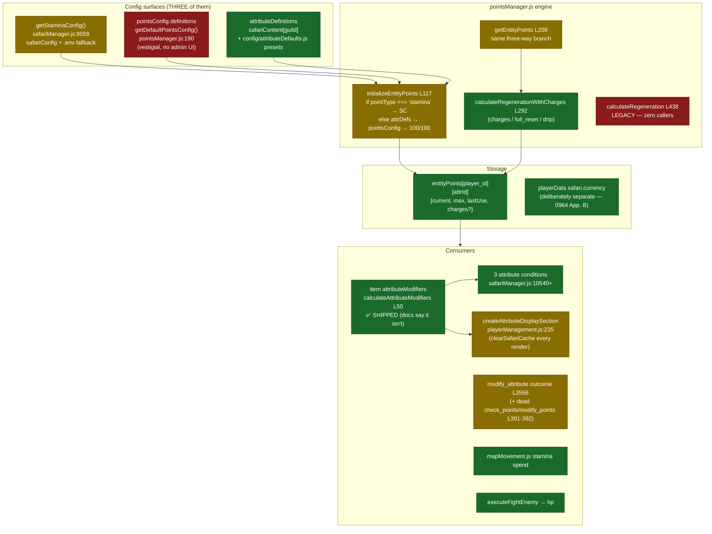
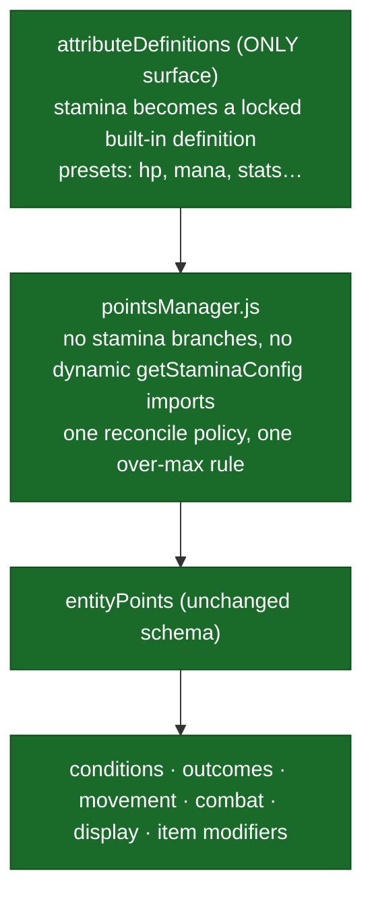

# RaP 0904 — Attributes System Improvement Review

**Date:** 2026-07-06
**Status:** Analysis complete — roadmap awaiting prioritization
**Scope decision (Reece, 2026-07-06):** RaP-only. No code changes, no edits to other docs in the authoring session. Docs-accuracy corrections are the lead priority; drip-overshoot is explicitly parked as an open decision.

Related: [Attribute System Design (0964)](0964_20260109_AttributeSystem_Analysis.md) · [Attribute Conditions (0960)](0960_20260113_AttributeConditions_Analysis.md) · [Permanent Stamina Items (0965)](0965_20251124_PermanentStaminaItems_Analysis.md) · [Regen Amount (0946)](0946_20260315_RegenerationAmount_Analysis.md) · [Stamina Regen Timer (0938)](0938_20260320_StaminaRegenTimer_Analysis.md) · [Per-Server Stamina (0999)](0999_20251021_StaminaLocation_PerServer_Design.md) · [Enemy System (0931)](0931_20260328_EnemySystem_Analysis.md) · [Safari Status Field (0948)](0948_20260315_SafariStatusField_Analysis.md) · [Player Status (0905)](0905_20260625_PlayerStatus_Analysis.md)
Feature docs: [Attributes.md](../03-features/Attributes.md) · [StaminaArchitecture.md](../03-features/StaminaArchitecture.md) · [AttributeConditions.md](../03-features/AttributeConditions.md) · [StaminaItems.md](../03-features/StaminaItems.md) · [EnemySystem.md](../03-features/EnemySystem.md)

---

## Original Context / Trigger Prompt

> Review any RaPs and the code itself and work out how we could improve the attributes system / feature ultrathink

**Scoping answers given during planning (2026-07-06):**
- Deliverable: *"RaP analysis doc only"* — no code changes this session.
- Priority theme: *"Docs accuracy"*.
- Drip overshoot: *"leave it for now needs more thought dont change anything this is RAP only please"*.

---

## 🤔 The Problem in Plain English

The Attributes system **works** — resources regenerate, conditions evaluate, item bonuses apply, enemies lose HP. This is not a "it's broken" RaP. It's a "the map no longer matches the territory, and the territory has three geological strata" RaP.

Two distinct problems:

1. **The docs have drifted from the code.** The foundational design doc (RaP 0964) still says Phase 5 (item attribute modifiers) is unbuilt — it shipped, with a full admin UI. StaminaArchitecture.md describes drip-overshoot as "pending a decision" while the code and tests now assert the behavior deliberately. Merge notes were never executed. Anyone (human or Claude) reading the docs to plan the next attribute feature will plan against a stale picture — and we know from experience that Claude instances trust nearby documentation heavily.

2. **The engine carries three generations of config.** Like a house rewired twice without removing the old wiring: stamina's bespoke config (`getStaminaConfig`), the legacy `pointsConfig.definitions` layer, and the modern `attributeDefinitions` all feed the same `pointsManager.js` engine, which branches between them with `if (pointType === 'stamina')` special cases and repeated dynamic imports. Every new attribute feature pays a tax navigating this.

This RaP inventories the drift, the debt, and the capability gaps — with verified file:line evidence (checked 2026-07-06, not copied from older docs) — and proposes a phased roadmap.

---

## 🏛️ Historical Context — The Organic Growth Story

The attributes system is a textbook case of a special-purpose feature generalizing outward, one ring at a time:

1. **Stamina era** — stamina built as "Points Manager" (`pointsManager.js`) purely for map movement. Config came from `.env` (`STAMINA_MAX`, `STAMINA_REGEN_MINUTES`) — a "temporary global that stuck" ([0999](0999_20251021_StaminaLocation_PerServer_Design.md) moved it per-server into `safariConfig`).
2. **Points era** — a generic `pointsConfig.definitions` layer was sketched (`getDefaultPointsConfig`, `pointsManager.js:190`) so entities could have point types other than stamina. It never got an admin UI and is now vestigial.
3. **Attributes era** — [0964](0964_20260109_AttributeSystem_Analysis.md) recognized "80% of the infrastructure already exists" and built `attributeDefinitions` (per-guild HP/Mana/stats, presets in `config/attributeDefaults.js`, bespoke admin UI under 🪛 Tools → 📊 Attributes).
4. **Conditions & triggers** — [0960](0960_20260113_AttributeConditions_Analysis.md) added `attribute_check` / `attribute_compare` / `multi_attribute_check` conditions plus attribute-change triggers, shipped 2026-01-13.
5. **Item modifiers (Phase 5)** — quietly shipped: items carry `attributeModifiers[]`, edited via the item editor's "Stats" group. *The design doc was never updated to say so* — the central docs-accuracy finding below.
6. **Enemies** — [0931](0931_20260328_EnemySystem_Analysis.md) made enemy HP an attribute (partial realization of 0964's Phase 6), leaving "attack lives on items, not as an attribute" as an open design tension.

Each ring reused the previous ring's storage (`entityPoints`) but added its own **config surface**, and nothing was ever demolished. That's the debt.

---

## 📊 Architecture — Current vs Target

### Current: three config strata feeding one engine

### Target: one config surface, stamina as a first-class attribute

---

## 📋 Priority 1 — Docs Accuracy Corrections

**None of these were applied in this session (per scope decision). Each is a small, safe markdown edit for a future session.**

| # | Doc | Correction |
|---|---|---|
| D1 | [0964](0964_20260109_AttributeSystem_Analysis.md) Appendix G/H | Phase 5 (Item Attribute Modifiers) is marked **NOT IMPLEMENTED / NEXT** — it is **fully shipped**: item editor "Stats" field group (`entityManagementUI.js:682`, renders current modifiers at :402–403), app.js handlers (display ~29424, manage/edit/remove ~29597–29844, modal submit ~40974–41073), engine read path `calculateAttributeModifiers` (`pointsManager.js:50–114`), consumed by all three attribute conditions via `includeItemBonuses` (`safariManager.js:10576–10578, 10650–10652, 10731–10733`) and by player display (`playerManagement.js:266–296`, shows `(+N max from items)`). Update the status table; consider promoting 0964's as-built parts into Attributes.md. |
| D2 | [StaminaArchitecture.md](../03-features/StaminaArchitecture.md) | The drip-overshoot section says "pending Reece's decision" but doesn't state what the code *does*. State the verified current behavior: numeric drip (`regeneration.amount` = number) **intentionally does NOT clamp** — the clamp at `pointsManager.js:413–419` applies only to `amount: 'max'` / full-reset mode, and tests assert "does NOT cap at max". Keep the decision flagged open (see Open Decisions below) but describe reality accurately. |
| D3 | [0965](0965_20251124_PermanentStaminaItems_Analysis.md) | Header note says "after implementation, merge into StaminaItems.md" — implemented long ago, never merged. Execute the merge (or fold into StaminaArchitecture.md) and archive/promote the RaP. |
| D4 | Shipped stamina RaPs in 01-RaP | [0938](0938_20260320_StaminaRegenTimer_Analysis.md) (deployed fix), [0946](0946_20260315_RegenerationAmount_Analysis.md) (shipped feature), [0999](0999_20251021_StaminaLocation_PerServer_Design.md) (shipped) — per the promotion path these belong folded into `StaminaArchitecture.md` / `Attributes.md` with the RaPs kept as history links, not left looking like open proposals. |
| D5 | [Attributes.md](../03-features/Attributes.md) + StaminaArchitecture.md | Refresh stale line-number references against current code (known project gotcha — line refs rot fast). Prefer function names over line numbers where possible. |
| D6 | [Attributes.md](../03-features/Attributes.md) | Document the preset list actually in `config/attributeDefaults.js` (mana, hp, strength, dexterity, luck; `MAX_ATTRIBUTES_PER_GUILD: 20`) — earlier docs mention a limit of 10. |

**Why this is Priority 1:** Claude instances (and future-Reece) plan new work by reading these docs. A design doc that says "Phase 5 is next" invites someone to re-implement a shipped feature — the most expensive kind of doc rot.

---

## 🔧 Priority 2 — Consolidation Roadmap

### Phase A — Quick wins (low risk, mechanical)

| # | Item | Evidence | Change |
|---|---|---|---|
| A1 | Delete dead `calculateRegeneration` | `pointsManager.js:438–468`, comment says LEGACY, **zero callers** | Remove function |
| A2 | Remove `check_points` / `modify_points` action types | `ACTION_TYPES` at `safariManager.js:391–392`, dispatch at ~1995–2003, `executeCheckPoints` L3470 / `executeModifyPoints` L3503. Not creatable in current Custom Action UI (`customActionUI.js` `ACTION_TYPE_OPTIONS` L17–27 omits them). **Zero occurrences in live safariContent.json** (verified 2026-07-06) | Remove enum entries, dispatch cases, executors. Superseded by `modify_attribute` + `attribute_check` |
| A3 | Dedupe `attributeDefinitions: {}` init | Initialized in **two** places: `safariManager.js:585` and `:618` | Single init path |
| A4 | Fix the `STAMINA_MAX \|\| '1'` footgun | `getStaminaConfig` fallbacks (`safariManager.js:9571–9586`): unconfigured server → **max 1 stamina, 3-min regen**, while `resetCustomTerms` seeds 10/60min — internally inconsistent | Align the live fallback with the seeded default (10/60), or force config on Safari init |
| A5 | Preset/id collision + junk guard | Live guild 1331657596087566398 has `mana` **and** `mp` plus test attr `asdasas` — name-derived ids (`createAttributeDefinition`, `safariManager.js:9614`) have no dedupe against enabled presets | Warn/block on creating a custom attr whose name matches an existing preset; optionally a cleanup pass |

### Phase B — The big one: stamina becomes a regular attribute

**Goal:** one config surface (`attributeDefinitions`), zero `if (pointType === 'stamina')` branches in `pointsManager.js`.

Current special-casing (verified): `initializeEntityPoints` L135, `getEntityPoints` config-build ~L224–269, stamina-only max-reconcile at `calculateRegenerationWithCharges` L381–388, display L848 — each doing `await import('./safariManager.js')` for `getStaminaConfig` (L137 et al.).

Sketch:
1. On Safari init (or lazily on first read), materialize a **locked built-in `stamina` definition** in `attributeDefinitions`, populated from existing `safariConfig` stamina values. Existing Stamina & Location config modal writes through to it (UI unchanged).
2. Generalize the max-reconcile policy: today stamina snaps `max` → `effectiveMax` on every read while hp/mana preserve admin-set custom max (deliberate — see comment at `pointsManager.js:375–380`). Make this a per-definition flag (e.g. `maxPolicy: 'config' | 'custom'`) with stamina defaulting to `'config'` — behavior-preserving.
3. Delete `getStaminaConfig` call sites in pointsManager; keep it as a thin read of the stamina definition during a deprecation window.
4. Retire `pointsConfig.definitions` fallback (`getEntityPoints`/`initializeEntityPoints`) once confirmed no live data depends on it.

**⚠️ Risk assessment:** regen is production-critical and history shows it bites (the 0938 overnight-exploit bug, the de-init stale `3/999` bug). Migration must be **read-path-compatible** (old `safariConfig` values remain the source of truth until the definition is materialized, no big-bang data rewrite), verified on dev + castbot-blue with real regen cycles before prod, and brought with evidence — per standing guidance, no "trust me bro" cache/config changes.

### Phase C — Adjacent cleanups

- **`clearSafariCache()` on every attribute display render** (`playerManagement.js:239`) — a cache-coherence workaround masking a write-path invalidation gap. Root-cause rather than delete: find which write path leaves the cache stale. (Tread carefully — member/safari caches are load-bearing.)
- **Two Player Admin surfaces** — attributes/Stats live in Player Management (`playerManagement.js`), currency/stamina editing still also in deprecated `safariMapAdmin.js`. Finish the consolidation into Player Management.
- **Init-state inference** — "is this player initialized?" is still inferred from `safari.points !== undefined` ([0948](0948_20260315_SafariStatusField_Analysis.md)). The new Status Engine skeleton (`playerStatus.js`, [0905 §9](0905_20260625_PlayerStatus_Analysis.md)) is the natural home for an explicit init status; attributes work should stop deepening the inference.

---

## ✨ Priority 3 — Capability Backlog

| Item | Source | Notes |
|---|---|---|
| Delta conditions ("attribute changed by ≥N this period") | 0960 §unbuilt | Designed, never built; needs change-history or snapshot support |
| Expression scaling (outcome values scale with an attribute) | 0960 §unbuilt | e.g. damage = strength × 2 |
| Attack as an attribute | 0931 tension | Attack currently lives on items (`attackValue`); making it an attribute would unify combat math with `attribute_compare` and item `attributeModifiers` (which already support `add`) |
| Per-player max editing consistency | Phase B flag | Once `maxPolicy` exists, expose admin-set custom max uniformly |
| NPC/enemy attribute parity | 0964 Phase 6 | `entityPoints` is already entity-agnostic (`player_`/`npc_`/`enemy_` prefixes reserved); enemies partially done via 0931 |

---

## 🧪 Test-Hardening Backlog

- `tests/pointsManager.test.js` **re-implements** Phase-1 regen inline (`calculatePhase1Regen`) instead of exercising the real `calculateRegenerationWithCharges` — the actual production regen path (charges, stamina reconcile, drip) has no direct coverage. Export the pure calculation (it takes plain data + config) so tests can import it without dragging in file I/O.
- No tests for: `attributeDefinitions` CRUD (`createAttributeDefinition` name→id derivation, limits, preset enable), the three attribute condition evaluators, attribute-change triggers (threshold crossing logic).
- Trigger execution is fire-and-forget (`checkAttributeTriggers` intentionally not awaited, `pointsManager.js` ~L640) — at minimum, test that trigger failures can't corrupt the points write.

---

## ⚠️ Open Decisions (explicitly NOT resolved by this RaP)

### 1. Drip-regen overshoot — **PARKED by Reece 2026-07-06** (*"leave it for now needs more thought"*)

**Current verified behavior:** numeric per-tick regen (`regeneration.amount` = number) adds flat amounts and **may exceed max**; only `amount: 'max'` (full reset) clamps (`pointsManager.js:413–419`). Tests assert the non-clamping ("does NOT cap at max"), so the code currently treats it as a feature.

Options when revisited:
- **Keep** — over-max drip is a designer tool (matches consumable over-max mechanic); docs-only fix.
- **Clamp** — "only consumables/admin exceed max" becomes the single rule; small code + test change; check no live season relies on overshoot first.
- **Configurable** — `allowOvershoot` flag per definition; most flexible, one more knob.

Until decided, **D2 above still applies**: docs must describe the actual behavior while flagging the decision open.

### 2. Currency as an attribute — **reaffirm the existing decision**

[0964 Appendix B](0964_20260109_AttributeSystem_Analysis.md) deliberately kept currency in `playerData.json` (`safari.currency`) rather than folding it into `entityPoints`. Nothing found in this review changes that calculus (currency has its own economy surface: stores, transfers, harvest). Recommendation: keep separate; don't relitigate absent a concrete driver.

---

## Recommended Sequence

1. **D1–D6 docs corrections** (one session, zero risk) — the priority Reece chose.
2. **Phase A quick wins** (one session, unit-tested, dev+test soak).
3. **Phase B stamina unification** — its own implementation plan in `02-implementation-wip/` when scheduled, with the risk controls above.
4. Phase C / capabilities / tests as pulled from backlog.

---

🎭 *Three generations of wiring, one working house. The lights are on — this RaP is the electrician's diagram for removing the two old fuse boxes without turning them off mid-game.*
