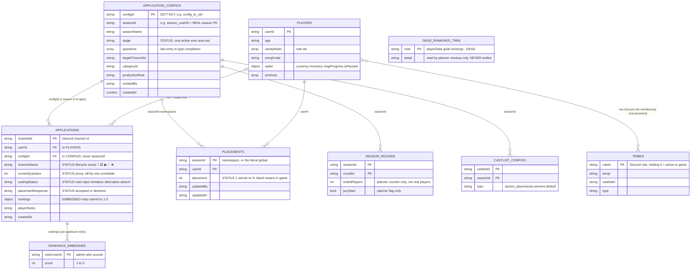
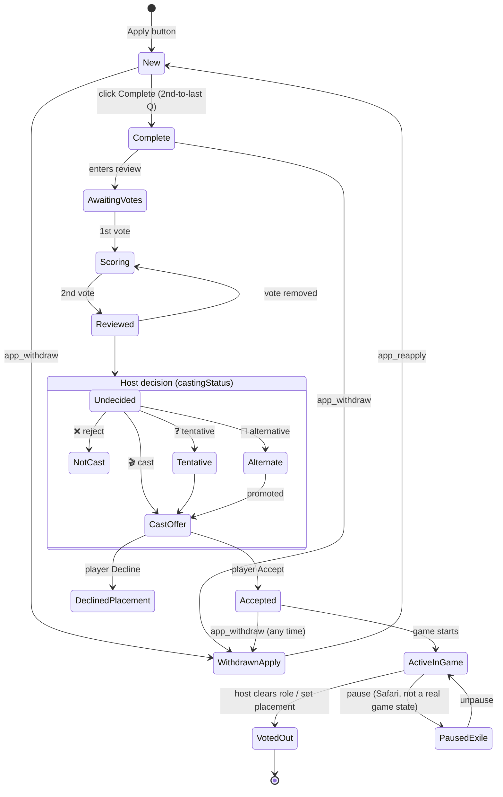

# 0905 — Player Status: Unified Status Model Across All Features (Analysis)

> 🚧 **STATUS: WORKING DRAFT — "as we go".** Living analysis. **No solutions yet** (per trigger prompt) —
> this maps (a) Reece's mental model, (b) what the code *actually* does, (c) the drift between them, and
> (d) open questions. The centrepiece is **§4 The Unified Status Table** (every status + its transitions).

- **Date:** 2026-06-25
- **Sources:** Reece (mental model) + 4 parallel code-mapping subagents (Apps lifecycle / Player record + rankings / In-game state + exile / Data model + global rules)
- **Scope:** "Player status" spans Apps, Casting, Castlists/Placements, Safari, and future game-state — **not** just Applications.

Related: [SeasonManager /](../03-features/SeasonManager.md) [`deriveApplicationStatus`](../03-features/SeasonManager.md) · [Season lifecycle](../concepts/SeasonLifecycle.md) · [RaP 0906 Casting Invites](0906_20260622_CastingInvites_Analysis.md)

---

## 1. Trigger Prompt (full, unmodified)

> # OVERVIEW
>
> Lets create a working "as we go" RaP to sort out Player Status across all features - this isn't just an Apps concern and will impact current and future features.
>
> I need to map out the logic which exists in my head, but has morphed and had things bolted on over time.
>
> We need a consistent, technical design for these statuses that can be called by multiple functions.
>
> // STILL DRAFT - don't come up with any solutions yet but feel free to analyze to your hearts content.
>
> # My thinking on statuses
>
> STAGE 0 - Applying - has an applications {} channel open ^1
> 📝 New - application opened, but hasn't reached final question ^2
> ✖️ Withdrawn - Player removed application ^3
> ☑️ Application Complete - has clicked the final question button
>
> STAGE 0.5: Applied, production team still deciding who to cast (need lots of thinking, this is just placeholder stuff)
> ☑️ Reviewed (≥2 votes)
> 🗳️  Scoring (N votes) (1 vote)
> 📝 Awaiting Votes (0).
>
> STAGE 1 - Cast reviewed, placements sent, yet to be acknowledged by player
> 🎬 Casting Offer (to be offered)
> ❌ Not Cast - Production team don't want to cast
> 🔄 Alternate - Backup player in case an offer falls through
> ❓ Tentatively Cast <-- ? needs more thinking
>
> STAGE 2 - Players respond
> ✅ Cast (Accepted) - Player has clicked the accept button
> ❌ Declined - Player was offered, but doesn't want to play for some reason (usually life got busy between when they applied and the offer, or another ORG cast them)
> ✖️ Withdrawn (overrides all) --> need to work out if we really should have this or map this spearately
> 🚫 Declined Placement - need to work out if this should really be the same as not cast / declined
>
> STAGE 3 - GAME STARTED
> Active (still in game)
> Exile etc - player seemingly voted out but chance to get back in the game
> Voted out - player can / should have a ranking assigned ^5
>
> # GLOBAL BUSINESS / DATA RULES
>
> applications {} -> MUST have a seasonId, impossible to create an application process without a seasonId
> players {}
> rankings {}
> applicationConfigs{ seasonId {} }
>
> // still work in progress, thats all for now, take as long as you want to analyze, deploy as many subagents and churn through as much tokens as you need
>
> # DETAILED ANNOTATIONS AND LOGS
>
> ^1 Open Application
> applications {}
> "1519665550924578876": {
> "userId": "391415444084490240",
> "channelId": "1519665550924578876",
> "username": "extremedonkey",
> "displayName": "ReeceBot",
> "avatarURL": "<https://cdn.discordapp.com/avatars/391415444084490240/fb378b90e7a7ee72348a2bd3dab855b3.webp?size=128>",
> "channelName": "📝reecebot-app",
> "createdAt": "2026-06-25T11:28:23.513Z",
> "configId": "config\_1776689347145\_391415444084490240",
> "currentQuestion": 1 ^2 In this instance, only one extra question was configured (0, 1), but the user in reality has finished
> }
>
> questions  $2
>
> ```
>   "config_1776689347145_391415444084490240": {
>     "buttonText": "Apply to CLAUDEVIVOR",
>     "explanatoryText": "",
>     "channelFormat": "📝%name%-app",
>     "stage": "active",
>     "seasonId": "season_582c624819d44653",
>     "seasonName": "CLAUDEVIVOR",
>     "questions": [
>       {
>         "id": "question_cbb12a23d67e4d2d", ^2 the user was presented with this question and clicked the 'COMPLETE' button, their currentQuestion showed 1 as above..
>         "order": 2,
>         "questionTitle": "WOOFWOOF",
>         "questionText": "WOOFWOOF",
>         "imageURL": "",
>         "createdAt": 1782387027493
>       },
>       {
>         "id": "question_80edc03dec6f4206",
>         "questionType": "completion",
>         "questionTitle": "Thank you for applying to the season!",
>         "questionText": "Include information such as next steps on casting process, casting decision dates and marooning / season start dates.",
>         "createdAt": 1782387027493
>       }
>     ],
>     "targetChannelId": "1337754151655833694",
>     "categoryId": "1334493817231114271",
>     "buttonStyle": "Primary",
>     "createdBy": "391415444084490240",
>     "createdAt": 1782386886393,
>     "lastUpdated": 1782386886393
>   }
> ```
>
> ^3 Withdrawn
> Users application stays the same even after withdrawing, only channel emoji and messages update:
> "1519665550924578876": {
> "userId": "391415444084490240",
> "channelId": "1519665550924578876",
> "username": "extremedonkey",
> "displayName": "ReeceBot",
> "avatarURL": "<https://cdn.discordapp.com/avatars/391415444084490240/fb378b90e7a7ee72348a2bd3dab855b3.webp?size=128>",
> "channelName": "📝reecebot-app",
> "createdAt": "2026-06-25T11:28:23.513Z",
> "configId": "config\_1776689347145\_391415444084490240",
> "currentQuestion": 1
> }
> },
>
> ^3 logs when the player clicks withdraw:
> 🔍 BUTTON DEBUG: Checking handlers for app\_withdraw \[🪨 LEGACY]
> 📍 DEBUG: Channel name from cache: #☑️reecebot-app (1519665550924578876)
> ✅ Loaded playerData.json (558213 bytes, 33 guilds)
> 📊 DEBUG: About to call postToDiscordLogs - action: BUTTON\_CLICK, safariContent exists: false, guildId: 1331657596087566398
> ❌ Application withdrawal requested for channel 1519665550924578876
> 📝 Updated channel name to: ✖️reecebot-app
> \[plz fix that legacy button per buttonHandlerFactory]
>
> ^4 User can re-apply / re-open their app, in which case the status should be changed to "New", logs below and a bug
> Received this interaction failed, this likely needs to be changed to deferred response as >3 seconds
> \[PM2Logger] Check: env=dev, isOnProdServer=false, shouldReadLocal=true
> 🗑️ Clearing request cache (1 entries, 3 hits, 2 misses)
> Processing MESSAGE\_COMPONENT with custom\_id: app\_reapply
> Component type: 2 Values: undefined
> 🔍 BUTTON DEBUG: Checking handlers for app\_reapply \[🪨 LEGACY] <-- fix this as well
> 📍 DEBUG: Channel name from cache: #✖️reecebot-app (1519665550924578876)
> ✅ Loaded playerData.json (558213 bytes, 33 guilds)
> 📊 DEBUG: About to call postToDiscordLogs - action: BUTTON\_CLICK, safariContent exists: false, guildId: 1331657596087566398
> 🔄 Application re-apply requested for channel 1519665550924578876
>
> ^ 5 ranking data structure
> "rankings": {
> "1382698115748073574": {
> "391415444084490240": 2,
> "1086246253819613274": 2,
> "676262975132139522": 5
> },
>
> ultrathink

---

## 2. The core problem (plain English)

There is **no "player status" abstraction**. What Reece pictures as one lifecycle — *applying → reviewed
→ offered → accepted → playing → eliminated* — is, in code, **six unrelated data dimensions** scattered
across three subsystems plus one Discord-side artifact (the channel name). Same concept ("voted out",
"withdrawn", "cast") is encoded differently — or not at all — depending on which feature you ask.

This RaP draws the existing map first (§4), so a unified model can be designed on reality, not the mental model.

---

## 2.1 Brain Dump 2 — the "Mega Status" concept (2026-06-25, verbatim)

> yes but first - realistically; can you see any issue with creating an applicant a "player" {} record at the same time? I see no harm, I can't think of any data-dependency / defect state type issues; any user on any discord server that has castbot installed can technically 'prime' their own player{} record at any time by going /menu and setting pronouns etc. In actual fact the very first question of the application process forces users to set pronouns etc so they'll get it at that stage.
>
> So i'm basically thinking :
>
> we introduce a kind of 'mega' top level status (?) that hangs off the player object, with the sub-status of the various modes (applications etc), belonging in the application. The reason is, castbot' features are designed as gateway drugs; you aren't forced to use the application feature (which chronologically comes before castlist) to use castlist.
>
> But actually, the status thing may be an issue from a dirty data perspective. We basically need to assume the users won't be model citizens and we can't force or rely on them clicking things.
>
> Ultimately we want to be able to say:
> FOR a given season*, <user> has the overall mega status of
> 1. In the application process (just started, in progress, finished)
> 2. In the review process (has votes) <-- kind of an optional phase as some host teams might be one man bands and just click cast
> 3. Casting decision has been tentatively or affirmatively made (a prod team member has clicked Cast / Don't Case / etc), but at this stage no offers or notices have been sent.
> 4. Offers / Declines / Tentatives have been sent
> 5. The player has Accepted or Declined their ability to play in a season
> 6. Marooning happens (ref @docs/concepts/SeasonLifecycle.md), this is a live event where cast is revealed; we no longer need to be secretive about tribe names / tribes compositions and who's actually playing - at this stage a prod team member will generally add a player to the default / active castlist. At this stage a player{} will also be assigned to a tribe (we still use their discord user ID iirc, not any sort of our own internally generated player ID}
> 7. At any stage the player may be voted out, we don't track this (hosts aren't used to it, there isn't enough 'candy' for this). Ways we can determine this (not MVP But you can document), a player is removed from a castlist; a discord "player role" (e.g., @Reece, best practice for security etc) is removed - we dont' track this currently, but will want to in the future); or a @docs/03-features/Placements.md is assigned (this is very seldom used unfortunately, but it's almost a certain indication the player has been voted out as it is their "place in the game")
> 8. In some twists, a player may "appear" to be voted out, but the hosts plan to put them back in the game. So for all intents and purposes we need to keep them super secret, this would be a status we'd perhaps create for future features but in the short term not really needed (and dangerous to track it without having a use).
>
> So the perfect ideal state (unrealistic now due to placements, effort to implement, we'd probably want a proper relational DB, don't read too much into this for our current status issues - ties with @seasonPlanner.js  ):
> * User "Reece" (ID 1234567) played in Season "ClaudeVivor S3: Opus strikes back" (Start Date: 27 June 2026; End Date 25 July 2026); he was initially on tribe Sonnet in the first round (Final 18, e.g. 18 players); he survived to Swap 1 at the start of the Final 15 Round at which stage he was swapped into the Mythos tribe; he further survied to Merge in Round 11 where he was sorted onto the single Picasso Merge tribe, and was voted out in Round Final 9 for a placement of 9. <-- we therefore know every piece of data about Reece's role in the game, in theory we could calculate what day he got voted out etc.
> * THEN hypothetically our next season announced during final Tribal Council 25 July 2026 - Season "ClaudeVivor S4: Battle of the LLMs" we could allow all past players to apply - it would itself have its own hierarchy of rounds, tribes (e.g., Gemini Tribe, ChatGPT tribe, Claude tribe etc), and placements.
>
> This was just a brain dump talking out loud but can you put this entire block of my text in the RaP unmodified then synthesize it for any insights. Really we want to try our best to associate any status to a season - let me have a think while you do that.
>
> * if it exists, seasons are non-mandatory for castlists, however i've taken some steps recently to 'gently encourage' it in the UX flow

### 2.1.1 Synthesis & insights

**The one structural decision that falls out of this:** the player record is the right anchor for
**identity**, but the **wrong** anchor for **status**. `players[userId]` is guild-scoped and
*season-agnostic* — one record across every season a user ever touches. The mega-status is explicitly
*per-season* ("FOR a given season, `<user>` has status X"). A single status field on `players[userId]`
would **collapse across seasons** (apply to S3 *and* S4 → which status wins?). Status must be
**season-namespaced**, keyed by `(seasonId, userId)` — the **exact pattern `placements` already uses**
(`placements[seasonId|'global'][userId]`). Treat `placements` as the prototype: it survives tribe swaps,
has a `global` fallback for season-less castlists, and is already the only season-scoped per-player record.

**"Can we create a player record on apply?" — yes, low harm, but two evidence-based caveats:**
- ✅ **Structurally safe.** The record is sparse, idempotent (`if (!players[userId]) players[userId] = {}`,
  `app.js:3881`), and every consumer that matters *filters by a field* (e.g. `filter(p => p.safari)` for
  economy, `app.js:36455`) or treats it as optional — empty applicant records break nothing.
- ⚠️ **The premise is only half-true.** Pronouns & timezone are stored as **Discord roles**, not player
  fields — assigning them does **NOT** create `players[userId]`. Only **age** writes a player field
  (`app.js:3886`). So whether an applicant gets a player record today depends on whether the season's app
  collects *age* — it's inconsistent, not guaranteed.
- ⚠️ **One metric shifts:** `playerCount = Object.keys(players).length` (`app.js:14503`, `analytics.js:75`)
  would inflate from "managed/cast players" to "applicants + players". Not a defect, but the number's
  meaning changes — flag for analytics.

**Mapping the 8 mega-stages to today's data:**

| Mega-stage | Maps to | Tracked today? |
|---|---|---|
| 1. In application process | channel emoji + `currentQuestion` | ⚠️ Discord-only |
| 2. In review (has votes) | `rankings` count | ✅ (optional phase) |
| 3. Casting decision made | `castingStatus` | ✅ |
| 4. **Offers / declines / tentatives SENT** | — | 🔴 **GAP — not persisted.** Invites are fire-and-forget; no per-player "offer sent" flag |
| 5. Player Accepted / Declined | `placementResponse` | ✅ |
| 6. Marooning → added to castlist/tribe | tribe-role membership | ⚠️ Discord-only |
| 7. Voted out | castlist/role removal **or** placement | 🔴 not tracked (placement = strongest signal) |
| 8. Secret-return twist | — | 🚫 doesn't exist (agree — dangerous to track w/o use) |

**Three insights that should shape the design:**
1. **Derived, not stored.** The "can't rely on hosts clicking things / dirty data" point is decisive: the
   mega-status should be **derived** from whatever signals exist (votes, castingStatus, placementResponse,
   tribe role, placement) via a precedence chain — *not* a single authoritative field a host must maintain.
   It's `deriveApplicationStatus` (§5) generalised cross-stage and season-scoped. This also satisfies the
   **gateway-drug optionality**: a player can be "Active" with *no application at all* (added straight to a
   castlist), so derivation must tolerate missing lower stages.
2. **"Offer sent" is the one genuinely missing state.** Stages 1→2 have a hole: we store the host decision
   (`castingStatus`) and the player's reply (`placementResponse`), but nothing marks "the offer was actually
   sent." For the mega-status to read "awaiting player response," the Casting Invites send needs to persist a
   per-player `offerSentAt` (small, additive).
3. **Snapshot vs timeline.** The "ideal state" (per-round tribe → swap → merge → placement) is an
   **event-sourced game timeline** — rightly flagged as post-MVP / needs a real DB. The MVP mega-status is a
   **snapshot** (current derived status for a season). Keep them separate: build the snapshot now; the
   timeline ties to `seasonPlanner` rounds later.

**Voted-out detection (documented, not MVP):** the three signals listed — castlist removal, security-role
removal, placement assigned — all require tracking **removal events**, which CastBot doesn't do today (no
audit/event log of role or castlist changes). Placement is the only *positive persisted* signal, so MVP
"voted out" ≈ "has a placement"; role/castlist-removal detection is a future event-listener piece.

---

## 3. The naming reality you must internalise first

| Name | What it really is | Format | Joins |
|---|---|---|---|
| `applicationConfigs[configId]` | **The season object** ("poorly named", `seasonSelector.js:171`) | dict keyed by `configId` | holds all |
| `configId` | the **dict key** of a config | `config_${ts}_${userId}` | **Apps / Casting / Ranking** side |
| `seasonId` | a **field inside** the config | `season_${uuid16}` | **Planner / Challenges / Castlists / Placements** side |

- 1:1 within a config but different roles. The **application record stores `configId` only — never `seasonId`** (`application.configId → applicationConfigs[configId].seasonId`).
- **`seasonId` = the durable canonical season PK** (survives archival). `configId` = application-config identifier. A unified status API must pick one (Open Q #6).

### 3.1 Entity-Relationship Diagram (data model)

> ⚠️ This is a **JSON document store** (`playerData.json`), not a relational DB — *everything* below is
> nested under `playerData[guildId]`. "PK/FK" are **conceptual** join keys, not enforced constraints.
> Status-bearing fields are marked. (Demographics like `timezones`/`pronounRoleIDs` are role-config, omitted.)



**Reading the diagram:**
- 🟢 **`APPLICATION_CONFIGS` is the hub** — both join keys originate here (`configId` for the apps side, `seasonId` for the gameplay side).
- 🔴 **`APPLICATIONS.rankings` is embedded** (not a top-level table). The standalone **`DEAD_RANKINGS_TWIN`** is the `playerData[guildId].rankings` shape from your `^5` — it has *no relationship* because nothing writes it.
- 🟡 **`PLACEMENTS` keys on `seasonId`, not `configId`** — the one persisted "out of game / final standing" record, season-namespaced (or `global`).
- 🟡 **`PLAYERS ↔ TRIBES` is the only "active in game" signal**, and it lives in **Discord** (role membership), not in `playerData` — hence the dashed-meaning many-to-many with no persisted link.
- 🔴 **Applicant ≠ Player.** Applying writes only `APPLICATIONS` (keyed by `channelId`), **never** a `PLAYERS` record — `applicationManager.js` has zero player writes. A `PLAYERS` record appears only on (a) tribe-role assignment via `saveAllPlayerData` or (b) a `/menu` field-set (age, vanity, safari…). So `PLAYERS → APPLICATIONS` is **optional on the player side** (`|o`). The two populations are joined only by `userId`. *(Proposed: a season-scoped `SEASON_PLAYER_STATUS[(seasonId, userId)]` entity — mirroring `PLACEMENTS` — would be the correct home for the mega-status; §2.1.1.)*

---

## 4. THE UNIFIED STATUS TABLE

Every status across every stage, with how you **enter** and **exit** it. Legend for **Persisted?**:
✅ in `playerData` · ❌ Discord-only (channel name / role) · 🔁 derived at render (not stored) · 🚫 doesn't exist yet.

| # | Status | Reece Status Transition Notes | Stage | Details / meaning | Storage · Persisted? | Transition **IN** (trigger) | Transition **OUT** (→ next : trigger) | Code (field=value · file:line) | <br /> |
|---|---|:---|---|---|---|---|---|---|:---|
| 1 | 📝 **New** | application {} with a discord user ID; initial status | 0 Apply | App channel opened, not yet finished | channel-name prefix · ❌ | Apply button creates channel; OR `app_reapply` | → ☑️ Complete : clicks **Complete** on 2nd-to-last Q · → ✖️ Withdrawn : `app_withdraw` | `setName('📝…')` `applicationManager.js~362`, `app.js:27528` | <br /> |
| 2 | ☑️ **Application Complete** | application{} currentQuestion == applicationConfigs{}.questions\[] LAST QUESTION ‼️GAP: questions can be added at any time; a better way would be to record the 'completed question' state | 0 Apply | Reached the completion screen | channel-name prefix · ❌ (proxy: `currentQuestion`, ⚠️ off-by-one) | `nextIndex === questions.length-1` | → ✖️ Withdrawn : `app_withdraw` · → (Stage 0.5/1 begin) | `app.js:27367` | <br /> |
| 3 | ✖️ **Withdrawn** | User clicks the 'Withdraw' button (not currently captured in data). **Merged old #15** — can occur at **any** stage (mid-apply OR after a cast offer) and overrides other statuses. | 0–2 (any time) | Player pulled their app (record untouched) | channel-name prefix · ❌ | `app_withdraw` button (any time) | → 📝 New : `app_reapply` | `app.js:27421` 🪨LEGACY | <br /> |
| ~~4~~ | ~~📝~~ **~~Awaiting Votes~~** | ~~Scrub? An application can be voted on at any time, different hosts will treat this differently.~~ | ~~0.5 Review~~ | ~~0 admin votes~~ | ~~derived from~~ ~~`rankings`~~ ~~count · 🔁~~ | ~~default (no votes)~~ | ~~→ 🗳️ Scoring : first~~ ~~`rank_*`~~ ~~vote~~ | ~~`deriveApplicationStatus`~~ ~~`castRankingManager.js:137`~~ | <br /> |
| ~~5~~ | ~~🗳️~~ **~~Scoring (N votes)~~** | ~~Scrub? As above~~ | ~~0.5 Review~~ | ~~exactly 1 vote~~ | ~~derived, count=1 · 🔁~~ | ~~1st vote cast~~ | ~~→ ☑️ Reviewed : 2nd vote · → 📝 : votes removed~~ | ~~`castRankingManager.js:136`~~ | <br /> |
| 6 | ☑️ **Reviewed** | Scrub / merge with Application Complete. *(left in — still deciding)* | 0.5 Review | ≥2 votes | derived, count≥2 · 🔁 | 2nd vote cast | → (host casting decision) | `castRankingManager.js:135` | <br /> |
| ~~7~~ | ~~⚪~~ **~~Undecided~~** | ~~Scrub?~~ | ~~1 Cast~~ | ~~No host decision (default)~~ | **~~absence~~** ~~of~~ ~~`castingStatus`~~ ~~· ✅(by absence)~~ | ~~default; or "Still Deciding" (deletes key)~~ | ~~→ Cast/Not Cast/Alternate/Tentative : 🎭 select~~ | ~~`castRankingManager.js:590`~~ ~~(delete)~~ | <br /> |
| 8 | 🎬 **Cast / Casting Offer** | Hosts have clicked the Cast string select option on the player's cast ranking review. | 1 Cast | Host wants to cast → will be offered | `castingStatus='cast'` · ✅ | 🎭 select → `cast` | → ✅ Accepted / 🚫 Declined Placement : player responds to invite · → other status : host changes | `castRankingManager.js:592` | <br /> |
| 9 | ❌ **Not Cast** | Hosts have clicked the don't cast string select option on the player's cast ranking review. | 1 Cast | Production don't want to cast | `castingStatus='reject'` · ✅ | 🎭 select → `reject` | → other casting status : host changes mind | `castRankingManager.js:592` | <br /> |
| 10 | 🔄 **Alternate** | Hosts have clicked the Alternate string select option on the player's cast ranking review. | 1 Cast | Backup if an offer falls through | `castingStatus='alternative'` · ✅ | 🎭 select → `alternative` | → 🎬 Cast : promoted · → player response | `castRankingManager.js:592` | <br /> |
| 11 | ❓ **Tentatively Cast** | Hosts have clicked the Tentative string select option on the player's cast ranking review. | 1 Cast | Host unsure — **no downstream behaviour today** (Open Q #3) | `castingStatus='tentative'` · ✅ | 🎭 select → `tentative` | → 🎬 Cast / ❌ Not Cast : host decides | `castRankingManager.js:592` | <br /> |
| 12 | ✅ **Cast (Accepted)** | Player has clicked the Accept button on their offer message. | 2 Respond | Player clicked Accept on invite | `placementResponse='accepted'` + channel `✅` · ✅ | `placement_accept:` button | → (Stage 3 game) · → ✖️ Withdrawn (any time) | `app.js:5709` / `:5735` | <br /> |
| 13 | 🚫 **Declined Placement** | Player has clicked the decline button on their placement/offer message. **Merged old #13 "Declined"** — same coded concept. | 2 Respond | Player was offered but declines (life got busy / cast by another ORG) | `placementResponse='declined'` + channel `❌` · ✅ | `placement_decline:` button | terminal (today) | `app.js:5709` / `:5735` | <br /> |
| 14 | 🟢 **Active (in game)** | RULE: IF a player is any of the application statuses AND they are assigned to a castlist, THEN they can be considered active (in game) in castbot. ALTERNATE: A player is assigned to a tribe. | 3 Game | Currently playing | Discord **tribe-role membership** · ❌ (no flag) | host adds tribe role | → 🏁 Voted out : host clears role / set placement · → ⏸️ Paused/Exile : pause (Safari) | role-derived; `storage.js:303-315` | <br /> |
| 15 | ⏸️ **Paused** / 🛟 **Exile (future)** | **Merged old #19 Exile.** Paused is a Safari mechanic (suspend a player), **not** a real parallel game state — currently (mis)used as a voted-out stand-in. Proper Exile/Redemption/Jury (voted out but may return) **doesn't exist**; no controls yet, should build one. | 3 Game | Out-of-game-but-maybe-returning. Today only faked via Safari `isPaused` (perms stripped at map tile, data intact) | `safari.isPaused` · ✅ (⚠️ overloaded) · Exile proper · 🚫 | pause player | → 🟢 Active : unpause | `pausedPlayersManager.js:305 / 383`; Exile = none | <br /> |
| 16 | 🏁 **Voted out / Final Placement** | Player is assigned a ranking / placement through the Placement UI. | 3 Game | Eliminated; finishing position assigned (1=winner…N) | `placements[seasonId\|'global'][uid].placement` · ✅ | `save_placement_*` modal | → cleared : empty input deletes | `app.js:41853` / clear `:41860` | <br /> |
<br />
<br />
<br />
<br />
<br />

> **Cross-stage note:** rows 1–3 (lifecycle), 4–6 (votes), 7–11 (casting), 12–13 (response) are **independent
> dimensions that can co-exist** on the same application record, not a single linear state. A player can
> simultaneously be `☑️ Complete` (channel) + `☑️ Reviewed` (votes) + `🎬 Cast` (castingStatus) + `✅ Accepted`
> (placementResponse). Rows 14–16 are game-side. The "single status" a feature sees today is **collapsed by priority** in §5.

### 4.1 Transition state machine (visual)



🔴 RED edges in reality = **manual / Discord-only** (no persisted transition): New↔Withdrawn↔Reapply,
ActiveInGame→VotedOut. 🟡 the Paused/Exile branch is a Safari mechanic, not a real game state (proper Exile unbuilt). 🟢 the casting/response transitions are persisted.

---

## 5. The collapsed "single status" (what one function returns today)

`deriveApplicationStatus(app, liveChannelName)` (`castRankingManager.js:122-139`) flattens the dimensions
into **one** salient status by priority — this is the closest thing to a unified status API that exists:

```
✖️ Withdrawn (channel ✖️ prefix)         ← overrides all
→ 🎉 Accepted Placement                   (placementResponse=accepted)
→ 🚫 Declined Placement                   (placementResponse=declined)
→ ✅ Cast                                  (castingStatus=cast)
→ 🔄 Alternate                            (castingStatus=alternative)
→ ❓ Tentatively Cast                      (castingStatus=tentative)
→ ❌ Not Cast                             (castingStatus=reject)
→ ☑️ Reviewed                            (≥2 votes)
→ 🗳️ Scoring (N votes)                   (1 vote)
→ 📝 Awaiting Votes                       (0 votes)
```

✅ **Resolved (table row 13):** Reece merged "Declined" and "Declined Placement" — they are the **same**
coded concept (`placementResponse=declined`), so the collapse's `🚫 Declined Placement` label is now the
canonical one. Remaining vocabulary to reconcile: 🎬 "Cast / Casting Offer" (model) vs `castingStatus=cast` (code).

---

## 6. Open questions (decide these before designing)

1. **`✖️ Withdrawn` — override or separate axis?** ✅ **Partly decided (row 3):** it's now **one** Withdrawn
   status that can occur at **any** stage (no per-stage duplicate). **Still open:** is it a hard *override* that
   supersedes casting/placement, or a *coexisting* flag ("was Cast, then withdrew")? Today: channel-name only, no data.
2. **`Declined` vs `Declined Placement` vs `Not Cast` — 2 concepts or 3?** ✅ **Decided: 2.** "Declined" =
   "Declined Placement" (merged row 13, player-side `placementResponse=declined`). "Not Cast" is the separate
   host-side `castingStatus=reject`. Mental model's third label was a duplicate.
3. **`❓ Tentatively Cast` — what does it DO?** Real value, but no downstream behaviour (no invite type maps to it).
4. **Should Stage-0 lifecycle (new/complete/withdrawn) become persisted DATA** instead of channel-name-only?
5. **Replace `currentQuestion`'s unreliable off-by-one with a real `submittedAt`/`completedAt`?**
6. **Canonical season key for status APIs — `seasonId` (data says yes) or `configId` (what Apps/Casting pass)?**
7. **Scope: does this RaP cover Stage 3?** Stage-3 statuses (Active/Exile/Voted-out) are essentially unbuilt —
   designing them = designing the game engine. Cover here, or hand to a future game-state RaP?
8. **Where does the mega-status live? (§2.1.1)** Season-namespaced `(seasonId, userId)` — mirroring
   `placements` — vs on the bare player record. **Strong lean: season-namespaced**, because the player record
   is season-agnostic and would collapse across seasons. Needs a `global` fallback (season-less castlists).
9. **Auto-create a `players[userId]` record on apply?** Low harm (idempotent, sparse), but mostly moot for
   status (status is season-scoped regardless). Decide if it's worth it for *identity* consistency — caveat:
   inflates `playerCount` metrics. Note the premise "the app already creates one via pronouns" is **false**
   (pronouns/timezone = roles; only *age* writes a player field).
10. **Persist "offer sent" (`offerSentAt`)?** The one genuinely missing state — mega-stage 4. Without it the
    status can't distinguish "decided to cast" from "offer actually sent, awaiting reply." Small additive change
    to the Casting Invites send.
11. **Derived vs stored mega-status?** Given dirty data ("can't rely on hosts clicking"), lean **derived** from
    existing signals with a precedence chain (generalise `deriveApplicationStatus` cross-stage + season-scope),
    rather than a stored field hosts must maintain.

---

## 7. Global business / data rules — validated

| Stated rule | Verdict | Detail |
|---|---|---|
| apps MUST have a seasonId | 🟡 **Partially** | App record stores `configId` only. Modern `createSeason` always sets `seasonId`; **legacy** path creates configs without it until lazy migration (`app.js:11122`). `createApplicationChannel` defaults `configId='unknown'`, no validation. |
| any path creates app without config/season? | 🔴 **Yes** | `configId='unknown'` default; `getApplicationsForSeason` excludes `'unknown'` — orphan apps are a *recognised* state. |
| `applicationConfigs { seasonId {} }` | ✅ but mislabelled | Config IS the season; `seasonId` is a field, not the key. |
| top-level `rankings {}` | 🔴 **Dead** | Authoritative rankings are `applications[ch].rankings`. The guild-level `rankings[ch]{}` shape (your `^5`) is read only by `seasonTribePlannerMockup.js:226`, **written nowhere** → always empty. |

> ⚠️ **Latent bug:** `castlistManager.js:489` filters apps on `app.seasonId` + `app.status` — fields that
> **don't exist** on application records (they have `configId`, `castingStatus`, `placementResponse`). Matches nothing.

---

## 8. Appendix — what does NOT exist (so we don't assume it)

- ❌ No persisted application-lifecycle flag (`submitted`/`isComplete`/`withdrawn`) — channel-name only.
- ❌ No `status`/`isActive`/`isAlumni`/`eliminated` on the player record.
- ❌ No vote-out / elimination engine (manual role clear only).
- ❌ No exile / redemption / jury / re-entry (help text + planner counters only).
- ❌ No game-started / game-over / winner state (`complete` stage exists in enum, never set by code).
- ⚠️ `stage:'active'` = **applications open**, NOT game in progress ("active" is overloaded).

### Season-level status (context — NOT a player status)
`applicationConfigs[configId].stage` enum (`seasonSelector.js:17-54`): `planning` · `applications`/`active`
(legacy alias) · `cast_review` · `casting_offers` · `pre_marooning` · `pre_swap` · `swap1-3` · `merge` ·
`complete`. **Only `active` is ever auto-written** (`app.js:39756/39815`); all gameplay stages exist in the
enum but no code transitions into them. Listed here so it isn't conflated with *player* status.

---

## 9. Proposed Direction — the Status Engine *frame* (design, not yet built)

> 🧭 Marked **design**, per the "design the frame, fill the micro-logic procedurally" decision (2026-06-25).
> Build the skeleton + the rules we already know; each feature contributes/refines its own rules as we touch it.

### 9.1 The shape: one entry point, table-driven

```js
// The ONLY public call. Pure, compute-on-read, season-scoped.
getPlayerSeasonStatus(guildId, seasonId, userId) → {
  statusId, label, emoji, stage,   // the winning status
  signals,                          // the raw facts it saw (debugging / richer UI)
  matched                           // which rule won (+ its precedence)
}
```

Two internal pieces:
1. **`resolveSignals(guildId, seasonId, userId) → signals`** — the *only* place that knows **where facts
   live**. Gathers the atomic facts for this (season, player): the application (via `channelId → configId
   → seasonId`), `placements[seasonId]`, tribe-role membership, `safari.isPaused`, the new `completedAt`,
   etc. Returns a flat object. **Filled in incrementally** — start with the application-side facts (already
   mapped); add the tribe-binding lookup later (Open Q #8/§4 row 14).
2. **`STATUS_REGISTRY`** — an ordered, declarative list of rules. The engine walks it by precedence and the
   **first matching rule wins** (this is `deriveApplicationStatus` generalised cross-stage + season-scoped).

### 9.2 The registry = the business rules in ONE place (the anti-headache answer)

Each rule is a self-documenting row — the logic, its evidence, and its *why*, together:

```js
const STATUS_REGISTRY = [
  { id: 'withdrawn', label: 'Withdrawn', emoji: '✖️', stage: '0-2', precedence: 100,
    reads: ['lifecycle'],            test: (s) => s.withdrawn,
    source: 'app.js app_withdraw',   why: 'Pulled out — any stage; overrides casting/response.',
    doc: 'RaP 0905 §4 row 3 · Open Q #1' },
  { id: 'accepted', label: 'Accepted Placement', emoji: '🎉', stage: 2, precedence: 90,
    reads: ['placementResponse'],    test: (s) => s.placementResponse === 'accepted',
    source: 'app.js:5709',           why: 'Player clicked Accept on their offer card.',
    doc: 'RaP 0905 §4 row 12' },
  // … one row per status in the §4 table, in precedence order …
];
```

**Why this kills future headaches (the explicit concern):**
- **Single source of truth for the rules.** All status logic is one readable table, not `if/else` smeared
  across 5 files. Add/change a rule = edit one row.
- **Self-documenting.** Every row carries `why` (business reason), `source` (where the fact is written), and
  `doc` (the RaP link) — the documentation travels *with* the rule and can't drift away from it.
- **One test per row.** `test` is a pure predicate → a one-line unit test each (we already do this for
  `deriveApplicationStatus`).
- **Proven pattern.** This is exactly how `BUTTON_REGISTRY` already works — CastBot trusts table-driven registries.
- **Precedence is explicit data,** not the accident of `if` ordering.

### 9.3 How we fill it procedurally

- **Now:** ship `getPlayerSeasonStatus` + `resolveSignals` (application-side only) + the rows we already
  validated in §4. First consumer = the Casting card's status line (re-point it at the engine).
- **As we touch each feature:** that change adds/refines its rule rows + the signal it reads, with tests.
  (e.g. castlist work → add the `active` tribe-binding rule + the `resolveSignals` tribe lookup.)
- **The registry IS the running spec** — §4's table and the registry stay in lockstep (the table can later
  become a generated view of the registry).

### 9.4 What this is NOT (yet)
- Not the event-sourced game *timeline* (§2.1.1) — post-MVP, needs a real DB.
- Not a stored field — purely derived (compute-on-read; can be request-cached).
- `resolveSignals` for non-season-scoped facts (tribe role, `isPaused`) still needs the season-binding rule
  (Open Q #8) before those rows are trustworthy.

---

*Next session: §6 Open Questions. Settle scope (Stage 3 in or out?) + canonical season key before fleshing out 9.2.*
