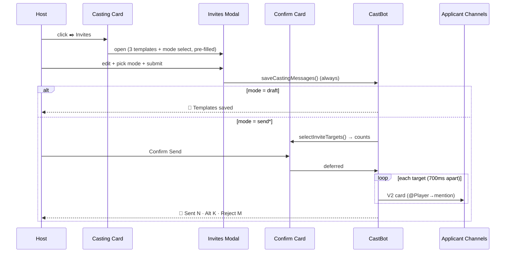

# 🎭 Casting Invites — Modal, Alternative Status & Bulk Messaging

> ⚠️ **EXTENDED 2026-07-09 (RaP 0902).** Since this doc: the on-card Invites button became **Bulk Invites** on
> the Marooning tab; a per-applicant **Send Invite** button opens a **single-applicant modal variant**
> (Send Offer/Decline/Alternate + **Update Status Only**); every send now stamps **`offerStatus`**; **Tentative
> was removed**. Current invite behaviour: [SeasonManager.md → Casting Invites](../03-features/SeasonManager.md#-casting-invites--bulk--single--status-only-rap-0906-extended-2026-07-09).

**Number:** 0906
**Date:** 2026-06-22
**Status:** ✅ Implemented + extended 2026-07-09 (see banner above); shipped to PROD
**Related:** [SeasonManager](../03-features/SeasonManager.md) (🏆 Casting tab) · [ComponentsV2](../standards/ComponentsV2.md) · [DiscordInteractionAPI](../standards/DiscordInteractionAPI.md) · [DiscordMessenger](../enablers/DiscordMessenger.md)
**Code:** `castRankingManager.js` (helpers + send), `app.js` (button → modal → confirm → send routing)

---

## 🤔 Problem (plain English)

After hosts rank applicants and set a casting status (🎬 Cast / 🗑️ Don't Cast / etc.), they still have to **manually DM/post the outcome** to every applicant — "congrats you're cast", "sorry, not this time". For a 40-person applicant pool that's tedious, error-prone, and inconsistent. The **✒️ Invites** button on the Casting card was a "coming soon" stub.

We want hosts to author three reusable message templates once, then have CastBot post the right message into each applicant's application channel (pinging them), driven by each applicant's casting status — with a safety confirmation before anything goes out.

A second need surfaced: a **new "Alternative" casting status** (offer a backup/alternate spot) as a first-class status alongside Cast/Tentative/Don't Cast.

## 📋 Trigger Prompt (full, unmodified)

> Lets create a modal for the Invites button, following @docs/standards/ComponentsV2.md standard in particular utilising labels `[pasted PM2 logs showing the casting_messages_… button firing as [✨ FACTORY], IMMEDIATE-NEW EPHEMERAL]`
>
> Create 3x Text Inputs with
> Casting Successful Message - clean up my text but something like "Message sent to players you have selected to Cast in their application. Insert @Player to tag each player in the message when it is sent in their channel." Sample message: @Pwincess Beau Congratulations! You have been selected for a spot in the cast of EpochORG 13!
>
> To accept this offer please confirm your preferred name, age, pronouns, and timezone.
>
> Additionally, if you would like a photo other than your pfp for your casting card, please send us it here AND please send a hex code for your name role color. We can't wait to have you! Please let us know of your acceptance and provide us this information before 09 May 2026 22:00
>
> Alternative / Backup Message - as above but when they are set to Don't Cast - follow the example as above - vibes are something like @Player we are sorry to inform you that we cannot offer you a spot on the cast at this time. Also add a new 'Alternative' casting status option to the existing string select and fully bring it into our data structure.
>
> However, if you are willing, we do want to offer you an alternate spot. Please let us know if you are able to accept!
>
> Unsuccessful: Don't Cast - think up something per above.
>
> Where player has been set to Still Deciding or Tentative, it shouldn't send them anything.
>
> Add a mandatory string select with label "What to do when you submit this?"
> 1 - Save as draft only (pls save the content under the server node for now, but consider future extensibility such as having a per-season set of messages for each).
> 2 - Send Successful, Unsuccessful and Alternate Messages Now - Sends it to each player / channel
> 3 = Send Successful Only 4 - Send Unsuccessful Only 5 - Send Alternative Only 6 - Send to currently selected player only. ultrathink come up with a ganssta plan, consider all interactions and use cases, dont forget @docs/standards/ComponentsV2.md @docs/standards/DiscordInteractionAPI.md etc and a RaP as well

*(Clarified in follow-up Q&A: Input 2 is the **Alternative** status message; Input 3 is **Don't Cast**. A confirmation step precedes sending. Messages are delivered as **Components V2 cards**.)*

## 💡 Design decisions

1. **Status → message mapping:** 🎬 Cast → *Successful* · 🔄 Alternative → *Alternative/Backup* · 🗑️ Don't Cast → *Unsuccessful*. ❓ Tentative & ❔ Still Deciding → **nothing**. (`CASTING_STATUS_TO_MESSAGE` in castRankingManager.js.)
2. **Confirmation before sending** (outward-facing + irreversible): modal submit with a "Send…" option shows an ephemeral summary card ("about to ping N Cast / M Reject / K Alt") with Confirm/Cancel. Draft-only saves immediately. Pattern: modal → `buildInvitesConfirm` → `casting_invites_confirm:…` button → deferred send.
3. **Components V2 cards** for the messages (accent green/amber/red by type). Trade-off: V2 can't carry `allowed_mentions`, so we **neutralize `@everyone`/`@here`** in host templates (`sanitizeTemplate`); blast radius is anyway one private app channel. `<@id>` still pings.
4. **Storage at the guild node now**, behind helpers that already take `configId` → trivial future move to per-season (`applicationConfigs[configId].castingMessages`). Key: `playerData[guildId].castingMessages = { successful, alternative, unsuccessful, updatedAt, updatedBy }`.
5. **`@Player` token** → `<@userId>` at send time (`renderInviteMessage`).
6. **Rate-limit-safe**: sequential send with ~700ms spacing; deferred interaction; per-channel try/catch so one failure doesn't abort the batch.

## 🔗 Flow

## 🆕 "Alternative" status rollout (every `castingStatus` site)

| Site | Change |
|---|---|
| `castRankingManager.js` isUndecided | include `'alternative'` so it isn't treated as undecided |
| `castRankingManager.js` casting select | 5th option `🔄 Alternative` (value `alternative`) |
| `castRankingManager.js` jump-select icon | `🔄` for alternative |
| `castRankingManager.js` Casting Summary `castGroups` + `statusSections` + count | new **🔄 ALTERNATE** bucket (else alts vanish) |
| `app.js` casting status display text | `🔄 Alternate` |
| `seasonTribePlannerMockup.js` sort rank + statusEmoji | alternative ranked after cast; `🔄` emoji |

`handleCastingStatus` is value-agnostic, so storing `'alternative'` needed no change.

## ⚠️ Trade-offs & future work

- **No "already invited" dedup (v1):** clicking Send twice sends twice. The confirmation step is the guard. *Future:* record `application.invitesSentAt[type]` and warn/skip on re-send.
- **Per-season templates:** stored at guild level now; helpers (`getCastingMessages`/`saveCastingMessages`) already take `configId` for a clean future move.
- **V2 + allowed_mentions:** can't restrict mentions on V2 messages; mitigated via `sanitizeTemplate` + private-channel blast radius.
- **Empty template:** a send mode skips any applicant whose template is blank (counted as "skipped — empty template").

## ✅ Tests

`tests/castingInvites.test.js` — `@Player` substitution, `@everyone` neutralization, status→type mapping, all six send-mode target selections (incl. tentative/undecided skipped), and the Alternate Casting Summary bucket.
