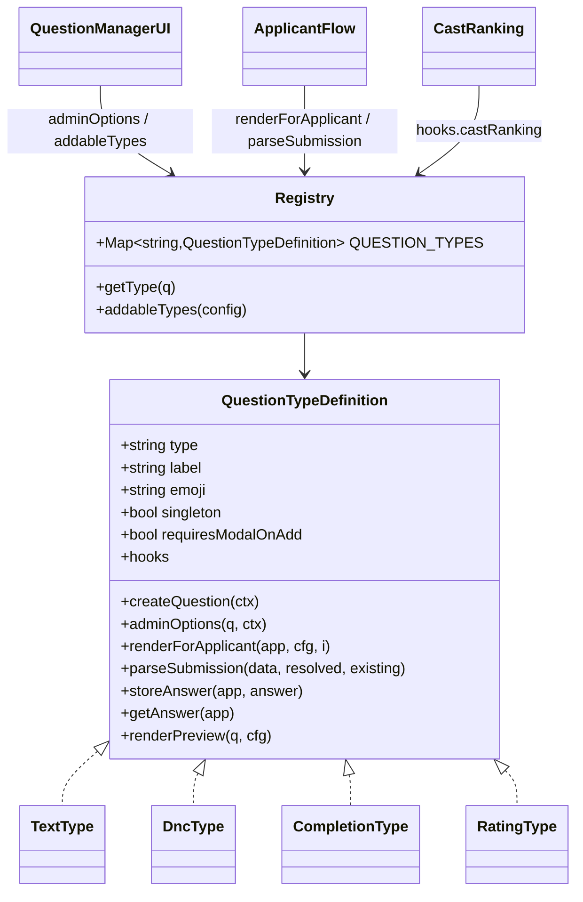
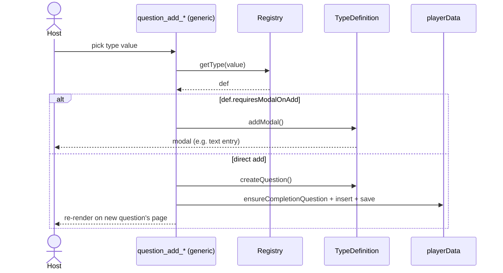

# Scalable Custom Question Types — Architecture Analysis

**Number:** 0907
**Date:** 2026-06-21
**Status:** 🟡 RaP / Design (not started)
**Related:** [DNC Overview](../03-features/DNCOverview.md) · [Season App Builder](../03-features/SeasonAppBuilder.md) · [DNC Structured RaP 0932](0932_20260324_DNCStructured_Analysis.md) · [ButtonHandlerFactory](../enablers/ButtonHandlerFactory.md)

---

## Trigger Prompt (verbatim)

> going to bed now will look into the dnc bug in the morning.. ,but in the meantime ultrathink thru this .. - whats a scalable architecture design that will allow for custom question types / components just like the DNC list, with the same style of context string select UI > add to questions

---

## 🤔 The Problem in Plain English

The Season Application question list supports a few question kinds: ordinary **text** questions, the special **Do Not Cast (DNC)** question, and the **completion** ("thank you") message. Each one is rendered to the applicant differently, managed by the host differently, and stored differently.

The DNC question was **bolted on as a special case**: there are `if (questionType === 'dnc')` branches scattered across at least five concerns — the "add question" select, the question-manager context select, the applicant-facing renderer, the modal-submit parser, the storage shape, and the Cast Ranking integration. Adding the *next* custom type (Accommodations, References, a rating scale, a video upload, a rules-agreement checkbox…) means repeating that scatter every time.

This is the exact tax flagged in project memory for trigger types: *"adding a new trigger type that behaves like button_modal requires updating 16+ places across 5 files; missing any causes silent bugs."* The DNC pagination/completion bug currently being chased (see Appendix A) is a symptom of the same disease — special-case logic (`convert last question to completion at render time`) interacting badly with another special case (DNC insertion).

**The ask:** a registry/plugin architecture so a new question type is *one self-contained module + one registration line*, with the established "context string-select → add to questions" UX falling out for free.

---

## 🏛️ How We Got Here (the organic-growth story)

1. **v1:** every question was a text question. `buildQuestionManagementUI` rendered a uniform select per question; the applicant saw a modal.
2. **completion:** a "thank you" screen was needed. Rather than a first-class concept, old seasons treated *the last question* as completion, and newer code injected a `questionType: 'completion'` — converting the last question **at render time, in memory** (the seed of Appendix A's bug).
3. **DNC:** a genuinely different shape (multi-entry, confidential, cross-applicant conflict detection). It was added as `questionType: 'dnc'` with bespoke branches everywhere, its own storage (`application.dncEntries[]`), and its own downstream consumer (Cast Ranking).

Each step was locally reasonable; collectively they produced a type system with no central definition — the "type" is an implicit contract spread across files.

---

## 📊 Current State (RED — the scatter)

| Concern | Where DNC special-cases live today | File |
|---|---|---|
| Add-select option | hardcoded `{value:'dnc'}` in the 2-option select | `app.js` ~331 (in `buildQuestionManagementUI`) |
| Add handler | dedicated `question_add_* && values[0]==='dnc'` branch | `app.js` ~11298 |
| Manager context select | `if (question.questionType === 'dnc')` → limited options | `app.js` ~278 |
| Applicant render | `if (question.questionType === 'dnc') return showDncQuestion(...)` | `app.js` ~531 |
| Applicant UI / modal | `buildDncQuestionUI`, `buildDncEntryModal`, `parseDncModalSubmit` | `dncManager.js` |
| Submission + storage | `app_dnc_*` handlers writing `application.dncEntries[]` | `app.js` ~26936, ~44159 |
| Downstream (Cast Ranking) | `findDncConflicts`, `buildDncWarnings`, `buildGlobalDncOverview` | `dncManager.js`, `castRankingManager.js` |

Seven touch-points for one type. A second custom type doubles it.

---

## 💡 Proposed Architecture — a Question-Type Registry (GREEN)

A **strategy/registry pattern** identical in spirit to `BUTTON_REGISTRY`, the Action outcome-type table, and `MenuBuilder` — idioms CastBot already uses. Each question type is a self-contained **`QuestionTypeDefinition`**; generic machinery dispatches to it.

### The interface

```js
// questionTypes/types/dnc.js  (one file per type)
export default {
  type: 'dnc',                       // persisted as question.questionType
  label: 'Do Not Cast',              // shown in the "add question" select
  description: 'Applicant lists people they will not play with',
  emoji: '🚷',

  // --- lifecycle flags ---
  singleton: true,                   // at most one per season (hide from add-select once present)
  addableByHost: true,               // appears in the add-select at all
  system: false,                     // completion/text are system types (special placement)
  requiresModalOnAdd: false,         // adding opens a modal first? (text:true, dnc:false)

  // --- factory ---
  createQuestion(ctx) { return { questionType: 'dnc' }; },   // the stored question object (id stamped by framework)

  // --- ADMIN side: the context string-select options in the question manager ---
  // Framework supplies generic Move Up/Down/Delete/divider; the type adds its own (e.g. text adds "Edit").
  adminOptions(question, ctx) {
    return [{ label: `${ctx.qLabel}. Do not cast list`, value: 'summary', emoji: '🚷', default: true }];
  },
  adminAction(action, question, ctx) { /* handle type-specific admin select values, if any */ },

  // --- APPLICANT side ---
  renderForApplicant(application, config, questionIndex) { /* returns Components V2 */ },
  parseSubmission(modalData, resolved, existing) { /* -> answer | null(delete) */ },
  storeAnswer(application, answer) { application.dncEntries = answer; },   // owns its storage key
  getAnswer(application) { return application.dncEntries || []; },
  isAnswered(application) { return (application.dncEntries||[]).length > 0; },

  // --- host preview ("see what the player sees") ---
  renderPreview(question, config) { /* ... */ },

  // --- OPTIONAL downstream hooks (decouples Cast Ranking from DNC) ---
  hooks: {
    castRanking: {
      perApplicant(app, allApps, playerData, guildId) { /* warnings + summary */ },
      overviewButton: { customId: cfg => `dnc_overview_${cfg}`, label: 'DNC', emoji: '🚷' },
    }
  }
};
```

### The registry

```js
// questionTypes/registry.js
import text from './types/text.js';
import dnc from './types/dnc.js';
import completion from './types/completion.js';

export const QUESTION_TYPES = new Map([text, dnc, completion].map(t => [t.type, t]));
export const getType = (q) => QUESTION_TYPES.get(q?.questionType || 'text'); // undefined === 'text'
export const addableTypes = (config) =>
  [...QUESTION_TYPES.values()].filter(t => t.addableByHost &&
    !(t.singleton && config.questions.some(q => q.questionType === t.type)));
```

### Generic machinery (replaces every scatter point)

- **Add-select** → built from `addableTypes(config)` (singleton + already-present filtering for free). One place. Replaces the hardcoded 2-option list.
- **Add handler** (one `question_add_*` handler) → `const def = getType({questionType: value})`; if `def.requiresModalOnAdd` open `def.addModal()`, else insert `def.createQuestion()` (framework stamps `id`, runs the shared `ensureCompletionQuestion` invariant, persists, navigates to the new question's page).
- **Manager render** → for each question, `getType(q).adminOptions(q, ctx)` + framework-appended Move/Delete. Replaces the `if dnc / else text` block.
- **Applicant render** → `getType(q).renderForApplicant(...)`. Replaces the `if dnc → showDncQuestion` route.
- **Submission router** → custom_ids namespaced `q_<type>_<action>_...`; one MODAL_SUBMIT/select router resolves `getType` and calls `parseSubmission` + `storeAnswer`. (Mind the 100-char custom_id limit — see memory `feedback_custom_id_limit`.)
- **Cast Ranking** → iterate `QUESTION_TYPES` for `hooks.castRanking` instead of importing DNC directly. DNC's overview becomes one registered "applicant consideration"; the door the DNC doc already left open for "Considerations/Insights".

### Class diagram



### Add-flow sequence



---

## 🗄️ Storage: converge on a generic answer map (phased)

Today answers are scattered (`dncEntries[]`, text answers in channel messages/threads, etc.). Recommend a forward-looking generic shape **owned by each type def** so the framework never hardcodes a key:

```
playerData[guildId].applications[channelId].answers[questionId] = { type, value }
```

- New types use `answers[questionId]` via `storeAnswer/getAnswer`.
- DNC keeps writing `dncEntries[]` inside its own `storeAnswer` (zero migration), or we migrate it behind the def later.
- `isAnswered()` per type powers progress/validation uniformly.

This keeps the blast radius inside each def and avoids a big-bang migration.

---

## 🔀 Migration Plan (incremental, low-risk)

1. **Introduce the registry + interface** with THREE built-in defs that *exactly replicate today's behavior*: `text` (undefined `questionType`), `dnc`, `completion`. No behavior change — pure extraction.
2. **Route the four generic machinery points** (add-select, add handler, manager render, applicant render) through the registry, deleting the `if/else questionType` chains as each is covered. Tests pin parity.
3. **Decouple Cast Ranking** via `hooks.castRanking`; DNC's existing functions move behind its def.
4. **Only then** add a NEW type (e.g. Rating) as the proof the architecture pays off — it should touch *only* its own module + the registry line.
5. (Optional later) migrate DNC storage to the generic `answers[]` map.

Each step is independently shippable and reversible.

---

## 🌱 What this unlocks (concrete new types — each ~1 file)

| Type | Applicant UI | Storage | Downstream |
|---|---|---|---|
| **Rating scale** (1–10) | string select | `answers[qId]` | sortable in Cast Ranking |
| **Multi-select** (pick options) | string select (≤25) | `answers[qId]` | filter/segment applicants |
| **References / Want-to-play** | user-select entries (DNC's positive twin) | `answers[qId]` | "alliance map" overview |
| **Availability** | timezone + schedule modal | `answers[qId]` | scheduling view |
| **Intro video / file** | Components V2 File Upload (type 19) | attachment refs | review on card |
| **Rules agreement** | checkbox (type 23) | bool | gate completion |

All of these are the same "context string-select → add to questions" UX the host already knows — they just register a def.

---

## ⚠️ Risks & Considerations

- **custom_id 100-char limit** (memory `feedback_custom_id_limit`): namespaced `q_<type>_<action>_<configId>_<idx>` must be budgeted against worst-case snowflakes. Prefer short type slugs + question *index*, not full ids, in custom_ids.
- **Component-40 limit**: each type's applicant + admin UI must self-validate with `validateComponentLimit`.
- **Completion is special**: model it as a `system: true` singleton type that's always last and auto-injected — but its placement/normalization (`ensureCompletionQuestion`) stays a framework invariant, not a per-type concern. (Fixing Appendix A first removes a landmine before extraction.)
- **Backward-compat**: `questionType: undefined` MUST map to `text`; legacy `dncList` string + `dncEntries[]` both keep working via the DNC def's `getAnswer`.
- **Don't regress Cast Ranking**: parity tests around `findDncConflicts`/overview before moving them behind a hook.
- **Modal label standard** (memory `feedback_modal_labels`): any type opening a modal uses Label (type 18), not ActionRow+TextInput.

---

## Appendix A — DNC/completion bug status (for morning-you)

**Symptom:** adding a DNC to season `config_1752859645154` (guild 1331657596087566398) doesn't surface as a proper question; the completion message gets wiped.

**Confirmed from prod data (read-only):** 9 questions, `completion: 0`, `dnc: 1` (DNC already at index 6; trailing test questions `asdas`, `tes` are plain). So re-clicking "add DNC" is a correct no-op (dedup) — the season is simply in a **no-completion** state.

**The paradox:** `ensureCompletionQuestion` is deployed (app.js:192, called 227/11312/44156) and a **clone-test against the real data converts `tes`→completion and returns `changed=true`** — the algorithm is correct. Yet the DNC-click's save left `completion: 0` on disk. So the failure is in **persistence/runtime state, not the logic**.

**Prime suspect:** `storage.js:11` — the so-called `requestCache` is a **module-global Map, not per-request**. Concurrent interactions share the same mutable `playerData` object, and the **render-time `ensureCompletionQuestion` (app.js:227) mutates that shared object without saving**. A plausible clobber: a render-only handler mutates the shared object in memory while another path persists a pre-conversion snapshot, so the completion conversion never reaches disk.

**Recommended morning step (empirical, not more log-reading):** add temp logging of `completionChanged` + the questions' `questionType[]` immediately before/after `savePlayerData` in the DNC handler, reproduce on that config, and watch — OR reproduce on DEV by copying that config's `questions` array. Then decide between (a) saving the render-time normalization, (b) making the cache truly request-scoped, or (c) removing render-time mutation entirely and normalizing only in write paths. The season will also need a one-off **data repair** (restore a completion question, prune the `asdas`/`tes` test garbage) regardless of the code fix.

**Note:** the page-jump fix (RaP-less, commits `3df14b23`→`dff7db1a`) is correct *given* a persisted completion; it just can't compensate for the completion never persisting.
