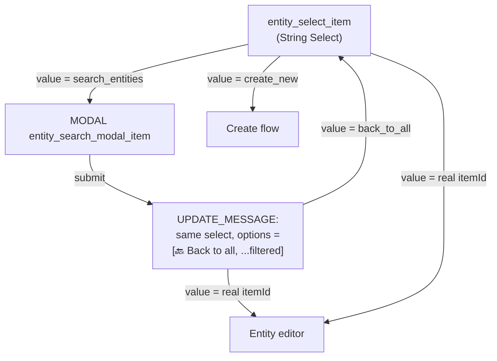
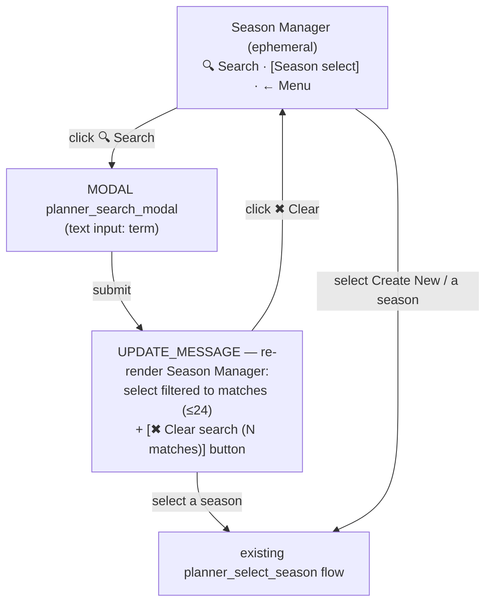

# Season Selector Search — Architecture Scoping (and why entity search keeps biting us)

**Status:** Search SHIPPED (2026-06-15). Decision: **select-option UX (Safari-consistent) + reuse the shared `entity_search_modal_` handler** — Reece chose consistency + reuse over the standalone-button option. Delete is the next phase (scoping its data-dependency map separately).
**Date:** 2026-06-15
**Author:** Reece + Claude
**Related:** [Season Hub Unification RaP 0910](0910_20260615_SeasonHubUnification_Analysis.md) · [entityManager.js](../../entityManager.js) · [seasonSelector.js](../../seasonSelector.js)

---

## Trigger Prompt (verbatim, unmodified)

> evaluate how we do search for items, stores etc using @entityManager.js , grep for 'search' and conduct a wide architectural scoping exercise to work out how we can enable a 'search' for the season selector (currently capped at 24 or so string select options + 1 entry for create new season, nobody has hit the limit yet but it will be soon; we need an atomic delete option + ability to do it in the UI, but before that I'd like to implement search). Carefully analyze the search UI interaction flow between screens for options like item select as we've had teething issues with search each time we've implemented it. [+ production logs of an item search] ultrathink

---

## 🤔 Plain-English Problem

A Discord **String Select can hold at most 25 options**. The season selector spends 1 on "Create New Season", leaving **24 season slots**. Past that it truncates and shows a dead-end "📦 More Seasons Available" option. Nobody's hit it yet, but a busy server will. We want **search** so you can find any season regardless of count — and we want to do it *without* re-triggering the interaction-flow bugs that have plagued every previous search implementation.

The Safari item/store search already solves the "too many options" problem. So the real work here isn't inventing search — it's (a) understanding *why* the existing pattern is fragile, and (b) choosing a flow for seasons that doesn't repeat those mistakes.

## 🏛️ How Safari Search Works Today (the proven-but-fragile pattern)

Search is implemented as a **magic option inside the select itself**.



Key facts (with cites):
- **Builder** `createEntitySelector()` (`entityManagementUI.js:256–351`): adds a `search_entities` option when there are **>10** entities; caps total options at 25 and even preserves the currently-selected row when truncating (`:315–341`).
- **Modal**: `entity_search_modal_<type>` — the entity **type is encoded in the custom_id** and recovered on submit via `custom_id.replace('entity_search_modal_', '')` (`app.js:~49949`).
- **Submit** (`app.js:~49943–50285`): filters via `searchEntities()` (`entityManager.js:424–445` — matches `name`/`label`, `description`, `metadata.tags`), caps results at **24**, **unshifts a `🔙 Back to all` option**, and **reuses the same `entity_select_<type>` custom_id** so the next selection routes back to the same handler. Returns `UPDATE_MESSAGE` with `flags: 1<<15`.
- **State**: fully **stateless** — the search term is *not* persisted; filtered options carry real entity IDs; `back_to_all` just re-renders the full list.

`searchEntities()` itself is clean and reusable:
```js
// entityManager.js:424
export async function searchEntities(guildId, entityType, searchTerm) { /* name/desc/tags contains() */ }
```

## ⚠️ Why it keeps biting us — the fragile parts (RED)

These are the recurring teething issues, and each maps to a concrete mitigation:

| # | Fragility | Where it hurts | Mitigation for seasons |
|---|---|---|---|
| **F1** | **Control values mixed with data values** in one select (`search_entities`, `back_to_all`, `view_more_seasons`, `create_new_*` all live alongside real IDs). The handler must check every sentinel *before* treating the value as an ID; miss one and you "edit" a season called `back_to_all`. | `entity_select_*` handler disambiguation | **Make search a BUTTON, not a select option.** Control actions become buttons; the select only ever holds real IDs + the create sentinel. Eliminates the whole class. |
| **F2** | **Modal must come from a non-deferred interaction.** If the handler defers first, `return {type:9}` fails ("interaction failed"). | select/button → modal | Use `requiresModal: true` factory (the season handler already does this for create). Never defer the search trigger. |
| **F3** | **`UPDATE_MESSAGE` + `flags`.** Safari sends `flags: 1<<15` on UPDATE_MESSAGE via raw `res.send`. CLAUDE.md says UPDATE_MESSAGE must carry **no flags**; it survives only because the message was already V2. This is a latent trap. | modal submit re-render | Use **ButtonHandlerFactory**, which strips flags for UPDATE_MESSAGE automatically. Never hand-set flags. |
| **F4** | **25-option ceiling still applies to results.** ≥24 matches → Safari shows a "refine your search" dead-end. | result render | Cap at 24, render a `-# Showing 24 of N — refine search` note. Acceptable; rare. |
| **F5** | **custom_id 100-char limit.** Encoding the search term into a custom_id (for "search again"/pagination) risks silent rejection on long/unicode terms. | any term-in-custom_id scheme | **Keep it stateless.** The term lives only in the modal-submit payload for one render. No term in any custom_id. |
| **F6** | **"Search" as a dropdown option is unintuitive** — you don't "select" a search. | UX | Button reads `🔍 Search` and is obviously an action. |

The throughline: **most of the pain comes from overloading the select with control values and from manual response/flag handling.** Both are avoidable.

## 💡 Recommended Design for Season Search (GREEN)

**Search as a dedicated button on the Season Manager screen — stateless, factory-driven.**



Why this is the robust shape:
- **Select holds only real configIds + the create sentinel** → F1 gone. (configIds are `config_<ts>_<uid>` — they can never collide with a sentinel anyway.)
- **Button → modal via `requiresModal`** → F2 handled, mirrors the proven create path (`app.js:8350` returns `{type:9, data: buildSeasonPlannerModal()}`).
- **Factory UPDATE_MESSAGE** on the modal submit → F3 gone.
- **Stateless**: term used for exactly one render; filtered options carry real IDs; Clear re-renders without a term → F5 gone, no custom_id bloat.
- **Ephemeral inherited**: the Season Manager is reached via `/menu` (ephemeral); every step is UPDATE_MESSAGE so it stays ephemeral and in-place.

### Concrete touch points
1. **`createSeasonSelector(guildId, opts)`** (`seasonSelector.js:77`): add `searchTerm = null`. When set, filter `seasonList` by `seasonName` (+ `explanatoryText`) `.toLowerCase().includes(term)` before the 24-cap. Add a `-#` "Showing X of Y" affordance when truncated. (Mirrors `searchEntities` semantics; seasons live in `applicationConfigs`, not safariContent, so it's a sibling filter, not a reuse of `searchEntities`.)
2. **`buildPlannerSelector(guildId, { searchTerm } = {})`** (`seasonPlanner.js:576`): thread `searchTerm` to the selector; the container's button row gains `🔍 Search` (no term) or `✖ Clear search (N)` (when a term is active). Header shows the active term: `-# 🔍 "term" — N matches`.
3. **`planner_search` button handler** (app.js): `requiresModal: true` → returns `{ type: 9, data: buildSeasonSearchModal() }`.
4. **`planner_search_modal` submit** (app.js): read term → `buildPlannerSelector(guildId, { searchTerm })` → factory `updateMessage: true`. Empty/no matches → same screen with a "No seasons match" note + Clear.
5. **`planner_search_clear` button**: `updateMessage: true` → `buildPlannerSelector(guildId)`.
6. Repurpose the dead-end `view_more_seasons` overflow hint → `description: 'Use 🔍 Search to find the other N seasons'`.

### What NOT to do
- Don't encode the term in any custom_id (F5).
- Don't hand-set `flags` on UPDATE_MESSAGE (F3) — let the factory strip them.
- Don't add `back_to_all`/`search` as *select options* (F1) — buttons only.
- Don't retrofit Safari entity search in this pass (separate, larger change). This RaP documents *why* the Safari pattern is fragile so a future pass can migrate it to the button shape.

## 🔭 Phase 2 (noted, not now): Atomic delete + UI delete

The user flagged this as the follow-on. Findings:
- A `season_delete_*` handler with a confirmation step already exists (`app.js:~11486`), and it counts applications before deleting. But after the Season Hub unification it isn't wired into the Season Manager flow.
- **Atomic**: deletion must go through `atomicSave()` (per Data File Standards) — verify the delete path saves atomically and is guarded by the confirm.
- **UI**: surface a per-season "🗑 Delete" affordance from the Season Manager (likely on the selected-season screen, not the selector), behind the existing confirm. Search makes delete *findable*; delete makes the list *manageable* — they pair.

## Risk
- **Low.** Additive: one filter param + one button + one modal + two handlers. No schema change, no data migration. Ephemeral, in-place, reversible. The only behavioral change to existing flows is the selector growing a button row.

## Decision & what shipped (select-option + reuse)

Chose **Safari-consistent select-option UX** and **reused the shared `entity_search_modal_` handler** rather than the standalone button. The handler's result-rendering half (app.js result select + container build) was already generic; only the data-fetch `switch` was entity-specific. So:

- **`createSeasonSelector`** (`seasonSelector.js`): added `includeSearch` → pushes a `🔍 Search seasons...` (`search_entities`) option when >10 seasons, with capacity-aware truncation (control slots + overflow always ≤ 25 options). Extracted **`seasonConfigIndicators()`** so the selector *and* search results share one indicator function.
- **`buildPlannerSelector`**: `includeSearch: true`; decorate via the shared indicator helper.
- **`buildSeasonSearchModal()`** (`seasonPlanner.js`): Label-based modal, custom_id `entity_search_modal_seasons`.
- **`planner_select_season`** handler: `search_entities` → opens the modal; `back_to_all` → re-renders the full Season Manager (UPDATE_MESSAGE).
- **Shared `entity_search_modal_` handler** (app.js): added a `case 'seasons'` (filters `applicationConfigs` by name/explanatoryText), a **robust term parser** (Label *or* legacy ActionRow), and parametrized the result select custom_id → `planner_select_season`, the too-many "back to menu" → `reeces_season_planner_mockup`, and pluralization (`entityDisplay`) so seasons ride the identical flow + sentinels (`search_entities` / `back_to_all`) as items/stores.

Mitigations applied: F2 (modal from `requiresModal` non-deferred ✓), F4 (24-cap + "refine" ✓), F5 (stateless — term never in a custom_id ✓). **F3 caveat:** the reused handler sends `UPDATE_MESSAGE` with `flags: 1<<15` (raw `res.send`, as Safari does) — kept for consistency since it works empirically on the already-V2 ephemeral message; flagged here as the one spot diverging from CLAUDE.md's "no flags on UPDATE_MESSAGE". F1/F6 remain inherent to the select-option choice (accepted for consistency).

**Tests:** capacity math proven to never exceed 25 options (with/without search, with/without overflow); indicator logic covered.
