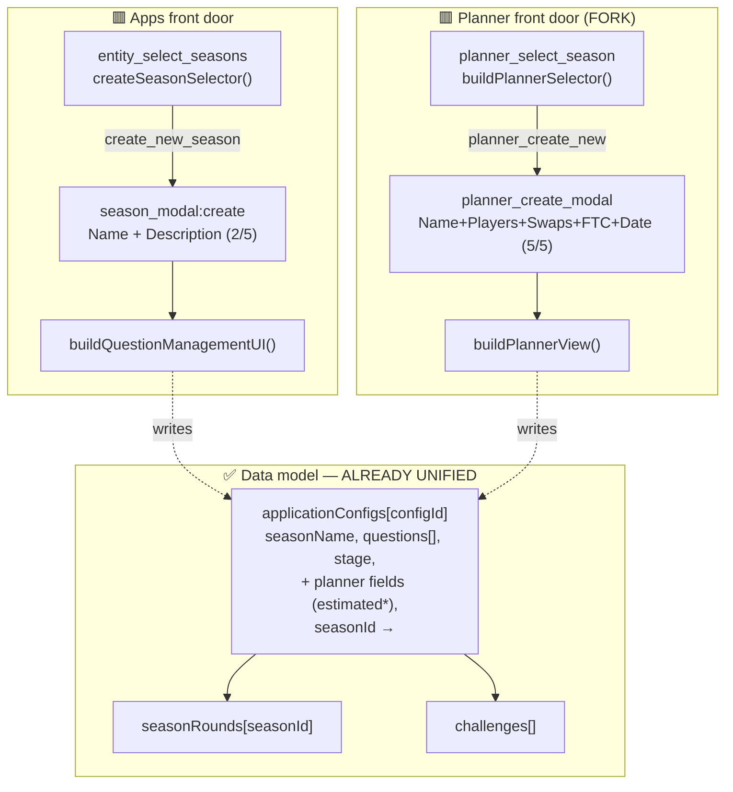
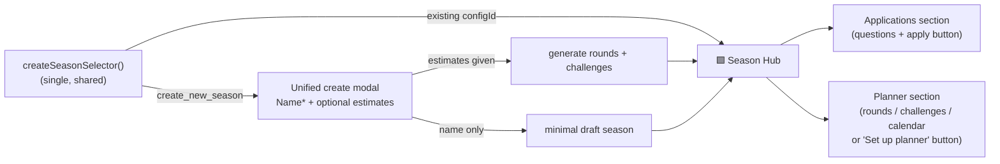

# Season Hub Unification — Collapsing Apps + Planner into One Season Management Interface

**Status:** SHIPPED (2026-06-15/16) — all three layers. Layer A (unified selector) + Layer B (unified create/edit modal) + Layer C (the Season Hub: one `season_manager` entry, the four-view active-tab nav via `buildSeasonNavRow`, search, and Delete Mode). Documented as a feature in [SeasonManager](../03-features/SeasonManager.md).
**Date:** 2026-06-15
**Author:** Reece + Claude
**Related:** [Season Manager feature](../03-features/SeasonManager.md) · [Season Planner RaP 0947](0947_20260315_SeasonPlanner_Analysis.md) · [Season Apps String Select RaP 0939](0939_20260320_SeasonAppsStringSelect_Analysis.md) · [SeasonAppBuilder](../03-features/SeasonAppBuilder.md) · [SeasonLifecycle](../concepts/SurvivorContext.md)

---

## Trigger Prompt (verbatim, unmodified)

> Review @docs/standards/ComponentsV2.md
> 1. Describe the Season Apps / Applications and Season Planner features
> 2. Perform an architectural analysis of the 2x types of Season Selector String Selects, and in particular the two type of create new Season modals.  [production logs pasted: `planner_select_season` → `planner_create_modal` creating "Season Created from Season Planner" with 17 rounds and 16 challenges; `entity_select_seasons` → `season_modal:create` creating "Season created from apps"]
> 3. I want to rationalize / unify these into one, with the eventual goal of unifying Season Apps and Season Planner into a Season Management interface, with progressive evolution of a 'Season Hub' interface as the user inputs progressively more details (e.g., we need to lower the 'mandatory' requirements of the Create Season Modal such as the mandatory planner fields. The Season description field put us over the 5-component per modal limitation max and is kinda redundant so i'm thinking of killing it
>
> ultrathink

**Decision captured this session:** the unified create modal keeps **Season Name (required) + the 4 planner estimates as *optional*** (5 components), and **kills the Season Description field**. Rounds auto-generate at creation *only if* estimates are supplied; otherwise a minimal `draft` season is created and the planner is set up later in the Hub.

---

## 🤔 Plain-English Problem

CastBot has two features that both say "create a season," but they were built as two parallel stacks:

- **Season Applications** — questions + an apply button (the production casting flow).
- **Season Planner** — estimated player counts that auto-generate a round/challenge skeleton (newer, still a mockup entry in Reece's Stuff).

They feel like two different things, but **under the hood they write to the same object** (`applicationConfigs[configId]`). The duplication is entirely in the *front door*: two selectors, two create modals, two post-create screens. Each create path seeds different fields, so a season born in one path looks half-broken to the other.

The goal: **one selector → one lean create modal → one "Season Hub"** that progressively reveals Applications and Planner capability as the admin fills in more detail.

## 🏛️ Historical Context (the organic-growth story)

`seasonSelector.js` (`createSeasonSelector()`) was deliberately built as *the* reusable season picker (documented in SurvivorContext.md). When the Planner was prototyped (RaP 0947, "parallel build — don't touch the Apps flow"), it **forked** the selector into `buildPlannerSelector()` and added a *second* create modal rather than extend the existing one. That was the right call for an isolated prototype — but it left two of everything. This RaP is the "merge back" step RaP 0947 anticipated (its Phase 3 "Production Menu merge").

## 📊 Current State (RED = duplicated/divergent)



### Selectors — side by side

| | **Apps** | **Planner** |
|---|---|---|
| custom_id | `entity_select_seasons` | `planner_select_season` |
| Builder | `createSeasonSelector()` `seasonSelector.js:70` (intended shared) | `buildPlannerSelector()` `seasonPlanner.js:568` (**fork**) |
| Reads | `applicationConfigs` | `applicationConfigs` (same source) |
| "Create" value | `create_new_season` | `planner_create_new` |
| Per-row desc | `explanatoryText` | `📅 Planner configured` / `⚠️ Needs setup` |
| Routing | EntityEditFramework `entity_select_*` | dedicated handler `app.js:8337` |

Only real difference: the description decorator. Should be a **parameter**, not a fork.

### Create modals — side by side

| | `season_modal:create` (Apps) `app.js:28584` | `planner_create_modal` (Planner) `seasonPlanner.js:242` |
|---|---|---|
| Title | "Manage Season Details" | "Create New Season" |
| Fields | Name (req) · **Description (opt, paragraph)** | Name · Est Players · Est Swaps · Est FTC · Start Date (all **req**) |
| Count | 2 / 5 | **5 / 5 (ceiling)** |
| On submit | `stage:'draft'`, `questions:[2 defaults]`, `explanatoryText=description` → `buildQuestionManagementUI` | `stage:'planning'`, `questions:[]`, planner fields + generate `seasonRounds` + `challenges` → `buildPlannerView` |

**The "description over the limit" clarification:** the Apps modal's description is harmless alone (2/5). The 5-component pain belongs to the **Planner** modal — it already spends all 5 slots, so a *unified* modal carrying Name + estimates + description = 6 → Discord rejects. Hence killing description is what makes a single 5-field unified modal legal.

### The state-divergence bug

One object, two creators, two inconsistent initial states:
- Apps-created → no planner fields → Planner selector flags `⚠️ Needs setup`, forces the 5-field modal.
- Planner-created → `questions: []` → Apps question UI shows an empty season.

## 💡 Solution — Progressive Season Hub

Because the data model is already one object, **no migration is required.** This is a UI/flow consolidation (safe — avoids the cache/data-loss risk class entirely). Three layers, each independently shippable:

### A. One selector
Delete `buildPlannerSelector()`. Make the Planner call `createSeasonSelector()` with a `decorate` callback for the status column and the shared `create_new_season` sentinel. Removes the fork + duplicate create value.

### B. One lean create modal (agreed design)
Single modal replacing both:

```
Create New Season
─────────────────
Season Name*       [____________]   required
Est. Players       [__]             optional
Est. Swaps         [_]              optional
Est. FTC           [_]              optional
Start Date         [________]       optional
(Season Description — REMOVED)
```

- **Description killed** — redundant; `explanatoryText` is really the *apply-button* blurb and belongs in app-button setup, not season birth.
- **Estimates optional** — `validatePlannerFields()` must tolerate missing values:
  - all estimates present → generate `seasonRounds` + `challenges` at creation (today's planner behavior).
  - estimates blank → minimal `draft` season, no rounds; Hub offers "Set up planner" later.
- **Questions seeding** — pick one consistent rule (recommend: seed the 2 Apps defaults always, so every season is application-ready; Planner no longer creates `questions:[]` empties). Decide in implementation.

### C. One Season Hub
Selecting any season opens a Hub with progressively-revealed sections:
- Always: name, stage, rename/delete.
- **Applications** section → `buildQuestionManagementUI` content (questions + apply-button setup).
- **Planner** section → if estimates unset: a single "Set up planner" button (reuses the existing 5-field setup modal, now reached *here*); once set: `buildPlannerView` content (rounds/challenges/calendar).

`season_management_menu`, the question UI, and the planner view become **three sections of one Hub**, not three entry points.



## ⚠️ Risk & Sequencing

- **Data risk: low.** No schema change; both paths already target `applicationConfigs[configId]`.
- **Order:** A (selector merge) → B (modal merge) → C (Hub). Each is shippable alone; A and B are small and reversible.
- **Watch:** the optional-estimates branch in `validatePlannerFields` and round-generation (don't generate on partial input — treat "any blank" as "skip generation, stay draft"). Add unit tests for: name-only create, full-estimates create, partial-estimates create.
- **Touch points to update** (from grep): `seasonSelector.js`, `seasonPlanner.js` (`buildPlannerSelector`, `buildSeasonPlannerModal`, `validatePlannerFields`, `createPlannerSeason`), `app.js` handlers `entity_select_seasons` (28584), `planner_select_season` (8337), `planner_create_modal` submit (40551), `season_modal:create` submit (43702), and the Reece's-Stuff mockup entry (8300).
- **Don't change:** the underlying `applicationConfigs` / `seasonRounds` / `challenges` schemas. This is front-door only.

## What NOT to do
- Don't migrate or rename `applicationConfigs` (legacy name, but load-bearing — separate future refactor).
- Don't generate rounds from partial estimates.
- Don't keep two "create new" sentinel values once the selector is merged.
