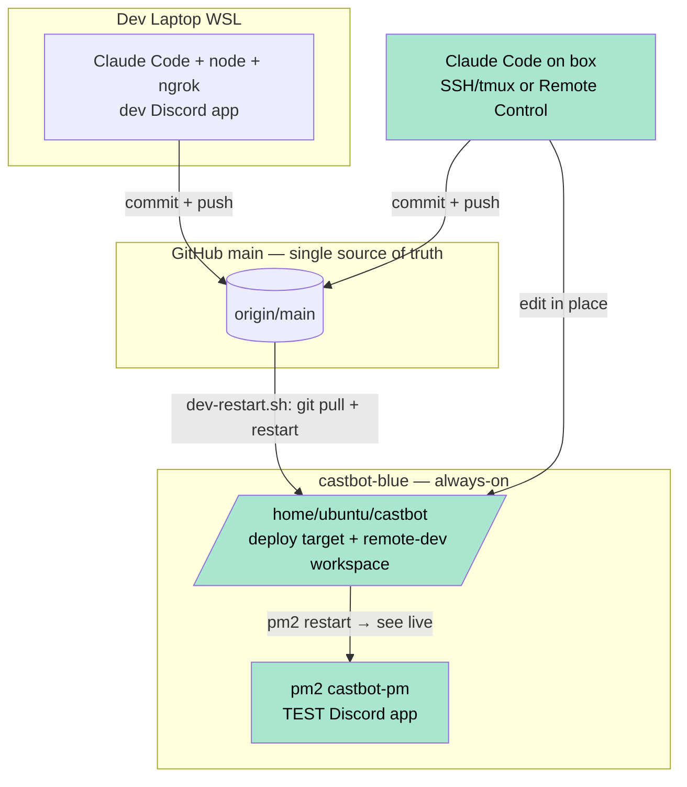

# 🛰️ Remote Dev on the Test Box (castbot-blue) — Always-On Claude Code + Moai Fix

**Status:** 🟡 In progress — Phase 0 done (CLI installed), auth + workflow pending
**Date:** 2026-06-14
**Type:** Infrastructure / Developer Workflow
**Related:** [TestInstanceBlueGreen](../03-features/TestInstanceBlueGreen.md) · [RaP 0915 — Memory Leak OOM](0915_20260603_MemoryLeakOOM_Analysis.md) · [InfrastructureArchitecture](../infrastructure-security/InfrastructureArchitecture.md)

---

## 🤔 The Problem in Plain English

Two things converged into one root cause:

1. **Moai is broken on the test box.** The in-Discord Moai advisor shells out to the `claude` CLI (`app.js:39659`, `spawn('claude', ['--print', '-p', fullPrompt], …)`). On the test box that binary didn't exist → `spawn claude ENOENT`. It only ever worked on the dev laptop because the laptop has `claude` installed + authenticated.

2. **Reece wants to vibe-code from anywhere.** He went out, wanted to code, but was tethered to the dev laptop (the only machine with a working dev environment). The always-on test box (`castbot-blue`) is the natural host for a remote Claude Code session he can reach from a phone or a borrowed laptop.

**Both are the same task:** get `claude` installed and authenticated on `castbot-blue`. Do it once and Moai works *and* the box becomes a remote dev environment.

---

## 🏛️ Why It Was Like This (the organic-growth story)

The test box was stood up (RaP 0914, 2026-06-12) as a **deployment target and ops console**, not a developer workstation. Its job was to *receive* code (`git pull` + `pm2 restart`) and *watch prod* (ProdWatchdog). Nobody installed a dev toolchain because nobody was supposed to *write* code there — code flows in from the laptop via GitHub. Moai's `claude` dependency was a laptop-only assumption baked into a feature that ships in the shared codebase everywhere.

So the box has everything to *run* CastBot and nothing to *develop* it. This RaP is about deciding whether — and how — to give it a development role without breaking its deployment-target role.

---

## 🔍 Findings

### Moai's claude invocation (`app.js:39659`)
```javascript
const child = spawn('claude', ['--print', '-p', fullPrompt], {
  cwd: process.cwd(),
  env: { ...process.env, HOME: process.env.HOME || '/home/reece' },
  stdio: ['pipe', 'pipe', 'pipe']
});
```
- Binary `'claude'` resolved via PATH (no full path) → needs `claude` on the PM2 process's PATH.
- Reads credentials from `~/.claude/.credentials.json` (HOME-based) — so an interactive login as the `ubuntu` user makes Moai work with **no env var and no code change**.

### Test box state (2026-06-14)
| | castbot-blue |
|---|---|
| RAM | 1.9 GB total, ~1.3 GB available; bot 162 MB |
| **Swap** | **0 B — none** ⚠️ |
| Disk | 58 GB, 7% used |
| `tmux` / `screen` | ✅ installed |
| `mosh` / `tailscale` / `code` | ❌ not installed |
| `claude` | ✅ **2.1.177 installed `/usr/bin/claude` (Phase 0, this RaP)** |
| Repo `/home/ubuntu/castbot` | clean, synced to origin/main |

### Claude Code auth facts (verified against code.claude.com docs, 2026-06)
- **Headless login needs no browser *on the box*.** Run `claude`, press `c` to copy the URL, open it on any device, authorize, paste the code back into the SSH session.
- **Interactive `/login` vs `setup-token`:**
  - Interactive login → creds in `~/.claude/.credentials.json` (0600), **auto-refreshes**, **supports Remote Control**.
  - `setup-token` → 1-year `CLAUDE_CODE_OAUTH_TOKEN` env var, **no refresh**, **inference-only (no Remote Control)**.
- **Subscription (Pro/Max) is sufficient — no API key, no API billing.**
- **Decision:** use **interactive headless login** — auto-refresh (no yearly cliff), Moai reads the creds file with zero env plumbing, and it unlocks Remote Control.

---

## 💡 The One Real Architectural Decision — Working-Copy Model

`/home/ubuntu/castbot` is the **TEST deploy target**. The laptop's `dev-restart.sh` SSHes in and `git pull`s it. If Claude Code also edits that same folder, the pull and the uncommitted edits collide. **Git is the sync layer; commit-before-switch is the discipline that makes it safe.**



| Model | How | Trade-off | Verdict |
|---|---|---|---|
| **In-place** | Edit the deploy-target repo directly; `pm2 restart castbot-pm` to see it on the real TEST bot; commit+push from the box | Couples remote-dev to the deploy target. Risk **only** if the laptop runs `dev-restart.sh` while the box has uncommitted edits — won't happen for a solo dev physically at one machine. | ✅ **Chosen** |
| Separate clone | `git clone` → `/home/ubuntu/castbot-dev` workbench; deploy into the target via normal pull+restart | Cleaner, but seeing it live needs a 2nd node + 2nd Discord app + tunnel. Heavier. | ❌ over-built for now |

**Discipline:** *commit + push before switching machines.* Nothing auto-pulls the box on a schedule — pulls happen only when the laptop's `dev-restart.sh` fires — so box-side work is safe until you're back at the laptop. The WSL dev env is **not** retired; both coexist through GitHub.

**Recommended guard (small, deferred):** make the box-side `git pull` in the deploy path **abort loudly or auto-stash** on a dirty tree, so a forgotten commit can never silently clobber in-progress box work. This is the only "context-aware script" change worth making — not a redesign.

**Push-side collision (observed, not just theoretical):** the pull guard above protects the box *receiving* a clobber. The *other* half of the same problem is on the **commit/push side** — `dev-restart.sh:39` runs `git add .`, which stages the **entire** working tree. When two agent/Claude sessions share one tree (or the box has unrelated uncommitted work), one session's `dev-restart.sh` bundles the **other** session's edits into its commit and pushes them. This bit us repeatedly during the Season Manager work (edits appeared "lost" — they'd been swept into a sibling agent's commit). Mitigation: when a concurrent session is possible, stage only your own files (`git add <file> …`) and commit manually before letting `dev-restart.sh` run. A warning comment now sits above the `git add .` line.

---

## 🛰️ Remote Access Options (how Reece reaches the box)

| Approach | Runs on | Setup | Best for |
|---|---|---|---|
| **SSH + tmux** | the box | already installed | works today; cramped on a phone |
| **Claude Code Remote Control** (`claude remote-control`) | the box | needs interactive (non-token) login | **"vibe code from my phone"** — real UI via claude.ai / mobile app |
| **mosh** | the box | `apt install mosh` + open UDP 60000–61000 in Lightsail firewall | roaming-resilient mobile SSH |
| **Tailscale** | n/a (access layer) | install on box + device | private SSH without public exposure (security upgrade) |
| **VS Code Remote-SSH** | the box | VS Code + extension | full IDE from a real laptop |
| **Claude Code on Web** (claude.ai/code) | Anthropic cloud | none | pure code-writing; **can't** see live bot or restart PM2 |

---

## ⚠️ Risk Assessment

1. **No swap + ~1.3 GB headroom, and this box runs the ProdWatchdog.** A heavy Claude session (subagents, `npm test`, builds) could OOM the box with no cushion — and that would kill the *prod liveness monitor*. **Mitigation: add a 2–4 GB swapfile before serious use.**
2. **Long-lived Claude credential on an internet-facing box.** `~/.claude/.credentials.json` (0600). Same trust tier as the prod-remediate key already there. An agent on the box can reach `/home/ubuntu/.ssh/prod-remediate-key` → could trigger a prod restart, but forced-command bounds the blast radius to the remediation script. Tailscale (no public SSH) is sensible hardening.
3. **Deploy clobber** — mitigated by commit-before-switch + the optional dirty-tree guard above.

---

## ✅ Phased Plan

- **Phase 0 — Prereqs (DONE 2026-06-15):** `sudo npm i -g @anthropic-ai/claude-code` → `claude` 2.1.177 at `/usr/bin/claude`; interactive headless login complete → **Moai works** + Remote Control confirmed.
- **Phase 1 — Basic remote dev (DONE):** `ssh castbot-blue` → `tmux attach -t vibe` → `claude` in `/home/ubuntu/castbot`.
- **Phase 2 — Mobile UX:** Remote Control confirmed working. *Optional later:* `mosh` + Tailscale.
- **Phase 3 — Hardening:**
  - ✅ **Swapfile (2026-06-15):** 2 GB `/swapfile`, persistent in `/etc/fstab`, `vm.swappiness=10` (`/etc/sysctl.d/99-swappiness.conf`).
  - ✅ **`box-restart.sh` (2026-06-15):** box-side twin of `dev-restart.sh` (commit → pull --rebase → push → tests → `pm2 restart castbot-pm`).
  - ✅ **Enforcement hooks (2026-06-15):** registered in `.claude/settings.local.json` (committed + deployed), both path-gated to `/home/ubuntu/*` so they no-op on the laptop:
    - `box-session-sync.sh` (**SessionStart**) — auto `pull --rebase` when the box tree is clean.
    - `check-box-clean.sh` (**Stop**) — blocks finishing with uncommitted tracked changes; tells Claude to run `box-restart.sh`. Loop-guarded + fail-open.
  - ✅ **`dev-restart.sh` auto-stash backstop (2026-06-15):** stashes a dirty *tracked* box tree before its deploy-pull.
  - ✅ **Box push auth (DONE 2026-06-15):** ed25519 deploy key `/home/ubuntu/.ssh/github-castbot` added to the repo as a **write-enabled deploy key** (`castbot-blue`). Box `~/.ssh/config` has a `github.com` host entry pointing at it (`IdentitiesOnly yes`); remote flipped HTTPS→SSH (`git@github.com:extremedonkey/castbot.git`). Verified: `ssh -T git@github.com` authenticates to the repo, and `git push --dry-run` reaches `git-receive-pack` cleanly (a read-only key would be rejected there). `box-restart.sh` push now works end-to-end — no more stranded commits.

## 🧪 Live Validation (2026-06-15)

The two-tree problem fired for real during this very rollout: commit `71d8c8cd` ("Fix restart notification time… GMT+8") had been made **directly on castbot-blue** in an earlier session and was stranded (no push creds), so the laptop's deploy hit *"divergent branches."* Rescued by fetching the box over SSH, cherry-picking onto `main` (dropping an accidental 569 KB temp jpg), pushing from the laptop, then `git reset --hard origin/main` on the box. This is exactly the failure the enforcement above prevents — and proof the push-auth gap is real, not theoretical.

**First real box-agent run — the cwd-rooting gotcha (2026-06-15).** On the first genuine box vibe-coding session, the agent made its edit but *asked the user to deploy* instead of self-deploying — and neither hook fired. Root cause: **SSH lands in `/home/ubuntu`, not the repo, and the agent ran `claude` there.** From `/home/ubuntu`, (a) Claude Code loads no project CLAUDE.md (it's in the `castbot/` subdir) so the agent had zero project context, and (b) both hooks silently no-op'd because they gated on `git rev-parse --show-toplevel` resolving — which it doesn't from a non-repo cwd. Fixes: hooks now detect the box by the canonical path `/home/ubuntu/castbot/.git` (cwd-independent) and operate via `git -C`; `box-restart.sh` resolves its repo root from `${BASH_SOURCE}`; the box's `~/.bashrc` auto-`cd`s into the repo so `claude` always roots there; CLAUDE.md states the box-agent deploys *itself*. **Lesson: anything gated on session cwd is fragile — gate enforcement on absolute paths, and ensure the agent's cwd loads the project context in the first place.**

---

<details>
<summary><strong>Origin — verbatim trigger prompts</strong></summary>

**Prompt 1 (Moai diagnosis):**
> hiw might we get moai working on @docs/03-features/TestInstanceBlueGreen.md  [+ PM2 log dump showing `🗿 Moai error: spawn claude ENOENT`]

**Prompt 2 (the analysis ask):**
> 3. i dont think i have that billing up and sounds complicated; 1/2 sounds feasible BUT authenticating normally requires opening a browser window; and to my knowledge i dont have browse access or a desktop type environment setup on that box nor do i really want to
>
> also im talking to you now: in a WSL terminal on the dev box; perform an analysis on what it would take to move this activity to test (so i can do things like use claude code remote on the always-on box.. i just went out and hoped to do some vibe coding but was on my laptop lol) ultrathink

**Prompt 3 (clarification + go-ahead):**
> I don't understand this, please tldr it [quotes the "working-copy model" section] … i guess you are saying our deployment scripts need to be context-aware? as the path im proposing here is basically canning or skipping the classical dev environment, and i guess until im fully comfortable with remoting in to the test box and running CC from there i may still want the option to use you here in my WSL env
> Go ahead with creating the RaP and phase 0 / 1 ultrathink

</details>

---

🗿 *The stone advisor couldn't speak on the spare island because no one had taught it the words yet. Same fix, two features.*
