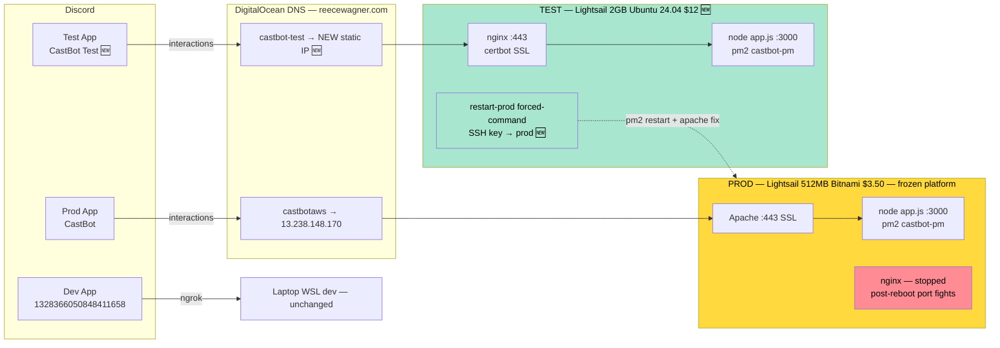

# 🧪 CastBot TEST Instance — Always-On Staging That Becomes the Next Prod

**Status:** Planning → Execution (this session)
**Date:** 2026-06-12
**Author:** Claude (Opus 4.8) at Reece's request
**Supersedes/refreshes:** [RaP 0920 — New Build Infrastructure](0920_20260417_NewBuildInfrastructure_Analysis.md), [RaP 0919 — Prod Cutover Strategy](0919_20260420_ProdCutoverStrategy_Analysis.md)
**Related:** [RaP 0915 — Memory Leak OOM](0915_20260603_MemoryLeakOOM_Analysis.md), [Incident 03 — V8 Heap OOM](../incidents/03-V8HeapOOMCrash.md)

---

## 📜 Original Context (User's Full Prompt — Verbatim)

> Dear Fable, Please review the attached context / RaPs that were created with older and less powerful claude models, and also review the recent and still recurrent issue @docs/01-RaP/0915_20260603_MemoryLeakOOM_Analysis.md
>
> Familiarise yourself with CastBot's full-stack architecture (see @"docs/infrastructure-security/Castbot Documentation (Outdated).pptx" and other files )  including IP, DNS, etc. I want to in this session (or as soon as possible) stand up a new "CastBot Test" instance, deployed to AWS using a very similar architecture to Prod, exploring here a few possible tactical changes to make, with the view to eventually 'flip' test and prod around as part of a future deployment strategy
>
> Lets make a new refreshed RaP covering this prompt and associated changes, with the following in mind
> 1) Where possible I would prefer /you/ to do many of these changes as possible; which may mean for example prioritising getting the lightsail instance and SSH access set up (recognise I'll need to do DNS, discord bot registration etc)
> 2) I want to /consider/ (if not too much effort) setting up a new DNS for TEST, for this i'm happy to register a new domain name like castbot.com, currently prod points to my personal name castbot.reecewagner.com which i dont love, however unlikely the security considerations are. The other option would be castbottest.reecewagner.com or something similar. But I know DNS propagation takes a while and the interactions API won't work without proper SSL which needs DNS and im impatient so it might just be easier to use a new subdomain on my personal domain..
> 3) The current lightsail instance uses bitnami, I saw this notification, please provide considerations for staying on bitnami vs moving off including architectural (changing the prod stack is a lot of effort that I can't be bothered doing right now so if it makes our architecture more consistent, happy to stick with bitnami)
> 4) I've had several outages / issues with prod when i've been out and about; since TEST will provide an always on feature I'd like to investigate a simple feature like adding a 'Restart Prod' button in the reeces_stuff menu (since normally if prod is down, the bot is down, and such a button wouldn't work), please provide options and considerations
> 5) Reconfirm your plan of architectural changes at each layer including any finnicky steps
> 6) I think we already planned these changes but review our current deployment approach (including git) and scripts and let me know where test fits in (I have some views)
> 7) Come up with a full setup plan from start to finish we can punch through including discord registration, dns setup, etc plus the actual instance
>
> Lets ultrathink go

---

## 🤔 Plain English: What We're Building and Why

A second, **always-on Lightsail box ("CastBot Test")** running a near-copy of the prod stack, with its own Discord app, domain, and SSL. It serves three jobs:

1. **Staging gate** — deploy to test, soak, then promote to prod (today changes go laptop-dev → prod with nothing in between that's always-on).
2. **Out-of-band ops console** — a bot that's *up when prod is down*, so a "Restart Prod" button actually works when you're out and about.
3. **Prod-in-waiting** — built deliberately on the stack we want prod to be on, so that one day the cutover is just a static-IP swap (RaP 0919's playbook) and the 448MB OOM-crashing Bitnami box retires.

The third job is the strategic shift from the older RaPs: **0920 wanted a cloud dev box; this RaP wants a blue/green pair.** The test box is the "green" environment that eventually takes the prod IP.

## 🆕 What Changed Since RaPs 0919/0920 (April 2026)

| Fact | April 2026 (old RaPs) | June 2026 (now) | Impact |
|---|---|---|---|
| **Bitnami on AWS** | "Use Bitnami for env parity with prod" | **Broadcom retired Bitnami from AWS Marketplace/Lightsail on 2026-06-10.** Node.js Bitnami blueprint stopped receiving updates 2026-05-19; formally deprecated 2026-11-19. Existing instances keep running but get zero updates. | The parity argument **inverts** — see Decision 1 |
| **Lightsail pricing** | 2GB = $10/mo | 2GB dual-stack = **$12/mo**, 1GB = $7, 512MB = $5 (IPv6-only tiers cheaper but unusable for Discord webhooks) | Budget +$2/mo vs old plan |
| **OOM state** | Crashing every ~3 days, undiagnosed | Mitigated: `--max-old-space-size=320` live, SIGUSR2 heap-dump handler live, hot-snapshot diff still pending. Root cause: playerData JSON.parse churn + cache drift on a 448MB box (Incident 03) | Test box (2GB + prod data copy) becomes the **leak lab** — heap dumps freeze the event loop ~74s on prod; free on test |
| **Strategy** | 0920 = cloud dev box; 0919 = snapshot-prod-and-restore at bigger size | **Blue/green**: test is built fresh on the target stack and *becomes* prod at flip | The flip no longer restores a Bitnami snapshot — it promotes a clean box |

> [!NOTE]
> The PPTX (marked "Outdated") describes nginx terminating SSL on `castbot.reecewagner.com`. Current reality per InfrastructureArchitecture.md and live ops: **Apache** terminates SSL on **`castbotaws.reecewagner.com`** (nginx is present-but-stopped — the source of the post-reboot port-80 fights). `.env` still carries a `REDIRECT_URI` on the old `castbot.` subdomain.

---

## 🧭 Decision 1 — Bitnami: Stay or Go? → **Go. Ubuntu 24.04 LTS.**

You asked for considerations both ways, noting "if it makes our architecture more consistent, happy to stick with bitnami." Here's the full picture:

### The consistency argument inverts under the flip strategy

The old logic (RaP 0920): *test should match prod, prod is Bitnami, therefore Bitnami.* That made sense when prod's stack was the permanent destination. But you've now said **test will become prod**. So the real question is: *what stack do we want prod to be on in 2027?* — and committing the future prod to a platform that was removed from AWS **two days ago** would be re-boarding a sinking ship.

| Consideration | Stay Bitnami | Move to Ubuntu 24.04 LTS |
|---|---|---|
| Can we even get the image? | Only by snapshotting current prod (Bitnami blueprints unselectable for new Node.js instances after Nov 2026; updates already stopped May 2026) | First-party Lightsail blueprint, fully supported |
| Security updates | **None ever again** for the Bitnami layer; you self-maintain | Standard Ubuntu LTS until 2029 (+ESM) |
| Parity with current prod | Identical paths (`/opt/bitnami/...`), identical quirks | App layer identical (Node 22 + PM2 + Express + `.env`); only the proxy/SSL layer differs |
| The Apache↔nginx port-80 fight | **Inherited** — the recurring "AWS restart → nginx grabs port 80 → Apache can't bind → interactions dead" outage class is a Bitnami artifact (both servers shipped on one image) | **Eliminated** — one web server, period |
| bncert-tool / Bitnami stack scripts | Frozen, unsupported | Plain certbot (snap), boring and standard |
| Effort | Lower today (snapshot prod, restore) — but imports the leak, the cruft, and the dead platform | ~1–2 hrs more setup, which I do |
| Flip-day implication | Prod stays Bitnami forever | Prod lands on a clean, supported stack **without ever touching the current prod box** |

**Recommendation: Ubuntu 24.04 LTS blueprint + nginx + certbot (snap) + Node 22 (NodeSource) + PM2.**

- **Why nginx over Apache:** one server instead of Bitnami's two; it's what the original architecture doc described anyway; massive documentation surface.
- **Considered alternative — Caddy:** auto-HTTPS with a 3-line config, no certbot at all. Genuinely simpler, but nginx is the boring, well-trodden choice and certbot-via-snap auto-renews via systemd timer anyway. Happy to do Caddy if you prefer minimal moving parts — say the word, it changes ~3 setup steps.
- **Considered alternative — "Node.js packaged by Lightsail" blueprint:** AWS's official Bitnami replacement. Viable, but it bundles opinions we don't need; plain Ubuntu keeps the box fully ours and is the most portable off Lightsail later.
- **What stays identical to prod (the parity that matters):** Node 22.x, PM2 process named **`castbot-pm`** (deliberately the same name so every existing script/runbook works on both boxes), Express on `127.0.0.1:3000`, same `.env` shape, same repo, same deploy flow.

**Current prod is untouched.** No effort on the prod stack now — it keeps running its frozen Bitnami image until flip day, then retires.

## 🧭 Decision 2 — DNS: New Domain vs Subdomain → **Subdomain now; vanity domain is a non-blocking add-on.**

Your instinct ("might just be easier to use a new subdomain") is right, with one correction to the mental model: **DNS propagation is only slow for *changed* records.** A brand-new name (subdomain *or* new domain) has nothing cached anywhere — a new A record on DigitalOcean DNS with TTL 300 resolves worldwide in **~1–5 minutes**, and certbot can issue SSL immediately after. The slow part of a new *domain* is registrar→nameserver delegation setup (minutes to a few hours) plus the purchase faff.

| Option | Time to SSL | Cost | Notes |
|---|---|---|---|
| **A. `castbot-test.reecewagner.com`** ✅ | ~10 min after you add the A record | $0 | One A record in DigitalOcean. Done. |
| B. New vanity domain | Hours (registrar setup + NS delegation), then same | ~$12–20/yr | `castbot.com` is **taken/parked at a premium** (contrib.com network). `castbot.io` taken. `castbot.net` taken (a gambling site — avoid the neighborhood). `castbot.app` / `castbot.dev` appear unregistered (unverified — 30-sec whois when you care). Both are HSTS-preloaded TLDs (HTTPS mandatory — fine, we have it). |
| C. `castbottest.reecewagner.com` | Same as A | $0 | Same thing; I prefer the hyphenated form for readability |

**The key decoupling:** a vanity domain is *additive at any time, with zero downtime* — buy it whenever, point it at whichever box, add a second nginx `server_name` + certbot cert (~10 min of work). It can even become **prod's** new public name at flip day (Discord's Interactions Endpoint URL is just a portal field — changing it is instant once the new URL verifies). So: **don't let the domain decision block the instance.** Recommendation: Option A today; park "buy castbot.app/.dev" as an optional later task.

*Security note you raised:* exposure of `reecewagner.com` subdomains is genuinely low-risk — the box only answers 443 with signature-verified Discord payloads (Ed25519 via `PUBLIC_KEY`) — but moving prod to a non-personal domain at flip is a nice hygiene win and costs nothing extra then.

## 🧭 Decision 3 — Instance Size → **2GB ($12/mo dual-stack, ap-southeast-2a Sydney)**

- This box is the future prod. Provisioning 1GB now means re-provisioning before flip → false economy ($5/mo saved, a rebuild bought).
- 2GB = 4.5× current prod RAM. The entire OOM class from RaP 0915 (V8 auto-ceiling 259MB on a 448MB box) ceases to exist: V8 auto-sizes to ~1GB heap, and heap-dump captures (which nearly exhaust prod's RAM and freeze it 74s) become routine.
- Sydney quirk: ap-southeast-2 bundles include **half** the listed transfer allowance (1.5TB on the $12 plan). CastBot's traffic is webhooks + JSON — irrelevant.
- Must be **dual-stack** (public IPv4): Discord must reach the interactions endpoint; IPv6-only tiers don't fit.

---

## 🏗️ Target Architecture



### Layer-by-layer (point 5) — with finnicky steps flagged

| Layer | Prod (today, untouched) | Test (new) | ⚠️ Finnicky steps |
|---|---|---|---|
| AWS instance | Lightsail 512MB Bitnami Node.js, ap-southeast-2a, $3.50 (grandfathered) | Lightsail **2GB dual-stack Ubuntu 24.04**, ap-southeast-2a, $12 | Create a **new SSH key pair** (`castbot-test-key`) — don't reuse prod's. Open firewall: 22, 80, 443 only |
| Static IP | 13.238.148.170 | New Lightsail static IP (free while attached) | Attach immediately — instance IPs change on stop/start otherwise |
| DNS | `castbotaws.reecewagner.com` A→13.238.148.170 (Hover registrar → DigitalOcean NS) | `castbot-test.reecewagner.com` A→new IP, TTL 300 | **Order matters:** DNS must resolve before certbot HTTP-01 can issue. ~5 min wait |
| Web/SSL | Apache + Let's Encrypt (bncert, frozen) + dormant nginx | nginx + certbot (snap, auto-renew systemd timer) | certbot on Ubuntu 24.04: **install via snap, not apt**. One server block: 443 → proxy_pass 127.0.0.1:3000; redirect 80→443 |
| Runtime | Node 22.12.0, PM2 `castbot-pm`, `/opt/bitnami/projects/castbot` | Node 22.x LTS (NodeSource), PM2 **`castbot-pm`** (same name on purpose), `/home/ubuntu/castbot` | `pm2 startup systemd` + `pm2 save` so the bot survives reboots — prod's weak spot. Set `NODE_OPTIONS` not needed (2GB box) |
| App config | `.env` PRODUCTION=TRUE, prod app creds | `.env` PRODUCTION=FALSE + new `INSTANCE_ROLE=test`, **test app creds** | Audit env-gated services on first boot: pm2ErrorLogger (posts to Discord #error — must not impersonate prod), healthMonitor, backupService. Decide each: off, or pointed at a test channel |
| Discord app | Prod app | **New "CastBot Test" app** — APP_ID, PUBLIC_KEY, bot token | **Privileged intents** must be ticked in the portal (Server Members; per RaP 0917) — silent failures otherwise. Interactions Endpoint URL only saves if the bot is **already running with valid SSL and the right PUBLIC_KEY** (Discord sends a verification PING). So: portal URL is one of the *last* steps |
| Commands | Registered to prod app | `npm run deploy-commands` against test app creds | Guild-scoped to your test server first (instant) vs global (up to 1hr) |
| Data | playerData.json (3.7MB, 160 guilds), safariContent.json, etc. (gitignored, Tier-1 backed up) | **Seed from prod copy** (realistic load + leak-lab parity) — **except `scheduledJobs.json`** (start empty: scheduled jobs could fire outbound webhooks/DMs from the test bot) | Test bot isn't installed in prod guilds so most API calls would just 403 — but stored webhook URLs are callable by anyone holding them. Excluding scheduledJobs is the cheap safety. |
| Repo access | Prod box pulls from GitHub | Same — but note pending "make repo private" task ([project_github_private]) → when that happens, **both boxes need read-only deploy keys** | Generate the test box's deploy key during setup so going private later doesn't break test deploys |
| Monitoring | Ultrathink, pm2ErrorLogger, npm run monitor-prod | Mirror later; not day-1 | — |

---

## 🔘 Point 4 — "Restart Prod" Button in `reeces_stuff` (on the TEST bot)

The premise is sound: when prod's bot is down, prod's own buttons are dead — but the **test bot is a separate app on a separate box**, so its buttons keep working. `reeces_stuff` is already gated to your user IDs, and the same codebase runs on both boxes, so the button ships everywhere but **enables only where `INSTANCE_ROLE=test`**.

### Options

| | Mechanism | Fixes which failures | Risk profile |
|---|---|---|---|
| **A. Forced-command SSH** ✅ | Test box holds a dedicated keypair; prod's `authorized_keys` entry is `command="/home/bitnami/remediate-castbot.sh",no-port-forwarding,no-pty ...` — the key **can only run that one script**, nothing else | Bot crashed/hung (pm2 restart), Apache down after reboot (apachectl start + nginx stop), env not loaded | **Low.** Even if the test box is fully compromised, the attacker can only… restart CastBot. Script lives on prod, owned by bitnami, so its contents can't be swapped from test |
| B. Lightsail API reboot | IAM access key on test box scoped to `lightsail:RebootInstance` on the prod instance only | Full box hang (the only thing SSH can't fix) | **Medium.** A reboot *triggers* the Apache/nginx port-80 race — the remediation script in Option A is what fixes that. AWS creds on a box is a bigger primitive than a forced-command key |
| C. Auto-watchdog | Test box polls `https://castbotaws.../interactions` every N min; on failure, runs Option A automatically and/or DMs you | Everything A fixes, without you noticing | Same risk as A + flap/loop hazards (needs cooldown + max-attempts). Natural **phase 2** once A is proven |

**Recommendation: Option A now** (it covers every actual outage you've had — pm2 deaths and the post-reboot Apache fight), **C as the follow-up** once trusted, **B only if a full-hang ever actually occurs** (and then as a second, scarier button with its own confirm).

**Implementation sketch** (ButtonHandlerFactory, ~30 lines + a prod-side script):

```javascript
// BUTTON_REGISTRY: 'reece_restart_prod' — category 'reeces_stuff'
} else if (custom_id === 'reece_restart_prod') {
  return ButtonHandlerFactory.create({
    id: 'reece_restart_prod',
    deferred: true,            // SSH round-trip > 3s
    ephemeral: true,
    handler: async (context) => {
      if (process.env.INSTANCE_ROLE !== 'test') {
        return { content: '⛔ Only available on the TEST instance.' };
      }
      const { execFile } = await import('node:child_process');
      const out = await new Promise(res => execFile('ssh',
        ['-i', '/home/ubuntu/.ssh/prod-remediate-key', '-o', 'ConnectTimeout=10',
         'bitnami@13.238.148.170'],            // forced command runs the script
        { timeout: 60000 }, (e, stdout, stderr) => res(stdout + stderr)));
      return { content: `🔁 Prod remediation ran:\n\`\`\`\n${out.slice(0,1800)}\n\`\`\`` };
    }
  })(req, res, client);
}
```

Prod-side `remediate-castbot.sh` (idempotent, safe to mash):
```bash
#!/bin/bash
# 1. Web layer: if Apache not on 443, stop nginx, start Apache
curl -sf -o /dev/null -m 5 https://localhost:443 -k || {
  sudo systemctl stop nginx 2>/dev/null; sudo /opt/bitnami/apache/bin/apachectl start; }
# 2. Bot layer: pm2 restart (approved command; preserves env incl. NODE_OPTIONS)
pm2 restart castbot-pm && pm2 save
pm2 list
```

**Considerations:** confirm-step before firing (two-click pattern), audit-log every press to #error channel, output truncated to component limits, 60s timeout so the button never hangs the interaction. Note `pm2 restart` is on the CLAUDE.md approved list and preserves the `NODE_OPTIONS=--max-old-space-size=320` env.

---

## 🚚 Point 6 — Deployment & Git: Where TEST Fits

**Current flow:** laptop dev (`dev-restart.sh` auto-commits to `main`, pushes) → GitHub `main` → `npm run deploy-remote-wsl` SSHes to prod, `git pull`, `npm install`, `pm2 restart`. Host/user/path/key come from `.env` (`LIGHTSAIL_HOST` etc.).

**Proposal — same script, second target (recommended):**

```
dev laptop ──auto-commit──▶ GitHub main ──deploy-test──▶ TEST (soak/verify)
                                        └─deploy-remote-wsl (manual, permissioned)──▶ PROD
```

- Parameterize `deploy-remote-wsl.js` with a `--target test|prod` flag reading `TEST_LIGHTSAIL_HOST/USER/PATH/KEY` vs the existing prod vars. New npm scripts: `deploy-test`, `deploy-test-dry`, `logs-test`. (~30 min work, I do it.)
- **Single `main` branch for everything.** A `develop`→test / `main`→prod branching model is real ceremony for a solo dev whose dev-restart auto-commits to main; it would also break the auto-commit habit. Test's value is *environment* fidelity (real Lightsail, real SSL, real PM2, prod-scale data), not *branch* isolation.
- Promotion discipline replaces branch discipline: **prod deploys should have been on test first.** Optionally tag prod deploys (`prod-2026-06-12`) for instant "what's on prod" answers — cheap, worth it.
- Prod rules unchanged: dry-run, explicit permission, foreground, one permission = one deploy. Test gets a *lighter* rule: deploy freely, it's what it's for.

You said you have views here — this section is deliberately a proposal, not a decision. The `--target` mechanism works under any branching policy you prefer.

## 🔄 The Future Flip (so we build for it now)

Per RaP 0919's static-IP swap, updated for the blue/green pair — **not executed now, but three things get pre-staged during setup:**

1. **Same PM2 process name + same deploy mechanism** on both boxes → flip needs no script changes.
2. **Cert for the prod domain, issued on the test box *before* flip day** via DNS-01 (`certbot-dns-digitalocean` plugin + DO API token) — HTTP-01 can't work until DNS points at you, DNS-01 doesn't care. This kills the chicken-and-egg that made RaP 0919's plan finnicky. (Not done at setup; done in flip week.)
3. **Flip-day sequence** (30–60s downtime): stop test bot's test-identity → final rsync of data deltas from prod → swap `.env` to prod credentials + `PRODUCTION=TRUE` → stop prod bot → detach static IP 13.238.148.170 from old box, attach to test box → nginx already has the prod vhost+cert → start bot → verify → old box held 48h for rollback (reverse IP swap), then deleted.
   - Discord sees nothing: domain, IP, and endpoint URL all unchanged.
   - What was "test" is now prod; stand up a fresh cheap test box later (or run a second PM2 process — decide then).

---

## 📋 Point 7 — Full Setup Punch List

Owner: 🧑 = Reece (only where I genuinely can't), 🤖 = Claude. Ordered to maximize parallelism — **steps 1–2 unblock everything**.

| # | Step | Owner | Detail | Blocks |
|---|---|---|---|---|
| **1** | **AWS access for Claude** | 🧑 | IAM user `castbot-claude` with `LightsailFullAccess` (or scoped policy), create access key, then I run `aws configure` here (I'll install AWS CLI v2 in WSL first). *Alternative if you'd rather not: you click the instance together with me via console — 10 min — and I take over at SSH.* | 2,3 |
| 2 | Create instance + static IP + firewall | 🤖 | `aws lightsail create-instances` — Ubuntu 24.04, 2GB dual-stack (`small_3_0`-class bundle), ap-southeast-2a, new key pair `castbot-test-key` (private key saved to `~/.ssh/`, chmod 600). Allocate+attach static IP. Open 22/80/443. | 3,4 |
| 3 | DNS A record | 🧑 | DigitalOcean DNS: `castbot-test.reecewagner.com` → new static IP, TTL 300. *(Or hand me a DO API token scoped to DNS and I do this + future DNS-01 certs.)* | 6 |
| 4 | Base provisioning | 🤖 | SSH in: apt update/upgrade, NodeSource Node 22, `npm i -g pm2`, nginx, certbot (snap), git. Clone repo to `/home/ubuntu/castbot`, `npm install`. Generate deploy key (future-proofing repo-private). Add `~/.ssh/config` entry `castbot-test` locally. | 5,6 |
| 5 | Discord app registration | 🧑 | Portal: New Application **"CastBot Test"** → Bot → copy APP_ID, PUBLIC_KEY, TOKEN. **Enable Server Members intent** (+ any others prod has — mirror prod's intent page). Generate invite URL (same scopes/perms as prod), invite to dev/test guild. Paste the three creds to me. | 7 |
| 6 | SSL + nginx | 🤖 | Once DNS resolves: `certbot --nginx -d castbot-test.reecewagner.com`; vhost proxying 443→127.0.0.1:3000; verify `https://castbot-test.../interactions` returns (401/405 is fine — means Express is answering). | 8 |
| 7 | App config + data seed | 🤖 | Write `.env` (test creds, `PRODUCTION=FALSE`, `INSTANCE_ROLE=test`); seed playerData.json + safariContent.json from prod via scp (read-only pull), **empty scheduledJobs.json**; audit env-gated monitors; `pm2 start app.js --name castbot-pm`, `pm2 startup` + `pm2 save`. Register slash commands to test app. | 8 |
| 8 | Interactions endpoint | 🧑 | Portal → CastBot Test → Interactions Endpoint URL = `https://castbot-test.reecewagner.com/interactions` → Save (verifies live against the running bot). | 9 |
| 9 | Smoke test | 🤖+🧑 | `/menu`, `/castlist`, a Safari interaction, check logs. | — |
| 10 | Deploy tooling | 🤖 | `--target test` in deploy-remote-wsl.js + `deploy-test*` npm scripts + docs update (InfrastructureArchitecture.md gets the two-box diagram). | — |
| 11 | Restart-Prod button | 🤖 (script install on prod needs 🧑 permission) | Forced-command keypair, `remediate-castbot.sh` on prod, button + handler + registry, audit logging. **Touches prod's authorized_keys → explicit permission gate.** | — |
| 12 | (Optional, later) Vanity domain | 🧑 | whois castbot.app / castbot.dev → buy → delegate → I add vhost+cert. Zero downtime, any time. | — |
| 13 | (Later) Leak lab | 🤖 | Use test box for RaP 0915's hot-snapshot diff with prod-scale data and no 74s-freeze consequences. | — |

**Critical path:** 1 → 2 → (3 ∥ 4 ∥ 5) → 6/7 → 8 → 9. With AWS creds and your portal/DNS steps done promptly, **the bot can be answering interactions on test today.** Steps 3+5 are ~15 min of your clicking, parallel with my provisioning.

## ⚠️ Risk Assessment

| Risk | Likelihood | Mitigation |
|---|---|---|
| Test bot acts on prod data (DMs/webhooks from seeded data) | Low | Test app isn't in prod guilds (API calls 403); scheduledJobs.json seeded **empty**; monitors audited before first start |
| Stack divergence test↔prod masks a prod-only bug | Low | Divergence is proxy/SSL layer only; app layer identical. Accept — divergence *is* the migration |
| AWS creds on laptop | Low | Scoped IAM user, key rotatable/deletable after setup if you prefer |
| Forced-command key abused | Very low | Key can only run the remediation script; script is prod-owned |
| Repo goes private, test box breaks pulls | Medium (planned) | Deploy key generated at step 4, registered when privatization happens |
| Cost creep | — | +$12/mo now (~$15.50 total); post-flip ~$12/mo after old box deleted |
| Bitnami prod box degrades pre-flip | Low/slow | Unchanged risk from today; this plan is the exit ramp |

## 💰 Cost

| Phase | Monthly |
|---|---|
| Today | $3.50 (prod) |
| Test running (now → flip) | **~$15.50** ($3.50 prod + $12 test) |
| Post-flip (old box deleted) | ~$12 (+ ~$1 if keeping a snapshot; + optional new small test box) |
| Optional vanity domain | +$12–20/yr |

## ✅ Decisions (Reece, 2026-06-12)

1. **AWS access**: ✅ IAM access key — Claude runs AWS CLI locally and does instance/IP/firewall/provisioning.
2. **DNS name**: ✅ **`castbotblue.reecewagner.com`** (Reece's call — better than `castbot-test`: role-neutral *blue/green* naming, so the name isn't weird after the box becomes prod. Instance name: `castbot-blue`. The legacy Bitnami box is implicitly "green"/legacy. All references to `castbot-test.reecewagner.com` elsewhere in this doc → read as `castbotblue.reecewagner.com`.)
3. **Size**: ✅ 2GB / 2 vCPU dual-stack, $12/mo, ap-southeast-2a.
4. **Stack**: ✅ Ubuntu 24.04 LTS + nginx + certbot (snap) + Node 22 + PM2.
5. **DigitalOcean API token**: ✅ Yes — Claude does DNS records + future DNS-01 certs.

**Naming note:** `INSTANCE_ROLE=test` in `.env` still describes the *role*; `castbot-blue` describes the *box*. At flip, the role flag changes, the box name doesn't.

---

🔁 *Blue/green isn't two environments — it's one environment and its understudy, rehearsing until the night it goes on.*
