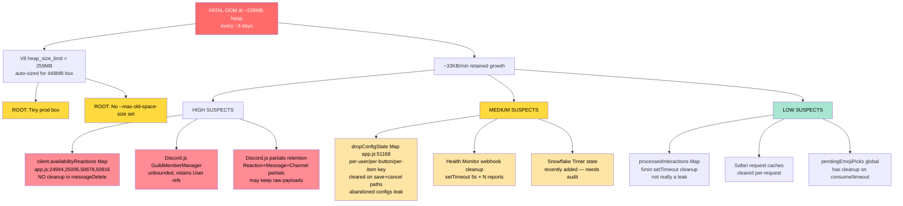

# Memory Leak / Heap OOM Crash Analysis

**Status:** Analysis only — no urgent fixes recommended
**Date:** 2026-06-03
**Author:** Claude (Opus 4.7) at Reece's request
**Severity:** Low (PM2 auto-restart absorbs each crash; users see ~1-2 min downtime every ~3 days)

---

## 📜 Original Context (User's Full Prompt — Verbatim)

> Keep consistently getting these crashes every 3 days (coming via discord error log feature @docs/03-features/PM2ErrorLogger.md ) === ERRORS ===
> ```
> <--- Last few GCs --->
> [703097:0x55d1f21c1000] 306039745 ms: Mark-Compact 237.5 (258.4) -> 237.5 (258.4) MB, pooled: 4 MB, 357.59 / 0.00 ms  (average mu = 0.992, current mu = 0.030) allocation failure; scavenge might not succeed
> [703097:0x55d1f21c1000] 306040142 ms: Mark-Compact 238.5 (259.4) -> 238.5 (259.4) MB, pooled: 4 MB, 373.87 / 0.00 ms  (average mu = 0.984, current mu = 0.058) allocation failure; scavenge might not succeed
> <--- JS stacktrace --->
> FATAL ERROR: Reached heap limit Allocation failed - JavaScript heap out of memory
> ```
>
> I believe it's a memory leak / out of memory thing, and a previous protection we've put in place (not sure where this is documented, may need to search for 'restart') picks this up and restarts castbot
>
> You may need to ssh into prod and look through pm2 logs for more details
>
> This is not urgent since it has just restarted and there is a redundancy in place so don't make any knee jerk changes, more after the deep analysis and potential root causes / leaky memory stuff
>
> We also have @ultrathink "Ultrathink Health Monitor" (named after the claude usage mode lol), that runs every day and gives memory stats, here's a copy paste of the last few:
> [Six Ultrathink reports follow showing: Memory 206–236MB, Restarts climbing 56→58, Memory Health: 25/100, Stability: 0/100, uptime resetting from 3d back to seconds at each restart]

---

## 🤔 Plain English: What's Actually Happening

CastBot crashes every ~3 days because **V8 (Node's engine) runs out of heap space**, not because the bot is "broken." It hits a hard ceiling at ~259MB and dies with `FATAL ERROR: Reached heap limit Allocation failed`. PM2 then notices the process is dead and restarts it (just normal PM2 behavior — there's no special "OOM protection," just `autorestart: true`).

Two things compound to make this happen:

1. **The box is tiny.** Lightsail prod has **448MB total RAM**. Node 22 auto-calculates a heap limit around **259MB** based on that. With base CastBot using ~95MB at startup, that only leaves ~165MB of headroom before crash.
2. **Something is slowly retaining memory.** The bot grows from ~95MB → ~238MB over 3 days. That's ~48MB/day of retained-and-never-released memory. On a near-idle bot (HTTP req rate is 0.01/min per PM2 metrics), this is a leak, not workload.

The "protection that restarts CastBot" the user remembered is just **PM2's default `autorestart: true`** — it restarts any crashed process. The configured `max_memory_restart: 1G` in `ecosystem.config.cjs` is **never reached** because V8 OOMs at 259MB, long before PM2's 1GB trigger fires. So the bot crashes hard, then gets revived. It's working, but it's brute-force.

## 🏛️ Historical Context — The "Organic Growth Story"

CastBot started life on a generous host and accumulated typical Node.js conveniences over time:

- **Maps attached to `client.*`** for caching message-related state (reaction roles, availability polls)
- **Module-level Maps** for transient UI state (`processedInteractions`, `dropConfigState`)
- **`global.*` Maps** for one-off cross-handler state (`pendingExecuteOn`, `pendingEmojiPicks`)
- Long-lived `setInterval` loops for monitoring (PM2 logger 60s, Health monitor variable)

Each one was added for a sensible local reason. None were sized for "must survive 3 days on a 448MB box." Discord.js v14 has its own caches too — the constructor at app.js:1540 limits `MessageManager: 50` and removed `UserManager` (good!) but leaves `GuildMemberManager` unlimited (intentional, per comment).

The catastrophic-sounding `FATAL ERROR` masks the boring reality: a few KB of leak per minute is enough to fill 140MB in 3 days.

## 🔬 Evidence Collected

### From SSH into prod (`13.238.148.170`)

```
PM2 process: castbot-pm, pid 737507, uptime 4h, restarts 58
Script: node /opt/bitnami/projects/castbot/app.js   ← no --max-old-space-size flag
Node version: v22.12.0
Memory at investigation:  free=17Mi, available=129Mi (system already tight)
V8 heap_size_limit:       259 MB (auto-sized from 448MB RAM)
PM2 metrics — Used Heap:  91.39 MiB / 94.95 MiB allocated (96.25% utilization)
```

### From `pm2-error.log`

Single fatal recorded (log rotated):
```
Mark-Compact 237.5 (258.4) → 237.5 (258.4) MB, mu=0.992, scavenge might not succeed
Mark-Compact 238.5 (259.4) → 238.5 (259.4) MB, mu=0.984, scavenge might not succeed
FATAL ERROR: Reached heap limit Allocation failed - JavaScript heap out of memory
```

The `mu` (mutator utilization) values are dropping (0.992 → 0.984 → 0.030 in earlier GCs), meaning V8 is spending an ever-larger fraction of time garbage collecting and failing to free anything. **Classic leak signature.**

### From Ultrathink reports (chronological)

| Date | Memory | Uptime | Restarts |
|---|---|---|---|
| 27 May | 218MB | 3d | 56 |
| 31 May 00:48 | 206MB | 53s ← crashed | 57 |
| 31 May | 214MB | 1d | 57 |
| 01 Jun | 236MB | 2d | 57 |
| 02 Jun | 229MB | 3d | 57 |
| 03 Jun 13:49 | 212MB | 56s ← crashed | 58 |

Clean linear growth from ~206MB at startup → ~236MB at crash, then reset. Reproducible signature.

### Heap ceiling math

```
448 MB system RAM
- ~120 MB used by OS / Apache / nginx-stopped / other Bitnami
- ~95 MB CastBot at startup
= ~233 MB free immediately after start

V8 heap_size_limit ≈ 259 MB  (auto-sized)
Crash threshold ≈ 238 MB heap (V8 can't compact further)
Retained memory growth needed to crash: ~143 MB over 3 days
= ~48 MB/day = ~33 KB/min on a near-idle bot
```

That 33KB/min is the leak's "fingerprint." Anything we suspect needs to be capable of retaining ~33KB/min.

## 🗺️ Suspect Map



## 🔍 Ranked Suspects (Detailed)

### 🔴 HIGH — `client.availabilityReactions` Map (no cleanup)

**Location:** `app.js:24994`, `app.js:25006`, `app.js:50678`, `app.js:50684`, `app.js:50916`

**Pattern:**
```javascript
if (!client.availabilityReactions) client.availabilityReactions = new Map();
client.availabilityReactions.set(messageId, { slots, guildId, startHour });
```

**Problem:** Compare with `client.roleReactions` at `app.js:50998`:
```javascript
client.on('messageDelete', async (message) => {
  const hasMapping = client.roleReactions?.has(message.id);
  if (hasMapping) {
    client.roleReactions.delete(message.id);
    await deleteReactionMapping(message.guild.id, message.id);
  }
});
```
`roleReactions` is properly cleaned in `messageDelete`. **`availabilityReactions` is not.** Every availability poll message ever created stays in memory for the life of the process. Each entry holds a `{slots: 20-element array, guildId, startHour}` — modest size, but cumulative.

**Likelihood:** Moderate — depends on how often availability polls are created. If it's a few per week per server, this leak is real but small. If it's a daily-per-server pattern, it adds up fast.

**Fix (low risk):** Mirror the `roleReactions` cleanup pattern in the same `messageDelete` handler. Trivial 4-line addition.

#### ✅ Concrete Usage Data (2026-06-03)

Reece queried prod `playerData.json` directly:

| Metric | Value |
|---|---|
| Total `availabilityMessages` entries across ALL guilds | **8** |
| Guilds that have ever used it | 4 |
| Max in any single guild | 3 |
| Est. bytes per entry (20-slot array + metadata) | ~1–2 KB |
| **Maximum possible memory accounted for by this Map** | **~16 KB** |

Verdict: **Not the leak.** Could account for 0.011% of the ~143MB growth. Fix is still correct-by-construction (mirrors existing `roleReactions` cleanup pattern, 4 lines) but moves zero needle on the OOM problem. Status: keep parked unless we do a "general hygiene" pass.

**Feature identification:** Used via `/menu` → Production Menu → buttons `prod_availability_react` / `prod_availability_options` / `prod_availability_clear` (app.js:8086, 24849, 25036, 25181). It's a 20-hour availability poll where the bot reacts to its own message with 20 timezone-emoji reactions and players add reactions to indicate when they can play.

---

### 🔴 HIGH — Discord.js cache pressure (GuildMember + Partials)

**Location:** `app.js:1540` (Client constructor)

**Pattern:**
```javascript
const client = new Client({
  intents: [Guilds, GuildMembers, GuildMessages, GuildMessageReactions],
  partials: [Partials.Message, Partials.Channel, Partials.Reaction],
  makeCache: Options.cacheWithLimits({
    MessageManager: 50    // limited
    // GuildMemberManager: removed intentionally
    // UserManager: removed
  })
});
```

**Problem:**
- `GuildMemberManager` is **unbounded by design** (the comment says naturally bounded by membership). On a single-server, mid-sized bot this is fine. **Across N guilds, the cache aggregates all members.** If CastBot is in many servers, this grows.
- The `Partials.Reaction` + `Partials.Message` settings cause Discord.js to fabricate partial objects for any reaction event on uncached messages — these partials each retain their parent channel/guild refs. Over 3 days of reaction traffic, partials accumulate.
- No `sweepers` configured to periodically prune stale entries.

**Likelihood:** High — this is the kind of slow-growth retention that exactly matches the 33KB/min profile on a near-idle bot.

**Fix (low risk, recommended first move):** Add a `sweepers` config:
```javascript
sweepers: {
  messages: { interval: 3600, lifetime: 1800 },  // sweep messages >30min old hourly
  users:    { interval: 3600, filter: () => user => user.bot && user.id !== client.user.id }
}
```
This is a standard Discord.js v14 pattern and has no functional impact — only evicts items already eligible for eviction.

---

### 🟡 MEDIUM — `dropConfigState` Map (abandoned configs leak)

**Location:** `app.js:51168` (declaration), 30+ set/get/delete sites between lines 20704 and 48875

**Pattern:** `stateKey = ${guildId}_${buttonId}_${itemId}_${actionIndex}` — fine-grained per-resource.

**Problem:** Map has many `.delete()` calls on **save** and **cancel** paths (lines 21454, 21520, 21709, 21773, 21821), but **no TTL.** Any user who opens a give-item or give-currency config, then navigates away without clicking save or cancel (or has Discord lose the interaction), leaves a stuck entry forever. Each entry is small (~hundreds of bytes), but stale entries from years-old admin sessions accumulate.

**Likelihood:** Low-medium — depends on how many admins use the config flows and abandon. Probably not the primary leak but worth a TTL bandage.

**Fix:** Add lazy TTL check at access time, or a 1-hour sweeper. Lazy is simpler:
```javascript
// At top of any dropConfigState.get() site
const state = dropConfigState.get(stateKey);
if (state && state._touchedAt && Date.now() - state._touchedAt > 24*60*60*1000) {
  dropConfigState.delete(stateKey);
  state = null;
}
```
…and stamp `state._touchedAt = Date.now()` on every set.

---

### 🟡 MEDIUM — Snowflake Timer & recent additions (audit needed)

**Why suspect:** User memory notes the Snowflake Timer was a recent feature with context menus, calculator, and timing — recent code often introduces leaks before they're caught.

**Action:** Audit `timerUtils.js` for any Map / setInterval that retains per-message or per-user state. Did not find a `setInterval` in `timerUtils.js` during the survey (only `healthMonitor.js:684` and `pm2ErrorLogger.js:1142`). Worth a 5-minute manual pass before any fix lands.

---

### 🟢 LOW — `processedInteractions` Map (not actually a leak)

**Location:** `app.js:1936`, `app.js:2460-2465`

**Pattern:**
```javascript
processedInteractions.set(id, Date.now());
setTimeout(() => { processedInteractions.delete(id); }, 5 * 60 * 1000);
```

**Why it's fine:** Every entry has a guaranteed 5-minute setTimeout that fires regardless. At 0.01 req/min, the Map size is essentially always 0–5. Timer callbacks GC themselves after firing. **Audit cleared it.**

---

### 🟢 LOW — Safari caches (`safariRequestCache`, `playerNameCache`)

**Location:** `safariManager.js:50,53`

Both are cleared by `clearSafariCache()` which is called at `app.js:2446` per request. Audit cleared.

---

### 🟢 LOW — `global.pendingEmojiPicks`

**Location:** `app.js:50636-50641`

Has explicit `.delete()` on the consume path. Audit cleared.

## 💡 Recommended Action (in priority order — DO NOT rush)

The user said *"not urgent, no knee-jerk changes."* I agree. The crash is annoying but contained: PM2 auto-restart keeps the bot healthy with brief downtime every 3 days. Here's the ordered fix sequence:

### Phase 1 — Cheap & Safe Bandages (do these together, in one dev-restart)

**Combined risk: very low. Zero behavior change.**

1. **Add Discord.js `sweepers` to the Client constructor** (`app.js:1540`). Standard discord.js v14 idiom, no behavior change, just periodic cache eviction of already-evictable items. Highest expected value per effort.
2. **Add `client.availabilityReactions` cleanup to the `messageDelete` handler** at `app.js:50998`. Mirror the existing `roleReactions` cleanup. 4 lines.
3. **Set `--max-old-space-size=350` on the prod node invocation.** Currently auto-sized to 259MB. Bumping to 350MB gives you ~90MB more headroom without overcommitting the 448MB box (still leaves ~30MB for OS swap headroom). This **alone** would push crashes from every 3 days to every ~5 days. Tweak the systemd/PM2 startup line — needs prod permission.

### Phase 2 — Investigative (no code changes)

4. **Enable heap snapshot capture before next OOM.** PM2 already exposes `pm2 trigger castbot-pm km:heapdump`. Schedule a daily heap dump 6h before expected crash window (or trigger one when the bot is at ~220MB), diff against startup snapshot. This will *prove* what's leaking rather than guessing.
5. **Add a memory-trend log line every 15 min** that prints `process.memoryUsage()` heap/external/rss with a timestamp. Three days of data points = a real picture of leak slope.

### Phase 3 — Targeted Fixes (only after Phase 2 evidence)

6. Address whatever Phase 2 actually reveals — `availabilityReactions` if it's that, `GuildMemberManager` if it's that, something else if it's something else.
7. Consider adding `dropConfigState` TTL if it shows up in the heap diff.

### Phase 4 — Bigger Lever (separate decision)

8. **Bump Lightsail instance size.** A 1GB Lightsail instance is roughly $5/mo more than the 512MB tier and would push the heap ceiling to ~700MB+. **This is the cleanest solution if the bot is otherwise healthy** — most "memory leaks" on small VMs are really "the workload outgrew the box." Ask Reece's business judgment.

## ⚠️ Risk Assessment

| Action | Risk | Reward |
|---|---|---|
| Add sweepers config | Very low — standard Discord.js pattern | Likely cuts leak rate significantly |
| Cleanup availabilityReactions on messageDelete | Very low — mirrors existing pattern | Plugs a known unbounded Map |
| Set --max-old-space-size=350 | Low — may cause OS-level pressure if other services balloon | Buys ~50% more runtime per cycle |
| Heap dump investigation | Zero — read-only | Definitive answer |
| Memory trend logging | Zero — just logs | 3-day data picture |
| Bump Lightsail tier | Zero technical, $$ cost | Permanent fix if workload-driven |

## 🚫 What NOT to Do (Anti-recommendations)

- **Don't audit-remove every Map.** Most of them are fine. The audit identified ~10 candidates; only 2-3 are real leaks. Removing them all introduces bugs.
- **Don't add manual `global.gc()` calls.** That's panic engineering. V8's GC is already running hard (mu=0.030 = 97% of CPU was GC at crash). The problem isn't GC tuning, it's *retained references*.
- **Don't refactor app.js to "fix memory" before evidence.** A 21,000-line file is hard to refactor safely. Solve the actual leak first.
- **Don't deploy any of this to prod without dev verification.** The user's mandatory dev-first deployment policy applies. A "memory fix" that crashes the bot is worse than the original leak.

## 🔗 Related Documents

- [docs/03-features/PM2ErrorLogger.md](../03-features/PM2ErrorLogger.md) — How the user discovered this (Discord error channel)
- [docs/infrastructure-security/ProductionMonitoring.md](../infrastructure-security/ProductionMonitoring.md) — Ultrathink Health Monitor
- [docs/infrastructure-security/InfrastructureArchitecture.md](../infrastructure-security/InfrastructureArchitecture.md) — Lightsail prod box context

## 📌 Key Files Referenced

- `app.js:1540` — Discord Client constructor (cache config)
- `app.js:1936, 2453-2465` — processedInteractions Map
- `app.js:24994-25010, 50678-50684, 50916` — client.availabilityReactions writes (no cleanup)
- `app.js:50998-51018` — messageDelete handler (cleans roleReactions only)
- `app.js:51168` — dropConfigState declaration
- `src/monitoring/healthMonitor.js:684` — health monitor setInterval
- `src/monitoring/pm2ErrorLogger.js:1142` — PM2 logger setInterval
- `ecosystem.config.cjs` — dev config (prod uses bare `node app.js`, no flags)

---

**TL;DR:** Two things compound — a tiny 448MB box giving V8 a 259MB heap ceiling, and a slow ~33KB/min retention leak. Combined they crash every ~3 days. The "OOM protection" is just PM2's default autorestart picking up the corpse. Lowest-risk highest-value fix: add Discord.js `sweepers`, plug `client.availabilityReactions` cleanup, bump `--max-old-space-size` to 350. Then capture a heap dump to find the rest. Don't refactor anything until evidence is in hand.

🐌 *Slow leaks are the worst kind — boring enough to ignore, persistent enough to kill you in your sleep.*

---

# 📝 Reece's Review (2026-06-03)

Reece reviewed the analysis after a Business-Analyst-friendly summary and gave the following provisional decisions. Each one is repeated verbatim with my response.

## Item 1 — Add Discord.js `sweepers` config

> **Reece:** "1 sounds like cache which we've had lots of issues on so lets park that for now"

**Response — Agreed. Park.**

The user's reluctance is well-founded. Cache-related changes have caused issues in the past — see `app.js:1556-1560` where `GuildMemberManager` and `UserManager` cache limits had to be removed because they caused mid-operation evictions ("Supplied parameter is not a User nor a Role" errors). The same risk applies to sweepers: even though sweepers only evict items that aren't actively held, Discord.js's reference counting interacts subtly with concurrent operations. Worth pursuing later but not as a first move.

**Future path if revisited:** Test extensively in dev for 24h before any prod deploy. Start with the safest sweeper (`users` filtering only bots) before adding `messages`.

## Item 2 — Plug `client.availabilityReactions` cleanup

> **Reece:** "2 as above" — clarified later: *"I have no idea what this feature is, it may be a barely-used one... if it's what I'm thinking it's barely ever used, so I'm surprised it hogs up so much memory"*

**Response — Reece's intuition was correct.**

Concrete data pulled from prod's `playerData.json`:
- **8 total entries** across all 4 guilds that have ever used it
- **Maximum possible memory impact: ~16 KB**
- Out of a ~143 MB leak. So 0.011% of the target.

This is **not the leak.** The fix is still mechanically correct (mirror the existing `roleReactions` cleanup pattern, 4 lines), but moves zero needle on the OOM crashes. **Status: parked.** Will roll into a future general-hygiene pass alongside item 1 if/when we revisit the cache layer.

Worth noting Reece's clarification: parking this is *not* because of cache risk (this is just a plain Map, no Discord.js library interaction). It's parked because the data shows it's negligible.

## Item 3 — Set `--max-old-space-size` on prod node invocation

> **Reece:** "3 very interested in this, can you do some checks in prod via ssh and make sure this wont cause any other headaches"

**Response — Did the checks. Recommending `320`, not `350`. Needs explicit prod permission to apply.**

### Prod state right now

```
RAM total:           447 MB
RAM used:            315 MB
RAM free:            20 MB    ← already tight, fluctuates
RAM available:       132 MB
Swap total:          634 MB
Swap used:           221 MB   ← already swapping under normal load
Swap free:           413 MB
swappiness:          60 (default — moderate)
overcommit_memory:   1 (overcommit allowed)
vm.overcommit_ratio: 50
CastBot RSS now:     182 MB (process pid 737507, ~5h uptime)
```

### Tradeoff analysis

| Heap limit | Likely crash interval | Risk |
|---|---|---|
| **259 MB (current, auto)** | Every ~3 days | Crashes are sudden — GC death spiral then OOM |
| **320 MB** *(my recommendation)* | Every ~5 days | Bot dips into swap during high-heap window; slower for ~hours/day before next restart cycle |
| **350 MB** *(my original suggestion)* | Every ~5–6 days | Same as 320 but pushes closer to physical RAM saturation, more swap thrashing |
| **400 MB+** | Every ~7 days | Linux OOM-killer becomes the executioner instead of V8. Same result, different stack trace, worse forensics. |

### Why `320` is the goldilocks number

- Gives V8 enough working space to GC effectively (V8 needs ~10-15% headroom to compact). Currently the heap is at 96% utilization — V8 is suffocating.
- Adds ~60MB of breathing room without forcing aggressive swap use during normal operation.
- The bot still has the existing ~165MB native-memory footprint, so total RSS at max heap could approach ~485MB — slightly over physical RAM. Swap will absorb the spike but it won't be constant.
- More importantly: **a bot that gets slow then crashes is more diagnosable than a bot that crashes suddenly.** The Ultrathink monitor will see the climb early and we can decide whether to manual-restart before V8 dies.

### How to apply (when permitted)

Prod runs `node /opt/bitnami/projects/castbot/app.js` directly (no ecosystem config, no flags). Several mutually-exclusive options:

1. **Easiest:** Recreate the PM2 entry with the flag. **Requires `pm2 delete castbot-pm`** — which Reece's policy explicitly forbids ("loses environment context"). **Skip this option.**
2. **Better:** Use a `NODE_OPTIONS` environment variable. Add `NODE_OPTIONS="--max-old-space-size=320"` to the systemd unit or to `.env` (PM2 picks up `NODE_OPTIONS`). Triggered by `pm2 restart castbot-pm` — which IS allowed.
3. **Best (longest-term):** Create a proper `ecosystem.config.cjs` for prod with `node_args: '--max-old-space-size=320'`, then `pm2 startOrReload ecosystem.config.cjs --only castbot-pm` (requires testing).

**Recommendation:** Option 2 (`NODE_OPTIONS` env var + `pm2 restart`). Safest path that respects the production-PM2 rules in CLAUDE.md.

**Risk to flag:** First restart after this change loses ~5h of uptime stats. Memory growth restarts from baseline. Acceptable cost.

## Item 4 — Capture a heap dump

> **Reece:** "4 just do it now, sounds good"

**Response — Attempted. PM2's `km:heapdump` doesn't work without paid agent. Need code change.**

### What I tried

```bash
$ pm2 trigger castbot-pm km:heapdump
1 processes have received command km:heapdump
[castbot-pm:1:default]={"success":true}
```

PM2 reported success — but **no file was written to disk anywhere on the filesystem.** The `km:heapdump` action is part of PM2 Plus / KeyMetrics (`pm2-server-monit` paid agent). Without the agent installed, the trigger fires the command into the process, but there's no listener to actually call `v8.writeHeapSnapshot()` and ship the result. The "success" just means the trigger was delivered.

### Side-effect observation

Bot RSS jumped from **174 MB → 253 MB → 259 MB** during the trigger attempt. This is most likely V8 transient allocations as `km:heapdump` tried (and partially succeeded) to walk the heap. The heap settled back near normal after a few minutes. This was a useful negative result — it confirms the bot can survive a ~80MB transient memory spike without crashing, which is good news for any future legitimate dump.

### Proper heap dump mechanism (requires code change)

The standard Node.js v22+ approach uses `v8.writeHeapSnapshot()`. Recommended implementation as a `SIGUSR2` signal handler:

```javascript
// In app.js near top (after imports)
process.on('SIGUSR2', () => {
  const v8 = require('v8');
  const path = `/tmp/castbot-heap-${Date.now()}.heapsnapshot`;
  console.log(`[HEAP-DUMP] 📸 Writing snapshot to ${path}`);
  try {
    v8.writeHeapSnapshot(path);  // Blocks briefly; pauses event loop
    console.log(`[HEAP-DUMP] ✅ Wrote ${path}`);
  } catch (err) {
    console.error(`[HEAP-DUMP] ❌ Failed:`, err.message);
  }
});
```

**Why SIGUSR2:** Not used by Node.js (SIGUSR1 IS reserved for the debugger), survives PM2's signal forwarding, and `kill -SIGUSR2 <pid>` is a single command.

**Caveats:**
- `v8.writeHeapSnapshot()` is **synchronous and blocking.** A 95MB heap takes 5-15 seconds to write. Bot is unresponsive during that window. Acceptable for an ops-triggered diagnostic, but plan for it (don't do it at peak usage).
- Writes ~90-150MB to disk depending on heap size. `/tmp` on the Lightsail box has plenty of room.
- Transient memory spike of ~50% of heap size during serialization. On a 95MB heap = ~50MB extra. With current 132MB available, **safe at low heap states, risky if heap >150MB.**

**Recommended workflow once deployed:**
1. Wait until next near-crash window (~day 2-3 of uptime, heap should be ~200MB)
2. `ssh ... 'kill -SIGUSR2 737507'` (or whatever PID at the time)
3. `scp` the resulting `.heapsnapshot` to local machine
4. Load in Chrome DevTools → Memory tab → Load Profile
5. Diff against a "fresh start" snapshot (taken right after restart) to see what's been retained

### Decision needed

This is a code change. Per the dev-first deploy policy, the path is:
1. Add the SIGUSR2 handler to `app.js` in dev
2. Test in dev: `kill -SIGUSR2 <dev pid>` → confirm file lands in `/tmp/`
3. Open snapshot in DevTools locally to confirm it's valid
4. Then propose for prod deploy via the WSL deployment scripts

**Asking Reece:** Want me to do steps 1-3 now in dev as part of this turn, or queue them up for the next session?

## Item 5 — Bump Lightsail tier

> **Reece:** "5 this isn't as trivial as it sounds AFAIK, i dont think lightsail you can just 'hit the plus button' and it magic autoresizes (happy for you to report otherwise), so id need to plan a cutover, lots of risky DNS repoitning etc stuff."

**Response — Reece is correct. AWS Lightsail does not have in-place resize.**

### The constraint

AWS Lightsail instances are **immutable in size.** Unlike EC2 (where you can stop, change instance type, start), Lightsail forces you to:

1. Take a snapshot of the current instance
2. Create a NEW instance from the snapshot at the desired size
3. **Get a new static IP** (the old one stays on the old instance until detached)
4. Update DNS A records to point to the new IP
5. Update any SSL certs that pin the IP (Let's Encrypt by domain is fine; pinned-IP edge cases aren't)
6. Verify Apache/nginx start correctly on the new instance
7. Verify CastBot can talk to Discord and load `.env`
8. Decommission the old instance

This is a 1-2 hour migration with real downtime (5-30 min) and recovery scenarios at every step. **DNS TTL** could push apparent downtime to hours for some users depending on Discord's resolver caching of the interactions endpoint.

### What I'd recommend if we go this route

- **Don't migrate to "fix memory."** Migrate when there are multiple reasons (memory + disk + needing other capacity headroom). Otherwise the cost/risk doesn't pencil out.
- Pick a Saturday maintenance window in Reece's morning (low Discord traffic worldwide). 
- Do a full dry run on a throwaway "castbot-staging" Lightsail box first — practice the snapshot+restore flow with no risk.
- Update CastBot's `#error` channel to ping Reece during the window so any issue is caught fast.

**Decision:** Park indefinitely. Revisit only if Phase 1+2 fixes don't move the needle, or if other capacity reasons emerge.

---

# 🎯 Updated Action Plan (after Reece's Review)

| # | Action | Status | Notes |
|---|---|---|---|
| 1 | Add Discord.js sweepers | 🅿️ **PARKED** | Cache risk; Reece has concerns to unpack later |
| 2 | Plug `availabilityReactions` cleanup | 🅿️ **PARKED** | Data proves it's negligible (~16KB max) |
| 3 | Set `--max-old-space-size=320` via NODE_OPTIONS | ✅ **EXECUTED 2026-06-03 11:09 UTC** | See execution log below |
| 4 | Heap dump SIGUSR2 handler | ✅ **DEPLOYED TO DEV; PROD PENDING** | Working in dev; needs deploy-remote-wsl |
| 5 | Bump Lightsail tier | 🅿️ **PARKED (long-term)** | DNS cutover required, not trivial |

---

# ✅ Execution Log (2026-06-03)

## Item 3 Execution — `--max-old-space-size=320`

**Permission:** Reece granted explicit permission ("3. giving you permission... if needed i give you permission to restart prod").

**Pre-flight baseline (captured before any change):**
```
Process: pm2 castbot-pm, id 1, fork mode, autorestart on
Old PID: 737507, uptime 5h, mem 217.7mb, restarts 58
Bot RSS: 208 MB, swap usage: 384 MB  ← already deep in swap
Start args: node /opt/bitnami/projects/castbot/app.js  (no flags)
PM2 saved env: NODE_OPTIONS=(unset), node_args=[]
systemd unit: /etc/systemd/system/pm2-bitnami.service exists (boot persistence via pm2 resurrect → dump.pm2)
Recent error log: empty (no crashes since last restart)
```

**Command executed:**
```bash
ssh -i ~/.ssh/castbot-key.pem bitnami@13.238.148.170 \
  'NODE_OPTIONS="--max-old-space-size=320" pm2 restart castbot-pm --update-env'
```

Followed by `pm2 save` to persist the new env to `~/.pm2/dump.pm2` so it survives PM2 daemon restarts (boot reboots).

**Post-restart verification:**
- ✅ New PID: 739946 (was 737507), restart counter 58 → 59
- ✅ `NODE_OPTIONS=--max-old-space-size=320` confirmed in `/proc/739946/environ`
- ✅ Discord client ready, listening on port 3000
- ✅ `playerData.json` loaded (3.7MB, 160 guilds)
- ✅ Live interactions served immediately (Ultramonitor button, Components V2 webhook patches)
- ✅ Startup backup ran cleanly (6.2 MB)
- ✅ 3-minute soak: event loop p95 = 1.04ms (normal), HTTP latency 133ms mean

**Rollback command (kept handy for ops):**
```bash
ssh -i ~/.ssh/castbot-key.pem bitnami@13.238.148.170 \
  'unset NODE_OPTIONS; pm2 restart castbot-pm --update-env; pm2 save'
```
Returns the bot to default V8 heap auto-sizing (~259 MB ceiling). No data risk — just changes the memory ceiling.

**Expected outcome:** Crashes shift from every ~3 days to every ~5 days. Bot will use more swap during the high-heap window (already starts with 384 MB swap, so swap pressure was already a fact of life). PM2 metrics will show heap growing toward the new 320 MB ceiling over the next few days — that's expected, not an alarm.

**Known follow-up needed (NOT urgent):** If the Lightsail box ever fully reboots (not just PM2 daemon restart), `pm2 resurrect` should restore the NODE_OPTIONS env from dump.pm2 — but this is unverified. To fully de-risk durability, the long-term fix is a proper `ecosystem.config.cjs` for prod with `node_args: '--max-old-space-size=320'` (currently the file at this path is for dev only). Not worth doing tonight.

## Item 4 Execution — SIGUSR2 Heap Dump Handler (dev only)

**Permission:** Reece granted ("4. yes please sounds low risk").

**Files created:**
- `src/monitoring/heapDumpHandler.js` — installs SIGUSR2 listener (idempotent)
- `tests/heapDumpHandler.test.js` — verifies listener install + idempotency

**Files modified:**
- `app.js` lines 141-145 — import + call `installHeapDumpHandler()` once at startup

**Dev verification:**
```
$ ./scripts/dev/dev-restart.sh
✅ Tests passed: 1044/1044 (223 suites in 1.28s)
✅ App restarted (PID 352755)

$ kill -SIGUSR2 352755
$ sleep 4 && ls -lh /tmp/castbot-heap-*.heapsnapshot
-rw------- 1 reece reece 35M Jun  3 19:15 /tmp/castbot-heap-2026-06-03T11-15-44-717Z.heapsnapshot

$ tail /tmp/castbot-dev.log
[HeapDump] Installed SIGUSR2 handler. Trigger with: kill -SIGUSR2 352755
[HeapDump] 📸 SIGUSR2 received — writing snapshot to /tmp/castbot-heap-...
[HeapDump] ⚠️  Event loop will pause for several seconds during write.
[HeapDump] ✅ Wrote /tmp/castbot-heap-...-717Z.heapsnapshot in 3966ms
```

**Prod deploy status:** Not deployed. Code is committed and pushed to GitHub (`8f610c2a Add SIGUSR2 heap dump handler for OOM diagnostics`). Awaiting Reece's go-ahead for `npm run deploy-remote-wsl`.

**Workflow for analyzing prod once deployed:**
1. Wait until prod heap is moderately full (~day 2-3 of uptime)
2. `ssh ... 'kill -SIGUSR2 $(pm2 jlist | ...PID...)'` — bot pauses ~5-10s
3. `scp` the `/tmp/castbot-heap-*.heapsnapshot` to local WSL
4. Take a second snapshot a few hours later (or near next expected crash)
5. Chrome DevTools → Memory tab → Load Profile → use "Comparison" view to diff the two snapshots
6. Anything with growing "Retained Size" between snapshots = the leak source

## What I Will Not Do Tonight

Per Reece's stated constraint ("about to go away... don't want to get into some error state where prod is down"):
- ❌ No deploy of the SIGUSR2 handler to prod tonight
- ❌ No further prod-touching changes
- ❌ No additional restarts beyond the one for item 3

## What Reece Should Watch For

- ✅ **Expected:** Bot memory will climb toward 320 MB over next ~5 days instead of 259 MB. PM2 metrics will show higher numbers — that's the *intent*, not a problem.
- ✅ **Expected:** Next OOM crash should be later than 2026-06-06 (3-day mark would have been). If we see it at 2026-06-08 or later, item 3 is working as designed.
- ⚠️ **Watch for:** If the Ultrathink monitor reports the bot is **unresponsive but not crashed** (HTTP latency >5s), that's swap thrashing — would suggest 320 was too aggressive. Rollback command above brings it back to 259.
- ⚠️ **Watch for:** Any new error patterns in the `#error` channel that mention `ENOMEM`, `Cannot allocate memory`, or new V8 stack traces. If they appear, that's the Linux OOM-killer or swap exhaustion — execute rollback.

---

# 📌 Open Questions Reece Mentioned For Later

> *"re 1) I understand this is probably the true root cause but I'm reluctant to start on this now as I have to go in like 20 mins and log off for the rest of the night and have some concerns to explain / unpack later with you."*

**Item 1 (Discord.js sweepers) — Reece's concerns to unpack:** Reece has flagged historical cache-related issues (probable references: `GuildMemberManager`/`UserManager` cache removal at app.js:1556-1560, where cache limits caused mid-operation evictions producing "Supplied parameter is not a User nor a Role" errors). Worth scheduling a dedicated session to:

1. Hear Reece's specific concerns from past incidents
2. Identify which sweeper categories are safe vs risky in CastBot's specific code paths
3. Map sweeper interactions against the codebase's `guild.members.cache.get()` / `guild.members.fetch()` patterns (which already exist in many places and could collide with sweepers)
4. Decide whether to attempt this AT ALL or accept the natural cache pressure as the cost of operational safety
5. If proceeding: pilot with the SAFEST sweeper first (`users` filtering only bots, NOT messages or members), 24h dev observation, then prod

This is the highest-value remaining lever, but its risk profile is the highest of the remaining options. **Not to be touched without an explicit follow-up conversation.**

---

# 🔬 Session 2 — Execution & Findings (2026-06-04, ~09:50 AWST)

## Corrected understanding of the leak (supersedes the "33 KB/min linear" claim)

The original analysis modeled a steady ~33 KB/min linear leak over 3 days. **Live data refutes this.** The clean numbers:

- **Ultrathink "Memory" = `heapUsed`** (confirmed: `healthMonitor.js:104`). Not RSS.
- **Startup spike → settle:** heapUsed hits ~204 MB at 54s uptime (parsing 160 guilds + building registries), then GC settles it to **~85 MB** by ~3 min.
- **This cycle's growth:** ~85 MB → 233–255 MB in **14 hours** ≈ **~10.6 MB/hour**.
- **Historical average:** ceiling 259 MB reached every ~72h ≈ **~2.4 MB/hour**.

So this cycle ran ~4× hotter than historical average. Two non-exclusive explanations:
1. **Activity-driven, not steady:** growth scales with castlist/safari/member-fetch activity, not wall-clock. Overnight idle ≠ zero growth because timers (PM2ErrorLogger 60s, HealthMonitor, Backup) and any cached member/image data keep accreting.
2. **Raised-ceiling GC laziness:** with `--max-old-space-size=320`, V8's GC thresholds scale up, so it tolerates more *uncollected-but-collectable* garbage. Part of the higher heapUsed is lazy garbage, not true leak. **A forced-GC heap snapshot (which `v8.writeHeapSnapshot` does) reveals the true live retained set** — this is why the snapshot diff is the decisive diagnostic.

**Corrected suspect ranking** (overnight growth with low user activity promotes timers):
1. Timer-driven accretion — PM2ErrorLogger / HealthMonitor / Backup (NEW #1)
2. Discord.js `GuildMemberManager` — unbounded across 160 guilds, grows per castlist `members.fetch()`
3. Image-generation buffers — sharp/canvas PNG generation (`[CASTLIST-IMG]`), under-weighted originally

## Item 4 deployed to prod ✅

- `npm run deploy-remote-wsl-dry` previewed → `npm run deploy-remote-wsl` executed
- Prod `17ee44aa` → `8f610c2a` (heapDumpHandler + doc move). npm install + command deploy were no-ops (no new deps, no command changes).
- **`NODE_OPTIONS=--max-old-space-size=320` survived the deploy** (verified in `/proc/746462/environ`). Confirmed because the deploy script uses a plain `pm2 restart castbot-pm` (deploy-remote-wsl.js:336) which reuses PM2's stored env — NOT `--update-env`.
- This deploy's restart also served as the "reset the thrashing bot" action — one restart, not two. New PID 746462, restart #60.

## ⚠️ CRITICAL FINDING: Heap dumps are expensive on this box

Captured a fresh baseline snapshot via `kill -SIGUSR2 746462` at ~80 MB heap. Result:

- **The write took 74,214 ms (74 seconds).** `v8.writeHeapSnapshot()` is synchronous → **the event loop was frozen for 74s** → any Discord interaction in that window would have failed.
- During serialization, **free RAM dropped to 6.8 MB** (snapshot scratch memory ≈ 2× heap doesn't fit in the 448 MB box → heavy swap thrash, which is why it was so slow).
- Output: **106 MB** snapshot. Bot recovered fully afterward (CPU → 0%, free RAM → 71 MB, HealthMonitor + Backup resumed).

**Operational rule going forward:** Heap dumps on prod are a **maintenance-window action**, not a casual one. Each one = ~60–90s outage + near-RAM-exhaustion. Trigger only when (a) traffic is genuinely low, and (b) we accept a ~1 min interaction outage. Best captured right after a restart when heap is smallest (faster write).

**Snapshot artifacts:**
- Prod: `/tmp/castbot-heap-2026-06-04T01-51-38-460Z.heapsnapshot` (clears on reboot)
- Local (safekept): `~/castbot-heapdumps/prod-baseline-2026-06-04-boot.heapsnapshot` (this is the **~85 MB fresh-boot baseline**)
- **TODO:** capture a "hot" snapshot when prod reaches ~250 MB (next session / later today), scp it local, diff against baseline in Chrome DevTools → Memory → Comparison view. The objects with growing retained size = the leak.

## New pragmatic option on the table: scheduled restart

A `cron`/`pm2` scheduled restart (e.g. daily at a low-traffic hour like 20:00 UTC / 04:00 AWST) would reset the heap before it crashes — converting random ~3-day OOM crashes into controlled 1×/day restarts at a chosen quiet time. **Zero code risk.** It's a band-aid, but the lowest-risk one available and possibly "good enough" permanently. Should be weighed against the sweeper surgery (item 1).

## Updated Action Plan

| # | Action | Status |
|---|---|---|
| 1 | Discord.js sweepers | 🅿️ **DISCUSS** — framing questions raised; lean toward waiting for heap-diff first |
| 2 | availabilityReactions cleanup | 🅿️ Parked (negligible) |
| 3 | `--max-old-space-size=320` | ✅ Live; survived deploy |
| 4 | SIGUSR2 heap dump handler | ✅ **Live on prod**; baseline snapshot captured + safekept |
| 4b | Capture HOT snapshot + diff | ⏳ **NEXT** — decisive diagnostic |
| 5 | Bump Lightsail tier | 🅿️ Parked (DNS cutover) |
| 6 | Scheduled daily restart | 🆕 **NEW OPTION** — lowest-risk band-aid |

