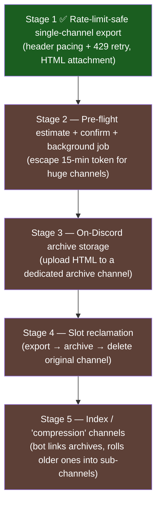

# 0915 — Channel Export → On-Discord Archive System

**Date:** 2026-06-04
**Status:** 🟡 Stage 1 implemented (rate-limit-safe fetch); Stages 2–5 designed, not built
**Related:** [RaP 0917 — Privileged Intents Analysis](0917_*.md) · [DiscordRateLimits.md](../standards/DiscordRateLimits.md) · existing `export_channel` handler (app.js), `channelExport.js`

---

## 🎯 The Goal (real-world driver)

A popular host (whom Reece helps) reuses the **same Discord server season after season**, creating **300+ channels per season × ~6 seasons/year**. Discord caps a guild at **500 channels**, so the server fills up. The end goal is to **export a channel's full history → store the archive on Discord itself → delete the original channel** to reclaim slots, with the bot orchestrating "compression"/index channels that link to older archives.

This RaP starts from the *existing* HTML-attachment export (Reece's Stuff → 📥 Export Channel) and sequences the path to that vision. Experimentation is isolated to **CastBot-Dev** (separate registered app, Reece is the only user, safe to rate-limit/crash).

---

## 🐞 Two bugs found (one code, one config)

### Bug 1 — Rate-limit crash on large channels
Exporting a busy log channel (#🪵action-log) **crashed at batch 35 (~3,500 messages)**:
```
❌ Channel export failed: Error: {"message": "You are being rate limited.", "retry_after": 0.3, "global": false}
    at DiscordRequest (utils.js:66)
```
**Root cause:** `DiscordRequest` reads **zero** rate-limit headers and **throws raw on 429**. The export loop used a fixed `300ms` delay (~3.3 req/s) against a ~1 req/s ceiling → guaranteed failure past ~13 batches. The elaborate handlers in `DiscordRateLimits.md` are aspirational examples, not wired into the request path.

### Bug 2 — All message content exports as `[no content]`
Every message in a test export rendered blank, despite the channel being full of text. **Reactions rendered fine; content did not.**

**Root cause:** Discord's **Message Content Intent** is a privileged intent that redacts `content`, `embeds`, `attachments`, and `components` server-side for any message the bot didn't author / isn't mentioned in — for **both** Gateway and REST. CastBot intentionally **removed** MessageContent (app.js:1551, per RaP 0917). So the "REST API only, no Privileged Intents required" claim on the export screen was **false** — you can *fetch* messages without it, but the text comes back empty.

**Proof (empirical, pure REST, no gateway):**
```
👤 Reece  content=0ch  embeds=0 components=0 attach=0 reactions=1   ← human msg, text MUST be in content
...
📊 10/10 messages have EMPTY content.
🛑 ALL content empty → Message Content Intent is NOT granted (portal toggle OFF).
```
Because the diagnostic uses pure REST with **no gateway connection**, this proves the **Developer Portal toggle** is the gate for REST content — *not* the gateway intents bitfield.

**Fix:** Enable **Message Content Intent** in the Developer Portal for CastBot-Dev. **No code change and no gateway-intent change required** — REST content is governed by the portal toggle alone, so this does **not** reintroduce the websocket-content memory cost RaP 0917 was avoiding (relevant given the prod OOM work). CastBot-Dev is in 24 guilds (<100), so the toggle is free (no Discord verification needed). There is **no code workaround** — the redaction is server-side.

> **Note for RaP 0917:** that analysis correctly removed MessageContent from *gateway* intents for memory reasons. The *portal toggle for REST-only content access* is a separate lever without that downside. This RaP refines 0917's conclusion specifically for the REST export use case.

### Bug 3 (latent) — Components V2 messages render blank
CastBot's own messages store their text in `components` (Text Display type 10), not `content`. The HTML generator only read `content`, so even with the intent enabled, bot messages would stay blank. Fixed in this stage (see below).

---

## 🔬 Rate-Limit Research

### Official model (docs.discord.com, 2026)
- **Global:** 50 req/s per bot token.
- **Per-route buckets** keyed by **major parameter** (`channel_id`) — each channel has its own independent bucket.
- **429 body:** `retry_after` (float seconds), `global` (bool); header `X-RateLimit-Scope` = `user`/`global`/`shared`.
- **Invalid-request ceiling:** 10,000 × (401/403/429) per 10 min → temporary **Cloudflare IP ban**. Our 429s are `scope: user` and **count** toward this — so never blind-retry.
- Per-route limits are deliberately undocumented; **headers are the only source of truth.**

### Empirical (measured live, CastBot-Dev, 2026-06-04)
`GET /channels/{id}/messages?limit=100`:

| Metric | Value |
|---|---|
| Bucket | `f9f85e747f3e` (per-channel) |
| Limit | **5 requests** |
| Window | **~5 seconds** |
| Sustainable rate | **~1 req/s** |
| 429 `retry_after` when hit | **0.357s** (small) |
| Scope | `user` |

- **Burst (no delay):** 429'd after 13 requests in 9.7s — reproduced the crash.
- **Paced (1.1s/req):** `remaining` stayed pegged at 4, **zero 429s across 25 requests** — confirmed safe rate.

Diagnostic scripts kept for reuse: `scripts/monitoring/rateLimitProbe.js`, `scripts/monitoring/exportContentDiagnostic.js`.

### Q&A
- **Can we GET >100 messages per request?** **No.** Discord hard-caps `limit=100` on `GET /channels/{id}/messages`; there is no bulk endpoint. Pagination is mandatory; 100 is the ceiling.
- **Throughput:** at ~5 batches per ~5s, ≈ 500 msgs/5s ≈ **~3,000–6,000 msgs/min** (network-dependent). A 13k-message channel (Reece's largest) ≈ **2–4 min**, comfortably inside the 15-min interaction token.
- **Storage:** ~400 bytes/msg HTML. 50 channels/month at avg 5k msgs ≈ 100 MB/month uncompressed (~12 MB gzipped). Disk is a non-issue on Lightsail; the constraints are rate limits + token lifetime + RAM.

---

## ✅ Stage 1 — Implemented

1. **`channelExportFetcher.js`** — `fetchAllChannelMessages(channelId, {onProgress})`:
   - Header-driven pacing via pure `computeRateLimitDelay()` (unit-tested): bursts the 5-request budget, waits `reset-after` when exhausted.
   - 429 backstop: reads `retry_after`, sleeps, retries the *same* cursor; aborts after 10 consecutive 429s (invalid-request safety).
   - **Self-contained** — does NOT touch the shared `DiscordRequest()` (load-bearing in prod).
2. **`channelExport.js`** — added `extractComponentText()` to render Components V2 message text (Bug 3).
3. **app.js** — handler now calls the fetcher; select-screen text corrected (removed false "no intents" claim, added large-channel + intent warnings — Bug 2/Q2).
4. **`tests/channelExportFetcher.test.js`** — covers the pacing logic.
5. **Manual:** enable Message Content Intent for CastBot-Dev (Bug 2 — only the user can do this).

---

## 🪜 Staged Approach (full sequence)



- **Stage 1 ✅** — Rate-limit-safe single-channel export. Header-aware fetch; keep HTML attachment delivery. *Stops the crash; usable today.*
- **Stage 2** — Pre-flight size estimate (channel-age heuristic; Discord has no count API) → confirm UI → tracked background job that posts its own result, escaping the 15-min interaction token for huge channels. Throttled progress edits.
- **Stage 3** — On-Discord archive storage (the vision): upload the HTML to a dedicated archive channel as a file; record CDN URL + metadata. Also fixes the htmlpreview/CDN-expiry "View Log" fragility — the file lives in a channel permanently.
- **Stage 4** — Slot reclamation: export → archive → **delete original channel**. Batch "archive whole category" op. *The actual fix for the 500-channel cap.* Channel deletes have their own bucket — same header-aware pacing applies.
- **Stage 5** — Index / "compression" channels: bot maintains an index message linking each archived channel to its HTML, rolling older archives into linked sub-channels as the index grows.

---

## ⚠️ Risks / Notes
- **Privacy:** archiving persists another server's message content. Keep the feature super-admin (Reece's Stuff) only; document retention.
- **Message Content Intent at 100+ guilds** would require Discord verification — both CastBot (33 guilds) and CastBot-Dev (24) are under that today.
- **Stage 4 deletes are destructive** — must be export-verified before deletion, with confirmation UI (cf. nuke-category pattern).

---

## 📎 Original Prompt (verbatim)

> document in a RaP now (or edit any existing RaP), answer my following questions, then re-paste your staged approach text for me to review
>
> my questions
> So GET /channels/{id}/messages?limit=100: <-- are you able to GET more than 100 messages at a time to make it more efficient?
> Not super concerned about the big channels, i checked the biggest and oldest one i could think of and it still only had 13k messages, however please ensure we put some warnings in the channel select screen
> execute stage 1 now
> I just tried to run an export and noticed a bit of a bug, all the messages are empty, see @temp/✨new-features-export-2026-06-04.html , proof that that channel has actual message content (its a fairly small channel, less than 100 messages I'd estimate)
>
> [Reece pasted the full #✨new-features changelog as proof of real content — Crafting System, React for Bans, Stores/Items Overhaul, Safari Player Improvements, MASSIVE UPDATE (Compact Castlist), Applications access, Idol Hunt, Safari QoL (Guides/Stamina/Quick Create), Custom React for Roles, Map Explorer player locations, Crafting Improvements, Player Claims — authored by ReeceBot/Reece/Jason/CastBot, Jan–May 2026.]
>
> happy for you to go ahead with stage 1, try see if that thing i just mentioned is a bug and fix it
> ultrathink

---
*Earlier context (same session): the export feature was built undocumented over 4 commits Mar 23–28 2026; the "View Log" link uses htmlpreview.github.io against a Discord CDN URL that expires ~24h, motivating self-hosting/on-Discord storage.*
