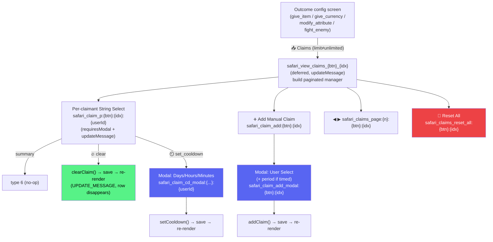

# 0916 — Per-Player Claims Management UI

**Date**: 2026-05-21
**Status**: Implementing
**Related**: [SafariCustomActions.md](../03-features/SafariCustomActions.md), [ComponentsV2.md](../standards/ComponentsV2.md), [LeanUserInterfaceDesign.md](../ui/LeanUserInterfaceDesign.md)
**Follows**: [0956 Action Terminology](0956_20260308_ActionTerminology_Analysis.md)

## Original Context (full unmodified user prompt)

> Okay so the requirement / problem: Server Admins do not have the ability to finely reset claims per-player-per-outcome, and the UX UI is currently separated to a view only ability, and a cart blanche 'reset all' for that outcome, not for the player. The view ability and reset all are very separated and disconnected as well.
> Logs of this stuff in action String Select:
> :white_small_square:ReeceBot | :ice_cube: On Cooldown | 1h 59m remaining
>
> On click / select, string select  options:
> :fire: Clear  (on select, immediately clears any of that players' claims including cooldown timer or others, webhook update of the parent container so the player disappears) <-- available to once_per_player, globally and timed
> :timer: Set Cooldown (opens a modal, review the modal used to set the cooldowns already for what text inputs and behaviors to use)  <-- available to timed actions only
>
> Add a button at the bottom - Add Manual Claim create an atomic reusable function and have this act as the UI to do so. On click, open a modal with a player select component, IF the outcome type is a timed action, also add the ability to set the specific time in text displays using the same pattern established for Set Cooldown above. Show the default in the text input placeholder text for hours / minutes.
>
> Lets modify the existing safari_view_claims_* UI
>
> The 'View Claims' button is also only visible (to my knowldge) for Item Claim Outcome types, add for any Outcome types where different claim types are supported (for example display text isnt supported)
>
> Ideal experience: we used a @docs/standards/ComponentsV2.md string select and string select options based view modelled after the Season Planner (including pagination buttons, possibly we made a reusable extracted version of this somewhere? [Season Planner logs showing planner_select_season, planner_page_*, planner_round_* hitting 40/40 components]
>
> Existing UI stuff following @docs/ui/LeanUserInterfaceDesign.md
> 📥 Claims | Make some quick bucks / 📋 Limit Type / ⏱️ Once Per Period — every 2h 0m / 📦 Give 1x FREE item | Outcome #2 / 📊 Status
> Status section replaces single Text Display that mashes all players etc together with one per player, default value displays the player details, on clicking it it gives options [Clear / Set Cooldown as above].
> [Add Manual Claim button; modify safari_view_claims_*; add View Claims to any outcome supporting claims]
> ultrathink

## 🤔 The Problem (plain English)

Admins can only **view** claims (a single Text Display mashing every claimant together) and **reset everything**
for an outcome — two divorced buttons, exposed on only two of the four claim-capable outcome types. There is no
way to clear/adjust **one** player, **manually add** a claim, or **set a player's cooldown**.

## 🏛️ Validated Current State (against code, not docs)

| Concern | Finding |
|---|---|
| Claim storage | `safariContent[guild].buttons[id].actions[i].config.limit.claimedBy` — array (once_per_player) / string (once_globally) / `{userId:ts}` (once_per_period) |
| Read-only view | `safari_view_claims_*` at `app.js:21205-21340`; Status = one Text Display with `<@id>` mentions; only action is generic `safari_modify_attr_reset_*` |
| View button exposure | Rendered only on `showGiveItemConfig` (always) + `showModifyAttributeConfig` (limit≠unlimited). **Missing** on give_currency + fight_enemy (both support limits) |
| Reset inconsistency | `once_globally` reset uses `delete` in item handler (`app.js:21185`) but `null` in currency handler (`app.js:21602`) — needs standardising |
| Factory modal/update | `buttonHandlerFactory.js:5003-5019`: `requiresModal:true` + `updateMessage:true` lets ONE handler return a modal (type 9, sent directly) OR components (UPDATE_MESSAGE). Same as `planner_round_action` |
| Period utils (reuse) | `utils/periodUtils.js`: `buildPeriodModalComponents`, `parsePeriodFromModal`, `formatPeriod`, `buildLimitOptions` |
| Planner pagination | Bespoke (`seasonPlanner.js:393-467`), NOT extracted — 10 selects/page, page in custom_id, `{type:6}` no-op for summary option |
| Name resolution | `<@id>` mentions DON'T render in select labels — must resolve `guild.members.fetch(id).displayName` (cache-first), pattern at `safariManager.js:1481` |

## 💡 Solution

Rewrite `safari_view_claims_*` into a paginated, interactive manager (Season Planner pattern). One String Select
per claimant (default option = status line shown as placeholder; options = 🔥 Clear / ⏲️ Set Cooldown[timed only]).
`➕ Add Manual Claim` + `🔄 Reset All` live in the same footer. All `claimedBy` mutation centralised in a new pure,
unit-tested `claimsManager.js`. Surface a single `📥 Claims` button on all four claim-capable outcome configs
(when `limit ≠ unlimited`), replacing the standalone "Reset Claims".

### Confirmed Decisions
1. **Set Cooldown = time remaining**: `claimedBy[userId] = now - periodMs + clamp(remainingMs, 0, periodMs)`.
2. **Single `📥 Claims` button** on config screens (Reset All moves inside the manager).
3. **Add Manual Claim = one player at a time** (ComponentsV2 modal field limits; once_globally caps at one anyway).

### Interaction Flow

### claimsManager.js (atomic, pure, testable)

`getClaimants(limit, now)`, `addClaim(limit, userId, {remainingMs, now})`, `clearClaim(limit, userId)`,
`setCooldown(limit, userId, remainingMs, now)`, `clearAllClaims(limit)`, `isTimed(limit)`.
Standardises `once_globally` empty → `null`. Covered by `tests/claimsManager.test.js`.

### Custom IDs
New ids use `:` delimiter (buttonIds contain `_`, never `:`). Worst case ≈ 77 chars (< 100 limit); warn at ≥ 90.
Legacy `safari_view_claims_{btn}_{idx}` kept (underscore) for the entry button.

## Files
`claimsManager.js` (new) + `tests/claimsManager.test.js` (new); `app.js` (view rewrite, 4 button handlers, 2 modal
submits, 2 config builders, dynamicPatterns); `customActionUI.js` (2 config builders); `buttonHandlerFactory.js`
(BUTTON_REGISTRY).

## Lessons / Risks
- Select labels can't use mentions → display-name resolution required; non-deferred `clear` path must be cache-first.
- `requiresModal:true` skips deferral (modals must be immediate) — `clear`'s save+re-render runs synchronously (<3s).
- Component budget: cap 10 claimants/page (≈33/40).
