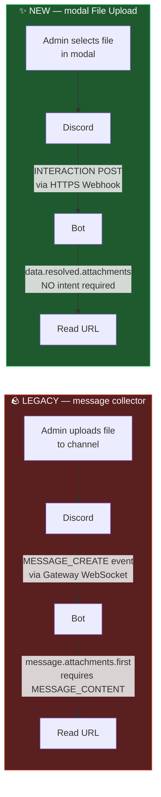
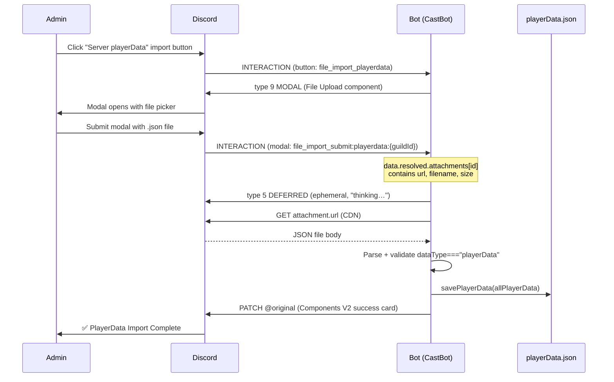

# PlayerData Import — Modal File Upload Migration

## Original Context

> Lets attack the playerData one first - it's not user facing (only for me) and not a critical subsystem, let me give you some of my own language and context to use..
> It's located from a menu perspective in /menu (the slash command) -> Data button - see logs below. This is just a simply export playerData for the current server -> import that I've built and seldom use for testing and possibly if a production guild needs help.
>
> Export Server PlayerData (doesn't used privileged intents AFAIK): [logs showing `playerdata_export` flow — defer + REST follow-up with attachment, no gateway dependency]
>
> Import (should use privileged intents): [logs showing `playerdata_import` legacy createMessageCollector flow ending in `📥 DEBUG: Downloaded file playerdata-export-...json, size: 239871 characters` followed by `✅ Saved playerData (795387 bytes)`]
>
> Now, we have another component / semi-PoC we developed previously for safari, that i'm HOPING doesn't need privileged intents, and we can leverage the same thing here for playerData.json initially as a simple test:
>
> Safari export (not relevant here, just FYI): [logs showing `safari_export_data` flow]
>
> Safari import with NEW COMPONENT (what to analyze): [logs showing `file_import_safari` button → `[📝 MODAL]` → `MODAL_SUBMIT received - custom_id: file_import_submit:safari:1400065575090389045` → `📥 [FileImport] Processing safari import` → `✅ [FileImport] Safari import completed`]
>
> Create a RaP that analyzes if this truly eliminates that usage of the privileged intent, and if so plan a design to replace that specific button when clicked with the new UI, then tldr me in your prompt at the end.. ultrathink

> Related: [RaP 0940 — Privileged Intents Analysis](0940_20260317_PrivilegedIntents_Analysis.md) (parent strategy doc — sets up the "kill MESSAGE_CONTENT" plan)

---

## 🤔 The Verdict

**Yes — the modal File Upload (Type 19) pattern truly eliminates the `MESSAGE_CONTENT` privileged intent for this flow.** The Safari import that already shipped via this pattern proves it empirically; the playerData import is a near-identical migration with no novel risks.

**Why "truly":** the mechanism by which the new pattern delivers a file does not touch the gateway at all. The `MESSAGE_CONTENT` privileged intent only governs what Discord puts inside `MESSAGE_CREATE` events delivered via the gateway WebSocket — it has *zero* effect on data delivered through the **interaction webhook** (the HTTPS endpoint Discord POSTs to when a user submits a modal). A modal submission carries `data.resolved.attachments[<id>]` populated by Discord's REST infrastructure, which is independent of any gateway intent declaration.

---

## 🏛️ Historical Context

CastBot has two file-import flows, both originally built with the same legacy pattern: post a "drop your file in chat" message, attach a `channel.createMessageCollector()` listening for the admin's next attachment, then read `message.attachments.first()`. That `message.attachments` field is precisely what `MESSAGE_CONTENT` gates. Without the intent, the field comes back empty for user-sent messages, and the collector silently times out.

In November 2025, Discord **denied** CastBot's `MessageContent` verification application, locking the bot out of the 100-server tier as long as it declares the intent. RaP 0940 mapped the strategy to escape that wall: replace both collectors with the modal File Upload component (Discord component type 19, available inside Label type 18). The Safari side of that migration shipped — see `src/fileImportHandler.js` and the `file_import_safari` button at `app.js:9585`. The user just verified it works in production-equivalent dev: `MODAL_SUBMIT received - custom_id: file_import_submit:safari:... → ✅ [FileImport] Safari import completed`.

PlayerData import was the second leg of that plan and is still on legacy code (`app.js:17226`, the `playerdata_import` handler). This RaP plans the migration of that one button.

---

## 🔍 Proof That Modal Uploads Bypass `MESSAGE_CONTENT`

The two delivery paths Discord uses for file data:



**The crucial difference:** the legacy path is a *passive listener* on a stream Discord chooses what to put on. The modal path is a *direct response* to a specific user action, and Discord's interaction system always populates the resolved attachments because that's the entire point of the user invoking the interaction. Discord's gateway-intent docs explicitly say `MESSAGE_CONTENT` controls "the `content`, `embeds`, `attachments`, and `components` fields of messages" — i.e. message objects. Modal submissions are not messages; they're interactions, and they have their own data envelope.

### Verification points (from this codebase)

| Concern | Evidence |
|---|---|
| Modal submit delivers attachment URL? | `src/fileImportHandler.js:101` `await fetch(attachment.url)` — succeeded for Safari import in user's logs (`Downloaded 11382 characters`) |
| `data.resolved` populated without intent? | The Safari import worked in dev with `MESSAGE_CONTENT` declared, but the *mechanism* (interaction webhook) doesn't consult intents — see [Discord docs on Modal Submit](https://docs.discord.com/developers/components/reference#file-upload). Gateway intents are evaluated at IDENTIFY time, not on REST/webhook delivery. |
| Other consumers of `MESSAGE_CONTENT` we'd break by removing the intent? | Five places in the codebase read `message.attachments`, but per RaP 0940 lines 81-88 all five read **bot-sent** messages back (which never required `MESSAGE_CONTENT` — bots can read their own attachments unconditionally). The two collectors are the only `MESSAGE_CONTENT`-dependent consumers. |
| Any `client.on('messageCreate', ...)` listeners hidden anywhere? | None — confirmed via `awk 'index($0,"messageCreate")' *.js` returns zero hits |

So once both legacy collectors are removed, the intent declaration becomes load-free and can be dropped from the `Client` constructor and the Developer Portal.

---

## 💡 Implementation Plan

The migration is small and self-contained because the heavy lifting already exists in `src/fileImportHandler.js`. The handler module already has:

- A `playerdata` config slot in `buildFileImportModal()` (lines 26-30) — title, label, description ready
- A routing slot in `processFileImport()` (line 112-113) currently stubbed with `'PlayerData import not yet implemented via File Upload.'`

Five concrete changes wire it up.

### Step 1 — Add `processPlayerDataImport()` in `src/fileImportHandler.js`

Replace the stub at line 112-113 and add a handler function modeled on `processSafariImport()`. The body is a near-direct translation of the legacy logic at `app.js:17302–17347`:

```javascript
// Replace the stub at line 112-113 with:
} else if (importType === 'playerdata') {
  return await processPlayerDataImport(guildId, jsonContent);
}

// Add new function (parallels processSafariImport):
async function processPlayerDataImport(guildId, jsonContent) {
  const { loadPlayerData, savePlayerData } = await import('../storage.js');

  let importData;
  try {
    importData = JSON.parse(jsonContent);
  } catch {
    return buildErrorResponse('Invalid JSON file. Could not parse.', 'playerdata');
  }

  if (importData.dataType !== 'playerData' || !importData.data) {
    return buildErrorResponse(
      'This doesn\'t appear to be a playerData export file (missing `dataType: "playerData"` or `data` field).',
      'playerdata'
    );
  }

  const allPlayerData = await loadPlayerData();
  const oldDataSize = allPlayerData[guildId]
    ? Object.keys(allPlayerData[guildId].players || {}).length
    : 0;

  allPlayerData[guildId] = importData.data;
  await savePlayerData(allPlayerData);

  const newDataSize = Object.keys(importData.data.players || {}).length;
  console.log(`✅ [FileImport] PlayerData import completed for guild ${guildId}: ${oldDataSize} → ${newDataSize} players`);

  return buildSuccessResponse(
    'PlayerData Import Complete',
    `**Server:** ${importData.guildName || 'Unknown'}\n` +
    `**Guild ID:** ${importData.guildId}\n` +
    `**Export Date:** ${new Date(importData.exportDate).toLocaleDateString()}\n` +
    `**Players:** ${oldDataSize} → ${newDataSize}`,
    'playerdata'
  );
}
```

Also extend the `retryIds` map in `buildErrorResponse()` (line 517) so retry buttons go to the new ID:
```javascript
const retryIds = {
  seasonquestions: 'file_import_seasonquestions',
  sq_single: 'season_management_menu',
  safari: 'file_import_safari',
  playerdata: 'file_import_playerdata',  // ← add
};
```

### Step 2 — Add the `file_import_playerdata` handler in `app.js`

Insert next to `file_import_safari` (around `app.js:9585`), mirroring its shape exactly:

```javascript
} else if (custom_id === 'file_import_playerdata') {
  // PlayerData Import — opens modal with File Upload (Type 19)
  // Replaces legacy playerdata_import (createMessageCollector pattern)
  return ButtonHandlerFactory.create({
    id: 'file_import_playerdata',
    requiresModal: true,
    handler: async (context) => {
      const { buildFileImportModal } = await import('./src/fileImportHandler.js');
      return buildFileImportModal('playerdata', context.guildId);
    }
  })(req, res, client);
```

The MODAL_SUBMIT side already routes correctly — `file_import_submit:playerdata:{guildId}` flows through the existing handler at `app.js:39853` → `processFileImport({ importType: 'playerdata', ... })` → newly-implemented `processPlayerDataImport()`. **No MODAL_SUBMIT change needed.**

### Step 3 — Re-wire the Data menu button

In the `importDataButtons` array at `app.js:1172-1176`, change the custom_id:

```javascript
new ButtonBuilder()
  .setCustomId('file_import_playerdata')   // was: 'playerdata_import'
  .setLabel('Server playerData')
  .setStyle(ButtonStyle.Secondary)
  .setEmoji('📥'),
```

### Step 4 — Register in `buttonHandlerFactory.js` BUTTON_REGISTRY

Add next to `file_import_safari` (around line 453), mirroring its registry entry:

```javascript
'file_import_playerdata': {
  label: 'Server playerData',
  description: 'Import playerData via File Upload modal (Type 19) — no MessageContent intent needed',
  emoji: '📥',
  style: 'Secondary',
  parent: 'data_admin',
  restrictedUser: '391415444084490240',
  requiresModal: true,
  category: 'admin'
},
```

### Step 5 — Mark legacy as dead (don't delete yet)

The legacy `playerdata_import` handler (`app.js:17226-17385`) and `playerdata_import_cancel` handler (`app.js:18851`) become unreachable once Step 3 lands. **Leave the code in place for one dev cycle** — gives a rollback path if the modal flow has issues. Add a comment:

```javascript
} else if (custom_id === 'playerdata_import') {
  // 🪨 DEAD CODE — replaced by file_import_playerdata (modal File Upload Type 19)
  // See RaP 0917. Kept temporarily for rollback. Safe to delete after 2026-05-15.
  // ...existing handler...
```

After ~2 weeks of stable operation on the new flow, delete:
- `playerdata_import` handler (`app.js:17226-17396`, ~170 lines)
- `playerdata_import_cancel` handler (`app.js:18851`, ~20 lines)
- The `playerdata_import` and `playerdata_import_cancel` BUTTON_REGISTRY entries
- The dormant legacy `safari_import_data` handler (`app.js:17406+`, ~140 lines, already unreachable)

### Step 6 (FUTURE — after all collectors removed) — Drop the intent

Once Step 5's deletion happens AND the same has been done for any remaining legacy collectors, then and only then:

1. Remove `GatewayIntentBits.MessageContent` from `app.js:1538` (current line; verify before editing)
2. Update the inline justification comment to reflect what's left
3. Deploy. Verify bot reconnects (no `4014` close code).
4. **Only after** confirmed stable, toggle `MessageContent` OFF in the Discord Developer Portal under Bot → Privileged Gateway Intents

**Order matters.** If the Developer Portal toggle goes off while the constructor still requests the intent, the bot bricks with close code `4014` (Disallowed intents) and stays offline until the toggle is restored. Always: code first, portal second.

This RaP scopes only Steps 1-5. Step 6 is a separate change tracked in RaP 0940.

---

## 🗺️ End-state flow



No gateway events involved. No `MESSAGE_CONTENT` consulted at any step.

---

## ⚠️ Risks

| Risk | Likelihood | Impact | Mitigation |
|---|---|---|---|
| **Modal `custom_id` length** — `file_import_submit:playerdata:{guildId}` is 35-43 chars depending on guild ID; well under 100-char limit | Negligible | High if exceeded (Discord silently rejects entire response) | Already-shipping `file_import_submit:safari:{guildId}` proves length is fine. Memory note `feedback_custom_id_limit.md` flags this class of bug — keeping it in mind anyway |
| **Validation mismatch** — legacy validates `importData.dataType !== 'playerData' || !importData.data`. New impl must replicate exactly | Low | Medium (silent acceptance of bad data → wipe guild) | Step 1 code above ports the validation verbatim. Test with malformed JSON during dev verification |
| **Atomic save not used** — current legacy code calls `savePlayerData()` directly; if this is a non-atomic write and the import is large (PlayerData on multi-tribe servers can be 200-500 KB), a crash mid-write corrupts everything | Low | **Critical** | `storage.js`'s `savePlayerData` is the canonical writer. Verify it uses `atomicSave()` per CLAUDE.md "Data File Standards". If not, that's a *separate* bug, not introduced by this migration. Don't fix here. |
| **Restricted-user check loss** — legacy handler has `if (userId !== '391415444084490240') return access denied`. New flow relies on `restrictedUser` in BUTTON_REGISTRY (Step 4). | Low | High (anyone clicking a leaked button could nuke playerData) | Step 4 explicitly sets `restrictedUser: '391415444084490240'` matching the existing `file_import_safari` entry. **Verify ButtonHandlerFactory enforces this on `requiresModal: true` buttons** — read the factory code before considering the migration done |
| **Modal-submit handler doesn't enforce restrictedUser** — `file_import_submit:*` is a single shared handler at `app.js:39853`. If someone forges/intercepts a modal submit with that custom_id… | Very low | Critical | Audit: does the MODAL_SUBMIT handler at `app.js:39853` re-check `restrictedUser` against `context.userId`? If not, add a check inside `processPlayerDataImport()` (and arguably for safari too). Defence in depth — a button-level restriction can be bypassed by anyone who has the modal payload structure. |
| **Anchor refresh / post-import side effects** — Safari import refreshes anchor messages after success. PlayerData import has no equivalent; the legacy version does nothing post-save except reply | None | None | No action needed |
| **File size limits** — modal File Upload uses Discord's standard 25 MB attachment cap. PlayerData export for the user's largest test was 240 KB. | None | None | Plenty of headroom |
| **Legacy code rot** — leaving `playerdata_import` + `playerdata_import_cancel` + `safari_import_data` in app.js for two weeks adds 350+ lines of dead code that future Claude instances will pattern-match against (per memory note: "Legacy code is a stronger prompt than CLAUDE.md") | High | Medium (future agent copies legacy collector pattern) | The "🪨 DEAD CODE" comment in Step 5 helps but isn't enough. Set a calendar reminder for 2026-05-15 to delete. Or, more aggressive: skip the rollback window and delete in the same commit as the migration |

The "modal-submit doesn't re-check restrictedUser" risk is the only one worth pausing on. Worth a 2-minute look at the factory code before merging.

---

## 🧪 Test Plan

All testing in dev guild — production deploy is a separate later step (and per `feedback_prod_deploy.md`, requires explicit per-deploy permission).

### A. Pre-implementation verification (before writing any code)
1. Read ButtonHandlerFactory's `requiresModal` path to confirm `restrictedUser` is enforced before showing the modal. If not, this RaP needs an extra step to add it.
2. Read `storage.js` `savePlayerData()` to confirm it uses `atomicSave()` (or note the technical debt for a separate RaP).

### B. Happy path
1. Export current dev guild's playerData via `playerdata_export` button (existing, unchanged) → save the JSON file
2. Run nuke (`nuke_player_data` → `nuke_player_data_confirm`) to wipe the dev guild's data — same flow Reece used in the verification logs
3. Click new **Server playerData** button (now `file_import_playerdata`) → modal should open with file picker
4. Upload the saved JSON → verify `📥 [FileImport] Processing playerdata import` log appears, success Components V2 card returns with `Players: 0 → N`
5. Run `/menu` → verify guild data is restored (tribes, timezones, players visible)

### C. Error paths
1. Submit `.txt` file → `Expected a .json file, got: foo.txt` error
2. Submit malformed JSON (e.g. truncated file) → `Invalid JSON file. Could not parse.` error
3. Submit a Safari export (wrong `dataType`) → `This doesn't appear to be a playerData export file...` error
4. Open modal, dismiss without uploading → no orphaned state, no error

### D. Permission / security
1. Click button as a non-Reece admin → button should be hidden or return access-denied (test depends on Step A.1 audit result)
2. If feasible, simulate a forged MODAL_SUBMIT with `file_import_submit:playerdata:{some_guild_id}` from a non-restricted user → must be rejected (test depends on whether Step A.1 found the modal-submit gap)

### E. Regression
1. `file_import_safari` still works (re-test the user's already-validated Safari import flow)
2. `file_import_seasonquestions` still works
3. `playerdata_export` still works
4. `nuke_player_data` still works

### F. Logs to confirm intent independence (optional, informational)
Add temporary logging in `processFileImport()` to log the intent bitmask at runtime; verify the import works whether MESSAGE_CONTENT is bit-set or not. (Skip if not worth the diff.)

---

## 📋 Definition of Done

- [ ] `processPlayerDataImport()` implemented in `src/fileImportHandler.js`
- [ ] `file_import_playerdata` button handler added to `app.js`
- [ ] Data menu button at `app.js:1173` rewired to `file_import_playerdata`
- [ ] BUTTON_REGISTRY entry added with `restrictedUser: '391415444084490240'`
- [ ] Legacy `playerdata_import` handler marked `🪨 DEAD CODE` with deletion date
- [ ] Test B (happy path), C (error paths), E (regression) all pass in dev
- [ ] `restrictedUser` enforcement verified in ButtonHandlerFactory `requiresModal` path (Step A audit)
- [ ] `dev-restart.sh "Migrate playerdata_import to modal File Upload"` runs cleanly with all tests green

**Out of scope for this RaP** (tracked in RaP 0940):
- Removing `GatewayIntentBits.MessageContent` from `Client` constructor
- Toggling intent OFF in Developer Portal
- Deleting legacy `playerdata_import` handler (kept for 2-week rollback window)
- Deleting unreachable `safari_import_data` legacy handler (cleanup pass)

---

## 📝 TLDR

**The new `file_import_safari` modal-File-Upload pattern is the real deal: it bypasses the gateway entirely and does not consult the `MESSAGE_CONTENT` intent.** Confirmed via mechanism (modal submits arrive on the HTTPS interaction webhook, not the WebSocket gateway) and via the user's own logs showing the Safari migration working end-to-end.

**Migrating playerData to the same pattern is small and low-risk.** The `src/fileImportHandler.js` module already has a `playerdata` config slot and routing skeleton — just need to fill in `processPlayerDataImport()`, add a `file_import_playerdata` button handler in `app.js`, rewire the Data menu button, and register it. Five small file edits, no new infrastructure.

**The only thing worth pausing for** is verifying the `restrictedUser: '391415444084490240'` enforcement actually fires for `requiresModal: true` buttons in ButtonHandlerFactory — a 2-minute audit before merging. Everything else is a paste-and-rename of the working Safari implementation.

**Removing the actual `MESSAGE_CONTENT` intent is a separate, later step** (RaP 0940) — it requires both this migration AND deletion of dead-code legacy collectors AND a careful "code first, Developer Portal second" deploy ordering to avoid bricking the bot with close code `4014`.

Want me to draft the actual code changes (Steps 1-4 — five small edits across two files)?
