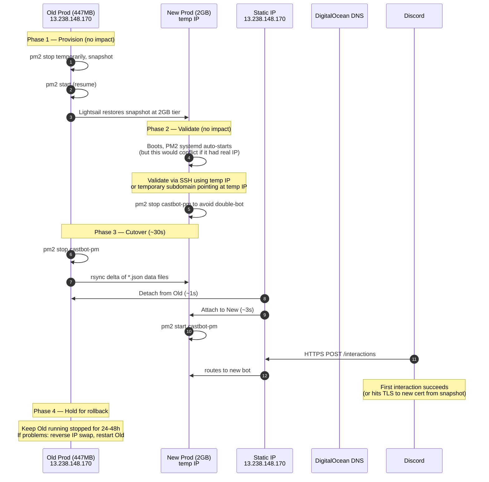
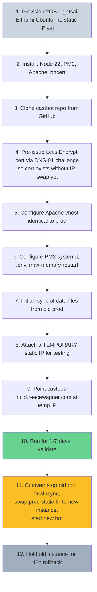
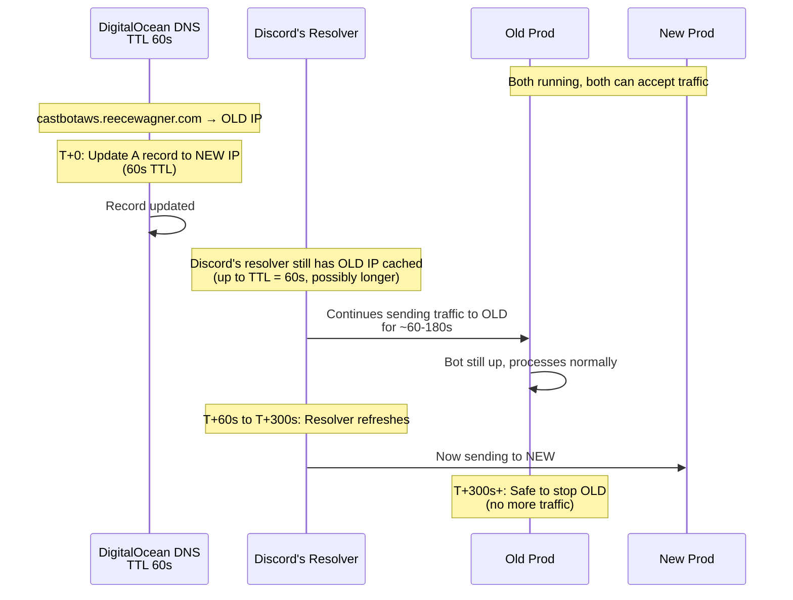
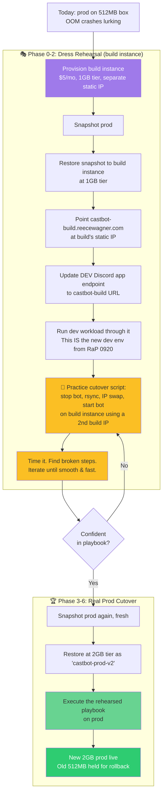
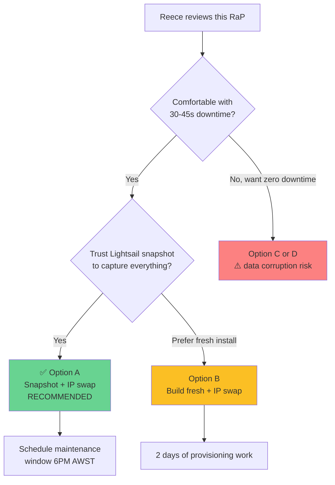

# 🔄 Prod Cutover Strategy — Bigger Box, No Drama

## 📋 Original Context / Trigger Prompt

> Ok so I have an idea.. read [0920_NewBuildInfrastructure_Analysis] - what if i used this approach, set up new infra, made sure it all worked then switched that over as the prod infra
>
> The only concern i have is in lightsail you can't just 'resize' infrastructure, and with the static IP and stuff going on between digitalocean etc and discord with the interactions URL endpoint, i'm not sure of timing and it could be highly risky if we need to do that
>
> Can you consider that and give several options for cutover / transition / deployment / provisioning that could enable us a 'fast changeover' to a higher server instance, mininising user downtime

---

## 🤔 The Problem in Plain English

Prod is a 447MB Lightsail box. After [Incident 03](../incidents/03-V8HeapOOMCrash.md) we know the V8 heap is bumping the ceiling — bot crashed mid-`JSON.parse()`. We want to move to a 2GB box (4× headroom, real future-proofing). But:

1. **Lightsail can't resize in place.** Period. The official path is "snapshot → create new instance from snapshot at desired size."
2. **Discord doesn't have a maintenance mode.** While the new box is being prepared, every interaction needs to land somewhere alive.
3. **Three coordinated systems** all need to agree on where prod lives:
   - DigitalOcean DNS (`castbotaws.reecewagner.com` A record)
   - Lightsail Static IP (currently `13.238.148.170`)
   - Discord Developer Portal (Interactions Endpoint URL)
4. **Discord retries are short.** A failed interaction has ~3 seconds of retry budget before users see "interaction failed."

The cutover is the entire risk. Provisioning is cheap. Validation is cheap. **The 60 seconds where traffic moves is the part that wakes you up at 3 AM.**

---

## 🏛️ Historical Context — What's Actually Coupled to What?

Let's untangle the dependency chain so we know which knob does what:

```mermaid
flowchart LR
    Discord[Discord<br/>HTTPS POST to URL]
    Endpoint[Discord Endpoint Setting<br/>castbotaws.reecewagner.com/interactions]
    DNS[DigitalOcean DNS<br/>A record → static IP]
    StaticIP[Lightsail Static IP<br/>13.238.148.170]
    Apache[Apache + TLS cert]
    Node[Node.js + PM2]

    Discord --> Endpoint
    Endpoint -->|DNS lookup| DNS
    DNS -->|resolves to| StaticIP
    StaticIP -->|attached to| Apache
    Apache -->|reverse-proxy 443→3000| Node

    style Discord fill:#5865F2,color:#fff
    style StaticIP fill:#fbbf24
    style DNS fill:#0080FF,color:#fff
```



**Key insight:** Discord doesn't know anything about IPs. It knows a URL. As long as the URL resolves to a host that has the right cert and answers /interactions, Discord is happy.

This means **moving the static IP between instances is invisible to Discord.** No re-validation, no DNS propagation wait, no Discord developer portal action. The Lightsail static IP is the magic atomic switch.

---

## 🎯 What "Minimal Downtime" Actually Means

Let's quantify what's tolerable:

| Downtime | User experience |
|---|---|
| 0–3s | Discord retries succeed, no user notices |
| 3–30s | Active users get one "interaction failed", retry works |
| 30s–2min | Multiple "interaction failed", users start asking in chat |
| 2–10min | Game moderators DM Reece |
| 10min+ | Mid-Safari/voting events break, real harm to live games |

**Realistic target: under 60 seconds of traffic gap.** Sub-30s is achievable. Sub-3s is theoretically possible but probably not worth the engineering.

---

## 🌟 Four Cutover Options Considered

### Option A — Snapshot → Restore at Larger Tier → Static IP Swap (**RECOMMENDED**)

The Lightsail-native path. Treat the entire production server as a unit and atomically move it to a bigger box.



**Why this is the safest:**
- Snapshot captures **everything**: TLS cert, Apache vhost, PM2 dump, systemd service, node_modules, .env. No "did I forget to copy X?" risk.
- Static IP swap is atomic — Lightsail API operation, not DNS-dependent.
- New instance has proven cert (it's literally a copy).
- Rollback = reverse the IP swap, restart old bot. Same recovery profile.
- All three external systems (DNS, Discord endpoint, IP) are untouched on the day of cutover. The only thing that changes is which physical machine the IP points to.

**Estimated downtime: 30–45 seconds.**

**Risks:**
- Snapshot takes 5–15 min in Lightsail; a busy bot during snapshot = inconsistent data files captured. **Mitigation**: snapshot during low-traffic window (6PM AWST = ~6AM ET, US users mostly asleep) AND do a final rsync delta at cutover time.
- New instance might not have tested under real Discord load. **Mitigation**: validate via temp IP/subdomain before cutover.

---

### Option B — Build Fresh Instance + Rsync + Static IP Swap

Same cutover mechanism as A, but the new box is built from scratch (Bitnami template) rather than restored from snapshot. This is the "RaP 0920 build approach but for prod."



**Why you'd choose this over A:**
- Clean slate — known-good packages, latest patches, no inherited cruft (e.g., the 4 weeks of accumulated PM2 logs, the messageHistory.json from March, etc.)
- Lets you validate the new box runs the bot correctly under realistic conditions before cutover
- DNS-01 cert issuance is invisible to users — no traffic flips needed for the cert

**Why not A:**
- Manual configuration is the entire risk surface — every step is "did I do that right?"
- You probably miss something subtle (sysctl tuning, pm2-logrotate config, env var, locale setting)
- Slower to set up: 1-2 days vs 30 minutes

**Estimated downtime at cutover: 30–45s** (same as A — same mechanism)

**Estimated total provisioning time: 1-2 days of setup work**

---

### Option C — Build Fresh + DNS Cutover

Same as B, but at cutover you change the DNS A record instead of swapping the static IP. New instance keeps its own static IP forever.



**Why this seems appealing:**
- True zero-downtime in theory — both boxes serve simultaneously
- No Lightsail static IP gymnastics

**Why it's actually the WORST option:**
- **You can't trust resolver TTLs.** Discord's infra might cache longer than 60s. ISPs cache aggressively. We've seen 5+ minute lag with low TTL on DigitalOcean.
- **Both boxes are writing to data files in parallel.** Whichever box gets the LAST write before traffic fully shifts → that's your authoritative data. The other box's writes are lost. This is a **silent data corruption risk** for any guild that interacts during the transition window.
- **No clean cutover point** — you can't say "cutover happened at HH:MM:SS"
- **Rollback is the same problem in reverse** — another DNS change, another caching window, another data divergence

Avoid this option for any service that mutates state on every request. (Stateless web apps would be fine here. CastBot isn't one.)

---

### Option D — Build Fresh + Discord Endpoint URL Flip

Two boxes, two domains, two static IPs. At cutover, change the Discord Developer Portal Interactions Endpoint URL from `castbotaws.reecewagner.com/interactions` to `castbot-prod-v2.reecewagner.com/interactions`.

**How it works:**
1. New box at `castbot-prod-v2.reecewagner.com` with its own cert and IP
2. Validate fully (it's a real production-equivalent endpoint that Discord can hit if pointed at)
3. In Discord Developer Portal: edit Interactions Endpoint URL
4. Discord sends a PING to validate the new URL
5. On success, Discord switches all subsequent traffic to the new URL

**Why this seems appealing:**
- No DNS changes
- No IP swap
- Reversible by editing one field

**Why it's not the best:**
- **Same data-divergence problem as Option C** during the brief window where Discord might still send some traffic to old (during PING validation, retries, etc.)
- Discord caches the validated URL but **does its own DNS resolution** — TTL still matters for the new domain
- Re-validating endpoints can fail in subtle ways (cert chain quirks, IPv6, etc.) and you're doing it under pressure
- Permanent footprint of `castbot-prod-v2` subdomain (or you have to do another flip later to rename)

**Estimated downtime: ~10–30s of validation + whatever Discord's edge takes to fully switch**

---

## 📊 Comparison Matrix

| Aspect | A: Snapshot+IP swap | B: Fresh+IP swap | C: DNS cutover | D: Discord endpoint flip |
|---|---|---|---|---|
| **Downtime** | 30–45s | 30–45s | Theoretically 0, practically risky | 10–30s |
| **Data corruption risk** | None (hard cutover) | None (hard cutover) | **Real** (parallel writes) | **Real** (parallel writes) |
| **Setup time** | 30 min | 1-2 days | 1-2 days | 1-2 days |
| **Atomic switchover** | Yes | Yes | No | Mostly |
| **Rollback time** | 30s (reverse IP swap) | 30s (reverse IP swap) | Minutes (DNS again) | 10-30s (revert URL) |
| **DNS changes at cutover** | None | None | **Required** | None |
| **Discord changes at cutover** | None | None | None | **Required** |
| **Discoverability of issues** | Same prod, just bigger | Clean install, surfaces quirks | — | — |
| **Risk of "forgot to copy X"** | Near zero | Real | Real | Real |
| **Risk of cert issues** | Near zero | Medium (manual cert) | Medium | Medium |
| **Upfront cost** | ~$10/mo new instance | ~$10/mo new instance | ~$10/mo new instance | ~$10/mo new instance |
| **Cutover complexity** | Low | Low | Medium | Medium |

---

## 🥇 Refined Recommendation: Option A + Dress Rehearsal on Build Instance

**(Update 2026-04-20, after Reece's input)**

The sharp evolution of the plan: **stand up the build instance from [RaP 0920](0920_20260417_NewBuildInfrastructure_Analysis.md) at a smaller tier first, and practice the entire cutover playbook on it before touching prod.** Two birds, one snapshot.

### What This Means in Practice



### Why This Is Better Than Pure Option A

| Benefit | Detail |
|---|---|
| **Two outcomes from one effort** | Build instance becomes permanent dev environment (RaP 0920 delivered as side-effect). Cost amortizes — you were going to do this anyway. |
| **Real practice, not theory** | Every step of the cutover playbook gets executed end-to-end on real Lightsail infrastructure before it touches prod |
| **Surfaces unknown unknowns** | "Does Lightsail's IP detach actually take 3 seconds?" "Does the Bitnami snapshot include the cert?" — you find out on a throwaway box, not on prod |
| **Builds muscle memory** | When you finally do the prod cutover, your fingers know the sequence. No reading the script under pressure. |
| **Tests rollback both directions** | Practice swapping IP back and forth between two build instances. Confirms reversibility BEFORE you need it for real. |
| **Discoverable timing** | You'll know "rsync of 6MB JSON deltas takes ~4s" instead of guessing |
| **Permanent DR capability** | After this, you have a documented, rehearsed playbook to rebuild prod from snapshot in ~45 minutes if anything ever happens |

### The Practice Script — What "Dress Rehearsal" Actually Looks Like

You need TWO build instances briefly to practice the IP swap:

1. **Build-A** (1GB, $5/mo): primary dev environment (the RaP 0920 outcome). Has static IP `BUILD_IP_1`. Domain `castbot-build.reecewagner.com` points here.
2. **Build-B** (1GB, $5/mo, temporary): the "target" for practice cutovers. No domain pointed at it. Has static IP `BUILD_IP_2`.

**Rehearsal cycle (run 2-3 times until smooth):**

```bash
# === Initial: bot running on Build-A, traffic via castbot-build URL ===

# Step 1: Snapshot Build-A (this is what you'll do to prod)
# (via Lightsail console or CLI)

# Step 2: Restore snapshot to a fresh Build-B at LARGER tier (e.g., 2GB)
# This proves the cross-tier restore works

# Step 3: Validate Build-B: SSH in, pm2 stop castbot-pm (DON'T let it claim Discord token)
# Verify cert, .env, files, etc.

# Step 4: Execute cutover script (timed!)
START=$(date +%s.%N)
ssh build-a "pm2 stop castbot-pm"
rsync -avz build-a:/opt/bitnami/projects/castbot/{playerData,safariContent,scheduledJobs,dstState,restartHistory,messageHistory,data_whispers}.json ./tmp/
rsync -avz ./tmp/ build-b:/opt/bitnami/projects/castbot/
aws lightsail detach-static-ip --static-ip-name castbot-build-ip
aws lightsail attach-static-ip --static-ip-name castbot-build-ip --instance-name build-b
ssh build-b "pm2 start castbot-pm"
END=$(date +%s.%N)
echo "Total cutover: $(echo "$END - $START" | bc)s"

# Step 5: Test in dev Discord — does /menu work?

# Step 6: ROLLBACK PRACTICE
# Reverse the swap, time it, prove it works
```

**Iterate until:**
- Total cutover time < 60s (target 30-45s)
- No manual interventions required mid-script
- Rollback proven to work in same time budget

### After Rehearsal, Build Instance Becomes Permanent Dev

Once you've practiced the playbook 2-3 times:
- **Delete Build-B** (the practice target). Stop paying for it.
- **Build-A stays** as your permanent dev environment, fully delivering RaP 0920
- **Retire ngrok + laptop dev loop** per RaP 0920 Phase 8

You now have:
- Working dev environment in the cloud (laptop can sleep — RaP 0920 ✅)
- Battle-tested cutover playbook (RaP 0919 ready to execute on prod)
- Snapshot retained as DR insurance

### Cost Reality Check

| Item | RaP 0920 alone | RaP 0919 alone | Combined approach |
|---|---|---|---|
| Build-A (1GB, permanent) | $5/mo | — | $5/mo |
| Build-B (1GB, ~3 days for practice) | — | — | ~$0.50 prorated |
| New prod (2GB, post-cutover) | — | $10/mo | $10/mo |
| Old prod retired | $3.50/mo → $0 | $3.50/mo → $0 | $3.50/mo → $0 |
| **Net steady-state** | **$5/mo extra** | **$7/mo extra** | **$11.50/mo extra** |

For ~$11.50/mo extra you get: cloud-hosted dev + 4× prod RAM + a rehearsed cutover playbook. Cheap.

### Why Not Just Use Build Instance As New Prod?

Tempting shortcut: skip the prod cutover entirely. Just promote Build-A to be the new prod by re-pointing DNS / IP swap.

**Don't.** Reasons:
- Build-A has been running with **dev** Discord token, dev data — it has weeks of test cruft in playerData.json
- Build-A's role separation matters: dev should be safely destructive (you want to test Safari resets, role wipes, etc. without fear). Prod should be inviolate.
- Mixing roles leads to "wait, which database is real?" confusion exactly when you don't want it

Keep build as build. Cutover prod as a separate event using the rehearsed playbook.

---

## 🏆 Original Recommendation: Option A (Snapshot + Static IP Swap)

**(Kept for reference — superseded by the refined recommendation above)**

**Why A wins over B:**
- The snapshot captures *every* subtle config we might forget. After 4+ weeks of running, prod has accumulated configs, env vars, systemd unit files, cron entries, locale settings, and Apache vhost edits we don't remember making. Snapshot brings them all.
- Setup is 30 minutes vs 1-2 days
- The validation phase (Phase 2 below) gives us all the "make sure it works" benefit of a fresh build, without the manual setup risk

**Why A wins over C and D:**
- Hard cutover at the IP layer eliminates the parallel-writes data corruption risk
- No external systems (DNS, Discord) need to change at the moment of cutover — fewer moving parts under time pressure
- Rollback is the same operation in reverse (re-attach IP to old) — symmetric, well-understood

---

## 🛠️ Detailed Cutover Plan (Option A)

### Phase 1 — Provision (zero user impact, ~20 min)

1. **Choose maintenance window**: 6PM AWST (= ~6AM ET, lowest US activity)
2. **Quick PM2 stop** to get a clean snapshot (~10s outage):
   ```bash
   pm2 stop castbot-pm
   # In Lightsail console: Snapshots → Create snapshot → "castbot-pre-cutover-YYYYMMDD"
   pm2 start castbot-pm
   ```
   *Alternative: skip the stop, accept that data files might be mid-write at snapshot time. The final rsync at cutover catches deltas.*
3. **Wait for snapshot to complete** (5–15 min in Lightsail)
4. **Restore snapshot to new instance** at 2GB tier:
   - Lightsail console: Snapshots → "castbot-pre-cutover-…" → Create new instance
   - Plan: 2GB RAM, 2 vCPU, 60GB SSD ($10/mo)
   - Region: ap-southeast-2a (same as prod)
   - **Don't** attach the prod static IP yet — it gets a temporary public IP

### Phase 2 — Validate (zero user impact, ~30 min)

1. **SSH to new instance** via its temporary IP
2. **Stop the bot** so it doesn't try to take traffic alongside old prod:
   ```bash
   pm2 stop castbot-pm
   ```
   *(Critical: PM2 systemd auto-started the bot on boot. Two bots on the same Discord token will fight.)*
3. **Verify everything is in place:**
   - `node --version` → 22.12.0
   - `pm2 list` → shows castbot-pm (stopped)
   - `cat /opt/bitnami/projects/castbot/.env` → dev/prod creds correct
   - `ls /etc/letsencrypt/live/` (or wherever Bitnami puts certs) → cert exists
   - `sudo systemctl status pm2-bitnami` → enabled
4. **Apply heap fixes** (the P0 from Incident 03):
   ```bash
   pm2 restart castbot-pm --max-memory-restart 1500M --node-args="--max-old-space-size=1024"
   pm2 save
   pm2 stop castbot-pm   # stop again until cutover
   ```
5. **Optional: validate via temp subdomain.** Point `castbot-staging.reecewagner.com` at the temp IP, run a few test interactions through Discord pointed at the temp URL (in a separate dev Discord app, not prod).

### Phase 3 — Cutover (~30s downtime, scripted)

This phase needs to be a single script you can copy-paste, because every second matters.

```bash
# === On OLD prod ===
pm2 stop castbot-pm
echo "OLD: stopped at $(date -u +%FT%TZ)"

# === On laptop (control plane) ===
# Final rsync delta of mutable data files
rsync -avz -e "ssh -i ~/.ssh/castbot-key.pem" \
  bitnami@OLD_IP:/opt/bitnami/projects/castbot/{playerData,safariContent,scheduledJobs,dstState,restartHistory,messageHistory,data_whispers}.json \
  ./tmp-cutover/

rsync -avz -e "ssh -i ~/.ssh/castbot-build-key.pem" \
  ./tmp-cutover/ \
  bitnami@NEW_TEMP_IP:/opt/bitnami/projects/castbot/

echo "RSYNC: complete at $(date -u +%FT%TZ)"

# === In Lightsail console (or via aws CLI) ===
# 1. Detach static IP from old instance
# 2. Attach static IP to new instance
# (Lightsail UI: Networking → Static IPs → Manage → Detach/Attach)
# Or via CLI:
aws lightsail detach-static-ip --static-ip-name castbot-prod-ip
aws lightsail attach-static-ip --static-ip-name castbot-prod-ip --instance-name castbot-prod-v2

echo "IP: swapped at $(date -u +%FT%TZ)"

# === On NEW prod ===
pm2 start castbot-pm
echo "NEW: started at $(date -u +%FT%TZ)"
```

**Expected total elapsed time: 25–60 seconds** depending on rsync delta size and how fast you click in the Lightsail UI (CLI is faster).

### Phase 4 — Verify (active monitoring, ~30 min)

1. Watch `pm2 logs castbot-pm` on new prod for healthy traffic
2. Test `/menu` from a real Discord guild
3. Watch the #error channel for any new PM2 errors
4. Confirm Ultrathink Health Monitor shows reasonable metrics
5. Confirm `restartHistory.json` shows the new restart

### Phase 5 — Hold for Rollback (48h)

- **Don't delete the old instance for 48h.**
- If issues surface, the rollback is the same operation reversed:
  ```bash
  pm2 stop castbot-pm  # on new
  # Lightsail: detach IP from new, attach to old
  pm2 start castbot-pm  # on old
  ```
- After 48h of clean operation, snapshot the old instance one more time (insurance), then delete it.

### Phase 6 — Decommission

- Delete old Lightsail instance
- Delete old snapshots (keep the pre-cutover one for ~30 days as insurance)
- Update `InfrastructureArchitecture.md` with new instance details
- Update `deploy-remote-wsl.js` if any IP-specific references exist (it uses domain, so probably none)

---

## ⚠️ Risks & Mitigations

| Risk | Likelihood | Impact | Mitigation |
|---|---|---|---|
| Snapshot mid-write captures inconsistent JSON | Low (atomicSave) | Medium | Final rsync at cutover overwrites with current state. Atomic writes mean no half-files. |
| New instance fails to boot from snapshot | Low | High | Lightsail snapshots are reliable. If it fails, repeat with a fresh snapshot. Old instance still running. |
| TLS cert doesn't work on new instance | Low (came from snapshot) | High | Validated in Phase 2 before cutover. Cert renewal cron also continues to run. |
| Static IP swap fails / takes longer than expected | Low | Medium | Have AWS CLI commands pre-typed. Have rollback IP swap ready. Worst case: 2-3 min outage. |
| Two bots running simultaneously briefly (Discord token conflict) | Medium if you forget Phase 2.2 | High | The script in Phase 3 stops OLD before swapping. PM2 on new must be stopped per Phase 2. **Make this a checklist item.** |
| PM2 systemd doesn't bring up bot after IP attach | Low | Medium | Cutover script explicitly does `pm2 start`, doesn't rely on systemd timing |
| Discord retries fail because gap > 3s | Medium | Low (just one "interaction failed") | Acceptable trade. Retries are per-interaction; only that single click fails. |
| Active long-running operation (e.g., Safari batch) interrupted | Low | Low–Medium | Pick a maintenance window. Notify users in #castbot-announce 30 min before. |
| Forgot to update DNS / Discord endpoint | None | None | **The whole point of Option A is that you don't touch them.** |
| Cert renewal fails on new instance because old instance was the one bncert was tracking | Low | Medium (silent — cert dies in 90 days) | Verify `bncert-tool --renew` works on new instance during Phase 2. |
| Forgot to apply Incident 03 P0 fixes | Medium (easy to forget) | Medium | **Phase 2.4 is explicit about this.** Set `--max-memory-restart 1500M` and `--max-old-space-size=1024` on the new (larger) box. |

---

## 💰 Cost

| Item | Today | During cutover (~1 week) | After cutover |
|---|---|---|---|
| Old prod (512MB) | $3.50/mo | $3.50/mo | $0 (deleted) |
| New prod (2GB) | $0 | $10/mo (prorated) | $10/mo |
| Old snapshot | $0 | $0.05/GB/mo (~$1/mo) | $1/mo for 30d insurance |
| **Total** | **$3.50** | **~$15** | **~$11/mo** |

Net delta: **+$7.50/mo** for 4× the RAM, eliminating the entire class of OOM incidents. Cheap insurance.

---

## 🧠 Why Not Just Apply Incident 03's P0 Fixes?

Fair question. Incident 03 recommended setting `--max-memory-restart 350M` and `--max-old-space-size=384` as 5-minute prod fixes. These DO work — they convert random OOM crashes into predictable PM2 restarts.

**But they don't solve the underlying problem:** the box is too small for what we're asking it to do. Predictable graceful restarts are still restarts. Each one is ~50s of recovery, plus session state lost.

The right framing:
- **Incident 03 P0 fixes**: best you can do on the current box. Apply them today.
- **This cutover**: the actual fix. Apply them on the new box at higher thresholds (1500M / 1024MB) so they basically never trigger.

Both are worth doing. The P0 fixes buy us time. The cutover gives us breathing room.

---

## 🚦 Decision Path



---

## ✅ Definition of Done

- [ ] Old prod snapshotted and snapshot retained as insurance
- [ ] New 2GB Lightsail instance created from snapshot
- [ ] New instance validated: PM2, cert, env, data files, max-memory-restart, --max-old-space-size all confirmed
- [ ] Static IP swapped, total downtime < 60s
- [ ] Bot serving traffic on new instance, Ultrathink Health Monitor shows green
- [ ] 48h clean operation observed
- [ ] Old instance deleted
- [ ] `docs/infrastructure-security/InfrastructureArchitecture.md` updated with new specs
- [ ] `docs/incidents/03-V8HeapOOMCrash.md` updated with "Resolved by infrastructure cutover"

---

## 📚 Related

- [0920_NewBuildInfrastructure_Analysis.md](0920_20260417_NewBuildInfrastructure_Analysis.md) — the original "build instance for dev" idea this analysis is adapting
- [Incident 03 — V8HeapOOMCrash](../incidents/03-V8HeapOOMCrash.md) — the trigger for this work
- [Incident 02 — MapImageOOMCrash](../incidents/02-MapImageOOMCrash.md) — earlier OOM, partially mitigated
- [InfrastructureArchitecture.md](../infrastructure-security/InfrastructureArchitecture.md) — the doc to update post-cutover

---

🎭 *The theater masks: a stage swap mid-performance. Same actors, same script, bigger stage — but the audience must never see the curtain move.*
