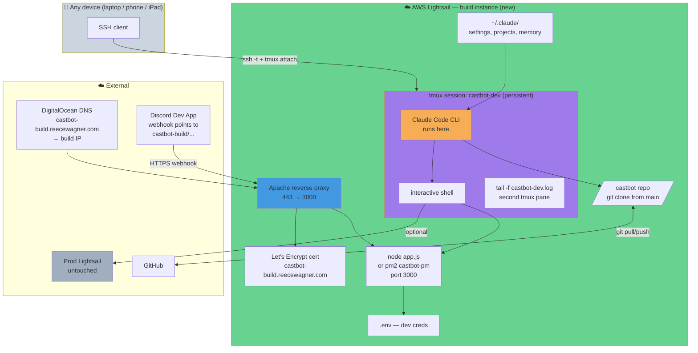
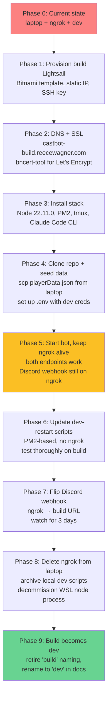

# 🏗️ New Build Infrastructure — Migrating Dev off the Laptop

## 📋 Original Context / Trigger Prompt

> I don't love having to use ngrok and keeping the server up the whole time on my laptop, but i love developing using claude.
>
> would like to incrementally create a new aws lightsail instance (like 'build' or something) that initially is an experiment, and eventually replaces dev
>
> Review all of the various scripts and conduct an analysis, how I could invoke claude, where i would use claude (my local terminal? wsl? ssh into lightsail then use claude install there?) to deliver a similar experience to what i currently have
>
> consider some infrastructure or deployment alternatives as well, though whats stated above is my preference given prod is on lightsail
>
> include some mermaid marchitecture of the design including all the components, create a RaP called new-build-infrastructure and then tldr me the answers here

---

## 🤔 The Problem in Plain English

Dev today requires:
1. **The laptop stays on.** Close the lid → dev goes dark. Power cable, heat, fan noise, stolen desk space.
2. **ngrok as the Discord-facing front door.** Free-tier static URL (`adapted-deeply-stag.ngrok-free.app`), rate limits, occasional "abuse protection" interstitials, an outside dependency with its own outages.
3. **WSL quirks** — PM2 doesn't play nicely with WSL's networking, which is why dev bypasses PM2 and runs `node app.js` directly.
4. **Prod is on AWS Lightsail, dev is not** — environment parity is poor. Bugs that only manifest under Apache reverse-proxy + PM2 + Let's Encrypt (memory limits, Sharp peaks, DNS quirks) only surface once you deploy.

Reece loves developing with Claude Code. Any new setup has to preserve that: edit files, run scripts, tail logs, run tests, invoke dev-restart.sh — all feeling like the current loop.

**Goal:** A second Lightsail instance (call it "build") that hosts the dev loop in the cloud. Laptop becomes a thin terminal. Start as an experiment alongside current dev; once it feels right, retire the local node + ngrok combo.

---

## 🏛️ Historical Context

The current dev rig grew organically:
- ngrok solved "how does Discord reach my laptop" in 2024 before we understood the cost of the dependency
- WSL was chosen because it's convenient on Reece's Windows laptop, but WSL has well-known issues with long-running Node processes under PM2 — hence the bypass
- The prod instance (`13.238.148.170`) was set up using the Bitnami Lightsail template, which baked in Apache + Let's Encrypt + bncert-tool + PM2 — a proven, working pattern

That last bit matters: **we already know how to run CastBot on Lightsail.** We have a working deploy script (`deploy-remote-wsl.js`), an SSH key pattern (`~/.ssh/castbot-key.pem`), a domain zone under DigitalOcean DNS (`reecewagner.com`), and a known-good Apache vhost template. Spinning up a second instance is mostly "do what you did before, but point a different subdomain at it."

---

## 🎯 Design Goals

| Goal | Why it matters |
|---|---|
| **Laptop can sleep / close lid** | Core driver — primary pain point |
| **Claude-native workflow preserved** | Non-negotiable. If Claude feels awkward, this fails |
| **No ngrok** | Remove free-tier dependency and its quirks |
| **Env parity with prod** | Surface infrastructure bugs earlier |
| **Blast-radius isolation from prod** | Never have a broken dev session touch production |
| **Incremental** | Keep current dev working during the transition |
| **Cheap** | Lightsail tier that fits — probably $5–10/mo |
| **Reversible** | If it flops, fall back to current setup without drama |

---

## 🖼️ Current State (Today)

```mermaid
graph TB
    subgraph Laptop["💻 Reece's Laptop (must stay on)"]
        subgraph WSL["WSL Ubuntu"]
            CC[Claude Code CLI]
            REPO[/castbot repo/]
            NODE[node app.js<br/>port 3000]
            LOG[/tmp/castbot-dev.log]
            SCRIPTS[dev-start.sh<br/>dev-restart.sh<br/>dev-stop.sh<br/>dev-status.sh]
        end
        NGROK[ngrok client<br/>port 4040 admin]
    end

    subgraph External["☁️ External"]
        NGROK_EDGE[ngrok edge<br/>adapted-deeply-stag<br/>.ngrok-free.app]
        DISCORD_DEV[Discord Dev App<br/>1328366050848411658]
        PROD[Prod Lightsail<br/>13.238.148.170]
        GH[GitHub]
    end

    CC --> REPO
    CC --> SCRIPTS
    SCRIPTS --> NODE
    SCRIPTS --> NGROK
    NODE --> LOG
    NGROK --> NGROK_EDGE
    NGROK_EDGE --> NGROK
    DISCORD_DEV -->|webhook| NGROK_EDGE
    CC -->|deploy-remote-wsl| PROD
    REPO --> GH
    GH --> PROD

    style Laptop fill:#fc8181
    style NGROK fill:#fbbf24
    style NGROK_EDGE fill:#fbbf24
    style NODE fill:#68d391
    style PROD fill:#4299e1
```

**What's red:** The laptop box itself — it's a single point of failure for the whole dev loop, and it has to stay plugged in and awake.
**What's yellow:** ngrok — it works, but it's outside our control and on a free tier.

---

## 🌟 Proposed Architecture — "Build" Lightsail with Claude Code Inside



**Key moves:**
- Claude Code runs **on build Lightsail**, not the laptop
- A `tmux` session (`castbot-dev`) keeps Claude + app + logs alive across SSH disconnects
- Apache + Let's Encrypt replace ngrok — dev now has a real HTTPS URL Discord can hit directly
- Same Bitnami Ubuntu template as prod → env parity
- Prod is completely untouched by this work

---

## 🛠️ Where Does Claude Run? Four Options Considered

### Option A — Claude on laptop, SSH to build for every action
Claude edits files locally, then SSH-runs each script on build. Need to `rsync` / `git push` after every edit.
- ✅ Minimal change to muscle memory
- ❌ Every action is a network round-trip — slow, chatty
- ❌ File-sync problem is endless: "did I push? did it pull?"
- ❌ Tailing logs over SSH is laggy
- ❌ Laptop still needs to be on while coding — fixes nothing

### Option B — Claude on build, SSH in from laptop (**recommended**)
Code lives on build. Claude runs there. Laptop is a terminal.
- ✅ Code, logs, scripts, Claude, node — all co-located, zero sync
- ✅ tmux keeps Claude alive through disconnects; reconnect from anywhere
- ✅ Laptop can sleep the instant you close SSH
- ✅ Works from iPad / phone / another machine
- ⚠️ Claude's subscription auth has to be set up once on build
- ⚠️ SSH latency for keystrokes — AU laptop to Sydney Lightsail is single-digit ms, imperceptible
- ⚠️ Pasting images into Claude from laptop screenshots needs a path (`scp` or Lightsail has a web terminal)
- ⚠️ `.claude/` settings, MCP servers, hooks — need migration

### Option C — VS Code Remote-SSH, Claude inside VS Code terminal on build
Same as Option B but IDE-hosted. VS Code on laptop → Remote-SSH → build.
- ✅ Same benefits as B, plus native IDE file-tree + diff UX
- ✅ Claude Code runs inside VS Code's integrated terminal on the remote
- ⚠️ More moving parts (VS Code server on build uses ~100–200MB RAM)
- ⚠️ VS Code server auto-updates can break things
- Verdict: **Good for pairing/complex sessions, but tmux alone is simpler and sufficient**

### Option D — Claude scheduled via CronCreate/RemoteTrigger only
Fire-and-forget agents. Not a replacement for interactive dev — complements it. Skip for this analysis.

---

## 📐 Detailed Design (Option B)

### Build Instance Spec

| Attribute | Value | Rationale |
|---|---|---|
| **Platform** | Bitnami Ubuntu (same as prod) | Proven pattern, copy vhost configs verbatim |
| **Region** | ap-southeast-2a (Sydney) | Match prod, minimise cross-region weirdness, also fastest from AU |
| **Tier** | **2GB RAM, 2 vCPU, $10/mo** (bump from prod's 512MB) | Claude Code + node + tests + tmux + possibly sharp. Prod's 448MB is already tight; adding Claude to it would OOM |
| **Static IP** | Yes, allocate one | Required for DNS |
| **SSH Key** | New key — `~/.ssh/castbot-build-key.pem` | Isolated from prod key; rotate independently |
| **Node Version** | 22.11.0 (pin, match prod) | Env parity |
| **Process Manager** | **PM2** | Match prod. The WSL-PM2 bug doesn't exist on Lightsail |
| **Reverse Proxy** | Apache + Let's Encrypt (via bncert-tool) | Copy prod's `myapp-https-vhost.conf` verbatim, change domain only |
| **Domain** | `castbot-build.reecewagner.com` | Same zone, DigitalOcean A-record to build IP |
| **Firewall** | Port 3000 → 127.0.0.1 only; 22/80/443 public | Match prod |

### File Layout on Build

```
/home/bitnami/
├── .claude/                    # Claude Code config (copied from laptop once)
│   ├── settings.json
│   ├── projects/
│   ├── memory/                 # auto-memory carries over
│   └── keybindings.json
├── .ssh/
│   ├── authorized_keys         # laptop public key
│   └── castbot-prod-key.pem    # optional — for deploying to prod from build
└── .tmux.conf                  # nice-to-have: mouse mode, scrollback

/opt/bitnami/projects/castbot/  # same path as prod for parity
├── (full repo, cloned from main)
├── .env                        # DEV creds (dev Discord app token)
├── playerData.json             # dev data (seeded from local snapshot)
└── safariContent.json
```

### The Dev Loop, After Migration

From **any device**:

```bash
ssh -i ~/.ssh/castbot-build-key.pem bitnami@<build-ip>
tmux attach -t castbot-dev   # or `tmux new -s castbot-dev` first time
```

Inside tmux (split into panes):
- **Pane 1**: Claude Code (`claude`)
- **Pane 2**: `pm2 logs castbot-pm --lines 0 --raw` (live tail)
- **Pane 3**: spare shell for ad-hoc commands

`dev-restart.sh` still works — but gets a tiny refit to use PM2 instead of raw node (see "Scripts to update" below). `dev-status.sh`, `dev-stop.sh` get similar treatment. ngrok logic gets deleted entirely.

Close laptop → tmux keeps running → reconnect tomorrow from bed → `tmux attach` → exactly where you left off.

### Discord Webhook Flip

1. Deploy build successfully, confirm `curl -I https://castbot-build.reecewagner.com/interactions` returns 200
2. In Discord Developer Portal → app `1328366050848411658` → Interactions Endpoint URL → change from ngrok URL to build URL
3. Test a command. If it works, delete ngrok from laptop.

### Deploy-to-Prod: Where Does That Live?

Two options:

**B1. Deploy from laptop only (recommended initially)**
Laptop keeps `castbot-prod-key.pem` and `deploy-remote-wsl`. Build never touches prod. Highest isolation.

**B2. Deploy from build (promote later if convenient)**
Build holds `castbot-prod-key.pem`. Any compromise of build could deploy malicious code to prod.

Start with B1. Upgrade to B2 only if the laptop dependency becomes a nuisance during deploys.

---

## 📜 Scripts to Update

| Script | Change |
|---|---|
| `scripts/dev/dev-start.sh` | Delete ngrok logic. Swap `nohup node app.js` for `pm2 start ecosystem.config.js` (reuse prod config, or create `ecosystem.dev.js`). Keep git commit/push safety net. |
| `scripts/dev/dev-restart.sh` | Same: remove ngrok check, replace node restart with `pm2 restart castbot-dev`. Tests still run. |
| `scripts/dev/dev-stop.sh` | `pm2 stop castbot-dev`. Remove ngrok kill. |
| `scripts/dev/dev-status.sh` | `pm2 status castbot-dev` + `curl -I https://castbot-build.reecewagner.com/interactions`. Remove ngrok check. |
| `scripts/dev/dev-restart-logs.sh` | Replace `tail -f /tmp/castbot-dev.log` with `pm2 logs castbot-dev`. |
| `deploy-remote-wsl.js` | No changes (still deploys to prod). |
| `scripts/notify-restart.js` | No changes. |

An environment-detection flag (`CASTBOT_ENV=build` or `CASTBOT_ENV=local`) would let one script set serve both setups during the transition.

---

## 🚦 Migration Path (Incremental)



**Rollback at any phase:** laptop's WSL + ngrok stays runnable until Phase 8. If build misbehaves, restart dev-start.sh locally and flip Discord webhook back. Phase 1–7 are additive, not destructive.

---

## 📊 Comparison Table

| Aspect | Today (laptop + ngrok) | Proposed (build Lightsail) |
|---|---|---|
| **Laptop state** | Must be on + awake | Can sleep / close lid / be elsewhere |
| **Dev front door** | ngrok free tier | Proper HTTPS + Let's Encrypt |
| **Process manager** | raw `node` (WSL bug) | PM2 (matches prod) |
| **Env parity with prod** | Low | High |
| **Cost** | $0 direct + electricity + mild sanity tax | ~$10/mo |
| **Claude location** | WSL on laptop | tmux on Lightsail |
| **Works from phone/iPad** | No | Yes (via any SSH client) |
| **Survives network hiccup mid-task** | No (laptop disconnect = chaos) | Yes (tmux persists) |
| **Prod blast radius** | Low (separate machine) | Low (separate Lightsail instance) |
| **Image-paste into Claude** | Native (WSL path) | Needs scp or web terminal |
| **MCP servers** | Work locally | Need re-registration on build |

---

## ⚠️ Risks & Mitigations

| Risk | Likelihood | Impact | Mitigation |
|---|---|---|---|
| Claude Code CLI feels sluggish over SSH | Low | Medium | Sydney-to-Perth SSH is <10ms. If it bites, switch to Option C (VS Code Remote-SSH) |
| tmux session lost due to Lightsail reboot | Low | Low | `tmux-resurrect` plugin, or just `tmux new` after reboot — your work is in git |
| Claude Code subscription / auth issues on second machine | Medium | Medium | Anthropic auth supports multiple devices — verify before fully cutting over |
| MCP servers / hooks don't get migrated | High if not explicit | Medium | Explicit migration checklist in Phase 4 — copy `.claude/` tree via scp |
| Build instance runs out of RAM under Claude + node + tests | Low at 2GB | High | Picked 2GB tier, not 512MB. Monitor with `pm2 monit` in first week |
| SSH key compromise lets attacker into dev | Low | Medium | Dedicated key, separate from prod. Rotate at any sign of trouble |
| Image-paste workflow (screenshots into Claude) breaks | Medium | Low | Use Lightsail web terminal's upload, or scp, or take screenshot on phone and paste remotely |
| DNS propagation delays during setup | High (normal) | None | DigitalOcean TTL is 300s — rebuild tolerance |
| Old ngrok URL gets reassigned to someone else | Low but real | Medium (abuse vector) | Delete ngrok config after Phase 8, reserve the subdomain if paid tier keeps it |

---

## 💰 Cost Breakdown

| Line item | Today | Proposed |
|---|---|---|
| Prod Lightsail | $3.50/mo | $3.50/mo |
| Build Lightsail (2GB) | $0 | ~$10/mo |
| ngrok free | $0 | — |
| **Total** | **$3.50/mo** | **~$13.50/mo** |

Delta: ~$10/mo. Cheap relative to the time saved not babysitting a laptop.

If 2GB turns out to be overkill after a month, downsize to 1GB ($5/mo). If it's cramped, bump to 4GB ($20/mo). Lightsail resizing is cheap.

---

## 🧠 Where Claude Invokes From — Answering the Core Question

### Day-to-day flow

```
[Your laptop / phone / iPad]
        │
        │  ssh -i castbot-build-key.pem bitnami@<build-ip>
        ▼
[Build Lightsail]
        │
        │  tmux attach -t castbot-dev
        ▼
[tmux session — survives disconnects]
        │
        ├─ pane 1: claude          ← edit code, run scripts, ask questions
        ├─ pane 2: pm2 logs        ← live bot output
        └─ pane 3: shell           ← ad-hoc commands, git, tests
```

**Answer to "where do I invoke Claude?":** You SSH into build, `tmux attach`, and run `claude` inside. Exactly one command to get back to where you were.

**You do not:**
- Run Claude on your laptop anymore (except for the occasional "deploy to prod" push)
- Run ngrok
- Run node locally
- Worry about whether your laptop is on

**You still do:**
- Write commits via Claude in the remote tmux (git pushes from build → GitHub → prod via `deploy-remote-wsl` run from laptop)
- Use your laptop's browser for Discord testing, Lightsail console, etc.

---

## 🔍 Open Questions

1. **Anthropic auth on second machine** — does a Claude Code subscription work on both laptop and build simultaneously without logout-each-time? Check before Phase 3.
2. **Do we want a staging data copy?** Build should probably get a scrubbed/fresh `playerData.json`, not prod data, to avoid testing on real guild records.
3. **Backup strategy for build** — it's "just dev", but losing a week's in-progress work would sting. Git covers code, but local JSON test data needs its own plan. Probably: `rsync` to S3 nightly, or just accept loss (it's dev).
4. **Domain naming — keep `castbot-build` even after it becomes dev?** Probably rename to `castbot-dev.reecewagner.com` in Phase 9 for clarity.
5. **Discord dev app** — currently `1328366050848411658`. Keep using it. Don't need a new one.

---

## ✅ Definition of Done

- [ ] Build Lightsail provisioned, SSH accessible
- [ ] `castbot-build.reecewagner.com` resolves, serves valid Let's Encrypt SSL
- [ ] PM2 manages castbot-dev process, survives reboot
- [ ] `./scripts/dev/dev-restart.sh` works on build (no ngrok refs)
- [ ] Claude Code authenticated and usable inside tmux session
- [ ] Discord webhook flipped, commands work end-to-end for 3 days
- [ ] Laptop can be fully powered off for 24h without any dev impact
- [ ] ngrok process + config removed from laptop
- [ ] Documentation updated: `InfrastructureArchitecture.md` gets a build-env section

---

## 📚 Related

- [InfrastructureArchitecture.md](../infrastructure-security/InfrastructureArchitecture.md) — prod setup this cribs from
- [DevWorkflow.md](../workflow/DevWorkflow.md) — current dev loop
- `scripts/dev/*.sh` — scripts to retrofit
- `deploy-remote-wsl.js` — unchanged, stays on laptop

---

🎭 *The theater masks: build is a stage where dev rehearses in the same costume prod will wear.*
