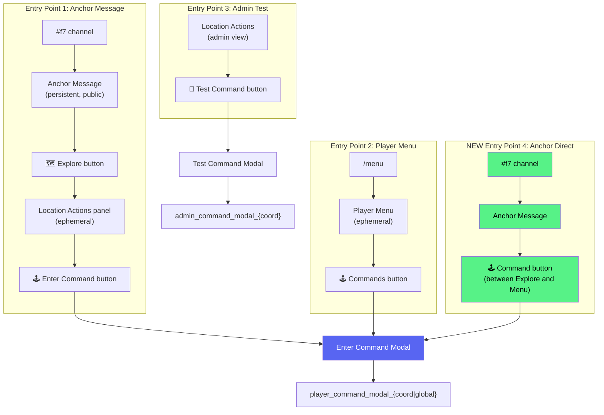

# 0921 — Command Prefixes & Unified Command UI

**Date**: 2026-04-11
**Status**: All phases implemented. Promoted to feature doc: [PlayerCommands.md](../03-features/PlayerCommands.md)
**Related**: [ActionTerminology](0956_20260308_ActionTerminology_Analysis.md), [PlayerCommands](../03-features/PlayerCommands.md), [SafariCustomActions](../03-features/SafariCustomActions.md)

## Original Context

> So currently the Enter Command button is accessed at least 2 different ways; 1) In a channel e.g. #f7 > Location Anchor > Explore Button > Enter Command. 2) /menu (isAdmin=false) > Commands.
>
> Ahead of a new feature where we provide the ability for a per-guild defined set of Standard Command Prefix (e.g., climb, inspect, dive, etc.) that will effectively append the word in front of any commands, and allow users to select them from a string select...
>
> I want to make this Command button more visible by also moving it on to the Anchor Message, in between Explore and Menu.
>
> However, I'm concerned from a UI perspective we now have possible 3 different implementations of the Modal UI, and the ComponentsV2 themselves may begin to drift (including labels etc). I want to maintain the UI itself in one place... so that when we do add in a string select prefix we don't have to do it multiple times and we're not creating more tech debt.

---

## 1. The Problem: Three Modals, Three Implementations

The "Enter Command" modal is currently built inline in **three separate places**, all with slightly different code but nearly identical output:

| # | Entry Point | Button custom_id | Modal custom_id | Modal Title | Placeholder | File:Line |
|---|-------------|-----------------|----------------|-------------|-------------|-----------|
| 1 | Anchor > Explore > Enter Command | `player_enter_command_{coord}` | `player_command_modal_{coord}` | Enter Command | `e.g., password1234, my-idol-clue` | app.js:33401 |
| 2 | /menu > Commands | `player_enter_command_global` | `player_command_modal_global` | Enter Command | `e.g., password1234, my-idol-clue` | app.js:33371 |
| 3 | Admin > Location Actions > Test Command | `admin_test_command_{coord}` | `admin_command_modal_{coord}` | Test Command (Admin) | `e.g., climb vines, check rock` | app.js:33434 |

**Current issues:**
- All three use **legacy ActionRow+TextInput** (should be Label type 18)
- Adding a String Select prefix means modifying 3 separate modal builders
- The placeholder text differs between player and admin (admin has better examples)
- No shared function — each is a 15-line inline block

### Current UI: What the Player Sees

```
 ┌─────────────────────────────────────┐
 │  Enter Command                      │
 ├─────────────────────────────────────┤
 │                                     │
 │  Command                            │
 │  ┌─────────────────────────────┐    │
 │  │ e.g., password1234          │    │
 │  └─────────────────────────────┘    │
 │                                     │
 │              [Cancel]  [Submit]      │
 └─────────────────────────────────────┘
```

### Future UI: With Command Prefixes

```
 ┌─────────────────────────────────────┐
 │  Enter Command                      │
 ├─────────────────────────────────────┤
 │                                     │
 │  Action (optional)                  │
 │  ┌─────────────────────────────┐    │
 │  │ Choose an action...      v  │    │
 │  └─────────────────────────────┘    │
 │    climb | inspect | dive | open    │
 │                                     │
 │  Target                             │
 │  ┌─────────────────────────────┐    │
 │  │ e.g., tree, rock, chest     │    │
 │  └─────────────────────────────┘    │
 │                                     │
 │              [Cancel]  [Submit]      │
 └─────────────────────────────────────┘
```

Result sent to matching: `"climb tree"` (prefix + space + target)

---

## 2. Current Entry Points (As-Built)



**Entry Point 4** is the new anchor button. It uses the same `player_enter_command_{coord}` custom_id and same modal — no new handler needed.

---

## 3. Solution: `buildCommandModal()` Shared Builder

Extract the modal construction into a single function. All entry points call it. When we add prefixes, we change one function.

### Location

**File**: `commandUI.js` (new file, small and focused)

### API

```javascript
/**
 * Build the Enter Command modal.
 * @param {Object} options
 * @param {string} options.coord       - Coordinate or 'global'
 * @param {boolean} [options.isAdmin]  - Admin test mode (changes title)
 * @param {string[]} [options.prefixes] - Guild command prefixes (future)
 * @returns {Object} Modal interaction response (type 9)
 */
export function buildCommandModal({ coord, isAdmin = false, prefixes = [] })
```

### What It Returns (Phase 1 — no prefixes)

```javascript
{
  type: 9, // MODAL
  data: {
    custom_id: isAdmin ? `admin_command_modal_${coord}` : `player_command_modal_${coord}`,
    title: isAdmin ? 'Test Command (Admin)' : 'Enter Command',
    components: [
      {
        type: 18, // Label (modern pattern)
        label: 'Command',
        description: 'Type a command to interact with this location',
        component: {
          type: 4, // Text Input
          custom_id: 'command',
          style: 1, // Short
          required: true,
          placeholder: 'e.g., climb tree, inspect rock, open chest',
          min_length: 1,
          max_length: 100
        }
      }
    ]
  }
}
```

### What It Returns (Phase 3 — with prefixes)

```javascript
{
  type: 9,
  data: {
    custom_id: `player_command_modal_${coord}`,
    title: 'Enter Command',
    components: [
      {
        type: 18, // Label
        label: 'Action',
        description: 'Choose what you want to do (optional)',
        component: {
          type: 3, // String Select
          custom_id: 'command_prefix',
          placeholder: 'Choose an action...',
          required: false,
          options: [
            { label: 'Climb', value: 'climb', emoji: { name: '🧗' } },
            { label: 'Inspect', value: 'inspect', emoji: { name: '🔍' } },
            { label: 'Dive', value: 'dive', emoji: { name: '🤿' } },
            { label: 'Open', value: 'open', emoji: { name: '📦' } }
          ]
        }
      },
      {
        type: 18, // Label
        label: 'Target',
        description: 'What do you want to interact with?',
        component: {
          type: 4, // Text Input
          custom_id: 'command',
          style: 1,
          required: true,
          placeholder: 'e.g., tree, rock, chest, waterfall',
          min_length: 1,
          max_length: 100
        }
      }
    ]
  }
}
```

The submit handler concatenates: `prefix + " " + target` (or just `target` if no prefix selected).

---

## 4. Implementation Plan

### Phase 1: Common UI (extract shared builder) — DONE ✅

**Goal**: Single source of truth for the Command modal. Migrate from legacy ActionRow to Label.

**Implemented**: `commandUI.js` with `buildCommandModal()`. All 3 inline modal builders replaced. Tests: `tests/commandUI.test.js` (10 tests). Modal submit handlers updated to support Label extraction.

### Phase 2: Anchor button — DONE ✅

**Goal**: Add 🕹️ Command button directly on anchor messages, between Explore and Menu.

**Implemented**: `safariButtonHelper.js` — Command button added between Explore and Menu. Component budget check added (truncates with warning if over 40).

The button uses the existing `player_enter_command_{coord}` custom_id — no new handler needed. The same `buildCommandModal()` from Phase 1 generates the modal.

**Anchor message layout after Phase 2**:
```
┌──────────────────────────────────────┐
│ 🗺️ [fog map image]                  │
│ ─────────────────────────────────    │
│ # 🌲 Kokiri Forest                  │
│ A dense, ancient forest...           │
│ ─────────────────────────────────    │
│ [🌲 Enter the Great Deku Tree]      │  ← Action buttons (trigger: button)
│ ─────────────────────────────────    │
│ [🗺️ Explore] [🕹️ Command] [🏠 Menu]│  ← NEW: Command between Explore & Menu
└──────────────────────────────────────┘
```

**Visibility**: The Command button should always be present (not gated by `enableGlobalCommands` — that setting controls the `/menu` button, not per-location access). Text command Actions at a location are already gated by phrase matching.

### Phase 3: Command Prefixes (high-level plan)

**Goal**: Per-guild configurable "action verbs" that appear as a String Select in the Command modal, concatenated with the text input before phrase matching.

#### Phase 3a: Admin Configuration UI — DONE ✅

**Implemented**: Settings menu → ❗ Commands → Prefix management UI.

**Data**: `safariConfig.commandPrefixes: [{ label: string, emoji?: string, description?: string }]`

**UI**: `buildCommandPrefixesUI()` in `commandUI.js`. Section rows with Remove buttons, Add Prefix modal with Label-wrapped fields (prefix, emoji, description). Validation: empty check, duplicate check (case-insensitive), MAX_COMMAND_PREFIXES = 8 limit. Button disabled at limit.

**Handlers**: `command_prefixes_menu`, `command_prefix_add`, `command_prefix_remove_*`, `command_prefix_add_modal` (modal submit), `safari_customization_back`. All registered in BUTTON_REGISTRY.

**Settings menu changes**: "🦁 Idol Hunts, Challenges and Safari Settings" header. Events moved to "📼 Legacy" section.

#### Phase 3b: Admin Phrase Management UI — DONE ✅

**Goal**: Replace the old 5-input phrase modal with an inline list UI (matching the Command Prefixes pattern). Each phrase shown as a Section with Remove button. Adding one-at-a-time via a modal with prefix selection.

**New UI layout (trigger config, when type = 'modal')**:
```
### ```🕹️ Command Phrases (N/8)```
Player types a command phrase via the 🕹️ Enter Command button...
━━━━━━━━━━━━━━━━━━━━━━━━
🧗 climb `tree`              [Remove]
♾️ `my-secret-idol`           [Remove]
━━━━━━━━━━━━━━━━━━━━━━━━
[⚡ Actions]  [🕹️ Add Phrase]
```

**Add Phrase modal**: Label-wrapped String Select (guild prefixes + "♾️ Freeform" default) + Label-wrapped Text Input. On submit, concatenates prefix + phrase if prefix selected.

**Data model**: No changes — `action.trigger.phrases` stays as `string[]`. Prefix is baked into the phrase string (e.g., "climb tree"). Prefix detection for display done by matching against guild's `commandPrefixes` (longest first).

**Limit**: `MAX_PHRASES_PER_ACTION = 8` in safariLimits.js (budget: 8×3 + 12 fixed = 36/40).

**New handlers**: `action_phrase_add_{actionId}` (opens modal), `action_phrase_remove_{actionId}_{index}` (instant remove), `action_phrase_add_modal_{actionId}` (modal submit).

**Backward compat**: Old `configure_modal_trigger_` and `modal_phrases_config_` handlers kept for `button_modal` trigger type.

#### Phase 3c: Player Command Modal Update — DONE ✅

**Implemented**: `buildCommandModal()` now conditionally shows prefix String Select when `prefixes.length > 0`. Freeform default + guild prefixes with descriptions. Submit handler dynamically detects select vs text-only and concatenates prefix + phrase. All 3 callers (global, location, admin) load and pass prefixes.

**Action editor**: Trigger section now shows phrases inline: `🕹️ Command (climb tree, inspect leaves)`.

**All phrases normalized to lowercase on save.**

#### Phase 3n: Future Considerations

- ~~**Per-prefix emoji**: Map prefixes to emoji for the select options (e.g., climb → 🧗)~~ — DONE, emoji is part of the data model
- ~~**Per-location prefixes**: Different prefixes available at different coordinates (override guild defaults)~~ — STRUCK: keeping it guild-wide for standardisation
- **Prefix-only matching**: Allow a prefix without a target (e.g., just "climb" as a valid command)
- **Prefix display in "Nothing happened"**: Show the prefix in the failure message for context

---

## 5. Current Code Locations (Reference)

### Modal Builders (all to be replaced by `buildCommandModal()`)

| Handler | custom_id | File:Line | Pattern |
|---------|-----------|-----------|---------|
| `player_enter_command_global` | `player_command_modal_global` | app.js:33378-33399 | Legacy ActionRow+TextInput |
| `player_enter_command_{coord}` | `player_command_modal_{coord}` | app.js:33411-33430 | Legacy ActionRow+TextInput |
| `admin_test_command_{coord}` | `admin_command_modal_{coord}` | app.js:33438-33470 | Legacy ActionRow+TextInput |

### Button Creation Points

| Button | custom_id | File:Line |
|--------|-----------|-----------|
| Player location (non-admin Explore) | `player_enter_command_{coord}` | app.js:32968-32972 |
| Player global (/menu) | `player_enter_command_global` | playerManagement.js:486 |
| Admin location actions (entity UI) | `player_enter_command_{entityId}` | entityManagementUI.js:577-583 |
| **NEW: Anchor message** | `player_enter_command_{coord}` | safariButtonHelper.js (Phase 2) |

### Modal Submit Handlers

| Handler | custom_id prefix | File:Line |
|---------|-----------------|-----------|
| Player command | `player_command_modal_` | app.js:47801 |
| Admin test command | `admin_command_modal_` | app.js ~48190 |

### Button Registry

| Entry | custom_id | File |
|-------|-----------|------|
| Global | `player_enter_command_global` | buttonHandlerFactory.js:1968 |
| Location | `player_enter_command_*` | buttonHandlerFactory.js:3354 |
| Admin test | `admin_test_command_*` | buttonHandlerFactory.js:3344 |

---

## 6. Risk Assessment

| Phase | Risk | Mitigation |
|-------|------|------------|
| **1** | Modal migration breaks existing modals | Test all 3 entry points after refactor |
| **1** | Label (type 18) not supported on old clients | Label has been live since Sep 2025, widely supported |
| **2** | Anchor component count exceeds 40 | One button adds 0 components (goes in existing action row). Verify with `countComponents()` |
| **2** | 5-button-per-row limit | Current row has 2 buttons (Explore + Menu). Adding Command = 3. Safe. |
| **3** | Prefix + target concatenation mismatches phrases | Exact-match: admin must include prefix in phrase (e.g., "climb tree"). Clear in docs. |
| **3** | Modal complexity confuses players | Prefix select is optional. No prefix configured = same modal as today. |
