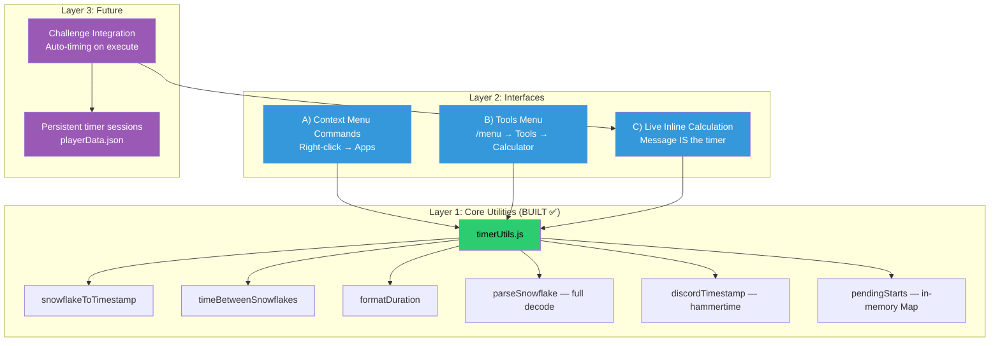
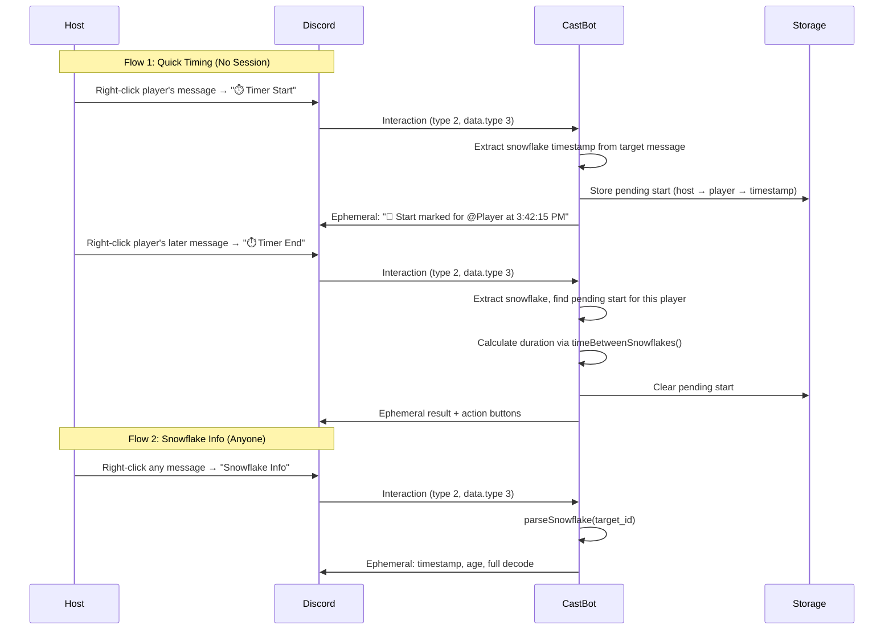
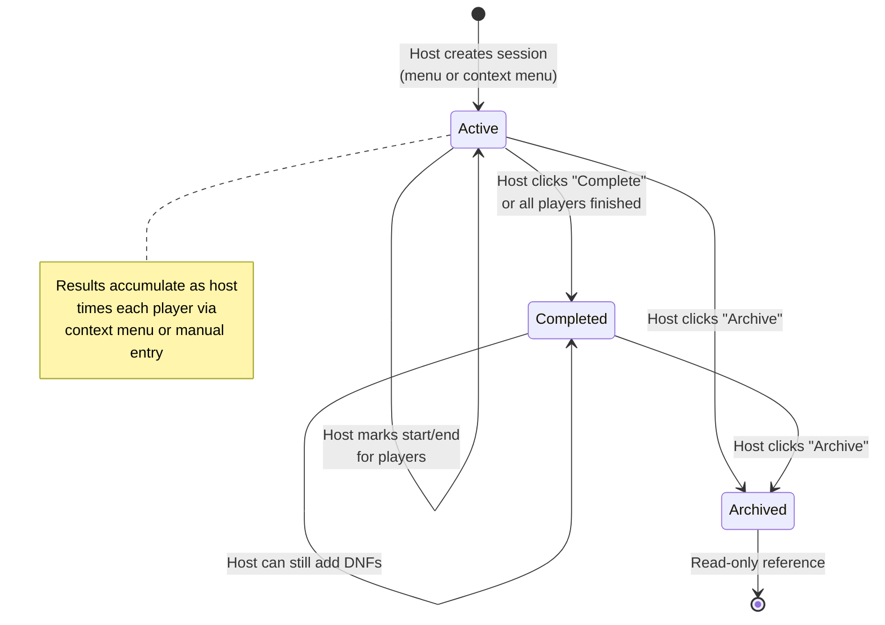
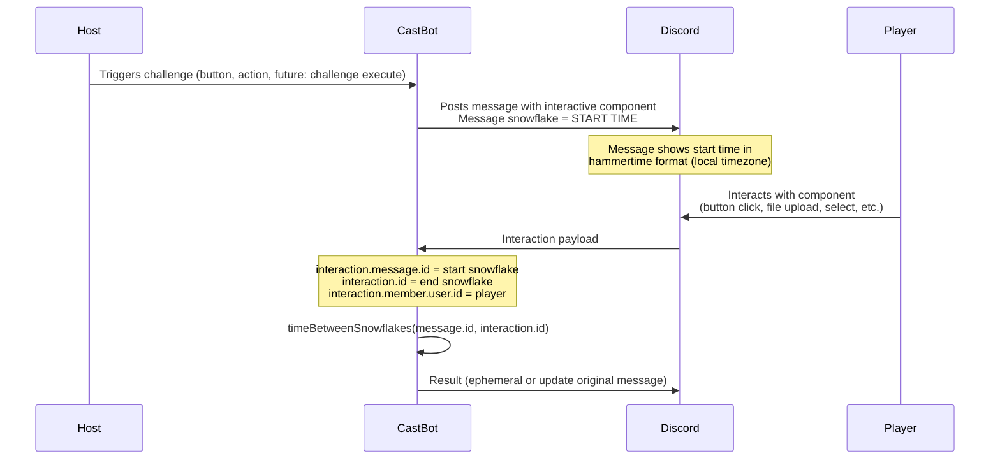
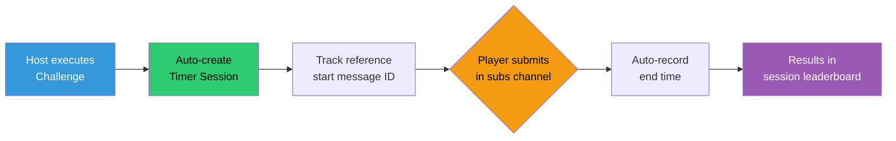

# RaP 0925 — Snowflake Timer System

**Status**: Implemented (Paradigms A + B live in dev, Paradigm C pending UX decisions)  
**Date**: 2026-04-03 (analysis), 2026-04-04 (implementation)  
**Affects**: commands.js, app.js, timerUtils.js, menuBuilder.js, buttonHandlerFactory.js  
**Risk**: Low (additive feature, no existing code modified)  
**Related**: [Challenges](../03-features/Challenges.md), [Challenge Analysis RaP 0945](0945_20260316_Challenges_Analysis.md), [Application Commands Reference](../standards/DiscordApplicationCommands.md)

**Key Gotcha Discovered**: Discord strips the variation selector (U+FE0F) from emoji in command names. Code must match with bare emoji `❄` not `❄️`. See [DiscordApplicationCommands.md](../standards/DiscordApplicationCommands.md).

---

## Original Context (User Prompt)

> So a common need for ORGS is to calculate how long it took a player to complete a challenge. The normal way this is done is as follows:
> 1. During the season - a challenge is posted which has rules / instructions and usually includes entering some command (normally carl-bot ?tag, we're aiming to get people to use CastBot by building much more interactive features with the discord interactions API)
> 2. A player will go into a personal submissions channel only they and the hosts can see (called subs or submissions), they will usually start some kind of /snowflake type command -- all this really does is 'store' the start of a timer session by capturing the snowflake ID and when they type /snowflake it ends it
> 3. Thinking of the various ways to integrate this with CastBot, so we need underlying functions to calculate timing between two messages (and perhaps log player times in jsons) - thinking general purpose timer utilities functions
> 4. Then ways for the hosts to 'use' this (basically calculate time difference between two snowflake IDs e.g. Reece took 43 mins to do the puzzle, sarah took 35 mins = sarah won):
>    4a. Right click context menu options to start / finish then snowflake info posted in channel (options for ephemeral or non-ephemeral)
>    4b. Actual castbot /menu option (like in tools menu)
>    4c. Integrated / started when a challenge is executed (yet to be fully built) and then intercepted like we have a handler for a screenshot upload.. etc

---

## 🤔 The Problem in Plain English

ORG hosts need to time how long players take to complete challenges. Today this is done through carl-bot's `?tag` snowflake trick — a clunky workflow where players type a command that captures a message ID (which embeds a timestamp), then type it again when done, and the host manually calculates the difference.

This is one of those features where CastBot can offer a dramatically better experience: **every Discord message already IS a timestamp** thanks to the snowflake format. We don't need players to type special commands. We just need tools that let hosts point at two messages and say "how long between these?"

The vision is a layered system:
1. **Core math** — pure functions, zero dependencies
2. **Quick timing** — right-click two messages, get a duration (context menus)
3. **Session tracking** — accumulate multiple players' times, show leaderboards
4. **Challenge integration** — auto-timing when challenges are executed (future)

---

## 🏛️ Why This is a Big Deal for CastBot

Carl-bot's snowflake command is the #1 reason ORG hosts still tell players to use another bot during challenges. Replacing it with native CastBot functionality:

- **Removes a competitor touchpoint** — one fewer reason to have carl-bot in the server
- **Better UX** — hosts right-click instead of players typing commands
- **Retroactive timing** — hosts can time events *after* they happen
- **Integrated leaderboards** — results in CastBot's UI, not scattered chat messages
- **Challenge pipeline** — feeds into the challenge system being built

---

## 📊 Architecture Overview

### Core Principle: Any Component + Any Interaction = Timer

Every Discord interaction already carries **both timestamps for free**:
- `interaction.message.id` → snowflake → **start time** (when the message was posted)
- `interaction.id` → snowflake → **end time** (when the player interacted)

This means timing is **component-agnostic and event-agnostic**. A button click, select menu choice, modal submission, or file upload — they all produce the same two snowflakes. The timer utility layer doesn't care what triggered the interaction. It just does: `end.snowflake - start.snowflake = duration`.



### The Three Interface Paradigms

| Paradigm | Who starts | Who ends | Storage | Use case |
|---|---|---|---|---|
| **A) Context Menu** | Host right-clicks a message | Host right-clicks another message | In-memory pending starts | After-the-fact timing, verification |
| **B) Menu Calculator** | Host pastes message ID(s) | Host pastes second ID | None (stateless) | Quick lookup, one-off calculation |
| **C) Live Inline** | Bot posts a message (snowflake = start) | Player interacts with it (snowflake = end) | None (messages ARE the data) | **Live challenge timing — MVP use case** |

---

## 💡 Layer 1: Core Utilities (`timerUtils.js`)

### Snowflake Math

Discord snowflakes are 64-bit IDs encoding millisecond timestamps since Discord Epoch (2015-01-01T00:00:00.000Z = `1420070400000`).

```
 63                         22  21    17  16    12  11          0
┌─────────────────────────────┬────────┬────────┬──────────────┐
│     Timestamp (ms)          │Worker  │Process │  Increment   │
│     (42 bits)               │(5 bits)│(5 bits)│  (12 bits)   │
└─────────────────────────────┴────────┴────────┴──────────────┘
```

**Key insight**: This already exists in the codebase! `utils.js:41` uses the exact formula for interaction age calculation:
```javascript
const timestamp = Number(BigInt(interactionId) >> 22n) + 1420070400000;
```

### Proposed Functions

```javascript
// timerUtils.js — Pure functions, zero imports, fully testable

const DISCORD_EPOCH = 1420070400000n;

/**
 * Extract creation timestamp from a Discord snowflake ID.
 * @param {string|bigint} snowflake - Discord snowflake ID
 * @returns {number} Unix timestamp in milliseconds
 */
export function snowflakeToTimestamp(snowflake) {
  return Number((BigInt(snowflake) >> 22n) + DISCORD_EPOCH);
}

/**
 * Full snowflake decode — all encoded fields.
 * @returns {{ timestamp: number, workerId: number, processId: number, increment: number, date: string }}
 */
export function parseSnowflake(snowflake) {
  const id = BigInt(snowflake);
  const timestamp = Number((id >> 22n) + DISCORD_EPOCH);
  return {
    timestamp,
    date: new Date(timestamp).toISOString(),
    workerId: Number((id >> 17n) & 0x1Fn),
    processId: Number((id >> 12n) & 0x1Fn),
    increment: Number(id & 0xFFFn),
  };
}

/**
 * Calculate time between two snowflakes.
 * @returns {{ durationMs: number, formatted: string, startTime: number, endTime: number }}
 */
export function timeBetweenSnowflakes(startId, endId) {
  const startTime = snowflakeToTimestamp(startId);
  const endTime = snowflakeToTimestamp(endId);
  const durationMs = Math.abs(endTime - startTime);
  return {
    durationMs,
    formatted: formatDuration(durationMs),
    startTime,
    endTime,
    reversed: endTime < startTime, // end was before start
  };
}

/**
 * Human-readable duration formatting.
 * Smart scaling: "45.2s" → "12m 34s" → "1h 23m 45s" → "1d 2h 15m"
 */
export function formatDuration(ms) {
  if (ms < 0) ms = Math.abs(ms);
  if (ms < 1000) return `${ms}ms`;

  const seconds = Math.floor(ms / 1000);
  const minutes = Math.floor(seconds / 60);
  const hours = Math.floor(minutes / 60);
  const days = Math.floor(hours / 24);

  if (seconds < 60) return `${seconds}.${Math.floor((ms % 1000) / 100)}s`;
  if (minutes < 60) return `${minutes}m ${seconds % 60}s`;
  if (hours < 24) return `${hours}h ${minutes % 60}m ${seconds % 60}s`;
  return `${days}d ${hours % 24}h ${minutes % 60}m`;
}

/**
 * Format a timestamp for display (respects timezone if provided).
 * @param {number} timestampMs - Unix timestamp in milliseconds
 * @param {string} [timezone] - IANA timezone (e.g., 'America/New_York')
 * @returns {string} Formatted date/time string
 */
export function formatTimestamp(timestampMs, timezone = 'UTC') {
  try {
    return new Date(timestampMs).toLocaleString('en-US', {
      timeZone: timezone,
      month: 'short', day: 'numeric',
      hour: 'numeric', minute: '2-digit', second: '2-digit',
      hour12: true
    });
  } catch {
    return new Date(timestampMs).toISOString();
  }
}
```

### Testing Strategy

These are perfect for unit tests — pure functions, no I/O:

```javascript
// tests/timerUtils.test.js
import { describe, it } from 'node:test';
import assert from 'node:assert/strict';

// Known snowflake: Discord's own example
// ID 175928847299117063 → 2016-04-30T11:18:25.796Z
describe('snowflakeToTimestamp', () => {
  it('decodes known Discord snowflake', () => {
    const ts = snowflakeToTimestamp('175928847299117063');
    assert.equal(new Date(ts).toISOString(), '2016-04-30T11:18:25.796Z');
  });
});

describe('timeBetweenSnowflakes', () => {
  it('calculates duration between two IDs', () => {
    // Two IDs 1 hour apart (fabricated for testing)
    const result = timeBetweenSnowflakes(startId, endId);
    assert.equal(result.durationMs, 3600000);
    assert.equal(result.formatted, '1h 0m 0s');
  });
});

describe('formatDuration', () => {
  it('formats sub-minute', () => assert.equal(formatDuration(45200), '45.2s'));
  it('formats minutes', () => assert.equal(formatDuration(754000), '12m 34s'));
  it('formats hours', () => assert.equal(formatDuration(5025000), '1h 23m 45s'));
  it('formats days', () => assert.equal(formatDuration(94500000), '1d 2h 15m'));
});
```

---

## 💡 Layer 2A: Context Menu Commands (MVP Interface)

### Why Context Menus Are Perfect Here

The current ORG workflow is:
1. Player types `?tag snowflake` → carl-bot responds with message containing snowflake
2. Player does challenge
3. Player types `?tag snowflake` again
4. Host manually calculates difference

With context menus, the host can **retroactively time anything** by right-clicking two messages. The player doesn't even need to know timing is happening. This is strictly better because:
- **Zero player friction** — they just submit normally
- **Retroactive** — host can decide to time after the fact
- **Any two messages** — challenge post to submission, first message to last, anything
- **Works with existing submissions workflow** — no behavior change needed

### Command Registration

```javascript
// commands.js — Add to ALL_COMMANDS
const TIMER_START_COMMAND = {
  name: '⏱️ Timer Start',
  type: 3, // MESSAGE context menu
};

const TIMER_END_COMMAND = {
  name: '⏱️ Timer End',
  type: 3, // MESSAGE context menu
};

const SNOWFLAKE_INFO_COMMAND = {
  name: 'Snowflake Info',
  type: 3, // MESSAGE context menu
};
```

**Notes:**
- Type 3 = MESSAGE context menu (right-click a message → Apps → command)
- No description or options (Discord ignores them for context menus)
- Names can have spaces and emoji (unlike slash commands)
- Adds 3 commands to current 2 = 5 total (well under 100 limit)
- Global commands take up to 1 hour to propagate after deployment

### Interaction Flow



### Interaction Payload (What Discord Sends)

When a host right-clicks a message and selects a context menu command:

```javascript
{
  type: 2,  // APPLICATION_COMMAND (same as slash commands!)
  data: {
    type: 3,     // MESSAGE context menu (distinguishes from slash = 1, user = 2)
    name: "⏱️ Timer Start",
    target_id: "1234567890123456789",  // The message's snowflake ID
    resolved: {
      messages: {
        "1234567890123456789": {
          id: "1234567890123456789",
          author: { id: "playerUserId", username: "sarah", ... },
          content: "Here's my puzzle answer...",
          channel_id: "9876543210",
          // ... full message object
        }
      }
    }
  },
  guild_id: "...",
  channel_id: "...",
  member: { user: { id: "hostUserId" }, permissions: "...", ... }
}
```

**Critical fields:**
- `data.target_id` — the right-clicked message's snowflake (THIS IS THE TIMESTAMP)
- `data.resolved.messages[target_id].author` — who sent the message (the player)
- `member.user.id` — who invoked the command (the host)

### Handler Design (app.js)

```javascript
// In the APPLICATION_COMMAND section (~line 2487)
if (type === InteractionType.APPLICATION_COMMAND) {
  const { name } = data;
  
  // === CONTEXT MENU COMMANDS (data.type === 3 for MESSAGE) ===
  if (data.type === 3) {
    const targetMessageId = data.target_id;
    const targetMessage = data.resolved?.messages?.[targetMessageId];
    const hostId = req.body.member?.user?.id;
    
    if (name === '⏱️ Timer Start') {
      // Permission check: hosts only
      // → delegate to timerHandler.js
    } else if (name === '⏱️ Timer End') {
      // Permission check: hosts only
      // → delegate to timerHandler.js
    } else if (name === 'Snowflake Info') {
      // No permission check — available to all
      // → delegate to timerHandler.js
    }
  }
  
  // === EXISTING SLASH COMMANDS (data.type === 1) ===
  // ... existing /castlist and /menu handling ...
}
```

### In-Memory Pending Starts

```javascript
// In timerUtils.js or timerHandler.js
// Map<hostId, Map<playerId, { messageId, timestamp, channelId }>>
const pendingStarts = new Map();

export function setPendingStart(hostId, playerId, messageId, timestamp, channelId) {
  if (!pendingStarts.has(hostId)) pendingStarts.set(hostId, new Map());
  pendingStarts.get(hostId).set(playerId, { messageId, timestamp, channelId });
}

export function getPendingStart(hostId, playerId) {
  return pendingStarts.get(hostId)?.get(playerId) || null;
}

export function clearPendingStart(hostId, playerId) {
  pendingStarts.get(hostId)?.delete(playerId);
}
```

**Why per-player, not per-host?** A host might mark starts for 5 different players in quick succession (going through each subs channel), then come back and mark ends. Keying by player means they can interleave freely:

```
Host marks start for Player A
Host marks start for Player B
Host marks start for Player C
Host marks end for Player B  → 12m 34s ✓
Host marks end for Player A  → 43m 07s ✓
Host marks end for Player C  → 8m 55s ✓
```

**Lost on restart?** Yes, and that's fine. Pending starts are ephemeral — the host just re-marks. For persistent results, they save to a timer session (Layer 2B).

### Result UI (Components V2)

After marking end, the host sees:

```javascript
{
  type: 17, // Container
  accent_color: 0x2ECC71, // green
  components: [
    { type: 10, content: "### ```⏱️ Timer Result```" },
    { type: 14 },
    {
      type: 10,
      content: [
        `**Player**: <@${playerId}>`,
        `**Duration**: **${result.formatted}**`,
        ``,
        `-# Start: ${formatTimestamp(result.startTime)} (ID: ${startMessageId})`,
        `-# End: ${formatTimestamp(result.endTime)} (ID: ${endMessageId})`,
      ].join('\n')
    },
    { type: 14 },
    { type: 1, components: [
      { type: 2, custom_id: `timer_save_${sessionId}`, label: 'Save to Session', style: 1, emoji: { name: '💾' } },
      { type: 2, custom_id: `timer_post_public`, label: 'Post Publicly', style: 2, emoji: { name: '📢' } },
      { type: 2, custom_id: `timer_dismiss`, label: 'Dismiss', style: 2 },
    ]}
  ]
}
```

Snowflake Info result:

```javascript
{
  type: 17,
  accent_color: 0x5865F2, // blurple
  components: [
    { type: 10, content: "### ```🔍 Snowflake Info```" },
    { type: 14 },
    {
      type: 10,
      content: [
        `**Message ID**: \`${messageId}\``,
        `**Author**: <@${authorId}>`,
        `**Created**: <t:${Math.floor(timestamp/1000)}:F>`,  // Discord timestamp formatting
        `**Relative**: <t:${Math.floor(timestamp/1000)}:R>`, // "3 hours ago"
        ``,
        `-# Worker: ${parsed.workerId} | Process: ${parsed.processId} | Increment: ${parsed.increment}`,
      ].join('\n')
    },
  ]
}
```

### Permission Model

| Command | Who Can Use | Check |
|---|---|---|
| `⏱️ Timer Start` | Everyone | No check — timing is read-only calculation |
| `⏱️ Timer End` | Everyone | No check |
| `Snowflake Info` | Everyone | No check |

All three are open to all users. There's no security concern — snowflake timestamps are public data embedded in every message ID. Restricting access would hinder player self-service (e.g., players verifying their own challenge times).

---

## 💡 Layer 2B: Timer Sessions (Persistent Storage)

### Data Structure

```javascript
// In playerData[guildId].timerSessions
{
  "session_1712345678_abc": {
    name: "Episode 3 — Word Puzzle",
    challengeId: null,              // optional link to challenge system
    createdBy: "hostUserId",
    createdAt: 1712345678000,
    status: "active",               // active | completed | archived
    referenceStartId: null,         // optional shared "starting line" message
    results: {
      "player1Id": {
        displayName: "Sarah",
        startMessageId: "1234567890123456789",
        endMessageId: "9876543210987654321",
        startTime: 1712345678000,
        endTime: 1712345890000,
        durationMs: 212000,
        status: "completed",        // started | completed | dnf
        markedBy: "hostUserId",
        recordedAt: 1712345900000
      },
      "player2Id": { ... }
    }
  }
}
```

**Storage location**: `playerData[guildId].timerSessions` — small data (a 20-player session is ~3KB), benefits from existing save/load infra.

### Leaderboard Display

```
### ```⏱️ Episode 3 — Word Puzzle```
-# 4 of 6 players completed

🥇 **Sarah** — **35m 12s**
🥈 **Reece** — **43m 07s**
🥉 **Mike** — **1h 02m 15s**
4\. **Jenny** — **1h 12m 34s**
⏳ Tom — *in progress*
❌ Alex — DNF
```

### Session Lifecycle



---

## 💡 Layer 2C: Tools Menu Integration

### Menu Location

Tools → new "⏱️ Timer" section:

```
🪛 CastBot | Tools
━━━━━━━━━━━━━━━━━━━━
### ```🧙 Setup & Configuration```
  [Setup Wizard] [Attributes] [Enemies] [Tycoons]

### ```🔮 Roles & Utilities```
  [Reaction Roles] [Availability] [Emoji Editor] [Refresh Anchors]

### ```⏱️ Timing & Scoring```     ← NEW SECTION
  [Timer Sessions] [Snowflake Lookup]

### ```📜 Info & Support```
  [Reece's Stuff] [Data] [ToS] [Privacy] [Help]
```

### Timer Sessions Menu

```
### ```⏱️ Timer Sessions```
-# Manage challenge timing sessions

[▶ Active Sessions ▾]          ← Select menu showing active sessions
[+ New Session]                ← Create new session
[📊 View All Results]          ← Browse completed sessions
[← Back to Tools]
```

### Snowflake Lookup (Manual Entry)

For when the host has a snowflake ID but not the message context:

```
### ```🔍 Snowflake Lookup```
-# Paste a message ID to decode its timestamp

[Enter Snowflake ID]           ← Button that opens modal with text input
[Calculate Between Two IDs]    ← Button that opens modal with two text inputs
[← Back to Tools]
```

This covers the case where hosts copy message IDs from Discord's developer mode (right-click → Copy Message ID) and want to calculate timing without using context menus.

---

## 💡 Paradigm C: Live Inline Calculation (MVP Use Case)

### The Key Insight

When CastBot posts a message with any interactive component, that message's snowflake ID **is** the start time. When a player interacts with that component, the interaction's snowflake ID **is** the end time. No timer state, no storage, no session management. Discord's own infrastructure is the data store.

```javascript
// Inside ANY component interaction handler:
const startTime = snowflakeToTimestamp(req.body.message.id);   // when message was posted
const endTime   = snowflakeToTimestamp(req.body.id);           // when player interacted
const duration  = endTime - startTime;
const player    = req.body.member.user.id;                     // who interacted
```

This works for **every** Discord interaction type:

| Component | Interaction Event | How It Triggers |
|---|---|---|
| Button (type 2) | MESSAGE_COMPONENT | Player clicks "I'm Done" |
| String Select (type 3) | MESSAGE_COMPONENT | Player selects an answer |
| Modal (type 9) → File Upload (type 19) | MODAL_SUBMIT | Player uploads screenshot |
| Modal (type 9) → Text Input (type 4) | MODAL_SUBMIT | Player types an answer |
| Any select menu (types 5-8) | MESSAGE_COMPONENT | Player picks user/role/channel |

The timer layer is agnostic — it just needs two snowflake IDs.

### Architecture



### Example: Timed Challenge with Button

Bot posts:
```
⏱️ Challenge Timer
Started <t:1775088000:R>               ← hammertime: "2 minutes ago" (auto-updates)
Started <t:1775088000:T>               ← hammertime: "3:42:15 PM" (player's local time)

Complete the puzzle and click below when finished.

[✅ I'm Done]
```

Player clicks "I'm Done" → handler calculates:
```javascript
// In button handler for 'timer_done' or similar
const startTime = snowflakeToTimestamp(req.body.message.id);
const endTime = snowflakeToTimestamp(req.body.id);
const result = timeBetweenSnowflakes(req.body.message.id, req.body.id);
// result.formatted → "43m 12s"
// req.body.member.user.id → the player
```

### Example: Timed Challenge with Screenshot Upload

Bot posts:
```
📸 Submit Your Answer
Timer started <t:1775088000:T>

Upload a screenshot of your completed puzzle.

[📤 Upload Screenshot]
```

Player clicks "Upload Screenshot" → modal opens with file upload → on submit:
```javascript
// In modal submit handler
// The modal was triggered FROM the original message, so:
// - The original message snowflake = start time
// - The modal submit interaction snowflake = end time
```

**Note on modals**: When a button opens a modal, the modal submit interaction does NOT include `interaction.message` by default. The original message ID needs to be encoded in the modal's `custom_id` (e.g., `timer_upload_submit:${originalMessageId}`) so the handler can extract the start snowflake. This is a standard CastBot pattern for multi-step flows.

### Hammertime Format (Discord Timestamps)

Discord's `<t:timestamp:style>` format auto-localizes to each viewer's timezone. Already built in `timerUtils.js`:

```javascript
import { discordTimestamp, snowflakeToTimestamp } from './timerUtils.js';

// In the "start" message posted by bot:
const messageId = postedMessage.id; // the message we just posted
const startTs = snowflakeToTimestamp(messageId);

const content = [
  `⏱️ **Challenge Timer**`,
  `Started ${discordTimestamp(startTs, 'T')}`,  // "3:42:15 PM" in viewer's timezone
  `Started ${discordTimestamp(startTs, 'R')}`,  // "2 minutes ago" (live-updating)
].join('\n');
```

| Style | Output | Use |
|---|---|---|
| `F` | April 3, 2026 3:42:15 PM | Full date+time |
| `f` | April 3, 2026 3:42 PM | Short date+time |
| `T` | 3:42:15 PM | Time only (with seconds) |
| `t` | 3:42 PM | Time only |
| `R` | 2 minutes ago | Relative (auto-updates!) |
| `D` | April 3, 2026 | Date only |
| `d` | 04/03/2026 | Short date |

### What Makes This the MVP

This is the most common ORG use case: host posts a challenge, players complete it and submit (screenshot, answer, etc.), host needs to know how long each player took. Today this requires carl-bot. With Paradigm C:

1. **No new slash commands** — triggered from existing CastBot flows (custom actions, challenge execute, tools menu)
2. **No storage** — the Discord messages are the data
3. **No player training** — they click a button or upload a file, same as they already do
4. **Automatic player identification** — the interaction tells us who clicked
5. **Works with any component** — button, select, file upload, text input

---

## 💡 Paradigm C: Integration with Existing CastBot Features

### Custom Actions (Already Built)

Custom Actions already post messages with buttons. A "timed action" variant could:
- Include start time in hammertime format
- Have a button/component that triggers timing calculation on interaction
- This is a natural extension of the action outcome system

### Challenges (Future — Data Structure Consideration)

**NOTE: Not building now, but documenting the data structure need.**

When the challenge system gains an "execute" capability (posting a challenge to channels), it should support optional timer configuration. The `challengeManager.js` data model will need:

```javascript
// Future addition to challenge data structure in playerData[guildId].challenges
{
  "challenge_abc123": {
    title: "Episode 3 — Word Puzzle",
    description: "...",
    // ... existing fields ...
    
    // NEW: Timer configuration (future)
    timerConfig: {
      enabled: true,
      endComponent: 'button',       // 'button' | 'file_upload' | 'text_input' | 'select'
      resultVisibility: 'ephemeral', // 'ephemeral' | 'public' | 'leaderboard'
      leaderboardChannelId: null,    // optional: post results to specific channel
    },
    
    // NEW: Timer results (populated during execution)
    timerResults: {
      startMessageId: null,          // snowflake of the posted challenge message
      results: {
        "playerId": {
          interactionId: "snowflake", // the end interaction
          durationMs: 212000,
          completedAt: 1712345890000
        }
      }
    }
  }
}
```

**Why document this now**: So the challenge system design accounts for timer integration from the start, even though we're building the timer utilities and challenge system independently. When they converge, the data model is ready.

---

## 💡 Layer 3: Challenge Integration (Future)

### Concept

When the challenge system matures to include "execution" (posting a challenge to channels), it can auto-create a timer session:



### Interception Pattern

CastBot already has `GatewayIntentBits.MessageContent` (app.js:1543) and `GatewayIntentBits.GuildMessages` (app.js:1541), so a `messageCreate` listener is feasible:

```javascript
// Conceptual — NOT for Phase 1
client.on('messageCreate', async (message) => {
  // Check if message is in a tracked submissions channel
  // Check if there's an active timer session expecting this player
  // Auto-record as end time
  // Notify host (or just log silently)
});
```

**This is Phase 3 territory** — requires the challenge system to know which channels are submissions channels and which challenges are active. The context menu approach (Phase 1) works immediately with zero infrastructure.

---

## ⚠️ Risk Assessment

### Low Risk
- **Snowflake math is deterministic** — well-documented Discord standard, already used in utils.js:41
- **Context menus are stable Discord API** — supported since 2021, same interaction endpoint
- **Additive feature** — no existing code modified, new files only
- **Small data footprint** — timer sessions are tiny compared to safari/player data
- **5 commands total** — well under Discord's 100 global command limit

### Medium Risk
- **Global command propagation** — takes up to 1 hour after `npm run deploy-commands`. Hosts may not see context menus immediately. **Mitigation**: document the delay, possibly use guild commands for faster dev testing.
- **Context menu visibility** — all users see Timer Start/End in the Apps menu, even non-hosts. Clicking as a non-host gets a permission error. **Mitigation**: clear error message explaining host-only access.
- **In-memory state lost on restart** — pending starts (not saved to session yet) vanish. **Mitigation**: acceptable for MVP; hosts re-mark. Pending starts are <1 second to redo.

### Considerations
- **Cross-channel timing** — start message in #challenges, end in #subs-player. Works fine — snowflakes are globally unique with absolute timestamps.
- **Bot messages as start** — if the "start" message is from CastBot (e.g., challenge post), the author won't be a player. **Mitigation**: Timer End auto-detects player from end message author; if start and end authors differ, the end message author is assumed to be the player.
- **Timezone display** — durations are timezone-agnostic (just a delta). Absolute timestamps should use Discord's `<t:timestamp:F>` format which auto-localizes per viewer.

---

## 🔧 Implementation Plan

### Phase 1: Core Utilities ✅ BUILT
- `timerUtils.js` — snowflake math, formatting, in-memory pending starts (120 lines)
- `tests/timerUtils.test.js` — 31 passing tests

### Phase 2: Context Menu Commands + Live Inline Timer (Current)

**2A: Command Registration**
- `commands.js` — add 3 MESSAGE context menu commands (type 3)
- Deploy via `npm run deploy-commands`

**2B: Context Menu Handlers (Paradigm A)**
- `app.js` — dispatch in APPLICATION_COMMAND section for `data.type === 3`
- Handler logic for Timer Start (store pending), Timer End (calculate), Snowflake Info (decode)

**2C: Live Inline Timer (Paradigm C — MVP use case)**
- Button handler: player clicks "I'm Done" → calculate `message.id` vs `interaction.id`
- Modal flow: button opens modal (file upload or text input) → `custom_id` encodes original message ID → modal submit handler calculates delta
- Result display (ephemeral and/or public — UI TBD)

**2D: Tools Menu Calculator (Paradigm B)**
- `menuBuilder.js` — add Snowflake Calculator to tools menu
- Modal with 1 or 2 text inputs → calculate and display

### Phase 3: Session Persistence + Leaderboards (Future)
- Timer session CRUD in playerData
- Leaderboard display for multi-player results
- Depends on: UI/UX decisions for result aggregation

### Phase 4: Challenge Integration (Future)
- `challengeManager.js` — `timerConfig` field in challenge data model
- Auto-create timed messages when challenge is executed
- Auto-populate `timerResults` as players complete
- Depends on: Challenge execution system being built

### Suggested Build Order

```
✅ Phase 1:  timerUtils.js + tests (DONE)
→  Phase 2A: commands.js registration + deploy
→  Phase 2B: app.js context menu handlers
→  Phase 2C: Live inline timer (button + modal flows)
→  Phase 2D: Tools menu calculator
   Phase 3:  Session persistence + leaderboards
   Phase 4:  Challenge integration
```

---

## 📋 File Structure

```
castbot/
├── timerUtils.js                 # ✅ BUILT — Core snowflake math + pending starts
├── tests/timerUtils.test.js      # ✅ BUILT — 31 tests passing
├── commands.js                   # Phase 2A — 3 new context menu commands
├── app.js                        # Phase 2B/2C — Context menu dispatch + inline timer handlers
├── menuBuilder.js                # Phase 2D — Timer section in tools menu
└── challengeManager.js           # Phase 4 — timerConfig in challenge data model
```

---

## ✅ Resolved Decisions

1. **Command names** → `⏱️ Timer Start` / `⏱️ Timer End` / `Snowflake Info` (emoji prefix for visibility in Apps menu)

2. **Permissions** → Open to all players. No special permission restrictions — timing is read-only calculation, no security concern. Restricting would hinder usability.

3. **Session storage** → `playerData[guildId].timerSessions` when sessions are needed. But Paradigm C (live calculation) needs **no storage at all** — messages ARE the data.

4. **Registration** → Context menus go in `commands.js` alongside slash commands (same Discord API endpoint, `type: 3` vs `type: 1`). NOT new slash commands — they appear in right-click → Apps only.

5. **Public vs ephemeral** → Support both. Default ephemeral, with option to post publicly. Exact UI for toggling this is TBD.

6. **End trigger** → Not limited to buttons. ANY Discord interaction type (button, select, modal submit, file upload) can serve as the end trigger. The timer layer is component-agnostic.

## 🎯 Remaining Open Questions

1. **UI/UX for context menu results** — what does the ephemeral response look like when a host marks start/end? What buttons/actions are available?

2. **UI/UX for live timer messages** — what does the "challenge with timer" message look like? How are results displayed as players complete?

3. **Leaderboard format** — how are multi-player results aggregated and displayed? Real-time updating or snapshot?

4. **Modal custom_id encoding** — for file upload flows, the original message ID needs to be encoded in the modal's `custom_id` so the submit handler can extract the start snowflake. Standard pattern but needs design for the specific timer use case.

5. **Integration surface** — where exactly in the CastBot menu does "start a timed challenge" live? Tools menu? Challenge menu? Custom action outcome?
