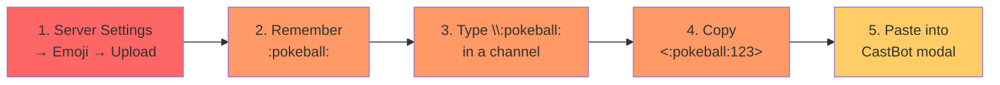
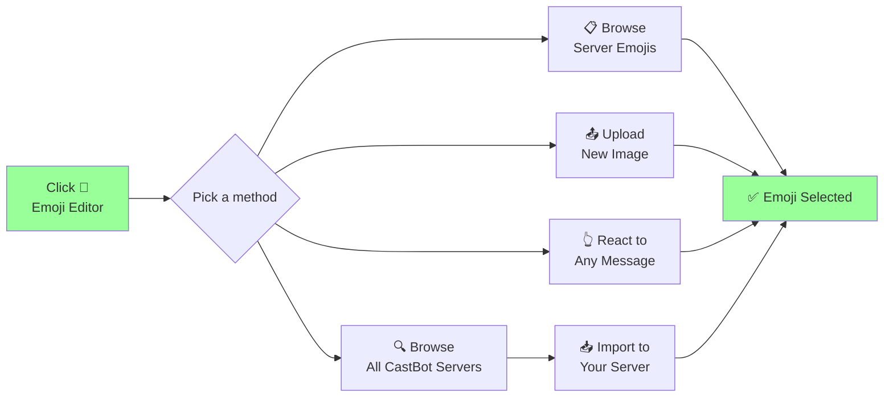
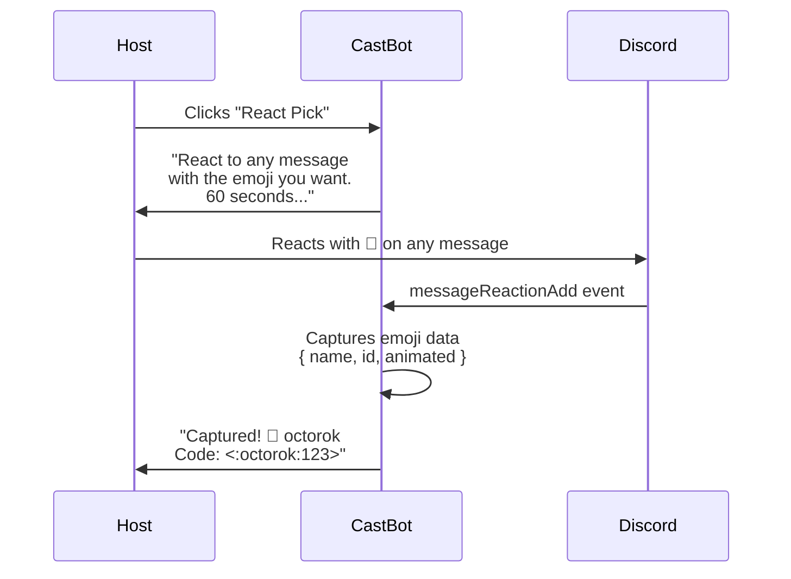
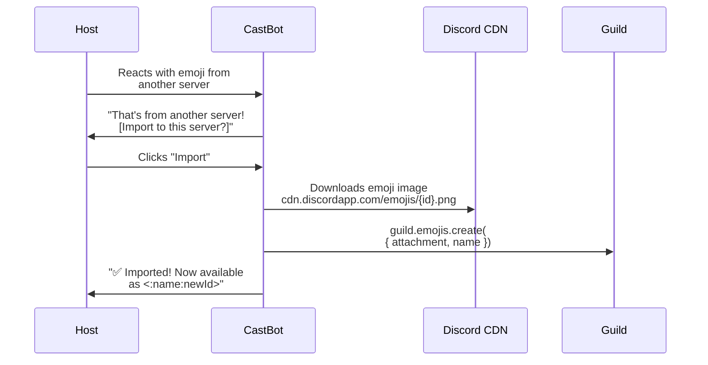

# 0927 - CastBot Emoji Editor

**Date:** 2026-03-29
**Status:** SPECIFICATION — ready to build (PoC in Reece's Stuff)
**Related:** [Emoji Architecture RaP 0928](0928_20260329_EmojiArchitecture_Analysis.md) | [ComponentsV2](../standards/ComponentsV2.md) | [DiscordEmojiResource](../standards/DiscordEmojiResource.md)

---

## Original Context (Trigger Prompt)

> What could a castbot emoji editor look like that allows castbot users to easily manage custom emojis without needing to:
> 1. Upload a custom emoji to their server
> 2. Look up / recall the name, e.g. :pokeball:
> 3. Type \:pokeball in a discord channel to get the fully qualified name like <:pokeball:1420101270739619883>
> 4. Paste it into other castbot free text fields (in a modal)
> Use your most creative, imaginative, free-flowing thinking to come up with ideas including features i haven't even thought of yet!
>
> oh and stealing emojis from other servers :)

---

## 🤔 The Problem

Hosts managing custom emojis in CastBot follow a 4-step detour through Discord's native UI:



Every step is friction. Every step is a context switch away from CastBot. And if they want to use an emoji from another server? They need Nitro, another channel to type in, and the exact name. It's 2026 and we're making people type backslash-colon-name into chat channels.

---

## 🎯 The Vision: Never Type `<:pokeball:123>` Again



---

## Feature Breakdown

### Feature 1: Emoji Gallery / Picker (String Select)

Kill the free text input. Show all guild emojis in a browsable string select:

```
┌─────────────────────────────────────────────┐
│ ## 🎨 Emoji Editor                           │
│ 📊 Using 23/50 static · 2/50 animated       │
├─────────────────────────────────────────────┤
│ [▼ Browse server emojis (page 1/2)...     ] │
│   🐙 octorok              Static            │
│   ⚔️ master_sword          Static            │
│   🛡️ deku_shield           Static            │
│   💀 skull                 Static            │
│   ──────────────────                         │
│   ▶ Next page (13-23)                        │
├─────────────────────────────────────────────┤
│ [Upload] [React Pick] [Dashboard] [← Back]  │
└─────────────────────────────────────────────┘
```

**Pagination for >25 emojis:** Discord string selects cap at 25 options. We show 23 emojis per page, reserving 2 slots for `◀ Previous` / `▶ Next` navigation options.

**Data source:** `guild.emojis.fetch()` returns all emojis with `{ name, id, animated, url }`. Sort alphabetically, paginate.

**Slot info:** `guild.premiumTier` determines limits (50/100/150/250 per type). Already implemented in `emojiUtils.js:199-216`.

**Selecting an emoji** → shows detail view with full code, CDN link, CastBot usage, and delete/copy actions.

### Feature 2: Emoji Detail View

```
┌─────────────────────────────────────────────┐
│ ## 🐙 octorok                                │
│ Static custom emoji                          │
├─────────────────────────────────────────────┤
│ 📋 Code: <:octorok:123456789>                │
│ 🔗 CDN: cdn.discordapp.com/emojis/123...    │
├─────────────────────────────────────────────┤
│ ### Used by CastBot:                         │
│ • 📦 Item: Octorok Tentacle                 │
│ • ⚡ Action: Fight Octorok                   │
│ • 👹 Enemy: Octorok Level 3                  │
├─────────────────────────────────────────────┤
│ [Copy Code] [🗑️ Delete] [← Back to Gallery] │
└─────────────────────────────────────────────┘
```

"Copy Code" sends a tiny ephemeral message with just the `<:name:id>` string — easy to select and copy. Discord doesn't have clipboard API but this is the standard workaround.

**Usage cross-reference:** Scan `safariContent[guildId]` items, stores, enemies, and buttons for matching emoji strings.

### Feature 3: Upload via CastBot

Discord's File Upload (type 19) in modals lets users drag-and-drop images. CastBot already has a working implementation in `src/fileImportHandler.js`.

```
┌──────────────────────────────────────┐
│        Upload Custom Emoji           │
├──────────────────────────────────────┤
│ Emoji Name                           │
│ [deku_shield                      ]  │
│ -# 2-32 chars, letters/numbers/      │
│ -# underscores only                  │
├──────────────────────────────────────┤
│ Image File                           │
│ [📎 Upload PNG or GIF            ]   │
│ -# Max 256KB. 128x128 recommended.   │
│ -# GIF uploads = animated emoji      │
└──────────────────────────────────────┘
```

**Backend:** `guild.emojis.create({ attachment: buffer, name })` — already used in `emojiUtils.js:244-248` for player avatar emojis. Discord error code `30008` = max slots reached, already handled.

**Permission:** Requires `MANAGE_GUILD_EXPRESSIONS`. Check before showing the Upload button — hide it if the bot doesn't have permission.

### Feature 4: Reaction-Based Emoji Picker (The Fun One)

The most natural Discord interaction — just react to a message:



**Implementation:**
- Global `pendingEmojiPicks` Map tracks: `{ userId, guildId, interactionToken, timestamp }`
- `messageReactionAdd` handler checks this map FIRST, before existing reaction logic
- When matched: capture `reaction.emoji`, remove from map, send follow-up
- Timeout after 60 seconds → clean up + send "timed out" follow-up
- Key: capture from ANY message in the guild, not a specific message

**Why this is powerful:**
- Works with Unicode AND custom emojis
- Custom emojis from OTHER servers show up if the user has Nitro
- No typing required — pure visual interaction
- The reaction event gives us the full emoji object including ID

### Feature 5: Emoji Stealing (Cross-Server Import)

When the reaction pick captures a custom emoji from another server:



**How it works:**
- Custom emoji from another server has an ID but isn't in the current guild
- Download the image: `https://cdn.discordapp.com/emojis/${id}.png?size=128` (or `.gif` for animated)
- Re-upload to current guild via API
- The emoji gets a NEW ID in the current guild

**No Nitro required for the host:** Anyone with Nitro in the server can react, and the host just confirms the import. Or the host themselves can have Nitro.

**Future expansion:** CastBot is in 142 servers. A cross-server emoji browser could let hosts search all emojis across all CastBot guilds without anyone needing Nitro.

### Feature 6: Emoji Dashboard

```
┌─────────────────────────────────────────────┐
│ ## 📊 Emoji Dashboard                        │
│ 23/50 static · 2/50 animated                │
├─────────────────────────────────────────────┤
│ ### In Use by CastBot (12)                   │
│ 🐙 octorok — 📦 Item, ⚡ Action, 👹 Enemy    │
│ ⚔️ master_sword — 📦 Item                    │
│ 🛡️ deku_shield — 📦 Item                     │
│ ...                                          │
├─────────────────────────────────────────────┤
│ ### Not Used by CastBot (11)                 │
│ 💀 skull · 🎭 masks · 🏰 castle · ...       │
├─────────────────────────────────────────────┤
│ ### ⚠️ Broken References (1)                 │
│ ❌ <:deleted_emoji:999> — 📦 Old Item        │
├─────────────────────────────────────────────┤
│ [Clean Unused] [Fix Broken] [← Back]        │
└─────────────────────────────────────────────┘
```

Cross-references `safariContent[guildId]` entity emoji fields against `guild.emojis.cache`. Shows:
- **In Use:** Emojis referenced by CastBot entities
- **Not Used:** Guild emojis CastBot doesn't reference (they may be used by other bots or manually)
- **Broken References:** CastBot entities referencing deleted emojis

---

## Architecture

### File Structure

```
poc/
  emojiEditor.js    ← All UI builders and processing logic (NEW)
menuBuilder.js      ← Add button to Reece's Stuff experimental section
app.js              ← Add handlers + reaction hook
buttonHandlerFactory.js ← Register buttons
```

### Component Budget (40 limit)

| View | Components | Notes |
|------|-----------|-------|
| Main Menu | 12 | Header, slot info, select, buttons, nav |
| Detail View | 14 | Header, info, usage list, action buttons |
| Dashboard | 16 | Header, stats, usage list, actions |
| Upload Modal | 2/5 | Name + File Upload |

### Handlers

| custom_id | Type | Action |
|-----------|------|--------|
| `emoji_editor` | Button | Show main menu (deferred, ephemeral) |
| `emoji_picker_page_*` | Select | Paginated emoji browse |
| `emoji_picker_select` | Select | Show detail view for selected emoji |
| `emoji_upload` | Button | Show upload modal (requiresModal) |
| `emoji_upload_modal_*` | Modal Submit | Process upload |
| `emoji_react_pick` | Button | Send "react now" message, start listener |
| `emoji_steal_*` | Button | Download + re-upload emoji from another server |
| `emoji_dashboard` | Button | Show usage dashboard |
| `emoji_detail_*` | Button | Various detail view actions |
| `emoji_delete_*` | Button | Delete emoji from guild (with confirmation) |

### Reaction Pick State

```javascript
// Global Map — checked in messageReactionAdd BEFORE existing reaction logic
global.pendingEmojiPicks = new Map();

// Entry structure
pendingEmojiPicks.set(pickId, {
  userId: '391415444084490240',
  guildId: '1331657596087566398',
  interactionToken: 'abc123...',  // For follow-up messages
  timestamp: Date.now()
});

// Cleanup: setTimeout(() => pendingEmojiPicks.delete(pickId), 60000)
```

### Existing Infrastructure We Reuse

| What | Where | How |
|------|-------|-----|
| Guild emoji API | `guild.emojis.fetch()`, `.create()`, `.delete()` | discord.js built-in |
| Emoji creation | `emojiUtils.js:244-248` | `guild.emojis.create({ attachment, name })` |
| Slot limit logic | `emojiUtils.js:199-216` | `guild.premiumTier` → 50/100/150/250 |
| File Upload modal | `fileImportHandler.js:46-66` | Working Type 19 pattern |
| Attachment handling | `fileImportHandler.js:80-91` | `resolved.attachments[id]` |
| Reaction handler | `app.js:48952` | `messageReactionAdd` event |
| Safari data | `safariManager.js` | `loadSafariContent()` for usage cross-ref |

---

## Future Extensions (Not In PoC)

### Shortcode Resolution
Users type `:pokeball:` in display_text outcomes → CastBot resolves to `<:pokeball:123>` at render time. Same pattern as `{triggerInput}` variable substitution. Massive UX improvement for narrative content.

### Cross-Server Emoji Browser
CastBot is in 142 servers. Build a searchable gallery of ALL emojis across all guilds. Hosts browse and import without anyone needing Nitro. Up to 7,100 community-created emojis.

### Smart Context Suggestions
When editing an entity's emoji, suggest relevant Unicode emojis:
- Items → ⚔️ 🛡️ 🗡️ 📦 🧪
- Stores → 🏪 🛒 💰 🏬
- Enemies → 🐙 🐉 👹 🦇 💀
- Currency → 🪙 💰 💎 🏆

### Emoji Packs
Curated sets: "Survivor Pack" (🔥 torch, 🏛️ tribal council, 🛡️ immunity), "Pokemon Pack" (pokeball, potion, badge), "Fantasy Pack" (sword, shield, potion, scroll). Hosts install a pack → CastBot uploads all emojis to their server in one click.

### Inline Emoji Picker in Entity Modals
Replace the text input emoji field in item/store/enemy modals with a string select populated from guild emojis. The host picks from a dropdown instead of typing codes. This is the eventual goal for the broader emoji architecture (RaP 0928).

---

## Implementation Notes

1. **Permission check:** `MANAGE_GUILD_EXPRESSIONS` required for upload/delete. Check before showing those buttons — hide or disable if bot lacks permission.

2. **Animated emoji handling:** GIF uploads create animated emojis which count against a SEPARATE slot limit. Show both counts: "23/50 static · 2/50 animated"

3. **Error handling for stolen emojis:** The source emoji image might be too large (>256KB), wrong format, or the guild might be at capacity. Handle all cases gracefully.

4. **Reaction pick safety:** Only capture reactions from the requesting user in the requesting guild. Don't interfere with existing reaction-role or availability systems — check the pending map FIRST and `return` early if matched.

5. **Self-contained:** All logic in `poc/emojiEditor.js`. No changes to existing `emojiUtils.js`, `safariButtonHelper.js`, or `botEmojis.js`. This is a PoC — prove the patterns work before integrating with the broader emoji architecture.
