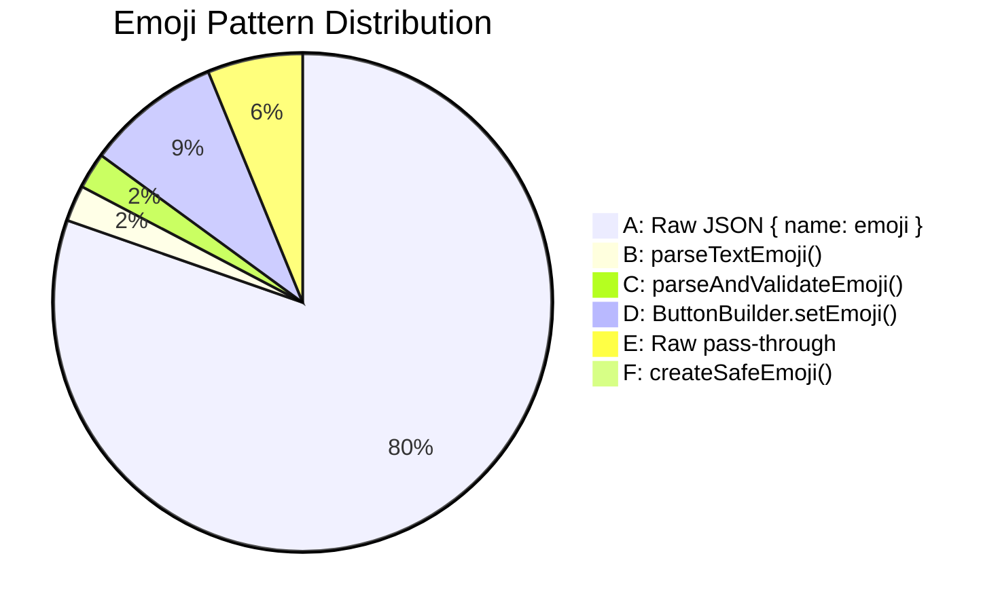
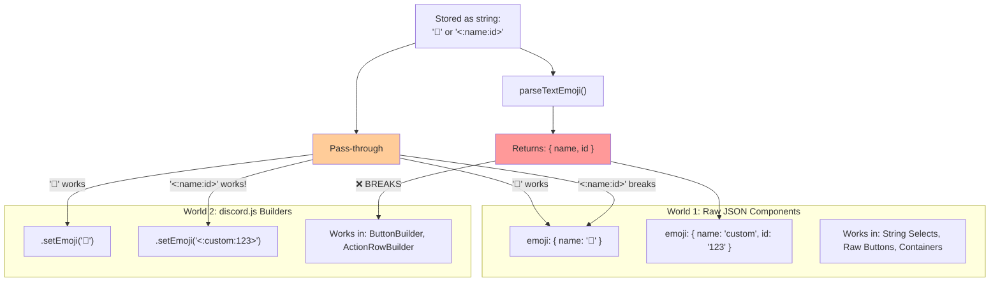
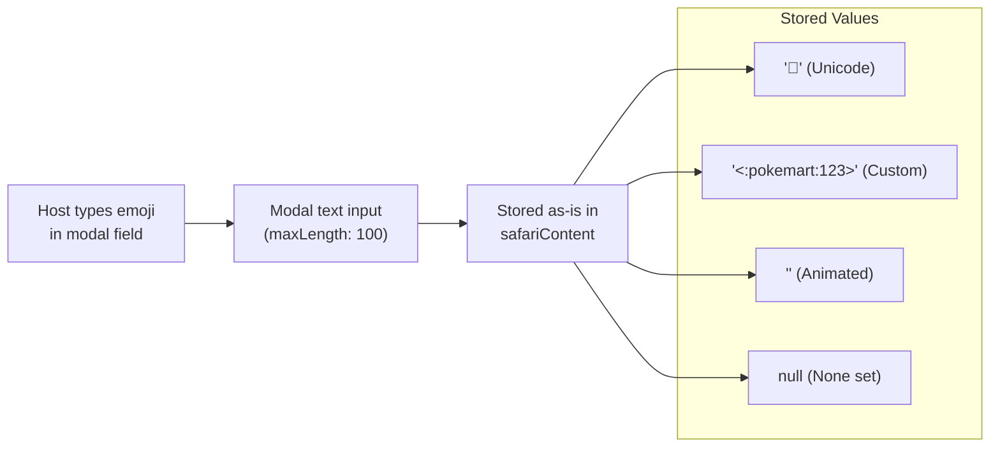
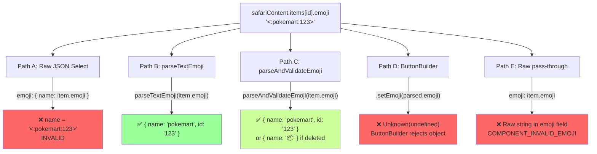
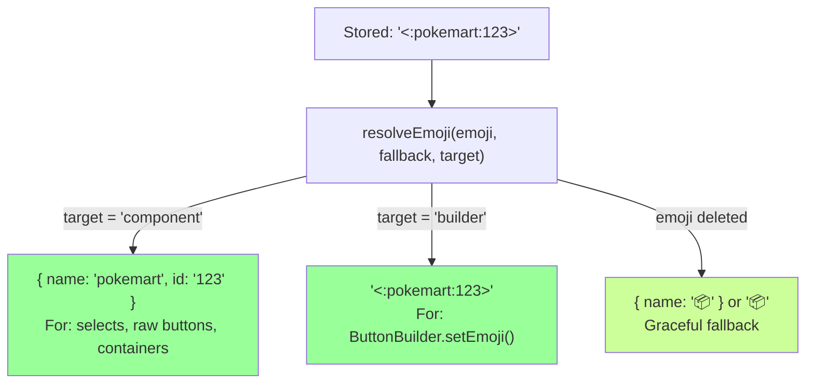

# 0928 - Emoji Architecture: Standardization & Safety

**Date:** 2026-03-29
**Status:** ANALYSIS — needs architectural decision before implementation
**Affects:** Every Discord UI component across the entire codebase (66 files, ~1,568 emoji fields)

---

## Original Context (Trigger Prompt)

> We have a few emoji resources around the place — `utils/emojiUtils.js`, `botEmojis.js`, `docs/standards/DiscordEmojiResource.md`
>
> The different ways we allow 'users' to apply them (that I believe are inconsistent) include:
> - Entity Edit Framework 'emoji' resources - items, enemy, etc - it's a great little polish to allow servers to have custom ones there; however these are rendered in string selects which seem to have two ways of rendering them at the moment; an original functioning way -- which caused a defect if a user deleted the emoji resource from their server (no graceful fallback); and a newer class that another agent introduced (rather than modifying the existing class, not sure why) which fixes the deletion issue but has introduced a new issue around some sort of emoji cache (that I'm not even sure is needed TBH). We may have many many string selects used throughout the place; in theory they really should all /support/ custom emojis where we are allowing the user to upload one; in reality there's 10 ways to do it
> - Custom Inventory and Currency emojis - set in safari_config_group_currency - this MAY have been working in the past, but has been broken a while, and the agent above fixed* it, but the error handling is still a little risky and tenuous (e.g., if a busted / bogus emoji is included, it could completely crash the player menu)
> - Modals themselves - where the user sets the custom emojis; however the placeholder / description text is inconsistent (starting to fix it up)
> - Actions with Trigger Types that include buttons - that's what I'm trying to fix now and what triggered this convo
>
> Want to get:
> 1. Recommendations on standardised way to 'deal' with custom emoji so we can apply fixes in one place and do it in a consistent and re-usable way, that is agnostic of the ComponentsV2
> 2. Enforcement mechanisms (hooks? etc)
> 3. 'Size of the problem' - how many places do we use these, how many different ways is it used, etc.

---

## The Problem (Plain English)

Emoji handling in CastBot is a mess of 6 different patterns, 3 utility functions, and no single source of truth. It's like having 6 different screwdrivers scattered around the house — they all turn screws, but each one works slightly differently, fits different screws, and three of them strip the head if you hold them wrong.

The result: hosts set a custom emoji for their store (`<:pokemart:123>`), and depending on WHICH UI renders it, they get:
- The correct custom emoji (raw JSON pattern, string selects)
- A fallback 📦 (parseAndValidateEmoji, deleted emoji)
- `Unknown(undefined)` (ButtonBuilder.setEmoji with parsed object)
- A crash (raw pass-through without parsing)
- Nothing (emoji: null because save handler stripped it)

---

## Size of the Problem

```
                    ┌──────────────────────────────────┐
                    │   1,568 emoji fields across      │
                    │      66 files using               │
                    │    6 different patterns            │
                    └──────────────────────────────────┘
```

### Pattern Census



| Pattern | Count | Works? | Safe? | Custom Emoji? |
|---------|-------|--------|-------|---------------|
| **A: Raw JSON** `{ name: '🎯' }` | ~1,300 | ✅ Unicode only | ✅ | ❌ Breaks with `<:name:id>` |
| **B: parseTextEmoji()** | 38 | ✅ Selects | ⚠️ No deleted-emoji safety | ✅ Returns `{ name, id }` |
| **C: parseAndValidateEmoji()** | 38 | ✅ Selects | ✅ Falls back | ⚠️ Loses custom on deletion |
| **D: ButtonBuilder.setEmoji()** | 142 | ✅ Strings only | ⚠️ | ❌ Fails with `{ name, id }` objects |
| **E: Raw pass-through** | ~100 | ❌ If custom | ❌ | ❌ No parsing at all |
| **F: createSafeEmoji()** | 14 | ✅ | ✅ | ✅ Full validation |

### The Two Worlds Problem



**Key insight:** `ButtonBuilder.setEmoji()` accepts the RAW STRING `'<:name:id>'` just fine. We don't need to parse it first — just pass the stored string. The parsing is only needed for raw JSON components which need `{ name, id }` object format.

---

## Storage & Retrieval Flow

### How Emojis Enter the System



### How Emojis Are Rendered (Current — Inconsistent)



---

## Proposed Architecture: `resolveEmoji()`

### One Function, Two Outputs

```javascript
// utils/emojiUtils.js — NEW unified function

/**
 * Resolve an emoji string to the correct format for the target component type.
 *
 * @param {string|null} emojiStr - Stored emoji string ('🎯', '<:name:id>', null)
 * @param {string} fallback - Fallback Unicode emoji (default: '📦')
 * @param {'component'|'builder'} target - Where this emoji will be used
 * @returns {Object|string} Component format { name, id? } or builder string
 */
export function resolveEmoji(emojiStr, fallback = '📦', target = 'component') {
    if (!emojiStr || typeof emojiStr !== 'string' || !emojiStr.trim()) {
        return target === 'builder' ? fallback : { name: fallback };
    }

    const trimmed = emojiStr.trim();

    // Custom emoji: <:name:id> or <a:name:id>
    const customMatch = trimmed.match(/^<(a?):(\w+):(\d+)>$/);
    if (customMatch) {
        // Validate exists in cache (graceful fallback)
        if (_emojiClient?.emojis?.cache) {
            const exists = _emojiClient.emojis.cache.get(customMatch[3]);
            if (!exists) {
                console.log(`⚠️ [EMOJI] Custom emoji ${customMatch[2]}:${customMatch[3]} not in cache, fallback to ${fallback}`);
                return target === 'builder' ? fallback : { name: fallback };
            }
        }

        if (target === 'builder') {
            return trimmed; // ButtonBuilder accepts '<:name:id>' as string
        }
        return {
            name: customMatch[2],
            id: customMatch[3],
            animated: customMatch[1] === 'a'
        };
    }

    // Unicode emoji (or unknown string — treat as Unicode)
    return target === 'builder' ? trimmed : { name: trimmed };
}
```

### Usage

```javascript
// In a raw JSON component (select option, raw button)
emoji: resolveEmoji(item.emoji, '📦')
// Returns: { name: '📦' } or { name: 'pokemart', id: '123' }

// In a ButtonBuilder
.setEmoji(resolveEmoji(store.emoji, '🏪', 'builder'))
// Returns: '🏪' or '<:pokemart:123>'

// In safariButtonHelper (anchor messages)
emoji: resolveEmoji(button.emoji, undefined) || undefined
// Returns: { name, id } or undefined (no emoji)
```

### Flow After Fix



---

## Enforcement Mechanisms

### 1. Pre-commit Hook (Structural)

Add to the Moai pre-commit hook:

```bash
# Check for raw emoji pass-through without resolveEmoji
RAW_EMOJI_COUNT=$(git diff --cached -- '*.js' | grep "^+" | grep -cE 'emoji:\s*(item|store|enemy|button)\.\w*emoji' || true)
if [ "$RAW_EMOJI_COUNT" -gt 0 ]; then
  echo "⚠️ Found $RAW_EMOJI_COUNT raw emoji pass-through(s). Use resolveEmoji() instead."
  # Warning only for now, not blocking
fi
```

### 2. Grep-able Anti-patterns

After migration, these patterns should not appear in new code:
- `emoji: item.emoji` (raw pass-through)
- `emoji: { name: item.emoji }` (wrapping raw string)
- `.setEmoji(parseTextEmoji(` (parsed object to builder)
- `.setEmoji(parseAndValidateEmoji(` (parsed object to builder)

### 3. Documentation

Add to CLAUDE.md critical section:
```
## 🔴 CRITICAL: Emoji Handling
- **ONE function**: `resolveEmoji(str, fallback, target)` from `utils/emojiUtils.js`
- **Raw JSON components**: `emoji: resolveEmoji(item.emoji, '📦')`
- **ButtonBuilder**: `.setEmoji(resolveEmoji(store.emoji, '🏪', 'builder'))`
- **NEVER** do `emoji: item.emoji` or `emoji: { name: item.emoji }`
```

---

## Migration Plan

### Phase 1: Create `resolveEmoji()` (0 risk)
- Add function to `utils/emojiUtils.js`
- Unit tests in `tests/emojiUtils.test.js`
- No changes to existing code

### Phase 2: Fix Critical Bugs (Low risk)
- `playerManagement.js:622, 694` — ButtonBuilder with parsed objects
- Action trigger button emoji (the current `emoji: null` bug)
- ~5 files, ~10 call sites

### Phase 3: Migrate High-Traffic Paths (Medium risk, batch)
- Entity Management UI selects (entityManagementUI.js — 5 call sites)
- Store selects (storeSelector.js, playerCardMenu.js)
- Safari button rendering (safariButtonHelper.js)
- ~8 files, ~25 call sites

### Phase 4: Sweep Remaining (Low risk, mechanical)
- All remaining `parseTextEmoji` and `parseAndValidateEmoji` call sites
- Raw pass-through cleanup
- ~15 files, ~50 call sites

### Phase 5: Deprecate Old Functions
- Mark `parseTextEmoji`, `parseAndValidateEmoji`, `createSafeEmoji` as deprecated
- All should delegate to `resolveEmoji()` internally
- Remove after full migration

---

## Decision: Remove the Emoji Cache (2026-03-29)

**Decision: Remove all `_emojiClient` cache validation from emoji rendering. Trust Discord as the source of truth.**

### Why the Cache Exists
The `_emojiClient` module-level cache (set via `setEmojiClient()` at startup) was added to detect deleted custom emojis before sending them to Discord — preventing `COMPONENT_INVALID_EMOJI` errors.

### Why It's Wrong
The cache causes MORE problems than it solves:
- **Cold after restart** — newly uploaded emojis aren't in cache, so they get rejected
- **Application emojis** (bot's own emojis) are never in the guild emoji cache
- **Lazy population** — cache only fills from gateway events, unreliable timing
- **38 validation call sites** — every render path needs cache logic
- **The bug it prevents is already handled** — anchor message retry logic catches Discord rejections

### What To Do Instead
1. **Store**: Save the raw emoji string as-is (`<:name:id>` or Unicode)
2. **Parse**: At render time, parse to the correct format (object for raw JSON, string for ButtonBuilder)
3. **Send**: Let Discord validate. If it rejects (deleted emoji), catch at the response level
4. **Handle**: On `COMPONENT_INVALID_EMOJI` error, re-render without that emoji

### The Math
- 50 emojis max per guild × ~2KB = 100KB per guild
- Only one guild's emojis are relevant per interaction
- We don't need to cache anything — Discord's API validates for us in real time

### Migration
- Phase 1 of the migration plan removes cache from `resolveEmoji()` (no `_emojiClient` reference)
- Phase 5 removes `setEmojiClient()`, `validateComponentEmoji()`, and `_emojiClient` entirely
- Error handling for deleted emojis moves to response-level try/catch

---

## Remaining Open Questions

1. **Should we store parsed emoji objects instead of strings?** No — keep storing strings. Markdown content uses the string format, and parsing at render time is cheap.

2. **ButtonBuilder migration:** Keep builders, use `resolveEmoji(str, fallback, 'builder')` to pass the raw string format that ButtonBuilder expects.

---

## Lessons Learned (2026-04-11)

### The Shortcode Gap

The original analysis identified 6 emoji patterns but missed a 7th: **Discord shortcodes** (`:rocket:`, `:pen_fountain:`, `:scales:`). These aren't unicode, don't match `<:name:id>`, and don't start with `<` — so `resolveEmoji()` treated them as plain text and passed `{ name: ':pen_fountain:' }` to Discord, which rejected it as `COMPONENT_INVALID_EMOJI`.

**Root cause**: One guild (828660) had ~15+ items with shortcode emojis stored in `safariContent.json`. These were likely entered via a modal text input where the user typed `:rocket:` expecting Discord to render it — but CastBot stores the raw string, not the rendered unicode.

**Fix applied**: Added shortcode detection to `resolveEmoji()` — maps known shortcodes to unicode via the existing `SHORTCODE_TO_EMOJI` table, falls back to the default emoji for unmapped ones. This is a band-aid; the proper fix is to resolve shortcodes to unicode **at save time** (in the modal submit handler) rather than at render time, so the stored data is always clean.

**What the census missed**: The 1,568 emoji fields were counted by pattern (how they're rendered), not by **stored format**. The stored formats include a 4th type nobody counted:
1. Unicode: `🎯` — works everywhere
2. Custom: `<:name:id>` — needs parsing for components, works raw for builders
3. Null/empty — needs fallback
4. **Shortcode: `:rocket:`** — needs mapping to unicode, NOT valid in any component emoji field

**Recommendation for Phase 1**: When `resolveEmoji()` is adopted across the codebase, also add a **save-time normalizer** that converts shortcodes to unicode before writing to `safariContent.json`. This eliminates the render-time fallback entirely.

---

Related: [PlayerMenuCustomEmoji RaP 0929](0929_20260329_PlayerMenuCustomEmoji_Analysis.md) | [ComponentsV2](../standards/ComponentsV2.md) | [DiscordEmojiResource](../standards/DiscordEmojiResource.md)
