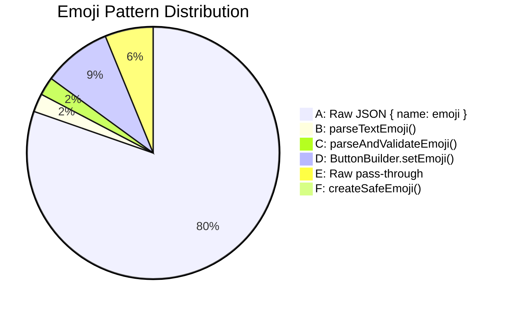
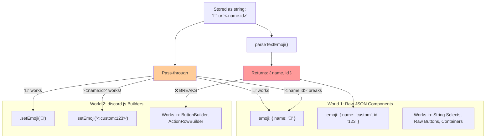
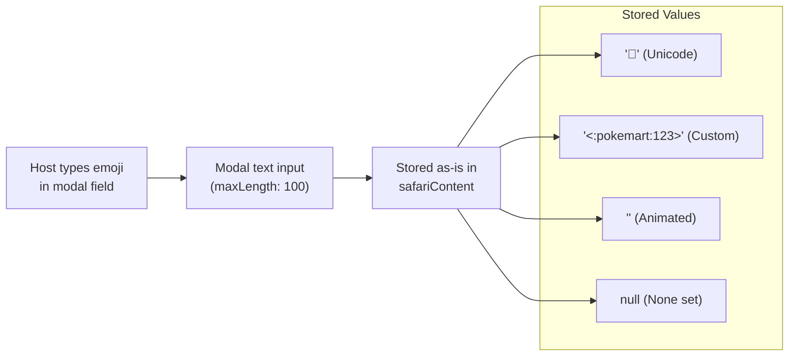
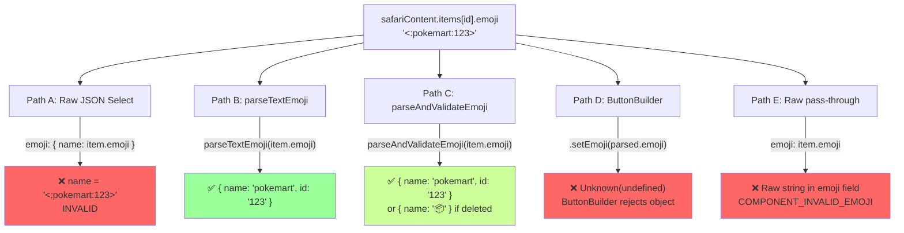
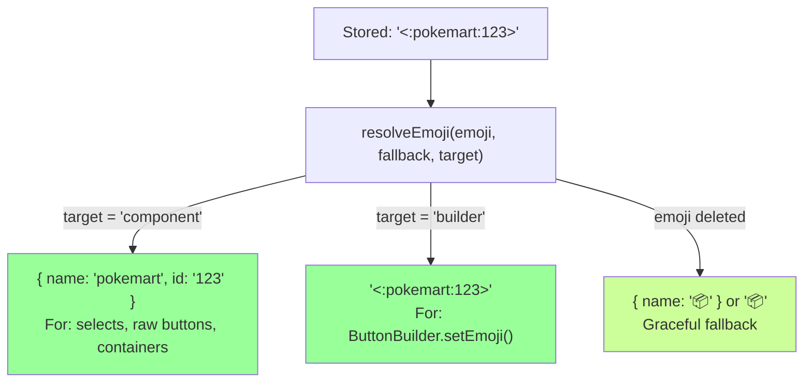

# 0928 - Emoji Architecture: Standardization & Safety

**Date:** 2026-03-29
**Status:** ANALYSIS — needs architectural decision before implementation
**Affects:** Every Discord UI component across the entire codebase (66 files, ~1,568 emoji fields)

---

## Original Context (Trigger Prompt)

> We have a few emoji resources around the place — `utils/emojiUtils.js`, `botEmojis.js`, `docs/standards/DiscordEmojiResource.md`
>
> The different ways we allow 'users' to apply them (that I believe are inconsistent) include:
> - Entity Edit Framework 'emoji' resources - items, enemy, etc - it's a great little polish to allow servers to have custom ones there; however these are rendered in string selects which seem to have two ways of rendering them at the moment; an original functioning way -- which caused a defect if a user deleted the emoji resource from their server (no graceful fallback); and a newer class that another agent introduced (rather than modifying the existing class, not sure why) which fixes the deletion issue but has introduced a new issue around some sort of emoji cache (that I'm not even sure is needed TBH). We may have many many string selects used throughout the place; in theory they really should all /support/ custom emojis where we are allowing the user to upload one; in reality there's 10 ways to do it
> - Custom Inventory and Currency emojis - set in safari_config_group_currency - this MAY have been working in the past, but has been broken a while, and the agent above fixed* it, but the error handling is still a little risky and tenuous (e.g., if a busted / bogus emoji is included, it could completely crash the player menu)
> - Modals themselves - where the user sets the custom emojis; however the placeholder / description text is inconsistent (starting to fix it up)
> - Actions with Trigger Types that include buttons - that's what I'm trying to fix now and what triggered this convo
>
> Want to get:
> 1. Recommendations on standardised way to 'deal' with custom emoji so we can apply fixes in one place and do it in a consistent and re-usable way, that is agnostic of the ComponentsV2
> 2. Enforcement mechanisms (hooks? etc)
> 3. 'Size of the problem' - how many places do we use these, how many different ways is it used, etc.

---

## The Problem (Plain English)

Emoji handling in CastBot is a mess of 6 different patterns, 3 utility functions, and no single source of truth. It's like having 6 different screwdrivers scattered around the house — they all turn screws, but each one works slightly differently, fits different screws, and three of them strip the head if you hold them wrong.

The result: hosts set a custom emoji for their store (`<:pokemart:123>`), and depending on WHICH UI renders it, they get:
- The correct custom emoji (raw JSON pattern, string selects)
- A fallback 📦 (parseAndValidateEmoji, deleted emoji)
- `Unknown(undefined)` (ButtonBuilder.setEmoji with parsed object)
- A crash (raw pass-through without parsing)
- Nothing (emoji: null because save handler stripped it)

---

## Size of the Problem

```
                    ┌──────────────────────────────────┐
                    │   1,568 emoji fields across      │
                    │      66 files using               │
                    │    6 different patterns            │
                    └──────────────────────────────────┘
```

### Pattern Census



| Pattern | Count | Works? | Safe? | Custom Emoji? |
|---------|-------|--------|-------|---------------|
| **A: Raw JSON** `{ name: '🎯' }` | ~1,300 | ✅ Unicode only | ✅ | ❌ Breaks with `<:name:id>` |
| **B: parseTextEmoji()** | 38 | ✅ Selects | ⚠️ No deleted-emoji safety | ✅ Returns `{ name, id }` |
| **C: parseAndValidateEmoji()** | 38 | ✅ Selects | ✅ Falls back | ⚠️ Loses custom on deletion |
| **D: ButtonBuilder.setEmoji()** | 142 | ✅ Strings only | ⚠️ | ❌ Fails with `{ name, id }` objects |
| **E: Raw pass-through** | ~100 | ❌ If custom | ❌ | ❌ No parsing at all |
| **F: createSafeEmoji()** | 14 | ✅ | ✅ | ✅ Full validation |

### The Two Worlds Problem



**Key insight:** `ButtonBuilder.setEmoji()` accepts the RAW STRING `'<:name:id>'` just fine. We don't need to parse it first — just pass the stored string. The parsing is only needed for raw JSON components which need `{ name, id }` object format.

---

## Storage & Retrieval Flow

### How Emojis Enter the System



### How Emojis Are Rendered (Current — Inconsistent)



---

## Proposed Architecture: `resolveEmoji()`

### One Function, Two Outputs

```javascript
// utils/emojiUtils.js — NEW unified function

/**
 * Resolve an emoji string to the correct format for the target component type.
 *
 * @param {string|null} emojiStr - Stored emoji string ('🎯', '<:name:id>', null)
 * @param {string} fallback - Fallback Unicode emoji (default: '📦')
 * @param {'component'|'builder'} target - Where this emoji will be used
 * @returns {Object|string} Component format { name, id? } or builder string
 */
export function resolveEmoji(emojiStr, fallback = '📦', target = 'component') {
    if (!emojiStr || typeof emojiStr !== 'string' || !emojiStr.trim()) {
        return target === 'builder' ? fallback : { name: fallback };
    }

    const trimmed = emojiStr.trim();

    // Custom emoji: <:name:id> or <a:name:id>
    const customMatch = trimmed.match(/^<(a?):(\w+):(\d+)>$/);
    if (customMatch) {
        // Validate exists in cache (graceful fallback)
        if (_emojiClient?.emojis?.cache) {
            const exists = _emojiClient.emojis.cache.get(customMatch[3]);
            if (!exists) {
                console.log(`⚠️ [EMOJI] Custom emoji ${customMatch[2]}:${customMatch[3]} not in cache, fallback to ${fallback}`);
                return target === 'builder' ? fallback : { name: fallback };
            }
        }

        if (target === 'builder') {
            return trimmed; // ButtonBuilder accepts '<:name:id>' as string
        }
        return {
            name: customMatch[2],
            id: customMatch[3],
            animated: customMatch[1] === 'a'
        };
    }

    // Unicode emoji (or unknown string — treat as Unicode)
    return target === 'builder' ? trimmed : { name: trimmed };
}
```

### Usage

```javascript
// In a raw JSON component (select option, raw button)
emoji: resolveEmoji(item.emoji, '📦')
// Returns: { name: '📦' } or { name: 'pokemart', id: '123' }

// In a ButtonBuilder
.setEmoji(resolveEmoji(store.emoji, '🏪', 'builder'))
// Returns: '🏪' or '<:pokemart:123>'

// In safariButtonHelper (anchor messages)
emoji: resolveEmoji(button.emoji, undefined) || undefined
// Returns: { name, id } or undefined (no emoji)
```

### Flow After Fix



---

## Enforcement Mechanisms

### 1. Pre-commit Hook (Structural)

Add to the Moai pre-commit hook:

```bash
# Check for raw emoji pass-through without resolveEmoji
RAW_EMOJI_COUNT=$(git diff --cached -- '*.js' | grep "^+" | grep -cE 'emoji:\s*(item|store|enemy|button)\.\w*emoji' || true)
if [ "$RAW_EMOJI_COUNT" -gt 0 ]; then
  echo "⚠️ Found $RAW_EMOJI_COUNT raw emoji pass-through(s). Use resolveEmoji() instead."
  # Warning only for now, not blocking
fi
```

### 2. Grep-able Anti-patterns

After migration, these patterns should not appear in new code:
- `emoji: item.emoji` (raw pass-through)
- `emoji: { name: item.emoji }` (wrapping raw string)
- `.setEmoji(parseTextEmoji(` (parsed object to builder)
- `.setEmoji(parseAndValidateEmoji(` (parsed object to builder)

### 3. Documentation

Add to CLAUDE.md critical section:
```
## 🔴 CRITICAL: Emoji Handling
- **ONE function**: `resolveEmoji(str, fallback, target)` from `utils/emojiUtils.js`
- **Raw JSON components**: `emoji: resolveEmoji(item.emoji, '📦')`
- **ButtonBuilder**: `.setEmoji(resolveEmoji(store.emoji, '🏪', 'builder'))`
- **NEVER** do `emoji: item.emoji` or `emoji: { name: item.emoji }`
```

---

## Migration Plan

### Phase 1: Create `resolveEmoji()` (0 risk)
- Add function to `utils/emojiUtils.js`
- Unit tests in `tests/emojiUtils.test.js`
- No changes to existing code

### Phase 2: Fix Critical Bugs (Low risk)
- `playerManagement.js:622, 694` — ButtonBuilder with parsed objects
- Action trigger button emoji (the current `emoji: null` bug)
- ~5 files, ~10 call sites

### Phase 3: Migrate High-Traffic Paths (Medium risk, batch)
- Entity Management UI selects (entityManagementUI.js — 5 call sites)
- Store selects (storeSelector.js, playerCardMenu.js)
- Safari button rendering (safariButtonHelper.js)
- ~8 files, ~25 call sites

### Phase 4: Sweep Remaining (Low risk, mechanical)
- All remaining `parseTextEmoji` and `parseAndValidateEmoji` call sites
- Raw pass-through cleanup
- ~15 files, ~50 call sites

### Phase 5: Deprecate Old Functions
- Mark `parseTextEmoji`, `parseAndValidateEmoji`, `createSafeEmoji` as deprecated
- All should delegate to `resolveEmoji()` internally
- Remove after full migration

---

## What About the Emoji Cache?

The `_emojiClient` module-level cache (set via `setEmojiClient()` at startup) is **needed** for one specific case: detecting when a custom emoji has been deleted from the guild. Without it, we'd send `{ name: 'pokemart', id: '123' }` to Discord, and Discord would return `COMPONENT_INVALID_EMOJI`.

However, the cache has limitations:
- Cold after bot restart until the guild's emojis are fetched
- May not contain emojis from all guilds (only fetched on interaction)
- The discord.js client auto-populates it from gateway events, so it's usually warm for active guilds

**Recommendation:** Keep the cache validation but make it a soft check — log a warning but still attempt to use the emoji. If Discord rejects it, the existing error handling catches it. This way, emojis that ARE valid but aren't in cache yet still render.

---

## Open Questions

1. **Should `resolveEmoji` attempt the emoji even if not in cache?** Current behavior falls back to Unicode immediately. Alternative: try the custom emoji, let Discord reject it, catch the error. Pros: works for valid emojis not yet in cache. Cons: 1 failed API call per uncached emoji.

2. **Should we store parsed emoji objects instead of strings?** Storing `{ name: 'pokemart', id: '123' }` instead of `'<:pokemart:123>'` would eliminate parsing at render time. But it breaks text display (markdown content uses the string format). Recommendation: keep storing strings, parse at render.

3. **ButtonBuilder migration:** The 142 `.setEmoji()` calls across 12 files — should we convert them all to raw JSON buttons (eliminating the builder pattern)? Or keep builders and just pass the right format? Recommendation: keep builders, use `resolveEmoji(str, fallback, 'builder')`.

---

Related: [PlayerMenuCustomEmoji RaP 0929](0929_20260329_PlayerMenuCustomEmoji_Analysis.md) | [ComponentsV2](../standards/ComponentsV2.md) | [DiscordEmojiResource](../standards/DiscordEmojiResource.md)
