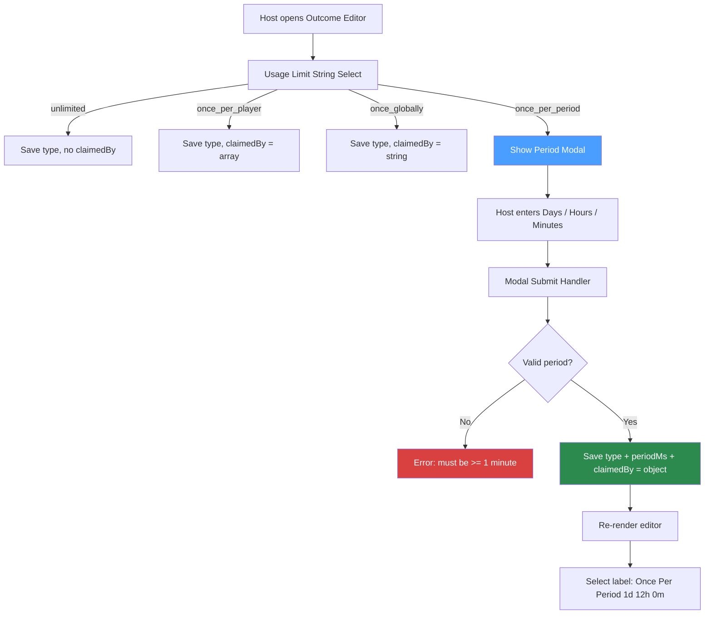
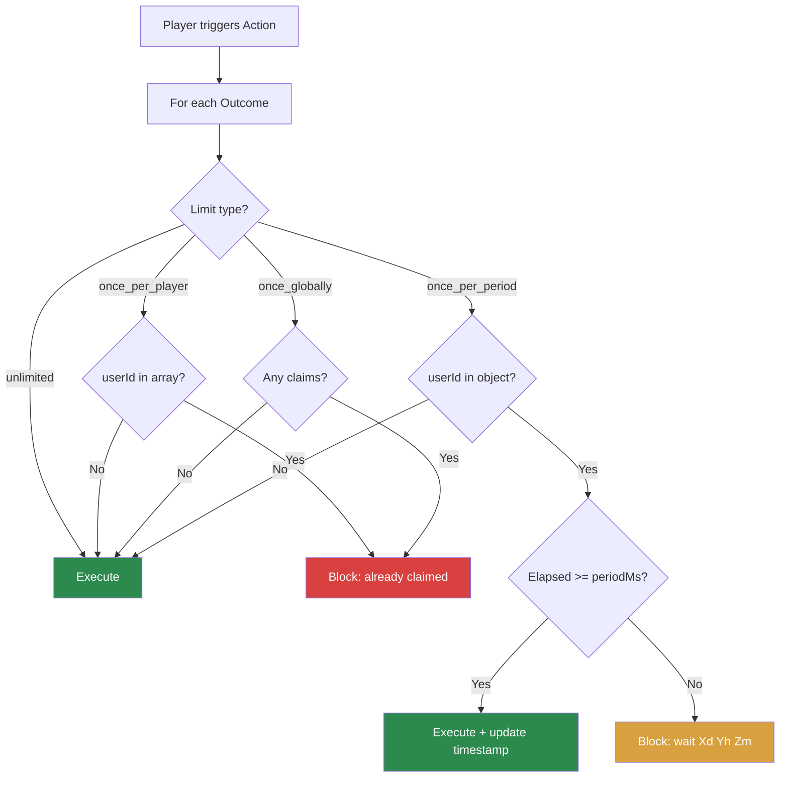
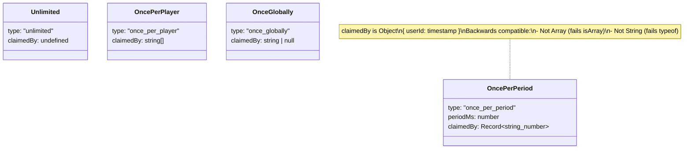

# RaP 0930: Once Per Period — New Usage Limit Type

**Date:** 2026-03-28
**Status:** Analysis
**Related:** [Action Terminology (RaP 0956)](0956_20260308_ActionTerminology_Analysis.md), [Safari Custom Actions](../03-features/SafariCustomActions.md)

---

## Original Context (User Prompt)

> We want to extend the Usage Types system to have a brand new Usage Type that lets a specific player use an action every X period, modelled after the simple stamina 'last used' system. Ideally we leverage the existing data structures and this is fully backwards compatible.
>
> The purpose of this is to add a lot of flexibility to safari, allowing timed actions such as 'water plants', 'battle enemies every x hours' etc.
>
> **Host UX:** When a host selects "Once Per Period" from the existing Usage Type string select, show a modal with days/hours/minutes inputs. On submit, update the select label to show "Once Per Period (Xd Yh Zm)".
>
> **Player UX:** If the outcome's cooldown has expired (or never used), execute normally. Otherwise show "You can only use this action every \<period\>. You need to wait \<remaining\> before you can use the action again."
>
> Also update the existing schedule modal to include Days, and look for reusability between the two modals.

---

## Problem Statement

The Usage Limit system currently supports three modes: `unlimited`, `once_per_player`, `once_globally`. These are binary — either you can use it or you can't, forever. There's no time-based reset.

Safari hosts need timed repeatable actions: water plants every 8 hours, battle enemies every 24 hours, forage every 30 minutes. This is the same "last used + elapsed time" pattern as the stamina system, but applied per-outcome rather than globally.

---

## Current System

### Usage Limit Data Structure (safariContent.json)
```javascript
action.config.limit = {
  type: 'unlimited' | 'once_per_player' | 'once_globally',
  claimedBy: [] | 'userId' | null  // array for per_player, string for globally
}
```

### Enforcement Points (safariManager.js)
| Outcome Type | Enforcement? | Lines |
|---|---|---|
| `give_currency` | Yes | ~975-1077 |
| `give_item` | Yes | ~1123-1276 |
| `modify_attribute` | Yes | ~3397-3512 |
| `fight_enemy` | UI only, no enforcement | ~9640-9761 |

### Existing Check Pattern
```javascript
if (config.limit.type === 'once_per_player') {
  if (claimedBy.includes(userId)) → block
}
if (config.limit.type === 'once_globally' && hasClaims) → block
```

### Where Usage Limit Selects Live
| Outcome Type | String Select custom_id | File |
|---|---|---|
| give_item | `safari_item_limit_{buttonId}_{itemId}_{actionIndex}` | app.js |
| give_currency | `safari_currency_limit_{buttonId}_{actionIndex}` | app.js |
| modify_attribute | `safari_modify_attr_limit_{buttonId}_{actionIndex}` | customActionUI.js |
| fight_enemy | `safari_fight_enemy_limit_{buttonId}_{actionIndex}` | customActionUI.js |

---

## Design Decision 1: Data Structure for `claimedBy`

The key question: how to store per-player timestamps in `claimedBy` while being fully backwards compatible with existing `once_per_player` (array) and `once_globally` (string) checks.

### Option A: Object Map (Recommended)
```javascript
limit: {
  type: "once_per_period",
  periodMs: 43200000,        // 12 hours in milliseconds
  claimedBy: {               // Object, not array or string
    "userId1": 1711584000000, // timestamp of last use
    "userId2": 1711591200000
  }
}
```

**Why this works for backwards compatibility:**
- Existing `once_per_player` check: `Array.isArray(claimedBy)` → `false` for object
- Existing `once_globally` check: `typeof claimedBy === 'string'` → `false` for object
- No existing code path will accidentally process an object as array or string
- Zero migration needed — new type, new shape, no collisions

**Enforcement logic:**
```javascript
if (config.limit.type === 'once_per_period') {
  const lastUsed = config.limit.claimedBy?.[userId];
  if (lastUsed && (Date.now() - lastUsed < config.limit.periodMs)) {
    const remaining = formatPeriod(config.limit.periodMs - (Date.now() - lastUsed));
    → block with cooldown message showing remaining time
  }
  // else: execute, then set claimedBy[userId] = Date.now()
}
```

**On-demand calculation** — same pattern as stamina. No background timers. Check happens at execution time.

### Option B: Tuple Array
```javascript
claimedBy: [["userId1", 1711584000000], ["userId2", 1711591200000]]
```
Still an array, so `Array.isArray()` returns true. Existing `claimedBy.includes(userId)` won't match a string against sub-arrays, but this is fragile — any code doing `.indexOf()`, `.filter()`, or iteration could behave unexpectedly. **Not recommended.**

### Option C: Separate tracking field
```javascript
limit: {
  type: "once_per_period",
  periodMs: 43200000,
  claimedBy: [],             // unused for this type
  cooldowns: { "userId1": 1711584000000 }  // new field
}
```
Works but splits tracking into two fields. Harder to reason about. Adds `cooldowns` field that existing export/import code doesn't know to strip. **Not recommended.**

**Recommendation: Option A.** Clean, backwards compatible, minimal code change.

---

## Design Decision 2: Period Storage Location

### Option A: Inside `limit` object (Recommended)
```javascript
config.limit.periodMs = 43200000
```
Period is intrinsically tied to the limit type. Keeps config and tracking together. Import/export already knows to process `config.limit`.

### Option B: Separate config field
```javascript
config.periodMs = 43200000
```
Separates "what type of limit" from "how long the period is". But now import/export needs to handle a new field at a different path.

**Recommendation: Option A.** `periodMs` lives in `limit` alongside `type` and `claimedBy`.

---

## Design Decision 3: Host UX — Select-to-Modal Pattern

When host selects "Once Per Period" from the usage limit string select, we need to collect the period (days/hours/minutes). This is the **select-to-modal** pattern.

### Flow
```
Host clicks Usage Limit string select
  → Selects "Once Per Period"
    → Handler detects once_per_period value
    → Returns modal with Days/Hours/Minutes inputs
      → Host fills in period
      → Modal submit handler:
        1. Converts D/H/M to periodMs
        2. Saves limit.type = 'once_per_period', limit.periodMs, limit.claimedBy = {}
        3. Re-renders editor with updated select label
```

### String Select Option (added to all 4 limit selects)
```javascript
{
  label: 'Once Per Period',           // or "Once Per Period (1d 12h 0m)" after config
  value: 'once_per_period',
  emoji: { name: '⏰' },
  description: 'Each player can claim once per set period (days / hours / minutes)'
}
```

After the modal is submitted, the select re-renders with the period in the label:
```javascript
label: `Once Per Period (${formatPeriod(periodMs)})`
// e.g. "Once Per Period (1d 12h 0m)"
```

### Modal Structure
```javascript
{
  custom_id: `usage_period_modal_${buttonId}_${actionIndex}_${outcomeType}`,
  title: 'Set Cooldown Period',
  components: [
    { type: 18, label: 'Days', description: '0-30 days',
      component: { type: 4, custom_id: 'period_days', style: 1, placeholder: '0', max_length: 2, required: false } },
    { type: 18, label: 'Hours', description: '0-23 hours',
      component: { type: 4, custom_id: 'period_hours', style: 1, placeholder: '12', max_length: 2, required: false } },
    { type: 18, label: 'Minutes', description: '0-59 minutes',
      component: { type: 4, custom_id: 'period_minutes', style: 1, placeholder: '0', max_length: 2, required: false } }
  ]
}
```

### Design Consideration: Which handler shows the modal?

Each of the 4 outcome types has its own limit select handler (`safari_item_limit_*`, `safari_currency_limit_*`, `safari_modify_attr_limit_*`, `safari_fight_enemy_limit_*`). When the selected value is `once_per_period`, all 4 need to show the same modal instead of just saving the value.

**Option A: Inline in each handler** — Add an `if (value === 'once_per_period') { return modal }` branch to all 4 handlers. Duplicates the modal builder 4 times.

**Option B: Shared modal builder (Recommended)** — Create a `buildPeriodModal(customId, title)` utility. Each handler calls it. One modal submit handler routes back to the correct outcome type.

The modal `custom_id` encodes enough context to route back: `usage_period_modal_{buttonId}_{actionIndex}_{outcomeType}` where outcomeType is `item`, `currency`, `attr`, or `enemy`.

---

## Design Decision 4: Shared Time Utilities (Reusability)

The user identified reusability between:
1. **New**: Once Per Period modal (days/hours/minutes → periodMs)
2. **Existing**: Schedule modal `ca_schedule_modal_*` (currently hours/minutes only, needs days added)

### Proposed Shared Utilities

```javascript
// In a utility module (e.g. timeUtils.js or added to utils.js)

/**
 * Build modal components for period input (days, hours, minutes)
 * Used by: usage_period_modal, ca_schedule_modal
 */
function buildPeriodModalComponents(options = {}) {
  const { maxDays = 30, maxHours = 23, maxMinutes = 59,
          defaultDays, defaultHours, defaultMinutes } = options;
  return [
    { type: 18, label: 'Days', description: `0-${maxDays} days`,
      component: { type: 4, custom_id: 'period_days', style: 1,
                   placeholder: String(defaultDays ?? '0'), max_length: 2, required: false } },
    { type: 18, label: 'Hours', description: `0-${maxHours} hours`,
      component: { type: 4, custom_id: 'period_hours', style: 1,
                   placeholder: String(defaultHours ?? '0'), max_length: 2, required: false } },
    { type: 18, label: 'Minutes', description: `0-${maxMinutes} minutes`,
      component: { type: 4, custom_id: 'period_minutes', style: 1,
                   placeholder: String(defaultMinutes ?? '0'), max_length: 2, required: false } }
  ];
}

/**
 * Parse period modal submission components into milliseconds
 * Returns { days, hours, minutes, totalMs } or { error: string }
 */
function parsePeriodFromModal(components) {
  let days = 0, hours = 0, minutes = 0;
  for (const comp of components) {
    const child = comp.component || comp.components?.[0];
    if (!child) continue;
    if (child.custom_id === 'period_days') days = parseInt(child.value?.trim()) || 0;
    if (child.custom_id === 'period_hours') hours = parseInt(child.value?.trim()) || 0;
    if (child.custom_id === 'period_minutes') minutes = parseInt(child.value?.trim()) || 0;
  }
  if (days < 0 || hours < 0 || minutes < 0) return { error: 'Values cannot be negative' };
  if (days > 30) return { error: 'Maximum 30 days' };
  if (hours > 23) return { error: 'Maximum 23 hours' };
  if (minutes > 59) return { error: 'Maximum 59 minutes' };
  const totalMs = (days * 86400000) + (hours * 3600000) + (minutes * 60000);
  if (totalMs === 0) return { error: 'Period must be at least 1 minute' };
  return { days, hours, minutes, totalMs };
}

/**
 * Format milliseconds to human-readable period string
 * Used by: select labels, cooldown messages, schedule display, stamina display
 */
function formatPeriod(ms) {
  const days = Math.floor(ms / 86400000);
  const hours = Math.floor((ms % 86400000) / 3600000);
  const minutes = Math.floor((ms % 3600000) / 60000);
  const parts = [];
  if (days > 0) parts.push(`${days}d`);
  if (hours > 0 || days > 0) parts.push(`${hours}h`);
  parts.push(`${minutes}m`);
  return parts.join(' ');
}
```

### Schedule Modal Update

The existing `ca_schedule_modal` (app.js ~23402-23479) currently has only Hours and Minutes. Update to:
1. Replace inline modal component building with `buildPeriodModalComponents()`
2. Replace inline parsing in submit handler (~46829-46923) with `parsePeriodFromModal()`
3. Add Days field (the existing `schedule_hours` / `schedule_minutes` custom_ids would change to `period_days` / `period_hours` / `period_minutes` for consistency)

**Breaking change consideration:** The `ca_schedule_modal` submit handler currently looks for `schedule_hours` and `schedule_minutes` custom_ids. Changing to `period_*` means both the modal builder AND submit handler must be updated together. This is safe since they're always deployed together.

---

## Design Decision 5: Player Cooldown Message

When a player triggers an action with an outcome on cooldown:

```
⏰ You can only use this every 12h 0m. You need to wait 3h 16m before you can use it again.
```

### What gets blocked?

The `once_per_period` check is **per-outcome**, matching the existing limit system. If an action has 3 outcomes and only outcome 2 is on cooldown:
- Outcome 1: executes normally
- Outcome 2: shows cooldown message, skipped
- Outcome 3: executes normally

This matches how `once_per_player` works today — blocking is per-outcome, not per-action.

### Remaining Time Calculation
```javascript
const elapsed = Date.now() - lastUsed;
const remaining = periodMs - elapsed;
const message = `⏰ You can only use this every ${formatPeriod(periodMs)}. ` +
  `You need to wait ${formatPeriod(remaining)} before you can use it again.`;
```

Same on-demand pattern as stamina — no timers, just math at execution time.

---

## Design Decision 6: Reset Mechanism

### Admin Reset
Existing reset buttons (`safari_item_reset_*`, `safari_currency_reset_*`, etc.) need a new branch:
```javascript
if (action.config.limit.type === 'once_per_period') {
  action.config.limit.claimedBy = {};  // Clear all cooldowns, preserve periodMs
}
```

### Import/Export
- **Export:** Strip `claimedBy` (existing behavior). Keep `type` and `periodMs`.
  ```javascript
  // safariImportExport.js
  if (filtered.config.limit) {
    filtered.config.limit = {
      type: filtered.config.limit.type,
      ...(filtered.config.limit.periodMs && { periodMs: filtered.config.limit.periodMs })
    };
  }
  ```
- **Import:** Initialize `claimedBy = {}` for `once_per_period`.
  ```javascript
  if (limitType === 'once_per_period') {
    action.config.limit.claimedBy = {};
  }
  ```

### Type Switching
When a host changes limit type (e.g. `once_per_player` → `once_per_period` or vice versa), `claimedBy` must be reset to the new type's shape:
- → `once_per_player`: `claimedBy = []`
- → `once_globally`: `claimedBy = null`
- → `once_per_period`: `claimedBy = {}`
- → `unlimited`: delete `limit` or set `type: 'unlimited'`

This is already partially handled — existing handlers reset claimedBy on type change. Just need to add the `once_per_period` case.

---

## Implementation Scope

### Files to Modify

| File | Change | Scope |
|---|---|---|
| `utils.js` (or new `timeUtils.js`) | Add `buildPeriodModalComponents`, `parsePeriodFromModal`, `formatPeriod` | New utilities |
| `app.js` — limit select handlers (x4) | Add `if (value === 'once_per_period') → show modal` branch | ~4 x 5 lines |
| `app.js` — new modal submit handler | `usage_period_modal_*` handler, saves periodMs, re-renders editor | ~30 lines |
| `app.js` — schedule modal builder | Replace inline with shared `buildPeriodModalComponents()`, add Days | Refactor ~20 lines |
| `app.js` — schedule modal submit | Replace inline parsing with shared `parsePeriodFromModal()` | Refactor ~15 lines |
| `customActionUI.js` — limit selects | Add "Once Per Period" option to all 4 limit select builders | ~4 x 3 lines |
| `customActionUI.js` — select label | Dynamic label showing period when type is `once_per_period` | ~4 x 2 lines |
| `safariManager.js` — enforcement (x4) | Add `once_per_period` check + timestamp update in execution functions | ~4 x 15 lines |
| `safariManager.js` — reset handlers | Add `claimedBy = {}` branch for `once_per_period` | ~4 x 2 lines |
| `safariImportExport.js` | Preserve `periodMs` on export, initialize `claimedBy = {}` on import | ~5 lines |
| `buttonHandlerFactory.js` | Register new modal + submit handler in BUTTON_REGISTRY | ~10 lines |

### Files NOT Modified
- `safariContent.json` — no migration, new data shape only appears when hosts create `once_per_period` outcomes
- `pointsManager.js` — stamina system untouched, we're just borrowing the pattern
- `scheduler.js` — no changes, schedule modal update is cosmetic (adds days)

---

## Risk Assessment

| Risk | Level | Mitigation |
|---|---|---|
| Backwards compatibility | **Low** | Object `claimedBy` won't match array/string checks. New type = new code path. |
| Data corruption | **Low** | Only writes new shape when type is `once_per_period`. Existing data untouched. |
| fight_enemy enforcement gap | **Pre-existing** | fight_enemy has limit UI but no enforcement for ANY type. Not introduced by this change. Should be fixed separately. |
| Component count (40 limit) | **None** | No new components added to editor — just a new option in existing select. Modal is separate. |
| Schedule modal breaking change | **Low** | custom_id rename (`schedule_hours` → `period_hours`) requires updating builder + handler together. Same deploy. |

---

## Recommendation

**Go with Option A across all decisions:**
1. **Object map** for `claimedBy` — clean, backwards compatible, zero migration
2. **`periodMs` inside `limit`** — keeps config together
3. **Shared time utilities** — `buildPeriodModalComponents()`, `parsePeriodFromModal()`, `formatPeriod()`
4. **Select-to-modal** via factory with `requiresModal: true`
5. **Single modal submit handler** for all 4 outcome types, routed by outcomeType in custom_id

### Execution Order
1. Create shared time utilities
2. Update schedule modal to use them (+ add Days) — validates utilities work
3. Add "Once Per Period" option to all 4 limit string selects
4. Add select-to-modal handler (shows period modal when selected)
5. Add modal submit handler (saves periodMs, re-renders editor)
6. Add enforcement logic in all 4 execution functions
7. Update reset + import/export handlers
8. Tests for time utilities + enforcement logic

---

## Mermaid: Host Configuration Flow



## Mermaid: Player Execution Flow



## Mermaid: Data Structure Comparison


