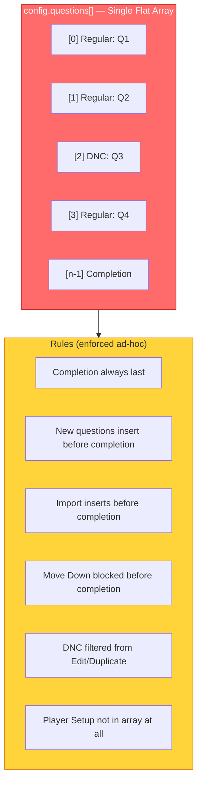

# Question Ordering — Why Everything Keeps Breaking

## Original Context

> Try to think of some clever universal question ordering hierarchy as it seems all of our bugs are to do with the order and we are going to keep coming up against this. Think deeply and come up with possible solutions and then the considerations, inc tech risk from changing things.

## 🤔 The Problem

Every bug in this session traced back to **question ordering confusion**:

1. **Import pushed after completion** — `config.questions.push()` added questions AFTER the completion, making them invisible
2. **Auto-inject added duplicates** — old seasons got a NEW completion instead of converting the existing last question
3. **Index mismatch** — the completion handler used array index 10 but the UI showed Q9's content at that position
4. **Page size changes** — moving from 10→8 per page meant all hardcoded `/10` calculations were wrong
5. **Move Down swapped with completion** — no guard prevented swapping a regular question with the completion

**Root cause:** The `config.questions[]` array serves THREE purposes simultaneously:
- **Storage order** (array position)
- **Display order** (Q1, Q2, Q3...)
- **Type hierarchy** (regular vs special vs completion)

When special types (completion, DNC) were added to the same array as regular questions, the single-array model started fighting itself.

## 📊 Current Architecture



**The fragility:** Every new feature (import, duplicate, move, DNC) must independently remember ALL the ordering rules. Miss one → bug.

## 💡 Proposed Solutions

### Option A: Explicit `sortOrder` Field (Low Risk)

Add a `sortOrder` number to each question. Render/iterate by `sortOrder`, not array position.

```javascript
// Each question gets:
{ id: 'q_abc', questionType: 'text', sortOrder: 100 }
{ id: 'q_def', questionType: 'dnc', sortOrder: 200 }
{ id: 'q_ghi', questionType: 'completion', sortOrder: 99999 }
```

**Rendering:** `config.questions.sort((a, b) => a.sortOrder - b.sortOrder)`

**Insert logic:** New questions get `sortOrder = maxRegularSortOrder + 100`. Completion always has `sortOrder: 99999`.

**Pros:**
- Array position stops mattering — any order in storage is fine
- Completion is always last by virtue of its high sortOrder
- Move Up/Down just swap sortOrder values
- Import just assigns sequential sortOrders
- No more "insert before completion" logic needed

**Cons:**
- Migration: need to assign sortOrder to all existing questions
- Every mutation must maintain sortOrder consistency
- Gap numbering (100, 200, 300) needed to allow inserts without renumbering

**Risk: LOW** — additive change, backwards compatible with `sortOrder || arrayIndex` fallback

### Option B: Separate Arrays by Type (Medium Risk)

Split `config.questions` into typed arrays:

```javascript
config.applicationFlow = {
  playerSetup: { enabled: true },   // Always first
  questions: [                       // Regular + DNC, ordered by array position
    { questionType: 'text', ... },
    { questionType: 'dnc', ... },
    { questionType: 'text', ... }
  ],
  completion: {                      // Always last, single object
    questionTitle: 'Thank you!',
    questionText: '...'
  }
}
```

**Pros:**
- Completion can NEVER be in the wrong position — it's a separate field
- No filtering needed — `questions[]` only has renderable questions
- Player setup is a config flag, not an array item
- Import/export only touches `questions[]`

**Cons:**
- **Breaking change** — every handler that reads `config.questions` needs updating
- Migration script needed for all existing data
- `showApplicationQuestion` needs to know about the separate completion
- Export/import format changes

**Risk: MEDIUM-HIGH** — touches every handler, migration complexity

### Option C: Type-Based Rendering Pipeline (Medium Risk)

Keep single array but add a **rendering pipeline** that sorts and filters before display:

```javascript
function getOrderedQuestions(config) {
  const questions = config.questions || [];

  // Sort: regular questions by array position, special types by priority
  const TYPE_PRIORITY = {
    undefined: 1,    // Regular questions — sorted by position
    'text': 1,
    'dnc': 1,
    'completion': 999  // Always last
  };

  return questions
    .map((q, i) => ({ ...q, _originalIndex: i }))
    .sort((a, b) => {
      const aPri = TYPE_PRIORITY[a.questionType] || 1;
      const bPri = TYPE_PRIORITY[b.questionType] || 1;
      if (aPri !== bPri) return aPri - bPri;
      return a._originalIndex - b._originalIndex;
    });
}
```

**All rendering and handlers use `getOrderedQuestions()`** instead of raw `config.questions`.

**Mutations** (add, move, delete, import) operate on the raw array but call a **normalize function** after:

```javascript
function normalizeQuestionOrder(questions) {
  // Ensure completion is always last
  const completionIdx = questions.findIndex(q => q.questionType === 'completion');
  if (completionIdx >= 0 && completionIdx !== questions.length - 1) {
    const [completion] = questions.splice(completionIdx, 1);
    questions.push(completion);
  }
  return questions;
}
```

**Pros:**
- Single source of truth (one function handles all ordering)
- Raw array mutations are safe — normalize fixes any mistakes
- Minimal migration — just add the helper functions
- All existing handlers keep working

**Cons:**
- Performance: sorting on every render (negligible for <50 questions)
- Must remember to call normalize after mutations
- Doesn't prevent bugs — just fixes them post-mutation

**Risk: LOW** — additive, no data model changes

## ⚠️ Risk Assessment

| Option | Data Migration | Handler Changes | Risk of New Bugs | Backwards Compat |
|--------|---------------|-----------------|-------------------|-----------------|
| **A: sortOrder** | Add field to existing | Moderate (render logic) | Low | ✅ Fallback to index |
| **B: Separate Arrays** | Full restructure | High (every handler) | Medium | ❌ Breaking |
| **C: Rendering Pipeline** | None | Low (add helpers) | Low | ✅ Additive |

## 💡 Recommendation: Option C (Rendering Pipeline) → Then Option A

**Phase 1 (now):** Implement Option C — add `getOrderedQuestions()` and `normalizeQuestionOrder()` helpers. Zero migration, zero data changes, fixes all ordering bugs at the rendering layer.

**Phase 2 (later):** Add `sortOrder` field (Option A) when we need more complex ordering (e.g., host-defined sections, conditional questions). The pipeline from Phase 1 naturally extends to read `sortOrder` instead of array position.

**Why not Option B:** Too risky for the benefit. The completion being a separate field is clean but touching every handler in a 21K-line file for a cosmetic data model improvement isn't worth the regression risk.

## 📎 Related Documents

- [RaP 0937: Special Question Components](0937_20260320_SpecialQuestionComponents_Analysis.md)
- [SeasonAppBuilder.md](../03-features/SeasonAppBuilder.md)
