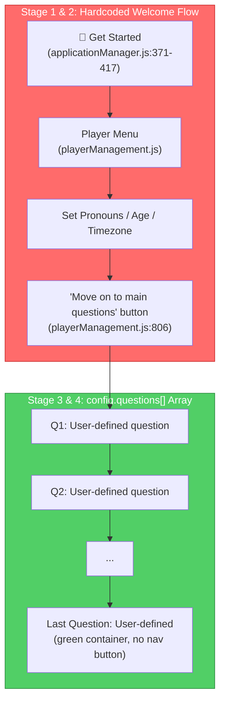
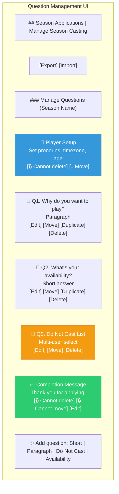
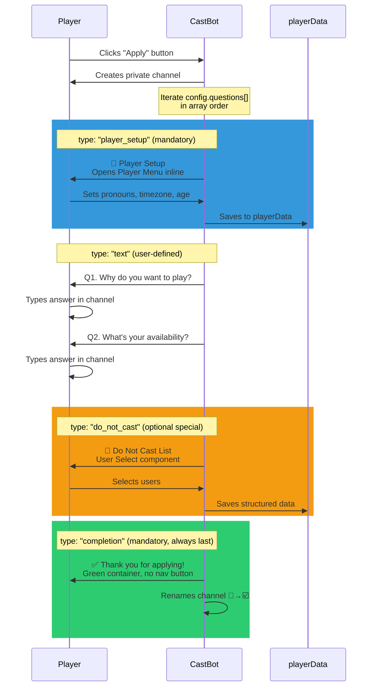

# Special Question Components — Pre-defined, Rich Application Questions

## Original Context

> What I'm hoping is.. to Make Stage 1 & 2 included as (for now), questions that are displayed in Admin Question Management UI, but non-deletable, and potentially moveable. Basically I have a set of 'standard' specialised question components that I have in mind, the ones that are already in there are mandatory but really represent the type of 'rich' castbot input capture for Applications I want to differentiate from other bots in the future; so from a data structure perspective we need a way to progressively capture 'special' pre-defined questions. Pronouns / Age / Timezone will likely always be mandatory with the option to move it to later questions, but unlikely to be deletable. But I want to add in optional pre-defined components in the future like Do Not Cast List which could be optional (e.g. can be deleted or re-added into questions, but pre-defined and potentially configurable by hosts, and captures data in a standardised format).

## 🤔 The Problem

CastBot's application flow currently has **two completely separate systems** that happen to run sequentially:



**The gap:** Hosts can't see, reorder, or control the pre-built stages. They can't add new standardised data capture components (like "Do Not Cast List") without custom code. And the pre-built components (pronouns/age/timezone) are invisible in the Question Management UI despite being part of every application.

### What Hosts See Today

In the admin Question Management UI, hosts see ONLY their custom text questions:
```
Q1. Why do you want to play?
Q2. What's your availability?
Last Question. Thank you for applying!
```

But the actual player experience is:
```
1. 🚀 Welcome message (hardcoded)
2. Player Menu: Set pronouns, timezone, age (hardcoded, separate UI)
3. "Move on to main questions" button
4. Q1. Why do you want to play?
5. Q2. What's your availability?
6. Thank you for applying! (green, no next button)
```

Stages 1-3 are invisible to hosts. The "Last Question" label in admin doesn't match the player's actual "last" experience.

## 🏛️ Current Architecture

### Question Data Structure (today)

```javascript
// config.questions[i]
{
  id: "question_abc123",        // Unique ID
  order: 1,                     // Stored but never used for sorting
  questionTitle: "Why play?",   // Short label
  questionText: "Tell us...",   // Full question body
  questionStyle: 2,             // 1=short, 2=paragraph (buggy — not always stored)
  imageURL: "",                 // Optional image
  createdAt: 1234567890
}
```

**Problems with current structure:**
- No `type` field — all questions are plain text input
- `order` field exists but array position is the real order
- `questionStyle` is sometimes missing (set during creation but not always persisted)
- No way to mark questions as special, mandatory, or system-defined
- No standardised data capture — everything is freeform text

### Player Data Capture (today)

| Data | Where Captured | Where Stored | Format |
|------|---------------|-------------|--------|
| Pronouns | Player Menu (reaction roles) | `client.roleReactions` Map + `playerData[guildId].reactionMappings` | Discord role assignment |
| Timezone | Player Menu (reaction roles) | Same as pronouns, `isTimezone: true` | Discord role assignment |
| Age | Player Menu (modal) | `playerData[guildId].players[userId].age` | Number |
| Q&A answers | Application questions | **Not stored!** Only visible as Discord messages | Freeform text in channel |

**Critical insight:** Application question answers are NOT persisted anywhere in playerData — they exist only as Discord messages in the application channel. This is fine for now but limits future features like automated casting, answer search, or cross-season comparisons.

## 💡 Proposed Design: Special Question Components

### Core Concept

Introduce a **`questionType`** field on each question that determines how it's rendered and what data it captures. Questions in `config.questions[]` can be either **user-defined** (freeform text, today's default) or **special** (pre-defined components with standardised rendering and data capture).

### Question Type Registry

```javascript
// Proposed question type definitions
const QUESTION_TYPES = {
  // --- User-defined (existing) ---
  'text': {
    label: 'Text Question',
    description: 'Freeform text answer (short or paragraph)',
    emoji: '📝',
    deletable: true,
    moveable: true,
    configurable: true,  // Host can edit title/text
    renderer: 'text',    // Standard text display + text input
    dataCapture: null,    // Answers stay as Discord messages
  },

  // --- Special: Mandatory ---
  'player_setup': {
    label: 'Player Setup',
    description: 'Pronouns, timezone, and age (CastBot Player Menu)',
    emoji: '🪪',
    deletable: false,     // Cannot be removed
    moveable: true,       // Can be reordered
    configurable: false,  // Rendering is system-defined
    renderer: 'player_menu',  // Opens the CastBot Player Menu
    dataCapture: 'playerData', // Saves to playerData (pronouns, tz, age)
    mandatory: true,
    defaultPosition: 0,   // First by default
  },

  // --- Special: Optional (future) ---
  'do_not_cast': {
    label: 'Do Not Cast List',
    description: 'Players the applicant does not want to be cast with',
    emoji: '🚫',
    deletable: true,      // Host can remove it
    moveable: true,
    configurable: true,   // Host can customise the prompt text
    renderer: 'user_select',  // Multi-user select component
    dataCapture: 'structured', // Saves as structured data in playerData
    defaultTitle: 'Do Not Cast List',
    defaultText: 'Select any players you would prefer not to be cast with.',
    maxSelections: 10,
  },

  'availability': {
    label: 'Availability Schedule',
    description: 'When the player is available to participate',
    emoji: '📅',
    deletable: true,
    moveable: true,
    configurable: true,
    renderer: 'checkbox_group',  // Checkbox group with day/time options
    dataCapture: 'structured',
    defaultTitle: 'Availability',
    defaultText: 'Select all times you are typically available.',
  },

  'playstyle': {
    label: 'Playstyle Preferences',
    description: 'How the player prefers to play (competitive, social, etc)',
    emoji: '🎮',
    deletable: true,
    moveable: true,
    configurable: true,
    renderer: 'radio_group',  // Radio buttons for single selection
    dataCapture: 'structured',
    defaultTitle: 'Playstyle',
    defaultText: 'What best describes your play style?',
  },

  'completion': {
    label: 'Completion Message',
    description: 'Final "thank you" screen (no answer expected)',
    emoji: '✅',
    deletable: false,
    moveable: false,      // Always last
    configurable: true,   // Host can customise text and image
    renderer: 'completion', // Green container, no navigation button
    dataCapture: null,
    mandatory: true,
    forcePosition: 'last',  // Always at the end
  }
};
```

### Updated Question Data Structure

```javascript
// Enhanced question object
{
  id: "question_abc123",
  questionType: "text",           // NEW — defaults to "text" for backwards compat
  questionTitle: "Why play?",
  questionText: "Tell us...",
  questionStyle: 2,               // Only for type "text"
  imageURL: "",
  createdAt: 1234567890,

  // Special question fields (type-specific)
  deletable: true,                // Can host delete this? (derived from type registry)
  mandatory: false,               // Is this required in every app config?

  // For structured data capture types
  options: [],                    // For checkbox/radio/select types
  maxSelections: null,            // For multi-select types
  capturedData: {},               // Runtime: what the player submitted
}
```

### Backwards Compatibility

**Migration is zero-effort:**
- Existing questions have no `questionType` field → default to `"text"`
- Existing `showApplicationQuestion()` already handles `"text"` rendering
- The `player_setup` type replaces the hardcoded welcome flow — injected at position 0 if missing
- The `completion` type replaces the "last question is special" logic — injected at end if missing

```javascript
// In showApplicationQuestion() or buildQuestionManagementUI():
const questionType = question.questionType || 'text';
const typeConfig = QUESTION_TYPES[questionType];
```

## 📊 Architecture: How It All Fits Together

### Admin Question Management UI (Enhanced)



**Key UI changes:**
- Special questions show their type emoji and a lock icon if non-deletable
- The select menu options adapt: no "Delete" for mandatory, no "Move Down" for completion
- The "Add Question" select includes special types (if not already present)
- Completion question is always rendered last regardless of array position

### Player Application Flow (Enhanced)



### Rendering Strategy

Each `questionType` maps to a **renderer** that knows how to display it:

```javascript
async function showApplicationQuestion(res, config, channelId, questionIndex) {
  const question = config.questions[questionIndex];
  const questionType = question.questionType || 'text';
  const typeConfig = QUESTION_TYPES[questionType];

  switch (typeConfig.renderer) {
    case 'text':
      // Existing logic: Text Display + optional image + Next button
      return renderTextQuestion(res, config, channelId, questionIndex);

    case 'player_menu':
      // Show the CastBot Player Menu (pronouns/age/timezone)
      // with an integrated "Next" button instead of "Move on to main questions"
      return renderPlayerSetupQuestion(res, config, channelId, questionIndex);

    case 'user_select':
      // Show a User Select component for Do Not Cast
      return renderUserSelectQuestion(res, config, channelId, questionIndex);

    case 'checkbox_group':
      // Show checkboxes (availability, etc)
      return renderCheckboxQuestion(res, config, channelId, questionIndex);

    case 'radio_group':
      // Show radio buttons (playstyle, etc)
      return renderRadioQuestion(res, config, channelId, questionIndex);

    case 'completion':
      // Green container, no navigation, channel rename
      return renderCompletionQuestion(res, config, channelId, questionIndex);
  }
}
```

## 🔧 Implementation Plan

### Phase 1: Foundation (data structure + admin UI changes)

**Goal:** Add `questionType` field, auto-inject `player_setup` and `completion`, show them in admin UI with appropriate restrictions.

1. **Add `questionType` field** to question objects — default `"text"` for backwards compat
2. **Create `QUESTION_TYPES` registry** in a new `config/questionTypes.js`
3. **Auto-inject special questions** on config load if missing:
   - `player_setup` at position 0 (if no question with that type exists)
   - `completion` at end (if no question with that type exists)
4. **Update `buildQuestionManagementUI`**:
   - Show type emoji and lock icons for special questions
   - Hide Delete option for `deletable: false` types
   - Hide Move Down for `forcePosition: 'last'` types
   - Hide Move Up for position 0 mandatory types
5. **Update `showApplicationQuestion`**:
   - Route to type-specific renderer
   - `player_setup` renderer shows Player Menu inline with Next button
   - `completion` renderer uses existing "last question" logic (green, no nav)
6. **Remove hardcoded welcome flow** — the `createApplicationChannel` welcome message becomes simpler (just "Welcome, your application starts below") and the Player Menu step is now a question in the array

**Estimated effort:** 1-2 sessions

### Phase 2: Optional Special Components

**Goal:** Add "Do Not Cast List" and other optional components that hosts can add/remove.

1. **Add "Do Not Cast" type** to registry
2. **Update "Add Question" select** to include available special types (only show types not already in the config)
3. **Implement `user_select` renderer** — Discord User Select component
4. **Implement structured data capture** — save selections to `playerData[guildId].players[userId].applicationData`
5. **Add "re-add" capability** — if a deletable special type was removed, it appears in the Add menu

**Estimated effort:** 1 session per component type

### Phase 3: Configurable Special Components

**Goal:** Let hosts customise special components (change prompt text, options, limits).

1. **Edit modal for special types** — show editable fields based on `configurable` flag
2. **Option management** for checkbox/radio types (add/remove/reorder options)
3. **Host preview** — show what the player will see

**Estimated effort:** 1 session

## ⚠️ Design Decisions & Trade-offs

### Decision 1: Inject vs. Hardcode

**Chosen:** Auto-inject special questions into `config.questions[]` on load

**Why:**
- Single source of truth — the questions array IS the application flow
- Hosts can see and reorder everything
- No more invisible stages
- Backwards compatible — old configs get special questions auto-injected

**Alternative rejected:** Keep hardcoded stages separate
- Would perpetuate the invisible stage problem
- Two systems to maintain

### Decision 2: `order` Field vs. Array Position

**Chosen:** Continue using array position as the source of truth for ordering

**Why:**
- Already works this way everywhere
- `order` field is already out of sync (set but never read)
- Simpler — no sorting step needed
- Move up/down directly manipulates array position

**Recommendation:** Stop setting `order` on new questions, or set it from array index after every mutation for debugging visibility.

### Decision 3: `forcePosition: 'last'` for Completion

**Chosen:** Enforce completion at end via the `forcePosition` flag

**Why:**
- Current "last question" logic already treats the final question specially (green, no nav)
- Moving completion to the middle would break the flow
- Hosts expect the "thank you" to be last

**Implementation:** The Move Down option is hidden for completion. If somehow it gets moved (import?), the renderer can re-sort on load.

### Decision 4: Data Capture for Text Questions

**Chosen:** Text question answers remain as Discord messages (no persistence)

**Why:**
- Changing this requires message reading (back to MessageContent intent!)
- The current flow works — hosts read answers in the channel
- Structured data capture only for special types that use Discord components (selects, checkboxes)

**Future consideration:** Could add a "record answer" step where the bot copies the player's message content into playerData after the Next button is clicked — but this requires MessageContent intent or a modal-based answer flow.

### Decision 5: Player Setup as a Single Question vs. Three Separate Questions

**Chosen:** Single `player_setup` question that opens the full Player Menu

**Why:**
- Pronouns, timezone, and age are already tightly coupled in the Player Menu
- Breaking them into 3 separate questions would mean 3 separate Discord interactions for what's currently 1 screen
- The Player Menu already handles all the role assignment, modal display, etc.
- Future: if we want them separate, we can add `pronoun_select`, `timezone_select`, `age_input` types later

**Trade-off:** Can't reorder pronouns vs age vs timezone independently. This seems acceptable since hosts rarely need that granularity.

## 📎 Related Documents

- [SeasonAppBuilder.md](../03-features/SeasonAppBuilder.md) — Current feature reference
- [ComponentsV2.md](../standards/ComponentsV2.md) — Component types available for rendering
- [RaP 0940: Privileged Intents](0940_20260317_PrivilegedIntents_Analysis.md) — MessageContent constraint on data capture
- [DiscordInteractionAPI.md](../standards/DiscordInteractionAPI.md) — Interaction patterns for multi-step flows
