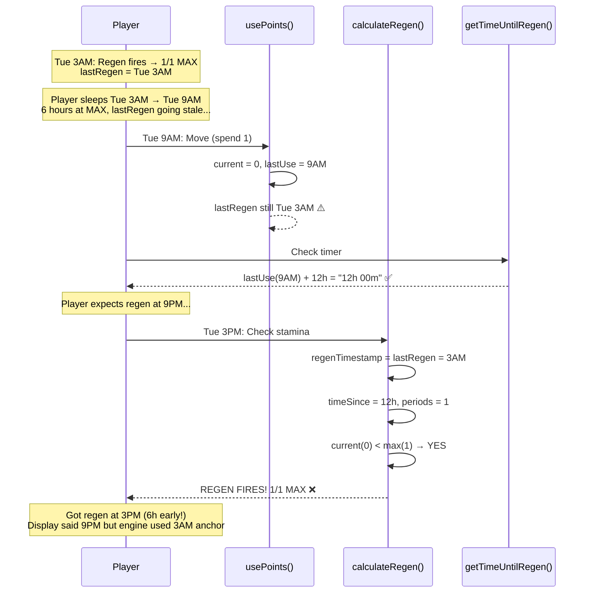
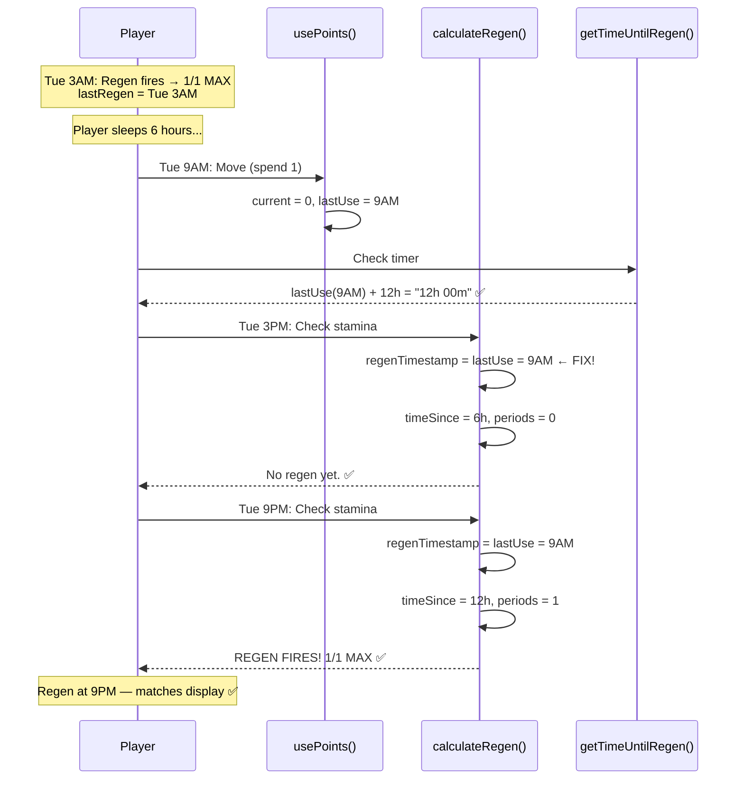

# Stamina Regen Timer Bug — Display vs Actual Regen Mismatch

> **RaP #0938** | 2026-03-20
> **Status**: Fix deployed to prod (2026-03-20). Unit tests and guide updates pending.
> **Severity**: Medium — stamina regens earlier than displayed timer shows
> **Affected servers**: Any server using `full_reset` regen mode (all current servers)

---

## 1. The Bug (ELI5)

The regen timer doesn't restart properly when a player moves after being at MAX for a while.

- Player's last regen was at 3AM → they sleep → wake up at 9AM (at MAX for 6 hours)
- Player moves at 9AM → display says "wait 12h" (until 9PM)
- But the internal timer is anchored to 3AM → regen actually fires at 3PM (6 hours early)
- The longer a player sits at MAX before moving, the worse the cheat

**Root cause:** Two different timestamps control regen, and they disagree:

| What | Timestamp | Updated when | Used by |
|---|---|---|---|
| `lastUse` | When player last spent stamina | `usePoints()` | Display timer ✅ |
| `lastRegeneration` | When regen last fired | `calculateRegen()` | **Actual regen** ⚠️ |

`lastRegeneration` goes stale when player sits at MAX. `lastUse` stays current.

---

## 2. Test Cases

### Test Case 0: The Overnight Exploit (Most Common)

**Setup:** 1/1 MAX, 12h regen, no items needed to reproduce.

- 2:48AM: Player makes last move of the night → 0/1
- 3:00AM: Regen fires → 1/1 MAX. `lastRegen = 3AM`. Player sleeps.
- 3AM–9AM: Sleeping at MAX for 6 hours. `lastRegen` stays at 3AM.
- 9:00AM: **Move** → 0/1. Display: ♻️12h. `lastRegen` still 3AM (6h stale).
- 9:01AM: Regen engine checks: `3AM + 12h = 3PM`. Still 6h away. No regen yet.
- **3:00PM: REGEN FIRES** — 12h from `lastRegen` (3AM), not from move (9AM).

**Got:** Next move available at 3PM (6h wait).
**Expected:** Next move available at 9PM (12h wait).
**Cheated:** 6 hours of free time from sleeping at MAX.

### Test Case 1: Move → Consumable → Move (With Key)

**Setup:** 1/1 MAX, key (+1 stamina), 12h regen. `lastRegen = 9AM` (just regened).

- 9:05AM: Move → 0/1. `lastUse = 9:05`. `lastRegen = 9:00` (5m stale).
- 10:05AM: Use key → 1/1. No timer changes. ✅
- 10:10AM: Move → 0/1. `lastUse = 10:10`. `lastRegen` still 9:00.
- Display: ♻️10h 55m (from `lastUse` 10:10 → 10:05PM). ✅
- **9:00PM: REGEN FIRES** — 12h from `lastRegen` (9AM), not from `lastUse` (10:10AM).

**Got:** Regen at 9:00PM. **Expected:** 9:05PM (or 10:10PM depending on design).
**Difference:** 5 minutes early in this case. Small, but demonstrates the drift.

### Test Case 2: Extended Idle → Instant Regen (Nuclear Case)

**Setup:** Player regened to 1/1 at Tuesday 9AM. Doesn't play until Thursday.

- Tue 9AM: Regen fires → 1/1. `lastRegen = Tue 9AM`.
- Wed: Not playing. `lastRegen` stays Tue 9AM (24h+ stale).
- Thu 11AM: Move → 0/1. `lastUse = Thu 11AM`. Display: ♻️12h.
- Thu 11:01AM: Regen engine checks: `Tue 9AM + 12h = Tue 9PM`. Already 38h ago! `periods = floor(50h/12h) = 4`. **REGEN FIRES INSTANTLY.**

**Got:** Stamina back in 1 minute.
**Expected:** 12 hour wait.

### Test Case 3: Consumable Right Before Natural Regen

**Setup:** 1/1 MAX at 9AM, key, 12h regen.

- 11AM: Move → 0/1. `lastUse = 11AM`. `lastRegen = 9AM`.
- 9PM: Use key → 1/1. No timer changes.
- 10PM: Move → 0/1. `lastUse = 10PM`. `lastRegen` still 9AM.
- 10:01PM: Regen calc: `9AM + 12h = 9PM`. Already passed! **REGEN FIRES INSTANTLY.**

**Got:** Stamina back in 1 minute after 10PM move.
**Expected:** Wait until at least 11PM (old timer from 11AM move) or 10AM next day (new 12h from 10PM move).

---

## 3. Architecture Diagram


## 4. Timer Flow — Overnight Exploit



## 5. Timer Flow — Post-Fix



---

## 6. Root Cause (Code)

```javascript
// pointsManager.js — calculateRegenerationWithCharges()
// BEFORE FIX:
const regenTimestamp = newData.lastRegeneration || newData.lastUse;
// ↑ Prefers lastRegeneration, which goes stale when player is at MAX

// AFTER FIX:
const regenTimestamp = newData.lastUse || newData.lastRegeneration;
// ↑ Prefers lastUse, which is always current (set on every move)
```

```javascript
// pointsManager.js — usePoints()
points.current -= amount;
if (!points.charges || chargesUsed > 0) {
    points.lastUse = now;   // ← Always updated on move ✅
}
// lastRegeneration is NOT updated here — only when regen fires
// This is fine now because the regen engine prefers lastUse
```

```javascript
// pointsManager.js — getTimeUntilRegeneration()
// Display timer (ALWAYS used lastUse — was already correct):
nextRegenTime = pointData.lastUse + config.regeneration.interval;
```

---

## 7. The Fix (Applied)

**One line change in `calculateRegenerationWithCharges()`:** Swap `lastRegeneration || lastUse` to `lastUse || lastRegeneration`.

For `full_reset` mode (all current servers), the regen timer now anchors to `lastUse` (when the player last moved), matching the display timer exactly. `lastRegeneration` is kept as fallback for edge cases where `lastUse` doesn't exist.

**What changed:**
- Regen engine and display timer now use the same anchor (`lastUse`)
- Stale `lastRegeneration` from idle time at MAX no longer causes early regen
- Consumable items still don't touch any timer (correct)

**What didn't change:**
- `addBonusPoints()` — still doesn't modify timers (consumables work the same)
- `usePoints()` — still sets `lastUse = now` on every move
- Phase 2 charges path — uses per-charge timestamps, not affected by this fix
- Display timer — was already using `lastUse`, no change needed

**Deployed:** 2026-03-20 to both dev and prod.

---

## 8. Do We Need Two Timer Fields?

**Short answer: No, not for `full_reset` mode.**

- `lastUse` = when player last spent stamina. Display uses this. Now regen uses this too.
- `lastRegeneration` = when regen last fired. Was needed for continuous ticking mode (`regenAmount = 5 per cycle`) where regen fires multiple times. No server currently uses this mode.

For `full_reset`, there's only one regen event per spend cycle. `lastUse` is all you need. `lastRegeneration` is vestigial for this mode but kept for backwards compatibility and the continuous ticking path.

---

## 9. Consumable Items — How They Work

Per user requirements: *"Consumable stamina items shouldn't touch cooldowns."*

| Action | Stamina | Timer | Code path |
|---|---|---|---|
| Move (spend stamina) | -1 | `lastUse = NOW` | `usePoints()` |
| Use consumable (+1) | +1 | **NO CHANGE** | `addBonusPoints()` |

**Stamina is fungible.** Once a consumable adds +1, there's no distinction between "natural" and "consumable" stamina. When the player moves next, the timer resets from that move regardless of where the stamina came from.

**Design decision (acknowledged):** If a player uses a consumable and moves, the timer resets from the move. The user originally expected the old timer to persist through consumable-granted moves, but since stamina is fungible, this is impossible without tracking stamina sources — not worth the complexity.

---

## 10. Regen Cap Removed

**Previous:** Modal validation capped regen time at 1440 minutes (24h).
**Now:** Cap raised to 99999 minutes (~69 days). No practical reason to limit.
**Label updated:** `Minutes between regen (e.g. 60=1hr, 720=12hr, 1440=24hr)`

Changing regen time mid-game takes effect immediately — the interval is read from server config on every stamina check, not stored per player. Players mid-cooldown will see their remaining time change.

---

## 11. Permanent / Horse Items — NOT ADDRESSED

Permanent items use the Phase 2 charges system (`points.charges[]`) where each charge has its own timestamp. This is a separate code path (`calculateRegenerationWithCharges` lines 313-366) that doesn't use `lastRegeneration` — each charge stores its own use-time.

**Task #10:** Audit the charges system for similar drift issues. The per-charge timestamps SHOULD be immune to the stale-timer bug since they're set individually on each spend. But edge cases around charge array resizing (adding/removing permanent items) may exist.

---

## 12. Implementation Status

| Item | Status |
|---|---|
| Fix: swap `lastRegeneration || lastUse` to `lastUse || lastRegeneration` | ✅ Deployed to prod |
| Fix: remove 1440min regen cap | ✅ Deployed to dev |
| Fix: add hour examples to regen label | ✅ Deployed to dev |
| Unit tests for regen scenarios | ❌ TODO — `tests/staminaRegen.test.js` |
| Update Player Guide (staminaGuide.js) | ❌ TODO — clarify timer behavior with consumables |
| Update Prod Guide (PROD_PAGES) | ❌ TODO — host-facing timer explanation |
| Audit charges system (Task #10) | ❌ TODO — separate investigation |

---

## 13. Verification

After deploying the fix, verify on prod:

```bash
ssh -i ~/.ssh/castbot-key.pem bitnami@13.238.148.170 "cd /opt/bitnami/projects/castbot && node -e \"
const fs = require('fs');
const data = JSON.parse(fs.readFileSync('safariContent.json', 'utf8'));
const ep = data['1452871600494870538']?.entityPoints || {};
Object.entries(ep).forEach(([k, v]) => {
  if (v.stamina) {
    const lu = new Date(v.stamina.lastUse).toISOString();
    const lr = new Date(v.stamina.lastRegeneration).toISOString();
    const drift = Math.abs(v.stamina.lastUse - v.stamina.lastRegeneration) / 60000;
    console.log(k + ': lastUse=' + lu + ' lastRegen=' + lr + ' drift=' + drift.toFixed(0) + 'min');
  }
});
\""
```

**Before fix:** Players with large drift values (hours/days) were getting instant regen.
**After fix:** Drift doesn't matter — regen engine uses `lastUse`, not `lastRegeneration`.
