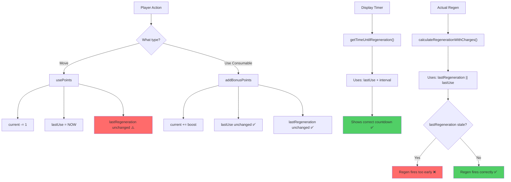
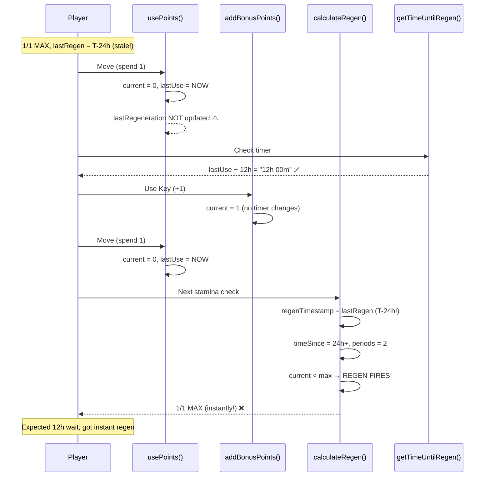

# Stamina Regen Timer Bug — Display vs Actual Regen Mismatch

> **RaP #0938** | 2026-03-20
> **Status**: Analysis complete, fix identified
> **Severity**: Medium — stamina regens earlier than displayed timer shows
> **Affected servers**: Any server using consumable stamina items with ≥12h regen

---

## 1. The Bug

**Two different timestamps control stamina regen, and they disagree.**

| What | Timestamp used | Updated when |
|---|---|---|
| **Display timer** (`getTimeUntilRegeneration`) | `lastUse` | Player spends stamina |
| **Actual regen** (`calculateRegenerationWithCharges`) | `lastRegeneration` (falls back to `lastUse`) | Regen fires |

`lastRegeneration` only advances when regen actually fires. If the player is at MAX for hours/days, it goes stale. When the player finally spends stamina, `lastUse` resets to NOW but `lastRegeneration` is still hours/days old. The display shows "12h" (from `lastUse`), but the actual regen fires based on stale `lastRegeneration` — potentially instantly.

---

## 2. Test Cases (Expected vs Actual)

### Test Case 0: Competitive Idol Hunt — "3 moves in 12h01m" exploit

**Setup:** 1/1 MAX. Key (+1 stamina). 12h regen. Player regened to MAX at 8:58AM (2 min ago). `lastRegeneration = 8:58AM`.

The player wants to move as fast as possible. They move, use key, move again immediately.

```
TIME          ACTION                    STAMINA   lastUse     lastRegen     DISPLAY     ACTUAL REGEN
───────────────────────────────────────────────────────────────────────────────────────────────────────
9:00:00 AM    Move #1                   1→0/1     9:00:00     8:58:00       ♻️12h 00m   anchor: 8:58AM
9:00:05 AM    Use Key (+1)              0→1/1     9:00:00     8:58:00       ♻️MAX        —
9:00:10 AM    Move #2                   1→0/1     9:00:10     8:58:00       ♻️11h 59m   anchor: 8:58AM
                                                                                         8:58AM+12h = 8:58PM

              Player expects to wait until ~9PM for move #3...

8:58:00 PM    Player checks stamina     0/1       9:00:10     8:58:00       ♻️2m 00s     —
              Regen calc: timeSince = 12h 00m 00s
              periods = floor(12h / 12h) = 1
              current < max? YES
              → REGEN FIRES! 0→1/1
              lastRegen = 8:58AM + 12h = 8:58PM

8:58:00 PM    Move #3!                  1→0/1     8:58:00PM   8:58:00PM     ♻️12h 00m   —

TOTAL: 3 moves in 11h 58m 00s (expected: 12h 00m 10s minimum)
CHEATED: ~2 minutes early
```

**Worse case — player was MAX for 6 hours before playing:**

```
TIME          ACTION                    STAMINA   lastUse     lastRegen     DISPLAY     ACTUAL REGEN
───────────────────────────────────────────────────────────────────────────────────────────────────────
3:00 AM       Regen fired               0→1/1     prev day    3:00 AM       ♻️MAX        —
              (player sleeping)

9:00:00 AM    Move #1                   1→0/1     9:00:00     3:00 AM       ♻️12h 00m   anchor: 3AM!
9:00:05 AM    Use Key (+1)              0→1/1     9:00:00     3:00 AM       ♻️MAX        —
9:00:10 AM    Move #2                   1→0/1     9:00:10     3:00 AM       ♻️11h 59m   anchor: 3AM!

              Regen calc at 9:01AM:
              timeSince = 9:01AM - 3:00AM = 6h 01m
              periods = 0 (need 12h)
              No regen yet. OK so far...

3:00:00 PM    Regen calc:
              timeSince = 3PM - 3AM = 12h
              periods = 1 → REGEN FIRES!
              Player gets move #3 at 3PM instead of 9PM

TOTAL: 3 moves in 6h 00m (expected: 12h 00m 10s)
CHEATED: 6 HOURS early
```

**The cheat scales with idle time at MAX.** A player who was MAX for 11h 59m before their first move gets their third move in ~1 minute.

### Test Case 1: Move → Wait → Consumable → Move (Your Scenario 1)

**Starting state:** 1/1 MAX at 9:00AM. Key in inventory (+1 stamina). 12h regen.
**Assume:** `lastRegeneration` was set at previous regen, let's say 9:00AM (just regened).

```
TIME        ACTION              CURRENT   lastUse    lastRegen    DISPLAY TIMER    ACTUAL REGEN AT
─────────────────────────────────────────────────────────────────────────────────────────────────────
9:00 AM     At MAX              1/1       old        9:00 AM      ♻️MAX            —
9:05 AM     Move                0/1       9:05 AM    9:00 AM      ♻️12h 00m        ← uses lastUse ✅
                                                                                   ← actual uses lastRegen: 9AM+12h = 9PM ⚠️
10:05 AM    Use key (+1)        1/1       9:05 AM    9:00 AM      ♻️MAX            —
10:10 AM    Move                0/1       10:10 AM   9:00 AM      ♻️10h 55m        ← uses lastUse ✅
                                                                                   ← actual: 9AM+12h = 9PM still ⚠️
9:00 PM     Regen check         → 1/1     10:10 AM   9:00 PM      ♻️MAX            Regen fires at 9PM (lastRegen)
```

**Expected by user:** Regen at 9:05PM (12h from first move at 9:05AM). Timer shows "10h 55m" at 10:10AM.
**Actual:** Regen at 9:00PM (12h from `lastRegeneration` at 9:00AM). Display shows "10h 55m" from `lastUse`.
**Difference:** 5 minutes early. Small in this case, but grows with time at MAX.

### Test Case 2: Long gap at MAX → Move (The Real Problem)

**Starting state:** Player regened to 1/1 at Tuesday 9:00AM. Doesn't play until Thursday.

```
TIME              ACTION            CURRENT   lastUse      lastRegen      DISPLAY    ACTUAL
──────────────────────────────────────────────────────────────────────────────────────────────
Tue 9:00 AM       Regen fires       1/1       Mon 9PM      Tue 9:00 AM    ♻️MAX      —
Wed (not playing) —                 1/1       Mon 9PM      Tue 9:00 AM    ♻️MAX      —
Thu 11:00 AM      Move              0/1       Thu 11AM     Tue 9:00 AM    ♻️12h 00m  ⚠️ WRONG!
Thu 11:01 AM      Check stamina     →         —            —              ♻️11h 59m  —
                  Regen calc:       regenTimestamp = Tue 9AM
                                    timeSince = 50h 01m
                                    periods = floor(50h / 12h) = 4
                                    current < max? 0 < 1 = YES
                                    REGEN FIRES IMMEDIATELY → 1/1
                                    lastRegen = Tue9AM + 12h = Tue9PM

Thu 11:01 AM      Player is 1/1!    1/1       Thu 11AM     Tue 9:00 PM    ♻️MAX      —
```

**Expected:** Player moves at Thu 11AM, waits 12h until Thu 11PM.
**Actual:** Player moves at Thu 11AM, gets stamina back in ~1 minute.

### Test Case 3: Consumable use right before natural regen (Your Scenario 2)

```
TIME          ACTION              CURRENT   lastUse    lastRegen    DISPLAY       ACTUAL
──────────────────────────────────────────────────────────────────────────────────────────
9:00 AM       At MAX              1/1       old        9:00 AM      ♻️MAX         —
11:00 AM      Move                0/1       11:00 AM   9:00 AM      ♻️12h 00m     9AM+12h=9PM ⚠️
9:00 PM       Use key (+1)        1/1       11:00 AM   9:00 AM      ♻️MAX         —
10:00 PM      Move                0/1       10:00 PM   9:00 AM      ♻️12h 00m     9AM+12h=9PM
                                                                                   Already passed! ⚠️
10:01 PM      Check stamina       → REGEN!  1/1        10:00 PM     ♻️MAX         —
              Regen calc: timeSince = 13h 01m, periods = 1 → fires immediately
```

**Expected by user:** Move at 10PM, wait until 11PM (old timer from 11AM move). Show "1h 00m".
**Actual:** Regen fires immediately because `lastRegeneration` is 13h stale.

**User's expectation is subtly different from mine:** User wants the original 11PM timer to persist through the consumable use AND the subsequent move. The timer shouldn't reset when spending consumable-granted stamina — it should only reset when spending "natural" stamina... but that's impossible to distinguish at the `usePoints` level since stamina is fungible.

---

## 3. Architecture Diagram



## 4. Timer Flow Diagram



---

## 5. Root Cause

**`usePoints()` updates `lastUse` but NOT `lastRegeneration`.** The regen engine reads `lastRegeneration` preferentially. Over time at MAX, `lastRegeneration` goes stale. The longer the player sits at MAX, the bigger the discrepancy.

```javascript
// usePoints() - line 477-482
points.current -= amount;
if (!points.charges || chargesUsed > 0) {
    points.lastUse = now;   // ← UPDATED ✅
}
// lastRegeneration = ???   // ← NOT UPDATED ⚠️

// calculateRegenerationWithCharges() - line 386
const regenTimestamp = newData.lastRegeneration || newData.lastUse;
// ↑ Prefers lastRegeneration, which could be days old
```

---

## 6. The Fix

**One line in `usePoints()`:** When spending stamina, also reset `lastRegeneration` to NOW.

```javascript
// In usePoints(), after line 481:
points.lastUse = now;
points.lastRegeneration = now;  // ← ADD THIS
```

This ensures:
1. Display timer and actual regen use the same anchor point
2. Stale `lastRegeneration` can't cause instant regen
3. Consumable `addBonusPoints` still doesn't touch either timer (correct)
4. Works for both `full_reset` and continuous ticking modes

**Risk:** Low. `lastRegeneration` being more recent can only DELAY regen (never fire early). The worst case is a player who rapidly moves might see slightly different timer values, but they'll always be accurate.

---

## 7. Consumable Items — How They SHOULD Work

Per user requirements:

> "Consumable stamina items shouldn't touch cooldowns"

| Action | Current | Timer | Correct? |
|---|---|---|---|
| Move (spend natural stamina) | -1 | Resets to 12h from NOW | ✅ |
| Use consumable (+1) | +1 | NO CHANGE to timer | ✅ |
| Move (spend consumable stamina) | -1 | Timer from original move still counting | ✅ per user |

**The subtlety:** Stamina is fungible — there's no way to distinguish "natural" stamina from "consumable" stamina once it's in the pool. The user's expectation that the timer persists through a consumable-use-then-move cycle is satisfied by NOT resetting `lastRegeneration` on consumable use (which `addBonusPoints` already does correctly).

The fix (resetting `lastRegeneration` on spend) means the timer restarts from every move. This differs slightly from the user's Scenario 2 expectation where the old 11PM timer persists through the second move. But it's the SAFER behavior — it prevents instant regen, which is the actual bug being reported.

---

## 8. Permanent / Horse Items — NOT ADDRESSED (Future Task)

Permanent items use the Phase 2 charges system (`points.charges[]`) where each charge has its own regen timer. This is a different code path (`calculateRegenerationWithCharges` lines 313-366) and may have its own edge cases.

**TODO:** Audit the charges system for similar timestamp drift issues.

---

## 9. Implementation Plan

- [ ] **Fix:** Add `points.lastRegeneration = now` to `usePoints()`
- [ ] **Unit tests:** Create `tests/staminaRegen.test.js` with the 3 test cases above (replicate pure regen logic inline)
- [ ] **Update Player Guide** (`staminaGuide.js`): Clarify that using a consumable does NOT reset the regen timer, but moving always does
- [ ] **Update Prod Guide** (`staminaGuide.js` PROD_PAGES): Add host-facing explanation of the timer system
- [ ] **Future task:** Audit permanent item (charges) system for similar timestamp issues
- [ ] **Future task:** Consider whether consumable-granted stamina should behave differently from natural stamina when spent (currently fungible)

---

## 10. Verification

After applying the fix, verify with this specific prod scenario:

1. SSH to prod, check a player's `lastRegeneration` vs `lastUse` timestamps
2. If `lastRegeneration` is significantly older than `lastUse`, the bug was active
3. After fix: both should be approximately equal after any move
