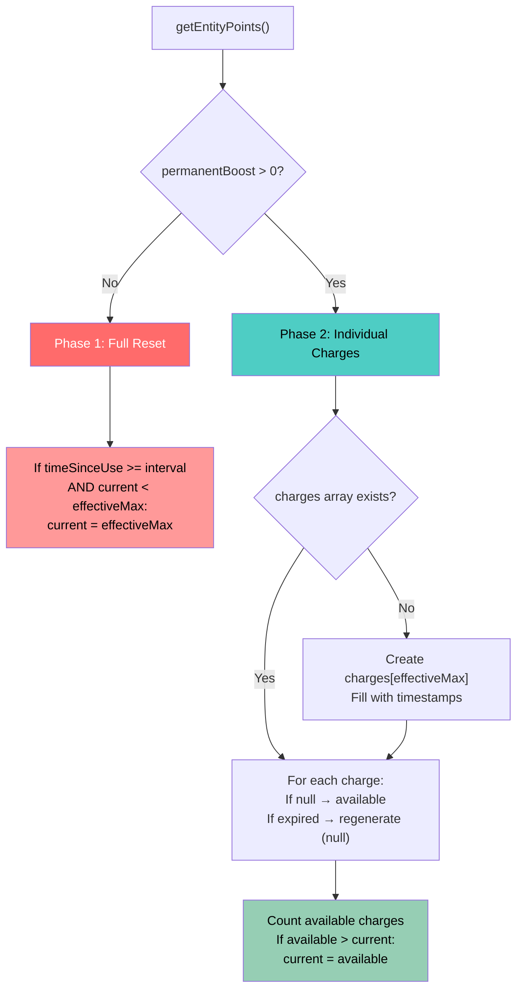

# 0946 — Configurable Regeneration Amount

**Date:** 2026-03-15
**Status:** 🔨 In Progress
**Related:** [Stamina Logging (0950)](0950_20260314_StaminaLogging_Analysis.md) | [Attributes](../03-features/Attributes.md) | [Permanent Stamina Items (0965)](0965_20251124_PermanentStaminaItems_Analysis.md)

---

## Original Context / Trigger Prompt

> Add a new field in the `stamina_location_config` modal for **Regeneration Amount** — how much stamina regenerates when the cooldown is reached. Currently hardcoded as 1 (Phase 2 charges) or "reset to max" (Phase 1). The new setting should allow hosts to configure e.g. "regenerate 5 stamina every 30 minutes" regardless of max.

---

## 🤔 The Problem in Plain English

Right now, stamina regeneration has **no configurable amount** — it's baked into the code:

- **Phase 1** (no permanent items): When the cooldown elapses, stamina resets to `max`. A player at 0/8 jumps straight to 8/8 after 30 minutes.
- **Phase 2** (has permanent items like Horse): Each individual stamina point gets its own cooldown slot. After 30 minutes, exactly **1 charge** regenerates.

Neither model lets a host say "regenerate 5 stamina per cooldown cycle". This matters for game designs where:
- Max stamina is high (e.g. 1) but players should get bursts of stamina above max (e.g. 0/1 → 5/1)
- The host wants partial regen (e.g. 3 of 8 stamina every 30 min, not all 8)
- The host wants a "drip feed" model with large max (8 max, regen 2 every 30 min)

---

## 🏛️ Current Architecture: How Regen Actually Works (As-Built)

### Two Regen Paths



### Phase 1: Full Reset (pointsManager.js:362-384)

```javascript
// When cooldown elapses: RESET to max (not +1, not +N, but full max)
if (timeSinceUse >= config.regeneration.interval && newData.current < effectiveMax) {
    newData.current = effectiveMax;  // ← Hardcoded to max
}
```

- **Trigger**: `lastUse` timestamp + interval elapsed
- **Amount**: Always `effectiveMax` (base max + permanent boosts)
- **Repeating**: No — single event, then timer pauses until next use
- **Over-max**: Never — only fires when `current < effectiveMax`

### Phase 2: Individual Charges (pointsManager.js:312-361)

```javascript
// Each charge regenerates independently
for (let i = 0; i < newData.charges.length; i++) {
    if ((now - newData.charges[i]) >= config.regeneration.interval) {
        newData.charges[i] = null;  // ← Exactly 1 charge per slot
        availableCharges++;
    }
}
```

- **Trigger**: Each charge has its own timestamp; each regenerates after `interval` ms
- **Amount**: Always exactly 1 per charge slot
- **Repeating**: Yes — each charge independently ticks
- **Over-max**: Never — charges array is sized to `effectiveMax`

### Config Today (safariConfig per guild)

| Field | Key | Range | Default |
|-------|-----|-------|---------|
| Starting Stamina | `startingStamina` | 0-99 | 1 |
| Max Stamina | `maxStamina` | 1-99 | 1 |
| Regen Minutes | `staminaRegenerationMinutes` | 1-1440 | 3 |
| **Regen Amount** | ❌ Does not exist | - | Hardcoded: max (P1) or 1 (P2) |

---

## 📊 Permutations & Edge Cases

### Standard Scenarios

| Max | Cooldown | Regen Amount | Player State | After 1 Cooldown | After 2 Cooldowns |
|-----|----------|-------------|-------------|------------------|-------------------|
| 8 | 30min | 1 | 0/8 | 1/8 | 2/8 |
| 8 | 30min | 3 | 0/8 | 3/8 | 6/8 |
| 8 | 30min | 3 | 6/8 | 9/8 | 12/8 (paused, ≥ max) |
| 8 | 30min | 8 | 0/8 | 8/8 | 8/8 (paused, ≥ max) |
| 1 | 30min | 1 | 0/1 | 1/1 | 1/1 (paused, ≥ max) |
| 1 | 30min | 5 | 0/1 | 5/1 | 5/1 (paused, ≥ max) |

### Core Rule: Regen adds the FULL amount, NEVER partial

**Regen fires when `current < max`.** When it fires, it adds the **full regen amount** — never capped, never reduced. The result can exceed max. This is intentional.

**Pause rule**: Once `current >= max`, the cooldown timer pauses. Player must spend stamina to drop below max before regen fires again.

### Over-Max Scenarios (Regen Amount > Max)

This is the user's explicit use case: max=1, regen=5.

| State | Event | Result | Notes |
|-------|-------|--------|-------|
| 0/1 | Cooldown fires | 5/1 | Over-max, intentional |
| 5/1 | Timer check | 5/1 (paused) | 5 ≥ 1, timer paused |
| 5/1 | Uses 1 stamina | 4/1 | Still ≥ max, timer stays paused |
| 4/1 | Uses 4 stamina | 0/1 | Below max, timer restarts |
| 0/1 | Cooldown fires | 5/1 | Burst again |

### Regen Amount < Max (Continuous Ticking, No Cap)

| Max | Regen | State | After Cooldown | Notes |
|-----|-------|-------|---------------|-------|
| 8 | 3 | 0/8 | 3/8 | +3, still below max → timer continues |
| 8 | 3 | 3/8 | 6/8 | +3, still below max → timer continues |
| 8 | 3 | 6/8 | 9/8 | +3, now ≥ max → **timer pauses** |
| 8 | 3 | 9/8 | 9/8 (paused) | Must use stamina to drop below 8 |
| 8 | 3 | 7/8 | 10/8 | +3 applied in full (NOT capped to 8) |

### Mid-Round Config Change Scenarios

Host changes regen amount from 1 → 5 mid-round:

| Player State | Time to Cooldown | What Happens |
|---|---|---|
| 3/8, 2min left | Config changes | Next regen: +5 instead of +1 → **8/8** (≥ max, pauses) |
| 0/1, 28min left | Config changes | Next regen: +5 instead of +1 → **5/1** (over-max, pauses) |
| 8/8, no cooldown | Config changes | Nothing — cooldown already paused (≥ max) |

**Immediate effect is guaranteed** because:
1. Config is read from `safariConfig` on every `getEntityPoints()` call
2. Regen is calculated on-demand, not scheduled
3. No cached config — always fresh from storage

---

## 🔑 Design Decisions

### Decision #1: When does regen fire? When does it pause?

**Rule: Regen fires when `current < max` (the denominator). Always adds the FULL regen amount. Never caps the result.**

```
Regen Amount = 5, Max = 1

0/1 → cooldown → 5/1 (fires: 0 < 1, adds full 5)
5/1 → paused (5 ≥ 1)
5/1 → uses 5   → 0/1 (below max, timer restarts)
0/1 → cooldown → 5/1 (fires again)
```

```
Regen Amount = 3, Max = 8

0/8 → cooldown → 3/8 (fires: 0 < 8, adds full 3)
3/8 → cooldown → 6/8 (fires: 3 < 8, adds full 3)
6/8 → cooldown → 9/8 (fires: 6 < 8, adds full 3 — NOT capped to 8)
9/8 → paused (9 ≥ 8)
```

This matches the existing `current < effectiveMax` guard in Phase 1 (line 373). **Zero behavior change for existing servers** — they all use regen amount = max, so regen fires once (0 → max) and pauses (max ≥ max).

### Decision #2: Phase 1 vs Phase 2 — which path handles regen amount?

**Current split**: Phase 2 activates only when `permanentBoost > 0` (player has non-consumable items). This is a **per-player** decision, not per-server.

| Option | Description | Complexity |
|--------|-------------|------------|
| **A: Add to both paths** | Phase 1 adds regenAmount instead of resetting to max. Phase 2 regenerates regenAmount charges at once. | Medium |
| **B: Eliminate Phase 1, always use charges** | Every player uses the charges system. Phase 1 is a special case of Phase 2 with boost=0. | High — risky, changes behavior for all existing players |
| **C: Add to Phase 1 only, Phase 2 stays per-charge** | Phase 1 gets `current += regenAmount`. Phase 2 stays "1 charge per slot per interval" — regen amount doesn't apply to Phase 2. | Low — but inconsistent |

**Recommended: Option A — Add to both paths**

**Phase 1 implementation** (simple):
```javascript
// Instead of: newData.current = effectiveMax;
// Do:
const regenAmount = config.regeneration.amount === 'max'
    ? effectiveMax
    : config.regeneration.amount;
newData.current = Math.min(newData.current + regenAmount, /* cap logic from Decision #1 */);
```

**Phase 2 implementation** (charge system):
Instead of regenerating 1 charge per expired slot, regenerate up to `regenAmount` charges per cooldown cycle. But this changes the Phase 2 model fundamentally — charges currently have individual timestamps.

**Simpler Phase 2 approach**: When a charge expires, it regenerates. Then we check: "how many charges just regenerated in this tick?" If the answer is ≥1, we add `regenAmount - chargesRegenerated` bonus stamina. This preserves the charge tracking but adds the burst on top.

**Actually, even simpler**: For Phase 2, the `regenAmount` config is really about Phase 1 behavior. Phase 2 already has its own model (1 charge = 1 stamina, each with its own timer). The `regenAmount` override makes Phase 2 unnecessary for the burst use case.

**Revised recommendation**: Phase 2 stays unchanged (it's for permanent item tracking). Phase 1 gets the regenAmount config. The two features are orthogonal:
- **regenAmount**: "How much stamina per cooldown cycle?" (server config)
- **Phase 2 charges**: "Does each stamina point have its own timer?" (player inventory driven)

When both are active (player with permanent items + regenAmount configured): each charge still regenerates individually, but the amount per charge could be 1. This is fine — Phase 2 is already "1 per charge per interval" which is the granular model. The burst model (regenAmount > 1) is Phase 1's job.

### Decision #3: Timer behavior — continuous ticking until `current >= max`

**Current Phase 1**: Timer starts from `lastUse`. If player never uses stamina, the timer fires once (resets to max) then stops.

**With regenAmount**: Timer must **continue ticking** after each regen event, applying the full amount each time, until `current >= max` (the pause rule).

```
Player at 0/8, regenAmount = 3, cooldown = 30min

T+0:   0/8 (used stamina, lastUse = now)
T+30:  3/8 (regen fires, +3, still < 8 → timer continues)
T+60:  6/8 (regen fires, +3, still < 8 → timer continues)
T+90:  9/8 (regen fires, +3, now ≥ 8 → timer PAUSES)
```

**Implementation**: After regen fires, update `lastRegeneration` timestamp. On next access, check `timeSinceLastRegen >= interval`. Must calculate **multiple elapsed periods** in one access (player offline 3 hours with 30min regen = 6 regen events applied at once).

```javascript
const regenTimestamp = newData.lastRegeneration || newData.lastUse;
const timeSinceRegen = now - regenTimestamp;
const periods = Math.floor(timeSinceRegen / config.regeneration.interval);

if (periods > 0 && newData.current < effectiveMax) {
    const regenAmount = (config.regeneration.amount === 'max' || !config.regeneration.amount)
        ? effectiveMax : config.regeneration.amount;

    // Apply regen period by period, stopping when current >= max
    let appliedPeriods = 0;
    for (let p = 0; p < periods && newData.current < effectiveMax; p++) {
        newData.current += regenAmount;  // Full amount, no cap
        appliedPeriods++;
    }

    // Preserve fractional period for accuracy
    newData.lastRegeneration = regenTimestamp + (appliedPeriods * config.regeneration.interval);
    newData.max = effectiveMax;
    hasChanged = true;
}
```

**Backward compatible**: Existing servers use amount="max". First tick sets current=max, loop stops immediately (max ≥ max). Same outcome as current full_reset, different mechanism.

**Over-max + continuous ticking**: If regenAmount=5, max=1: first tick → 5/1 (≥ max), loop stops. No infinite accumulation. Player must spend stamina to drop below max before regen resumes.

### Decision #5: Backward compatibility for `amount: "max"`

Currently `getDefaultPointsConfig()` returns `amount: "max"`. The config storage doesn't have a `regenAmount` field. We need a clean default.

**Approach**:
- Config field: `safariConfig.staminaRegenerationAmount` (stored as integer)
- If undefined/null: default to `"max"` behavior (Phase 1 resets to full, backward compatible)
- `getStaminaConfig()` returns: `regenerationAmount: safariConfig.staminaRegenerationAmount ?? null`
- In regen logic: `null` means "max" (legacy behavior)

This ensures **zero behavior change for existing servers** that don't touch the new field.

---

## 💡 Technical Design

### Config Changes

**safariConfig storage** (per guild in safariContent.json):
```json
{
  "startingStamina": 1,
  "maxStamina": 1,
  "staminaRegenerationMinutes": 30,
  "staminaRegenerationAmount": 5    // NEW — null/undefined = "max" (legacy)
}
```

**getStaminaConfig() return value** (safariManager.js):
```javascript
{
  startingStamina: 1,
  maxStamina: 1,
  regenerationMinutes: 30,
  regenerationAmount: 5,              // NEW — null = "max"
  defaultStartingCoordinate: 'A1'
}
```

### Modal Changes (app.js)

**New Label component in stamina_location_config modal:**
```javascript
// Label 4: Regeneration Amount (NEW)
{
  type: 18, // Label
  label: 'Regeneration Amount',
  description: 'How much stamina regenerates when cooldown is reached. Leave blank or set to 0 for full reset to max.',
  component: {
    type: 4, // Text Input
    custom_id: 'regen_amount',
    style: 1, // Short
    min_length: 0,
    max_length: 2,
    placeholder: 'Leave blank = full reset',
    value: currentConfig.regenerationAmount?.toString() || '',
    required: false
  }
}
```

**Modal submit handler changes:**
- Parse `regen_amount` from components[4] (after new Label)
- Validate: empty/0 = null (max), 1-99 = stored value
- Save to `safariConfig.staminaRegenerationAmount`

**Label update**: "Regeneration Time (minutes)" description changes from "Time to regenerate 1 stamina" → "Time between each stamina regeneration"

### Regeneration Logic Changes (pointsManager.js)

**Phase 1 — Replace full_reset with amount-aware regen:**

```javascript
// Phase 1: Amount-aware regeneration (replaces simple full reset)
const regenAmount = (config.regeneration.amount === 'max' || !config.regeneration.amount)
    ? effectiveMax
    : config.regeneration.amount;

const regenTimestamp = newData.lastRegeneration || newData.lastUse;
const timeSinceRegen = now - regenTimestamp;
const periods = Math.floor(timeSinceRegen / config.regeneration.interval);

if (periods > 0 && newData.current < effectiveMax) {
    // Apply regen period by period, stopping when current >= max
    // Each period adds the FULL regen amount (never capped/partial)
    let appliedPeriods = 0;
    for (let p = 0; p < periods && newData.current < effectiveMax; p++) {
        newData.current += regenAmount;
        appliedPeriods++;
    }
    newData.max = effectiveMax;
    // Preserve fractional period for accuracy
    newData.lastRegeneration = regenTimestamp + (appliedPeriods * config.regeneration.interval);
    hasChanged = true;
}
```

**Phase 2 — No changes needed.** Phase 2 is the per-charge model for permanent item holders. It already regenerates 1 per charge. The `regenAmount` config doesn't apply to Phase 2 because the charge system IS the regen model for those players.

**Rationale**: Phase 2 exists specifically for fine-grained per-charge tracking (horses, etc.). A player with a Horse and regenAmount=5 would get confusing behavior if we tried to apply both. The charge system already provides individual stamina regen — adding a multiplier on top would break the per-charge cooldown model.

### getEntityPoints() config construction:

```javascript
config = {
    // ... existing fields ...
    regeneration: {
        type: "full_reset",
        interval: staminaConfig.regenerationMinutes * 60000,
        amount: staminaConfig.regenerationAmount ?? "max"  // NEW
    },
};
```

### getTimeUntilRegeneration() changes:

No changes needed — it already correctly shows time until next regen based on `lastUse` / charge timestamps. The display of "Full" when `current >= max` still works because we pause regen when `current >= effectiveMax` (Decision #1).

For over-max players (5/1), `current >= max` → displays "Full" which is correct — their regen IS paused.

### Logging Changes

**formatStaminaTag()** — already works, shows `current/max`. No changes needed for the tag format itself.

**Safari Log / Live Discord Logging** — the stamina tag on movement, items, etc. already shows before/after. When regen fires and increases stamina, the next action's "before" will reflect the new value. No additional logging needed for the regen event itself (it's silent, calculated on-demand).

**Config change logging** — the modal submit handler should log the new field:
```javascript
console.log(`⚡ Stamina config updated: ... regenAmount=${regenAmount || 'max'}`);
```

**Stamina Logging doc (0950)** — Update the "All Stamina Change Paths" table to note that regen amount is now configurable, and add a row for "config change" events if not already present.

---

## ⚠️ Risk Assessment

| Risk | Impact | Mitigation |
|------|--------|------------|
| Backward compatibility | Low — `null` defaults to "max" | All existing servers unchanged |
| Over-max accumulation | Low — intended behavior | Regen pauses when `current >= max` (denominator), prevents infinite growth while idle |
| Phase 2 confusion | Low — Phase 2 ignores regenAmount | Document clearly, log when both active |
| Multi-period catchup | Low — offline player gets multiple bursts | Loop stops at `current >= max`, so bounded |
| Modal component limit | Low — adding 1 component (now 5 total) | Discord modal limit is 5 top-level components; Text Display + 4 Labels = 5 |
| `lastRegeneration` migration | Low — may not exist on old data | Fallback to `lastUse` |

---

## 📋 Implementation Plan

### Step 1: Config & Storage
- Add `staminaRegenerationAmount` to safariConfig schema
- Update `getStaminaConfig()` to return `regenerationAmount`
- Update `getEntityPoints()` config construction to pass `amount`

### Step 2: Regeneration Logic
- Rewrite Phase 1 in `calculateRegenerationWithCharges()` to use amount-aware regen
- Handle over-max case (regenAmount > effectiveMax)
- Handle multi-period catchup
- Add `lastRegeneration` fallback for migration

### Step 3: Modal UI
- Add Regeneration Amount Label to modal builder
- Update "Regeneration Time" description text
- Parse new field in modal submit handler
- Validate (0 or empty = max, 1-99 = specific amount)

### Step 4: Logging
- Update console logging for regen events to include amount
- Update stamina config change log to include regen amount
- Update 0950 RaP doc with new config field

### Step 5: Tests
- Unit test: regen amount = max (backward compatible)
- Unit test: regen amount < max (partial regen, multi-period)
- Unit test: regen amount > max (over-max burst, pause at ≥ max)
- Unit test: mid-round config change (immediate effect)
- Unit test: Phase 2 unaffected by regen amount config

---

## 🧪 Proof: Immediate Effect on Config Change

**Why changing regen amount takes effect immediately:**

1. `getEntityPoints()` is called on every stamina access (movement, display, item use)
2. Inside, it calls `getStaminaConfig(guildId)` which reads `safariConfig` fresh from storage
3. The config (including new `regenerationAmount`) is passed to `calculateRegenerationWithCharges()`
4. Regen calculation uses the **current** config values, not cached ones

**Scenario**: Host changes regenAmount from 1 → 5. Player has 0/1 stamina, 2 minutes left on 30min cooldown.

```
T+0:    Host saves regenAmount=5 in modal
T+2min: Player accesses stamina (e.g., tries to move)
        → getEntityPoints() loads fresh config (regenAmount=5)
        → calculateRegenerationWithCharges() checks: timeSinceUse=30min ✓
        → Applies: current = 0 + 5 = 5
        → Player now has 5/1 stamina
```

**No cache to invalidate, no restart needed, no player re-init required.**

The only edge case: if a player never accesses their stamina after the config change, the regen won't apply until they do. But this is fine — stamina is always checked before any stamina-consuming action (movement, etc.), so it's guaranteed to be fresh when it matters.
