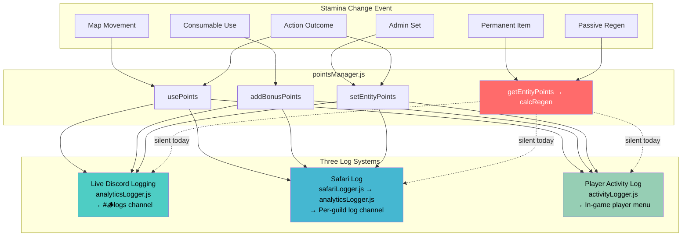
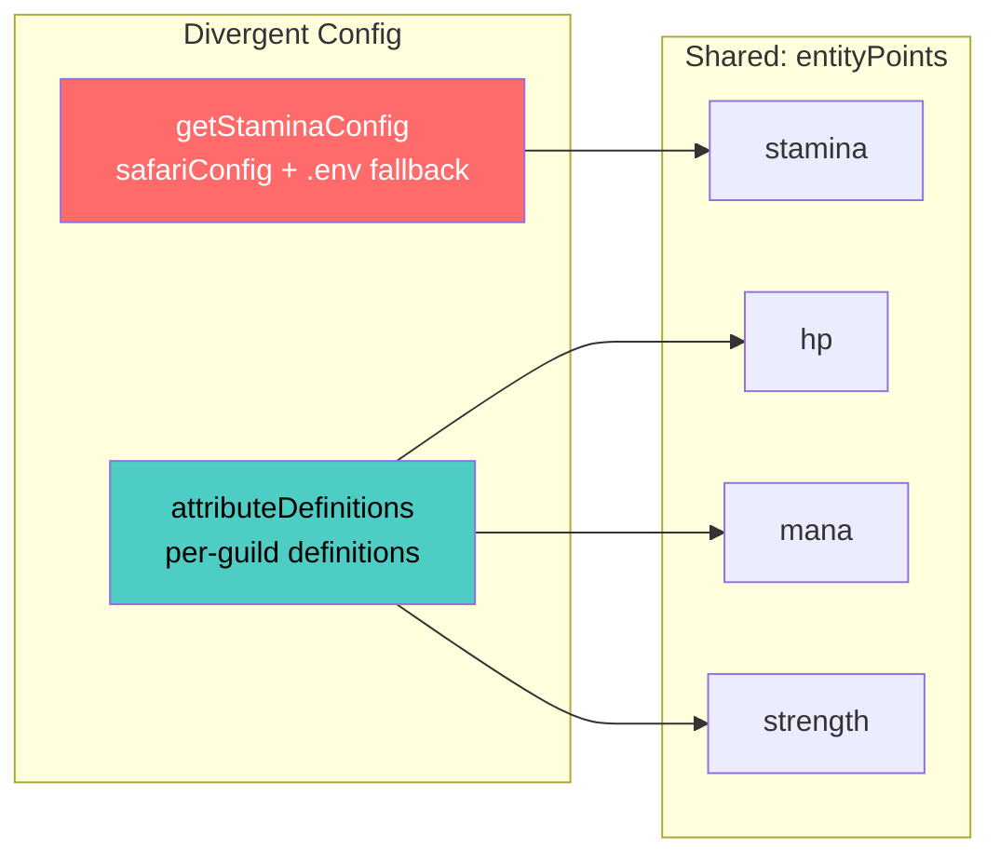

# 0950 — Stamina Change Logging Across All Three Log Systems

**Date:** 2026-03-14
**Status:** Analysis Complete — Ready for Implementation
**Related:** [Attributes](../03-features/Attributes.md) | [Safari Log System](../03-features/SafariLogSystem.md) | [Activity Log Analysis](0955_20260302_ActivityLog_Analysis.md) | [Analytics](../infrastructure/Analytics.md)

---

## Original Context / Trigger Prompt

> Hosts / players of my bot have a current problem with tracking and reconciling Stamina usage between players. I'd like to significantly improve logging, such that every time a Stamina action is taken, the stamina change is shown in all "Live Discord Logging", "Safari Log Configuration" AND "Player Activity Log", based on the appropriate filter.

The user wants **every stamina change** — consumption, regen, boosts, admin overrides — to appear across all three logging systems with before/after state and regen countdown.

---

## 🤔 The Problem in Plain English

Right now, when a player moves on the map, we log the movement but **not the stamina cost**. A host looking at logs sees "Nic moved from C3 to C4" but has no idea:

- How much stamina Nic had before moving
- How much stamina Nic has now
- When Nic's stamina will regenerate
- Whether Nic used a consumable to boost stamina before moving

It's like watching a bank statement that shows "Purchase at Store" but never shows the balance. Hosts can't reconcile stamina usage between players, can't spot exploits, and can't answer "why does this player have 3 stamina?" without manually checking the player menu.

Worse, stamina regeneration happens **silently** — it's calculated on-demand whenever stamina is checked, with zero audit trail. A player's stamina can jump from 0 to max between log entries with no explanation.

---

## 📊 Current State vs Desired State

### Current Log Output (Movement Example)

**Live Discord Logging:**
```
[1:21PM] Sat 14 Mar 26 | Unknown Player in Treasure Hunter (1452871600494870538) | SAFARI_MOVEMENT | Moved from C3 to C4
```

**Safari Log:**
```
🗺️ MOVEMENT | [1:21PM] | Nic moved from C3 to C4
```

**Player Activity Log:**
```
9 hours ago 🗺️ Movement — Moved from C3 to C4
```

### Desired Log Output

**Live Discord Logging:**
```
[1:21PM] Sat 14 Mar 26 | Nic (extremedonkey) in Treasure Hunter (1452871600494870538) | SAFARI_MOVEMENT | Moved from C3 to C4 (⚡1/1 → 0/1 ♻️12hr)
```

**Safari Log:**
```
🗺️ MOVEMENT | [1:21PM] | Nic moved from C3 to C4 (⚡1/1 → 0/1 ♻️12hr)
```

**Player Activity Log:**
```
9 hours ago 🗺️ Movement — Moved from C3 to C4 (⚡1/1 → 0/1 ♻️12hr)
```

### Proposed Stamina Tag Format

```
(⚡{before}/{max} → {after}/{max} ♻️{regenTime})
```

**Examples by event type:**
| Event | Stamina Tag |
|-------|-------------|
| Movement (cost 1) | `(⚡1/1 → 0/1 ♻️12hr)` |
| Consumable use (+2) | `(⚡0/1 → 2/1 ♻️Ready)` |
| Permanent item equip | `(⚡1/1 → 1/2 ♻️Ready)` |
| Passive regen | `(⚡0/1 → 1/1 ♻️Ready)` |
| Admin set to 5 | `(⚡1/1 → 5/1 ♻️Ready)` |
| Action outcome (-2) | `(⚡3/3 → 1/3 ♻️2hr)` |

**Additional info to consider showing:**
- Source of change: `via Horse` (item), `via Move` (movement), `via Action: Gate Check` (custom action)
- Effective max when boosted: `⚡1/1+3` to show base vs boost
- For permanent boosts, show max change: `(⚡1/1 → 1/2 📈+1 max)`

---

## 🏛️ Architecture: The Three Logging Systems



### System Roles

| System | Audience | Purpose | Filter Key |
|--------|----------|---------|------------|
| **Live Discord Logging** | Bot owner (Reece) | Global audit trail across all servers | `environmentConfig.liveDiscordLogging` |
| **Safari Log** | Host (per-server) | Server-specific game event feed | `safariLogSettings.logTypes` (per type toggle) |
| **Player Activity Log** | Player (self) | Personal activity history with pagination | Always on (max 200 entries) |

---

## 🔍 Exhaustive: All Stamina Change Paths

### Consumption (Decreases)

| # | Trigger | File:Function | Method | Logged Today? |
|---|---------|---------------|--------|---------------|
| 1 | **Map Movement** | `mapMovement.js:movePlayer()` L221 | `usePoints(guildId, entityId, 'stamina', cost)` | Movement logged, **no stamina info** |
| 2 | **MODIFY_POINTS outcome (negative)** | `safariManager.js:executeModifyPoints()` L3203 | `usePoints(guildId, entityId, pointType, amount)` | Generic action tracking only |

### Addition (Increases)

| # | Trigger | File:Function | Method | Logged Today? |
|---|---------|---------------|--------|---------------|
| 3 | **Consumable item use** | `app.js:safari_use_item_*` L12083 | `addBonusPoints(guildId, entityId, 'stamina', boost)` | Yes via `logItemUse()` — has before/after |
| 4 | **Multi-use item select** | `app.js` L12296 | `addBonusPoints(guildId, entityId, 'stamina', boost)` | Yes via `logItemUse()` — has before/after |
| 5 | **MODIFY_POINTS outcome (positive)** | `safariManager.js:executeModifyPoints()` L3203 | `setEntityPoints()` (capped at max) | Generic action tracking only |

### Regeneration (Auto-Increases)

| # | Trigger | File:Function | Method | Logged Today? |
|---|---------|---------------|--------|---------------|
| 6 | **Passive regen (full reset)** | `pointsManager.js:calculateRegenerationWithCharges()` L292 | Computed on access, resets current to max | **Console only** (🐎⚡ emoji) |
| 7 | **Individual charge regen** | `pointsManager.js:calculateRegenerationWithCharges()` L330 | Per-charge cooldown resolution | **Console only** |

### Max Changes (Capacity)

| # | Trigger | File:Function | Method | Logged Today? |
|---|---------|---------------|--------|---------------|
| 8 | **Permanent item boost** | `pointsManager.js:calculatePermanentStaminaBoost()` L15 | Scans inventory, applies `addMax` | **Console only** |
| 9 | **Attribute modifier items** | `pointsManager.js:calculateAttributeModifiers()` L50 | Non-consumable items with `attributeModifiers` | **Console only** |

### Initialization / Admin

| # | Trigger | File:Function | Method | Logged Today? |
|---|---------|---------------|--------|---------------|
| 10 | **Player init** | `mapMovement.js:initializePlayerOnMap()` L588 | `initializeEntityPoints()` | Console only |
| 11 | **Admin set** | `safariMapAdmin.js:setPlayerStamina()` L607 | `setEntityPoints()` | Yes via `Logger.info()` — admin only |
| 12 | **Player de-init** | `safariDeinitialization.js` L207 | Removes safari data (points orphaned) | Console only |

### Non-Modifying Checks

| # | Trigger | File:Function | Method | Logged? |
|---|---------|---------------|--------|---------|
| 13 | **Movement permission** | `mapMovement.js:canPlayerMove()` L151 | `hasEnoughPoints()` — read only | N/A |
| 14 | **CHECK_POINTS outcome** | `safariManager.js:executeCheckPoints()` L3170 | `hasEnoughPoints()` — read only | N/A |

---

## 💡 Solution Design

### Core Principle: Capture Before/After at the Point of Change

Every stamina mutation function (`usePoints`, `addBonusPoints`, `setEntityPoints`) already knows the before and after values. We need to:

1. **Return stamina snapshot from mutation functions** (before, after, max, regenTime)
2. **Pass snapshot through existing logging calls** as a new `staminaInfo` parameter
3. **Format the stamina tag** consistently across all three systems

### Phase 1: Stamina Snapshot Helper

Create a standardised snapshot object that all logging functions accept:

```javascript
// In pointsManager.js
function createStaminaSnapshot(before, after, max, regenInterval, lastUse) {
  return {
    before,           // current before change
    after,            // current after change
    max,              // effective max (base + permanent boosts)
    regenTime: getTimeUntilRegeneration(regenInterval, lastUse), // "12hr", "Ready"
    source: null      // populated by caller: 'movement', 'consumable', 'action', 'regen', 'admin'
  };
}

// Format helper used by all three log systems
function formatStaminaTag(snapshot) {
  if (!snapshot) return '';
  const regen = snapshot.regenTime === 'Ready' ? '' : ` ♻️${snapshot.regenTime}`;
  return ` (⚡${snapshot.before}/${snapshot.max} → ${snapshot.after}/${snapshot.max}${regen})`;
}
```

### Phase 2: Wire Into Mutation Functions

**`usePoints()`** — Return snapshot alongside success boolean:
```javascript
// Before: returns { success: boolean }
// After:  returns { success: boolean, snapshot: { before, after, max, regenTime } }
```

**`addBonusPoints()`** — Same pattern, return snapshot.

**`setEntityPoints()`** — Same pattern (used by admin set and MODIFY_POINTS).

### Phase 3: Wire Into Logging Call Sites

Each stamina change path needs to capture the snapshot and pass it downstream:

#### Path 1: Map Movement (`mapMovement.js:movePlayer`)

```javascript
// Current (L221):
const result = await usePoints(guildId, entityId, 'stamina', movementCost);

// Updated:
const result = await usePoints(guildId, entityId, 'stamina', movementCost);
// result.snapshot = { before: 1, after: 0, max: 1, regenTime: "12hr" }

await logPlayerMovement({
  guildId, userId, username, displayName,
  fromLocation: oldCoordinate,
  toLocation: newCoordinate,
  staminaInfo: result.snapshot  // NEW PARAM
});
```

#### Path 3/4: Consumable Item Use (`app.js`)

Already logs via `logItemUse()` which has `staminaBefore`/`staminaAfter` — extend with regen time and pass to all three systems.

#### Path 6/7: Passive Regeneration (`pointsManager.js`)

**Decision point:** Should passive regen be logged?

**Recommendation: Yes, but only in Player Activity Log** — not in Safari Log or Live Discord Logging. Passive regen is not a player action, so flooding host logs with "stamina regenerated" every 12 hours for every player would be noise. But the player should see it in their own log to understand why their stamina changed.

```javascript
// In getEntityPoints(), after calculateRegenerationWithCharges():
if (hasChanged && pointType === 'stamina') {
  // Only log to activity log, not safari/analytics
  addActivityEntryAndSave(guildId, entityId.replace('player_', ''),
    'stamina_regen', `Stamina regenerated`, { stamina: `${newCurrent}/${effectiveMax}` });
}
```

#### Path 8/9: Permanent Item Boost

When a player acquires a non-consumable stamina item (e.g., Horse), the max change is detected during the next `getEntityPoints()` call. Log the max change to all three systems via `logItemPickup()` or a new `logStaminaBoostChange()`.

### Phase 4: Update Log Formatters

**analyticsLogger.js — `logInteraction()`:**
- Accept optional `staminaInfo` in the `safariContent` object
- Append `formatStaminaTag(staminaInfo)` to `logDetails` string

**analyticsLogger.js — `postToSafariLog()`:**
- Append stamina tag to SAFARI_MOVEMENT and other event format strings
- Respect `safariLogSettings.logTypes` filter — add new toggle for stamina changes

**activityLogger.js — `addActivityEntryAndSave()`:**
- Already supports `opts.stamina` and `opts.cd` fields
- Wire these through from the snapshot: `{ stamina: '0/1', cd: '12hr' }`
- `formatActivityEntry()` already renders these if present

### Phase 5: New Safari Log Toggle

Add `staminaChanges: true` to `safariLogSettings.logTypes` so hosts can toggle stamina logging independently:

```json
"logTypes": {
  "whispers": true,
  "itemPickups": true,
  "currencyChanges": true,
  "storeTransactions": true,
  "buttonActions": true,
  "mapMovement": true,
  "attacks": true,
  "customActions": true,
  "staminaChanges": true   // NEW
}
```

---

## 🔮 Future: Attribute System Unification

### Current State

Stamina and attributes share the same backend (`entityPoints` in `safariContent.json`) but have **divergent configuration paths**:



### What Unification Means

1. **Stamina becomes a built-in attribute** with `category: 'resource'` and `regeneration: { type: 'full_reset' }`
2. **Remove `if (pointType === 'stamina')` special cases** from `getEntityPoints()` (lines 223-243 of pointsManager.js)
3. **Migrate stamina config** from `getStaminaConfig()` into `attributeDefinitions['stamina']`
4. **All attributes get the same logging** — when any resource-type attribute changes, it gets the same stamina tag treatment

### Why This Matters for Logging

Once stamina is "just another attribute", the logging solution built in Phase 1-4 generalises trivially:

```javascript
// Generic attribute change tag:
(⚡1/1 → 0/1 ♻️12hr)     // stamina
(❤️95/100 → 85/100 ♻️30m)  // hp
(🔮45/50 → 40/50 ♻️1hr)    // mana
```

The `formatStaminaTag` becomes `formatResourceTag(attrDef, snapshot)` — uses the attribute's emoji and name.

### Unification Barriers (Low-Medium Effort)

| Barrier | Current State | Fix |
|---------|---------------|-----|
| Special config path | `getStaminaConfig()` reads from `safariConfig` + `.env` | Add stamina to `attributeDefinitions` as built-in preset |
| Legacy `staminaBoost` field | Items have `staminaBoost` (number) | Already handled by `calculateAttributeModifiers()` in Phase 5 |
| Two storage locations | `playerData.safari.points.stamina` + `entityPoints.stamina` | Remove playerData copy, standardise on `entityPoints` |
| Different UI config | Stamina settings modal vs attribute management | Merge into unified "Resource Management" panel |

**Recommendation:** Implement stamina logging first (this RaP), then unify in a follow-up. The logging solution should be designed with unification in mind (generic snapshot format, attribute-aware tag formatter).

---

## ⚠️ Risk Assessment

| Risk | Impact | Mitigation |
|------|--------|------------|
| Logging adds latency to movement | Low — string formatting is <1ms | Keep synchronous, no additional API calls |
| Safari Log channel spam | Medium — high-activity servers | `staminaChanges` toggle in logTypes (opt-in) |
| Breaking existing log format | Low — appending to end | Stamina tag is suffix, existing parsers unaffected |
| Regen logging floods player log | Medium — 200 entry cap | Only log regen to player activity log, not safari/analytics |
| Mutation function API change | Medium — `usePoints` returns different shape | Add snapshot as optional field, backwards-compatible |

---

## 📋 Implementation Plan

### Step 1: Snapshot Infrastructure
- Add `createStaminaSnapshot()` and `formatStaminaTag()` to `pointsManager.js`
- Update `usePoints()`, `addBonusPoints()`, `setEntityPoints()` to return snapshot
- **Tests:** Unit test snapshot creation and tag formatting

### Step 2: Movement Logging (Highest Value)
- Wire snapshot through `mapMovement.js:movePlayer()` → `logPlayerMovement()`
- Update `safariLogger.js:logPlayerMovement()` to accept and pass `staminaInfo`
- Update `analyticsLogger.js:postToSafariLog()` SAFARI_MOVEMENT format
- Update `activityLogger.js` movement entries with stamina/cd opts
- **Tests:** Verify tag appears in all three log outputs

### Step 3: Consumable Item Logging
- Wire snapshot through `app.js:safari_use_item_*` handlers
- `logItemUse()` already has before/after — add regen time
- **Tests:** Verify consumable boost shows in all logs

### Step 4: Action Outcome Logging
- Wire snapshot through `executeModifyPoints()` in safariManager.js
- Log MODIFY_POINTS outcomes with stamina tag
- **Tests:** Verify action outcomes show stamina changes

### Step 5: Admin & Regen Logging
- Admin set (`safariMapAdmin.js`) — log to all three systems
- Passive regen — log to Player Activity Log only
- Permanent item boost — log max change to all three
- **Tests:** Verify regen entries appear in player log

### Step 6: Safari Log Toggle
- Add `staminaChanges` to `safariLogSettings.logTypes`
- Add toggle button to `safari_configure_log` UI
- **Tests:** Verify toggle controls stamina entries in Safari Log

### Step 7: Test & Deploy
- Run full test suite
- Deploy to dev, verify all three logs
- Deploy to prod (with permission)

---

## 🐛 Known Bug: "Unknown Player" in Live Discord Logging

**Tracked in:** Task #1

**Symptoms:** Live Discord Logging shows "Unknown Player" or "undefined" for SAFARI_MOVEMENT events while Safari Log (same event) shows the correct name.

**Root cause hypothesis:** `mapMovement.js` line ~254 passes `playerData[guildId]?.players?.[userId]?.username || 'Unknown Player'` — this relies on playerData being loaded. The Safari Log resolves names via guild member fetch (different path). Likely a race condition where playerData hasn't loaded the username for that player, or the userId key format differs.

**Servers affected:** 1360362089381761326 (AA Reborn), 1452871600494870538 (Treasure Hunter)

**Fix approach:** Should be fixed as part of this work — ensure the movement logging path always resolves player name, falling back to Discord API fetch if playerData is missing.

---

## 📝 Related: Logging Terminology Standardisation

**Tracked in:** Task #2

The three logging systems have inconsistent naming:
- **"Live Discord Logging"** — analyticsLogger.js, environmentConfig key
- **"Safari Log"** / **"Safari Log Configuration"** — safari_configure_log, safariLogSettings
- **"Player Activity Log"** / **"Logs"** — player_view_logs, activityLogger.js

Both `safari_configure_log` and `player_view_logs` use the label "Logs" in their buttons. This should be reviewed for consistency as part of the stamina logging work.
