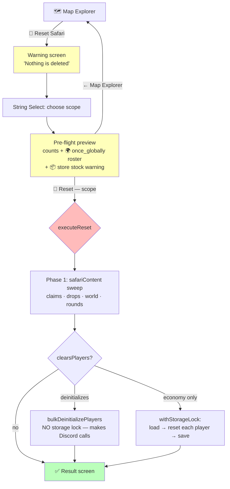

# 🔄 Reset Safari

**Status**: 🚧 Built, deployed to TEST (not yet in production)
**Entry point**: `/menu` → Safari → Map → **🔄 Reset Safari** (red, Map Explorer row 2)
**Code**: [safariReset.js](../../safariReset.js) · claim primitives in [claimsManager.js](../../claimsManager.js) · button in [mapExplorer.js](../../mapExplorer.js)
**Tests**: `tests/safariReset.test.js` (45), `tests/claimsManager.test.js`
**Related**: [SafariUsageLimits](../03-features/SafariUsageLimits.md) (where claims live) · [SafariMapDrops](../03-features/SafariMapDrops.md) · [SurvivorContext](../concepts/SurvivorContext.md) (why hosts care about `once_globally`)

---

## 🤔 The problem

A host spends days testing a Safari before a season launches. By the time they're happy, the world is full of residue:

- every `once_globally` idol has been claimed by a tester and will never fire again
- every chest on the map is marked opened
- testers are walking around with loot, currency and drained stamina
- the round counter is at 4 and the attack queue is full of test attacks

None of that is visible anywhere, and undoing it meant opening **Player Claims** on every single outcome, one at a time. For a 60-outcome Safari that's an afternoon of clicking — and there was no way to even *know* which outcomes had been claimed.

## 🔴 The invariant

> **Reset Safari never deletes authored content.** Actions, Items, Stores, Enemies, Attributes, Maps and Challenges all survive every scope untouched. A reset only clears the **play state recorded against them** — who claimed what, who owns what, who has been where.

This is enforced by a dedicated test (`THE INVARIANT: content is never deleted`) that snapshots every entity collection before a full sweep and asserts it is byte-identical after. If you add a code path here that removes an authored entity, that test fails — and it should.

## 🎯 The three scopes

Each is a strict superset of the one before. Two booleans on `RESET_SCOPES` (`clearsPlayers`, `deinitializes`) are the *only* behavioural switches; everything else is copy.

| | 🧪 **Testing Reset** | 🧹 **Full Server Reset** | 🚪 **Full Reset + Remove Players** |
|---|:---:|:---:|:---:|
| Action outcome claims (`limit.claimedBy` / `limit.claims`) | ✅ | ✅ | ✅ |
| Map item-drop claims (`itemDrops[].claimedBy`) | ✅ | ✅ | ✅ |
| Opened chests / triggered events / discovered secrets | ✅ | ✅ | ✅ |
| Player inventory, currency, history, cooldowns | — | ✅ | ✅ |
| Stamina / HP / attributes (`entityPoints`) | — | ✅ | ✅ |
| Round counter + attack queue + sales counters | — | ✅ | ✅ |
| Players removed from the map, channel access revoked | — | — | ✅ |
| **Players stay on the map** | ✅ | ✅ | ❌ |

- **🧪 Testing Reset** — "let me run the whole thing again." Testers keep their items, currency, stamina and position; only the world's memory of who claimed what is wiped.
- **🧹 Full Server Reset** — everyone back to starting currency + default items, points restored, but still standing where they are. Deliberately does **no** channel-permission churn and posts no arrival messages.
- **🚪 Full Reset + Remove Players** — the pre-launch clean slate. Delegates to the existing `bulkDeinitializePlayers` so channel-permission and `entityPoints` cleanup live in exactly one place. Per-player **starting locations are preserved**, so the real cast can be placed with **🦁 Start Safari** afterwards.

## 🖥️ The flow

Nothing is destroyed until the red confirm button on the **preview** screen. The scope rides in that button's `custom_id` (`safari_reset_go:<scope>`), so the flow is stateless — no in-memory selection to lose on restart.

## 🔍 The pre-flight preview

The point of the preview is that a host cannot see this state anywhere else. It reports:

- **counts** — total claims, how many of the guild's limited outcomes hold them, item-drop claims, world flags, players and their aggregate inventory/currency
- **🌍 the `once_globally` roster** — every globally-limited outcome with its **map coordinate**, the item it hands out, and who currently holds it (`D1 🗿 Give 1x Office Key — claimed by @Reece`). This is the section hosts actually asked for: in ORG play, `once_globally` is where hidden advantages live ([SurvivorContext](../concepts/SurvivorContext.md)), there are usually fewer than five per server, and getting one wrong decides a season. Claimed entries **sort first** so they survive any char-budget truncation.
- **📦 store stock** — see below
- **what is left alone** — spelled out per scope, because "reset" means different things to different hosts

### ⚠️ Store stock is reported, never reset

CastBot records only an item's **current** `stock` on a store row (`stores[id].items[].stock`); there is no `originalStock` anywhere. A reset therefore has nothing to restore *to* — guessing would be worse than doing nothing.

So the preview lists every store item with a finite stock level (`undefined` / `null` / `-1` all mean unlimited) sorted **lowest first**, and tells the host to fix them by hand. If an item shows a number at all, it has at some point been made finite, so it's exactly the set worth reviewing.

**Do not "fix" this by inventing an original level.** Adding real restock support means adding an `originalStock` field and a migration — a separate piece of work.

## 🗄️ What lives where

The single most useful thing this document records: Safari play state is spread across **two stores and five shapes**.

| State | Location |
|---|---|
| Action outcome claims | `safariContent[guild].buttons[id].actions[i].config.limit` — `claimedBy` (array \| string \| object, by type) or `claims[]` for `custom` |
| **Map item-drop claims** | `safariContent[guild].maps[mapId].coordinates[coord].itemDrops[].claimedBy` — **a completely separate claim store**, easy to forget |
| Map world flags | `safariContent[guild].maps[mapId].globalState.{openedChests,triggeredEvents,discoveredSecrets}` |
| Stamina / HP / attributes | `safariContent[guild].entityPoints["player_<id>"]` — **authoritative**; `playerData…safari.points` is a legacy duplicate |
| Inventory / currency / history | `playerData[guild].players[id].safari` |
| Rounds & combat | `safariContent[guild].safariConfig.currentRound`, `.attackQueue`, `.roundHistory` |

`entityPoints` records are **deleted** rather than edited, because `initializeEntityPoints` only creates a record when one is **absent** — patching `current` in place would leave a stale record that survives the next init (the "3/999 after re-init" bug de-init already had to solve).

## ⚙️ Implementation notes

- **Storage lock** — the economy branch wraps its `load → mutate → save` cycle in `withStorageLock`, loading inside the lock and resolving `getStartingCurrency` before it. The de-init branch deliberately takes **no** lock: `bulkDeinitializePlayers` owns its own cycles and makes Discord API calls per player, which must never run inside the lock.
- **Public-message safety** — Map Explorer also renders publicly as **Prod Map**, and that public render includes row 2. The route therefore checks the parent message's ephemeral flag and only uses `updateMessage` when the parent is already private; from a public map it opens a private screen instead of replacing the shared map with a destructive admin panel.
- **Char + component budgets** — Components V2 allows 4000 characters across **all** text displays in one message. `packLines()` measures rather than counts, and `renderResetUI` is a pure synchronous function precisely so a test can throw a 200-global / 200-stocked-item guild at all three scopes and assert both the 40-component and 4000-char ceilings.
- **app.js stays a router** — all three interactions share one factory config and are sub-routed by `routeResetInteraction`. The build also extracted `safari_currency_reset_confirm` out of app.js into this module (it *is* a reset) and put its previously-unlocked playerData cycle under the storage lock — net effect, app.js **shrank**.

## 🚧 Deliberately out of scope

- **Store stock restoration** — needs an `originalStock` field; see above.
- **Challenge status** (`testing`/`active`/`paused`) — that's season configuration, not play state.
- **Undo** — there is none, in any scope. The warning copy says so; the tally screen is the only record.
- **`isPaused`** — pausing is a deliberate host action, so `full` leaves paused players paused (`wipe` clears it as a side effect of de-init).
- **Per-scope granularity** (e.g. "clear only `once_globally`") — the three-step ladder covers the observed use cases; per-outcome surgery already exists in **Player Claims**.
