# 🪟 Windows-Native Dev Workflow

**Status:** Implementation (repo side shipped; Windows machine setup pending)
**Related:** [RaP 0913 — RemoteDevTestBox](../01-RaP/0913_20260614_RemoteDevTestBox_Analysis.md), [TestInstanceBlueGreen](../03-features/TestInstanceBlueGreen.md)

## 🤔 What this is

Run Claude Code from a **Windows-native VS Code terminal** on the same laptop that hosts the WSL environment — without touching the WSL workflow. WSL remains the fully-functional rollback path.

**The core idea: Windows mode has NO local bot.** The Windows tree is an *edit + commit + push + deploy-to-test* surface. Your "dev bot" in Windows mode is the always-on **CastBot Test** app served by castbot-blue (`https://castbotblue.reecewagner.com`) — real domain, real SSL, no ngrok.

## 🗺️ Architecture: four trees, one bridge

```mermaid
flowchart LR
    subgraph Laptop
        WSL["🐧 WSL tree<br>/home/reece/castbot<br>dev-restart.sh<br>local bot + ngrok"]
        WIN["🪟 Windows tree<br>C:\\Users\\extre\\castbot<br>win-restart.js<br>NO local bot"]
    end
    GH[("GitHub main<br>(the ONLY bridge)")]
    BOX["🟦 castbot-blue (TEST)<br>/home/ubuntu/castbot<br>box-restart.sh<br>CastBot Test app"]
    PROD["🔴 PROD Lightsail<br>deploy-remote-wsl only,<br>with permission"]

    WSL <-->|push/pull| GH
    WIN <-->|push/pull| GH
    BOX <-->|push/pull| GH
    WSL -.->|ssh deploy| BOX
    WIN -.->|ssh deploy| BOX
    GH -.->|npm run deploy-remote-wsl| PROD

    style WSL fill:#2d5a2d
    style WIN fill:#1e4d6b
    style BOX fill:#1e4d6b
    style PROD fill:#6b1e1e
```



Same discipline as the existing laptop↔box pair (RaP 0913): **never leave any tree dirty; sync only through `main`**. The restart scripts `git add -A` the whole tree — a concurrent session's edits get swept into your commit.

## 🔧 What was added (repo side — all additive)

| File | Purpose |
|---|---|
| `.gitattributes` | `* -text` (no EOL translation ever — zero churn on the mixed-EOL repo) + `eol=lf` pins on `*.sh`, `scripts/hooks/*`, `.claude/hooks/*`, `scripts/dev/*.js`. Makes it impossible to commit CRLF into anything that executes on Linux, from any machine. |
| `scripts/dev/win-restart.js` | The Windows dev loop: commit → pull --rebase → push → tests → deploy TEST → Discord notify. Port of `dev-restart.sh` minus local-bot/ngrok stages. `-skip-tests` supported; `-dev-only` intentionally errors. |
| `scripts/dev/win-status.js` | Local git state vs origin/main + box HEAD/dirtiness/pm2 via one SSH call. |
| `package.json` | `win:restart` / `win:status` aliases (args need `--`: `npm run win:restart -- "msg"`; direct `node scripts/dev/win-restart.js "msg"` is the primary form). |
| `.vscode/tasks.json` | Stale Windows-era tasks (deleted `start-and-push.ps1`, ngrok default-build chain) replaced with Win Restart / Win Status / Test Box Logs tasks. |

**Explicitly NOT changed:** every `scripts/dev/*.sh`, `box-restart.sh`, `deploy-remote-wsl.js`, `notify-restart.js`, `.claude/hooks/*`, `scripts/hooks/pre-commit`, `.npmrc`, all runtime code. The WSL workflow is byte-identical.

## ✅ One-time Windows machine setup

1. **Install [Git for Windows](https://git-scm.com/download/win)** — required by Claude Code's Bash tool on native Windows. If asked about line endings, choose "Checkout as-is, commit as-is" (our `.gitattributes` governs regardless).
2. **Install Node 22 LTS** (Windows x64 installer, includes npm 10).
3. **Clone** (PowerShell):
   ```powershell
   git clone --config core.autocrlf=false https://github.com/extremedonkey/castbot.git C:\Users\extre\castbot
   ```
   ⚠️ Keep the clone **outside OneDrive-synced folders** — it will contain `.env` and SSH-adjacent material that must never cloud-sync.
4. **Verify EOLs** (Git Bash or PowerShell, in the clone):
   ```bash
   git ls-files --eol -- '*.sh' scripts/hooks/pre-commit   # every line: i/lf w/lf
   git status                                              # must be clean
   ```
5. **Install the Moai pre-commit hook** (fresh clones have none; the hook's self-sync only refreshes an installed copy) — Git Bash at repo root:
   ```bash
   cp scripts/hooks/pre-commit .git/hooks/pre-commit
   ```
6. **SSH setup** — Windows 10/11 ship the OpenSSH client:
   - In WSL, copy keys to the Windows side:
     ```bash
     mkdir -p /mnt/c/Users/extre/.ssh
     cp ~/.ssh/castbot-blue-key.pem ~/.ssh/castbot-key.pem /mnt/c/Users/extre/.ssh/
     ```
   - Create `C:\Users\extre\.ssh\config` with the same Host blocks as WSL's `~/.ssh/config` (`castbot-blue` is required; `castbot-lightsail` optional for prod ops).
   - Harden key ACLs — Windows OpenSSH **rejects** keys readable by other principals:
     ```powershell
     icacls C:\Users\extre\.ssh\castbot-blue-key.pem /inheritance:r /grant:r "extre:R"
     icacls C:\Users\extre\.ssh\castbot-key.pem /inheritance:r /grant:r "extre:R"
     ```
   - Test: `ssh castbot-blue "echo ok"`
7. **Copy `.env`** (only needed so `notify-restart.js` can post to #💎deploy; the loop degrades gracefully without it):
   ```bash
   cp /home/reece/castbot/.env /mnt/c/Users/extre/castbot/.env   # run in WSL
   ```
8. **`npm install`** in the clone. Expect and ignore: `npm warn Unknown project config "prefix"` (the repo `.npmrc` carries a WSL-only path; harmless on npm ≥9).
9. **Install Claude Code (native)** — PowerShell: `irm https://claude.ai/install.ps1 | iex` — then run `claude` from `C:\Users\extre\castbot`. Hooks + permissions arrive automatically via the committed `.claude/settings.local.json` (the two box hooks no-op off `/home/ubuntu/castbot`).
10. **Claude memory note:** WSL session memory (`/home/reece/.claude/projects/-home-reece-castbot/`) does **not** carry over; Windows uses `%USERPROFILE%\.claude\projects\...`. Optionally copy the memory dir from `\\wsl$\Ubuntu\home\reece\.claude\projects\-home-reece-castbot\` into the matching Windows path.
11. **VS Code:** open `C:\Users\extre\castbot` as a folder. Default PowerShell terminal is fine — Claude Code uses Git Bash for its Bash tool internally. `Ctrl+Shift+B` runs the Win Restart task.

## 🧪 Verification checklist (first Windows session)

1. `git config core.autocrlf` → `false`; EOL spot check from step 4 above.
2. `ssh castbot-blue "echo ok"` and `npm run logs-test` work.
3. Real smoke: add a trivial comment to `app.js` → `node scripts/dev/win-restart.js "Windows workflow smoke test"` → confirm: commit + push OK, all test suites pass, box deployed (`win-status.js` shows box HEAD == local HEAD, pm2 online), #💎deploy notification arrived, CastBot Test responds in Discord.
4. Moai hook fired on that commit (or pre-check: `bash .git/hooks/pre-commit` in Git Bash → exit 0).
5. Claude hooks: SessionStart/Stop no-op silently; asking Claude to run `grep foo app.js` in Bash gets blocked by `reject-bash-search.sh` with the "Use the Grep tool" message. *(If the hook errors instead of blocking cleanly, the contingency is a `sed -n` rewrite of its one `grep -oP` line.)*
6. No CRLF leaked: `ssh castbot-blue 'cd /home/ubuntu/castbot && git ls-files --eol -- "*.sh" | grep -v i/lf'` → empty.
7. Back in WSL: `./scripts/dev/dev-restart.sh "WSL regression check"` runs exactly as before.

## ⏪ Rollback (full retreat to WSL-only)

1. Delete `C:\Users\extre\castbot` and `C:\Users\extre\.ssh\castbot*.pem` (+ the config Host blocks). Done — WSL was never changed.
2. The repo commits are inert without a Windows clone: `.gitattributes` changed zero bytes of content, `win-*.js` are never invoked by any bash script, the npm aliases sit unused. Leave them, or revert via one commit through `dev-restart.sh`.

## 🛰️ Appendix: VS Code Remote-SSH into castbot-blue (alternative entry point)

Instead of (or alongside) the C:\ clone, Windows VS Code can work directly *on the box*:

1. Install the **Remote - SSH** extension. It reads `C:\Users\extre\.ssh\config`, so once setup step 6 is done, `castbot-blue` appears as a connect target.
2. Connect → Open Folder → `/home/ubuntu/castbot`.
3. The integrated terminal is on the box: `claude` CLI and `tmux` are already installed there; the box's own discipline already applies (`box-restart.sh` to finish, `box-session-sync.sh` SessionStart pull, `check-box-clean.sh` Stop gate). For a session that survives disconnects: `tmux attach -t vibe || tmux new -s vibe`, then `claude`.

**Caveats:**
- The box has **2 GB RAM** — vscode-server + extensions + Claude + the running bot compete; close the Remote-SSH window when idle, watch `free -m`.
- It's a **shared working tree with live TEST deploys**: any `dev-restart.sh`/`win-restart.js` run from the laptop auto-stashes uncommitted box edits mid-session (recover with `git stash list`, but it's disruptive).
- AWS round-trip latency on every keystroke in the terminal.

Good as an occasional entry point; the C:\ clone is the primary Windows surface.

## ⚠️ Risks / known edges

- **Three-tree `git add -A` collisions** — same hazard class as RaP 0913, now with a third tree. Discipline unchanged: never leave a tree dirty, sync only through main.
- **New files authored on Windows may be CRLF** — matches the repo's existing majority (mixed-EOL), harmless at runtime; everything dangerous is pinned LF by `.gitattributes`. Full normalization remains a deliberate future one-shot commit.
- **`.env` + `.pem` now exist on the Windows filesystem** — keep outside OneDrive; `.gitignore` already excludes both.
- **npm major versions** — the repo `.npmrc` `prefix` warning may become an error in a future npm major; the fix (move prefix to WSL user-level `~/.npmrc`) is tracked as optional follow-up.
