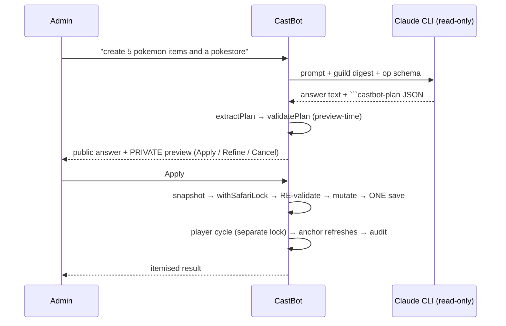

# 👾 Ask CastBot

**Status**: 🟢 Active on DEV / TEST / PROD (prod behind `CLAUDE_PROD_FEATURES=TRUE`)
**Modules**: [askCastBot.js](../../askCastBot.js) · [askCastBotWrite.js](../../askCastBotWrite.js) · [safariPlanSchema.js](../../safariPlanSchema.js) · [safariPlanApplier.js](../../safariPlanApplier.js) · [claudeRunner.js](../../claudeRunner.js) · [entitlements.js](../../entitlements.js) · [src/analytics/askLog.js](../../src/analytics/askLog.js)
**Design rationale**: [RaP 0890](../01-RaP/0890_20260730_AskCastBotEditMode_Analysis.md) — read this before changing the plan pipeline

> **One button does everything.** 👾 Ask CastBot answers questions, answers questions *about your players*, and **makes changes** — all from the same modal. There is no separate "Edit Safari" button; there was briefly, and it was merged away on 2026-07-29.

---

## What it does, by asker

| Asker | Gets |
|---|---|
| Anyone in an entitled guild (posted card) | Q&A about how CastBot works |
| **Admin** in an entitled guild | Q&A **+ player-data answers** ("who has the most items") **+ change proposals** with a private preview and Apply |
| Anyone else | Feature is invisible / denied |

"Admin" = any of ManageChannels · ManageGuild · ManageRoles · Administrator (`isAdminMember`, askCastBotWrite.js — a replica of app.js's `hasAdminPermissions`, which isn't exported).

## Access is runtime-configurable — 🎟️ Entitlements

Access is **not** hardcoded. `entitlements.json` holds per-guild grants of two features:

| Feature | Grants |
|---|---|
| `ask_castbot` | May use Ask CastBot at all |
| `safari_edit` | May additionally propose/apply changes (admins only) |

Managed from **Reece's Stuff → 🎟️ Entitlements**: add a guild by ID (name auto-resolves from the bot's server list and is persisted), toggle editing on/off, or remove access. No deploy needed — **this is the ko-fi/premium hook**: a payment webhook calls `grantFeature(guildId, ['ask_castbot','safari_edit'])`.

`ALLOWED_GUILD_IDS` in askCastBot.js is **deprecated** — it only seeds the registry on first run.

## Entry points

| custom_id | Where | Notes |
|---|---|---|
| `askcb_ask` | Tools → Special Features | Answers post publicly in the channel |
| `askcb_post` | Tools, beside Ask CastBot | Drops a standing 👾 card into a channel |
| `askcb_public_ask` | The posted card | Clickable by anyone who can see the channel |
| `askcb_plan_apply_*` / `_cancel_*` / `_review_*` | Preview card | Requester-bound, re-gated, one-shot |
| `askcb_edit_ctx_*` | Preview/result | Refine — reopens the modal with prior context |

---

## 🔒 The security model (do not weaken casually)

**The CLI is read-only by construction.** `CLI_TOOLS = 'Read,Glob,Grep'` is a hard allowlist passed to `claude --tools` — no Bash, no Write, and critically no Agent/Task (a subagent would route around the allowlist). `CLI_DENY` then blocks secrets (`.env`, `*.pem`, `.git`, `backups/`, both boxes' home dirs) **always, for everything**.

**The CLI never opens the data files.** `playerData.json` and `safariContent.json` hold *every* guild's data in one JSON, so read access is a cross-guild grant. Only `SUPER_READ_GUILD_IDS` (Reece's own servers, Tools route only) lift that. Every other guild's model works from a **digest the parent extracts and injects** — scoped to one guild by construction.

**The plan schema is the security boundary, not the prompt.** The model controls its output; `validatePlan` controls what the bot will accept. Every field, limit, coordinate and reference is checked — twice (see below).

**What a digest structurally cannot contain**: application answers, casting scores, `playerNotes`, DNC, offer status (all live under `playerData[guildId].applications`, not `players[userId]`) and whispers (a separate store).

---

## How a change is made

**Validated twice on purpose.** Once at preview, again *inside the lock* against freshly-loaded data. If the guild changed in between, Apply aborts with `PlanStaleError` and writes nothing.

**Mutators are no-throw by contract.** A throw mid-loop would leave the shared cache holding a half-applied plan; the validator's job is to make that impossible, with a defensive cache-drop as backstop.

**Never call self-locking functions inside the lock** (`updateCurrency`, `decrementStock`, self-saving `addItemToInventory`) — they take the lock themselves. Deadlock.

### Op catalog (v1)
`create_item` · `update_item` · `create_store` · `update_store` · `stock_item` · `set_stock` · `update_config` · `create_enemy` · `create_action` · `create_recipe` · `update_action` · `add_outcome` · `attach_action` · `update_map_cell` · `give_currency` · `give_item`

Full field reference: **[docs/askcastbot-kb/write-ops.md](../askcastbot-kb/write-ops.md)** (the model reads this too).

Notable semantics:
- **`$ref` dependencies** — a create declares `"ref": "pokestore"`, later ops use `"$pokestore"`. Refs must precede use. Plain strings must match an existing entity. **Nothing auto-creates**, so the preview never lies.
- **Recipes are Actions.** CastBot has no recipe entity: `create_recipe` builds has-item conditions + remove/give outcomes + `menuVisibility: 'crafting_menu'`, mirroring `buildCraftingLogic`.
- **`stock_item.price` sets the ITEM's price.** The engine charges `item.basePrice` everywhere; there are no per-store prices. A price change raises a preview warning.
- **`update_map_cell.emoji` renames the Discord channel** (emoji + title feed `deriveChannelName`), applied post-lock at 5.5s pacing.
- **`'global'` is never persisted** into `action.coordinates` — empty coordinates *means* global; storing the string materialises a phantom map cell via legacy sync flows.

---

## 🧠 Knowledge grounding

The model used to invent menu paths (it once cited "Entity Management → Items → Movement tab", which has never existed) because it grounded on framework docs describing *code*. Two fixes:

1. **[docs/askcastbot-kb/ui-paths.md](../askcastbot-kb/ui-paths.md) is inlined into every read prompt** — not "go read it", which the model reliably skipped. It's the only permitted source for click-by-click navigation, and it lists screens that don't exist.
2. **The deeper fix is Edit mode itself** — no navigation is needed when the bot does the thing.

## 📓 The event log

Every interaction appends to `logs/ask-castbot.jsonl` (gitignored). Purpose: see which questions are answered well and where the op schema falls short. Events: `ask.denied` · `ask.request` · `ask.answer` · `ask.error` · `plan.noplan` · `plan.rejected` (carries the validator's `errors[]`) · `plan.proposed` · `plan.applied` · `plan.cancelled` · `plan.apply_denied` · `plan.apply_failed`.

Join keys: `eid` (turn) · `cid` (conversation) · `parent_rid` (follow-up chain) · `pid` (propose → accept/reject). Abandonment is *derived* — a proposal with no terminal event.

⚠️ **Readers must stream or tail** (`utils/fileTail.js` + `utils/memoryGuard.js`). Parsing the whole file is [incident 06](../incidents/06-HeapDriftGCDeathSpiral.md)'s OOM. Details: [Analytics.md](../infrastructure-security/Analytics.md#-ask-castbot-event-log-jsonl).

## Models

Picker is centralised in `claudeRunner.js` (`buildModelSelectField` — one copy, shared with the Moai). Haiku · Sonnet (default) · Opus · ⛔ Fable. **Fable is restricted** via `RESTRICTED_MODELS`; a non-cleared user's question still posts publicly but gets a "contact Reece" reply instead of a run. Haiku is noticeably more conservative — it declines edits Sonnet will attempt.

## Concurrency & limits
`MAX_CONCURRENT = 2` (reads), `WRITE_MAX_CONCURRENT = 1`, `MAX_OPS_PER_PLAN = 60`, plan cache 5 entries / 30-min TTL, CLI hard-kill 13 min (inside Discord's 15-min token life).

---

## Known gaps

- **S3 sync of the event log** is written but unverified and unwired (`startAskLogSync()` has no caller); AWS provisioning is blocked on IAM permissions. Log is local-only.
- **No analysis or purge scripts yet** — `npm run asklog*` doesn't exist. The purge script is what would make the privacy policy's deletion promise real.
- **Privacy policy doesn't yet describe this feature**, and doesn't disclose Anthropic. See [RaP 0890](../01-RaP/0890_20260730_AskCastBotEditMode_Analysis.md#the-privacy-question-resolved-pragmatically).
- Deferred ops: deletes, attributes, scheduled actions, map creation.
- Follow-up context is a truncated text blob in the modal, not a real session — the CLI is stateless (`--print`, no `--resume`).

## Testing
`node --test tests/safariPlanSchema.test.js tests/safariPlanApplier.test.js tests/askCastBotWrite.test.js tests/askLog.test.js tests/askCastBot.test.js tests/claudeRunner.test.js tests/entitlements.test.js`
