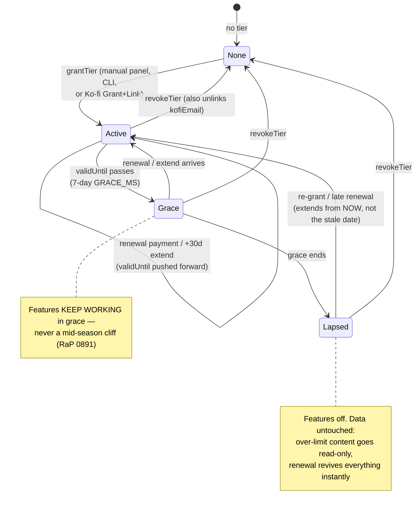
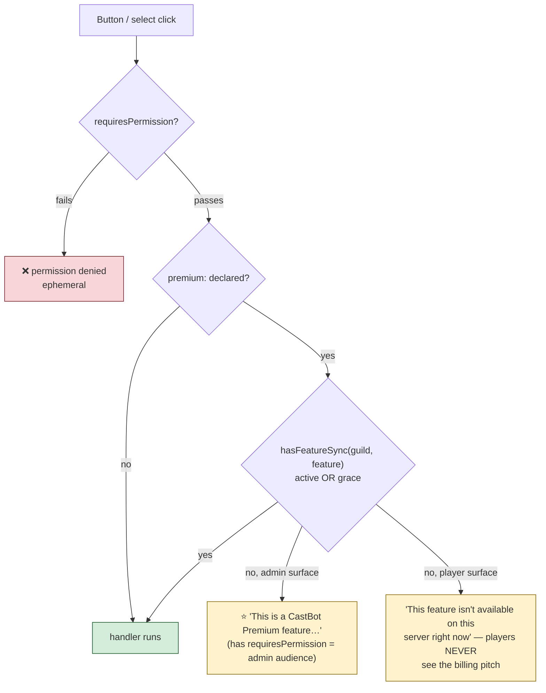
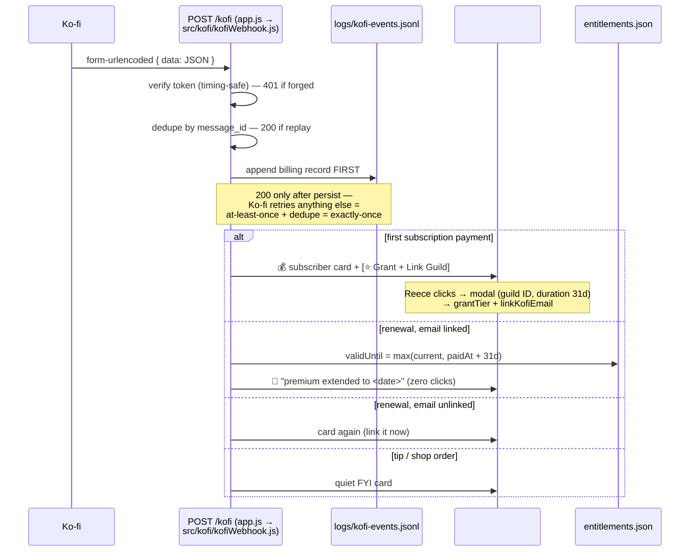

# 💎 CastBot Premium — Entitlements, Lapse Enforcement & Ko-fi Billing

**Status**: Core engine LIVE (entitlements v1 on prod since 2026-07-29; v2 tiers/expiry + Ko-fi ingestion on TEST since 2026-08-08, prod-ready pending Reece's deploy word). Subscriber self-service (activate/transfer/redeem) NOT yet built.
**Absorbs**: [RaP 0891](../01-RaP/0891_20260728_PremiumSubscriptions_Analysis.md) (design + decisions), its 2026-08-08 Ko-fi verification findings, and the implemented lapse-enforcement architecture.
**Code map**: [entitlements.js](../../entitlements.js) (engine) · [entitlementsUI.js](../../entitlementsUI.js) (admin panel) · [src/kofi/kofiWebhook.js](../../src/kofi/kofiWebhook.js) (billing ingestion) · [buttonHandlerFactory.js](../../buttonHandlerFactory.js) (`premium:` gate) · [scripts/entitlements-cli.js](../../scripts/entitlements-cli.js) (ops CLI)
**Tests**: `tests/entitlements.test.js` · `tests/entitlementsUI.test.js` · `tests/premiumDeclarations.test.js` (ratchet) · `tests/kofiWebhook.test.js`

---

## 🎯 The vision (from RaP 0891)

CastBot Premium is a **guild-scoped, transportable subscription**:

- **A subscription belongs to a Discord user** (the subscriber) and carries **one server activation**. The *benefits land on the server* — every co-host and player in an activated guild gets premium behavior; nobody but the subscriber deals with billing.
- **Transportable because ORGs live that way**: a new server every season ([SurvivorContext](../concepts/SurvivorContext.md)). The subscriber moves their slot to the new season's server (future: 7-day transfer cooldown blocks slot-sharing between concurrent servers).
- **One paid tier at launch** ("more activations" / a Network tier is the natural *future* upsell — zero new engineering, it's a field).
- **The provider never touches feature checks.** Ko-fi (or a manual comp, or any future provider) is only ever a *writer* to the local registry. A Ko-fi outage, a comped beta tester, and a paying subscriber are indistinguishable to every gate in the codebase.

### Why guild-scoped
Everything premium-worthy that CastBot stores is guild-keyed (Safari, castlists, seasons, bulk channel tools). A user-scoped premium would sell almost nothing and encourage one sub shared across N servers. Guild premium matches the data model, the competitors' convention, and the ORG lifecycle.

---

## 🏛️ Architecture: one file, one check, lazy expiry

**Truth lives in `entitlements.json`** (gitignored, atomicSave with validation, Tier-2 Discord backup via backupService, fails CLOSED on corruption, forever-cached — this process is the only writer).

```jsonc
{
  "guilds": {
    "<guildId>": {
      "name": "EpochORG S14",
      "features": ["ask_castbot"],        // à-la-carte grants — PERMANENT (v1 semantics)
      "tier": "premium",                  // v2: tier grant
      "validUntil": 1787000000000,        // ms epoch · null = permanent
      "source": "manual",                 // "manual" | "subscription"
      "grantedBy": "391415444084490240", "grantedAt": 1786000000000,
      "reason": "Ko-fi: Jo <jo@example.com>",
      "kofiEmail": "jo@example.com"       // billing link — renewals auto-extend this guild
    }
  }
}
```

**The one check API** — every gate everywhere asks the same question:

```js
hasFeatureSync(guildId, feature)
// = feature ∈ entry.features (permanent à-la-carte)
//   OR tier is active-or-grace AND feature ∈ TIERS[tier].features
```

`TIERS` lives in code beside `FEATURES` (features are code anyway): `premium` currently bundles `ask_castbot` + `safari_edit`. Expiry is evaluated **lazily at check time** (`resolveTierState`) — no cron is needed for correctness; a future scheduled job only *notifies*.

### Tier lifecycle



Key engine functions ([entitlements.js](../../entitlements.js)): `grantTier` (duration or permanent) · `extendTier` (`max(validUntil, now) + ms` — extending a lapsed guild restarts from today; permanent = no-op) · `setTierValidUntil` (the test-stub primitive) · `revokeTier` (clears billing link too) · `parseDuration` (`30d / 12h / 45min / 2w / 3mo`, bare number = days, blank = permanent; bare `m` **rejected** as ambiguous — *minutes exist so expiry is testable in real time*).

---

## 🔒 Lapse enforcement: declare the gate, enforce centrally

**Doctrine: artifacts persist, clicks gate.** Nothing is deleted or swept on lapse — posted buttons, Safari content, castlists all stay. Every *interaction* is gated at click time, so renewal revives everything with zero cleanup. Enforcement is at the handler, never just the menu (incident 04 / RaP 0900 doctrine).



- **Declaration**: `premium: 'ask_castbot'` in `ButtonHandlerFactory.create()` config — checked centrally right after the permission check, denial via `sendPremiumDenied`. Denials log `⭐ [PREMIUM DENIED]`, and Ask CastBot denials also land in the ask event log (`ask.denied`) — **that's the lapsed-guild demand signal** for renewal nudges.
- **The ratchet** (`tests/premiumDeclarations.test.js`, securityDeclarations mold): every `premium:` value must be a real `FEATURES` key (a typo would fail-closed *forever*); `REQUIRED_PREMIUM_IDS` (`askcb_ask`, `askcb_post`) can't silently lose their gates; the factory gate's existence is asserted.
- **Non-factory surfaces** (modal submits, background jobs) check `hasFeatureSync` directly at execution time — for Ask CastBot that's the **money boundary**: deny before the Claude CLI ever spawns.

### 💳 The Premium menu paywall (public entry, 2026-08-08)

The ⭐ CastBot Premium button is **public** — always first in `/menu`'s Advanced row, for every admin (the old two-ID allowlist is gone; `tests/premiumMenu.test.js` now *fails if it comes back*). What the menu does depends on the guild:

- **Entitled guild** (`hasPremiumAccessSync`: tier active or grace) **or Reece**: the real menu, unchanged.
- **Everyone else**: the *same-looking* menu, but `buildPremiumMenu` **lock-swaps** every control's custom_id to `premium_locked_<original>` (`lockPremiumComponents`, pure + unit-tested) except `← Menu`, `Donate`, and `⭐ Get Premium`. One handler serves every locked click: the **upsell screen** — computed entitlement state for *this* server (none / lapsed <t:R> / grace), what Premium includes, the numbered Ko-fi purchase path, a `ko-fi.com/CastBot` link button, and a **🎟️ Redeem stub** (honest placeholder naming the interim activated-for-you path until self-service linking ships).

Why lock-swap instead of gating the real handlers: most Premium-menu buttons share custom_ids with the free Tools menu — handler-level gates would paywall Tools too. The swap is a **commercial** gate, not a security boundary (the features stay reachable via their own surfaces and gates); it's applied server-side at render, and the deliberately-open money path (`Donate`, `Get Premium`) never locks. Note `hasPremiumAccessSync` is **tier-only**: à-la-carte feature grants unlock their features (via `premium:` declarations) but not the premium menu surface.

### 🔀 The premium launch switch

`PUBLIC_ASK_REQUIRES_ENTITLEMENT = false` ([askCastBot.js](../../askCastBot.js)). While false, the **posted** Ask button's modal route deliberately bypasses the guild entitlement (Reece 2026-08-08: posted buttons stay open until premium launches; posting itself IS gated). **Flip to `true` on launch day** — lapsed guilds then stop burning Claude tokens through old posted buttons. One-word diff; the ratchet asserts the constant exists.

---

## 💰 Ko-fi billing ingestion (Phase 2-lite — LIVE on test)

Verified Ko-fi facts this design is built on (2026-08-08, dashboard + docs):
- The webhook **is the entire API** — no outbound messaging, so "bot DMs a code via Ko-fi" is impossible. The static per-tier **Welcome Message** (shown after first payment) is the only automated touchpoint — instructions/links only.
- **No cancellation/refund/expiry events exist.** Design is absence-based: no renewal → grace → lapse. Refund/chargeback = manual revoke.
- Ko-fi's Discord integration grants **and removes** a per-tier role automatically — the future "role bridge" identity option (removal = a machine-readable lapse signal).
- Membership checkout has **no supporter message field** — "type your Discord username at checkout" can't be primary.
- Discord native Premium Apps: **US/UK/EU payout only** — unavailable to an AU developer; re-check periodically.

### The flow



Operational properties: card-post failures never fail the webhook (the billing record is the non-negotiable part; a missed ping is recoverable from the JSONL). Dedupe survives restarts (rebuilt from the JSONL). The JSONL is gitignored (PII: emails) and Discord-backed (Tier 2) — it doubles as the **revenue/audit log** (`priceVersion`-style cohort reporting reads it, no provider API needed).

**Config**: `KOFI_VERIFICATION_TOKEN` in `.env` (route answers 503 if unset — safe on instances that shouldn't ingest). Webhook URL on ko-fi.com currently points at **TEST** (`castbotblue…/kofi`); flip to `castbotaws…/kofi` at prod launch. Notification channel: `#💎premium` (`1535490010831265832`).

**Smoke-tested live 2026-08-08**: synthetic payment → 200 + card + JSONL ✓ · duplicate replay → suppressed ✓ · forged token → 401 ✓.

---

## 🎛️ Admin operations (CastBot Premium menu → Utilities → 🎟️ Entitlements, red Reece-only button)

- **Manage list**: every entitled guild with feature glyphs + tier badge — `⭐ Premium` (permanent) · `⭐ Premium until <date>` · `🕒 GRACE ends <relative>` · `💀 lapsed`.
- **Add Guild** (v1, unchanged): permanent `ask_castbot`+`safari_edit` feature grant by ID — how the original whitelist guilds are comped.
- **⭐ Premium & expiry testing select** → per-guild detail screen: full tier state with Discord timestamps, then
  **Grant/Update Premium** (modal: duration + audit reason) · **+30 days** · **Revoke Tier** · and the **expiry test stubs**:
  - 🧪 **Expire Now** — `validUntil = now − 1s` → guild instantly in grace
  - 💀 **Lapse Now** — `validUntil = now − 7d − 1s` → fully lapsed
  The stubs are real `validUntil` writes through the real save path — **what expires in test is exactly what expires for a paying customer**. Full lifecycle rehearsal: grant `2min` → watch active → grace → Lapse Now → watch the Ask button deny.
- **Ops CLI** (`scripts/entitlements-cli.js`): `list / show / grant / extend / expire / lapse / revoke-tier`. Reads always safe; **writes only with the bot stopped** (the registry cache is single-writer — the running bot won't see CLI writes and would clobber them).

---

## 💵 Pricing

| Aspect | Current state |
|---|---|
| Ko-fi tier | **"CastBot Premium" — A$3/month minimum** ("supporters can choose to pay more"), benefits: Beta features, Early access, Discord access, hands-on support |
| RaP recommendation | Single tier **US$6/mo** (splits the $3/$7 instinct, under the $9.99 competitor line). A$3 is a beta-friendly implicit decision — revisit before public launch |
| Price ramping | **Price never appears in bot code.** New price = new Ko-fi tier mapped to the same `tier: 'premium'`; existing members keep their joined price (grandfathering = a *billing* fact, never an *entitlement* fact — features key off `tier`, never price-era) |
| Future tiers | Slot in by name (e.g. Network, more activations = a `maxActivations` field), never by replacing |

**Decisions still open** (RaP defaults in brackets): launch price [US$6] · launch premium shelf beyond Ask CastBot [Channel Admin + Alliances + Archive + raised Safari limits] · grandfather policy [keep-your-price while continuously subscribed]. **Decided in code**: grace 7d · single `premium` tier · guild-scoped model.

---

## 🚀 Remaining roadmap

| Step | What | Status |
|---|---|---|
| Prod rollout of v2+Ko-fi | Deploy (Reece's word) · token into prod `.env` (Reece) · flip Ko-fi webhook URL to prod | ⏳ |
| Launch flip | `PUBLIC_ASK_REQUIRES_ENTITLEMENT = true` (one word, ratchet-guarded) | ⏳ launch day |
| Launch shelf | Convert chosen features/limits to `FEATURES` keys + `TIERS.premium` | ⏳ decision #5 |
| Subscriber self-service | `subscribers` block, Status/Activate/Transfer (7d cooldown), real Redeem behind the shipped 🎟️ stub | ⏳ Phase 2 full |
| Identity bridge | Ko-fi Discord role sync watcher (`GuildMemberUpdate` in home server) — primary linking + push lapse signal | ⏳ Phase 2 full |
| Renewal nag | Grace is currently silent to the guild — decide surface/tone | ⏳ decision |

## 📎 Related

- [RaP 0891 — Premium Subscriptions design](../01-RaP/0891_20260728_PremiumSubscriptions_Analysis.md) (the full decision matrix this doc operationalizes)
- [AskCastBot.md](AskCastBot.md) — the flagship premium feature · [RaP 0900](../01-RaP/0900_20260711_SecurityArchitectureOptions_Analysis.md) — gates-in-handlers doctrine
- [BackupStrategy.md](BackupStrategy.md) — entitlements.json + kofi-events.jsonl Tier-2 classification

---

**Last Updated**: 2026-08-08
