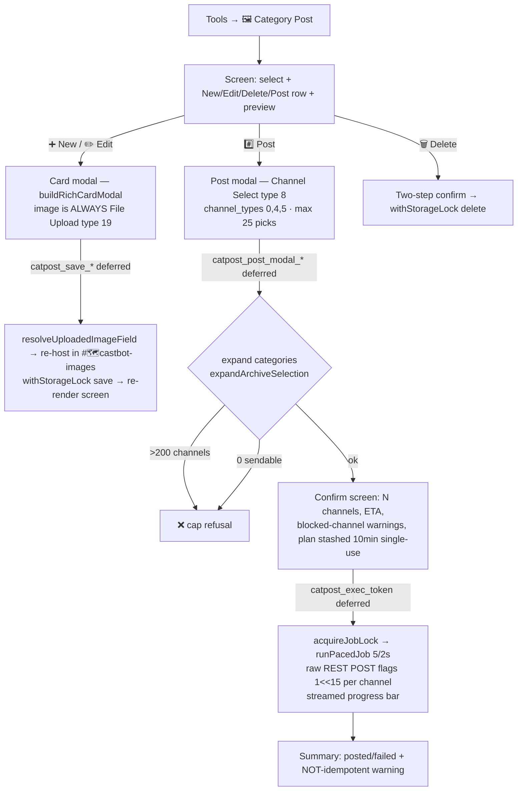

# 🖼️ Category Post

**Status**: Active (TEST) · **Module**: [src/posts/categoryPost.js](../../src/posts/categoryPost.js) · **Entry**: Tools → 🐙 Special Features → 🖼️ Category Post (ManageRoles)

Saved, editable rich cards (title / content / accent color / image) that an admin can post to up to 25 picked channels **or whole categories** — categories expand to every text channel inside them — with a confirm screen showing the true blast radius, then a paced, streamed send. The typical use: post an announcement card into every player's confessional in one click (24+ channels = max players in a game).

Grew out of the Rich Card demo (Reece's Stuff → retired 2026-07-21; `richcard_demo*` handlers, registry entries, and menu button all removed — richCardUI.js itself remains, shared by challenges/channels/this).

## Flow

## Storage

`playerData[guildId].categoryPosts = { [catpost_{12hex}]: { title, content, color, image, createdBy, createdAt, lastModified } }` — all writes via `withStorageLock`; the image re-host (network) runs **before** the lock, never inside it.

## Design decisions

| Decision | Why |
|---|---|
| Image is **always** a File Upload (guild `imageUploadMode` ignored) | Explicit requirement: the legacy paste-URL format is completely removed for this feature. `buildRichCardModal({ imageUploadMode: 'uploadComponent' })` hardcoded; 0 files on edit = keep current image |
| Confirm screen before posting (not direct post) | User-confirmed choice. Categories expand silently (25 picks → potentially 100+ channels), and a broadcast is **not idempotent** — re-running posts a second copy. Same reasoning as the channels-broadcast composer |
| Cap: `MAX_EXPANDED_CHANNELS = 200` | At PACE_SEND (5 posts / 2s) that's ~80s — comfortably inside the 15-minute interaction-token window the progress stream rides on. Over-cap plans are refused with the count, never silently truncated |
| Plan lives in a server-side Map (10-min TTL, single-use, per-user token) | custom_id has a 100-char cap; single-use kills double-click double-posts. Pattern lifted from channelsHandlers stashPlan/takePlan |
| Standard **ManageRoles** gate on every handler | This is a general admin feature — deliberately NOT the channels feature's Reece whitelist |
| Channel Select with `channel_types: [0,4,5]` inside a **modal** | First modal-hosted category-capable channel select in the codebase (the channels composer uses a message). Works per Discord's modal-select support; if a client regression ever bites, the fallback is moving the select into an ephemeral message (isolated to `buildCatpostPostModal`) |

## Reuse map (what this feature does NOT reimplement)

- `richCardUI.js` — `buildRichCardModal` / `extractRichCardValues` / `buildRichCardContainer` (card modal, submit parsing, posted container)
- `channelArchiver.js` `expandArchiveSelection` — pure category→children expansion, dedupes category+child double-picks
- `src/channels/channelJob.js` — `runPacedJob` (paced sends + streamed progress bar via webhook PATCH), `acquireJobLock`/`releaseJobLock` (one broadcast per guild at a time)
- `src/channels/channelAdminConfig.js` — `PACE_SEND`, `PLAN_TTL_MS` constants
- `src/images/modalImageUpload.js` — `resolveUploadedImageField` (validate → download → re-host in `#🗺️castbot-images`)

## Handlers (all app.js-routed, thin; bodies in the module)

Buttons: `category_post`, `catpost_select`, `catpost_new`, `catpost_edit_*`, `catpost_delete_*` → `catpost_delete_confirm_*`, `catpost_post_*`, `catpost_exec_*` (deferred).
Modal submits: `catpost_save_*` (deferred — image re-host), `catpost_post_modal_*` (deferred — guild fetch + expansion), `catpost_search_modal`.
Routing gotcha: `catpost_delete_confirm_` is matched **before** `catpost_delete_` (startsWith collision); same for `catpost_post_modal_` (modal section) vs `catpost_post_` (button section).

## Tests

[tests/categoryPost.test.js](../../tests/categoryPost.test.js) — screen states (empty/selected/search/25-cap), card modal upload-only invariant, post-modal select shape, plan-stash lifecycle (single-use, non-transferable, TTL), cap refusal, delete confirm.
