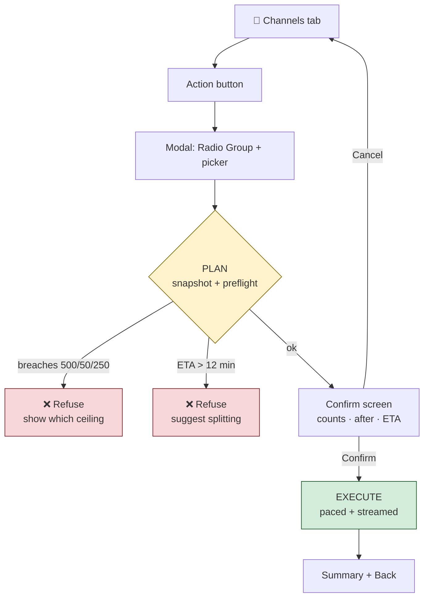
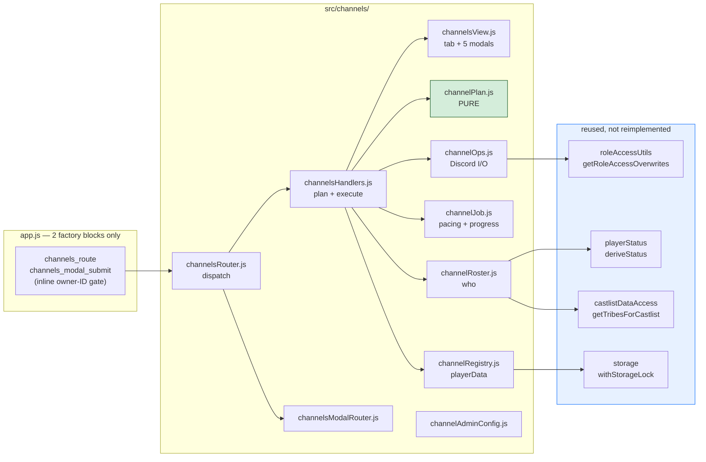
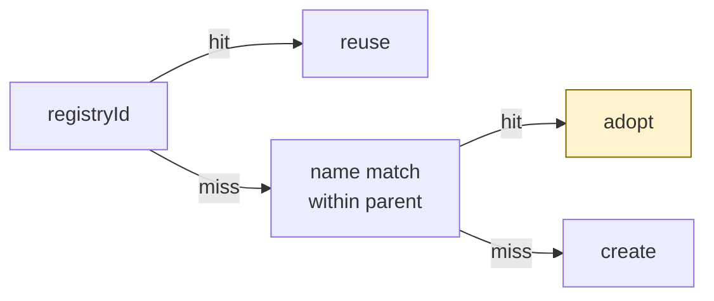

# 🔐 Channel Administration

**Status**: Hidden / in development — visible only to `391415444084490240` and `1086246253819613274`
**Entry point**: `/menu` → Production Menu → Season Manager → **🔐 Channels** tab
**Code**: [`src/channels/`](../../src/channels/)
**Domain background**: [SurvivorContext.md](../concepts/SurvivorContext.md#the-org-domain)

---

## 🤔 What this is

ORG hosts create the same channels by hand every season: a confessional per player, a subs channel per player, a 1on1 channel per *pair* of players on a tribe, a personal role per player, and a Trusted Spectator role. A 16-player season is ~150 channels — and a tribe swap means doing the 1on1s again.

This automates it, and provides the **atomic channel/role primitives** the rest of CastBot never had. Before this, the shape `[{id: everyone, deny:[ViewChannel]}, ...roleAccessEntries]` was hand-rolled at four call sites, none of which checked Discord's guild ceilings.

The tab clones the Marooning tab's chrome and is expected to absorb the Marooning tab button in future.

## 🎯 The five actions

| Button | What it does |
|---|---|
| 🔐 **Roles** | Sets the server's single Trusted Spectator role |
| 🎭 **Player Roles** | One personal Discord role per player (the voted-out kill switch) |
| 🎙️ **Confessionals** | Create / update / delete `#name-confessional` |
| 🗳️ **Subs** | Create / update / delete `#name-subs`, or **convert application channels** into subs |
| 🤝 **1 on 1s** | A private channel for every *pair* of players in a tribe |

## 🏛️ Two-phase: nothing happens until you confirm

Every action is **plan → confirm → execute**. A modal submit never mutates Discord; it builds a preflight and shows you exact counts, guild-after totals, and an ETA. This matters because these jobs are big and irreversible.



The plan is stashed server-side in a Map keyed by a short token — **not** in the `custom_id`, which has a hard 100-char limit (10 role IDs alone is ~190 chars). Plans are single-use and expire after 10 minutes.

## 🧱 Architecture



**Why the `create()` blocks stay in app.js**: two repo ratchets only scan `app.js` — the pre-commit legacy-handler counter (which wants `ButtonHandlerFactory.create` within 3 lines of the `} else if (custom_id`) and `tests/securityDeclarations.test.js` (which wants a gate *textually inside* the create block). So app.js keeps the two thin factory blocks with the inline owner-ID gate, and `channelsRouter.js` takes the body. app.js is also under a shrink-only line ratchet, which is why the bodies can't live there.

`channelPlan.js` is pure (no Discord/storage imports), which is why it carries the whole unit-test surface — `tests/channelPlan.test.js` imports the real functions rather than replicating them.

## 🔁 Idempotency: re-running IS the resume

Every operation is an upsert. `ensureChannel` resolves identity in this order:



Step 2 — **adopt by name** — is the whole interruption story. A run that dies halfway leaves channels the next run adopts instead of duplicating, *even if the registry never recorded them*. There is no resume state machine; you just run it again.

> This is a deliberate improvement on `mapExplorer.js:1602`, which persists channel IDs only *after* its whole loop completes — so an interrupt there orphans every channel it made.

The registry is flushed **every 5 items** (between Discord batches, never during — `withStorageLock` forbids network calls inside the lock and isn't re-entrant). A failed flush re-queues its deltas and the next flush retries.

## 🔑 Permission model

| Channel | Player | Trusted Spectator | Host (`globalRoleAccess`) |
|---|---|---|---|
| 🎙️ Confessional | player role **XOR** user | ✅ read + react, **no posting** | ✅ |
| 🗳️ Subs | player role **AND** user | ❌ | ✅ |
| 🤝 1on1 | both players, role-preferred | ❌ | ✅ |

- **Role-preferred** means: use the player's `playerRoleId` if that role is live, else grant the user directly (and clear the dead pointer). That's what makes removing one role strip a voted-out player from everything.
- **Subs deliberately grants both** — belt-and-braces against accidental lockout.

⚠️ **`mergeOverwrites` is mandatory.** A duplicate overwrite ID makes Discord reject the *entire* `channels.create()` with a 400 — and the Trusted Spectator role is very likely *also* in `globalRoleAccess`. `roleAccessUtils` only dedupes `@everyone` (`roleAccessUtils.js:51`).

## 💾 Data model

```jsonc
playerData[guildId].permissions.trustedSpectatorRoleId = "<roleId>"  // beside globalRoleAccess
playerData[guildId].players[userId].playerRoleId       = "<roleId>"  // vanityRoles[] is the precedent

playerData[guildId].channelAdmin = {
  version: 1,
  "<configId>": {                       // confessionals/subs are SEASON-scoped
    confessionals: { "<userId>": { channelId, name, categoryId, createdAt } },
    subs:          { "<userId>": { channelId, name, createdAt, convertedFrom } },
    categories:    { confessional: ["catId"], subs: ["catId"] },
    lastRun:       { "<action>": { at, userId, created, skipped, failed } }
  },
  oneOnOnes:  { "<pairKey>": { channelId, name, a, b, tribeRoleId, createdAt } },  // GUILD-scoped
  oneOnOneCategories: ["catId"]
}
```

Two deliberate choices:
- **`oneOnOnes` is keyed globally by `pairKey`, not nested under `tribeRoleId`.** After a tribe swap the same pair reappears in a new tribe; global keying makes that adopt the existing channel instead of creating a second one.
- **`pairKey` is BigInt-sorted user IDs** (`${lo}_${hi}`), never names. Snowflakes vary in length, so string sorting puts `'999…'` (17 digits) *before* `'1000…'` (18 digits) — two different keys for one pair, i.e. duplicate channels.

## ⚠️ The conversion hazard (read before touching Subs)

`buildStatusSignals` (`playerStatus.js:74-75`) derives **withdrawn** (`/^✖️/`) and **submitted** (`/^☑/`) *exclusively from the live channel name* — there is no `withdrawn` data field, and `app.channelName` is stale.

So renaming `☑️reece-app` → `reece-subs` **silently and permanently destroys that signal** across Casting, Marooning and ÜberStatus. Three mitigations, all required:

1. **Refuse** to convert any app whose live name starts with `✖️` (withdrawn).
2. Before renaming, persist `app.completedAt` (the data-field signal `deriveStatus` already honours first) and `app.preConvertChannelName`.
3. Record `app.convertedToSubsAt`.

`tests/channelsSelector.test.js` pins this: without the `completedAt` stamp a converted player's status collapses to `new`.

## 📊 Scale — this is the main design constraint

1on1s are combinatorial, against a hard ceiling of **500 channels / 50 categories / 250 roles** per guild, at ~1 channel/sec:

| Tribe | 1on1 channels | Categories | Time |
|---|---|---|---|
| 8 | 28 | 1 | ~30s |
| 12 | 66 | 2 | ~1 min |
| 16 | 120 | 3 | ~2 min |
| 20 | 190 | 4 | ~3 min |
| 24 | 276 | 6 | ~5 min |

`preflightBudget` refuses anything that would breach a ceiling and names which one. Jobs estimated over **12 minutes** are refused too (the interaction token dies at 15).

Note the *two different 50s*: 50 categories per guild, and 50 channels per category. `planCategoryBuckets` handles the latter (overflowing into `1 on 1s 2`, `1 on 1s 3`…) and tops up a partially-filled category first.

## 🚧 Known constraints

- **Renames: 2 per 10 minutes, per channel.** Renaming is best-effort and never fails a job — the channel is still permissioned and registered, and reported as `renamePending`.
- **Concurrency**: an in-memory `jobLocks` map keyed `${guildId}:${action}` refuses a second simultaneous run. `withStorageLock` can't help here — a bulk run spans Discord calls, so its read-then-create is TOCTOU.
- **Delete never name-matches guild-wide.** It only touches registry entries and children of CastBot's own categories, and lists every channel by name on the confirm screen.
- **Bots and departed members are dropped** — a spectator bot in a tribe role would otherwise generate n−1 useless channels.
- **Progress rides the webhook token**, not channel posts, so it survives deleting the channel you ran the job from. A 401 (expired token) is swallowed; the registry and the tab's `lastRun` line are the durable record.

## 🔒 Gating

Visible only to `CHANNEL_ADMIN_USER_IDS` (`channelAdminConfig.js`). Two layers, because **`restrictedUser` in BUTTON_REGISTRY enforces nothing** (RaP 0900 — it's documentation wearing a security costume):

1. **Display**: `buildSeasonNavRow(configId, active, userId)` appends the tab only when whitelisted.
2. **Enforcement**: an inline ID check inside every handler. This also satisfies the deploy-blocking ratchet in `tests/securityDeclarations.test.js`.

The nav row is now **exactly 5 buttons** — Discord's hard per-ActionRow limit. There is no room for a sixth tab.

## 🧪 Tests

| File | Covers |
|---|---|
| `tests/channelPlan.test.js` | slugs, names ≤100, BigInt pair keys, pair combinatorics, overwrite merging, budget ceilings, category bucketing, collisions |
| `tests/channelRegistry.test.js` | delta application, idempotency, season vs guild scoping, dead-role clearing, the conversion signal stamp |
| `tests/channelsSelector.test.js` | the whitelist gate, 4-vs-5 tab rendering, Edit-origin round trip, roster resolution via the real status engine |

## 🔮 Not built yet

- **Alliances** — extremely sensitive; the primitives support it, but no alliance UI/data ships.
- **Player role colour** — the `color` parameter is plumbed through `ensurePlayerRole` and defaults to `0` (uncoloured).
- Merging 🔐 Roles into Settings → Roles & Security.
- Season-scoped `playerRoleId` (currently guild-scoped, so a returning player reuses their old role).

## 📎 Related

- [SurvivorContext.md](../concepts/SurvivorContext.md) — what confessionals/subs/1on1s/alliances actually are
- [SeasonManager.md](SeasonManager.md) — the tab chrome this clones, and the casting status fields
- [RolesSecurity.md](RolesSecurity.md) — `globalRoleAccess`, reused here for host access
- [SafariMapSystem.md](SafariMapSystem.md) — the prior (unabstracted) bulk channel creation
